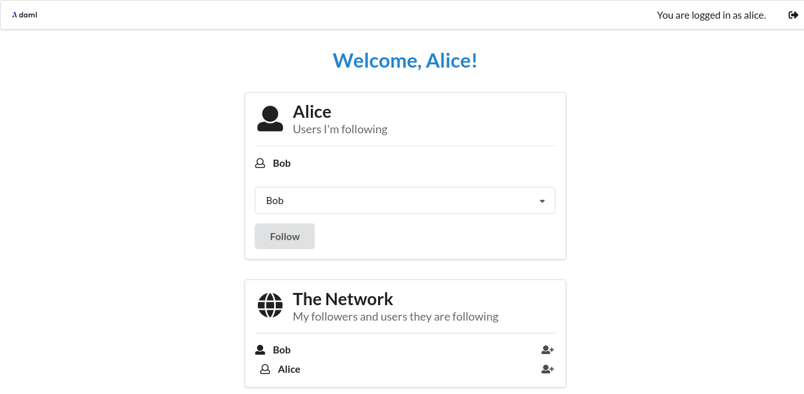

..
   Copyright (c) 2023 Digital Asset (Switzerland) GmbH and/or its affiliates.
..
   Proprietary code. All rights reserved.

.. _use-daml-sdk:

Daml SDK and Canton
===================

This tutorial shows how to run an application on a
distributed setup using Canton instead of running it on the `Daml sandbox <https://docs.daml.com/tools/sandbox.html>`__.
This comes with a few known problems and this section explains how to work around them.

In this tutorial, you will learn how to run the
`Create Daml App <https://docs.daml.com/getting-started/index.html>`__ example on Canton. This guide will teach you:

#. The main concepts of Daml
#. How to compile your own Daml Archive (DAR)
#. How to run the Create Daml App example on Canton
#. How to write your own Daml code
#. How to integrate a conventional application with Canton

If you haven't yet done so, please run through the ":ref:`Getting Started with Canton <canton-getting-started>`" and the original `Daml getting started guide <https://docs.daml.com/getting-started/index.html>`__ to
familiarise yourself with the example application. Then
come back here to get the same example running on Canton.

Starting Canton
---------------

Follow the `Daml SDK installation guide <https://docs.daml.com/getting-started/installation.html>`__ to get
the SDK locally installed.

This guide has been tested with the SDK version 2.5.1. Set the environment variable ``DAML_SDK_VERSION`` to ``2.5.1`` so that
subsequent ``daml`` commands use this version.

.. code-block:: bash

    export DAML_SDK_VERSION=2.5.1

Starting from the location where you unpacked the Canton distribution, fetch the create-daml-app example into a directory
named ``create-daml-app`` (as the example configuration files of ``examples/04-create-daml-app`` expect the files to be there):

.. code-block:: bash

    daml new create-daml-app --template create-daml-app

Next, compile the Daml code into a DAR file (this will create the file ``.daml/dist/create-daml-app-0.1.0.dar``), and
run the code generation step used by the UI:

.. code-block:: bash

    cd create-daml-app
    daml build
    daml codegen js .daml/dist/create-daml-app-0.1.0.dar -o ui/daml.js

You will also need to install the dependencies for the UI:

.. code-block:: bash

    cd ui
    npm install

Next, the original tutorial would ask you to start the Sandbox and the HTTP JSON API with ``daml start``.
We will instead start Canton using the distributed setup
in ``examples/04-create-daml-app``, and will later start the `HTTP JSON API <https://docs.daml.com/json-api/index.html>`__ in a separate step.

Return to the directory where you unpacked the Canton distribution and start Canton with:

.. code-block:: bash

    cd ../..
    bin/canton -c examples/04-create-daml-app/canton.conf --bootstrap examples/04-create-daml-app/init.canton

.. note::

    If you get an ``Compilation Failed`` error, you may have to make the Canton binary executable with ``chmod +x bin/canton``

This will start two participant nodes, allocate the parties Alice, Bob and Public and create
corresponding users ``alice`` and ``bob``. Each participant node will expose its own ledger API:

#. Alice will be hosted by participant1, with its ledger API on port ``12011``
#. Bob will be hosted by participant2, with its ledger API on port ``12021`` 

Note that the ``examples/04-create-daml-app/init.canton`` script performs a few setup steps to permission the parties and upload the DAR.

Leave Canton running and switch to a new terminal window.

Running the Create Daml App Example
-----------------------------------

Once Canton is running, start the HTTP JSON API:

* Connected to the ledger api on port ``12011`` (corresponding to Alice's participant)
* And connected to the UI on the default expected port ``7575``

.. code-block:: bash

    DAML_SDK_VERSION=2.5.1 daml json-api \
        --ledger-host localhost \
        --ledger-port 12011 \
        --http-port 7575 \
        --allow-insecure-tokens

Leave this running. The UI can then be started from a third terminal window with:

.. code-block:: bash

    cd create-daml-app/ui
    REACT_APP_LEDGER_ID=participant1 npm start

Note that we have to configure the ledger ID used by the UI to match the name of the participant that we're running against.
This is done using the environment variable ``REACT_APP_LEDGER_ID``.

We can now log in as ``alice``.

Connecting to participant2
~~~~~~~~~~~~~~~~~~~~~~~~~~~~~~~~~~~

You can log in as Bob using ``participant2`` by following essentially the same process as for participant1, adjusting the ports to
correspond to ``participant2``.

First, start another instance of the HTTP JSON API, this time using the options ``-- ledger-port=12021`` and ``--http-port 7576``.
``12021`` corresponds to participant2's ledger port, and ``7576`` is a new port for another instance of the HTTP JSON API:

.. code-block:: bash

     DAML_SDK_VERSION=2.5.1 daml json-api \
        --ledger-host localhost \
        --ledger-port 12021 \
        --http-port 7576 \
        --allow-insecure-tokens

Then start another instance of the UI for Bob,
running on port ``3001`` and connected to the HTTP JSON API on port ``7576``:

.. code-block:: bash

    cd create-daml-app/ui
    PORT=3001 REACT_APP_HTTP_JSON=http://localhost:7576 REACT_APP_LEDGER_ID=participant2 npm start

You can then log in with the user id ``bob``.

Now that both parties have logged in, you can select ``Bob`` in the
dropdown from Alice’s view and follow him and the other way around.

After both parties have followed each other, the resulting view from
Alice’s side will look as follows.

Note that create-daml-app sets up human-readable aliases for party ids,
which is why we can use those names to follow other parties instead of
their party id.

What Next?
----------

Now that you have started to become familiar with Daml and what a full Daml-based solution looks like, you can build your
own first Daml application.

#. Use the `Daml language reference docs <https://docs.daml.com/daml/reference/index.html>`__ to master Daml and build your own Daml model.
#. Test your model using `Daml scripts <https://docs.daml.com/daml-script/index.html>`__.
#. Create a simple UI following the example of the `Create Daml App <https://docs.daml.com/getting-started/index.html>`__ template used in this tutorial.
#. See how to compose :ref:`workflows across multiple Canton sync domains <canton-composability>`.
#. Showcase your application on `the forum <https://discuss.daml.com/>`__.
