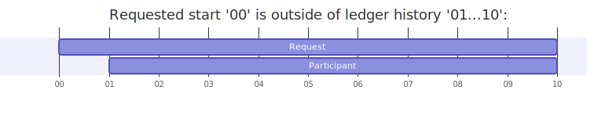

PQS
===

Introduction
------------

PQS (Participant Query Store) is a feature that makes the ledger available to be queried by SQL. This enables users to query the state and history of the ledger, while minimizing the demand on the participant node.

.. note::
   The term Operational Data Store (ODS) refers to a database that mirrors the Daml ledger and allows for efficient querying. The PQS feature is an ODS for the participant.node.

Audience
~~~~~~~~

This documention provides guidance on what PQS achieves, how to use it, and its operation and limitations. The following types of users are likely to find PQS useful:

-  Application developers: to query the ledger to display information to users, integrate or carry out automated business processes, and debugging.
-  Business analysts: to access and analyze ledger data with ad-hoc investigations to understand operational usage.
-  Support analysts: to diagnose any problems on a live system, when sophisticated inspection of the ledger is required.
-  Application operators: to take a snapshot of the ledger, either with or without history in order to analyse and investigate.
-  Report analysts: to provide access to ledger data information for analysis and aggregation with standard reporting tools, on a historical or real-time basis.

Purpose
~~~~~~~

PQS provides powerful and scaleable read access for a participant by exposing all data via SQL - leveraging existing tools and knowledge.

The participant's primary role is to submit and propogate transactions in the network, which requires interaction to submit commands. PQS works in this domain to monitor transactions on a streaming basis, maintain history and state based on these events, and makes the resultant data available for users to query. It allows independent scaling of the read loads, depending on the capacity required.

Operational Architecture
~~~~~~~~~~~~~~~~~~~~~~~~

PQS is a service that operates within the trusted core infrastructure of a participant. It can be configured via command line arguments, environment variables and configuration files. It is intended as a long-running process and is resilient to network outages. It is also designed to be idempotent (or "crash tolerant") so that it can be restarted safely at any time. It does not write to the ledger; it is a passive consumer of data from a Canton participant. PQS focuses on providing a powerful and scaleable "read" pipeline - as per the `CQRS <https://learn.microsoft.com/en-us/azure/architecture/patterns/cqrs>`__ design pattern.

The following diagram shows that PQS initiates connections to both the participant and the datastore: (arrows indicate the direction of connection)

|diagram|

Similarly, from the perspective of data-flow:

|image1|

Expanding the application node from the above, you can imagine many potential architectures, including:

|image2|

Key Feature Summary
~~~~~~~~~~~~~~~~~~~

PQS enables the following key capabilities:

-  To make the Daml ledger queryable via SQL.
-  Allow querying on a point-in-time or latest-available basis.
-  Filter the scope by Daml party and contract template.
-  Embed an API within the database to allow consumers to easily access the ledger data by:

   -  Using familiar Daml identifiers (eg. ``mypackage:My.Module:MyTemplate``) instead of PostgreSQL approximations.
   -  Using SQL to perform familiar aggregations, transformations and joins.
   -  Creating custom indexes to optimize queries.
   -  Facilitating access to both state (contracts) and audit trail (events) perspectives.

-  Crash-tolerance so it can be restarted safely.

Sections
~~~~~~~~

-  `Getting Started <#getting-started>`__
-  `Database <#database>`__
-  `Configuration <#configuration>`__
-  `Resilience <#resilience>`__
-  `Read API <#read-api>`__
-  `Pruning <#pruning>`__
-  `Authentication <#auth>`__
-  `History Slicing <#history-slicing>`__
-  `Reset <#reset>`__
-  `Logging <#logging>`__
-  `Database Schema Evolution <#database-schema-evolution>`__
-  `Relational View <#relational-view>`__
-  `Observability <#observability>`__
-  `Redaction <#redaction>`__

Getting Started
---------------

Pre-requisites
~~~~~~~~~~~~~~

To run PQS you need the following:

-  PostgreSQL version 12-16.
-  Daml Sandbox or participant.as the source of ledger data.
-  Any access tokens or TLS certificates required by the above.
-  PQS ``.jar`` or Docker image

Running PQS
~~~~~~~~~~~

Exploring commands and parameters is easiest via the ``--help`` (and ``--help-verbose``) arguments: For example, if you are running a downloaded ``.jar`` file:

.. code:: text

   $ ./scribe.jar --help
   Usage: scribe COMMAND

   An efficient ledger data exporting tool

   Options:
     -h, --help            Print help information and quit
     -H, --help-verbose    Print help information with extra details and quit
     -v, --version         Print version information and quit

   Commands:
     pipeline     Initiate continuous ledger data export
     datastore    Perform operations supporting a certified data store

   Run 'scribe COMMAND --help[-verbose]' for more information on a command.

Or similarly, using Docker:

.. code:: text

   $ docker run -it digitalasset-docker.jfrog.io/participant-query-store:0.5.0 --help
   Picked up JAVA_TOOL_OPTIONS: -javaagent:/open-telemetry.jar
   Usage: scribe COMMAND

   An efficient ledger data exporting tool

   Commands:
     pipeline     Initiate continuous ledger data export
     datastore    Perform operations supporting a certified data store

   Run 'scribe COMMAND --help[-verbose]' for more information on a command.

Daml Platform Support
^^^^^^^^^^^^^^^^^^^^^

From version 0.5.0 PQS is built and tested against multiple Daml SDK targets. Each Daml SDK target generates it's own ``.jar`` file. These binaries are present in the published participant-query-store docker images. The container defaults to the lowest targeted Daml SDK. If an operator wants to run PQS against a newer target, the will need to set the containers ``workdir`` at runtime to the desired Daml SDK target.

The supported targets are:

-  ``/daml2`` << default
-  ``/daml3.2``
-  ``/daml3.3``

Please note that the preceeding ``/`` is required as the target is the path to the ``scribe.jar`` file.

An example of the default Daml SDK target:

.. code:: text

   $ docker run -it digitalasset-docker.jfrog.io/participant-query-store:0.5.0 --version
   Picked up JAVA_TOOL_OPTIONS: -javaagent:/open-telemetry.jar
   scribe, version: v0.5.0
   daml-sdk.version: 2.9.5
   postgres-document.schema: 021

An example of selecting the ``/daml3.2`` target:

.. code:: text

   docker run -it --workdir /daml3.2 digitalasset-docker.jfrog.io/participant-query-store:0.5.0 --version
   Picked up JAVA_TOOL_OPTIONS: -javaagent:/open-telemetry.jar
   scribe, version: v0.5.0
   daml-sdk.version: 3.2.0-snapshot.20241106.13400.0.vad854047
   postgres-document.schema: 021

Preparing the Database
^^^^^^^^^^^^^^^^^^^^^^

Start by investigating the database schema that PQS creates, using the ``datastore`` command that is used for administrative operations:

.. code:: text

   $ ./scribe.jar datastore postgres-document schema show
   [...]
   /**********************************************************
    * generated by scribe, version: [...]                    *
    **********************************************************/
   -- tables
   create table [...]

A database administrator can now choose to create the database and apply the produced DDL, or leave it to the ``pipeline`` command to do this on an ongoing idempotent basis.

Running the Pipeline
^^^^^^^^^^^^^^^^^^^^

The following command connects to a non-auth ledger and replicates the latest state of the ledger (excluding prior-history) from the perspective of the supplied Daml party. It uses the ledger source and supplied database, though these values can be omitted as they are all defaults:

.. code:: text

   $ ./scribe.jar pipeline ledger postgres-document \
       --pipeline-filter-parties Alice::12209942561b94adc057995f9ffca5a0b974953e72ba25e0eb158e05c801149639b9 \
       --pipeline-ledger-start Latest \
       --target-postgres-host localhost \
       --target-postgres-port 5432 \
       --target-postgres-database postgres \
       --source-ledger-port 6865 \
       --source-ledger-host localhost
   18:27:26.799 I [zio-fiber-64] com.digitalasset.scribe.appversion.package:11 scribe, version: v...
   18:27:27.159 I [zio-fiber-68] com.digitalasset.scribe.configuration.package:40 Applied configuration:
   [...]
   18:27:28.714 I [zio-fiber-67] com.digitalasset.scribe.postgres.document.DocumentPostgres.Service:36 Applying schema
   18:27:28.805 I [zio-fiber-67] com.digitalasset.scribe.postgres.document.DocumentPostgres.Service:39 Schema applied
   18:27:28.863 I [zio-fiber-0] com.digitalasset.scribe.pipeline.pipeline.Impl:29 Starting pipeline on behalf of 'Alice::...'
   18:27:29.043 I [zio-fiber-0] com.digitalasset.scribe.pipeline.pipeline.Impl:57 Last checkpoint is absent. Seeding from ACS before processing transactions with starting offset '000000000000000008'
   18:27:29.063 I [zio-fiber-938] com.digitalasset.zio.daml.Ledger.Impl:191 Contract filter inclusive of 4 templates and 0 interfaces
   18:27:29.120 I [zio-fiber-0] com.digitalasset.scribe.pipeline.pipeline.Impl:74 Continuing from offset 'GENESIS' and index '0' until offset 'INFINITY'
   18:27:29.159 I [zio-fiber-967] com.digitalasset.zio.daml.Ledger.Impl:191 Contract filter inclusive of 4 templates and 0 interfaces
   [...]

..

.. note::
   The above command continues to run until terminated. You can terminate it with ``Ctrl-C`` at any time.

Auth
^^^^

If you are running PQS against a participant that has auth, you must provide some credentials. For example:

.. code:: text

   $ ./scribe.jar pipeline ledger postgres-document \
       --source-ledger-auth OAuth \
       --pipeline-oauth-clientid my_client_id \
       --pipeline-oauth-clientsecret deadbeef \
       --pipeline-oauth-cafile ca.crt \
       --pipeline-oauth-endpoint https://my-auth-server/token

For more information see the `Authentication <#auth>`__ section.

Database
--------

PQS supports a single datastore format known as ``postgres-document``. This uses PostgreSQL to store the data in a document-oriented (schemaless) way, making extensive use of JSONB.

Ledger Source
~~~~~~~~~~~~~

To understand how PQS stores data, you need to understand the ledger data model. In simple terms, the Daml ledger is composed of a sequence of transactions, which contain events. Events can be:

-  Creates: creation of contracts / interface views.
-  Exercise: of a choice of contracts / interface views.
-  Archive: end of the lifetime of contracts / interface views.

..

.. warning::
   When defining the scope of ledger data being stored, it is important to understand the implications of the data source and the filters applied. The data source and filters determine the data that is available to the `Read API <005-read-api.md>`__ functions, and this cannot be changed. Since a change in scope will result in a change to the breadth of data being stored, a re-seed is required to widen or narrow the scope of the data. The only exception to this is where you widen the scope into a an area (eg. new templates new parties) that you know has no historical data, in which case a re-seed is not required. Or, operators may also the `reset <#reset>`__ function to roll-back the datastore to a prior state where this was true.

Transaction Data Source
~~~~~~~~~~~~~~~~~~~~~~~

PQS can run in two modes as specified by the ``--pipeline-datasource`` configuration. The following table shows the differences between the two modes, in terms of data availability via the respective `Read API <#read-api>`__ functions :

+---------------------------------------------+-------------------+-----------------------+
| Data / Mode                                 | TransactionStream | TransactionTreeStream |
+=============================================+===================+=======================+
| ``creates()`` contracts                     | ✓                 | ✓                     |
+---------------------------------------------+-------------------+-----------------------+
| ``exercises()`` contracts                   | ✗                 | ✓                     |
+---------------------------------------------+-------------------+-----------------------+
| ``archives()`` contracts                    | ✓                 | ✓                     |
+---------------------------------------------+-------------------+-----------------------+
| ``creates()`` interfaces                    | ✓                 | ✗                     |
+---------------------------------------------+-------------------+-----------------------+
| ``exercises()`` interfaces                  | ✗                 | ✓                     |
+---------------------------------------------+-------------------+-----------------------+
| ``archives()`` interfaces                   | ✓                 | ✗                     |
+---------------------------------------------+-------------------+-----------------------+
| Transient (create-archive in a transaction) | ✗                 | ✓                     |
+---------------------------------------------+-------------------+-----------------------+
| Stakeholders                                | ✓                 | ✓                     |
+---------------------------------------------+-------------------+-----------------------+
| Note:                                       |                   |                       |
+---------------------------------------------+-------------------+-----------------------+
| Default                                     | ✓                 | ✗                     |
+---------------------------------------------+-------------------+-----------------------+
| Data size                                   | Smaller           | Larger                |
+---------------------------------------------+-------------------+-----------------------+

PostgreSQL Schema
~~~~~~~~~~~~~~~~~

The PostgreSQL schema is designed to be generic and not tied to any specific Daml model. This is achieved by a fixed schema that relates to the general ledger model but uses a documented-oriented approach (JSONB) to store the data whose schema lies in the Daml models.

.. warning::
   Any database artifact starting with an underscore character (``_``) is explicitly denoted an internal implementation, subject to change, and should not be relied upon. Since every table is prefixed this way, they change in the future - for example as a result of future functional and performance enhancements.

Ledger data consumers should interact with the database via the `Read API <#read-api>`__, which provides a stable supported interface. Database Administrators who wish to have a deeper understanding of the schema specifics, in order to understand it's operational characteristics, can easily inspect the schema using the command:

.. code:: text

   $ ./scribe.jar datastore postgres-document schema show
   [...]

Objectives
^^^^^^^^^^

Overall, the objectives of the schema design are to facilitate:

-  **Scaleable writes**: high-throughput and efficient to free up as much capacity for useful work (reads) as possible.
-  **Scaleable reads**: queries can able to be parallelized, and do not become blocked behind writes. They produce sensible query plans that do not result in unnecessary table scans.
-  **Ease of use**: readers can use familiar tools and techniques to query the database, without needing to understand the specifics of the schema design. Instead, they can use simple entry points that provide access to data in familiar ledger terms: active contracts, creates, exercises, archives, offsets, etc. Readers do not need to worry about an offset-based model for point-in-time snapshot isolation.
-  **Read consistency**: readers can achieve the level of consistency that they require, including consistency with other queries they are conducting.
-  **Crash tollerance**: the schema is designed to be simple and ensure recovery from any kind of crash, taking a pessimistic view of what races may occur, however unlikely.
-  **Static schema**: the schema is designed to be static and not require any changes to the schema as the ledger evolves, to the extent possible. Note: discovering adding new templates during normal operation does currently require additional table partitions to be created.

Design
^^^^^^

To facilitate these objectives, the following design approaches have been used:

-  **Concurrent append-only writes**: ledger transactions are written with significant parallelism without contention, ensuring that writes can be high-throughput and unconstrained by latency.
-  **Bulk batching**: using `COPY <https://www.postgresql.org/docs/current/sql-copy.html>`__ (not `INSERT <https://www.postgresql.org/docs/current/sql-insert.html>`__) to deliver large batches of data efficiently.
-  **Offset indexed**: all data is appropriately indexed by offset to provide efficient access to slice the result by offset. `BRIN <https://www.postgresql.org/docs/current/brin-intro.html>`__ indexes are used to ensure contiguity of data that is often accessed together.
-  **Implicit offset**: readers can opt for queries with implicit offset, meaning they can ignore the role of offset in their queries but still receive a stable view of the ledger data. We seek to provide a similar experience to PostgreSQL's MVCC, where users receive consistency benefits without needing to understand the underlying implementation.
-  **Idempotent**: PQS is designed to be restarted safely at any time. All state is maintained in the datastore.
-  **Watermarks**: a single thread maintains a watermark denoting the most recent contiguous transaction - representing the offset of the most recent consistent ledger transaction. In addition, the watermark processes the "archive" mutation on any archived contracts or interface views, in a batch. This reintroduces data consistency without needing readers to perform complex query paths. This efficiently resolves the uncertainty created by the parallel writes.
-  **Schemaless content**: content defined in Daml templates uses the JSONB datatype to store the data. This allows for a schemaless approach and can store any Daml model without needing to change the schema, other than custom JSONB indexes.

Configuration
-------------

Several items need to be configured to suit your environment and requirements. This section provides an overview of common configuration options that you should consider for your deployment:

PQS Configuration
~~~~~~~~~~~~~~~~~

PQS ascertains its configuration from:

-  command-line arguments
-  environment variables
-  HOCON configuration files (``--config`` argument)

..

.. note::
   Consult the command ``./scribe.jar pipeline --help-verbose`` for further information on individual configuration items, and the conventions used to specify them in the above forms.

Complex configurations may benefit from using a HOCON configuration file, for example:

.. code:: text

   {
      health.port = 8080

      logger {
         # level = "Debug"
         format = "Plain"
         pattern = "Plain"
      }

      pipeline {
         datasource = "TransactionStream"

         filter {
            parties = "*"
            metadata = "!*"
            contracts = "*"
         }

         ledger {
            start = "Latest"
            stop = "Never"
         }
      }

      source {
         ledger {
            host = "canton"
            port = 10011
         }
      }

      target {
         postgres {
            host = "postgres"
            port = 5432
            username = "postgres"
            database = "postgres"
            maxConnections = 16
         }
      }
      schema.autoApply = true
   }

..

.. note::
   For more information on logging configuration, see the dedicated `Logging <#logging>`__ section.

Applying Configuration Changes
^^^^^^^^^^^^^^^^^^^^^^^^^^^^^^

PQS sets is configuration at startup. It does not perform dynamic configuration updates, so making a configuration change (such as adding a new party, new template, or new interface) requires a restart.

.. warning::
   PQS will not go back in time and recover history - but only move forward by consuming new transactions it has not previously seen. It is important that scope only be expanded when it is known to have no prior history, at the point in time that PQS was stopped. Otherwise, a re-seed operation will be required to reinitialize from a empty datastore, will be required.

Contract Filters
~~~~~~~~~~~~~~~~

``--pipeline-filter-contracts`` specifies an inclusion filter expression to determine the Daml templates, interface views and choices include. A filter expression is a simple wildcard inclusion (``*``) with basic boolean logic (``&`` ``!`` ``|`` ``(`` ``)``), where whitespace is ignored. For example:

-  ``*``: everything (default)
-  ``pkg:*``: everything in this package
-  ``pkg:a.b.c.Bar``: just this one fully qualified name for template ``Bar``
-  ``a.b.c.*``: all members of the ``a.b.c`` namespace
-  ``* & !pkg:a.b.c.Bar``: everything except this one fully qualified name
-  ``(a.b.c.Foo | a.b.c.Bar)``: these two fully qualified names
-  ``(a.b.c.* & !(a.b.c.Foo | a.b.c.Bar) | g.e.f.Baz)``: everything in ``a.b.c`` except for ``Foo`` and ``Bar``, and also include ``g.e.f.Baz``
-  ``a.b.c.Foo & a.b.c.Bar``: error (the identifier can't be both)

..

.. note::
   There are further conditions placed upon the filtering of templates and interfaces to avoid potential ambiguity. It is required to include any filter for:

   -  All Interface Views of included Templates
   -  All Templates of included Interface Views

Party Filtering
~~~~~~~~~~~~~~~

Similarly, the ``--pipeline-filter-parties`` option specifies an inclusion filter expression to determine which parties to supply data for. For example:

-  ``*``: everything (default)
-  ``Alice::* | Bob::*``: any party with an ``Alice`` or ``Bob`` hint
-  ``Alice::122055fc4b190e3ff438587b699495a4b6388e911e2305f7e013af160f49a76080ab``: just this one party
-  ``* & !Alice::*``: all parties except those with an ``Alice`` hint
-  ``Alice* | Bob* | (Charlie* & !(Participant3::*))``: ``Alice`` and ``Bob`` parties, as well as ``Charlie`` except ``Charlie3``

When the ledger requires authentication, this filter applies within the scope of parties for which PQS's Ledger API user has access. Naturally, the ``--pipeline-filter-parties`` cannot be used to access data for parties for which the user is not authorized.

Java Virtual Machine (JVM) Configuration
~~~~~~~~~~~~~~~~~~~~~~~~~~~~~~~~~~~~~~~~

JVM configuration is important to ensure that PQS has enough resources to run efficiently. At minimum the following should be considered for any realistic deployment:

.. code:: text

   -XX:+AlwaysPreTouch
   -XX:-UseAdaptiveSizePolicy

   ## containers:
   -XX:InitialRAMPercentage=75.0
   -XX:MaxRAMPercentage=75.0

   ## host/vm:
   -Xms4g
   -Xmx4g

In scenarios of resource-constraint, an out-of-memory error may occur. To diagnose this, a heap-dump will need to be collected for analysis, by adding the following JVM parameters:

.. code:: text

   -XX:+HeapDumpOnOutOfMemoryError
   -XX:HeapDumpPath=/path/to/heap.dump

If you wish to have more detailed logging for diagnosis, you can adjust the ``--logger-level`` parameter to ``Debug`` or ``Trace``. However, be aware that this will generate a lot of log output and may negatively impact performance. Therefore it is recommended you de-scope particularly verbose components (such as Netty) to ``Info`` level. This can be done by adding the following arguments:

.. code:: text

   --logger-level=Debug
   --logger-mappings-io.netty=Info
   --logger-mappings-io.grpc.netty=Info

Setting the Ledger API queue length is a trade-off between memory usage and performance. The default value is 128, and can be increased to deliver more stable performance, at the cost of requiring additional memory. Note that the buffer will consume memory equal to the size of transactions in the rolling window of the buffer size:

.. code:: text

   --source-ledger-buffersize=1024

PostgreSQL Configuration
~~~~~~~~~~~~~~~~~~~~~~~~

Users should at least consider the following PostgreSQL config items which are relevant to the workloads it will be expected to satisfy:

.. code:: text

   ## postgresql.conf:
   [autovacuum_*](https://www.postgresql.org/docs/16/runtime-config-autovacuum.html#RUNTIME-CONFIG-AUTOVACUUM)
   [maintenance_work_mem](https://www.postgresql.org/docs/16/runtime-config-resource.html#GUC-MAINTENANCE-WORK-MEM)
   [checkpoint_*](https://www.postgresql.org/docs/16/runtime-config-wal.html#RUNTIME-CONFIG-WAL-CHECKPOINTS)
   [*_wal_size](https://www.postgresql.org/docs/16/runtime-config-wal.html#GUC-MAX-WAL-SIZE)
   [bgwriter_*](https://www.postgresql.org/docs/16/runtime-config-resource.html#RUNTIME-CONFIG-RESOURCE-BACKGROUND-WRITER)

In cases where high performance is required, a DBA will need to tune PostgreSQL for the intended workload and infrastructure.

PostgreSQL Users
~~~~~~~~~~~~~~~~

To secure the PostgreSQL database, you should consider the rights granted to various users that connect to the database. At minimum the following user categories should be considered with their respective `DDL/ACL privileges <https://www.postgresql.org/docs/16/ddl-priv.html>`__:

-  **Administraton**: Provides a way for Database Administrators to perform any action on the database - SUPERUSER
-  **Processing**: The user that PQS process connects to the database as - SELECT, INSERT, UPDATE, DELETE
-  **Querying**: Data consumers that connect to the database to read the ledger data - SELECT
-  **Redaction**: Any users that needs to perform redaction operations - SELECT, UPDATE
-  **Pruning**: Users perform pruning operations - SELECT, UPDATE, DELETE
-  **Indexing**: Users that maintain JSONB indexes - CREATE

Host Infrastructure
~~~~~~~~~~~~~~~~~~~

The following are the minimum requirements for the host operating system running any kind of production workload, and should be seen as a starting point for determining the appropriate resources required by a particular workload:

PQS host:

-  Memory: 4GB
-  CPU: 4 cores

PostgreSQL:

-  Memory: 8GB
-  CPU: 8 cores

Host Environment
~~~~~~~~~~~~~~~~

PQS requires write access to the ``/tmp`` directory in order temporarily cache Daml packages. The size of this cache is proportional to the size of all Daml packages observable on the ledger. It is an ephemeral cache - so it does not need to persist beyond a single execution. Containerized environments should configure a disk-based mount, as it is not important for overall performance.

Testing
~~~~~~~

Of course all of these settings need to be independently assessed and tuned. Users should establish performance testing and benchmarking environment in order to validate the performance of PQS on a given workload. It should be noted that the following variables are extremely relevant to overall PQS performance characteristics:

-  Network latency
-  Ledger transaction throughput
-  Ledger transaction sizes
-  Contract data sizes

Changing any of these variables requires re-testing to ensure that the impact on system performance is understood, and within acceptable tollerances.

As a reference you may want to consult the `Performance Benchmarking <#performance-benchmark>`__ section of the documentation, for an example of one such performance benchmark. This may give you a sense of the performance characteristics, and allow you to adapt it into something that matches your workloads.

Resilience
----------

PQS is designed to operate as a long-running process which uses these principles to enhance availability:

-  **Redundancy** involves running multiple instances of PQS in parallel to ensure that the system remains available even if one instance fails.
-  **Retry** involves healing from transient and recoverable failures without shutting down the process or requiring operator intervention.
-  **Recovery** entails reconciling the current state of the ledger with already exported data in the datastore after a cold start, and continuing from the latest checkpoint.

High Availability
~~~~~~~~~~~~~~~~~

Multiple isolated instances of PQS can be instantiated without any cross-dependency. This allows for an active-active high availability clustering model. Please note that different instances might not be at the same offset due to different processing rates and general network non-determinism. PQS's Read API provides capabilities to deal with this 'eventual consistency' model, to ensure that readers have at least 'repeatable read' consistency. See ``validate_offset_exists()`` in the `Read API <005-read-api.md#offset-management>`__ for more details.

|image3|

Retries
~~~~~~~

PQS's ``pipeline`` command is a unidirectional streaming process that heavily relies on the availability of its ``source`` and ``target`` dependencies. When PQS encounters an error, it attempts to recover by restarting its internal engine, if the error is designated as recoverable:

-  `gRPC <https://grpc.io/docs/guides/status-codes/>`__ (white-listed; retries if):

   -  ``CANCELLED``
   -  ``DEADLINE_EXCEEDED``
   -  ``NOT_FOUND``
   -  ``PERMISSION_DENIED``
   -  ``RESOURCE_EXHAUSTED``
   -  ``FAILED_PRECONDITION``
   -  ``ABORTED``
   -  ``INTERNAL``
   -  ``UNAVAILABLE``
   -  ``DATA_LOSS``
   -  ``UNAUTHENTICATED``

-  `JDBC <https://github.com/pgjdbc/pgjdbc/blob/master/pgjdbc/src/main/java/org/postgresql/util/PSQLState.java>`__ (black-listed; retries unless):

   -  ``INVALID_PARAMETER_TYPE``
   -  ``PROTOCOL_VIOLATION``
   -  ``NOT_IMPLEMENTED``
   -  ``INVALID_PARAMETER_VALUE``
   -  ``SYNTAX_ERROR``
   -  ``UNDEFINED_COLUMN``
   -  ``UNDEFINED_OBJECT``
   -  ``UNDEFINED_TABLE``
   -  ``UNDEFINED_FUNCTION``
   -  ``NUMERIC_CONSTANT_OUT_OF_RANGE``
   -  ``NUMERIC_VALUE_OUT_OF_RANGE``
   -  ``DATA_TYPE_MISMATCH``
   -  ``INVALID_NAME``
   -  ``CANNOT_COERCE``
   -  ``UNEXPECTED_ERROR``

.. _configuration-1:

Configuration
^^^^^^^^^^^^^

The following configuration options are available to control the retry behavior of PQS:

.. code:: text

   $ ./scribe.jar pipeline --help
   [...]
     --retry-backoff-base string                 Base time (ISO 8601) for backoff retry strategy (default: PT1S)
     --retry-backoff-cap string                  Max duration (ISO 8601) between attempts (default: PT1M)
     --retry-backoff-factor double               Factor for backoff retry strategy (default: 2.0)
     --retry-counter-attempts int                Max attempts before giving up (optional)
     --retry-counter-reset string                Reset retry counters after period (ISO 8601) of stability (default: PT10M)
     --retry-counter-duration string             Time limit (ISO 8601) before giving up (optional)
   [...]

Configuring ``--retry-backoff-*`` settings control periodicity of retries and the maximum duration between attempts.

Configuring ``--retry-counter-attempts`` and ``--retry-counter-duration`` controls the maximum *instability* tolerance before shutting down.

Configuring ``--retry-counter-reset`` controls the period of *stability* after which the retry counters are reset across the board.

Logging
^^^^^^^

.. code:: text

   ## Irrelevant log lines omitted
   $ scribe.jar pipeline ledger postgres-document \
       --pipeline-ledger-start Oldest --pipeline-ledger-stop Never \
       --retry-backoff-base=PT10S --retry-counter-duration=PT10M --retry-counter-attempts=42

   12:52:26.753 I [zio-fiber-257] com.digitalasset.scribe.appversion.package:14 scribe, version: UNSPECIFIED  application=scribe
   12:52:16.725 I [zio-fiber-0] com.digitalasset.scribe.pipeline.Retry.retryRecoverable:48 Recoverable GRPC exception. Attempt 1, unstable for 0 seconds. Remaining attempts: 42. Remaining time: 10 minutes. Exception in thread "zio-fiber-" java.lang.Throwable: Recoverable GRPC exception.
       Suppressed: io.grpc.StatusException: UNAVAILABLE: io exception
           Suppressed: io.netty.channel.AbstractChannel$AnnotatedConnectException: Connection refused: localhost/[0:0:0:0:0:0:0:1]:6865
               Suppressed: java.net.ConnectException: Connection refused application=scribe
   12:52:29.007 I [zio-fiber-0] com.digitalasset.scribe.pipeline.Retry.retryRecoverable:48 Recoverable GRPC exception. Attempt 2, unstable for 12 seconds. Remaining attempts: 41. Remaining time: 9 minutes 47 seconds. Exception in thread "zio-fiber-" java.lang.Throwable: Recoverable GRPC exception.
       Suppressed: io.grpc.StatusException: UNAVAILABLE: io exception
           Suppressed: io.netty.channel.AbstractChannel$AnnotatedConnectException: Connection refused: localhost/[0:0:0:0:0:0:0:1]:6865
               Suppressed: java.net.ConnectException: Connection refused application=scribe
   12:52:51.237 I [zio-fiber-0] com.digitalasset.scribe.pipeline.Retry.retryRecoverable:48 Recoverable GRPC exception. Attempt 3, unstable for 34 seconds. Remaining attempts: 40. Remaining time: 9 minutes 25 seconds. Exception in thread "zio-fiber-" java.lang.Throwable: Recoverable GRPC exception.
       Suppressed: io.grpc.StatusException: UNAVAILABLE: io exception
           Suppressed: io.netty.channel.AbstractChannel$AnnotatedConnectException: Connection refused: localhost/[0:0:0:0:0:0:0:1]:6865
               Suppressed: java.net.ConnectException: Connection refused application=scribe
   12:53:33.473 I [zio-fiber-0] com.digitalasset.scribe.pipeline.Retry.retryRecoverable:48 Recoverable GRPC exception. Attempt 4, unstable for 1 minute 16 seconds. Remaining attempts: 39. Remaining time: 8 minutes 43 seconds. Exception in thread "zio-fiber-" java.lang.Throwable: Recoverable GRPC exception.
       Suppressed: io.grpc.StatusException: UNAVAILABLE: io exception
           Suppressed: io.netty.channel.AbstractChannel$AnnotatedConnectException: Connection refused: localhost/[0:0:0:0:0:0:0:1]:6865
               Suppressed: java.net.ConnectException: Connection refused application=scribe
   12:54:36.328 I [zio-fiber-0] com.digitalasset.scribe.pipeline.Retry.retryRecoverable:48 Recoverable JDBC exception. Attempt 5, unstable for 2 minutes 19 seconds. Remaining attempts: 38. Remaining time: 7 minutes 40 seconds. Exception in thread "zio-fiber-" java.lang.Throwable: Recoverable JDBC exception.
       Suppressed: org.postgresql.util.PSQLException: Connection to localhost:5432 refused. Check that the hostname and port are correct and that the postmaster is accepting TCP/IP connections.
           Suppressed: java.net.ConnectException: Connection refused application=scribe

Metrics
^^^^^^^

The following metrics are available to monitor stability of PQS's dependencies. See the `observability <#observability>`__ section for more details on general observability:

.. code:: text

   ## TYPE app_restarts_total counter
   ## HELP app_restarts_total Number of total app restarts due to recoverable errors
   app_restarts_total{,exception="Recoverable GRPC exception."} 5.0

   ## TYPE grpc_up gauge
   ## HELP grpc_up Grpc channel is up
   grpc_up{} 1.0

   ## TYPE jdbc_conn_pool_up gauge
   ## HELP jdbc_conn_pool_up JDBC connection pool is up
   jdbc_conn_pool_up{} 1.0

Retry Counters Reset
^^^^^^^^^^^^^^^^^^^^

If PQS encounters network unavailability it starts incrementing retry counters with each attempt. These counters are reset only after a period of stability, as defined by ``--retry-counter-reset``. As such, during the prolonged periods of intermittent failures that alternate with brief periods of operating normally, PQS keeps maintaining a cautious stance on assumptions regarding the stability of the overall system. This can be illustrated with an example below:

.. code:: text

   ## --retry-counter-reset=PT5M

   time -->       1:00            5:00               10:00
                   v               v                   v
   operation:  ====xx=x====x=======x========================
                   ^               ^                   ^
                   A               B                   C

   x - a failure causing retry happens
   = - operating normally

In the timeline above, intermittent failures start at point A, and each retry attempt contributes to the increase of the overall backoff schedule. Consequently, each subsequent retry allows more time for the system to recover. This schedule does not reset to its initial values until after the configured period of stability is reached following the last failure (point B), such as after operating without any failures for 5 minutes (point C).

Exit codes
^^^^^^^^^^

PQS terminates with the following exit codes:

-  ``0``: Normal termination
-  ``1``: Termination due to unrecoverable error or all retry attempts for recoverable errors have been exhausted

.. _ledger-streaming--recovery:

Ledger Streaming & Recovery
~~~~~~~~~~~~~~~~~~~~~~~~~~~

On (re-)start, PQS determines last saved checkpoint and continues incremental processing from that point onward. PQS is able to start and finish at prescribed ledger offsets, specified via args:

.. code:: text

   $ ./scribe.jar pipeline --help-verbose

   Usage: pipeline SOURCE TARGET [OPTIONS]
   [...]
   Options:
   [...]
     --pipeline-ledger-start [enum | string]    Start offset (default: Latest)
                                                 + Environment variable: SCRIBE_PIPELINE_LEDGER_START
                                                 + System property:      pipeline.ledger.start
                                                 + Enumeration values:   Genesis, Oldest, Latest
     --pipeline-ledger-stop [enum | string]     Stop offset (default: Never)
                                                 + Environment variable: SCRIBE_PIPELINE_LEDGER_STOP
                                                 + System property:      pipeline.ledger.stop
                                                 + Enumeration values:   Latest, Never
   [...]

Start offset meanings:

-  ``Genesis``: Commence from the first offset of the ledger, failing if not available.
-  ``Oldest``: Resume processing, or start from the oldest available offset of the ledger (if the datastore is empty).
-  ``Latest``: Resume processing, or start from the latest available offset of the ledger (if the datastore is empty).
-  ``<offset>``: Offset from which to start processing, terminating if it does not match the state of the datastore.

Stop offset meanings:

-  ``Latest``: Process until reaching the latest available offset of the ledger, then terminate.
-  ``Never``: Keep processing and never terminate.
-  ``<offset>``: Process until reaching this offset, then terminate.

In many scenarios ``--pipeline-ledger-start=Oldest --pipeline-ledger-stop=Never`` is the most appropriate configuration, for both initial population of all available history, and also catering for resumption/recovery processing.

.. caution::
   If the ledger has been pruned beyond the offset specified in ``--pipeline-ledger-start``, PQS fails to start. For more details see `History Slicing <#history-slicing>`__.

Read API
--------

While data consumers do not communicate with the PQS process directly, they do use an API that PQS has provisioned in the database itself. This Read API is designed to provide a consistent and stable interface for users to access the ledger. It consists of a set of functions that should be the only database artifacts readers interact with.

How The Ledger Models Time
~~~~~~~~~~~~~~~~~~~~~~~~~~

A key aspect to consider when querying the ledger is the fact that it makes the history over time available. Additionally, understanding time in a distributed environment can be challenging because there are many different clocks available. If you are familiar with Daml and its time model, skip this section and move to the section `Time Model <#time-model>`__.

Offset
^^^^^^

A participant models time using an index called an *offset*. An offset is a unique index of the participant's local ledger. You can think of this as selecting an item in the ledger using a specific offset (or index) into the ledger.

Offsets are ordered, representing the order of transactions on the ledger of a participant. Due to privacy and filtering, the sequence of offsets of a participant usually appears to contain gaps.

Offsets are specific to a participant and are not consistent between peer participants - even when processing common transactions. This is because each participant has its own ledger and allocates its own offsets based on it's permissioned view of transactions.

Offsets are represented as strings, encoded in zero-padded hexadecimal form. eg. ``0000000000000000A8``

Ledger Time
^^^^^^^^^^^

Ledger time is an approximate wall-clock time (within a bounded skew) that preserves causal ordering. That is, if a contract is created at a certain time, it cannot be used until after that time. The ledger time is represented by the ``created_at`` field in the PQS Read API.

Tranasction ID
^^^^^^^^^^^^^^

A transaction ID corresponds to an offset in the following ways:

-  Not every offset has a transaction ID. For example, the completion event of a rejected transaction does not have a transaction ID because it was unsuccessful.
-  There is, at most, one transaction ID at a given offset.
-  Each transaction ID is unique and always has a single offset.
-  While offsets are allocated by, and are specific to, a participant; transaction ID values are common to all participants.
-  Transaction ordering (as represented by associated offset) can vary between participants.
-  A transaction ID is entirely opaque and does not communicate any information, other than identification.

Which should I use?
^^^^^^^^^^^^^^^^^^^

Different types of data analysis require different tools. For example in these types of analysis the following identifiers can be useful:

-  Causal: **Offset** provides an understanding of events in causal order, consistent with the Participant-determined ledger commit ordering.
-  Systematic: **Transaction ID** is required for correlating over multiple participants, serving as a common identifier for individual transactions.
-  Temporal: **Ledger Time** provides an ordering of events in wall-clock time, with bounded skew. This can be useful depending on your need for precision.

Time Model
~~~~~~~~~~

PQS provides all three identifiers, but offset is defines the order. With this PQS is able to provide a consistent view of ledger transactions.

Offsets are deeply embedded in the Read API, allowing users to query the ledger in a manner that provides consistency. Users can nominate the offsets they wish to query, or simply query the latest available offset.

The following figure shows a pair of participants and their respective ledgers. Each participant has its own PQS instance, and you can see that it always has the portion of the ledger it is authorized to see:

|image4|

You can also see that the offsets (prefix) are common to the participant and PQS, but the Transaction IDs (suffix) are shared throughout.

Offset Management
~~~~~~~~~~~~~~~~~

The following functions control the temporal perspective of the ledger, aand allow you to control how you consider time in your queries. Since PQS exposes an eventually-consistent perspective of the ledger, you may wish to query:

-  **Ignore**; The *latest available* state.
-  **Pin**; The state of the ledger at a specific time.
-  **Span**; The ledger events across a time range, such as for an audit trail.
-  **Consistency**; The ledger in a way that maintains consistency with other interactions you have had with the ledger (read or write).

The following functions allow you to control the temporal scope of the ledger. This establishes the context in which subsequent queries execute:

-  ``set_latest(offset)``: nominates the offset of the latest data to include in observing the ledger. If NULL it uses the latest available. The actual offset to be used is returned. If the supplied offset is beyond what is available, an error occurs.
-  ``validate_offset_exists(offset)``: validates that the datastore has a complete history up to and including the offset provided. Returns an error if the nominated offset is not available (too old, or too new).
-  ``set_oldest(offset)``: nominates the offset of the oldest events to include in query scope. If NULL then it uses the oldest available. Function returns the actual offset used. If the supplied offset is beyond what is available, an error occurs.
-  ``nearest_offset(time)``: a helper function to determine the offset of a given time (or interval prior to now).

Under this scope, the following `table functions <https://www.postgresql.org/docs/current/sql-createfunction.html>`__ allow access to the ledger and are used directly in queries. They are designed to be used in a similar manner to tables or views, and allow users to focus on the data they wish to query, with the impact of offsets removed.

-  ``active(name)``: active instances of the target template/interface views that existed at the time of the latest offset
-  ``creates(name)``: create events of the target template/interface views that occurred between the oldest and latest offset
-  ``archives(name)``: archive events of the target template/interface views that occurred between the oldest and latest offset
-  ``exercises(name)``: exercise events of the target choice that occurred between the oldest and latest offset

..

   The above functions allow the user to focus on the templates, interfaces, and choices they wish to query without concern for `PostgreSQL name limits <https://www.postgresql.org/docs/16/sql-syntax-lexical.html#:~:text=maximum%20identifier%20length%20is%2063%20bytes>`__ that are more constraining than Daml identifiers. If you wish to allocate a "SQL name", you can create a SQL VIEW in which you reference the above functions.

The ``name`` identifier can be used with or without the package specified:

-  Fully qualified: ``<package>:<module>:<template|interface|choice>``
-  Partially qualified: ``<module>:<template|interface|choice>``\ 

..

.. note::
   Partially qualified identifiers fail if there is an ambiguous result.

These functions have optional parameters to allow the user to specify the offset range to be used. Providing these arguments is alternative to using ``set_*`` functions prior in the session. The following queries are equivalent:

.. code:: text

   -- Implicit: geared towards context-oriented exploration
   psql=# select set_oldest('000000000000005000');
   psql=# select set_latest('000000000000006000');
   psql=# select * from creates('package:My.Module:Template');
   ...

   -- Explicit: beneficial to inline the entire context, to emit in a single statement
   psql=# select * from creates('package:My.Module:Template', '000000000000005000', '000000000000006000');
   ...

JSONB Encoding
~~~~~~~~~~~~~~

PQS stores the ledger using a `Daml-LF JSON-based encoding <https://docs.daml.com/json-api/lf-value-specification.html#daml-lf-json-encoding>`__ of Daml-LF values. An overview of the encoding is provided below. For more details, refer to `the Daml-LF page <https://docs.daml.com/json-api/lf-value-specification.html#daml-lf-json-encoding>`__.

Users should consult the `PostgreSQL documentation <https://www.postgresql.org/docs/16/datatype-json.html#JSON-CONTAINMENT>`__ to understand how to work with JSONB data natively in SQL.

Values on the ledger (contract payloads and keys, interface views, exercise arguments, and return values) can be primitive types, user-defined records, variants, or enums. These types translate to `JSON types <https://json-schema.org/understanding-json-schema/reference/index.html>`__ as follows:

Primitive Types
^^^^^^^^^^^^^^^

-  ``ContractID``: represented as `string <https://json-schema.org/understanding-json-schema/reference/string.html>`__.
-  ``Int64``: represented as `string <https://json-schema.org/understanding-json-schema/reference/string.html>`__.
-  ``Decimal``: represented as `string <https://json-schema.org/understanding-json-schema/reference/string.html>`__.
-  ``List``: represented as `array <https://json-schema.org/understanding-json-schema/reference/array.html>`__.
-  ``Text``: represented as `string <https://json-schema.org/understanding-json-schema/reference/string.html>`__.
-  ``Date``: days since the Unix epoch, represented as `integer <https://json-schema.org/understanding-json-schema/reference/numeric.html#integer>`__.
-  ``Time``: microseconds since the UNIX epoch, represented as `number <https://json-schema.org/understanding-json-schema/reference/numeric.html#number>`__.
-  ``Bool``: represented as `boolean <https://json-schema.org/understanding-json-schema/reference/boolean.html>`__.
-  ``Party``: represented as `string <https://json-schema.org/understanding-json-schema/reference/string.html>`__.
-  ``Unit`` & ``Empty``: Represented as empty object ``{}``.
-  ``Optional``: represented as a variant with two constructors: ``None`` and ``Some``.

User-Defined Types
^^^^^^^^^^^^^^^^^^

-  ``Record``: represented as `object <https://json-schema.org/understanding-json-schema/reference/object.html>`__, where each create parameter's name is a key, and the parameter's value is the JSON-encoded value.
-  ``Variant``: represented as `object <https://json-schema.org/understanding-json-schema/reference/object.html>`__, using the ``{constructor: body}`` format, such as ``{"Left": true}``.
-  ``Enum``: represented as `string <https://json-schema.org/understanding-json-schema/reference/string.html>`__, where the value is the constructor name.

Querying Patterns
~~~~~~~~~~~~~~~~~

   Scenario: A website user wants to query the state of the ledger after having completed a command (write), which has successfully committed at offset ``000000000000001350``. The user does not want to see a version of the ledger prior to this, in order to appear consistent.

[!NOTE] This is a common pattern for web interfaces built on eventually-consistent data sources. It can be useful to track the latest offset within the web session, and update it on each interaction (read or write). Such offset is then used to protect any further reads from seeing prior versions.

.. code:: text

   -- fails if the offset is not yet available
   SELECT validate_offset_exists("000000000000001350");

   -- this query only runs if the offset is available, and therefore the user can be assured that the query does not return a prior version.
   SELECT * FROM active('test:Test.User:User');

..

   Scenario: A user wants to query the most recent available state of the ledger. This user treats the ledger's Active Contract Set as a database table and is not concerned with history or offsets. This user simply wants to query the (latest) state of the ledger, without consideration for offsets. Querying is inherently limited to one datasource, as the user has no control over the actual offset being used.

In this case the user wishes to query all Daml templates of ``User`` within the ``Test.User`` templates, where the user is not an administrator:

.. code:: text

   SELECT set_latest(NULL);

   SELECT *
     FROM active('test:Test.User:User') AS "user"
     WHERE "user".payload->>'admin' = 'false';

By using PostgreSQL's JSONB querying capabilities, you can join with the related ``Alias`` template to provide an overview of all users and their aliases:

.. code:: text

   SELECT set_latest(NULL);

   SELECT *
     FROM active('test:Test.User:User') AS "user"
       LEFT JOIN active('test:Test.User:Alias') AS "alias"
         ON "user".payload->>'user_id' = "alias".payload->>'user_id';

Historical events can also be accessed; by default all the history in the datastore is available for querying. The following query returns the data associated with all ``User`` contracts that were archived in the available history:

.. code:: text

   SELECT set_latest(NULL), set_oldest(NULL);

   SELECT *
     FROM archives('test:Test.User:User') AS "archive"
       JOIN creates('test:Test.User:User') AS "user"
         USING contract_id;

..

   Scenario: A report writer wants to query the ledger as of a known historical point in time, to ensure that consistent data is provided regardless of where the ledger subsequently evolved.

This user can obtain a point-in-time view of the ledger, to see all non-admin ``User`` templates that were active at that point in time:

.. code:: text

   SELECT set_latest(nearest_offset('2020-01-01 00:00:00+0'));

   SELECT "user".*
     FROM active('test:Test.User:User') AS "user"
     WHERE "user".payload->>'admin' = 'false';

..

   Scenario: Query the history of the ledger to determine how many aliases have existed for each user who was active at ``2020-01-01``:

.. code:: text

   SELECT set_latest(nearest_offset('2020-01-01 00:00:00+0')), set_oldest(NULL);

   SELECT "user".user_id, COUNT(alias.*) AS alias_count
     FROM active('test:Test.User:User') AS "user"
       JOIN creates('test:Test.User:Alias') AS alias
         ON "user".payload->>'user_id' = alias.payload->>'user_id'
     WHERE "user".payload->>'admin' = 'false';

..

   Scenario: An automation user wants to query from a fixed offset ("repeatable read" consistency) and write their query in familiar SQL.

.. code:: text

   -- fails if the datastore has not yet reached the given offset
   SELECT set_latest("000000000000001250");

   -- this query run at the nominated offset
   SELECT ...

The above queries now observe active contracts as of the given offset. Therefore, the example queries presented above are unchanged.

   Scenario: A user wants to present a limited amount of history to their users. They only want to see the last 90 days of history.

.. code:: text

   -- fails if this offset has already been pruned from the datastore
   SELECT set_oldest(nearest_offset(INTERVAL '90 days'));

   -- audit trail of all created users
   SELECT * FROM creates('test:Test.User:User');

..

   Scenario: A user wants to enquire where the datastore is up to, in terms of offset availability.

Here, the user requests the most recent and oldest available offsets to be used, and in the process returns what these offsets are:

.. code:: text

   SELECT set_latest(NULL) AS latest_offset,
          set_oldest(NULL) AS oldest_offset;

Summary functions
~~~~~~~~~~~~~~~~~

Summary functions are available to provide an overview of the ledger data available within the nominated offset range:

-  ``summary_transients(from_offset, to_offset)``: the number of transients per Daml fully qualified name within the offset range.
-  ``summary_updates(from_offset, to_offset)``: summary of create and archive counts per Daml fully qualified name within the offset range.

The following functions retrieve event counts per ``template_fqn``:

-  ``summary_active(at_offset)``
-  ``summary_creates(from_offset, to_offset)``
-  ``summary_archives(from_offset, to_offset)``
-  ``summary_exercises(from_offset, to_offset)``

Valid values for ``payload_type`` are:

-  ``template``
-  ``interface_view``
-  ``consuming_choice``
-  ``nonconsuming_choice``

.. code:: text

   postgres=# select * from summary_active();
     OR
   postgres=# select * from summary_active('00000000000000000a');

   template_fqn                                 |payload_type|count|
   ---------------------------------------------+------------+-----+
   QueryingPackage:NameRegistry:BirthCertificate|template    |    2|
   QueryingPackage:NameRegistry:INameDocument   |interface   |    2|
   (2 rows)

Lookup functions
~~~~~~~~~~~~~~~~

-  ``lookup_contract(contract_id)`` is a mechanism to retrieve contract data without needing to know its Daml qualified name. The function returns both contract and all associated interface view projections, distinguishable by the ``payload_type`` column.

   .. code:: text

      postgres=# select right(template_fqn, 64) template_fqn, fqn_type, "offset", left(contract_id, 8) contract_id, left(event_id, 8) event_id, payload
      from lookup_contract('0065497c49743b751946e7686fd853adc68b3081fc0e83bd418deb0d3fc4a5a610ca01122039fd9bf65a40a3f374403ea20fd82fd86c5f6c1bb5094c82a901ca162c79be4c');
                  template_fqn        |    fqn_type    |       offset       | contract_id | event_id |                                                                         payload
      --------------------------------+----------------+--------------------+-------------+----------+----------------------------------------------------------------------------------------------------------------------------------------------------------
      mypkg:PingPong:BirthCertificate | template       | 000000000000000009 | 0065497c    | #1220f9a | {"owner": "Alice::122053a2c7fb4d821b2d09ee4da44f4f575b24312045a62eb65fbba050bf03ae4cc1", "user_id": "id-joe", "lastName": "Bloggs", "firstName": "Fred"}
      mypkg:PingPong:INameDocument    | interface_view | 000000000000000009 | 0065497c    | #1220f9a | {"name": "Fred Bloggs", "owner": "Alice::122053a2c7fb4d821b2d09ee4da44f4f575b24312045a62eb65fbba050bf03ae4cc1"}

      (2 rows)

-  ``lookup_exercises(contract_id)`` - a mechanism to retrieve choice exercise data without needing to know the Daml qualified name; knowing the contract ID is sufficient.

   .. code:: text

      postgres=# select right(choice_fqn, 40) choice_fqn, right(template_fqn, 40) template_fqn, fqn_type, exercised_at_offset, left(contract_id, 8) contract_id, left(exercise_event_id, 8) exercise_event_id, argument, result
      from lookup_exercises('009a92084a89683c6c2cdbec4231a068238e11a93ef6d8722c48d23acdce3d87fdca011220f554549ca007ee1899cdef8993fe18e5fcf695fd0d21808a75402b520f183a29');
                     choice_fqn              |           template_fqn          | fqn_type         | exercised_at_offset | contract_id | exercise_event_id |         argument         |                                                                    result
      ---------------------------------------+---------------------------------+------------------+---------------------+-------------+-------------------+--------------------------+----------------------------------------------------------------------------------------------------------------------------------------------
      mypkg:PingPong:INameDocumentNameChange | mypkg:PingPong:BirthCertificate | consuming_choice | 00000000000000000f  | 009a9208    | #1220b17          | {"newName": "Bill Kirk"} | "00901817b88a0a278e134bb58ee61e96cf315da5a635ce05da0aae4c022641da64ca01122026b95982760daf9109ff24d13573d683f973b7f9ff62492e4a8d59a356dc68be"

      (1 row)

Optimization
~~~~~~~~~~~~

This section briefly discusses optimizing the PQS database to make the most of the capabilities of PostgreSQL. The topic is broad, and there are many resources available. Refer to the `PostgreSQL documentation <https://www.postgresql.org/docs/>`__ for more information.

PQS makes extensive use of JSONB columns to store ledger data. Familiarity with JSONB is essential to optimize queries. The following sections provide some tips to help you get started.

Indexing
^^^^^^^^

Indexes are an important tool for improving the performance of queries with JSONB content. Users are expected to create JSONB-based indexes to optimize their model-specific queries, where additional read efficiency justifies the inevitable write-amplification. Simple indexes can be created using the following helper function. More sophisticated indexes can be created using the standard PostgreSQL syntax.

.. code:: text

   call create_index_for_contract('token_wallet_holder_idx', 'register:DA.Register:Token', '(payload->''wallet''->>''holder'')', 'hash');

In this example, the index allows comparisons on the wallet holder. It has the additional advantage that the results of the JSON inspection are cached/materialized and do not have to be recomputed for every access.

PostgreSQL provides several index types, including B-tree, Hash, GiST, SP-GiST, GIN, and BRIN. Each index type uses a different algorithm that is best suited to different types of queries. The table below provides a basic explanation of where they can be used. For a more thorough understanding, consult the `chapter on indexes <https://www.postgresql.org/docs/current/indexes.html>`__ in the PostgreSQL manual.

+---------------+------------------------------------------------------------------------------------------------------------------------------------------------------------------------------------------------------------------------------------------------------------------------------------------------------+
| Index Type    | Comment                                                                                                                                                                                                                                                                                              |
+===============+======================================================================================================================================================================================================================================================================================================+
| Hash          | Compact. Useful only for filters that use =.                                                                                                                                                                                                                                                         |
+---------------+------------------------------------------------------------------------------------------------------------------------------------------------------------------------------------------------------------------------------------------------------------------------------------------------------+
| B-tree        | Can be used in filters that use <, <=, =, >=, > as well as postfix string comparisons (e.g. LIKE 'foo%'). B-trees can also speed up ORDER BY clauses and can be used to retrieve subexpressions values from the index rather than evaluating the subexpressions (i.e. when used in a SELECT clause). |
+---------------+------------------------------------------------------------------------------------------------------------------------------------------------------------------------------------------------------------------------------------------------------------------------------------------------------+
| GIN           | Useful for subset operators.                                                                                                                                                                                                                                                                         |
+---------------+------------------------------------------------------------------------------------------------------------------------------------------------------------------------------------------------------------------------------------------------------------------------------------------------------+
| GiST, SP-GiST | See PostgreSQL manual.                                                                                                                                                                                                                                                                               |
+---------------+------------------------------------------------------------------------------------------------------------------------------------------------------------------------------------------------------------------------------------------------------------------------------------------------------+
| BRIN          | Efficient for tables where rows are already physically sorted for a particular column.                                                                                                                                                                                                               |
+---------------+------------------------------------------------------------------------------------------------------------------------------------------------------------------------------------------------------------------------------------------------------------------------------------------------------+

Pagination
^^^^^^^^^^

Pagination refers to splitting up large result sets into pages of up to ``n`` results. It can allow user navigation, such as moving to the next page to display, going to the end of the result set, or jumping around in the middle. It can be a very effective user experience when there is a large ordered data set. The following pagination use cases are important:

+--------------------------+------------------------------------+-------------------------------------------------------------------------------------+
| Pagination Use Case      |                                    | Example                                                                             |
+==========================+====================================+=====================================================================================+
| Random access            | Accessing arbitrary pages          | Client-side binary search of results; A user opens random pages in a search result. |
+--------------------------+------------------------------------+-------------------------------------------------------------------------------------+
| Iteration or enumeration | Accessing page 1, then page 2, ... | Programmatic processing of all results in batchesiter.                              |
+--------------------------+------------------------------------+-------------------------------------------------------------------------------------+

For efficient pagination iteration, you need a stable column to sort on. The requirements are:

-  It should be acceptable to the user to sort results on the column.
-  It must have unique values.
-  A unique B-tree index should exist.

You can then retrieve a page using queries with the specified ``page_num`` and of size ``page_size``:

.. code:: text

   SELECT *
     FROM the_source
     ORDER BY the_key
     LIMIT page_size
     OFFSET (page_num * page_size);

..

.. caution::
   Large ``OFFSET`` values become progressively slower, as increasing number of rows need to be read and discarded. See the chapter on `LIMIT and OFFSET <https://www.postgresql.org/docs/current/queries-limit.html>`__ in the PostgreSQL manual.

Keyset pagination is a scaleable and efficient method to use. This is a technique where you use the last value of the previous page to fetch the next page. The following query fetches the next page of results after the last value of the previous page. You should consider an appropriate index for the key column:

.. code:: text

   SELECT *
     FROM the_table
     WHERE the_key > prev_page_last_key
     ORDER BY the_key
     LIMIT page_size

psql Tips
^^^^^^^^^

Type ``psql <dbname>`` on the command line to enter the PostgreSQL REPL (if in doubt, use ``postgres`` as the database name). Some useful commands are shown in the following table:

=============== =================================================
Command         Description
=============== =================================================
``\l``          List all databases.
``\c database`` Switch to a different database.
``\d``          List all tables in the current database.
``\d table``    Show a table, including column types and indexes.
=============== =================================================

To manage users:

.. code:: sql

   CREATE USER the_user WITH PASSWORD '********';
   GRANT SELECT, UPDATE, INSERT ON ALL TABLES IN SCHEMA postgres TO the_user;
   ALTER DEFAULT PRIVILEGES IN SCHEMA postgres GRANT SELECT, UPDATE, INSERT ON TABLES TO user;
   GRANT EXECUTE ON ALL FUNCTIONS IN SCHEMA postgres TO the_user;
   GRANT CREATE ON postgres TO the_user;
   DROP USER the_user;

``psql`` can also be used for scripting:

.. code:: text

   $ psql postgres <<END
   SELECT * FROM ...;
   END

The script continues to execute if a command fails.

Query Analysis
^^^^^^^^^^^^^^

In ``psql`` you can prefix a query with ``EXPLAIN ANALYZE`` to get an explanation of how the query would be executed. This helps verify that a query executes as expected, using the indexes that you expect it to.

.. code:: text

   EXPLAIN ANALYZE
   SELECT COUNT(*) FROM ...;

Pruning
-------

Pruning ledger data from the database can help reduce storage size and improve query performance by removing old and irrelevant data. PQS provides two approaches to prune ledger data: using the PQS CLI or using the ``prune_to_offset`` PostgreSQL function.

.. warning::
   Calling either the ``prune`` CLI command with ``--prune-mode Force`` or calling the PostgreSQL function ``prune_to_offset`` deletes data irrevocably.

Data Deletion and Changes
~~~~~~~~~~~~~~~~~~~~~~~~~

Both pruning approaches (CLI and PostgreSQL function) share the same behavior in terms of data deletion and changes.

Active contracts are preserved under a new offset, while all other transaction-related data up to, and including the target offset is deleted. This approach is in line with ledger pruning `recommendation <https://docs.daml.com/ops/pruning.html#how-the-daml-ledger-api-is-affected>`__:

   As a consequence, after pruning, a Daml application must bootstrap from the Active Contract Service and a recent offset.

PQS helps users avoid an unnecessary bootstrapping process, but achieves the same outcome as if it had obtained a fresh snapshot (of the Active Contract Set) from the ledger.

The target offset, that is, the offset provided via ``--prune-target`` or as argument to ``prune_to_offset`` is the transaction with the highest offset to be deleted by the pruning operation.

.. note::
   If the provided offset does not have a transaction associated with it, the effective target offset becomes the oldest offset that succeeds (is greater than) the provided offset.

When using either pruning method, the following data will be changed:

-  The offset of active contracts is moved to the oldest known offset which succeeds the pruning target offset. For example, this could be the offset of the oldest transaction that is unaffected by the pruning operation.
-  Transactions with offsets up to and including the target offset, including associated archived contracts and exercise events, are deleted.

The following data is unaffected:

-  Transaction-related data (event/choices/contracts) for transaction with an offset greater than the pruning target.

Pruning is a destructive operation and cannot be undone. If necessary, make sure to back up your data before performing any pruning operations.

Constraints
~~~~~~~~~~~

Some constraints apply to pruning operations:

1. The provided target offset must be within the bounds of the contiguous history. If the target offset is outside the bounds, an error is raised.
2. The pruning operation cannot coincide with the latest consistent checkpoint of the contiguous history. If so, it raises an error.

Pruning from the command line
~~~~~~~~~~~~~~~~~~~~~~~~~~~~~

The PQS CLI provides a ``prune`` command that allows you to prune the ledger data up to a specified offset, timestamp, or duration.

For detailed information on all available options, please run ``./scribe.jar datastore postgres-document prune --help-verbose``.

To use the ``prune`` command, you need to provide a pruning target as an argument. The pruning target can be an offset, a timestamp (ISO 8601), or a duration (ISO 8601):

.. code:: text

   $ ./scribe.jar datastore postgres-document prune --prune-target '<offset>'
   ...

By default, the ``prune`` command performs a dry run, meaning it displays the effects of the pruning operation without actually deleting any data. To execute the pruning operation, add the ``--prune-mode Force`` option:

.. code:: text

   $ ./scribe.jar datastore postgres-document prune --prune-target '<offset>' --prune-mode Force
   ...

Example with Timestamp and Duration
~~~~~~~~~~~~~~~~~~~~~~~~~~~~~~~~~~~

In addition to providing an offset as ``--prune-target``, a timestamp or duration can also be used as a pruning cut-off. For example, to prune data older than 30 days (relative to now), you can use the following command:

.. code:: text

   $ ./scribe.jar datastore postgres-document prune --prune-target P30D
   ...

To prune data up to a specific timestamp, you can use the following command:

.. code:: text

   $ ./scribe.jar datastore postgres-document prune --prune-target 2023-01-30T00:00:00.000Z
   ...

Pruning from SQL
~~~~~~~~~~~~~~~~

The ``prune_to_offset()`` function is a PostgreSQL function that allows you to prune the ledger data up to a specified offset. It has the same behavior as the ``datastore postgres-document prune`` command, but does not feature a dry-run option.

To use ``prune_to_offset``, you need to provide an offset:

.. code:: text

   SELECT * FROM prune_to_offset('<offset>');

The function deletes transactions and updates active contracts as described above.

You can use ``prune_to_offset`` in combination with the ``nearest_offset`` function to prune data up to a specific timestamp or interval. For example, to prune data older than 30 days, you can use the following query:

.. code:: text

   SELECT * FROM prune_to_offset(nearest_offset(interval '30 days'));

Authentication
--------------

To run PQS with authentication you need to turn on via ``--source-ledger-auth OAuth``. PQS uses `OAuth 2.0 Client Credentials flow <https://datatracker.ietf.org/doc/html/rfc6749#section-4.4>`__ that requires additional ``--pipeline-oauth`` parameters:

.. code:: text

       --pipeline-oauth-clientid my_client_id \
       --pipeline-oauth-clientsecret deadbeef \
       --pipeline-oauth-cafile ca.crt \
       --pipeline-oauth-endpoint https://my-auth-server/token

PQS uses the supplied client credentials (``clientid`` and ``clientsecret``) to access the token endpoint (``endpoint``) of the OAuth service of your choice. Optional ``cafile`` parameter is a path to the Certification Authority certificate used to access the token endpoint. If ``cafile`` is not set, the Java TrustStore is used.

Please make sure you have `configured your Daml participant to use authorization <https://docs.daml.com/tools/sandbox.html#run-with-authorization>`__ and an authorization server to accept your client credentials for ``grant_type=client_credentials`` and ``scope=daml_ledger_api``.

Full example:

.. code:: text

   $ ./scribe.jar pipeline ledger postgres-document \
       --source-ledger-auth OAuth \
       --pipeline-oauth-clientid my_client_id \
       --pipeline-oauth-clientsecret deadbeef \
       --pipeline-oauth-cafile ca.crt \
       --pipeline-oauth-endpoint https://my-auth-server/token

   03:32:02.407 I [zio-fiber-75] com.digitalasset.scribe.appversion.package:14 scribe, version: v0.0.1-main+3892  
   03:32:02.671 I [zio-fiber-98] com.digitalasset.scribe.configuration.package:43 Applied configuration:
   [...]
   03:32:03.592 I [zio-fiber-90] com.digitalasset.auth.TokenService:76 Initialised with tokenEndpoint=https://my-auth-server/token and clientId=my_client_id  
   [...]

Audience-Based Token
~~~~~~~~~~~~~~~~~~~~

For `Audience-Based Tokens <https://docs.daml.com/app-dev/authorization.html#audience-based-tokens>`__ use the ``--pipeline-oauth-parameters-audience`` parameter:

.. code:: text

   $ ./scribe.jar pipeline ledger postgres-document \
       --source-ledger-auth OAuth \
       --pipeline-oauth-clientid my_client_id \
       --pipeline-oauth-clientsecret deadbeef \
       --pipeline-oauth-cafile ca.crt \
       --pipeline-oauth-endpoint https://my-auth-server/token \
       --pipeline-oauth-scope None \
       --pipeline-oauth-parameters-audience https://daml.com/jwt/aud/participant/my_participant_id
   ...

Scope-Based Token
~~~~~~~~~~~~~~~~~

For `Scope-Based Tokens <https://docs.daml.com/app-dev/authorization.html#scope-based-tokens>`__ use the ``--pipeline-oauth-scope`` parameter:

.. code:: text

   $ ./scribe.jar pipeline ledger postgres-document \
       --source-ledger-auth OAuth \
       --pipeline-oauth-clientid my_client_id \
       --pipeline-oauth-clientsecret deadbeef \
       --pipeline-oauth-cafile ca.crt \
       --pipeline-oauth-endpoint https://my-auth-server/token \
       --pipeline-oauth-scope myScope \
       --pipeline-oauth-parameters-audience https://daml.com/jwt/aud/participant/my_participant_id
   ...

..

.. note::
   The default value of the ``--pipeline-oauth-scope`` parameter is ``daml_ledger_api``. Ledger API requires ``daml_ledger_api`` in the list of scopes unless `custom target scope <https://docs.daml.com/canton/usermanual/apis.html#configuring-the-target-scope-for-jwt-authorization>`__ is configured.

Custom Daml Claims Tokens
~~~~~~~~~~~~~~~~~~~~~~~~~

.. note::
   PQS authenticates as a user defined through the `User Identity Management <https://docs.daml.com/canton/usermanual/identity_management.html#user-identity-management>`__ feature. Consequently, `Custom Daml Claims Access Tokens <https://docs.daml.com/app-dev/authorization.html#custom-daml-claims-access-tokens>`__ are not supported. An audience-based or scope-based token must be used instead.

Static Access Token
~~~~~~~~~~~~~~~~~~~

Alternatively, you can configure PQS to use a static access token (meaning it is not refreshed) using the ``--pipeline-oauth-accesstoken`` parameter:

.. code:: text

   $ ./scribe.jar pipeline ledger postgres-document \
       --source-ledger-auth OAuth \
       --pipeline-oauth-accesstoken my_access_token
   ...

Ledger API Users and Daml Parties
~~~~~~~~~~~~~~~~~~~~~~~~~~~~~~~~~

PQS connects to a participant (via Ledger API) as a user defined through the `User Identity Management <https://docs.daml.com/canton/usermanual/identity_management.html#user-identity-management>`__ feature. PQS gets its user identity by providing an OAuth token of that user. After authenticating, the participant has the authorization information to know what Daml Party data the user is allowed to access. By default, PQS will subscribe to data for all parties available to PQS's authenticated user. However, this scope can be limited via the ``--pipeline-filter-parties`` filter parameter.

Token expiry
~~~~~~~~~~~~

JWT tokens have an expiration time. PQS has a mechanism to automatically request a new access token from the Auth Server, before the old access token expires. To set when PQS should try to request a new access token, use ``--pipeline-oauth-preemptexpiry`` (default "PT1M" - one minute), meaning: request a new access token one minute before the current access token expires. This new access token is used for any future Ledger API calls. However, for streaming calls such as `getTransactions <https://docs.daml.com/app-dev/grpc/proto-docs.html#gettransactionsrequest>`__ the access token is part of the request that initiates the streaming. Canton versions prior to 2.9 terminate the stream with error ``PERMISSION_DENIED`` as soon as the old access token expires to prevent streaming forever based on the old access token. Versions 2.9+ fail with code ``ABORTED`` and description ``ACCESS_TOKEN_EXPIRED`` and PQS streams from the offset of the last successfully processed transaction.

History Slicing
---------------

As described in `Ledger Streaming & Recovery <003-resilience.md#ledger-streaming--recovery>`__ you can use PQS with ``--pipeline-ledger-start`` and ``--pipeline-ledger-stop`` to ask for the slice of the history you want. There are some constraints on start and stop offsets which cause PQS to fail-fast if they are violated.

You cannot use:

1. **Offsets that are outside ledger history**

|image5|

|image6|

|image7|

2. **Pruned offsets or Genesis on pruned ledger**

|image8|

3. **Offsets that lead to a gap in datastore history**

|image9|

4. **Offsets that are before the PQS datastore history**

|image10|

.. note::
   In the above examples:

   -  **Request** represents offsets requested via ``--pipeline-ledger-start`` and ``--pipeline-ledger-stop`` arguments.
   -  **Participant** represents the availability of unpruned ledger history in the participant.
   -  **Datastore** represents data in the PQS database.

Reset Procedure
---------------

Reset
~~~~~

Reset-to-offset is a manual procedure that deletes all transactions from the PQS database after a given offset. This allows you to restart processing from the offset as if subsequent transactions have never been processed.

.. warning::
   Reset is a dangerous, destructive, and permanent procedure that needs to be coordinated within the entire ecosystem and not performed in isolation.

Reset can be useful to perform a point-in-time rollback of the ledger in a range of circumstances. For example, in the event of:

1. **Unexepected new entities** - A new scope, such as a Party or template, appears in ledger transactions without coordination. That is, new transactions arrive without ensuring PQS is restarted - to ensure it knows about these new enitities prior.
2. **Ledger roll-back** - If a ledger is rolled-back due to the disaster recovery process, you will need to perform a similar roll back with PQS. This is a manual process that requires coordination with the participant.

The procedure:

-  Stop any applications that use the PQS database.

-  Stop the PQS process.

-  Connect to the PostgreSQL as an administrator.

-  Prevent PQS database readers from interacting (``REVOKE CONNECT``..).

-  Terminate any other remaining connections:

   .. code:: text

      SELECT pg_terminate_backend(pid) FROM pg_stat_activity WHERE pid <> pg_backend_pid( ) AND datname = current_database( )..

-  Obtain a summary of the scope of the proposed reset and validate that the intended outcome matches your expectations by performing a dry run:

   .. code:: text

      SELECT * FROM validate_reset_offset("0000000000000A8000")

-  Implement the destructive changes of removing all transactions after the given offset and adjust internal metadata to allow PQS to resume processing from the supplied offset:

   .. code:: text

      SELECT * FROM reset_to_offset("0000000000000A8000")

-  Re-enable access for PQS database users: ``GRANT CONNECT``..)

-  Wait for the Participant to be available post-repair.

-  Start PQS.

-  Conduct any remedial action required in PQS database consumers, to account for the fact that the ledger appears to be rolled back to the specified offset.

-  Start applications that use the PQS database and resume operation.

.. _constraints-1:

Constraints
~~~~~~~~~~~

The provided target offset must be within the bounds of the contiguous history. If the target offset is outside the bounds, it raises an error.

.. _logging-1:

Logging
-------

Log Level
~~~~~~~~~

Set log level with ``--logger-level``. Possible value are ``All``, ``Fatal``, ``Error``, ``Warning``, ``Info`` (default), ``Debug``, ``Trace``:

.. code:: text

   --logger-level=Debug

Per-Logger Log Level
~~~~~~~~~~~~~~~~~~~~

Use ``--logger-mappings`` to adjust the log level for individual loggers. For example, to remove Netty network traffic from a more detailed overall log:

.. code:: text

   --logger-mappings-io.netty=Warning \
   --logger-mappings-io.grpc.netty=Trace

Log Pattern
~~~~~~~~~~~

With ``--logger-pattern``, use one of the predefined patterns, such as ``Plain`` (default), ``Standard`` (standard format used in DA applications), ``Structured``, or set your own. Check `Log Format Configuration <https://zio.dev/zio-logging/formatting-log-records/#log-format-configuration>`__ for more details.

To use your custom format, provide its string representation, such as: ``--logger-pattern="%highlight{%fixed{1}{%level}} [%fiberId] %name:%line %highlight{%message} %highlight{%cause} %kvs"``

Log Format for Console Output
~~~~~~~~~~~~~~~~~~~~~~~~~~~~~

Use ``--logger-format`` to set the log format. Possible values are ``Plain`` (default) or ``Json``. These formats can be used for the ``pipeline`` command.

Log Format for File Output
~~~~~~~~~~~~~~~~~~~~~~~~~~

Use ``--logger-format`` to set the log format. Possible values are ``Plain`` (default), ``Json``, ``PlainAsync`` and ``JsonAsync``. They can be used for the interactive commands, such as ``prune``. For ``PlainAsync`` and ``JsonAsync``, log entries are written to the destination file asynchronously.

Destination File for File Output
~~~~~~~~~~~~~~~~~~~~~~~~~~~~~~~~

Use ``--logger-destination`` to set the path to the destination file (default: output.log) for interactive commands, such as ``prune``.

Log Format and Log Pattern Combinations
~~~~~~~~~~~~~~~~~~~~~~~~~~~~~~~~~~~~~~~

-  Plain/Plain

   .. code:: text

      00:00:23.737 I [zio-fiber-0] com.digitalasset.scribe.pipeline.pipeline.Impl:34 Starting pipeline on behalf of 'Alice_1::12209982174bbaf1e6283234ab828bcab9b73fbe313315b181134bcae9566d3bbf1b'  application=scribe
      00:00:24.658 I [zio-fiber-0] com.digitalasset.scribe.pipeline.pipeline.Impl:61 Last checkpoint is absent. Seeding from ACS before processing transactions with starting offset '00000000000000000b'  application=scribe
      00:00:25.043 I [zio-fiber-895] com.digitalasset.zio.daml.ledgerapi.package:201 Contract filter inclusive of 1 templates and 0 interfaces  application=scribe
      00:00:25.724 I [zio-fiber-0] com.digitalasset.scribe.pipeline.pipeline.Impl:85 Continuing from offset '00000000000000000b' and index '0' until offset '00000000000000000b'  application=scribe

-  Plain/Standard

   .. code:: text

      component=scribe instance_uuid=5f707d27-8188-4a44-904e-2f98ee9f4177 timestamp=2024-01-16T23:42:38.902+0000 level=INFO correlation_id=tbd description=Starting pipeline on behalf of 'Alice_1::1220c6d22d46d59c8454bd245e5a3bc238e5024d37bfd843dbad6885674f3a9673c5'  scribe=application=scribe
      component=scribe instance_uuid=5f707d27-8188-4a44-904e-2f98ee9f4177 timestamp=2024-01-16T23:42:39.734+0000 level=INFO correlation_id=tbd description=Last checkpoint is absent. Seeding from ACS before processing transactions with starting offset '00000000000000000b'  scribe=application=scribe
      component=scribe instance_uuid=5f707d27-8188-4a44-904e-2f98ee9f4177 timestamp=2024-01-16T23:42:39.982+0000 level=INFO correlation_id=tbd description=Contract filter inclusive of 1 templates and 0 interfaces  scribe=application=scribe
      component=scribe instance_uuid=5f707d27-8188-4a44-904e-2f98ee9f4177 timestamp=2024-01-16T23:42:40.476+0000 level=INFO correlation_id=tbd description=Continuing from offset '00000000000000000b' and index '0' until offset '00000000000000000b'  scribe=application=scribe

-  Plain/Custom

   ``--logger-pattern=%timestamp{yyyy-MM-dd'T'HH:mm:ss} %level %name:%line %highlight{%message} %highlight{%cause} %kvs``

   .. code:: text

      2024-01-16T23:55:52 INFO com.digitalasset.scribe.pipeline.pipeline.Impl:34 Starting pipeline on behalf of 'Alice_1::1220444f494b31c0a40c2f393edac3f5900325028c6f810a203a0334cd830ec230c8'  application=scribe
      2024-01-16T23:55:53 INFO com.digitalasset.scribe.pipeline.pipeline.Impl:61 Last checkpoint is absent. Seeding from ACS before processing transactions with starting offset '00000000000000000b'  application=scribe
      2024-01-16T23:55:53 INFO com.digitalasset.zio.daml.ledgerapi.package:201 Contract filter inclusive of 1 templates and 0 interfaces  application=scribe
      2024-01-16T23:55:53 INFO com.digitalasset.scribe.pipeline.pipeline.Impl:85 Continuing from offset '00000000000000000b' and index '0' until offset '00000000000000000b'  application=scribe

-  Json/Standard

   .. code:: json

      {"component":"scribe","instance_uuid":"03c263a0-6e3d-416e-b7f2-0e56b9e34841","timestamp":"2024-01-17T00:04:12.537+0000","level":"INFO","correlation_id":"tbd","description":"Starting pipeline on behalf of 'Alice_1::1220f03ed424480ab4487d88230fc033f3910f4cb4492fea68535a5760744b53dabe'","scribe":{"application":"scribe"}}
      {"component":"scribe","instance_uuid":"03c263a0-6e3d-416e-b7f2-0e56b9e34841","timestamp":"2024-01-17T00:04:13.551+0000","level":"INFO","correlation_id":"tbd","description":"Last checkpoint is absent. Seeding from ACS before processing transactions with starting offset '00000000000000000b'","scribe":{"application":"scribe"}}
      {"component":"scribe","instance_uuid":"03c263a0-6e3d-416e-b7f2-0e56b9e34841","timestamp":"2024-01-17T00:04:13.935+0000","level":"INFO","correlation_id":"tbd","description":"Contract filter inclusive of 1 templates and 0 interfaces","scribe":{"application":"scribe"}}
      {"component":"scribe","instance_uuid":"03c263a0-6e3d-416e-b7f2-0e56b9e34841","timestamp":"2024-01-17T00:04:14.659+0000","level":"INFO","correlation_id":"tbd","description":"Continuing from offset '00000000000000000b' and index '0' until offset '00000000000000000b'","scribe":{"application":"scribe"}}

-  Json/Structured

   .. code:: json

      {"timestamp":"2024-01-17T00:08:25+0000","level":"INFO","thread":"zio-fiber-0","location":"com.digitalasset.scribe.pipeline.pipeline.Impl:34","message":"Starting pipeline on behalf of 'Alice_1::122077c6b00e952ff694e2b25b6f5eb9582f815dfe793e2da668b119481a1dd5acdc'","application":"scribe"}
      {"timestamp":"2024-01-17T00:08:26+0000","level":"INFO","thread":"zio-fiber-0","location":"com.digitalasset.scribe.pipeline.pipeline.Impl:61","message":"Last checkpoint is absent. Seeding from ACS before processing transactions with starting offset '00000000000000000b'","application":"scribe"}
      {"timestamp":"2024-01-17T00:08:26+0000","level":"INFO","thread":"zio-fiber-882","location":"com.digitalasset.zio.daml.ledgerapi.package:201","message":"Contract filter inclusive of 1 templates and 0 interfaces","application":"scribe"}
      {"timestamp":"2024-01-17T00:08:26+0000","level":"INFO","thread":"zio-fiber-0","location":"com.digitalasset.scribe.pipeline.pipeline.Impl:85","message":"Continuing from offset '00000000000000000b' and index '0' until offset '00000000000000000b'","application":"scribe"}

-  Json/Custom

   ``--logger-pattern=%label{timestamp}{%timestamp{yyyy-MM-dd'T'HH:mm:ss}} %label{level}{%level} %label{location}{%name:%line} %label{description}{%message} %label{cause}{%cause} %label{scribe}{%kvs}``

   .. code:: json

      {"timestamp":"2024-01-17T00:16:31","level":"INFO","location":"com.digitalasset.scribe.pipeline.pipeline.Impl:34","description":"Starting pipeline on behalf of 'Alice_1::1220ee13431ac437d454ea59d622cfc76599e0846a3caf166b4306d47b1bf83944a6'","scribe":{"application":"scribe"}}
      {"timestamp":"2024-01-17T00:16:33","level":"INFO","location":"com.digitalasset.scribe.pipeline.pipeline.Impl:61","description":"Last checkpoint is absent. Seeding from ACS before processing transactions with starting offset '00000000000000000b'","scribe":{"application":"scribe"}}
      {"timestamp":"2024-01-17T00:16:34","level":"INFO","location":"com.digitalasset.zio.daml.ledgerapi.package:201","description":"Contract filter inclusive of 1 templates and 0 interfaces","scribe":{"application":"scribe"}}
      {"timestamp":"2024-01-17T00:16:35","level":"INFO","location":"com.digitalasset.scribe.pipeline.pipeline.Impl:85","description":"Continuing from offset '00000000000000000b' and index '0' until offset '00000000000000000b'","scribe":{"application":"scribe"}}

   Notice you need to use ``%label{your_label}{format}`` to describe a Json attribute-value pair.

Database Schema Evolution
-------------------------

This section describe how PQS manages the evolution of its database schema between releases. This is important for operators who need to understand what is involved in upgrading PQS to a new version, and how to troubleshoot any issues that may arise.

.. note::
   The `Read API <#read-api>`__ (not the database schema) is the interface for downstream consumers of PQS. The schema is an implementation detail that will evolve in order to enhance functional and performance characteristics.

Baselining
~~~~~~~~~~

Prior to version ``v0.2.1`` PQS did not have a schema versioning mechanism. At this version, PQS gained a schema management capability based on `Flyway <https://flywaydb.org/postgresql>`__. If upgrading from an older version, you will need to baseline your database schema as a one-off procedure. You can either:

-  Let PQS do it for you as part of the pipeline launch:

   .. code:: text

      $ ./scribe.jar pipeline ledger postgres-document \
          --target-schema-autoapply true \
          --target-schema-baseline true \
          --target-postgres-database ...

-  Perform it as an isolated operation:

   .. code:: text

      $ ./scribe.jar datastore postgres-document schema apply \
          --schema-baseline true \
          --postgres-database ...

The result is the addition of the version table along with the application of any subsequent patches:

.. code:: text

   postgres=# select * from flyway_schema_history;
   -[ RECORD 1 ]--+----------------------------------------------------------------
   installed_rank | 1
   version        | 001
   description    | Baseline initial schema
   type           | BASELINE
   script         | Baseline initial schema
   checksum       |
   installed_by   | postgres
   installed_on   | 2024-04-10 16:47:42.449063
   execution_time | 0
   success        | t
   -[ RECORD 2 ]--+----------------------------------------------------------------
   installed_rank | 2
   version        | 002
   description    | Make initializecontractimplements function idempotent
   type           | SQL
   script         | V002__Make_initializecontractimplements_function_idempotent.sql
   checksum       | 1833119048
   installed_by   | postgres
   installed_on   | 2024-04-10 16:47:42.505723
   execution_time | 5
   success        | t

Schema Upgrades
~~~~~~~~~~~~~~~

When running a new version, PQS automatically applies any missing patches to the schema. This means that new PQS releases seamlessly evolve the schema to the latest required version.

Schema Dump
~~~~~~~~~~~

Some deployment environments require far stricter access control than letting operational processes perform such intrusive database schema operations. PQS allows you to export the required schema to standard output, which can later be reviewed and applied by authorized operators.

The following command displays the latest required schema:

.. code:: text

   $ ./scribe.jar datastore postgres-document schema show \
       --ledger-host ...

The output contains all SQL statements that are required to bring the schema up to the latest version and clearly demarcates each patch's contents:

.. code:: text

   /*********************************************
    * generated by scribe, version: UNSPECIFIED *
    *********************************************/

   -- >>>>>>>>>>>>>>>>>>>>>>>>>>>>>>>>>>>>>>>>>>>>>>>>>>>> --
   -- db/migration/V001__Create_initial_schema.sql (start) --
   -- >>>>>>>>>>>>>>>>>>>>>>>>>>>>>>>>>>>>>>>>>>>>>>>>>>>> --
   -- ... patch content ...
   -- <<<<<<<<<<<<<<<<<<<<<<<<<<<<<<<<<<<<<<<<<<<<<<<<<< --
   -- db/migration/V001__Create_initial_schema.sql (end) --
   -- <<<<<<<<<<<<<<<<<<<<<<<<<<<<<<<<<<<<<<<<<<<<<<<<<< --

   -- >>>>>>>>>>>>>>>>>>>>>>>>>>>>>>>>>>>>>>>>>>>>>>>>>>>>>>>>>>>>>>>>>>>>>>>>>>>>>>>>>>>> --
   -- db/migration/V002__Make_initializecontractimplements_function_idempotent.sql (start) --
   -- >>>>>>>>>>>>>>>>>>>>>>>>>>>>>>>>>>>>>>>>>>>>>>>>>>>>>>>>>>>>>>>>>>>>>>>>>>>>>>>>>>>> --
   -- ... patch content ...
   -- <<<<<<<<<<<<<<<<<<<<<<<<<<<<<<<<<<<<<<<<<<<<<<<<<<<<<<<<<<<<<<<<<<<<<<<<<<<<<<<<<< --
   -- db/migration/V002__Make_initializecontractimplements_function_idempotent.sql (end) --
   -- <<<<<<<<<<<<<<<<<<<<<<<<<<<<<<<<<<<<<<<<<<<<<<<<<<<<<<<<<<<<<<<<<<<<<<<<<<<<<<<<<< --

   -- DAML<=>PG mappings
   do $$ begin
   -- ... contracts/exercises partitions initialisation goes here ...
   end; $$

The Database Administrator can then review the output and apply the ones that are higher than the current latest entry in the ``flyway_schema_history`` table.

.. note::
   The ``DAML<=>PG mappings`` section of the above script changes based on the ledger Daml packages in use when invoking the ``show`` command, but its contents are idempotent and can be safely re-applied repeatedly.

When PQS's schema is being managed out-of-band, it is adviseable to turn off automatic schema application when launching the pipeline:

.. code:: text

   $ ./scribe.jar pipeline ledger postgres-document \
       --target-schema-autoapply false \
       ...

Monitoring Progress
~~~~~~~~~~~~~~~~~~~

The logging output can be observed to monitor the progress of schema migration:

.. code:: text

   09:25:52.038 I [zio-fiber-0] com.digitalasset.scribe.postgres.document.Main:53 Applying required datastore schema  application=scribe
   09:25:52.043 I [zio-fiber-0] com.digitalasset.scribe.postgres.document.DocumentPostgres:35 Applying schema  application=scribe
   09:25:52.088 I [zio-fiber-524] org.flywaydb.core.internal.license.VersionPrinter: Flyway Community Edition 9.22.3 by Redgate  application=scribe
   09:25:52.088 I [zio-fiber-525] org.flywaydb.core.internal.license.VersionPrinter: See release notes here: https://rd.gt/416ObMi  application=scribe
   09:25:52.088 I [zio-fiber-526] org.flywaydb.core.internal.license.VersionPrinter:   application=scribe
   09:25:52.123 I [zio-fiber-541] org.flywaydb.core.FlywayExecutor: Database: jdbc:postgresql://localhost:5432/postgres (PostgreSQL 15.5)  application=scribe
   09:25:52.153 I [zio-fiber-556] org.flywaydb.core.internal.schemahistory.JdbcTableSchemaHistory: Schema history table "public"."flyway_schema_history" does not exist yet  application=scribe
   09:25:52.156 I [zio-fiber-557] org.flywaydb.core.internal.command.DbValidate: Successfully validated 2 migrations (execution time 00:00.016s)  application=scribe
   09:25:52.174 I [zio-fiber-559] org.flywaydb.core.internal.schemahistory.JdbcTableSchemaHistory: Creating Schema History table "public"."flyway_schema_history" ...  application=scribe
   09:25:52.216 I [zio-fiber-571] org.flywaydb.core.internal.command.DbMigrate: Current version of schema "public": << Empty Schema >>  application=scribe
   09:25:52.250 I [zio-fiber-661] org.flywaydb.core.internal.command.DbMigrate: Migrating schema "public" to version "001 - Create initial schema"  application=scribe
   ...
   09:25:52.335 I [zio-fiber-878] org.flywaydb.core.internal.command.DbMigrate: Migrating schema "public" to version "002 - Make initializecontractimplements function idempotent"  application=scribe
   09:25:52.340 I [zio-fiber-883] org.flywaydb.core.internal.command.DbMigrate: Successfully applied 2 migrations to schema "public", now at version v002 (execution time 00:00.081s)  application=scribe
   09:25:52.343 I [zio-fiber-0] com.digitalasset.scribe.postgres.document.DocumentPostgres:55 Applying mappings  application=scribe
   09:25:52.404 I [zio-fiber-0] com.digitalasset.scribe.postgres.document.DocumentPostgres:57 Schema and mappings applied  application=scribe
   09:25:52.405 I [zio-fiber-0] com.digitalasset.scribe.postgres.document.Main:57 Applied required datastore schema  application=scribe

More detailed logs can be obtained by setting the log level to ``debug``. Launch a PQS command with ``--help`` for more information, or refer to the `Logging <#logging>`__ section.

Troubleshooting
~~~~~~~~~~~~~~~

Problem 1: An application's Flyway conflicts with PQS's Flyway
^^^^^^^^^^^^^^^^^^^^^^^^^^^^^^^^^^^^^^^^^^^^^^^^^^^^^^^^^^^^^^

An application making use of the PQS datastore may also manage its own database migrations via Flyway - either embedded, command-line, or other supported means. An example of such a scenario is the creation of application specific indexes.

With default settings, the application's Flyway produces an error similar to the one seen below because its view of available/valid migrations is different from PQS's:

.. code:: text

   $ flyway -configFiles=conf/flyway.toml migrate
   Flyway Community Edition 10.12.0 by Redgate

   See release notes here: https://rd.gt/416ObMi
   Database: jdbc:postgresql://localhost:5432/postgres (PostgreSQL 15.5)
   ERROR: Validate failed: Migrations have failed validation
   Migration checksum mismatch for migration version 001
   -> Applied to database : -332813992
   -> Resolved locally    : 422692347
   Either revert the changes to the migration, or run repair to update the schema history.
   Need more flexibility with validation rules? Learn more: https://rd.gt/3AbJUZE

..

.. note::
   Here, the command-line Flyway was used for demonstration purposes. The same applies to other methods of running Flyway.

However, it is trivial to instruct the application's Flyway to use a different, non-default table name to store its versioning information, which allows both Flyways to coexist in the same database.

.. raw:: html

   

   
Separate Flyways tables

.. code:: text

   postgres=# select version, description, script, success from flyway_schema_history ;
    version |                      description                      |                             script                              | success
   ---------+-------------------------------------------------------+-----------------------------------------------------------------+---------
    001     | Create initial schema                                 | V001__Create_initial_schema.sql                                 | t
    002     | Make initializecontractimplements function idempotent | V002__Make_initializecontractimplements_function_idempotent.sql | t
    003     | Fix create index for contract                         | V003__Fix_create_index_for_contract.sql                         | t
    004     | Add tmp to tx references cascade constraint           | V004__Add_tmp_to_tx_references_cascade_constraint.sql           | t
    005     | Make watermark progression safer                      | V005__Make_watermark_progression_safer.sql                      | t
    006     | Make checkpoint functions stable                      | V006__Make_checkpoint_functions_stable.sql                      | t
    007     | Expose effective at                                   | V007__Expose_effective_at.sql                                   | t
   (7 rows)

.. code:: text

   $ flyway -configFiles=conf/flyway.toml migrate -table=myapp_version -baselineOnMigrate=true -baselineVersion=0
   Flyway Community Edition 10.12.0 by Redgate

   See release notes here: https://rd.gt/416ObMi
   Database: jdbc:postgresql://localhost:5432/postgres (PostgreSQL 15.5)
   Schema history table "public"."myapp_version" does not exist yet
   Successfully validated 1 migration (execution time 00:00.029s)
   Creating Schema History table "public"."myapp_version" with baseline ...
   Successfully baselined schema with version: 0
   Current version of schema "public": 0
   Migrating schema "public" to version "1.0 - Add index on Ping sender"
   Successfully applied 1 migration to schema "public", now at version v1.0 (execution time 00:00.036s)

.. code:: text

   postgres=# select version, description, script, success from myapp_version ;
    version |       description        |               script               | success
   ---------+--------------------------+------------------------------------+---------
    0       | << Flyway Baseline >>    | << Flyway Baseline >>              | t
    1.0     | Add index on Ping sender | V1.0__Add_index_on_Ping_sender.sql | t
   (2 rows)

.. raw:: html

   

Now both PQS and the application can manage their own schema versions independently. Assuming the application limits itself to only adding indexes and other non-conflicting changes, the two Flyways can coexist without issues.

.. raw:: html

   

.. code:: text

   -- new PQS release applies missing migrations
   13:33:45.378 I [zio-fiber-676] org.flywaydb.core.internal.command.DbValidate: Successfully validated 8 migrations (execution time 00:00.018s)  application=scribe
   13:33:45.380 D [zio-fiber-677] org.flywaydb.core.internal.command.DbSchemas: Skipping creation of existing schema: "public"  application=scribe
   13:33:45.398 I [zio-fiber-678] org.flywaydb.core.internal.command.DbMigrate: Current version of schema "public": 007  application=scribe
   13:33:45.399 D [zio-fiber-679] org.flywaydb.core.internal.parser.Parser: Parsing V008__Add_new_table.sql ...  application=scribe
   13:33:45.402 D [zio-fiber-680] org.flywaydb.core.internal.sqlscript.ParserSqlScript: Found statement at line 1: create table _foo(value int)  application=scribe
   13:33:45.403 D [zio-fiber-681] org.flywaydb.core.internal.command.DbMigrate: Starting migration of schema "public" to version "008 - Add new table" ...  application=scribe
   13:33:45.406 I [zio-fiber-682] org.flywaydb.core.internal.command.DbMigrate: Migrating schema "public" to version "008 - Add new table"  application=scribe
   13:33:45.407 D [zio-fiber-683] org.flywaydb.core.internal.sqlscript.DefaultSqlScriptExecutor: Executing SQL: create table _foo(value int)  application=scribe
   13:33:45.409 D [zio-fiber-684] org.flywaydb.core.internal.sqlscript.DefaultSqlScriptExecutor: 0 rows affected  application=scribe
   13:33:45.409 D [zio-fiber-685] org.flywaydb.core.internal.command.DbMigrate: Successfully completed migration of schema "public" to version "008 - Add new table"  application=scribe
   13:33:45.412 D [zio-fiber-686] org.flywaydb.core.internal.schemahistory.JdbcTableSchemaHistory: Schema History table "public"."flyway_schema_history" successfully updated to reflect changes  application=scribe
   13:33:45.417 I [zio-fiber-687] org.flywaydb.core.internal.command.DbMigrate: Successfully applied 1 migration to schema "public", now at version v008 (execution time 00:00.006s)  application=scribe

.. code:: text

   ## the application applies missing migrations
   $ flyway -configFiles=conf/flyway.toml migrate -table=myapp_version
   Flyway Community Edition 10.12.0 by Redgate

   See release notes here: https://rd.gt/416ObMi
   Database: jdbc:postgresql://localhost:5432/postgres (PostgreSQL 15.5)
   Successfully validated 3 migrations (execution time 00:00.060s)
   Current version of schema "public": 1.0
   Migrating schema "public" to version "1.1 - Add index on Ping receiver"
   Successfully applied 1 migration to schema "public", now at version v1.1 (execution time 00:00.020s)

.. raw:: html

   

As can be observed below, PQS and the application can even opt for different versioning schemes.

.. raw:: html

   

.. code:: text

   postgres=# select version, description, script, success from flyway_schema_history ;
    version |                      description                      |                             script                              | success
   ---------+-------------------------------------------------------+-----------------------------------------------------------------+---------
    001     | Create initial schema                                 | V001__Create_initial_schema.sql                                 | t
    002     | Make initializecontractimplements function idempotent | V002__Make_initializecontractimplements_function_idempotent.sql | t
    003     | Fix create index for contract                         | V003__Fix_create_index_for_contract.sql                         | t
    004     | Add tmp to tx references cascade constraint           | V004__Add_tmp_to_tx_references_cascade_constraint.sql           | t
    005     | Make watermark progression safer                      | V005__Make_watermark_progression_safer.sql                      | t
    006     | Make checkpoint functions stable                      | V006__Make_checkpoint_functions_stable.sql                      | t
    007     | Expose effective at                                   | V007__Expose_effective_at.sql                                   | t
    008     | Add new table                                         | V008__Add_new_table.sql                                         | t
   (8 rows)

   postgres=# select version, description, script, success from myapp_version ;
    version |        description         |                script                | success
   ---------+----------------------------+--------------------------------------+---------
    0       | << Flyway Baseline >>      | << Flyway Baseline >>                | t
    1.0     | Add index on Ping sender   | V1.0__Add_index_on_Ping_sender.sql   | t
    1.1     | Add index on Ping receiver | V1.1__Add_index_on_Ping_receiver.sql | t
   (3 rows)

   postgres=# \di+ __contracts_1_ping_sender_idx
                                                          List of relations
    Schema |             Name              | Type  |  Owner   |     Table     | Persistence | Access method | Size  | Description
   --------+-------------------------------+-------+----------+---------------+-------------+---------------+-------+-------------
    public | __contracts_1_ping_sender_idx | index | postgres | __contracts_1 | permanent   | hash          | 32 kB |
   (1 row)

   postgres=# \di+ __contracts_1_ping_receiver_idx
                                                           List of relations
    Schema |              Name               | Type  |  Owner   |     Table     | Persistence | Access method | Size  | Description
   --------+---------------------------------+-------+----------+---------------+-------------+---------------+-------+-------------
    public | __contracts_1_ping_receiver_idx | index | postgres | __contracts_1 | permanent   | hash          | 32 kB |
   (1 row)

.. code:: text

   $ tree .
   .
   ├── conf
   │   └── flyway.toml
   └── migrations
       ├── V1.0__Add_index_on_Ping_sender.sql
       └── V1.1__Add_index_on_Ping_receiver.sql

   $ head migrations/*
   ==> migrations/V1.0__Add_index_on_Ping_sender.sql <==
   call create_index_for_contract('ping_sender', 'PingPong:Ping', '(payload->>''sender'')', 'hash');

   ==> migrations/V1.1__Add_index_on_Ping_receiver.sql <==
   call create_index_for_contract('ping_receiver', 'PingPong:Ping', '(payload->>''receiver'')', 'hash');

.. raw:: html

   

   ## Relational View

Daml contracts are the fundamental unit of runtime data stored on the ledger. In addition to storing data, contracts allow attaching certain behaviors (expressed as template choices) to this data. Both a contract's data (its create event arguments) and a choice's exercise events (their input and output arguments) rely on strongly typed data structures.

These data structures can be likened to tables in a relational database, as described in the documentation introducing `Data Types <https://docs.daml.com/daml/intro/3_Data.html>`__. However, Daml enriches these structures to such an extent that direct Daml-to-relational mapping becomes impractical, leading you to consider Daml contracts and events as self-contained documents rather than relational rows. For this reason, PQS stores these contracts and events in PostgreSQL as `JSON documents <https://www.postgresql.org/docs/current/datatype-json.html>`__, since a document form is a natural fit for Daml's more expressive data model.

To organize data access in a more relational-friendly manner, you need to build project-specific abstractions on top of what PQS provides in general terms. This document introduces techniques and patterns that can be used to help express Daml's world through relational means.

Mapping Daml Models to Relational World
~~~~~~~~~~~~~~~~~~~~~~~~~~~~~~~~~~~~~~~

The following code represents a data cluster related to issuer approval of a set of token changes for an issue. Irrelevant details are omitted.

.. code:: daml

   type Quantity = Decimal

   data Issue = Issue with issuer: Party; label: Text
   data Wallet = Wallet with holder: Party; label: Text; locks: Set Lock
   data Lock = Lock with notary: Party, label: Text

   template IssuerApproval
     with
       requestor: Party
       transferId: Text
       issue: Issue
       opens: [ContractId TokenOpen]
       closes: [ContractId TokenClose]
     where
       signatory issue.issuer, requestor

   template TokenOpen
     with
       delegate: Party
       token: Token
     where
       signatory delegate, walletSigs token.wallet
       observer token.issue.issuer

   template TokenClose
     with
       delegate: Party
       token: Token
       tokenCid: ContractId Token
     where
       signatory delegate, walletSigs token.wallet
       observer token.issue.issuer

   template Token
     with
       issue: Issue          -- what
       wallet: Wallet        -- where
       quantity: Quantity    -- how many
       observers: Set Party
     where
       signatory issue.issuer, walletSigs wallet
       ensure quantity /= 0.0
       observer observers

   template Transfer
       ...
       choice Transfer_Settle: [ContractId Token]
           with
             issuerApprovals: [ContractId IssuerApproval]
         controller requestor
           do
             ...

In this example, you can see that the data model is rich and interconnected:

-  Rich value types are used, such as ``Quantity``, ``Lock``, ``Wallet`` and ``Issue``, which are simply defined by reference.
-  An ``IssuerApproval`` contract references multiple ``TokenOpen`` and ``TokenClose`` contracts via their contract IDs.
-  A ``TokenClose`` contract references a single ``Token`` contract via its contract ID.
-  Navigable relationships with different cardinalities, but all unidirectional. For instance, ``TokenClose`` knows of ``Token`` and ``IssuerApproval`` knows of ``TokenOpen``, but not vice-versa.

.. raw:: html

   

   
Sample contracts in JSON encoding

.. code:: text

   scribe=# select create_event_pk, contract_id, jsonb_pretty(payload) from creates('IssuerApproval') limit 1;
   -[ RECORD 1 ]---+------------------------------------------------------------------------------------------------------------------------------------------------------
   create_event_pk | 183
   contract_id     | 005b8b2dbe2a6e7bd6d8fa0a29de0a25145bdbf42a80410fec0a38e616ed1be6d7ca0212203b0dc4867dee13c52b2a89a3c1b82fa4937ff88fef04246dc3ce6243c4a0cc02
   jsonb_pretty    | {                                                                                                                                                    +
                   |     "issue": {                                                                                                                                       +
                   |         "label": "security:by-issuer-4::122031feddbb3be055a8ae78448aa57e7a468830c9a323e3f26979161d23b83d5c35",                                       +
                   |         "issuer": "issuer-4::122031feddbb3be055a8ae78448aa57e7a468830c9a323e3f26979161d23b83d5c35"                                                   +
                   |     },                                                                                                                                               +
                   |     "opens": [                                                                                                                                       +
                   |         "00241b49efb66e6d6ad1a519ab1630152a20c49b722d025a854a51d1828cb33a5eca0212207857b7a438f23ba419a98f0b00b00db278283e4a43083a823b91381b3eb74f4e",+
                   |         "00a2472513e032d95027ad0108efe9d63dc2c37e58e52d16d082a27c34ffa8e00dca02122027fe7605d1f370ac87259a383fbabdbdc8ce4163cd9790b38f24bbbe0b6084e7" +
                   |     ],                                                                                                                                               +
                   |     "closes": [                                                                                                                                      +
                   |         "00cdeb1a1122e9120905cf5111b61578cfb4bc63abdf0e715dc77b791502d60e55ca021220a8d45d0153a068fe52286eedc7ea86671070beef6f5c4c305723844d08c40e80" +
                   |     ],                                                                                                                                               +
                   |     "requestor": "issuer-4::122031feddbb3be055a8ae78448aa57e7a468830c9a323e3f26979161d23b83d5c35",                                                   +
                   |     "transferId": "Split / 3273025218: issuer-4::122031feddbb3be055a8ae78448aa57e7a468830c9a323e3f26979161d23b83d5c35"                               +
                   | }

   scribe=# select create_event_pk, contract_id,jsonb_pretty(payload) from creates('TokenOpen') where contract_id in ('00241b49efb66e6d6ad1a519ab1630152a20c49b722d025a854a51d1828cb33a5eca0212207857b7a438f23ba419a98f0b00b00db278283e4a43083a823b91381b3eb74f4e', '00a2472513e032d95027ad0108efe9d63dc2c37e58e52d16d082a27c34ffa8e00dca02122027fe7605d1f370ac87259a383fbabdbdc8ce4163cd9790b38f24bbbe0b6084e7');
   -[ RECORD 1 ]---+-------------------------------------------------------------------------------------------------------------------------------------------
   create_event_pk | 63
   contract_id     | 00241b49efb66e6d6ad1a519ab1630152a20c49b722d025a854a51d1828cb33a5eca0212207857b7a438f23ba419a98f0b00b00db278283e4a43083a823b91381b3eb74f4e
   jsonb_pretty    | {                                                                                                                                         +
                   |     "token": {                                                                                                                            +
                   |         "issue": {                                                                                                                        +
                   |             "label": "security:by-issuer-4::122031feddbb3be055a8ae78448aa57e7a468830c9a323e3f26979161d23b83d5c35",                        +
                   |             "issuer": "issuer-4::122031feddbb3be055a8ae78448aa57e7a468830c9a323e3f26979161d23b83d5c35"                                    +
                   |         },                                                                                                                                +
                   |         "wallet": {                                                                                                                       +
                   |             "label": "treasury for security:by-issuer-4::122031feddbb3be055a8ae78448aa57e7a468830c9a323e3f26979161d23b83d5c35",           +
                   |             "locks": {                                                                                                                    +
                   |                 "map": [                                                                                                                  +
                   |                 ]                                                                                                                         +
                   |             },                                                                                                                            +
                   |             "holder": "issuer-4::122031feddbb3be055a8ae78448aa57e7a468830c9a323e3f26979161d23b83d5c35"                                    +
                   |         },                                                                                                                                +
                   |         "quantity": "44.0000000000",                                                                                                      +
                   |         "observers": {                                                                                                                    +
                   |             "map": [                                                                                                                      +
                   |             ]                                                                                                                             +
                   |         }                                                                                                                                 +
                   |     },                                                                                                                                    +
                   |     "delegate": "issuer-4::122031feddbb3be055a8ae78448aa57e7a468830c9a323e3f26979161d23b83d5c35"                                          +
                   | }
   -[ RECORD 2 ]---+-------------------------------------------------------------------------------------------------------------------------------------------
   create_event_pk | 64
   contract_id     | 00a2472513e032d95027ad0108efe9d63dc2c37e58e52d16d082a27c34ffa8e00dca02122027fe7605d1f370ac87259a383fbabdbdc8ce4163cd9790b38f24bbbe0b6084e7
   jsonb_pretty    | {                                                                                                                                         +
                   |     "token": {                                                                                                                            +
                   |         "issue": {                                                                                                                        +
                   |             "label": "security:by-issuer-4::122031feddbb3be055a8ae78448aa57e7a468830c9a323e3f26979161d23b83d5c35",                        +
                   |             "issuer": "issuer-4::122031feddbb3be055a8ae78448aa57e7a468830c9a323e3f26979161d23b83d5c35"                                    +
                   |         },                                                                                                                                +
                   |         "wallet": {                                                                                                                       +
                   |             "label": "treasury for security:by-issuer-4::122031feddbb3be055a8ae78448aa57e7a468830c9a323e3f26979161d23b83d5c35",           +
                   |             "locks": {                                                                                                                    +
                   |                 "map": [                                                                                                                  +
                   |                 ]                                                                                                                         +
                   |             },                                                                                                                            +
                   |             "holder": "issuer-4::122031feddbb3be055a8ae78448aa57e7a468830c9a323e3f26979161d23b83d5c35"                                    +
                   |         },                                                                                                                                +
                   |         "quantity": "999999956.0000000000",                                                                                               +
                   |         "observers": {                                                                                                                    +
                   |             "map": [                                                                                                                      +
                   |             ]                                                                                                                             +
                   |         }                                                                                                                                 +
                   |     },                                                                                                                                    +
                   |     "delegate": "issuer-4::122031feddbb3be055a8ae78448aa57e7a468830c9a323e3f26979161d23b83d5c35"                                          +
                   | }

   scribe=# select create_event_pk, contract_id, jsonb_pretty(payload) from creates('TokenClose') where contract_id in ('00cdeb1a1122e9120905cf5111b61578cfb4bc63abdf0e715dc77b791502d60e55ca021220a8d45d0153a068fe52286eedc7ea86671070beef6f5c4c305723844d08c40e80');
   -[ RECORD 1 ]---+-------------------------------------------------------------------------------------------------------------------------------------------------------------
   create_event_pk | 65
   contract_id     | 00cdeb1a1122e9120905cf5111b61578cfb4bc63abdf0e715dc77b791502d60e55ca021220a8d45d0153a068fe52286eedc7ea86671070beef6f5c4c305723844d08c40e80
   jsonb_pretty    | {                                                                                                                                                           +
                   |     "token": {                                                                                                                                              +
                   |         "issue": {                                                                                                                                          +
                   |             "label": "security:by-issuer-4::122031feddbb3be055a8ae78448aa57e7a468830c9a323e3f26979161d23b83d5c35",                                          +
                   |             "issuer": "issuer-4::122031feddbb3be055a8ae78448aa57e7a468830c9a323e3f26979161d23b83d5c35"                                                      +
                   |         },                                                                                                                                                  +
                   |         "wallet": {                                                                                                                                         +
                   |             "label": "treasury for security:by-issuer-4::122031feddbb3be055a8ae78448aa57e7a468830c9a323e3f26979161d23b83d5c35",                             +
                   |             "locks": {                                                                                                                                      +
                   |                 "map": [                                                                                                                                    +
                   |                 ]                                                                                                                                           +
                   |             },                                                                                                                                              +
                   |             "holder": "issuer-4::122031feddbb3be055a8ae78448aa57e7a468830c9a323e3f26979161d23b83d5c35"                                                      +
                   |         },                                                                                                                                                  +
                   |         "quantity": "1000000000.0000000000",                                                                                                                +
                   |         "observers": {                                                                                                                                      +
                   |             "map": [                                                                                                                                        +
                   |             ]                                                                                                                                               +
                   |         }                                                                                                                                                   +
                   |     },                                                                                                                                                      +
                   |     "delegate": "issuer-4::122031feddbb3be055a8ae78448aa57e7a468830c9a323e3f26979161d23b83d5c35",                                                           +
                   |     "tokenCid": "005ae879b99ad282b74cd3c7fcd5b6ed3900de6134201de1850b404394b8a926fcca02122023697a1e42299dbd2579632c007d1adb6eaf14e786262b02eea0687fdaa25eee"+
                   | }

   scribe=# select create_event_pk, contract_id, jsonb_pretty(payload) from creates('Token') where contract_id in ('005ae879b99ad282b74cd3c7fcd5b6ed3900de6134201de1850b404394b8a926fcca02122023697a1e42299dbd2579632c007d1adb6eaf14e786262b02eea0687fdaa25eee');
   -[ RECORD 1 ]---+-------------------------------------------------------------------------------------------------------------------------------------------
   create_event_pk | 3
   contract_id     | 005ae879b99ad282b74cd3c7fcd5b6ed3900de6134201de1850b404394b8a926fcca02122023697a1e42299dbd2579632c007d1adb6eaf14e786262b02eea0687fdaa25eee
   jsonb_pretty    | {                                                                                                                                         +
                   |     "issue": {                                                                                                                            +
                   |         "label": "security:by-issuer-4::122031feddbb3be055a8ae78448aa57e7a468830c9a323e3f26979161d23b83d5c35",                            +
                   |         "issuer": "issuer-4::122031feddbb3be055a8ae78448aa57e7a468830c9a323e3f26979161d23b83d5c35"                                        +
                   |     },                                                                                                                                    +
                   |     "wallet": {                                                                                                                           +
                   |         "label": "treasury for security:by-issuer-4::122031feddbb3be055a8ae78448aa57e7a468830c9a323e3f26979161d23b83d5c35",               +
                   |         "locks": {                                                                                                                        +
                   |             "map": [                                                                                                                      +
                   |             ]                                                                                                                             +
                   |         },                                                                                                                                +
                   |         "holder": "issuer-4::122031feddbb3be055a8ae78448aa57e7a468830c9a323e3f26979161d23b83d5c35"                                        +
                   |     },                                                                                                                                    +
                   |     "quantity": "1000000000.0000000000",                                                                                                  +
                   |     "observers": {                                                                                                                        +
                   |         "map": [                                                                                                                          +
                   |         ]                                                                                                                                 +
                   |     }                                                                                                                                     +
                   | }

   scribe=# select exercise_event_pk, jsonb_pretty(argument) as argument, jsonb_pretty(result) as result from exercises('Transfer_Settle') limit 1;
   -[ RECORD 1 ]-----+-----------------------------------------------------------------------------------------------------------------------------------------------------
   exercise_event_pk | 212
   argument          | {                                                                                                                                                   +
                     |     "issuerApprovals": [                                                                                                                            +
                     |         "00d5d2f5d611c895c4ad248d9d86f06cbfe83c6f86e4dc57df8bc46010da6eac2cca021220cd400022b42b46de89bbc787404c06a5bef747630d2a6e0ac678ad6562d33445"+
                     |     ]                                                                                                                                               +
                     | }
   result            | [                                                                                                                                                   +
                     |     "0085ae477c95dd8962c8468ecabc4e2630df9a525bbefd466fe6e696237c85c530ca02122097ad429795e413c94b7f938fa8647c0ec4ea2547a70183d8c8496d03881c8aed",   +
                     |     "00aaa6a2e4631f04e1452dd6f5802ece3176536587e637ec0215bfff78e86c3cc3ca021220395671b8cd5b30184af7638683589c041c110104415568e0fd9e43951846f081"    +
                     | ]

.. raw:: html

   

Postgres offers `robust tools <https://www.postgresql.org/docs/current/functions-json.html>`__ for working with JSON data, but they can be cumbersome for users who are not familiar with them. You could make this data more accessible in a more traditional ("rectangular") relational manner. To achieve this:

-  Map out templates' attributes to tables' columns.
-  Establish Postgres's natural primary and foreign key relationships between tables.
-  Compose queries that would allow you to further combine data from multiple sources.

Considerations
~~~~~~~~~~~~~~

Daml's data model is more sophisticated than SQL, and cannot be mapped directly to a relational model.

Consider representing nested structures with multiple cardinalities, recursive structures, maps of values, and value objects without proper identities. While such task is problematic in general terms, it is feasible to do so for a specific models by introducing selectively flattened contents, and dropping irrelevant (or infrequently used) data elements from the view.

The payload of a contract is a JSON document that only references ledger terms (contract ID strings) in the body, not Postgres' efficient ``bigint`` key references. However, it is feasible to keep referencing contract IDs when navigating relationships, since all ``__contracts_*`` tables already have a matching index provided.

Finally, arguments and results of choices are defined using the same strongly typed data structures as the templates. This means that the same techniques could be applied to enrich the data of choice exercises for relational querying. However, most choice exercises are recommended to pass contract IDs instead of the full contract data, thus enabling direct linkage of input-output effects but requiring extra steps to expose the actual data pieces involved.

A major caveat to consider before choosing this as the go-to solution instead of focusing on state querying is that it may incur a significant performance penalty (as all queries involving containment scanning would experience). If the arguments/results are flat, then this may provide a neat way to enrich your choice exercises, exposing more essential data rather than technical details.

Definitions
~~~~~~~~~~~

.. important::
   ``Although the examples below`` have a 1-to-1 match in terms of model-to-table mapping, this should not necessarily be the only approach. It is often better to pull multiple sources into a single view from the outset if it makes future data access easier. All the ideas mentioned above are still very relevant in this case.

.. code:: text

   create or replace view vw_issuer_approval as
   select
       c.create_event_pk,
       c.contract_id,
       c.payload->'issue'->>'label' as security,
       c.payload->>'requestor' as requestor,
       c.payload->>'transferId' as transferId,
       array(select jsonb_array_elements_text(c.payload->'opens')) as opens,
       array(select jsonb_array_elements_text(c.payload->'closes')) as closes
   from creates('IssuerApproval') c;

   create or replace view vw_token_open as
   select
       c.create_event_pk,
       c.contract_id,
       (c.payload->'token'->>'quantity')::numeric as quantity
   from creates('TokenOpen') c;

   create or replace view vw_token_close as
   select
       c.create_event_pk,
       c.contract_id,
       (c.payload->'token'->>'quantity')::numeric as quantity,
       c.payload->>'tokenCid' as token
   from creates('TokenClose') c;

   create or replace view vw_token as
   select
       c.create_event_pk,
       c.contract_id,
       c.payload->'wallet'->>'label' as wallet,
       (c.payload->>'quantity')::numeric as quantity
   from creates('Token') c;

   create or replace view vw_xfer_settle as
   select e.exercise_event_pk,
          e.exercise_event_id,
          array(select jsonb_array_elements_text(e.argument->'issuerApprovals')) as approvals,
          array(select jsonb_array_elements_text(e.result)) as tokens
   from exercises('Transfer_Settle') e;

   -- add some indexes that may speed up queries
   call create_index_for_contract('issuerapproval_xferid', 'DA.Register:IssuerApproval', '(payload->>''transferId'')', 'btree', 'text_pattern_ops');
   call create_index_for_contract('tokenopen_qty', 'DA.Register:TokenOpen', '((payload->''token''->>''quantity'')::numeric)', 'btree');
   call create_index_for_contract('token_qty', 'DA.Register:Token', '((payload->>''quantity'')::numeric)', 'btree');

.. _queries--results:

Queries & Results
~~~~~~~~~~~~~~~~~

The two contrived examples provided here demonstrate how PQS's data can be turned almost indistinguishable to what one would expect to see in a typical relational database without too much maintenance overhead. Timings are provided as the result of execution over a non-trivial database size - more details can be found `here <100-performance-benchmark.md#latest-results>`__.

.. raw:: html

   

   
Sample data

.. code:: text

   scribe=# select * from vw_issuer_approval limit 3; \gx
   -[ RECORD 1 ]---+----------------------------------------------------------------------------------------------------------------------------------------------------------------------------------------------------------------------------------------------------------------------------------------
   create_event_pk | 1803
   contract_id     | 002876af9cdcfe77f1992369d6b9b939a510c3c22fb5c4b0609dd1d95cb9d24be0ca0212202af403c76d0d02efd4a199c87576ff9bc2064a01caa2a8c3ee29d51c63b61e82
   security        | security:by-issuer-197::1220d7cf981d96424b297506222e91dd87471371ddbf0615d27ee3d594976ded215c
   requestor       | issuer-197::1220d7cf981d96424b297506222e91dd87471371ddbf0615d27ee3d594976ded215c
   transferid      | Split / 1956509242: issuer-197::1220d7cf981d96424b297506222e91dd87471371ddbf0615d27ee3d594976ded215c
   opens           | {0040bf99e8f72da45d320d4e67e856c7f7261a384f396938ca7ae5d6afde58c5c8ca0212201229d422f9fa71d0faf0b3000a02bf97c9e4b002d7bda30f892cfa8b0b8d5350,00240553981084cc74e3102dc24567ebcf25aa282da968bee57c354aecd79dced1ca02122060e0a00a089f9845558808ddd809319392ea039a0f1c0aaaeabedd24f8ce0f88}
   closes          | {00775b47cd282e1c8666d104d406e5986bc5cfb5a4aac714caf0ae8da92215a44aca021220a2baa474737519d5615036250797f7df5c4a603340cc1077ea18fc04fe90c4c3}
   -[ RECORD 2 ]---+----------------------------------------------------------------------------------------------------------------------------------------------------------------------------------------------------------------------------------------------------------------------------------------
   create_event_pk | 1805
   contract_id     | 006454cf1773a7726e4f5350c5c6bb380cc23186611fc587096b5d0e7690798af1ca02122006e757663e3dec42cd02ba184bcc492a009a659143c621e921093d6ffc1b60ec
   security        | security:by-issuer-188::1220d7cf981d96424b297506222e91dd87471371ddbf0615d27ee3d594976ded215c
   requestor       | issuer-188::1220d7cf981d96424b297506222e91dd87471371ddbf0615d27ee3d594976ded215c
   transferid      | Split / 8445030291: issuer-188::1220d7cf981d96424b297506222e91dd87471371ddbf0615d27ee3d594976ded215c
   opens           | {00eff8c8ede65f6fe8a0f894460db3613d819336a55213b3fa796a0a077a375b6eca0212202ab542ea259f5ad0cd96f7f1e23494da326cf0f967a551d50cbce0ab233825a6,00e2cf0f4e06b67d471d030332db5edab62d273dd6c85d4989230525c6ec3de0d9ca021220d71959edc29f69b13eccad558b2e4d9b3f1daf4ad00e2b0c166a238372562b64}
   closes          | {00d984257ae438bec7bf853b5b639470b99bd22866c06125645dca371725ec1091ca0212200e962298aaab337f8a16ae57a4c1524fc6741d02349b7d4a8988d2147e1b81c9}
   -[ RECORD 3 ]---+----------------------------------------------------------------------------------------------------------------------------------------------------------------------------------------------------------------------------------------------------------------------------------------
   create_event_pk | 1807
   contract_id     | 0069e80651fd7a0cc25c143d36c8c7d55c6bd1445d254ab18c0037520114f8a341ca021220ff782d951bf02ecf804c0a86e0fabf603cc50a0a028611580b9dad59b66e93ff
   security        | security:by-issuer-15::1220d7cf981d96424b297506222e91dd87471371ddbf0615d27ee3d594976ded215c
   requestor       | issuer-15::1220d7cf981d96424b297506222e91dd87471371ddbf0615d27ee3d594976ded215c
   transferid      | Split / 3322532646: issuer-15::1220d7cf981d96424b297506222e91dd87471371ddbf0615d27ee3d594976ded215c
   opens           | {00823ada60846a3de5cd42a24ad8faadd4f470d10547a2fa9e176c7e5ab80e64cbca0212201c417489d5cd031098e2020af944e579f28a74907441b0a28f23c7f3dbe815d6,0008ac66ad253e91fc150242b5f3cb2bf9d67fb0f15874432450a83d64cc5e2ccdca021220c8d262195da8f03f6489f0c40754ec97a5c21ab0eaa2757256d949efd68b282e}
   closes          | {0031fe3b5b197d6c4b0e9edcd9c94c6ca66fcf61fd28ac86c897141e64ee3926b2ca02122018c024db445e75756d87157312391a2bddbd88f8e7d163c08e80fd21e461965a}

   scribe=# select * from vw_token_open limit 3;
    create_event_pk |                                                                contract_id                                                                 |       quantity
   -----------------+--------------------------------------------------------------------------------------------------------------------------------------------+----------------------
                688 | 0040bf99e8f72da45d320d4e67e856c7f7261a384f396938ca7ae5d6afde58c5c8ca0212201229d422f9fa71d0faf0b3000a02bf97c9e4b002d7bda30f892cfa8b0b8d5350 |        95.0000000000
                689 | 00240553981084cc74e3102dc24567ebcf25aa282da968bee57c354aecd79dced1ca02122060e0a00a089f9845558808ddd809319392ea039a0f1c0aaaeabedd24f8ce0f88 | 999999905.0000000000
                693 | 00a6b30105e78cef32f07868164ed391b2e15e7e1dbb80f35693692e56b23c9e0eca02122000e14c1f1301c0483a4ffaa7008539d4ca4b0ba5f19dca75453a0539f936267e |        44.0000000000

   scribe=# select * from vw_token_close limit 3;
    create_event_pk |                                                                contract_id                                                                 |       quantity        |                                                                   token
   -----------------+--------------------------------------------------------------------------------------------------------------------------------------------+-----------------------+--------------------------------------------------------------------------------------------------------------------------------------------
                690 | 00775b47cd282e1c8666d104d406e5986bc5cfb5a4aac714caf0ae8da92215a44aca021220a2baa474737519d5615036250797f7df5c4a603340cc1077ea18fc04fe90c4c3 | 1000000000.0000000000 | 0061d080a42f963cb61f140a00041b322ebee6eef822e3a9d55fcc006169071ec2ca021220a65f8dda14cf77ac3dd68957e401084d5c8884710b989f743af255aafebbc55f
                695 | 00d5543608223508767a264cbed21edabdfea180b7c4965f104c9a238716425fceca02122075b35be93c1e8236f3ba38882bf5f36a3cc82616ea28ab0c3758bf58102316f1 | 1000000000.0000000000 | 0092ff9ad4fe3517612e7068255a6cd5b8fadfd6ab9d99710a39c702873e224535ca021220262ccaae85d617ccad03476e2f9d24a69adf936b8e94873f65442943c56f56af
                700 | 0031fe3b5b197d6c4b0e9edcd9c94c6ca66fcf61fd28ac86c897141e64ee3926b2ca02122018c024db445e75756d87157312391a2bddbd88f8e7d163c08e80fd21e461965a | 1000000000.0000000000 | 0061327618a0c3d0007703fbc580fc1a7f01bc9c218a19a50b62c52b1ec35c9dbcca021220e6c1701959ad186746416c1a8f19ba2f6730f8866bae2470ec113e6344b4dccb

   scribe=# select * from vw_token limit 3;
    create_event_pk |                                                                contract_id                                                                 |                                                  wallet                                                   |       quantity
   -----------------+--------------------------------------------------------------------------------------------------------------------------------------------+-----------------------------------------------------------------------------------------------------------+-----------------------
                  5 | 00925818e54c187c0b58e543e3872dcd14233ae280b043b9487d1acb018ae3bf30ca021220f1e1b790987b9b4a3caa39677008ba286555a629380d5d1570562f3e360bdb1c | treasury for security:by-issuer-152::1220d7cf981d96424b297506222e91dd87471371ddbf0615d27ee3d594976ded215c | 1000000000.0000000000
                  2 | 00f2d3b1e55931256dc8a08e2b52bb99d54ed8d427137294a0da2408ecb0031639ca021220219ae11b35f71bbbcd285d9913bea3e2cdd015e6533af27ee4aa2181288893a8 | treasury for security:by-issuer-211::1220d7cf981d96424b297506222e91dd87471371ddbf0615d27ee3d594976ded215c | 1000000000.0000000000
                 13 | 00420237dec7196d4fbe2dd8a56fea2992d6f636b2fed8d6ebfa947eab6b59618bca021220beacd990626b07ff448b3ced467c89bf283b68ebd5852f414afa26bad77a2b40 | treasury for security:by-issuer-2::1220d7cf981d96424b297506222e91dd87471371ddbf0615d27ee3d594976ded215c   | 1000000000.0000000000

   scribe=# select * from vw_xfer_settle limit 3; \gx
   -[ RECORD 1 ]-----+---------------------------------------------------------------------------------------------------------------------------------------------------------------------------------------------------------------------------------------------------------------------------------------------
   exercise_event_pk | 2102
   exercise_event_id | #12202781809e1dc129b4a32186b6a25b3cce9a46d04427340687a1aa876fdea5457d:0
   approvals         | ["002876af9cdcfe77f1992369d6b9b939a510c3c22fb5c4b0609dd1d95cb9d24be0ca0212202af403c76d0d02efd4a199c87576ff9bc2064a01caa2a8c3ee29d51c63b61e82"]
   tokens            | ["00af5d9810a6b2aeaf8cc114ee008c3f03e7fdb685c7e1adb761e641fee90ed867ca0212208d4990941cb87fbc8fefb9c66ae139c459cf37cb7970c642d43ab33b4cbff381", "006a522440d19428e7c32a50e4e3b4e6a4a325b89f322873170ccbbdeb472ca7c7ca0212200838e53c3f5177e225e75dadfc47c4256410b69526adb52c4d49e34f75609b80"]
   -[ RECORD 2 ]-----+---------------------------------------------------------------------------------------------------------------------------------------------------------------------------------------------------------------------------------------------------------------------------------------------
   exercise_event_pk | 2110
   exercise_event_id | #12205d48aac499ec8fe216ce8ac3e87cc5e3e242009a74277657ee2fdaf2490ce190:0
   approvals         | ["006454cf1773a7726e4f5350c5c6bb380cc23186611fc587096b5d0e7690798af1ca02122006e757663e3dec42cd02ba184bcc492a009a659143c621e921093d6ffc1b60ec"]
   tokens            | ["00d459f6ed9aeeb1d53ff9189549d9986db82ba373f8547b1778cd34d224c8699aca021220f679b5324256058b8cfa9c7b64ade9a24dc983d0f3b737d3bacb60ce3b118865", "00f58c4d8da6b539cbb48519d5806a547b2d81ed60228ea5ec0557fa35f9d2ed07ca021220079c8c9fb9b30da49bbe40652feb98a122e124bc799b1d25d0dcbced89c79490"]
   -[ RECORD 3 ]-----+---------------------------------------------------------------------------------------------------------------------------------------------------------------------------------------------------------------------------------------------------------------------------------------------
   exercise_event_pk | 2118
   exercise_event_id | #12204fdaa93feddecf8e8f5f7a85030063b7a0acc1d7812f75133ca5c6f0bb6c5a05:0
   approvals         | ["00619840834cda7b731d299b10ec3a20267c35e1b97262ceae0029ab17c36e4631ca0212207d00cc3af9ee3972fd61a79a37684dabd6558d27ab48bb4d02dfc6088bde0768"]
   tokens            | ["00c12b71715d6b663659b084932a3fbd0859a235df5504a996149b1d2b2cef600dca021220d81ef9556bcb9c4166a6dc4771261eaaeb421f4fbfc256f894e987c3d1f94eb0", "00b0891c0f2fd42cc35d57beda31925c90f4df1de1677c3f9fdcfc82ca4b697205ca021220c6562b049c46500adaac75be20175af45262660d51406fe3b9d54489c428ed8e"]

.. raw:: html

   

.. code:: text

   -- https://explain.tensor.ru/archive/explain/110f8e4edd14f21b30df0921bc5ee21a:0:2024-04-19#explain
   scribe=# select ia.create_event_pk as pk_approval,
          op.create_event_pk as pk_open,
          cl.create_event_pk as pk_close,
          tk.create_event_pk as pk_token,
          replace(ia.transferId, '::1220d7cf981d96424b297506222e91dd87471371ddbf0615d27ee3d594976ded215c', '') as xferid,
          op.quantity as qty_open,
          cl.quantity as qty_close,
          replace(tk.wallet, '::1220d7cf981d96424b297506222e91dd87471371ddbf0615d27ee3d594976ded215c', '') as wallet
   from vw_issuer_approval ia
   inner join vw_token_open op on op.contract_id = any(ia.opens)
   inner join vw_token_close cl on cl.contract_id = any(ia.closes)
   inner join vw_token tk on tk.contract_id = cl.token
     and ia.transferId like 'Split / 33225%'
     and op.quantity between 999150000 and 999250000;

    pk_approval |  pk_open  | pk_close  | pk_token  |             xferid             |       qty_open       |      qty_close       |               wallet
   -------------+-----------+-----------+-----------+--------------------------------+----------------------+----------------------+-------------------------------------
      108457227 | 108456207 | 108456208 | 108450585 | Split / 3322577190: issuer-232 | 999157597.0000000000 | 999157614.0000000000 | treasury for security:by-issuer-232
      107592500 | 107591508 | 107591509 | 107585391 | Split / 3322542178: issuer-210 | 999161161.0000000000 | 999161177.0000000000 | treasury for security:by-issuer-210
   (2 rows)

   Time: 32.405 ms

   -- https://explain.tensor.ru/archive/explain/dd5c895cd89954c423c4b0466cfd84c1:0:2024-04-19#explain
   scribe=# select xs.exercise_event_pk,
          xs.exercise_event_id,
          replace(ia.transferId, '::1220d7cf981d96424b297506222e91dd87471371ddbf0615d27ee3d594976ded215c', '') as xferid,
          tk.quantity,
          replace(tk.wallet, '::1220d7cf981d96424b297506222e91dd87471371ddbf0615d27ee3d594976ded215c', '') as wallet
   from vw_xfer_settle xs
   inner join vw_issuer_approval ia on ia.contract_id = any(xs.approvals)
   inner join vw_token tk on tk.contract_id = any(xs.tokens)
   where ia.transferId like 'Split / 33225%'
     and tk.quantity between 999150000 and 999250000;

    exercise_event_pk |                            exercise_event_id                            |             xferid             |       quantity       |               wallet
   -------------------+-------------------------------------------------------------------------+--------------------------------+----------------------+-------------------------------------
            107593067 | #1220b9011f7a04cdae0301e08df2524001a32d8e171ddfb97ac49d0f12c8a94730bc:0 | Split / 3322542178: issuer-210 | 999161161.0000000000 | treasury for security:by-issuer-210
            108454294 | #1220e12db3f12eac866546027d338a0c2609e57e290619c48c79f7ee6b2514eced0a:0 | Split / 3322577190: issuer-232 | 999157597.0000000000 | treasury for security:by-issuer-232
   (2 rows)

   Time: 29250.764 ms (00:29.251)

Performance Optimizations
~~~~~~~~~~~~~~~~~~~~~~~~~

Assuming you could arrive to a set of composable SQL abstractions that allow you to express ledger data in relational terms, the next step is to ensure that the performance of your queries is acceptable for your needs. When examining the query plan for one of the queries mentioned above, you can observe that PostgreSQL's cost estimates are extremely high. The core problem is that JSON documents do not have granular statistics which would allow it to choose the best way of running the query. A secondary problem is that the exercises query runs predicates over data inside arrays, which complicates the plan even further.

Scenarios such as this can be overcome by materializing the results of your abstractions through either:

-  Materialized views; or
-  Custom triggers

Materialized Views
^^^^^^^^^^^^^^^^^^

One way to speed up your queries, depending on your use case, is to opt for materialized views. Note that materialized views are not automatically updated when the underlying data changes (see some ideas how to deal with it `here <https://stackoverflow.com/a/29447328>`__). The following code demonstrates how materialized views could benefit the queries under consideration:

.. raw:: html

   

   
Materialized views equivalents

.. code:: text

   create or replace function cid_to_pk(cid text) returns bigint as $$
   select create_event_pk from __contracts where contract_id = cid;
   $$ language sql;

   create materialized view mvw_token_open as
   select
       c.create_event_pk,
       c.contract_id,
       (c.payload->'token'->>'quantity')::numeric as quantity
   from creates('TokenOpen') c;
   create index mvw_token_open_pk_idx on mvw_token_open (create_event_pk);

   create materialized view mvw_token_close as
   select
       c.create_event_pk,
       c.contract_id,
       (c.payload->'token'->>'quantity')::numeric as quantity,
       cid_to_pk(c.payload->>'tokenCid') as token
   from creates('TokenClose') c;
   create index mvw_token_close_pk_idx on mvw_token_close (create_event_pk);

   create materialized view mvw_token as
   select
       c.create_event_pk,
       c.contract_id,
       c.payload->'wallet'->>'label' as wallet,
       (c.payload->>'quantity')::numeric as quantity
   from creates('Token') c;
   create index mvw_token_pk_idx on mvw_token (create_event_pk);

   create materialized view mvw_issuer_approval_to_token_open as
   select
       c.create_event_pk as issuer_approval_pk,
       op.pk as token_open_pk
   from creates('IssuerApproval') c
   join lateral ( select cid_to_pk(cid) as pk from jsonb_array_elements_text(c.payload->'opens') as cid ) op on true;
   create index mvw_issuer_approval_to_token_open_iapk_idx on mvw_issuer_approval_to_token_open (issuer_approval_pk);
   create index mvw_issuer_approval_to_token_open_topk_idx on mvw_issuer_approval_to_token_open (token_open_pk);

   create materialized view mvw_issuer_approval_to_token_close as
   select
       c.create_event_pk as issuer_approval_pk,
       cl.pk as token_close_pk
   from creates('IssuerApproval') c
   join lateral ( select distinct cid_to_pk(cid) as pk from jsonb_array_elements_text(c.payload->'closes') as cid ) cl on true;
   create index mvw_issuer_approval_to_token_close_iapk_idx on mvw_issuer_approval_to_token_close (issuer_approval_pk);
   create index mvw_issuer_approval_to_token_close_tcpk_idx on mvw_issuer_approval_to_token_close (token_close_pk);

   create materialized view mvw_issuer_approval as
   select
       c.create_event_pk,
       c.contract_id,
       c.payload->'issue'->>'label' as security,
       c.payload->>'requestor' as requestor,
       c.payload->>'transferId' as transferId
   from creates('IssuerApproval') c;
   create index mvw_issuer_approval_pk_idx on mvw_issuer_approval (create_event_pk);

   set max_parallel_workers_per_gather = 0; -- turn off
   create materialized view mvw_xfer_settle as
   select e.exercise_event_pk,
          e.exercise_event_id,
          e.exercised_at_offset
   from exercises('Transfer_Settle') e;
   create index mvw_xfer_settle_pk_idx on mvw_xfer_settle (exercise_event_pk);

   create materialized view mvw_xfer_settle_to_issuer_approval as
   select
       e.exercise_event_pk as xfer_settle_pk,
       ia.pk as issuer_approval_pk
   from exercises('Transfer_Settle') e
   join lateral ( select cid_to_pk(cid) as pk from jsonb_array_elements_text(e.argument->'issuerApprovals') as cid ) ia on true;
   create index mvw_xfer_settle_to_issuer_approval_xspk_idx on mvw_xfer_settle_to_issuer_approval (xfer_settle_pk);
   create index mvw_xfer_settle_to_issuer_approval_iapk_idx on mvw_xfer_settle_to_issuer_approval (issuer_approval_pk);

   create materialized view mvw_xfer_settle_to_token as
   select
       e.exercise_event_pk as xfer_settle_pk,
       tk.pk as token_pk
   from exercises('Transfer_Settle') e
   join lateral ( select cid_to_pk(cid) as pk from jsonb_array_elements_text(e.result) as cid ) tk on true;
   create index mvw_xfer_settle_to_token_xspk_idx on mvw_xfer_settle_to_token (xfer_settle_pk);
   create index mvw_xfer_settle_to_token_tkpk_idx on mvw_xfer_settle_to_token (token_pk);
   set max_parallel_workers_per_gather = 4; -- restore

   create index mvw_issuer_approval_xferid_idx on mvw_issuer_approval (transferId text_pattern_ops);
   create index mvw_token_open_qty_idx on mvw_token_open (quantity);
   create index mvw_token_qty_idx on mvw_token (quantity);

.. raw:: html

   

.. code:: text

   -- https://explain.tensor.ru/archive/explain/34c7600fdd0fc48b107e2a8d68969c5b:0:2024-04-19#explain
   scribe=# select ia.create_event_pk as pk_approval,
          op.create_event_pk as pk_open,
          cl.create_event_pk as pk_close,
          tk.create_event_pk as pk_token,
          replace(ia.transferId, '::1220d7cf981d96424b297506222e91dd87471371ddbf0615d27ee3d594976ded215c', '') as xferid,
          op.quantity as qty_open,
          cl.quantity as qty_close,
          replace(tk.wallet, '::1220d7cf981d96424b297506222e91dd87471371ddbf0615d27ee3d594976ded215c', '') as wallet
   from mvw_issuer_approval ia
   inner join mvw_issuer_approval_to_token_open iato on iato.issuer_approval_pk = ia.create_event_pk
   inner join mvw_token_open op on op.create_event_pk = iato.token_open_pk
   inner join mvw_issuer_approval_to_token_close iatc on iatc.issuer_approval_pk = ia.create_event_pk
   inner join mvw_token_close cl on cl.create_event_pk = iatc.token_close_pk
   inner join mvw_token tk on tk.create_event_pk = cl.token
   where ia.transferId like 'Split / 33225%'
     and op.quantity between 999150000 and 999250000;

    pk_approval |  pk_open  | pk_close  | pk_token  |             xferid             |       qty_open       |      qty_close       |               wallet
   -------------+-----------+-----------+-----------+--------------------------------+----------------------+----------------------+-------------------------------------
      107592500 | 107591508 | 107591509 | 107585391 | Split / 3322542178: issuer-210 | 999161161.0000000000 | 999161177.0000000000 | treasury for security:by-issuer-210
      108457227 | 108456207 | 108456208 | 108450585 | Split / 3322577190: issuer-232 | 999157597.0000000000 | 999157614.0000000000 | treasury for security:by-issuer-232
   (2 rows)

   Time: 2.153 ms

   -- https://explain.tensor.ru/archive/explain/2c1ebfdf14c5caa59858f8a8e4ed97e6:0:2024-04-19#explain
   scribe=# select xs.exercise_event_pk,
          xs.exercise_event_id,
          replace(ia.transferId, '::1220d7cf981d96424b297506222e91dd87471371ddbf0615d27ee3d594976ded215c', '') as xferid,
          tk.quantity,
          replace(tk.wallet, '::1220d7cf981d96424b297506222e91dd87471371ddbf0615d27ee3d594976ded215c', '') as wallet
   from mvw_xfer_settle xs
   inner join mvw_xfer_settle_to_issuer_approval xsia on xsia.xfer_settle_pk = xs.exercise_event_pk
   inner join mvw_issuer_approval ia on ia.create_event_pk = xsia.issuer_approval_pk
   inner join mvw_xfer_settle_to_token xstk on xstk.xfer_settle_pk = xs.exercise_event_pk
   inner join mvw_token tk on tk.create_event_pk = xstk.token_pk
   where ia.transferId like 'Split / 33225%'
     and tk.quantity between 999150000 and 999250000;

    exercise_event_pk |                            exercise_event_id                            |             xferid             |       quantity       |               wallet
   -------------------+-------------------------------------------------------------------------+--------------------------------+----------------------+-------------------------------------
            107593067 | #1220b9011f7a04cdae0301e08df2524001a32d8e171ddfb97ac49d0f12c8a94730bc:0 | Split / 3322542178: issuer-210 | 999161161.0000000000 | treasury for security:by-issuer-210
            108454294 | #1220e12db3f12eac866546027d338a0c2609e57e290619c48c79f7ee6b2514eced0a:0 | Split / 3322577190: issuer-232 | 999157597.0000000000 | treasury for security:by-issuer-232
   (2 rows)

   Time: 2.736 ms

Observe that both query timings are extremely fast. This is because the data is now essentially in flattened tables with indexes, which allows Postgres to use its full capabilities, as reflected in the query plans.

Custom Triggers
^^^^^^^^^^^^^^^

Another option is to take a less declarative approach and use custom triggers to maintain the desired tables. While this approach offers greater flexibility and enables the implementation of more complex logic, it also demands more effort to maintain.

.. raw:: html

   

   
Custom triggers equivalents

.. code:: text

   -- necessary tables
   create table tbl_tokens (create_event_pk bigint, contract_id text, wallet text, quantity numeric);
   create index tbl_tokens_pk_idx on tbl_tokens (create_event_pk);

   create table tbl_token_opens (create_event_pk bigint, contract_id text, quantity numeric);
   create index tbl_token_opens_pk_idx on tbl_token_opens (create_event_pk);

   create table tbl_token_closes (create_event_pk bigint, contract_id text, quantity numeric, token_pk bigint);
   create index tbl_token_closes_pk_idx on tbl_token_closes (create_event_pk);

   create table tbl_issuer_approvals(create_event_pk bigint, contract_id text, security text, requestor text, transferId text);
   create index tbl_issuer_approval_pk_idx on tbl_issuer_approvals (create_event_pk);

   create table tbl_issuer_approval_to_token_open (issuer_approval_pk bigint, token_open_pk bigint);
   create index tbl_issuer_approval_to_token_open_iapk_idx on tbl_issuer_approval_to_token_open (issuer_approval_pk);
   create index tbl_issuer_approval_to_token_open_topk_idx on tbl_issuer_approval_to_token_open (token_open_pk);

   create table tbl_issuer_approval_to_token_close (issuer_approval_pk bigint, token_close_pk bigint);
   create index tbl_issuer_approval_to_token_close_iapk_idx on tbl_issuer_approval_to_token_close (issuer_approval_pk);
   create index tbl_issuer_approval_to_token_close_topk_idx on tbl_issuer_approval_to_token_close (token_close_pk);

   create table tbl_xfer_settle(exercise_event_pk bigint, exercise_event_id text, exercised_at_offset text);
   create index tbl_xfer_settle_pk_idx on tbl_xfer_settle (exercise_event_pk);

   create table tbl_xfer_settle_to_issuer_approval(xfer_settle_pk bigint, issuer_approval_pk bigint);
   create index tbl_xfer_settle_to_issuer_approval_xspk_idx on tbl_xfer_settle_to_issuer_approval (xfer_settle_pk);
   create index tbl_xfer_settle_to_issuer_approval_iapk_idx on tbl_xfer_settle_to_issuer_approval (issuer_approval_pk);

   create table tbl_xfer_settle_to_token(xfer_settle_pk bigint, token_pk bigint);
   create index tbl_xfer_settle_to_token_xspk_idx on tbl_xfer_settle_to_token (xfer_settle_pk);
   create index tbl_xfer_settle_to_token_tkpk_idx on tbl_xfer_settle_to_token (token_pk);

   -- query indexes
   create index tbl_issuer_approvals_xferid_idx on tbl_issuer_approvals (transferId text_pattern_ops);
   create index tbl_token_opens_qty_idx on tbl_token_opens (quantity);
   create index tbl_tokens_qty_idx on tbl_tokens (quantity);

   -- utility functions
   create or replace function cid_to_pk(cid text) returns bigint as $$
   select create_event_pk from __contracts where contract_id = cid;
   $$ language sql;

   create or replace procedure create_trigger_for_contract(tname text, fname text, qname text) as
   $$
   declare
       tpe_pk bigint;
   begin
       select __contract_tpe4name(qname) tpe into tpe_pk;
       execute format('create trigger %I after insert on %I for each row execute function %s()', tname, '__contracts_' || tpe_pk, fname);
   end;
   $$ language plpgsql;

   create or replace procedure create_trigger_for_exercise(tname text, fname text, qname text) as
   $$
   declare
       tpe_pk bigint;
   begin
       select __exercise_tpe4name(qname) tpe into tpe_pk;
       execute format('create trigger %I after insert on %I for each row execute function %s()', tname, '__exercises_' || tpe_pk, fname);
   end;
   $$ language plpgsql;

   -- trigger functions
   create or replace function trg_token_create() returns trigger as $$
   begin
       insert into tbl_tokens (create_event_pk, contract_id, wallet, quantity)
       values (new.create_event_pk, new.contract_id, new.payload->'wallet'->>'label', (new.payload->>'quantity')::numeric);
       return new;
   end;
   $$ language plpgsql;

   create or replace function trg_token_open_create() returns trigger as $$
   begin
       insert into tbl_token_opens (create_event_pk, contract_id, quantity)
       values (new.create_event_pk, new.contract_id, (new.payload->'token'->>'quantity')::numeric);
       return new;
   end;
   $$ language plpgsql;

   create or replace function trg_token_close_create() returns trigger as $$
   begin
       insert into tbl_token_closes (create_event_pk, contract_id, quantity, token_pk)
       values (new.create_event_pk, new.contract_id, (new.payload->'token'->>'quantity')::numeric, cid_to_pk(new.payload->>'tokenCid'));
       return new;
   end;
   $$ language plpgsql;

   create or replace function trg_token_issuer_approval_create() returns trigger as $$
   begin
       insert into tbl_issuer_approvals (create_event_pk, contract_id, security, requestor, transferId)
       values (new.create_event_pk, new.contract_id, new.payload->'issue'->>'label', new.payload->>'requestor', new.payload->>'transferId');

       insert into tbl_issuer_approval_to_token_open (issuer_approval_pk, token_open_pk)
       select new.create_event_pk, cid_to_pk(cid) from jsonb_array_elements_text(new.payload->'opens') as cid;

       insert into tbl_issuer_approval_to_token_close (issuer_approval_pk, token_close_pk)
       select new.create_event_pk, cid_to_pk(cid) from jsonb_array_elements_text(new.payload->'closes') as cid;
       return new;
   end;
   $$ language plpgsql;

   create or replace function trg_xfer_settle_create() returns trigger as $$
   begin
       insert into tbl_xfer_settle (exercise_event_pk, exercise_event_id, exercised_at_offset)
       select new.exercise_event_pk, e.event_id, t."offset"
       from __events e, __transactions t
       where e.pk = new.exercise_event_pk and t.ix = new.exercised_at_ix;

       insert into tbl_xfer_settle_to_issuer_approval (xfer_settle_pk, issuer_approval_pk)
       select new.exercise_event_pk, cid_to_pk(cid) from jsonb_array_elements_text(new.argument->'issuerApprovals') as cid;

       insert into tbl_xfer_settle_to_token (xfer_settle_pk, token_pk)
       select new.exercise_event_pk, cid_to_pk(cid) from jsonb_array_elements_text(new.result) as cid;
       return new;
   end;
   $$ language plpgsql;

   -- triggers wiring
   call create_trigger_for_contract('after_token_create', 'trg_token_create', 'Token');
   call create_trigger_for_contract('after_token_open_create', 'trg_token_open_create', 'TokenOpen');
   call create_trigger_for_contract('after_token_close_create', 'trg_token_close_create', 'TokenClose');
   call create_trigger_for_contract('after_token_issuer_approval_create', 'trg_token_issuer_approval_create', 'IssuerApproval');
   call create_trigger_for_exercise('after_xfer_settle_create', 'trg_xfer_settle_create', 'Transfer_Settle');

.. raw:: html

   

.. code:: text

   -- https://explain.tensor.ru/archive/explain/889ceb439fb1832258ecb60efb1d5b9c:0:2024-04-23#explain
   scribe=# select ia.create_event_pk as pk_approval,
          op.create_event_pk as pk_open,
          cl.create_event_pk as pk_close,
          tk.create_event_pk as pk_token,
          replace(ia.transferId, '::1220d7cf981d96424b297506222e91dd87471371ddbf0615d27ee3d594976ded215c', '') as xferid,
          op.quantity as qty_open,
          cl.quantity as qty_close,
          replace(tk.wallet, '::1220d7cf981d96424b297506222e91dd87471371ddbf0615d27ee3d594976ded215c', '') as wallet
   from tbl_issuer_approvals ia
   inner join tbl_issuer_approval_to_token_open iato on iato.issuer_approval_pk = ia.create_event_pk
   inner join tbl_token_opens op on op.create_event_pk = iato.token_open_pk
   inner join tbl_issuer_approval_to_token_close iatc on iatc.issuer_approval_pk = ia.create_event_pk
   inner join tbl_token_closes cl on cl.create_event_pk = iatc.token_close_pk
   inner join tbl_tokens tk on tk.create_event_pk = cl.token_pk
   where ia.transferId like 'Split / 1956%'
     and op.quantity between 999900010 and 999999999;

    pk_approval | pk_open  | pk_close | pk_token |             xferid             |       qty_open       |      qty_close       |               wallet
   -------------+----------+----------+----------+--------------------------------+----------------------+----------------------+-------------------------------------
        4162323 |  4161178 |  4161179 |  4156942 | Split / 1956182002: issuer-138 | 999967605.0000000000 | 999967623.0000000000 | treasury for security:by-issuer-138
       12575227 | 12574113 | 12574114 | 12567610 | Split / 1956364002: issuer-178 | 999901016.0000000000 | 999901029.0000000000 | treasury for security:by-issuer-178
   (2 rows)

   Time: 5.664 ms

   -- https://explain.tensor.ru/archive/explain/516905bb12bdb7cffffafcace2032027:0:2024-04-23#explain
   scribe=# select xs.exercise_event_pk,
                   xs.exercise_event_id,
                   replace(ia.transferId, '::1220d7cf981d96424b297506222e91dd87471371ddbf0615d27ee3d594976ded215c', '') as xferid,
                   tk.quantity,
                   replace(tk.wallet, '::1220d7cf981d96424b297506222e91dd87471371ddbf0615d27ee3d594976ded215c', '') as wallet
   from tbl_xfer_settle xs
   inner join tbl_xfer_settle_to_issuer_approval xsia on xsia.xfer_settle_pk = xs.exercise_event_pk
   inner join tbl_issuer_approvals ia on ia.create_event_pk = xsia.issuer_approval_pk
   inner join tbl_xfer_settle_to_token xstk on xstk.xfer_settle_pk = xs.exercise_event_pk
   inner join tbl_tokens tk on tk.create_event_pk = xstk.token_pk
   where ia.transferId like 'Split / 19564%'
     and tk.quantity between 999900010 and 999999999;

    exercise_event_pk |                            exercise_event_id                            |             xferid             |       quantity       |               wallet
   -------------------+-------------------------------------------------------------------------+--------------------------------+----------------------+-------------------------------------
              7524138 | #12207c252e087542a44346304c688089bfb9fb8a7cd61107570cbd5c0018b7d8ee4a:0 | Split / 1956403772: issuer-153 | 999940169.0000000000 | treasury for security:by-issuer-153
             11117236 | #12205e417b7e24100cb44faf5986f1b3dc7bba9fa80e87de9ce582b79de20a49d2dc:0 | Split / 1956436769: issuer-154 | 999912025.0000000000 | treasury for security:by-issuer-154
              7301539 | #1220bb13f5dce65d60eb27afcb3cb5633c84047210818afacf81b681d520e01a7468:0 | Split / 1956456900: issuer-127 | 999942590.0000000000 | treasury for security:by-issuer-127
   (3 rows)

   Time: 1.915 ms

Query timings are in line with those of the materialized views. Note that triggers are executed as part of the transaction during underlying inserts, so care should be taken not to introduce performance bottlenecks with additional processing. In the example, the triggers are simple enough to avoid significant overhead:

.. code:: text

   -- ingestion benchmark
   [watermark_ix]
   First reading: 179 @ 1710197030847
   Last reading: 40565095 @ 1710198940757
   PQS throughput: 21,239 tx/s (101,289 ledger events/sec)

   -- ingestion with triggers
   [watermark_ix]
   First reading: 214 @ 1713833930948
   Last reading: 40565095 @ 1713835912812
   PQS throughput: 20,468 tx/s (97,610 ledger events/sec)

Compared to the materialized views approach, custom triggers incur the maintenance cost upfront during ingestion, while views defer this cost over time, albeit at the expense of data availability/recency.

Trade-Offs Summary
~~~~~~~~~~~~~~~~~~

The table below summarizes the trade-offs against various dimensions across the approaches discussed in this document.

+-----------------------+-------------------+-------------------------------+----------------------------------+
| Characteristic        | Views             | Materialized Views            | Triggers                         |
+=======================+===================+===============================+==================================+
| **Definition**        | declarative       | declarative                   | procedural                       |
+-----------------------+-------------------+-------------------------------+----------------------------------+
| **Data Availability** | immediate         | lagging (on refresh schedule) | immediate                        |
+-----------------------+-------------------+-------------------------------+----------------------------------+
| **Indexable**         | over JSONB column | over actual columns           | over actual columns              |
+-----------------------+-------------------+-------------------------------+----------------------------------+
| **Statistics**        | crude             | detailed                      | detailed                         |
+-----------------------+-------------------+-------------------------------+----------------------------------+
| **Write Path Impact** | none              | none                          | slows down ingestion transaction |
+-----------------------+-------------------+-------------------------------+----------------------------------+

..

.. caution::
   PQS's Read API functions not only expose ledger's events as first-class citizens through the use of ``creates()``, ``archives()``, ``active()``, and ``exercises()``, but also enable advanced querying capabilities, such as running a query as of a fixed point in time (as of a particular offset). This powerful feature is not provided by the relational approach described above. However, it is possible to combine the two approaches by supplying additional joins to "enrich" the resulting outcomes.

.. code:: text

   select ...
     from tbl_issuer_approvals ia
     ...
     inner join active('DA.Register:IssuerApproval', 'some_offset') ac on ac.create_event_pk = ia.create_event_pk
     ...

Observability
-------------

This page describes observability features of PQS, which are designed to help you monitor health and performance of the application.

Underlying Mechanism
~~~~~~~~~~~~~~~~~~~~

PQS opted to incorporate OpenTelemetry APIs to provide its observability features. All three sources of signals (traces, metrics, and logs) can be exported to various backends by providing appropriate configuration defined by OpenTelemetry protocols and guidelines. This makes PQS flexible in terms of observability backends, allowing users to choose what fits their needs and established infrastructure without being overly prescriptive.

To have PQS emit observability data, an OpenTelemetry Java Agent must be attached to the JVM running PQS. OpenTelemetry's documentation page on `Automatic Instrumentation <https://opentelemetry.io/docs/languages/java/automatic/>`__ has all the necessary information to get started.

As a frequently requested shortcut (only metrics over Prometheus exposition endpoint embedded by PQS), the following snippet can help you get started. For more details, refer to the official documentation:

.. code:: text

   export OTEL_SERVICE_NAME=scribe
   export OTEL_TRACES_EXPORTER=none
   export OTEL_LOGS_EXPORTER=none
   export OTEL_METRICS_EXPORTER=prometheus
   export OTEL_EXPORTER_PROMETHEUS_PORT=9090
   export JDK_JAVA_OPTIONS="-javaagent:path/to/opentelemetry-javaagent.jar"
   ./scribe.jar pipeline ledger postgres-document ...

.. code:: dockerfile

   services:
     scribe:
       image: scribe:X.Y.Z
       # ...
       environment:
         JDK_JAVA_OPTIONS: "-javaagent:path/to/opentelemetry-javaagent.jar"
         OTEL_SERVICE_NAME: scribe
         OTEL_TRACES_EXPORTER: none
         OTEL_LOGS_EXPORTER: none
         OTEL_METRICS_EXPORTER: prometheus
         OTEL_EXPORTER_PROMETHEUS_PORT: 9090
       # ...

Provided Metrics
~~~~~~~~~~~~~~~~

Assuming PQS exposes metrics as described above, you can access the following metrics at ``http://localhost:9090/metrics``. Each metric is accompanied by ``# HELP`` and ``# TYPE`` comments, which describe the meaning of the metric and its type, respectively.

Some metric types have additional constituent parts exposed as separate metrics. For example, a ``histogram`` metric type tracks ``max``, ``count``, ``sum``, and actual ranged ``bucket``\ s as separate time series. Metrics are labeled where it makes sense, providing additional context such as the type of operation or the template/choice involved.

Conceptual list of metrics (refer to actual metric names in the Prometheus output):

+-----------+-----------------------------------------------+-------------------------------------------------------------------------------------------+
| Type      | Name                                          | Description                                                                               |
+===========+===============================================+===========================================================================================+
| gauge     | ``watermark_ix``                              | Current watermark index (transaction ordinal number for consistent reads)                 |
+-----------+-----------------------------------------------+-------------------------------------------------------------------------------------------+
| counter   | ``pipeline_events``                           | Processed ledger events                                                                   |
+-----------+-----------------------------------------------+-------------------------------------------------------------------------------------------+
| histogram | ``jdbc_conn_use``                             | Latency of database connections usage                                                     |
+-----------+-----------------------------------------------+-------------------------------------------------------------------------------------------+
| histogram | ``jdbc_conn_isvalid``                         | Latency of database connection validation                                                 |
+-----------+-----------------------------------------------+-------------------------------------------------------------------------------------------+
| histogram | ``jdbc_conn_commit``                          | Latency of database connection commit                                                     |
+-----------+-----------------------------------------------+-------------------------------------------------------------------------------------------+
| gauge     | ``tx_lag_from_ledger_wallclock``              | Lag from ledger (wall-clock delta (in ms) from command completion to receipt by pipeline) |
+-----------+-----------------------------------------------+-------------------------------------------------------------------------------------------+
| histogram | ``pipeline_convert_acs_event``                | Latency of converting ACS events                                                          |
+-----------+-----------------------------------------------+-------------------------------------------------------------------------------------------+
| histogram | ``pipeline_convert_transaction``              | Latency of converting transactions                                                        |
+-----------+-----------------------------------------------+-------------------------------------------------------------------------------------------+
| histogram | ``pipeline_prepare_batch_latency``            | Latency of preparing batches of statements                                                |
+-----------+-----------------------------------------------+-------------------------------------------------------------------------------------------+
| histogram | ``pipeline_execute_batch_latency``            | Latency of executing batches of statements                                                |
+-----------+-----------------------------------------------+-------------------------------------------------------------------------------------------+
| histogram | ``pipeline_progress_watermark_latency``       | Latency of watermark progression                                                          |
+-----------+-----------------------------------------------+-------------------------------------------------------------------------------------------+
| histogram | ``pipeline_wp_acs_events_size``               | Number of in-flight units of work in ``pipeline_wp_acs_events`` wait point                |
+-----------+-----------------------------------------------+-------------------------------------------------------------------------------------------+
| histogram | ``pipeline_wp_acs_statements_size``           | Number of in-flight units of work in ``pipeline_wp_acs_statements`` wait point            |
+-----------+-----------------------------------------------+-------------------------------------------------------------------------------------------+
| histogram | ``pipeline_wp_acs_batched_statements_size``   | Number of in-flight units of work in ``pipeline_wp_acs_batched_statements`` wait point    |
+-----------+-----------------------------------------------+-------------------------------------------------------------------------------------------+
| histogram | ``pipeline_wp_acs_prepared_statements_size``  | Number of in-flight units of work in ``pipeline_wp_acs_prepared_statements`` wait point   |
+-----------+-----------------------------------------------+-------------------------------------------------------------------------------------------+
| histogram | ``pipeline_wp_events_size``                   | Number of in-flight units of work in ``pipeline_wp_events`` wait point                    |
+-----------+-----------------------------------------------+-------------------------------------------------------------------------------------------+
| histogram | ``pipeline_wp_statements_size``               | Number of in-flight units of work in ``pipeline_wp_statements`` wait point                |
+-----------+-----------------------------------------------+-------------------------------------------------------------------------------------------+
| histogram | ``pipeline_wp_batched_statements_size``       | Number of in-flight units of work in ``pipeline_wp_batched_statements`` wait point        |
+-----------+-----------------------------------------------+-------------------------------------------------------------------------------------------+
| histogram | ``pipeline_wp_prepared_statements_size``      | Number of in-flight units of work in ``pipeline_wp_prepared_statements`` wait point       |
+-----------+-----------------------------------------------+-------------------------------------------------------------------------------------------+
| histogram | ``pipeline_wp_watermarks_size``               | Number of in-flight units of work in ``pipeline_wp_watermarks`` wait point                |
+-----------+-----------------------------------------------+-------------------------------------------------------------------------------------------+
| counter   | ``pipeline_wp_acs_events_total``              | Number of units of work processed in ``pipeline_wp_acs_events`` wait point                |
+-----------+-----------------------------------------------+-------------------------------------------------------------------------------------------+
| counter   | ``pipeline_wp_acs_statements_total``          | Number of units of work processed in ``pipeline_wp_acs_statements`` wait point            |
+-----------+-----------------------------------------------+-------------------------------------------------------------------------------------------+
| counter   | ``pipeline_wp_acs_batched_statements_total``  | Number of units of work processed in ``pipeline_wp_acs_batched_statements`` wait point    |
+-----------+-----------------------------------------------+-------------------------------------------------------------------------------------------+
| counter   | ``pipeline_wp_acs_prepared_statements_total`` | Number of units of work processed in ``pipeline_wp_acs_prepared_statements`` wait point   |
+-----------+-----------------------------------------------+-------------------------------------------------------------------------------------------+
| counter   | ``pipeline_wp_events_total``                  | Number of units of work processed in ``pipeline_wp_events`` wait point                    |
+-----------+-----------------------------------------------+-------------------------------------------------------------------------------------------+
| counter   | ``pipeline_wp_statements_total``              | Number of units of work processed in ``pipeline_wp_statements`` wait point                |
+-----------+-----------------------------------------------+-------------------------------------------------------------------------------------------+
| counter   | ``pipeline_wp_batched_statements_total``      | Number of units of work processed in ``pipeline_wp_batched_statements`` wait point        |
+-----------+-----------------------------------------------+-------------------------------------------------------------------------------------------+
| counter   | ``pipeline_wp_prepared_statements_total``     | Number of units of work processed in ``pipeline_wp_prepared_statements`` wait point       |
+-----------+-----------------------------------------------+-------------------------------------------------------------------------------------------+
| counter   | ``pipeline_wp_watermarks_total``              | Number of units of work processed in ``pipeline_wp_watermarks`` wait point                |
+-----------+-----------------------------------------------+-------------------------------------------------------------------------------------------+
| counter   | ``app_restarts``                              | Tracks number of times recoverable failures forced the pipeline to restart                |
+-----------+-----------------------------------------------+-------------------------------------------------------------------------------------------+
| gauge     | ``grpc_up``                                   | Indicator whether gRPC channel is up and operational                                      |
+-----------+-----------------------------------------------+-------------------------------------------------------------------------------------------+
| gauge     | ``jdbc_conn_pool_up``                         | Indicator whether JDBC connection pool is up and operational                              |
+-----------+-----------------------------------------------+-------------------------------------------------------------------------------------------+

.. raw:: html

   

   
Sample Prometheus endpoint output

.. code:: text

   ## TYPE pipeline_wp_prepared_statements_size_max gauge
   ## HELP pipeline_wp_prepared_statements_size_max Number of in-flight units of work in pipeline_wp_prepared_statements wait point
   pipeline_wp_prepared_statements_size_max{} 1.0 1713928633985

   ## TYPE pipeline_wp_prepared_statements_size histogram
   ## HELP pipeline_wp_prepared_statements_size Number of in-flight units of work in pipeline_wp_prepared_statements wait point
   pipeline_wp_prepared_statements_size_count{} 554.0 1713928633985
   pipeline_wp_prepared_statements_size_sum{} 277.0 1713928633985
   pipeline_wp_prepared_statements_size_bucket{,le="1.0"} 554.0 1713928633985
   ...

   ## TYPE pipeline_wp_prepared_statements_total counter
   ## HELP pipeline_wp_prepared_statements_total Number of units of work processed in pipeline_wp_prepared_statements wait point
   pipeline_wp_prepared_statements_total{} 277.0 1713928633985

   ## TYPE pipeline_events_total counter
   ## HELP pipeline_events_total Processed ledger events
   pipeline_events_total{,template="d0f09fe42c762a6132537874d4255a7be044a94d554c48a548e3f88dc8f2a5f5:DA.Register:IssuerProposal",type="create"} 289.0 1713928633985
   ...

   ## TYPE pipeline_prepare_batch_latency_max gauge
   ## HELP pipeline_prepare_batch_latency_max Latency of preparing batches of statements
   pipeline_prepare_batch_latency_max{,status="success"} 0.005862959 1713928633985

   ## TYPE pipeline_prepare_batch_latency histogram
   ## HELP pipeline_prepare_batch_latency Latency of preparing batches of statements
   pipeline_prepare_batch_latency_count{,status="success"} 277.0 1713928633985
   pipeline_prepare_batch_latency_sum{,status="success"} 0.05226997100000001 1713928633985
   pipeline_prepare_batch_latency_bucket{,status="success",le="0.001"} 271.0 1713928633985
   ...

   ## TYPE pipeline_wp_batched_statements_size_max gauge
   ## HELP pipeline_wp_batched_statements_size_max Number of in-flight units of work in pipeline_wp_batched_statements wait point
   pipeline_wp_batched_statements_size_max{} 1.0 1713928633985

   ## TYPE pipeline_convert_transaction_max gauge
   ## HELP pipeline_convert_transaction_max Latency of converting transactions
   pipeline_convert_transaction_max{,status="success"} 0.076553251 1713928633985

   ## TYPE pipeline_wp_events_size_max gauge
   ## HELP pipeline_wp_events_size_max Number of in-flight units of work in pipeline_wp_events wait point
   pipeline_wp_events_size_max{} 30.0 1713928633985

   ## TYPE pipeline_wp_statements_size histogram
   ## HELP pipeline_wp_statements_size Number of in-flight units of work in pipeline_wp_statements wait point
   pipeline_wp_statements_size_count{} 3322.0 1713928633985
   pipeline_wp_statements_size_sum{} 2295.0 1713928633985
   pipeline_wp_statements_size_bucket{,le="506.0"} 3322.0 1713928633985
   ...

   ## TYPE pipeline_wp_batched_statements_total counter
   ## HELP pipeline_wp_batched_statements_total Number of units of work processed in pipeline_wp_batched_statements wait point
   pipeline_wp_batched_statements_total{} 277.0 1713928633985

   ## TYPE watermark_ix gauge
   ## HELP watermark_ix Current watermark index (transaction ordinal number for consistent reads)
   watermark_ix{} 1923.0 1713928633985

   ## TYPE pipeline_execute_batch_latency histogram
   ## HELP pipeline_execute_batch_latency Latency of executing batches of statements
   pipeline_execute_batch_latency_count{,status="success"} 277.0 1713928633985
   pipeline_execute_batch_latency_sum{,status="success"} 1.2716064169999988 1713928633985
   pipeline_execute_batch_latency_bucket{,status="success",le="0.001"} 0.0 1713928633985
   ...

   ## TYPE jdbc_conn_use histogram
   ## HELP jdbc_conn_use Latency of database connections usage
   jdbc_conn_use_count{,result="success"} 563.0 1713928633985
   jdbc_conn_use_sum{,result="success"} 3.2197140040000014 1713928633985
   jdbc_conn_use_bucket{,result="success",le="0.001"} 0.0 1713928633985
   ...

   ## TYPE pipeline_wp_batched_statements_size histogram
   ## HELP pipeline_wp_batched_statements_size Number of in-flight units of work in pipeline_wp_batched_statements wait point
   pipeline_wp_batched_statements_size_count{} 554.0 1713928633985
   pipeline_wp_batched_statements_size_sum{} 277.0 1713928633985
   pipeline_wp_batched_statements_size_bucket{,le="1.0"} 554.0 1713928633985
   ...

   ## TYPE pipeline_wp_events_size histogram
   ## HELP pipeline_wp_events_size Number of in-flight units of work in pipeline_wp_events wait point
   pipeline_wp_events_size_count{} 3548.0 1713928633985
   pipeline_wp_events_size_sum{} 2997.0 1713928633985
   pipeline_wp_events_size_bucket{,le="506.0"} 3548.0 1713928633985
   ...

   ## TYPE pipeline_convert_transaction histogram
   ## HELP pipeline_convert_transaction Latency of converting transactions
   pipeline_convert_transaction_count{,status="success"} 1621.0 1713928633985
   pipeline_convert_transaction_sum{,status="success"} 0.6464576010000019 1713928633985
   pipeline_convert_transaction_bucket{,status="success",le="0.001"} 1565.0 1713928633985
   ...

   ## TYPE jdbc_conn_use_max gauge
   ## HELP jdbc_conn_use_max Latency of database connections usage
   jdbc_conn_use_max{,result="success"} 0.312662167 1713928633985

   ## TYPE pipeline_wp_watermarks_size histogram
   ## HELP pipeline_wp_watermarks_size Number of in-flight units of work in pipeline_wp_watermarks wait point
   pipeline_wp_watermarks_size_count{} 554.0 1713928633985
   pipeline_wp_watermarks_size_sum{} 277.0 1713928633985
   pipeline_wp_watermarks_size_bucket{,le="1.0"} 554.0 1713928633985
   ...

   ## TYPE pipeline_wp_statements_size_max gauge
   ## HELP pipeline_wp_statements_size_max Number of in-flight units of work in pipeline_wp_statements wait point
   pipeline_wp_statements_size_max{} 30.0 1713928633985

   ## TYPE pipeline_wp_statements_total counter
   ## HELP pipeline_wp_statements_total Number of units of work processed in pipeline_wp_statements wait point
   pipeline_wp_statements_total{} 1927.0 1713928633985

   ## TYPE pipeline_wp_watermarks_total counter
   ## HELP pipeline_wp_watermarks_total Number of units of work processed in pipeline_wp_watermarks wait point
   pipeline_wp_watermarks_total{} 277.0 1713928633985

   ## TYPE pipeline_wp_watermarks_size_max gauge
   ## HELP pipeline_wp_watermarks_size_max Number of in-flight units of work in pipeline_wp_watermarks wait point
   pipeline_wp_watermarks_size_max{} 1.0 1713928633985

   ## TYPE pipeline_execute_batch_latency_max gauge
   ## HELP pipeline_execute_batch_latency_max Latency of executing batches of statements
   pipeline_execute_batch_latency_max{,status="success"} 0.029142417 1713928633985

   ## TYPE app_restarts_total counter
   ## HELP app_restarts_total Number of total app restarts due to recoverable errors
   app_restarts_total{,exception="Recoverable GRPC exception."} 5.0

   ## TYPE grpc_up gauge
   ## HELP grpc_up Grpc channel is up
   grpc_up{} 1.0

   ## TYPE jdbc_conn_pool_up gauge
   ## HELP jdbc_conn_pool_up JDBC connection pool is up
   jdbc_conn_pool_up{} 1.0

.. raw:: html

   

Example Dashboard
~~~~~~~~~~~~~~~~~

Based on the metrics described above, it is possible to build a comprehensive dashboard to monitor PQS. Included in the PQS artifact, are a set of example dashboards for Grafana versions 9, 10 and 11. You may want to refer to these as a starting point for your own:

.. code:: text

   scribe.jar
   grafana/v9.4.0/dashboard.json
   grafana/v10.4.0/dashboard.json
   grafana/v11.0.0/dashboard.json

.. raw:: html

   

   
Sample Grafana dashboard

|Dashboard|

.. raw:: html

   

Health Check
~~~~~~~~~~~~

The health of the PQS process can be monitored using the health check endpoint ``/livez``. The health check endpoint is available on the configured network interface (``--health-host``) and TCP port (``--health-port``). Note the default is ``127.0.0.1:8080``.

.. code:: text

   $ curl http://localhost:8080/livez
   {"status":"ok"}

Tracing of Pipeline Execution
~~~~~~~~~~~~~~~~~~~~~~~~~~~~~

PQS instruments the most critical parts of its operations with tracing to provide insights into the execution flow and performance. Traces can be exported to various OpenTelemetry backends by providing appropriate configuration, for example:

.. code:: text

   export OTEL_TRACES_EXPORTER=otlp
   export OTEL_EXPORTER_OTLP_PROTOCOL=grpc
   export OTEL_EXPORTER_OTLP_ENDPOINT="http://otel-collector:4317"
   export JDK_JAVA_OPTIONS="-javaagent:path/to/opentelemetry-javaagent.jar"
   ./scribe.jar pipeline ledger postgres-document ...

The following root spans are emitted by PQS:

+----------------------------------------------------------------------------------------------------------------------------------------------------+--------------------------------------------------------------------------------------------------------------------------------+
| span name                                                                                                                                          | description                                                                                                                    |
+====================================================================================================================================================+================================================================================================================================+
| ``process metadata and schema``                                                                                                                    | interactions that happen when PQS starts up and ensures its datastore is ready for operations                                  |
+----------------------------------------------------------------------------------------------------------------------------------------------------+--------------------------------------------------------------------------------------------------------------------------------+
| ``initialization routine``                                                                                                                         | interactions that happen when PQS establishes its offset range boundaries (including seeding from ACS if requested) on startup |
+----------------------------------------------------------------------------------------------------------------------------------------------------+--------------------------------------------------------------------------------------------------------------------------------+
| ``consume com.daml.ledger.api.v1.TransactionService/GetTransactions``\ \ ``consume com.daml.ledger.api.v1.TransactionService/GetTransactionTrees`` | **[Daml SDK v2.x]** timeline of processing a ledger transaction from delivery over gRPC to its persistence to datastore        |
+----------------------------------------------------------------------------------------------------------------------------------------------------+--------------------------------------------------------------------------------------------------------------------------------+
| ``consume com.daml.ledger.api.v2.UpdateService/GetUpdates``\ \ ``consume com.daml.ledger.api.v2.UpdateService/GetUpdateTrees``                     | **[Daml SDK v3.x]** timeline of processing a ledger transaction from delivery over gRPC to its persistence to datastore        |
+----------------------------------------------------------------------------------------------------------------------------------------------------+--------------------------------------------------------------------------------------------------------------------------------+
| ``execute datastore transaction``                                                                                                                  | interactions when a batch of transactions is persisted to the datastore                                                        |
+----------------------------------------------------------------------------------------------------------------------------------------------------+--------------------------------------------------------------------------------------------------------------------------------+
| ``advance datastore watermark``                                                                                                                    | interactions when the latest consecutive watermark is persisted to the datastore                                               |
+----------------------------------------------------------------------------------------------------------------------------------------------------+--------------------------------------------------------------------------------------------------------------------------------+

All spans are enriched with contextual information through OpenTelemetry's attributes and events where appropriate. It is advisable to get to know this contextual data. Due to the technical nature of asynchronous and parallel execution, PQS heavily employs `span links <https://opentelemetry.io/docs/specs/otel/overview/#links-between-spans>`__ to highlight causal relationships between independent traces. Modern trace visualisation tools leverage this information to provide a usable representation and navigation through the involved traces.

Below is an example of causal trace data that spans receipt of a transaction from the Ledger API all the way to it becoming visible by PQS's `Read API <#read-api>`__ in Postgres.

.. raw:: html

   

   
consume com.daml.ledger.api.v1.TransactionService/GetTransactionTrees

|consumer|

.. code:: text

   Span #110
   Trace ID       : 042ce1ffa24b34b38472933ac8209d54
   Parent ID      :
   ID             : d5c0071e1d9bbf76
   Name           : consume com.daml.ledger.api.v1.TransactionService/GetTransactionTrees
   Kind           : Consumer
   Start time     : 2024-11-06 03:16:43.004004 +0000 UTC
   End time       : 2024-11-06 03:16:43.004193 +0000 UTC
   Status code    : Unset
   Status message :
   Attributes:
        -> messaging.operation.name: Str(consume)
        -> messaging.batch.message_count: Int(1)
        -> messaging.destination.name: Str(com.daml.ledger.api.v1.TransactionService/GetTransactionTrees)
        -> messaging.system: Str(canton)
        -> messaging.operation.type: Str(process)

   Span #123
   Trace ID       : 042ce1ffa24b34b38472933ac8209d54
   Parent ID      : d5c0071e1d9bbf76
   ID             : 9d60e1f4c42dce76
   Name           : export transaction tree
   Kind           : Internal
   Start time     : 2024-11-06 03:16:43.004134 +0000 UTC
   End time       : 2024-11-06 03:16:43.024574 +0000 UTC
   Status code    : Unset
   Status message :
   Attributes:
        -> daml.effective_at: Str(2024-11-06T03:16:42.827847Z)
        -> daml.command_id: Str(3563113460)
        -> daml.events_count: Int(3)
        -> daml.workflow_id: Empty()
        -> daml.transaction_id: Str(122056219af2a73f913e1c2f0ce4422c156bc9cfdb5e5d49baaee0053bf3787f4a97)
        -> daml.offset: Str(000000000000000261)
   Events:
   SpanEvent #0
        -> Name: canonicalizing transaction tree
        -> Timestamp: 2024-11-06 03:16:43.004809542 +0000 UTC
   SpanEvent #1
        -> Name: canonicalized transaction tree
        -> Timestamp: 2024-11-06 03:16:43.005138375 +0000 UTC
   SpanEvent #2
        -> Name: converting canonical transaction to domain model
        -> Timestamp: 2024-11-06 03:16:43.005690625 +0000 UTC
   SpanEvent #3
        -> Name: converted canonical transaction to domain model
        -> Timestamp: 2024-11-06 03:16:43.006170917 +0000 UTC
   SpanEvent #4
        -> Name: released transaction model into batch
        -> Timestamp: 2024-11-06 03:16:43.015018459 +0000 UTC
   SpanEvent #5
        -> Name: prepared SQL statements for transaction model
        -> Timestamp: 2024-11-06 03:16:43.015437 +0000 UTC
   SpanEvent #6
        -> Name: flushed transaction model SQL to datastore
        -> Timestamp: 2024-11-06 03:16:43.019356042 +0000 UTC
   SpanEvent #7
        -> Name: advanced datastore watermark
        -> Timestamp: 2024-11-06 03:16:43.024570334 +0000 UTC
        -> Attributes::
             -> index: Int(384)
             -> offset: Str(000000000000000261)
   Links:
   SpanLink #0
        -> Trace ID: 839da768a12333920b709410fb73911a
        -> ID: 276627b6e10f62c5
        -> TraceState:
        -> Attributes::
             -> target: Str(↥ ledger submission)
   SpanLink #1
        -> Trace ID: 76c58361d46c08761c37ef5821e8fb78
        -> ID: 6051f05f10af0399
        -> TraceState:
        -> Attributes::
             -> target: Str(↧ persist to datastore)
   SpanLink #2
        -> Trace ID: 71e67e2420deeef36ef3efacea6399dc
        -> ID: 161b5911e7a0ec18
        -> TraceState:
        -> Attributes::
             -> target: Str(↧ advance watermark)

.. raw:: html

   

.. raw:: html

   

   
execute datastore transaction

|export batch|

.. code:: text

   Span #115
   Trace ID       : 76c58361d46c08761c37ef5821e8fb78
   Parent ID      :
   ID             : 81f5f42361aa93ee
   Name           : execute datastore transaction
   Kind           : Internal
   Start time     : 2024-11-06 03:16:43.015931 +0000 UTC
   End time       : 2024-11-06 03:16:43.020991 +0000 UTC
   Status code    : Unset
   Status message :

   Span #111
   Trace ID       : 76c58361d46c08761c37ef5821e8fb78
   Parent ID      : 81f5f42361aa93ee
   ID             : 4bf8484e99999c64
   Name           : acquire connection
   Kind           : Internal
   Start time     : 2024-11-06 03:16:43.016475 +0000 UTC
   End time       : 2024-11-06 03:16:43.016688 +0000 UTC
   Status code    : Unset
   Status message :

   Span #113
   Trace ID       : 76c58361d46c08761c37ef5821e8fb78
   Parent ID      : 81f5f42361aa93ee
   ID             : 6051f05f10af0399
   Name           : execute batch
   Kind           : Internal
   Start time     : 2024-11-06 03:16:43.016828 +0000 UTC
   End time       : 2024-11-06 03:16:43.019494 +0000 UTC
   Status code    : Unset
   Status message :
   Attributes:
        -> scribe.batch.models_count: Int(37)
   Links:
   SpanLink #0
        -> Trace ID: 33736b299a690b885c2314b9b17bde05
        -> ID: aba3d1dd6024ff71
        -> TraceState:
        -> Attributes::
             -> offset: Str(00000000000000025c)
             -> target: Str(↥ incoming transaction)
   SpanLink #1
        -> Trace ID: 17f3edce9565defd379bf3ab8243f86d
        -> ID: 076afe5b4aac1212
        -> TraceState:
        -> Attributes::
             -> offset: Str(00000000000000025d)
             -> target: Str(↥ incoming transaction)
   SpanLink #2
        -> Trace ID: 646ae61de95731c7726a6caee2d69ee9
        -> ID: bca9f5c28de74c90
        -> TraceState:
        -> Attributes::
             -> offset: Str(00000000000000025e)
             -> target: Str(↥ incoming transaction)
   SpanLink #3
        -> Trace ID: 9ebd4d4f288b8b338f4192c0d7ea1b8c
        -> ID: a1d145fa9d76d5b3
        -> TraceState:
        -> Attributes::
             -> offset: Str(00000000000000025f)
             -> target: Str(↥ incoming transaction)
   SpanLink #4
        -> Trace ID: e0716f968b5019a450da04317ea8f776
        -> ID: a75658ce89441bee
        -> TraceState:
        -> Attributes::
             -> offset: Str(000000000000000260)
             -> target: Str(↥ incoming transaction)
   SpanLink #5
        -> Trace ID: 042ce1ffa24b34b38472933ac8209d54
        -> ID: 9d60e1f4c42dce76
        -> TraceState:
        -> Attributes::
             -> offset: Str(000000000000000261)
             -> target: Str(↥ incoming transaction)

   Span #112
   Trace ID       : 76c58361d46c08761c37ef5821e8fb78
   Parent ID      : 6051f05f10af0399
   ID             : 00419239933510fa
   Name           : execute SQL
   Kind           : Internal
   Start time     : 2024-11-06 03:16:43.016855 +0000 UTC
   End time       : 2024-11-06 03:16:43.019162 +0000 UTC
   Status code    : Unset
   Status message :
   Attributes:
        -> scribe.__contracts.rows_count: Int(9)
        -> scribe.__exercises.rows_count: Int(3)
        -> scribe.__events.rows_count: Int(12)
        -> scribe.__archives.rows_count: Int(1)
        -> scribe.__transactions.rows_count: Int(6)

   Span #114
   Trace ID       : 76c58361d46c08761c37ef5821e8fb78
   Parent ID      : 81f5f42361aa93ee
   ID             : 9872ff55adc9e370
   Name           : commit transaction
   Kind           : Internal
   Start time     : 2024-11-06 03:16:43.019916 +0000 UTC
   End time       : 2024-11-06 03:16:43.020742 +0000 UTC
   Status code    : Unset
   Status message :

.. raw:: html

   

.. raw:: html

   

   
advance datastore watermark

|advance watermark|

.. code:: text

   Span #124
   Trace ID       : 71e67e2420deeef36ef3efacea6399dc
   Parent ID      :
   ID             : 161b5911e7a0ec18
   Name           : advance datastore watermark
   Kind           : Internal
   Start time     : 2024-11-06 03:16:43.021507 +0000 UTC
   End time       : 2024-11-06 03:16:43.024872 +0000 UTC
   Status code    : Unset
   Status message :
   Attributes:
        -> scribe.watermark.offset: Str(000000000000000261)
        -> scribe.watermark.ix: Int(384)
   Links:
   SpanLink #0
        -> Trace ID: 76c58361d46c08761c37ef5821e8fb78
        -> ID: 6051f05f10af0399
        -> TraceState:
        -> Attributes::
             -> target: Str(↥ persist to datastore)

   Span #116
   Trace ID       : 71e67e2420deeef36ef3efacea6399dc
   Parent ID      : 161b5911e7a0ec18
   ID             : 33ab3918ebfe138d
   Name           : acquire connection
   Kind           : Internal
   Start time     : 2024-11-06 03:16:43.022009 +0000 UTC
   End time       : 2024-11-06 03:16:43.022222 +0000 UTC
   Status code    : Unset
   Status message :

   Span #6
   Trace ID       : 71e67e2420deeef36ef3efacea6399dc
   Parent ID      : 161b5911e7a0ec18
   ID             : 1a66240dfd597654
   Name           : UPDATE scribe.__watermark
   Kind           : Client
   Start time     : 2024-11-06 03:16:43.022737084 +0000 UTC
   End time       : 2024-11-06 03:16:43.023134917 +0000 UTC
   Status code    : Unset
   Status message :
   Attributes:
        -> db.operation: Str(UPDATE)
        -> db.sql.table: Str(__watermark)
        -> db.name: Str(scribe)
        -> db.connection_string: Str(postgresql://postgres-scribe:5432)
        -> server.address: Str(postgres-scribe)
        -> server.port: Int(5432)
        -> db.user: Str(pguser)
        -> db.statement: Str(update __watermark set "offset" = ?, ix = ?;)
        -> db.system: Str(postgresql)

   Span #117
   Trace ID       : 71e67e2420deeef36ef3efacea6399dc
   Parent ID      : 161b5911e7a0ec18
   ID             : f0b24fb074fe41f8
   Name           : commit transaction
   Kind           : Internal
   Start time     : 2024-11-06 03:16:43.023629 +0000 UTC
   End time       : 2024-11-06 03:16:43.024157 +0000 UTC
   Status code    : Unset
   Status message :

.. raw:: html

   

Trace Context Propagation
~~~~~~~~~~~~~~~~~~~~~~~~~

PQS is an intermediary between a ledger instance and downstream applications that would prefer to access data through SQL rather than in streaming manner from Ledger API directly. Despite forming a pipeline between two data storage systems (Canton and Postgres), PQS stores the `original ledger transaction's trace context <https://docs.daml.com/app-dev/bindings-java/open-tracing.html#continue-spans-across-different-applications>`__ for the purposes of propagation rather than its own. This allows downstream applications to decide for themselves how they want to connect to the original submission's trace (as a child span or as a new trace connected through `span links <https://opentelemetry.io/docs/specs/otel/overview/#links-between-spans>`__).

.. code:: text

   scribe=# select "offset", (trace_context).trace_parent, (trace_context).trace_state from __transactions limit 1;
          offset       |                      trace_parent                       |   trace_state
   --------------------+---------------------------------------------------------+-----------------
    0000000000000000bb | 00-f35923baa38cc520a1fc3aec6771380b-b4cf363cbf5efa6a-01 | foo=bar,baz=qux
   (3 rows)

.. raw:: html

   

   
Sample trace data

.. code:: text

   Span #85
       Trace ID       : f35923baa38cc520a1fc3aec6771380b
       Parent ID      : d3300bedd4c64511
       ID             : b4cf363cbf5efa6a
       Name           : MessageDispatcher.handle
       Kind           : Internal
       Start time     : 2024-11-05 04:01:40.808 +0000 UTC
       End time       : 2024-11-05 04:01:40.822694083 +0000 UTC
       Status code    : Unset
       Status message :
   Attributes:
        -> canton.class: Str(com.digitalasset.canton.participant.protocol.EnterpriseMessageDispatcher)
   ↑↑↑ span context propagated through transaction/tree stream in Ledger API

   ↓↓↓ following parent's links chain leads us to the root span of original submission
   Span #19
       Trace ID       : f35923baa38cc520a1fc3aec6771380b
       Parent ID      :
       ID             : de3aed62b5fb43ce
       Name           : com.daml.ledger.api.v1.CommandService/SubmitAndWaitForTransaction
       Kind           : Server
       Start time     : 2024-11-05 04:01:40.569 +0000 UTC
       End time       : 2024-11-05 04:01:40.866904459 +0000 UTC
       Status code    : Unset
       Status message :
   Attributes:
        -> rpc.method: Str(SubmitAndWaitForTransaction)
        -> daml.submitter: Str()
        -> rpc.service: Str(com.daml.ledger.api.v1.CommandService)
        -> net.peer.port: Int(38640)
        -> net.transport: Str(ip_tcp)
        -> daml.workflow_id: Str()
        -> daml.command_id: Str(3498760027)
        -> rpc.system: Str(grpc)
        -> net.peer.ip: Str(172.18.0.15)
        -> daml.application_id: Str(appid)
        -> rpc.grpc.status_code: Int(0)

.. raw:: html

   

Accessing data stored in PQS's ``__transactions.trace_context`` column allows any application to re-create the propagated `trace context <https://www.w3.org/TR/trace-context/>`__ and use it with their runtime's instrumentation library.

Redaction
---------

The redaction feature enables removal of sensitive or personally identifiable information from contracts and exercises within the PQS database. This operation is particularly useful for complying with privacy regulations and data protection laws, as it enables the permanent removal of contract payloads, contract keys, choice arguments, and choice results. Note that redaction is a destructive operation and once redacted, information cannot be restored.

The redaction process involves assigning a ``redaction_id`` to a contract or an exercise and nullifying its sensitive data fields. For contracts, the ``payload`` and ``contract_key`` fields are redacted, while for exercises, the ``argument`` and ``result`` fields are redacted.

Conditions for Redaction
~~~~~~~~~~~~~~~~~~~~~~~~

The following conditions apply to contracts and interface views:

-  You cannot redact an active contract.
-  A redacted contract cannot be redacted again.

There are no restrictions on the redaction of choice exercise events.

A redaction operation requires a redaction ID, which is an arbitrary label to identify the redaction and provide information about its reason, and correlate with other systems that coordinate such activity.

Examples
~~~~~~~~

Redacting an Archived Contract
^^^^^^^^^^^^^^^^^^^^^^^^^^^^^^

To redact an archived contract, use the ``redact_contract`` function by providing the ``contract_id`` and a ``redaction_id``. The intent of the ``redaction_id`` is to provide a case reference to identify the reason why the redaction has taken place, and it should be set according to organizational policies. This operation NULLs the ``payload`` and ``contract_key`` of the contract and assigns the ``redaction_id``.

.. code:: text

   SELECT redact_contract('<contract_id>', '<redaction_id>');

Redaction is applied to the contract and its interface views, if any, and it returns the number of affected entries.

Redacting a Choice Exercise
^^^^^^^^^^^^^^^^^^^^^^^^^^^

To redact an exercise, use the ``redact_exercise`` function by providing the ``event_id`` of the exercise and a ``redaction_id``. This NULLs the ``argument`` and ``result`` of the exercise and assigns the ``redaction_id``.

.. code:: text

   SELECT redact_exercise('<event_id>', '<redaction_id>');

Accessing Redaction Information
~~~~~~~~~~~~~~~~~~~~~~~~~~~~~~~

The ``redaction_id`` of a contract is exposed as a column in the following functions of the read API. The columns ``payload`` and ``contract_key`` for a redacted contract are ``NULL``.

-  ``creates(...)``
-  ``archives(...)``
-  ``active(...)``
-  ``lookup_contract(...)``

The ``redaction_id`` of an exercise event is exposed as a column in the following functions of the read API. The columns ``argument`` and ``result`` for a redacted exercise are ``NULL``:

-  ``exercises(...)``
-  ``lookup_exercises(...)``

.. |image9| image:: assets/diagrams/pqs-user-guide-10.svg

