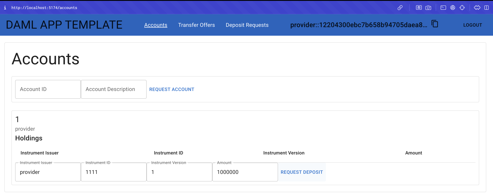
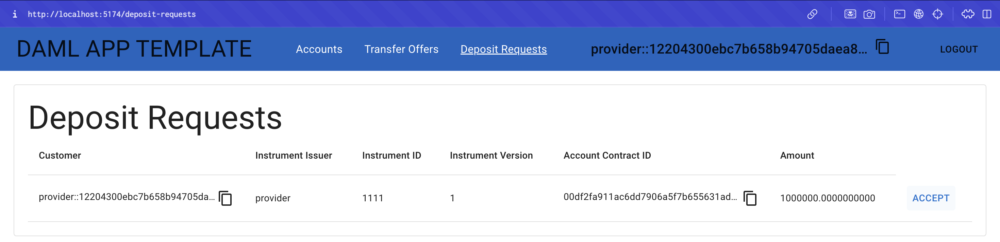
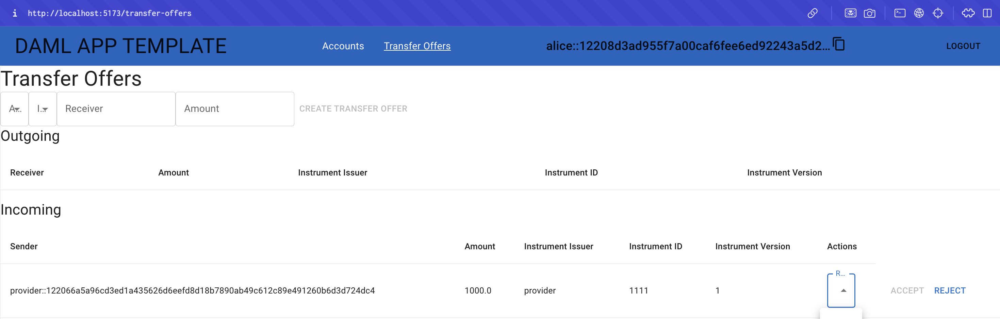
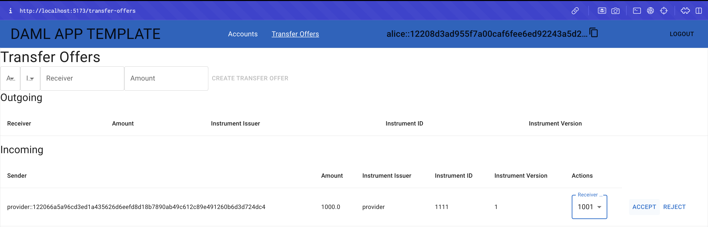
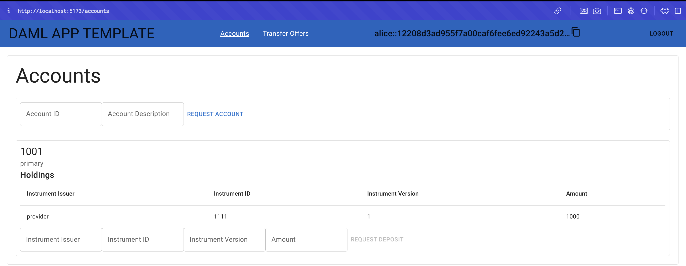

.. Copyright (c) 2024 Digital Asset (Switzerland) GmbH and/or its affiliates. All rights reserved.
.. SPDX-License-Identifier: Apache-2.0

Demo a Complete Business Operation
==================================

The following business operation features account creation, a transfer offer, and a finalized asset transfer between a ``provider`` and a user, ``alice``.

The ``provider`` initiates the process by creating and fulfilling a deposit request, which represents the availability of assets for transfer. Subsequently, the provider creates a transfer offer for ``alice``, demonstrating the ``provider``'s role in managing and facilitating asset availability within a system. After Alice creates an account, she views and accepts the transfer offer made by the ``provider``. This results in both users updating the balances.

The complete business operation showcases how Daml can facilitate financial transactions and ensure secure and transparent operations between parties. It demonstrates the management of digital assets while maintaining data integrity within a permissioned :doc:`ledger </concepts/ledger-model/index>` environment.

**Request an account**

1. Open two incognito browser tabs to demo the Daml Application Template.

   .. note::
      Incognito mode is recommended to avoid browser caching issues.

   For convenience, split the browsers side by side, either horizontally or vertically, based on your preference.

   Horizontal split:

   .. image:: images/localhost-horizontal-split.png
      :alt: Horizontal split browser view

   Vertical split:

   .. image:: images/localhost-vertical-split.png
      :alt: Vertical split browser view

2. Open ``alice``'s browser to request an account:

   - In "Account ID" enter "1001".
   - In "Account Description" enter "primary".
   - Click "Request Account" to create the account for ``alice``.

   .. image:: images/accounts-alice.png
      :alt: Alice accounts view

3. Select the ``provider`` browser:

   - In the "Account ID" field, enter "1".
   - In the "Account Description" field, enter a description such as "provider transfer account".
   - Click on "Request Account".

   .. image:: images/accounts-provider.png
      :alt: Provider accounts view

**The Provider Role**

*Providers represent an entity that offers financial services or assets to users. They build and operate Daml applications that automate cross-organizational workflows among application users. The provider operates the synchronizer, which is critical to sequence, route, and confirm transactions across* :doc:`participant nodes </deploy-daml/infrastructure-architecture/high-availability/basic-ha/participant>`. *In practice, the provider is the reason for the existence of the Daml application and corresponding services.*

**Create a deposit request**

1. Confirm you are in the ``provider``'s browser.
2. Name Instrument Issuer as "provider".
3. Name Instrument ID as "1111".
4. Label Instrument Version as "1".
5. Set the Amount to "1000000"
6. Click on "Request Deposit".

**Accept the deposit request**

1. In the top menu, select "Deposit Requests".
2. The deposit request is processed and shown in the ``provider``'s view. In addition to the information you provided, the request also shows the customer and the account `contract ID <https://docs.daml.com/daml/stdlib/Prelude.html#type-da-internal-lf-contractid-95282>`_.
3. Accept the deposit request.
4. Return to the Accounts menu. The holdings are updated and added to the ``provider``'s account.

**Create a transfer offer**

The ``provider`` can now create a transfer offer to send a portion of the funds to ``alice``.

1. Select "Transfer Offers" in the top menu.
2. Under "Transfer Offers", use the "Account" drop-down list to select the funded account.
3. Select the "Instrument Key" field and click on the ``provider``'s depository key.
4. Switch to ``alice``'s browser and copy her Party ID in the top menu.
5. Paste ``alice``'s ID in the "Receiver" field.
6. In Amount enter "1000".
7. Click "Create Transfer Offer".
8. The transfer offer is updated under the Outgoing offers.

.. image:: images/create-transfer-offers-provider.png
   :alt: Provider create transfer offer view

**Accept a transfer offer request**

1. Open ``alice``'s browser.
2. Select Transfer Offers in ``alice``'s menu.
3. The incoming request from the ``provider`` party is shown under the "Incoming" transfer offer table.

4. Click the "Receiver Account" field and select ``alice``'s primary account.
5. Click "Accept".

The account holdings are updated to reflect the outgoing 1000 credits from the ``provider`` to ``alice``. The updated balances are reflected under the Amount field in account holdings.

**Review**

You have completed a full business operation in the single domain quick start. The ``provider`` requested an account, performed a deposit request, and made a transfer offer. Alice requested her own account and accepted the ``provider``'s transfer offer. This demonstrates how funds may be transferred in real time under a single domain.

In the next section you learn how to extend the app template.