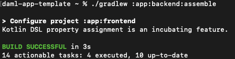

.. Copyright (c) 2024 Digital Asset (Switzerland) GmbH and/or its affiliates. All rights reserved.
.. SPDX-License-Identifier: Apache-2.0

Update the Backend API
======================

Update the backend Java code to handle the new choice based on the user's actions in the frontend.

The backend update includes modifications to three existing files within the ``app/backend`` subdirectories, ``api.yaml``, ``Store.java``, and ``UserApiDelegateImpl.java``.

**Step 1: Modify api.yaml**

Define the API endpoint in ``api.yaml`` to allow users to retrieve rejected transfer offers. The endpoint is added to ``api.yaml`` (located in ``/app/backend/src/main/openapi/``) after the ``/user/transfer-offers/disclosed-contracts-for-accept`` endpoint. It bridges the desired business operation with the system's data and business logic.

.. code-block:: yaml
   :linenos:
   :lineno-start: 123

     /user/rejected-transfer-offers:
       get:
         security:
           - BearerAuth: []
         tags:
           - read
         summary: Get rejected transfer offers
         operationId: getRejectedTransferOffers
         responses:
           '200':
             description: Successfully retrieved rejected transfer offers
             content:
               application/json:
                 schema:
                   $ref: '#/components/schemas/ListRejectedTransferOfferResponse'
           '403':
             description: Permission denied
           '500':
             description: Internal server error

``Rejected-transfer-offers`` is a read operation API endpoint that uses a GET request to retrieve rejected transfer offers. It requires bearer token authentication and can return three types of responses: success (200), permission denied (403), or server error (500).

A success response returns data in a defined JSON format, structured according to the ``ListRejectedTransferOfferResponse`` schema. The following schema includes a rejected transfer offer object and an array of items, ensuring a consistent data structure for clients.

Add the schema ``ListRejectedTransferOfferResponse`` after the schema ``GetTransferOfferResponse``.

.. code-block:: yaml
   :linenos:
   :lineno-start: 238

       ListRejectedTransferOfferResponse:
         type: object
         required:
           - rejected_transfer_offer
         properties:
           rejected_transfer_offers:
             type: array
             items:
               $ref: "#/components/schemas/TemplateContract"

The schema ensures that the success response includes a list of rejected transfer offers. Together, the endpoint and schema define how to request and interpret data about rejected transfer offers. 

**Step 2: Update Store.java**

Next, locate ``Store.java`` in ``/app/backend/src/main/java/com/daml/app/template/store``.

Import the ``RejectedTransferOffer`` template with the existing model imports.

.. code-block:: java
   :linenos:
   :lineno-start: 20

    import com.daml.app.template.codegen.com.daml.app.template.model.RejectedTransferOffer;

Add a method, ``listRejectedTransferOffers``, near the end of the file, above the ``listTransientFailureRequests`` method. ``listRejectedTransferOffers`` retrieves transfer offer rejections using the :doc:`Participant Query Store </query/pqs-user-guide>` (PQS). 

.. code-block:: java
   :linenos:
   :lineno-start: 423

      public List<TemplateContract<RejectedTransferOffer.ContractId, RejectedTransferOffer>>
        listRejectedTransferOffers(String userPartyId) {
          return pqs.queryTemplates(
                  RejectedTransferOffer.COMPANION,
                  """
                  select contract_id, payload::text, metadata
                    from active('Com.Daml.App.Template.Model:RejectedTransferOffer')
                    where payload -> 'transferOffer' ->> 'provider' = ?
                      and (payload -> 'transferOffer' ->> 'sender' = ? or payload -> 'transferOffer' ->> 'receiver' = ?)
                  """,
                  getProviderParty(),
                  userPartyId,
                  userPartyId)
              .value();
        }

The ``listRejectedTransferOffers`` method queries PQS for rejected transfer offers. It takes the user's ID as input and returns a list of ``TemplateContract`` objects containing the rejected transfer offer data.

:doc:`Participant Query Store </query/pqs-user-guide>`

*PQS operates as a separate service within the participant's infrastructure. It maintains a mirrored copy of the ledger data in a queryable format. PQS is intended as a long-running process that may be safely restarted at any time. It provides a scalable "read" pipeline that follows the Command Query Responsibility Segregation (CQRS) design pattern, which separates read operations from write operations to improve performance and scalability.*

In this extension, PQS fetches and manages relevant rejected transfer offers, enhancing the application's ability to handle the full lifecycle of transfer offers, including their rejection.  

**Step 3: Update UserApiDelegateImpl.java**

Find ``UserApiDelegateImpl.java`` in ``/app/backend/src/main/java/com/daml/app/template/api/``. 

Implement the endpoint added under ``/user/`` in ``api.yaml`` by delegating rejected transfer offer contract retrieval to ``Store.java``.

First, import ``TemplateContract`` and the ``RejectedTransferOffer`` template from the Daml model.

.. code-block:: java
   :linenos:
   :lineno-start: 4

    import com.daml.app.common.TemplateContract;
    import com.daml.app.template.codegen.com.daml.app.template.model.RejectedTransferOffer;

Import the ``Collectors`` utility.

.. code-block:: java
   :linenos:
   :lineno-start: 15

    import java.util.stream.Collectors;

Then, implement the ``getRejectedTransferOffers`` method after the currently existing ``getTransferOffer`` method.

.. code-block:: java
   :linenos:
   :lineno-start: 119

      @Override
      public ResponseEntity<ListRejectedTransferOfferResponse> getRejectedTransferOffers() {
        final String userPartyId = getUserPartyId();
        try {
          List<TemplateContract<RejectedTransferOffer.ContractId, RejectedTransferOffer>>
              rejectedOffers = store.listRejectedTransferOffers(userPartyId);

          List<com.daml.app.template.model.TemplateContract> openApiRejectedOffers =
              rejectedOffers.stream()
                  .map(offer -> offer.toOpenApiServer(objectMapper))
                  .collect(Collectors.toList());

          var response = new ListRejectedTransferOfferResponse();
          response.setRejectedTransferOffers(openApiRejectedOffers);

          return ResponseEntity.ok(response);
        } catch (Exception e) {
          logger.error(
              "Error fetching rejected transfer offers for user {}: {}", userPartyId, e.getMessage());
          return ResponseEntity.status(HttpStatus.INTERNAL_SERVER_ERROR).build();
        }
      }

The ``getRejectedTransferOffers`` method serves as an interface between the API and the data store. 

It calls ``store.listRejectedTransferOffers`` to fetch the list of the user's observable rejected transfer offer contracts from the store. Then, it maps the retrieved rejected offers to the OpenAPI server format, creates a ``ListRejectedTransferOfferResponse`` object, and populates the object with mapped offers. Finally, it returns an HTTP response containing the list of rejected transfer offers.

The interface ensures that the API can retrieve and return rejected transfer offers while maintaining consistency with the API specifications defined in ``api.yaml``. 

Verify that all changes have been saved, then rebuild the backend.

.. code-block:: bash

   ./gradlew :app:backend:assemble

Gradle generates the backend files with the new API endpoints.

