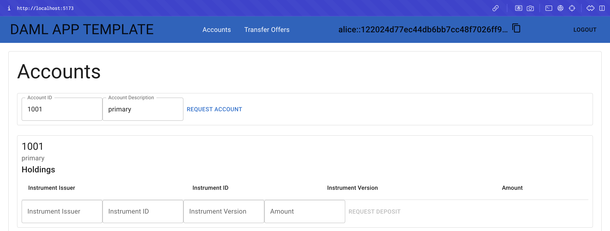
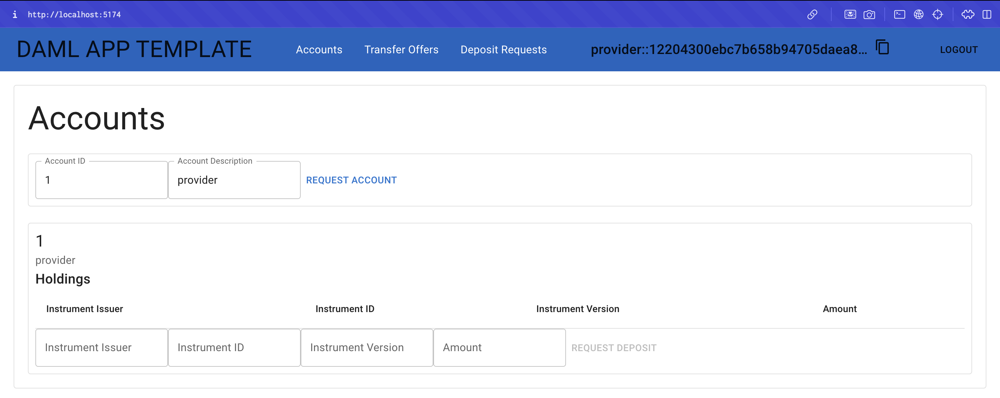
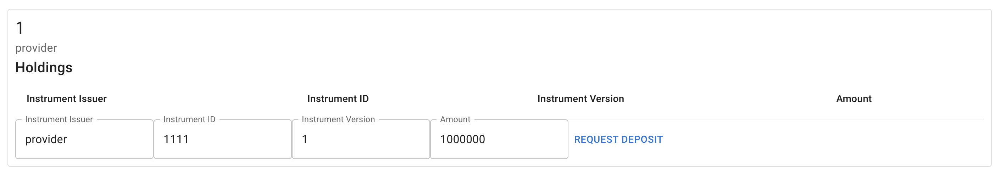
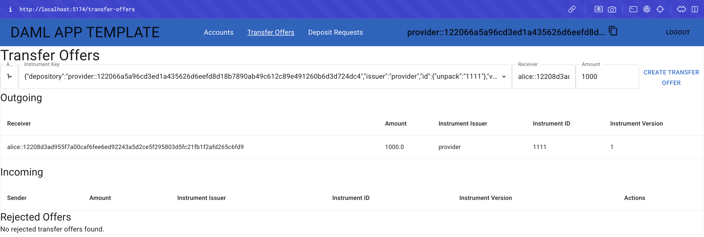
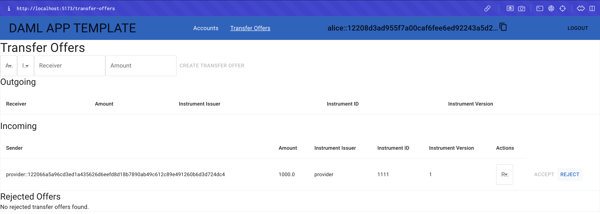
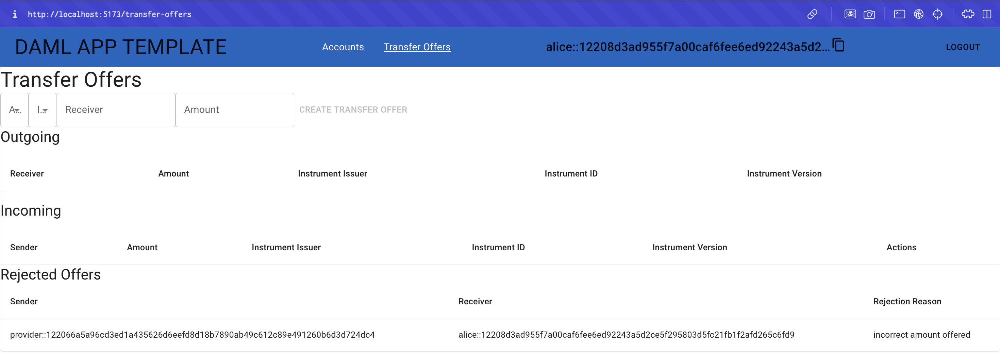

.. Copyright (c) 2024 Digital Asset (Switzerland) GmbH and/or its affiliates. All rights reserved.
.. SPDX-License-Identifier: Apache-2.0

Demo the Daml Extension
=======================

Follow these steps to demonstrate the new functionality in the Daml application:

1. Open an incognito browser and navigate to ``localhost:5173`` (or the designated localhost). 

2. Log in as 'alice'. Remember to use all lowercase.

3. In Alice's browser, request an account.

4. Open a second incognito browser and navigate to ``localhost:5174``. 

5. Login as 'provider'.

6. In the provider's browser, request an account.

7. Request a deposit.

8. Fulfill the deposit request.

.. image:: images/deposit-requests-provider-accept.png

9. Create a transfer offer. Remember to copy Alice's ID and paste her identification in the "Receiver" field.

10. Return to Alice's browser. Select the "Transfer Offers" option in the menu.

11. Alice should now see an incoming transfer offer.

12. Select "REJECT" to deny the offer.

13. Enter a reason for the rejection in the "Reject Transfer Offer" dialog modal.

.. image:: images/demo-extension-reject-offer-07.png

14. The transfer offer is archived and listed in the new "Rejected Offers" table.

Summary
-------

You are now equipped with the knowledge to extend single domain Daml applications. You have:

- Defined a new choice
- Updated the backend service
- Created API handlers
- Implemented interactive components to extend the quickstart application

Congratulations! Reach out on the `Daml Forum <https://discuss.daml.com>`_ to tell us you completed the Single Domain Quickstart Tutorial! The Daml Forum is an excellent place to ask questions and request assistance. The `Daml documentation <https://docs.daml.com>`_ is always live, as well.