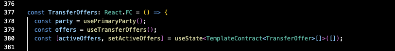
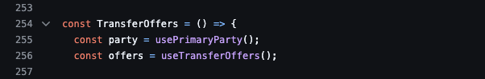
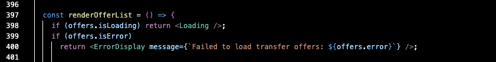
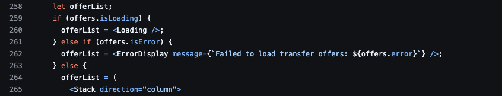
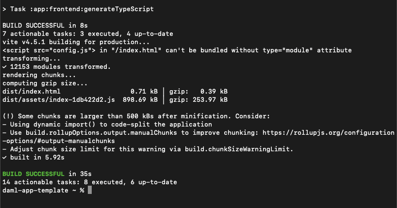

.. Copyright (c) 2024 Digital Asset (Switzerland) GmbH and/or its affiliates. All rights reserved.
.. SPDX-License-Identifier: Apache-2.0

Extend the Frontend
===================

The backend is complete. However, the user needs a convenient way to interact with the model and endpoints. UI components in the form of buttons provide event listeners that activate the desired behavior in the backend. To accomplish this goal, begin by creating hooks to handle the API calls.

**Step 1: Create the Hooks**

Add two hooks. The first is a query hook, ``useRejectedTransferOffers``, that reads the ``RejectedTransferOffers`` through a backend API endpoint. The second is a mutation hook, ``useRejectWithReason``, which exercises the ``RejectWithReason`` choice through a frontend JSON API endpoint. 

Begin with the query hook in the ``/app/frontend/src/hooks/queries`` subdirectory.

*useRejectedTransferOffers.ts*

.. code-block:: typescript
   :linenos:
   :lineno-start: 1

    import { UseQueryResult, useQuery } from '@tanstack/react-query';
    import {
      ListRejectedTransferOfferResponse,
      TemplateContract as ApiTemplateContract,
    } from 'app-read-api-ts-client';
    import { RejectedTransferOffer as DamlRejectedTransferOffer } from '@daml.js/daml-app-template/lib/Com/Daml/App/Template/Model';
    import TemplateContract from '../../utils/TemplateContract';
    import useAuthenticatedReadApi from './useAuthenticatedReadApi';

This section imports necessary React query hooks, types from the API client, and Daml-generated types. Notably, the ``useAuthenticatedReadApi`` import handles authenticated backend API requests.

.. code-block:: typescript
   :linenos:
   :lineno-start: 10

    const useRejectedTransferOffers = (): UseQueryResult
      TemplateContract<DamlRejectedTransferOffer>[],
      string
    > => {
      const readApi = useAuthenticatedReadApi();

      return useQuery({
        queryKey: ['RejectedTransferOffers', readApi],
        queryFn: async () => {
          if (!readApi) throw new Error('Read API not available');
          try {
            const response: ListRejectedTransferOfferResponse =
              await readApi.getRejectedTransferOffers();

            const rejectedOffers = response.rejected_transfer_offers || [];

            return rejectedOffers.map((rejectedOffer: ApiTemplateContract) =>
              TemplateContract.fromOpenAPI(DamlRejectedTransferOffer, rejectedOffer),
            );

The ``useRejectedTransferOffers`` hook definition fetches rejected transfer offers with React Query's ``useQuery``. ``queryFn`` calls ``readApi.getRejectedTransferOffers()`` to fetch data from the backend. It maps ``TemplateContract`` objects and converts the data from the API to the Daml format, then returns the rejected transfer offers' data and status.

.. code-block:: typescript
   :linenos:
   :lineno-start: 29

          } catch (error: unknown) {
            console.error('Error fetching rejected transfer offers:', error);
            if (error instanceof Error) {
              if ('status' in error && error.status === 501) {
                throw new Error('The rejected transfer offers feature is not implemented yet.');
              }
              throw error;
            }
            throw new Error('Failed to fetch rejected transfer offers.');
          }
        },
        enabled: !!readApi,
      });
    };

    export default useRejectWithReason;

This block handles error cases when fetching rejected transfer offers. It logs errors, checks for a 501 status, and throws appropriate error messages. The ``enabled`` option ensures the query only runs when ``readApi`` is available. 

Next, write the mutation hook in ``/app/frontend/src/hooks/mutations``.

Mutation hooks differ from query hooks in that they connect directly to frontend JSON API endpoints. This mutation updates the Daml ledger via interaction with the ``RejectWithReason`` choice created in ``Model.daml``.

*useRejectWithReason.ts*

.. code-block:: typescript
   :linenos:
   :lineno-start: 1

    import { UseMutationResult, useMutation, useQueryClient } from '@tanstack/react-query';
    import { TransferOffer } from '@daml.js/daml-app-template/lib/Com/Daml/App/Template/Model';
    import { ContractId } from '@daml/types';
    import useLedgerApiClient from '../queries/useLedgerApiClient';

The ``useLedgerApiClient`` import calls the query hook by the same name to access the Daml ledger API client. The client enables the React hook to update the Daml :doc:`ledger state </getting-started/app-architecture>`. In this event, to exercise the ``RejectWithReason`` choice in the Daml model.

.. code-block:: typescript
   :linenos:
   :lineno-start: 6

    type RejectWithReasonInput = {
      transferOfferId: ContractId<TransferOffer>;
      reason: string;
    };

    type RejectWithReasonResult = {
      transferOfferId: ContractId<TransferOffer>;
      reason: string;
    };

Two TypeScript types, ``RejectWithReasonInput`` and ``RejectWithReasonResult``, are created in this block. The input and result mirror one another in that they both include a ``ContractId`` of a ``TransferOffer`` and a ``reason``. This structure ensures type safety in the ``useRejectWithReason`` hook.

.. code-block:: typescript
   :linenos:
   :lineno-start: 16

    const useRejectWithReason = (): UseMutationResult
      RejectWithReasonResult,
      Error,
      RejectWithReasonInput
    > => {
      const ledgerApi = useLedgerApiClient();
      const queryClient = useQueryClient();

This block defines the mutation hook. It specifies ``RejectWithReasonResult`` as the successful mutation result, ``Error`` for error handling, and ``RejectWithReasonInput`` as the input type. The hook initializes the ledger API and query clients to manage API interactions.

.. code-block:: typescript
   :linenos:
   :lineno-start: 24

      return useMutation<RejectWithReasonResult, Error, RejectWithReasonInput>({
        mutationFn: async ({ transferOfferId, reason }) => {
          console.log('Rejecting offer:', transferOfferId, 'with reason:', reason);
          await ledgerApi.RejectWithReason(transferOfferId, reason);
          console.log('Offer rejected successfully.');
          return { transferOfferId, reason };
        },

``useMutation`` handles ``useRejectWithReason``'s rejection process. The ``mutationFn`` logs the rejection attempt. Then the Daml choice, ``RejectWithReason``, is exercised via the ledger API. ``RejectWithReason`` takes the ``transferOfferId`` and ``reason`` as parameters, logs the successful rejection, and returns the result.

.. code-block:: typescript
   :linenos:
   :lineno-start: 31

        onSuccess: async (data) => {
          console.log('Rejection successful, invalidating queries');
          try {
            await queryClient.invalidateQueries(['ListTransferOffers']);
            await queryClient.invalidateQueries(['ListRejectedTransferOffers']);
            console.log('Queries invalidated successfully');
          } catch (error) {
            console.error('Failed to invalidate queries:', error);
          }
          return data;
        },
      });
    };

    export default useRejectWithReason;

The final block of the mutation hook handles post-rejection tasks. It logs the successful rejection, invalidates the queries so they cannot be made again, and ensures the UI reflects the updated state after rejection.

**Step 2: Update LedgerApiClient.ts**

Next, implement a ``RejectWithReason`` method in ``LedgerApiClient.ts`` to exercise a choice directly on the Daml ledger.

Locate ``LedgerApiClient.ts`` in ``/app/frontend/src/utils/``.

Add these methods near the end of the file, after the asynchronous ``acceptTransferOffer`` method.

.. code-block:: typescript
   :linenos:
   :lineno-start: 115

    async RejectWithReason(
      transferOfferCid: ContractId<TransferOffer>,
      reason: string,
    ): Promise<void> {
      await this.ledger.exercise(TransferOffer.RejectWithReason, transferOfferCid, { reason });
    }

Defines an asynchronous method that takes a transfer offer contract ID and a reason as parameters and returns a ``Promise``.

``await this.ledger.exercise`` calls the ``exercise`` method on the Daml ledger client, which triggers the ``RejectWithReason`` choice on the targeted ``TransferOffer`` contract.

The ``RejectWithReason`` method is critical because it allows the frontend to communicate with the Daml ledger.

**Step 3: Refactor TransferOffers.tsx**

The next step is to wire up the frontend components in ``TransferOffers.tsx``. To complete this objective we must:

- Add the import statements
- Implement the ``rejectWithReason`` hook as a constant and create a rejection handler
- Refactor the ``IncomingTransferOffer`` UI Rendering
- Add a ``Dialog`` element
- Create the rejected transfer offers table
- Refactor the ``TransferOffers`` functional component

**Add the import statements**

Add ``useEffect`` and ``useCallback`` aliases to the ``react`` module import.
Next, include the ``Dialog``-related aliases to the ``mui/material`` module import.
Add the new import statements under the ``useAcceptTransferOffer`` import statement in ``/components/TransferOffers.tsx``.

.. code-block:: typescript
   :linenos:
   :lineno-start: 1

    import { useMemo, useState, useEffect, useCallback } from 'react';
    import {
      Button,
      Card,
      Dialog,
      DialogActions,
      DialogContent,
      DialogTitle,
      MenuItem,
      Stack,
      Table,
      TableBody,
      TableCell,
      TableHead,
      TableRow,
      TextField,
      Typography,
    } from '@mui/material';
    ...
    import useRejectWithReason from '../hooks/mutations/useRejectWithReason';
    ...
    import useRejectedTransferOffers from '../hooks/queries/useRejectedTransferOffers';

**Implement the rejectWithReason hook as a constant and create a rejection handler**

In the same file, add error handling to the existing ``IncomingTransferOffer`` component.

.. code-block:: typescript
   :linenos:
   :lineno-start: 203

    const IncomingTransferOffer = ({
      offer,
      onRejected,
    }: {
      offer: TemplateContract<TransferOffer>;
      onRejected: (offerId: ContractId<TransferOffer>) => void;
    }) => {

The ``IncomingTransferOffer`` component now accepts two properties, ``offer`` and ``onRejected``. ``onRejected`` has been added to improve error handling in the component.

Next, initialize new state variables and the mutation hook directly beneath the existing constants in the ``IncomingTransferOffer`` component.

.. code-block:: typescript
   :linenos:
   :lineno-start: 222

    const [isRejectDialogOpen, setIsRejectDialogOpen] = useState(false);
    const [rejectionReason, setRejectionReason] = useState('');
    const [isRejectClicked, setIsRejectClicked] = useState(false);
    const rejectWithReason = useRejectWithReason();

The state variables control the rejection dialog visibility, store the rejection reason, and track if the reject button has been clicked. The hook mutation executes transfer offer rejections.

Immediately after the ``const`` expressions, create a handler function that triggers when the user initiates a rejection.

.. code-block:: typescript
   :linenos:
   :lineno-start: 227

    const handleRejectClick = () => {
      setIsRejectDialogOpen(true);
      setIsRejectClicked(true);
    };

The ``handleRejectClick`` handler opens a rejection dialog by setting ``isRejectDialogOpen`` to true and indicates that the ‘reject’ button has been clicked by setting ``isRejectClicked`` to true.

Follow the handler with a callback function to execute the transfer offer rejection.

.. code-block:: typescript
   :linenos:
   :lineno-start: 232

    const handleRejectConfirm = useCallback(() => {
      console.log('Attempting to reject transfer offer:', offer.contractId);
      rejectWithReason.mutate(
        { transferOfferId: offer.contractId, reason: rejectionReason },
        {
          onSuccess: (data) => {
            setIsRejectDialogOpen(false);
            setRejectionReason('');
            onRejected(data.transferOfferId);
          },
        },
      );
    }, [rejectWithReason, offer.contractId, rejectionReason, onRejected]);

``handleRejectConfirm`` logs the rejection attempt and calls the ``rejectWithReason`` hook mutation with the transfer offer ID and reason as parameters. On a successful attempt, the dialog is closed, the reason cleared, and the ``onRejected`` callback is triggered.

Next, the state of ``isRejectedClicked`` and the hook mutation state are logged in the browser console.

.. code-block:: typescript
   :linenos:
   :lineno-start: 246

    console.log('Component rendering. isRejectClicked:', isRejectClicked);
    console.log('Mutation state:', rejectWithReason);

**Refactor the IncomingTransferOffer UI**

Next, refactor the ``IncomingTransferOffer`` UI rendering to introduce the new rejection functionality.

.. note::
   The JSX is extensive. Updates to the existing code are highlighted. Revisions to the JSX format have been made for enhanced readability, but are not otherwise marked.

.. code-block:: jsx
   :linenos:
   :lineno-start: 249
   :emphasize-lines: 2, 34-35, 44-48, 54-62

      return (
        <>
        <TableRow aria-label="incoming transfer">
          <TableCell aria-labelledby="incoming-transferoffer-sender">
            {offer.payload.sender}
          </TableCell>
          <TableCell aria-labelledby="incoming-transferoffer-amount">
            {renderedFungible.amount}
          </TableCell>
          <TableCell aria-labelledby="incoming-transferoffer-instrument-issuer">
            {renderedFungible.instrumentIssuer}
          </TableCell>
          <TableCell aria-labelledby="incoming-transferoffer-instrument-id">
            {renderedFungible.instrumentId}
          </TableCell>
          <TableCell aria-labelledby="incoming-transferoffer-instrument-version">
            {renderedFungible.instrumentVersion}
          </TableCell>
          <TableCell>
            <TextField
              select
              label="Receiver Account"
              value={receiverAccountCid || ''}
              onChange={(e) => setReceiverAccountCid(e.target.value as ContractId<Account>)}
            >
              {(accounts.data || []).map((account) => (
                <MenuItem key={account.contractId} value={account.contractId}>
                  {account.view(Account).id.unpack}
                </MenuItem>
              ))}
            </TextField>
          </TableCell>
          <TableCell>
            {!isRejectClicked ? (
              <>
            <Button
              onClick={() => 
                acceptTransferOffer.mutate({ receiverAccountCid: receiverAccountCid! })
              }
              disabled={!receiverAccountCid || acceptTransferOffer.isLoading}
            >
              Accept
            </Button>
            <Button onClick={handleRejectClick} disabled={rejectWithReason.isLoading}>
              Reject
            </Button>
          </>
        ) : null}
        {acceptTransferOffer.isError && (
          <ErrorDisplay 
            message={`Failed to accept transfer offer ${acceptTransferOffer.error}`} 
          />
        )}
        {rejectWithReason.isError && (
          <ErrorDisplay
            message={`Failed to confirm reject transfer offer: ${
              rejectWithReason.error instanceof Error
                ? rejectWithReason.error.message
                : String(rejectWithReason.error)
            }`}
          />
          )}
          </TableCell>
        </TableRow>
      </>

This refactor of the ``IncomingTransferOffer`` JSX introduces the rejection functionality to the UI.

The outer structure of the UI rendering has changed from a single ``<TableRow>`` to a fragment ``<>`` for greater flexibility in how the UI is rendered.

The Accept button has been wrapped in a conditional render ``{!isRejectClicked ? (...) : null}`` that controls the visibility of the Accept and Reject buttons to reduce the opportunity for conflicting actions on the Daml ledger.

Finally, a new Reject button has been added.

**Add a Dialog element**

Next, add a ``<Dialog>`` element to aid in the rejection of a transfer offer. Include this element directly below the closing “incoming transfer” ``</TableRow>`` element.

.. code-block:: jsx
   :linenos:
   :lineno-start: 313

      <Dialog open={isRejectDialogOpen} onClose={() => setIsRejectDialogOpen(false)}>
        <DialogTitle>Reject Transfer Offer</DialogTitle>
        <DialogContent>
          <TextField
            autoFocus
            margin="dense"
            label="Rejection Reason"
            type="text"
            fullWidth
            value={rejectionReason}
            onChange={(e) => setRejectionReason(e.target.value)}
          />
        </DialogContent>
        <DialogActions>
          <Button onClick={() => setIsRejectDialogOpen(false)}>Cancel</Button>
          <Button
            onClick={handleRejectConfirm}
            disabled={!rejectionReason || rejectWithReason.isLoading}
          >
            Confirm Rejection
          </Button>
        </DialogActions>
      </Dialog>
    </>

The ``<Dialog>`` element creates a modal pop-up for rejecting a transfer offer. It includes a text input for the rejection reason, as well as cancel and confirm buttons. Using a Dialog simplifies the user’s process of rejecting a transfer offer by providing a dedicated user interface.

**Create the rejected transfer offers table**

The transfer offer dialog modal is followed by the rejected offers table. This table displays the user’s rejected transfer offers and the reason for each rejection.

.. code-block:: jsx
   :linenos:
   :lineno-start: 340

    const RejectedTransferOffersTable = () => {
      const rejectedOffers = useRejectedTransferOffers();

      if (rejectedOffers.isLoading) return <Loading />;
      if (rejectedOffers.isError) {
        console.error('Error loading rejected offers:', rejectedOffers.error);
        return (
          <ErrorDisplay message="Failed to load rejected offers. The feature may not be implemented yet." />
        );
      }

      if (!rejectedOffers.data || rejectedOffers.data.length === 0) {
        return <Typography>No rejected transfer offers found.</Typography>;
      }

      return (
        <Table>
          <TableHead>
            <TableRow>
              <TableCell>Sender</TableCell>
              <TableCell>Receiver</TableCell>
              <TableCell>Rejection Reason</TableCell>
            </TableRow>
          </TableHead>
          <TableBody>
            {rejectedOffers.data.map((offer) => (
              <TableRow key={offer.contractId}>
                <TableCell>{offer.payload.transferOffer.sender}</TableCell>
                <TableCell>{offer.payload.transferOffer.receiver}</TableCell>
                <TableCell>{offer.payload.rejectionReason}</TableCell>
              </TableRow>
            ))}
          </TableBody>
        </Table>
      );
    };

``RejectedTransferOffersTable`` calls the ``useRejectedTransferOffers`` query hook to fetch data from rejected transfer offers and displays its sender, receiver, and reason for the rejection. ``rejectedOffers.isError`` gracefully handles error states, and the ``rejectedOffers`` map returns requested information to the table.

**Refactor the TransferOffers Functional Component**

The ``TransferOffers`` component is responsible for managing transfer states and displaying transfer offers to each user. The component must handle incoming, outgoing, and rejected offers and render the user interface so users may interact with their offers.

Refactor the existing ``TransferOffers`` component as a functional component to ensure type safety.

.. code-block:: typescript
   :linenos:
   :lineno-start: 1

    const TransferOffers: React.FC = () => {
      const party = usePrimaryParty();
      const offers = useTransferOffers();
      const [activeOffers, setActiveOffers] = useState<TemplateContract<TransferOffer>[]>([]);

The ``TransferOffers`` functional component opens by assigning the ``usePrimaryParty`` and ``useTransferOffers`` hooks to constants. These hooks assist in fetching data necessary for transfer offers.

The new line, ``const [activeOffers, setActiveOffers]``, calls ``useState`` to manage the state of active offers. Together, the initial expressions allow the component to responsively handle and display transfer offer data.

✅ Refactored ``TransferOffers`` functional component.

⛔ Refactor replaces existing ``TransferOffers`` component.

**Create a custom hook, useEffect, to synchronize the local state of active offers**

.. code-block:: typescript
   :linenos:
   :lineno-start: 1

    useEffect(() => {
      if (offers.data) {
        setActiveOffers(offers.data);
      }
    }, [offers.data]);

``useEffect`` runs when ``offers.data`` changes, subsequently updating the ``activeOffers`` state with the latest information from the ledger. The hooks maintain accurate transfer offer information and consistency between the local state and the ledger data.

**Implement a handler to remove rejected offers**

.. code-block:: typescript
   :linenos:
   :lineno-start: 1

    const handleRejectedOffer = useCallback((rejectedOfferId: ContractId<TransferOffer>) => {
      console.log('Handling rejected offer:', rejectedOfferId);
      setActiveOffers((prevOffers) => {
        const newOffers = prevOffers.filter((offer) => offer.contractId !== rejectedOfferId);
        console.log('New active offers:', newOffers);
        return newOffers;
      });
    }, []);

The ``handleRejectedOffer`` callback takes a rejected offer’s ID as a parameter, updates the ``activeOffers`` state by filtering the rejected offer, and returns a new list of active offers. This enables the display of the current statuses of transfer offers without requiring a new data fetch from the ledger.

**Render a list of transfer offers**

Follow the rejected offer handler callback with a function to render a list of transfer offers. This block replaces the existing ``let offerList`` and subsequent ``if/else`` pattern for displaying offer list data.

.. code-block:: typescript
   :linenos:
   :lineno-start: 1

    const renderOfferList = () => {
      if (offers.isLoading) return <Loading />;
      if (offers.isError)
        return <ErrorDisplay message={`Failed to load transfer offers: ${offers.error}`} />;

      return (
        <Stack direction="column" spacing={2}>

``renderOfferList`` manages the display of transfer offers per the state of data stored in ``offers``. First, the function checks if the offers are loading and shows a loading indicator if true. Next, it checks for errors and displays an error message if any occur while fetching offers.

The return statement begins the JSX to display properly loaded transfer offers.

✅ ``const renderOfferList`` replaces the existing structure under ``let offerList``.

⛔ deprecated ``let offerList`` and ``offers if/else`` logic.

In the following JSX, replace ``offers.data`` with ``activeOffers``. Both instances are located within ``TableBody`` elements nested inside the “Outgoing” and “Incoming” Tables.

.. code-block:: jsx
   :linenos:
   :lineno-start: 417

    <TableBody>
      {activeOffers
        .filter((o) => o.payload.sender === party.data)
        .map((o) => (
          <OutgoingTransferOffer key={o.contractId} offer={o} />
        ))}
    </TableBody>

The ``IncomingTransferOffer`` map within the “Incoming” table also needs to call the rejected offer handler.

.. code-block:: jsx
   :linenos:
   :lineno-start: 439

        <TableBody>
          {activeOffers
            .filter((o) => o.payload.receiver === party.data)
            .map((o) => (
              <IncomingTransferOffer
                key={o.contractId}
                offer={o}
                onRejected={handleRejectedOffer}
              />
            ))}
        </TableBody>
        </Table>
      </Stack>
      );
    };

**Replace deprecated offerList with renderOfferList()**

In the ``TransferOffers`` component’s final return statement, replace the deprecated ``offerList`` object with the new ``renderOfferList()`` function. Include the ``<RejectedTransferOffersTable />`` element below the currently existing ``<TransferOfferRequestForm />`` element.

.. code-block:: jsx
   :linenos:
   :lineno-start: 455

      return (
        <Card variant="outlined">
          <Typography variant="h4">Transfer Offers</Typography>
          <TransferOfferRequestForm />
          {renderOfferList()}
          {offers.data && (
            <>
              <Typography variant="h5">Rejected Offers</Typography>
              <RejectedTransferOffersTable />
            </>
          )}
        </Card>
      );
    };

You have successfully extended the application to reject a transfer offer. Ensure the changes are saved, then rebuild the frontend.

**Assemble the TypeScript frontend**

.. code-block:: bash

    ./gradlew :app:frontend:assemble

This command assembles the TypeScript frontend. If successful, it outputs `BUILD SUCCESSFUL.`

**Observe the new functionality by starting the Canton server**

In the first terminal, begin the Canton server:

.. code-block:: bash

    ./scripts/start-canton.sh

In a second terminal, run the Daml tests followed by the backend tests:

.. code-block:: bash

    ./gradlew :app:daml:test
    ./gradlew :app:backend:test

Lint the codebase:

.. code-block:: bash

    ./gradlew spotlessCheck
    ./gradlew spotlessApply

Start the backend server:

.. code-block:: bash

    ./gradlew bootRun --args='--spring.profiles.active=dev'

In a third terminal, begin the frontend server:

.. code-block:: bash

    cd app/frontend
    npm run dev

In a fourth terminal, from the ``frontend`` subdirectory, begin the provider’s frontend server:

.. code-block:: bash

    JSON_API_PORT=4003 npm run dev
