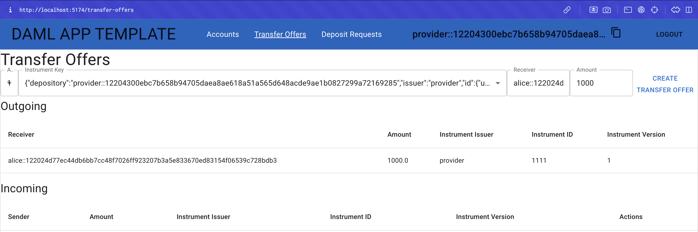
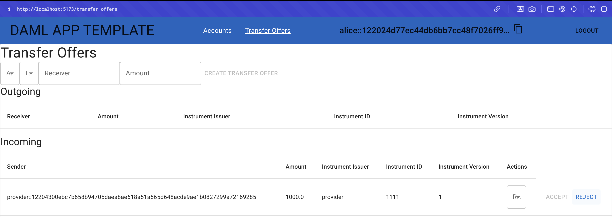
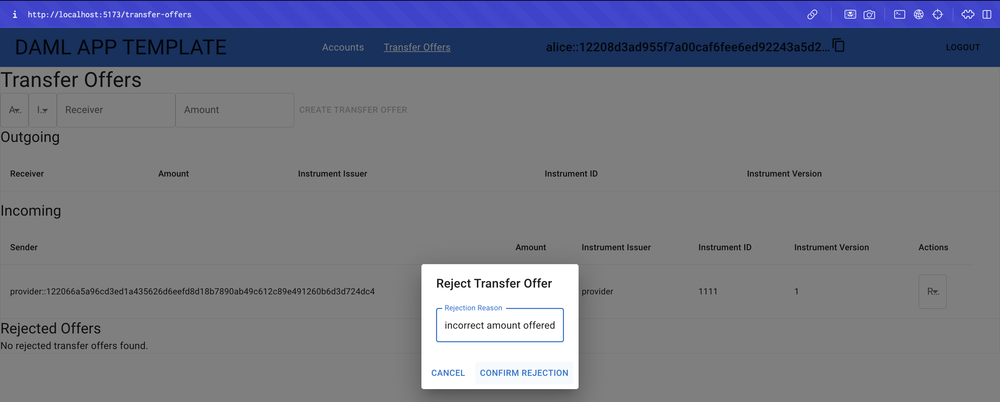
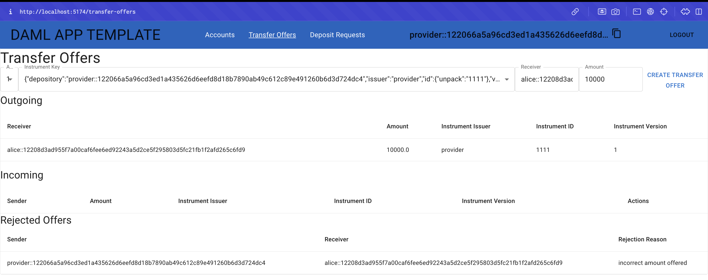
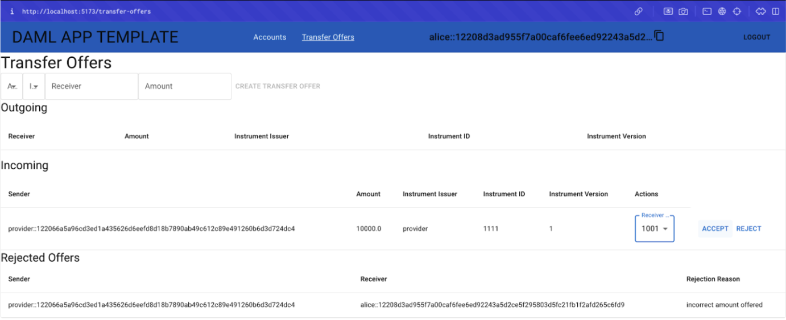
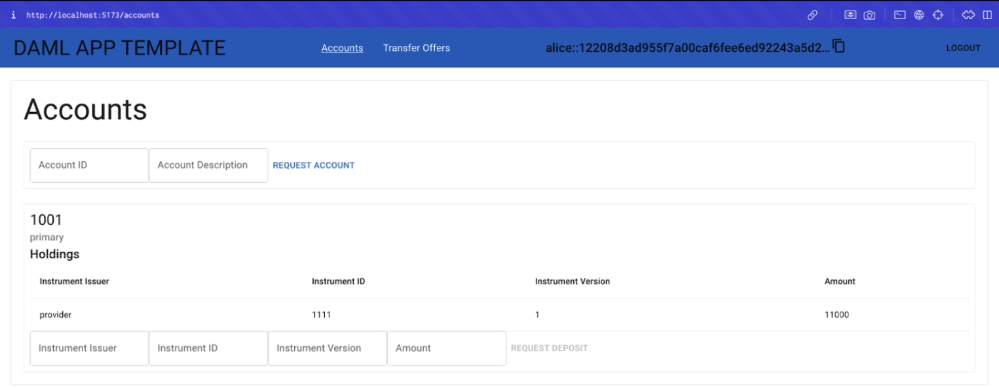

.. Copyright (c) 2024 Digital Asset (Switzerland) GmbH and/or its affiliates. All rights reserved.
.. SPDX-License-Identifier: Apache-2.0

Extend the Application
======================

Alice can accept a transfer offer from the provider. However, it's possible that Alice, or any other user, may want to reject a transfer offer. For example, the provider may offer an incorrect amount, or the user may decide to reject the transfer for another reason. The remainder of this guide demonstrates how to extend the single-domain Daml application using an example scenario.

Plan the Extension
------------------

It's critical to break updates into manageable parts. Extend the business operation in three steps to include a choice that rejects transfer offers:

1. Update the model
   Create a new `template <https://docs.daml.com/daml/stdlib/Prelude.html#type-da-internal-template-functions-template-31804>`_ and `choice <https://docs.daml.com/daml/stdlib/Prelude.html#type-da-internal-template-functions-choice-82157>`_ in the Daml model to allow users to reject a transfer offer with a reason. The choice represents a new action that may be taken against a given contract.

2. Update the backend
   Add new API endpoints in the Java backend that communicate with the Daml ledger. The endpoints interact with the new choice.

3. Update the frontend
   Update the TypeScript frontend UI elements and event listeners to trigger the new choice via a web interface.

Visualize a Use Case
--------------------

Imagine that the provider creates a transfer offer of 1,000 credits. 

Alice sees the offer, but is disappointed. The offer was expected to be 10,000 credits. Instead of accepting the faulty offer, Alice decides to reject the offer.

Alice explains the reason for her rejection so the provider understands the denial.

The provider sees the rejected offer in the "Rejected Offers" table and creates an accurate transfer offer.

Alice, now satisfied, accepts the offer. 

The transfer of 10,000 credits is completed successfully. Alice's balance is updated.

