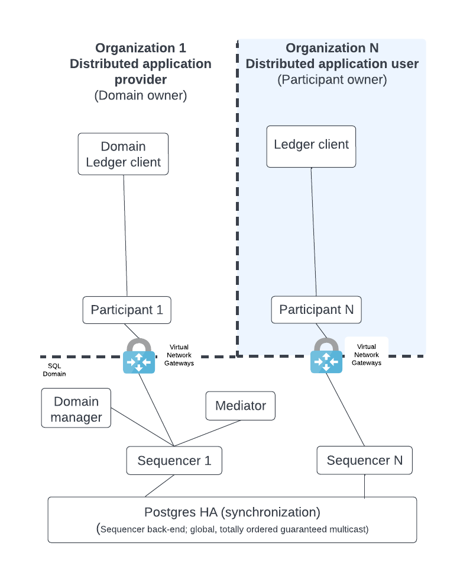
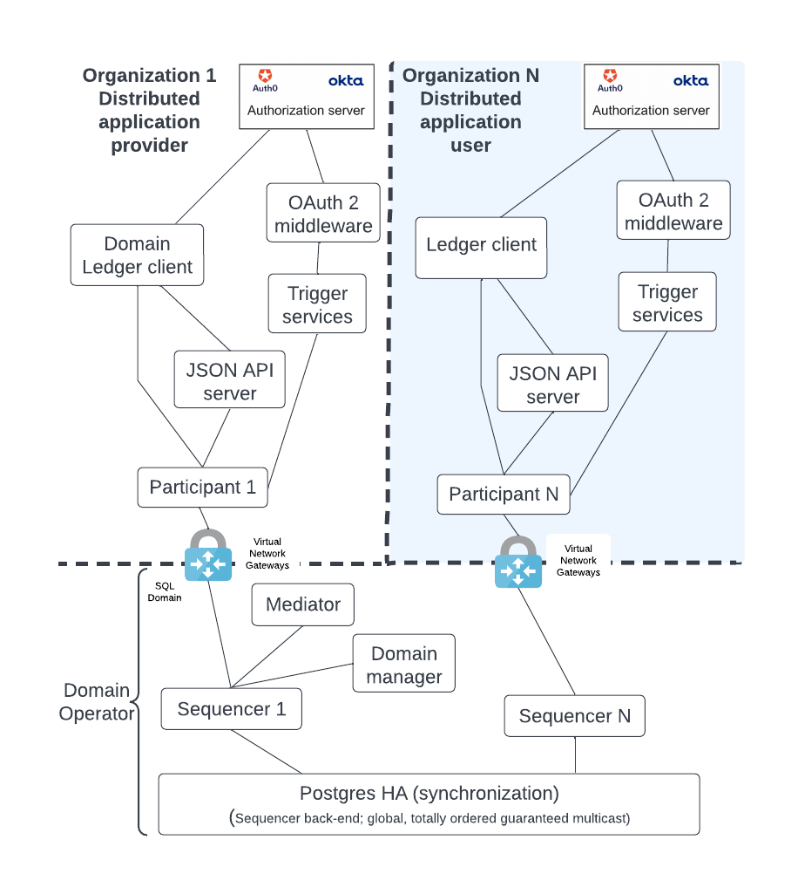

.. Copyright (c) 2023 Digital Asset (Switzerland) GmbH and/or its affiliates. All rights reserved.
.. SPDX-License-Identifier: Apache-2.0

Daml Deployment Solution
########################

The diagram below demonstrates the most basic, multi-party, Daml deployment possible. Each logical box in the diagram contains multiple internal components in a HA production configuration. The `High Availability and Horizontal Scaling </deploy-daml/infrastructure-architecture/ha-and-scaling/implementing-ha.html>`_ section expands on each of these logical boxes to show how they are configured for production.  

.. https://lucid.app/lucidchart/d3a7916c-acaa-419d-b7ef-9fcaaa040447/edit?invitationId=inv_b7a43920-f4af-4da9-88fc-5985f8083c95&page=0_0#

The diagram shows the following components:

* **Ledger client** that uses the Ledger API; the client entry point to execute business logic. 
* **Participant** nodes which expose the public Ledger API. They execute the Daml business logic of the distributed application based on an API request or as part of the Canton transaction consensus protocol.
* **Mediator** which acts as a transaction manager for the Canton consensus protocol. Ensures either all of the parts of a transaction succeed or there is no change.
* **Domain manager** which manages the domain with transactions that update the topology and make public keys available.
* **Sequencer** exposes the Canton API so that all clients see events as ordered by a guaranteed, multicast communication mechanism. It has a backend component that is hidden from its clients. Depending on the backend component, the solution supports either a SQL or blockchain domain.

.. NOTE::
    Please note that the term **node** may refer to a logical box with multiple components or as a single JVM process with the context determining how to interpret node.

The distributed application **provider** deploys several components: the domain (domain manager [#f1]_, mediator, and sequencer) and their own participant node(s). 

The distributed application **user** only has to deploy a participant node and connect that node (from their own private network) to the private network of the domain via communication with a sequencer. [#f2]_

A typical Daml deployment has additional components which are shown in the figure below:

.. https://lucid.app/lucidchart/d3a7916c-acaa-419d-b7ef-9fcaaa040447/edit?invitationId=inv_b7a43920-f4af-4da9-88fc-5985f8083c95&page=0_0#

The diagram shows the following components:

* An HTTP JSON API server which supplements the gRPC API endpoints of the participant node by providing an HTTP REST (HTTP JSON API) endpoint. It also has an internal cache so that it can be more responsive to queries.
* A Trigger service that listens to the ledger event stream and triggers business logic based on ledger events.
* OAuth2 middleware that supports a refresh of the Trigger services JWT token and manages the background requests for a refresh token for the Trigger services.
* The Identity Provider (IDP) is the authentication entity that provides the JWT token.. The IDP is outside of the Daml solution but nevertheless a necessary component. Different organizations may use different IDPs for their participant nodes.

.. NOTE::
    We expect the domain owner to implement additional business logic for managing the distributed application in both their participant node and trigger service nodes. 

.. rubric:: Footnotes

.. [#f1] The domain manager can also be referred to as the 'topology manager'. For a production deployment, the domain manager can be thought of as containing the topology manager with some additional capabilities.
.. [#f2] Although there are multiple sequencers shown, this is just for illustration purpose. As little as a single sequencer is needed. For example, Organization N's participant node could connect to Sequencer 1 and not Sequencer N.