.. Copyright (c) 2023 Digital Asset (Switzerland) GmbH and/or its affiliates. All rights reserved.
.. SPDX-License-Identifier: Apache-2.0

Implementing HA and Scaling Deployments
#######################################

.. BLOCKED
.. https://docs.daml.com/canton/architecture/ha/domain.html -> in this section, subsection Domain, edited.
.. https://docs.daml.com/canton/architecture/ha/participant.html -> in this section, subsection Participant Node, edited.

This section walks through each logical component that was displayed in the prior use cases and illustrates its highly available deployment. 

As a production system becomes busier, it is necessary to scale up the components. Vertical scaling is the easiest way to handle more load but there are limits to the benefits of vertical scaling. Vertical scaling is not discussed since this is a well known technique. Instead, the focus here is on horizontal scaling where backup/redundant components are deployed to different availability zones as part of the HA configuration.

.. NOTE::
    For clarity the diagrams follow these conventions:

    * Solid, black boxes for individual instances, processes, and containers. 
    * Databases may be identified as shared and highly available with an **HA** in the disk figure.
    * Distinguishing between a single instance and the HA variant is done by using the term **service** for HA. There is also a blue dashed line around the components that make up an HA service. The word **service** is chosen because it looks like a single endpoint which is highly available, like a managed service in the cloud.
    * For simplicity, a blue dashed box with a name is shorthand for the HA variant of that component. 
    * Health signals are a dashed red line that point to the instance that is a recipient of that signal.
    * Communication channels that are passive but become active upon failover are bordered by a dashed green line.
    * Thus, in the figure below, the **Middle service** blue box encompasses all the components that make up that service. Middle services instances are in black boxes with solid lines. The blue box **Another** is short form for a service called Another. There is a load balancer that is between the middle and bottom services.

.. https://lucid.app/lucidchart/d3a7916c-acaa-419d-b7ef-9fcaaa040447/edit?invitationId=inv_b7a43920-f4af-4da9-88fc-5985f8083c95&page=0_0#
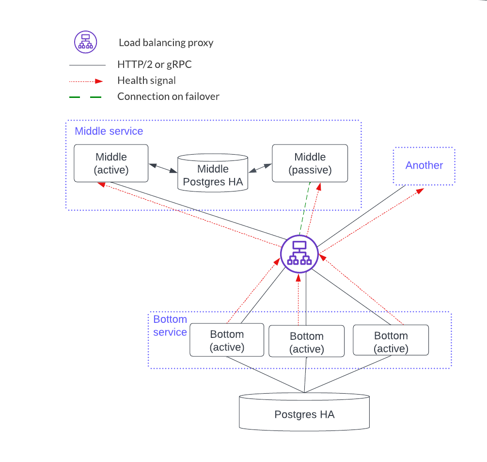

Each component can scale using a stateless or stateful horizontal scaling pattern. For example, the bottom service has instances that are independent and considered stateless. Stateless horizontal scaling is achieved by adding another bottom instance. This also increases the availability because there are more redundant instances. The middle service is stateful since the instances share a local database so the HA model is active-passive. Scaling the stateful middle service is achieved by replicating the entire middle service: i.e. add two instances connected by a PostgreSQL HA database.   

HTTP JSON API and Participant Node Services
*******************************************

The HTTP JSON API and participant node services share a state dependency (the offset) so they must be deployed together.

.. NOTE::
    `command deduplication <../../../app-dev/command-deduplication.html>`__ does not work across participant services. 

Users and related parties are configured on a participant node so they will be handled by a particular participant service. This means that the HTTP JSON API service that is connected to a participant service also serves those same users and parties. 

The description above is true if there is only a single participant service (and corresponding HTTP JSON API service) that all the client requests will go to that service. However, if there is more than one participant service (e.g. with horizontal scaling) then it is the application's responsibility to understand which participant service to send a request to (and the corresponding HTTP JSON API service), based on the user(s) or parties of the request. Another way to describe this is that users and parties are sharded across the participant and HTTP JSON API services and the application is responsible for targeting the right instance.

As shown below, an HTTP JSON API service is an endpoint that has four components. Each HTTP JSON API instance emits a health signal that the load balancer uses to direct traffic. The HTTP JSON API's database acts as a cache that is local to the instance, meaning it does not need to be HA since the cache can be reconstructed at any time. 

.. NOTE::
    The HTTP JSON API server does not support mTLS from client applications at this time. mTLS is supported between the load balancer and participant node.

.. https://lucid.app/lucidchart/d3a7916c-acaa-419d-b7ef-9fcaaa040447/edit?invitationId=inv_b7a43920-f4af-4da9-88fc-5985f8083c95&page=0_0#
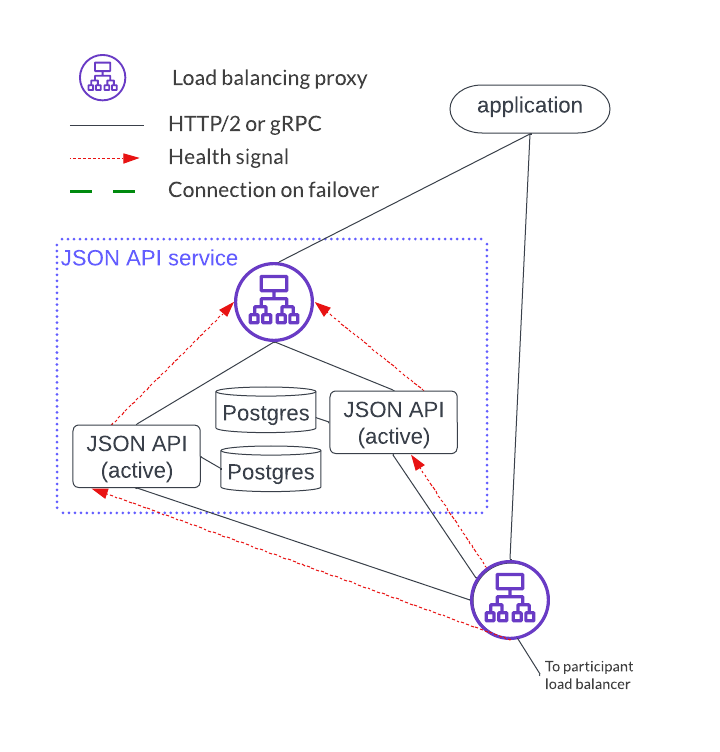

There are a couple of important distinctions between the participant service and the HTTP JSON API service set ups: 

* A single participant service can have several HTTP JSON API servers. However, an HTTP JSON API server should only connect to a single participant service. 
* The HTTP JSON API component operates in an active-active mode while participant nodes operate in an active-passive mode. 

.. https://lucid.app/lucidchart/d3a7916c-acaa-419d-b7ef-9fcaaa040447/edit?invitationId=inv_b7a43920-f4af-4da9-88fc-5985f8083c95&page=0_0#
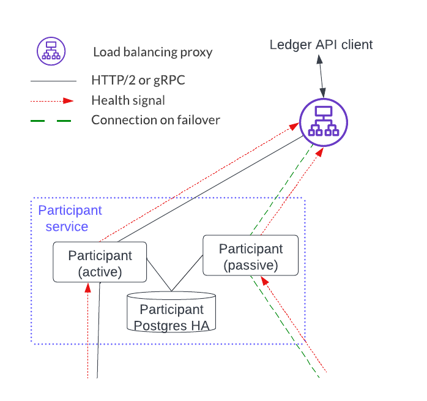
     
The deployment below shows the HA set up for ???

.. https://lucid.app/lucidchart/d3a7916c-acaa-419d-b7ef-9fcaaa040447/edit?invitationId=inv_b7a43920-f4af-4da9-88fc-5985f8083c95&page=0_0#
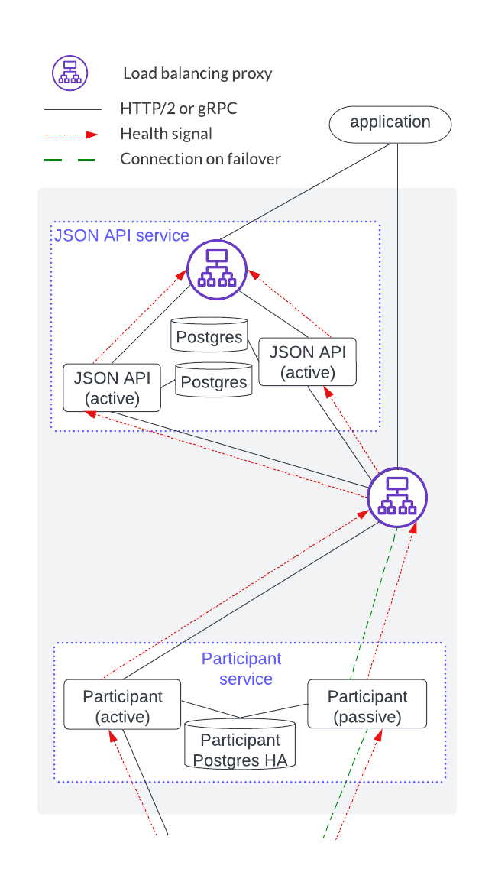

Horizontal scaling is accomplished by sharding application users and parties across a joint HTTP JSON API and participant service, and adding another HTTP JSON API and participant stack, as shown below.

.. https://lucid.app/lucidchart/d3a7916c-acaa-419d-b7ef-9fcaaa040447/edit?invitationId=inv_b7a43920-f4af-4da9-88fc-5985f8083c95&page=0_0#
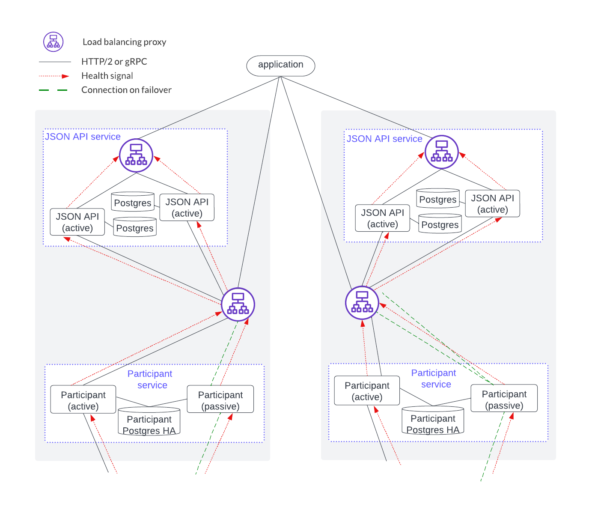

Sequencer Service
*****************

The sequencer service operates in active-active mode which means that all sequencer instances can accept and process Canton protocol API requests. This has benefits for both scaling and availability. 

Deploying a sequencer depends on business requirements which may impact deployment configurations such as load balancing configurations and whether the domain is fully or only partially decentralized.

Sequencer service load balancing options
========================================

The sequencer service has several clients: participant, mediator, and domain manager. mTLS between these clients is unavailable at the time of writing. 

The two available load balancing options are shown in the diagram below. 

.. https://lucid.app/lucidchart/d3a7916c-acaa-419d-b7ef-9fcaaa040447/edit?invitationId=inv_b7a43920-f4af-4da9-88fc-5985f8083c95&page=0_0#
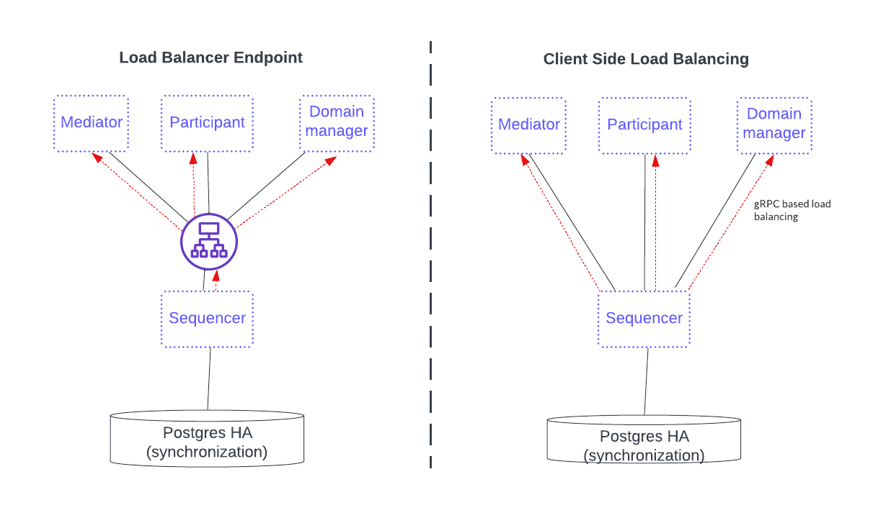

The first option, on the left, fronts the sequencer service with a load balancer that all sequencer clients use. This option simplifies configuration and connectivity but adds the complexity of configuring the load balancer. 

The option on the right is a gRPC java client library providing a round-robin selection mechanism for load balancing that, provided there are multiple sequencer connections, automatically round-robins through them and includes the ones that are healthy. This setup requires the distributed application provider and distributed application users to maintain the configuration information of all the available sequencers in the sequencer client.  The sequencer client continuously monitors the health of each sequencer endpoint when selecting a possible node in round-robin fashion. 

See the Canton documentation on `connection to high availability sequencers <../../../canton/usermanual/connectivity.html#connect-to-high-availability-sequencers>`__ and `client load balancing <../../../canton/usermanual/ha.html#client-side-load-balancing>`__ for more information.

Blockchain domains
==================

A blockchain domain has a fully decentralized data path and is used when there is no trust between the distributed application providers and users. [#f1]_ Whereas the sequencer queries the PostgreSQL backend directly in a SQL domain, this cannot be done in a blockchain domain. Instead, a local database to the sequencer is added to speed things up. Then the blockchain is used by the sequencer backend to provide a guaranteed ordered multicast of events.

The figure below shows a HyperLedger Fabric blockchain example. Notice that each sequencer has an independent local cache running on a PostgreSQL database. This local cache ensures efficiency because the sequencer avoids having to scan the entire blockchain when it starts up or reconnects after a temporary interruption. It also reduces the performance load on the blockchain.

.. https://lucid.app/lucidchart/d3a7916c-acaa-419d-b7ef-9fcaaa040447/edit?invitationId=inv_b7a43920-f4af-4da9-88fc-5985f8083c95&page=0_0#
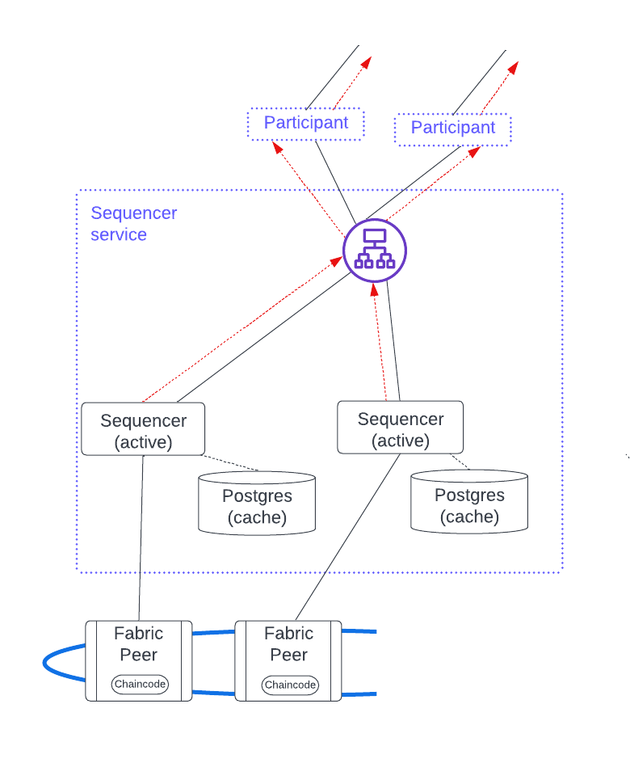

This figure also has a load balancer fronting the sequencer nodes but client side load balancing would also work. There are several benefits to using a load balancer:

* Clients have a single endpoint that consolidates the health signals, thus simplifying setup and troubleshooting.
* Adding a sequencer does not require updating the configuration information in each client.
* Additional security.

Since sequencer nodes are always active, horizontal scaling for a blockchain sequencer service is achieved by adding a new sequencer along with its associated local cache database and enabling it for client use.

SQL domains
===========

The SQL domain is only partially decentralized and is used when the sequencer's backend data is stored in a single PostgreSQL database that is managed by a centralized distributed application provider. This means that a SQL domain requires participant users to have some trust in the application provider.

A sequencer needs no local cache because it directly queries the backend database with no performance penalty. 

.. https://lucid.app/lucidchart/d3a7916c-acaa-419d-b7ef-9fcaaa040447/edit?invitationId=inv_b7a43920-f4af-4da9-88fc-5985f8083c95&page=0_0#
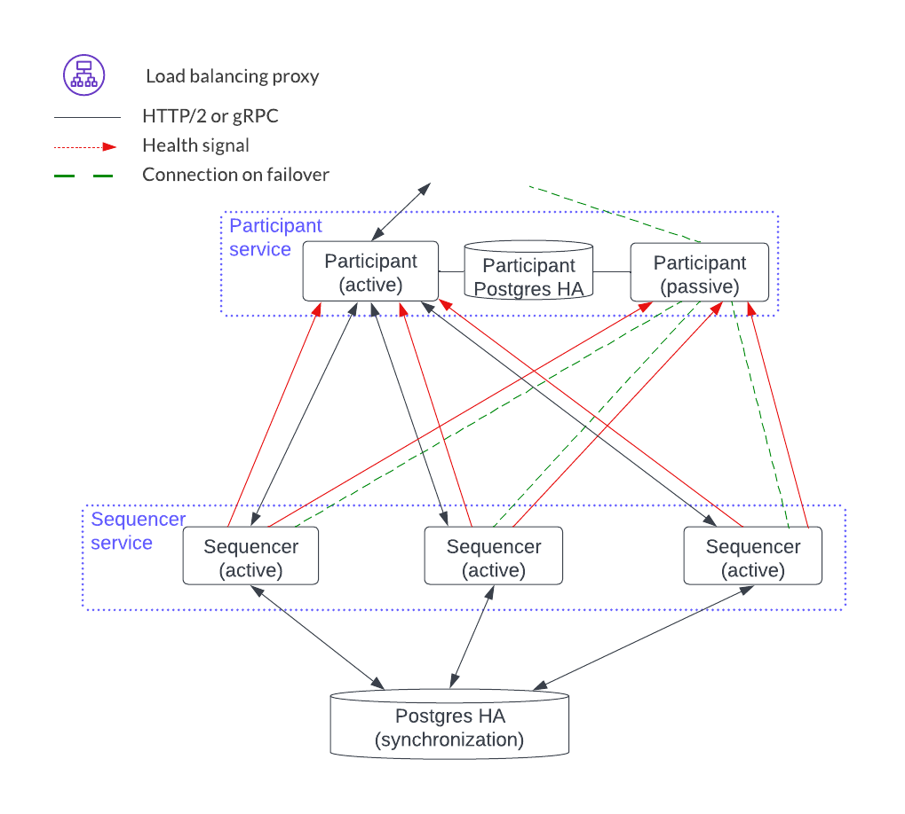

Since sequencer nodes are always active, horizontal scaling for the SQL domain sequencer service is achieved by adding a new sequencer and enabling the clients to use it.

Mediator Service
****************

The mediator service has no client-facing ingest. It also has no load balancing proxy or health endpoints. Instead, it uses client side load balancing based on the gRPC infrastructure. It is like the participant node in that it has a PostgreSQL database in an HA configuration. The mediator components, however, act in an active-passive configuration. 

.. https://lucid.app/lucidchart/d3a7916c-acaa-419d-b7ef-9fcaaa040447/edit?invitationId=inv_b7a43920-f4af-4da9-88fc-5985f8083c95&page=0_0#
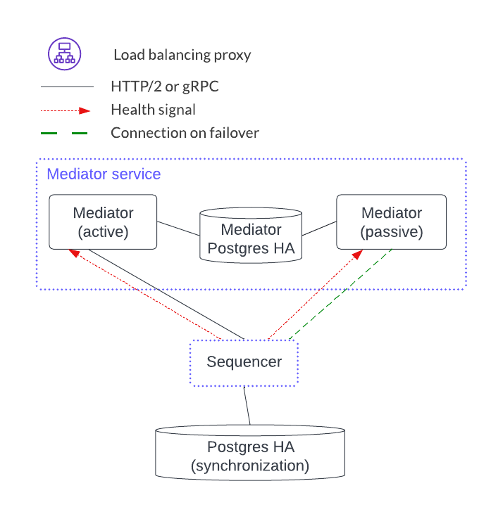

Horizontal scaling is achieved by adding another mediator service.

.. https://lucid.app/lucidchart/d3a7916c-acaa-419d-b7ef-9fcaaa040447/edit?invitationId=inv_b7a43920-f4af-4da9-88fc-5985f8083c95&page=0_0#
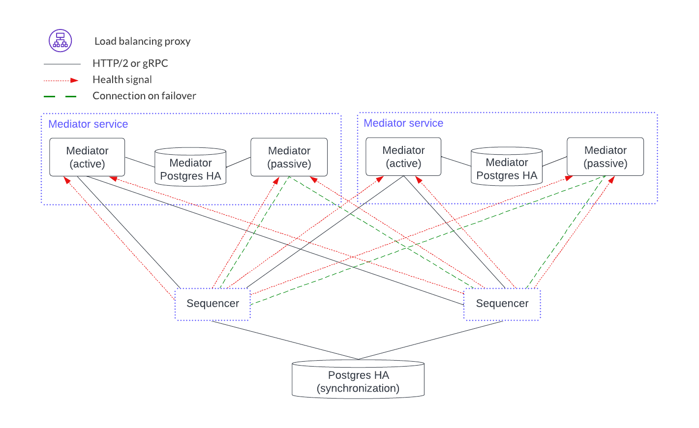

Domain Manager Service
**********************

The domain manager service also has no client-facing ingest point. Like the mediator services, the domain manager is in an active-passive configuration. There is, however, only a single domain manager service per domain. This means that there is no horizontal load balancing model for the domain manager. This is feasible because the domain manager is not in the transaction processing path path and so it manages topology transactions which are orders of magnitude less frequent than the Daml transactions that the mediators manage. 

.. https://lucid.app/lucidchart/d3a7916c-acaa-419d-b7ef-9fcaaa040447/edit?invitationId=inv_b7a43920-f4af-4da9-88fc-5985f8083c95&page=0_0#
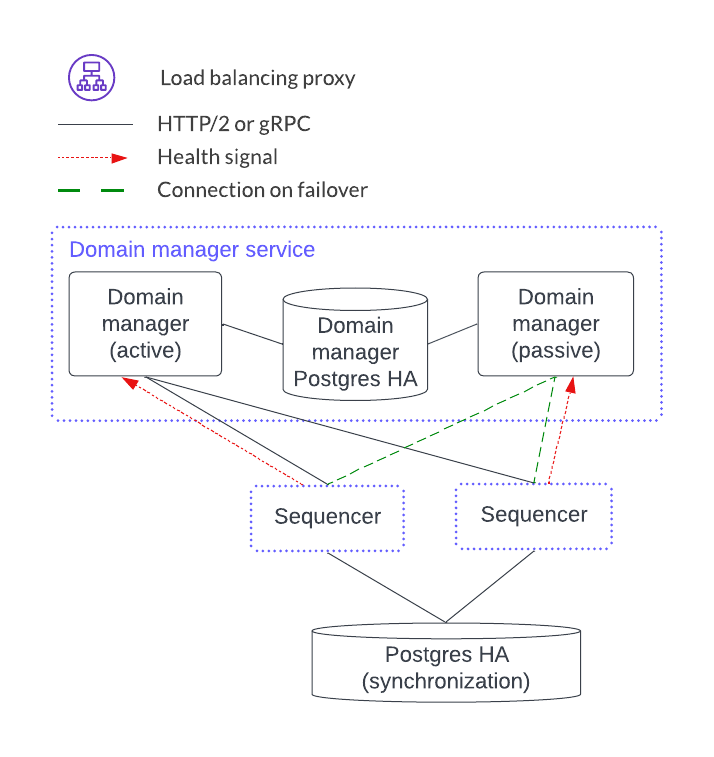

For HA support the domain manager uses PostgreSQL in a HA configuration. HA support for the domain manager was added in `v2.5.0 <https://blog.digitalasset.com/developers/release-notes/2.5.0>`__.

Trigger Service
***************

The trigger service includes the OAuth 2.0 middleware and trigger service nodes. As shown below, it does not operate in an HA configuration that supports a single failure. Instead, it requires a monitoring system to detect if the trigger service node or OAuth 2.0 middleware is unhealthy and mitigate any issues by the following: 

1. Restarting the failed item or,
2. Stopping the unhealthy instance and then starting another instance. 

A shared PostgreSQL database is needed for the trigger service node. As shown the OAuth 2.0 middleware connects to an OAuth provider.

.. https://lucid.app/lucidchart/d3a7916c-acaa-419d-b7ef-9fcaaa040447/edit?invitationId=inv_b7a43920-f4af-4da9-88fc-5985f8083c95&page=0_0#
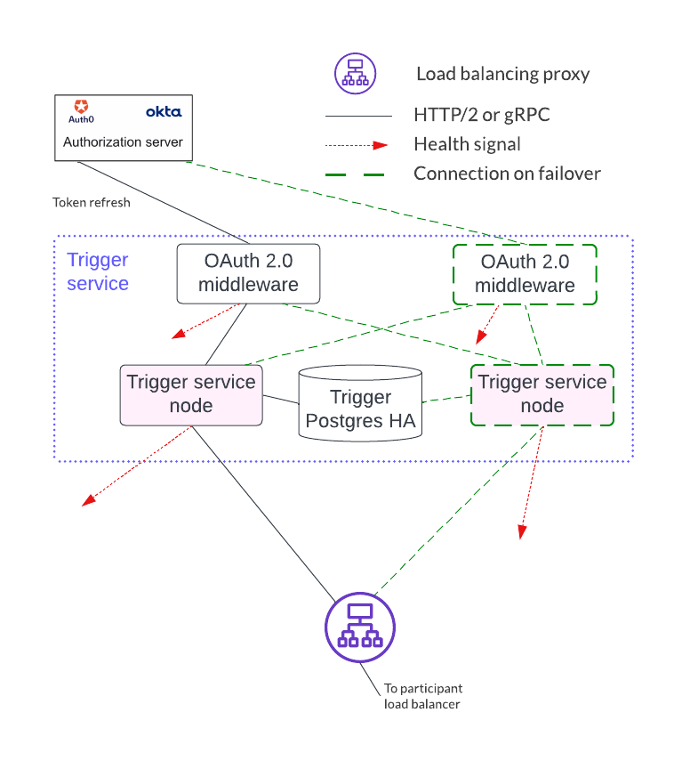

Horizontal scaling is achieved by deploying additional trigger service nodes. For example, in the figure below, there are two pairs of trigger service nodes (pink and green) which use the same OAuth 2.0 middleware node that is connected to a single OAuth provider. 

Running the same trigger rule on multiple live trigger service instances is not allowed. For example the pink rules are running in a single live trigger service node, just like the green rules are running in a single live trigger service node. 

Remember, the box with the dashed lines indicate that the node is started when the active node is identified as unhealthy.

.. https://lucid.app/lucidchart/d3a7916c-acaa-419d-b7ef-9fcaaa040447/edit?invitationId=inv_b7a43920-f4af-4da9-88fc-5985f8083c95&page=0_0#
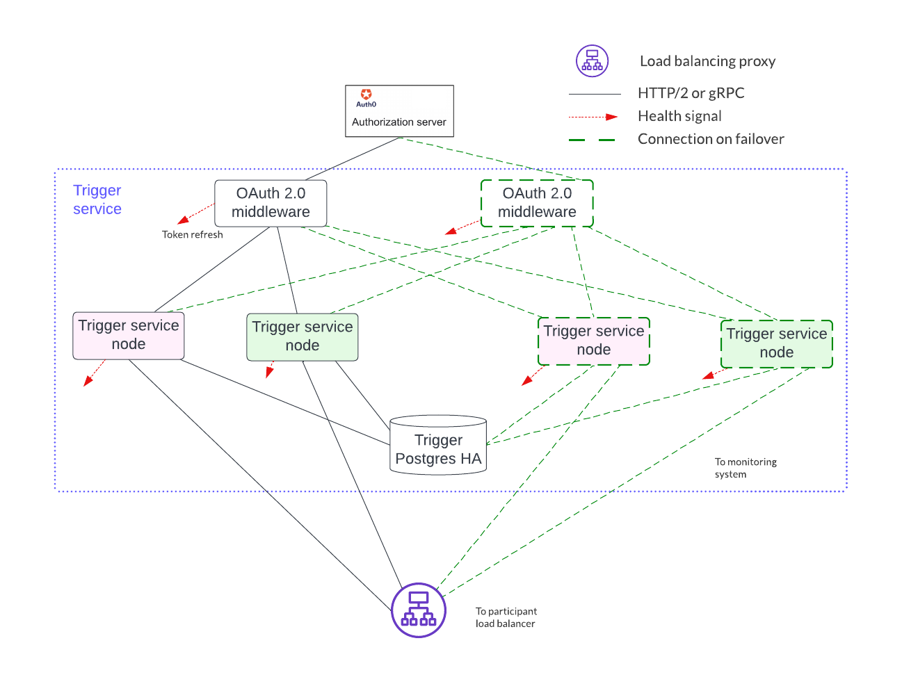

Each trigger service node is limited to a single OAuth provider and they are unable to support queries against multiple OAuth providers. For example, the pink and green trigger service in the figure above cannot query against both a Google OAuth provider and an Apple OAuth provider - each trigger service must be configured to use exactly one of these providers. 

If access to more than a single OAuth provider is needed, distinct pairs of trigger service nodes and OAuth 2.0 middleware servers are configured. This is shown below. Please note running the same trigger rule on multiple live trigger service instances is not allowed in this configuration either.

.. https://lucid.app/lucidchart/d3a7916c-acaa-419d-b7ef-9fcaaa040447/edit?invitationId=inv_b7a43920-f4af-4da9-88fc-5985f8083c95&page=0_0#
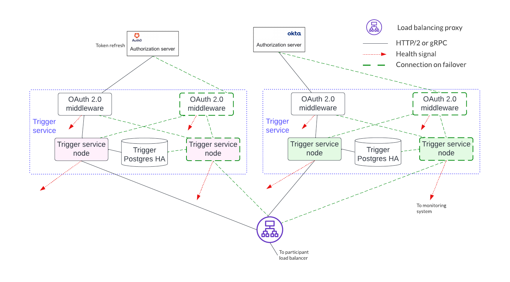

.. rubric:: Footnotes

.. [#f1] The domain manager is not currently replicated and decentralized but it is not involved in the data path.