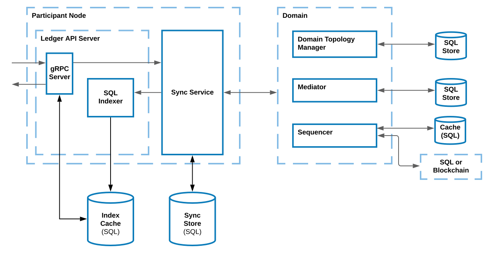

.. Copyright (c) 2023 Digital Asset (Switzerland) GmbH and/or its affiliates. All rights reserved.
.. SPDX-License-Identifier: Apache-2.0

Overview
########

To summarize, HA for Daml solutions focuses on the following Canton components running in separate processes:

* Participant nodes:

    * Ledger API server.
        * gRPC server.
        * SQL indexer.

    * Sync service.

* Domains:

    * Topology manager.

    * Mediator.

    * Sequencer.

.. _components-for-ha:
.. https://lucid.app/lucidchart/3082d315-f7d9-4ed7-926f-bb98841b7b38/edit?page=0_0#

Participant Nodes
~~~~~~~~~~~~~~~~~

The unavailability of a participant should only affect the availability of another participant node in the following workflows:

  1. Where they are both involved. 
  2. When they have distinct visibility configurations, i.e. they manage different parties involved in the workflow.

For example, if they both host the same party, transactions involving the party can still continue as long as either of them are available.

.. NOTE::
    An application operating on behalf of a party cannot transparently failover from one participant node to another due to the difference in offsets emitted on each participant.

Domains
~~~~~~~

A participant node's availability is only affected by the unavailability of the domain in workflows that use the domain. This allows participant nodes and domains to take care of their HA separately.

Replication
~~~~~~~~~~~

To achieve HA, components replicate. All replicas of the same component are assumed to have the same trust assumptions, i.e. the operators of one replica must trust the operators of the other replicas.

Databases
~~~~~~~~~

In general, when a component is backed by a database/ledger, HA relies on the HA of the database/ledger. Therefore, the component's operator must handle the HA of the database separately.

All database-backed components are designed to be tolerant to temporary database outages. During the database failover period, components halt processing until the database becomes available again, resuming thereafter.

Transactions that involve these components may time out if the failover takes too long. Nevertheless, they can be safely resubmitted, as command deduplication is idempotent.

Health Check
~~~~~~~~~~~~

Canton components expose a :ref:`health endpoint <health-check>`, for checking the health of the components and their subcomponents.

