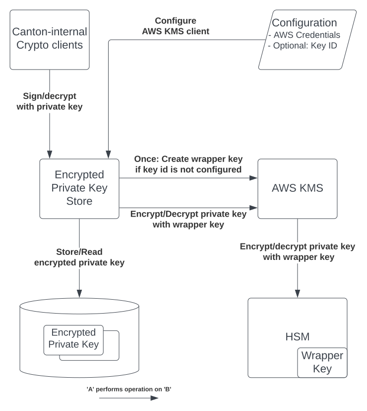
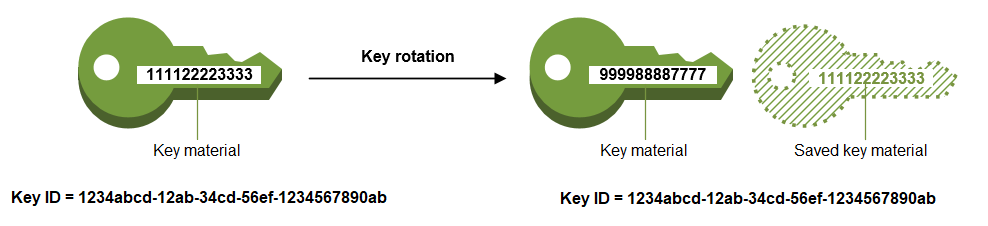

..
   Copyright (c) 2023 Digital Asset (Switzerland) GmbH and/or its affiliates.
..
   Proprietary code. All rights reserved.

.. _security:

Security
========

.. _kms_architecture:

Secure Cryptographic Private Key Storage
----------------------------------------

In this section we describe Canton's two different approaches to securing the storage of cryptographic private keys.
When enabled, we leverage a Key Management Service (KMS) to either: (a) `host an encryption
key that is used to transparently encrypt the private keys (i.e. envelope encryption) before storing
them in Canton's database`; or (b) `directly use a KMS to perform cryptographic operations without
access to the private keys`.
While using envelope encryption we make sure that an attacker who has access to the database
(e.g., a malicious database operator) cannot get access to the private keys from a Canton node,
which would compromise the transaction privacy and integrity guarantees of Canton. If we instead decide to
externalize private key storage and usage, we go one step further and protect against an attacker with privileged
access to the node’s system that can inspect the memory.

Background
~~~~~~~~~~

`Canton uses cryptography in several ways <https://docs.daml.com/canton/usermanual/security.html>`_
to provide a secure, minimal trust platform.
In Canton we distinguish between three types of keys: short-term, long-term, and permanent keys.

- `Short-term key`: These are used to encrypt transaction payloads. The secrets for these keys are already transmitted and stored in an encrypted form, and used only once.
- `Long-term key`: These are keys that are used for topology transaction signing, transaction protocol signing, and encryption of short-term key secrets.
- `Permanent key`: A `namespace root signing key <https://docs.daml.com/canton/usermanual/identity_management.html#identity-setup-guide>`_ is a permanent key. It cannot be rotated without losing the namespace, as the namespace is identified by the fingerprint of the signing key. This is an architectural feature.

Long-term and permanent keys are by default stored in clear.
Canton can, :ref:`if enabled <kms_setup>`, offer confidentiality at rest for these private keys.
Short-term keys do not require additional protection because they are derived from a secret that is already
transmitted and stored in an encrypted form using a long-term public encryption key.

.. _kms_requirements:

Requirements
~~~~~~~~~~~~

- The long-term keys must not be available on disk or in storage in a way that would allow someone with access to the storage to view/access the key.
- The keys must not be part of Canton’s container images.
- A key administrator can rotate both the KMS key and the long-term keys in Canton.
- Historical contract data can be decrypted using old long-term, encrypted keys that have been superseded. No old long-term keys are used in future transactions.
- Backup and subsequent restoration of the database of a participant node supports KMS key rotation and rotation of Canton’s long-term keys.
- For high availability operation, Canton supports duplication of keys.

.. note::

    Confidentiality at runtime for the private keys is out of scope.
    If envelope encryption is used then we do not protect against an attacker that has
    privileged access to the node’s system and can inspect the memory.

.. _kms_envelope_architecture:

Protect Private Keys With Envelope Encryption and a Key Management Service
~~~~~~~~~~~~~~~~~~~~~~~~~~~~~~~~~~~~~~~~~~~~~~~~~~~~~~~~~~~~~~~~~~~~~~~~~~

Canton can protect private keys by forcing them to be internally stored in an encrypted form so
they can’t be decrypted and used to create fraudulent transactions. This protection at rest safeguards
against malicious adversaries that get access to a node’s storage layer. Keys will only be decrypted
when being used and stored in a memory cache for fast access.
We currently make use of a KMS's ability to securely perform this encryption/decryption of keys
using a symmetric encryption key, which we call `KMS wrapper key`, without ever exposing it
to the outside world, as it is backed by Hardware Security Modules (HSM) that move the crypto operations
to a secure enclave.

.. https://lucid.app/documents/view/8eda4d8c-d323-4432-8fbe-87a71ec33d2f

Directly encrypting the Canton private keys with a KMS wrapper key, i.e. `envelope encryption`,
has multiple advantages compared to storing these keys in the KMS itself:

- Reduces the impact on performance due to additional latency and the probability of `throttling KMS API <https://docs.aws.amazon.com/kms/latest/developerguide/throttling.html>`_ requests if the thresholds are exceeded.
- Preserves Canton's current key schemes, which remain flexible and easily modifiable. Not all KMS implementations offer modern and fast signing schemes such as Ed25519.

The confidentiality of the Canton private long-term and permanent keys depends on the access to the KMS wrapper key.
The KMS must be locked down appropriately:

- Export of the symmetric key must be forbidden.
- Only authorized Canton nodes can use the wrapper key for decryption.
- Usage of the wrapper key must be logged for auditability.
- Separation of duties between the KMS operator and the database operator.

.. _kms_external_architecture:

Externalize Private Keys With a Key Management Service
~~~~~~~~~~~~~~~~~~~~~~~~~~~~~~~~~~~~~~~~~~~~~~~~~~~~~~

Canton can also protect private keys by outsourcing their generation and storage to a KMS, making use of
of a KMS's API to perform the necessary crypto operations such as decryption and signing. This protection
safeguards against malicious adversaries that, besides access to the storage layer, can also
access the node’s system and inspect its memory. Using a KMS's underlying monitoring framework
(e.g. AWS CloudTrail Logs or GCP Cloud Audit Logs) in combination with Canton logging also offers a
reliable way to maintain the security, reliability of Canton, and identify any possible misuse of its private keys.

This improvement in security comes with drawbacks, in particular:

- Added latency resulting from the need to use a KMS to decrypt and sign messages.
- Canton's supported schemes must match those provided by the KMS.

AWS KMS Integration
^^^^^^^^^^^^^^^^^^^

Canton currently makes use of AWS KMS to protect its private keys.
The `AWS KMS API <https://docs.aws.amazon.com/kms/latest/developerguide/overview.html>`_ is similar to a hardware security module (HSM) where cryptographic operations can be done
within the KMS using the stored keys, without exposing them outside of the KMS.

Besides offering a secure platform to create, manage, and control cryptographic keys, AWS KMS also supports:

- Enforcement of key usage/authorization policies;
- Access to the key usage authorization logs;
- Multi-region keys that allow for the replication of keys in multiple regions for disaster recovery;
- Automatic rotation of KMS keys. Note that `AWS KMS transparently selects the appropriate KMS key to decrypt <https://aws.amazon.com/kms/faqs/>`_ so KMS keys can be safely rotated without any code changes.

AWS KMS Wrapper Key Rotation
^^^^^^^^^^^^^^^^^^^^^^^^^^^^

AWS KMS offers two different ways to `rotate keys, either automatically or manually <https://docs.aws.amazon.com/kms/latest/developerguide/rotate-keys.html>`_.
By default every key newly created by AWS is set for a yearly automatic rotation where only the key material is changed.
The properties of the KMS key do not change and there is no need to re-encrypt the data with the newly rotated key.
Management of different key versions is done seamlessly by AWS and no changes are necessary in Canton.
We recommend the :ref:`rotation of the underlying Canton long-term keys <rotating-canton-keys>` after the KMS key has been rotated.
The rotation frequency is fixed and cannot be changed.

.. https://docs.aws.amazon.com/kms/latest/developerguide/images/key-rotation-auto.png

   image taken from https://docs.aws.amazon.com/kms/latest/developerguide/rotate-keys.html

If Canton is responsible for the storage of the private keys (i.e. we are using envelope encryption) the
manual rotation of keys requires not only the creation of a new KMS key but also the re-encryption of our data with it.
To do this Canton node administrators can request a :ref:`manual rotation of the KMS wrapper key through the Canton console <manual-kms-wrapper-key-rotation>`.

Satisfied Requirements
~~~~~~~~~~~~~~~~~~~~~~

Our solutions: (a) `private key storage protection using envelope encryption` and (b) `private key externalization`
comply with all the previously mentioned :ref:`requirements <kms_requirements>` in the following ways:

- The long-term keys must not be available on disk or in storage in a way that would allow someone with access to the storage to view/access the key.
    - The long-term and permanent keys are either: (a) only stored in an encrypted form in the database (the corresponding encryption key is stored securely by the KMS in an HSM), or (b) not stored at all by Canton.
- The keys must not be part of Canton’s container images.
    - The Canton private keys are stored in the (a) database of the node or directly in the (b) external KMS and not in the container image. Credentials to access the KMS can be passed in via the environment when a container is created, the credentials must not be stored in the image.
- A key administrator can both rotate the KMS key or long-term keys in Canton.
    - Canton already supports manual rotation of long-term keys. In scenario (b) this also involves the re-generation of the keys in the KMS.
    - Support of KMS wrapper key rotation (b) based on either: an AWS KMS automated annual key rotation, or a manual rotation and re-encryption of the Canton private keys.
- Historical contract data can be decrypted using old long-term, encrypted keys that have been superseded. No old long-term keys are used in future transactions.
    - Canton already supports rotation of long-term keys with a synchronized state on which keys are active across nodes as part of topology management.
- Backup and subsequent restoration of the database of a participant node supports KMS key rotation and rotation of Canton’s long-term keys.
    - Database restoration/backup is only needed for (a) protection of keys at rest and as long as the :ref:`database and the wrapper key are available <backup-kms>`, backup and restoration are not impacted by key rotation. Replicating a KMS key in multiple regions can also mitigate the impact of a failure in the primary region.
    - A KMS operator must ensure its configured key store has in place a robust disaster recovery plan to prevent the permanent loss of keys.
- For high availability operation, Canton supports duplication of keys.
    - Canton supports AWS multi-region keys when enabled in the configuration, as well as when the operator manually creates the key and just configures the existing key id in Canton. `Note: replicating keys to other regions is a manual process by the operator and not done automatically by Canton.`

Resilience to Malicious Participants
------------------------------------

The Canton architecture implements the Daml Ledger Model, which has the
following properties to ensure ledger integrity:

- Model conformance;
- Signatory and controller authorization; and
- Daml ledger consensus and consistency, which contributes the most to the
  resilience.

An overview is presented here for how the Canton run-time is resilient to a malicious
participant with these properties.

The ledger API have been designed and tested to be resilient against a malicious
application sending requests to a Canton participant node. The focus here is on
resilience to a malicious participant.

Model Conformance
~~~~~~~~~~~~~~~~~

During interpretation, the Daml engine verifies that a given action for a set of
Daml packages is one of the allowed actions by the party for a contract (i.e.,
it conforms to the model). For example in an IOU model, it is valid that the
actor of a transfer action must be the same as the owner of the contract and
invalid for a non–owner to attempt a transfer, because the IOU must only be
transferred by the owner.

Signatory and Controller Authorization
~~~~~~~~~~~~~~~~~~~~~~~~~~~~~~~~~~~~~~

During interpretation, the Daml engine verifies the authorization of ledger
actions based on the signatories and actors specified in the model when
compared with the party authorization in the submitter information of the
command.

Daml Ledger Integrity
~~~~~~~~~~~~~~~~~~~~~

Canton architecture ensures the integrity of the ledger for
honest participants despite the presence of malicious participants. The key
ingredients to achieving integrity are the following:

- Deterministic transaction validation to reach consensus;
- Consistent transaction ordering and validation;
- Consistency checks with at least one honest participant per signatory party; and
- Using an authenticated data structure (generalized blinded Merkle tree) for
  transactions that balances consensus with privacy.

Deterministic Transaction Execution
^^^^^^^^^^^^^^^^^^^^^^^^^^^^^^^^^^^

The execution of Daml is deterministic even though there are multiple,
distributed participant nodes: given a set of Daml packages that are identified
by their content and a command (create or exercise), the result of a
(sub-)transaction will always be the same for the involved participant nodes.
This property is used by Canton to reach agreement on whether a submitted
(sub-)transaction is valid or invalid – the agreement is a requirement for
ledger integrity.

Consistent Transaction Ordering and Validation
^^^^^^^^^^^^^^^^^^^^^^^^^^^^^^^^^^^^^^^^^^^^^^

Canton uses distributed conflict detection among the involved participant nodes
to ensure integrity since, by design, there is no centralized component that
knows the activeness of all contracts. Instead all involved participants process
the transactions in the same order so that if two concurrent transactions
consume the same contract only the first transaction consumes
the contract and the other transaction fails (e.g., no double spend). This means
that a failed consistency check does not necessarily mean the submitter was
malicious; it may be the result of a race condition in the application to
consume the same contract. The sequencer node guarantees that all messages are
totally ordered timestamps.

The deterministic order is established with unique timestamps from the
sequencer, which implements a guaranteed total order multicast; that is, the
sequencer guarantees the delivery of an end-to-end encrypted message to all
all recipients. The deterministic order of message delivery results in a
deterministic order of execution which ensures ledger integrity.

For finality and bounded decision times of transactions, the sequencer is
immutable and append-only. In the event of a timeout, the timeouts of
transactions are consistently derived from the sequencer timestamps so that
timeouts are deterministic as well.

The set of recipients on the sequencer message can be validated by a recipient
to ensure that the other participants of the transaction have been informed as
well (i.e., guaranteed communication). Otherwise the malicious submitter would
break consensus, resulting in a loss of ledger integrity where participants
hosting a signatory are not informed about a state change.

Consistency With at Least One Honest Participant per Signatory Party
^^^^^^^^^^^^^^^^^^^^^^^^^^^^^^^^^^^^^^^^^^^^^^^^^^^^^^^^^^^^^^^^^^^^

Although participants can verify model conformance and authorization on their
own as described in the previous sections, the consistency check needs at least
one honest participant hosting a signatory party to ensure consistency.
If all signatories of a contract are hosted by dishonest participants, a
transaction may use a contract even when the contract is not active.

Authenticated Data Structure for Transactions
^^^^^^^^^^^^^^^^^^^^^^^^^^^^^^^^^^^^^^^^^^^^^

The hierarchical transactions are represented by an authenticated data structure
in the form of a generalized blinded Merkle tree (see
https://www.canton.io/publications/iw2020.pdf). At a high level, the Merkle tree
can be thought of like a blockchain in a tree format rather than a
list. The Merkle tree is used to reach consensus on the hierarchical data structure
while the blinding provides sub-transaction privacy. The mediator sees the shape
of the transaction tree and who is involved, but no transaction payload. The entire
transaction and Merkle tree is identified by its root hash. A recipient can
verify the inclusion of an unblinded view by its hash in the tree. The mediator
receives confirmations of a transaction for each view hash and aggregates the
confirmations for the entire Merkle tree. Each participant can see all the
hashes in the Merkle tree. If two participants have different hashes for the
same node, the mediator will detect this and reject the
transaction. The mediator also sees the number of participants involved so it
can detect a missing or additional participant. The authenticated data structure
ensures that participants process the same transaction and reach consensus.

Detection of Malicious Participants
~~~~~~~~~~~~~~~~~~~~~~~~~~~~~~~~~~~

In addition to the steps outlined above, the system has multiple approaches to
detect malicious behavior and to keep evidence for further investigation:

- Pairs of participants periodically exchange a commitment of the active
  contract set (ACS) for their mutual counterparties. This ensures that any
  diverging views between honest participants will be detected within the ACS
  commitment periods and participants can repair their mutual state.

- Non-repudiation in the form of digital signatures enables honest participants
  to prove that they were honest and who was dishonest by preserving the signed
  responses of each participant.

Consensus & Transparency
------------------------

:ref:`Consensus <consensus-hlreq>` and :ref:`Transparency <transparency-hlreq>`
are high-level requirements that ensure that stakeholders are notified about
changes to their projection of the virtual shared ledger and that they come to
the same conclusions, in order to stay synchronized with their counterparties.

Operating on the Same Transaction
~~~~~~~~~~~~~~~~~~~~~~~~~~~~~~~~~

The Canton protocol includes the following steps to ensure that the mediator and
participants can verify that they have obtained the same transaction tree given
by its root hash:

(1) Every participant gets a "partially blinded" Merkle tree, defining the
    locations of the views they are privy to.
(2) That Merkle tree has a root. That root has a hash. That’s the root hash.
(3) The mediator receives a partially blinded Merkle tree, with the same hash.
(4) The submitting participant will send an
    additional “root hash message” in the same batch for each receiving participant. That message will contain
    the same hash, with recipients being both the participant and the mediator.
(5) The mediator will check that all participants mentioned in the tree received
    a root hash message and that all hashes are equal.
(6) The mediator sends out the result message that includes the verdict and
    root hash.

An important aspect of this process is that transaction metadata, such as a root hash message, is not
end-to-end encrypted, unlike transaction payloads which are always encrypted. The
exact same message is delivered to all recipients. In the case of the root hash
message, both the participant and the mediator who are recipients of the
message get the exact same message delivered and can verify that both are the
recipient of the message.

Stakeholders Are Notified About Their Views
~~~~~~~~~~~~~~~~~~~~~~~~~~~~~~~~~~~~~~~~~~~

Imagine the following attack scenarios on the transaction protocol at the point
where a dishonest submitter prepares views.

Scenario 1: Invalid View Common Data
^^^^^^^^^^^^^^^^^^^^^^^^^^^^^^^^^^^^

The submitter should send a view V2 to Alice and Bob (because it concerns them
both as they are signatories), but the dishonest submitter tells the mediator
that view V2 only requires the approval of Bob, and only sends it to Bob's
participant. In this scenario both participants of Alice and Bob are honest.

Mitigation
""""""""""

The view common data is incorrect, because Alice is missing as an informee for
the view V2. Given that Bob's participant is honest, he will reject the view by
sending a reject to the mediator in the case of a signatory confirmation policy
and not commit the invalid view to his ledger as part of phase 7. The two honest
participants Alice and Bob thereby do not commit this invalid view to their
ledger.

Scenario 2: Missing Sequencer Message Recipient
^^^^^^^^^^^^^^^^^^^^^^^^^^^^^^^^^^^^^^^^^^^^^^^

The dishonest submitter prepares a correct view common data with Alice and Bob
as informees, but the corresponding sequencer message for the view is only
addressed to Bob's participant. The confirmation policy does not require a
confirmation from Alice's participant, e.g., VIP confirmation policy. In this
scenario both participants of Alice and Bob are honest.

Mitigation
""""""""""

The mitigation relies on the following two properties of the sequencer:

(1) The trust assumption is that the sequencer is honest and actually delivers a
message to all designated recipients
(2) A recipient learns the identities of recipients on a particular message from
a batch if it is itself a recipient of that message

The Bob participant can decrypt the view and verify the stakeholders against the
set of recipients on the sequencer message. The mapping between parties and
participants is part of the topology state on the domain and therefore the
resolution is deterministic across all nodes. Seeing that the Alice participant
is not a recipient despite Alice being a signatory on the view, Bob's
participant will reject the view if it is a VIP participant; in any case,
it will not commit the view as part of phase 7. The two honest
participants Alice and Bob thereby do not commit this invalid view to their
ledger.

Scenario 3: All Other Participants Dishonest
^^^^^^^^^^^^^^^^^^^^^^^^^^^^^^^^^^^^^^^^^^^^

It is not required that the other participants besides Alice are honest. Let's
consider a variation of the previous scenario where both the submitter and Bob
are dishonest. Again Alice's participant node is not a recipient of a view
message, although she is hosting a signatory. That means the view is not
committed to the ledger of the honest participant Alice, because she has never
seen it. Bob's participant is dishonest and approves and commits the view,
although it is malformed. However, the Canton protocol does not provide any
guarantees on the ledger of dishonest participants.

Scenario 4: Invalid Encryption of View
^^^^^^^^^^^^^^^^^^^^^^^^^^^^^^^^^^^^^^

A view is encrypted with a symmetric key and the secret to derive the symmetric
key for a view is encrypted for each recipient of the view with their public
encryption key. The dishonest submitter produces a correct view and a complete
recipient list of the corresponding sequencer message, but encrypts the
symmetric key secret for Alice with an invalid key. Alice's participant will be
notified about the view but unable to decrypt it.

Mitigation
""""""""""

If the Alice participant is a confirmer of the invalid encrypted view, which is
the default confirmation policy for signatories, then she will reject the view
because it is malformed and cannot be decrypted by her.

Currently the check by the other honest participant nodes that the symmetric key
secret is actually encrypted with the public keys of the other recipients is
missing and a documented limitation. We need to use a deterministic encryption
scheme to make the encryption verifiable, which is currently not implemented.
