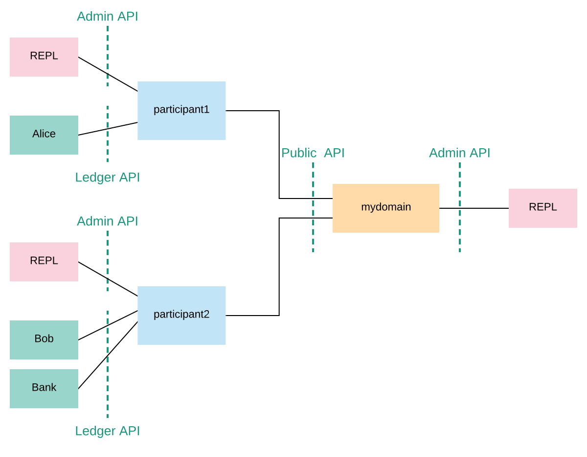

..
   Copyright (c) 2023 Digital Asset (Switzerland) GmbH and/or its affiliates.
..
   Proprietary code. All rights reserved.

.. _canton-getting-started:

Getting Started
===============

Interested in Canton?
This is the right place to start!
You don't need any prerequisite knowledge, and you will learn:

- how to install Canton and get it up and running in a simple test configuration
- the main concepts of Canton
- the main configuration options
- some simple diagnostic commands on Canton
- the basics of Canton identity management
- how to upload and execute new smart contract code

Installation
------------

Canton is a JVM application. To run it natively you need Java 11 or higher installed on your system.
Alternatively Canton is available as a `docker image <https://hub.docker.com/r/digitalasset/canton-open-source>`__ (see :ref:`Canton docker instructions <docker-instructions>`).

Canton is platform-agnostic.  For development purposes it runs on macOS,
Linux, and Windows. Linux is the supported platform for production.  

Please note that, under Windows, the Canton console output will be garbled
unless you are running Windows 10 and you enable terminal colors (e.g., by
running ``cmd.exe`` and then executing ``reg add HKCU\Console /v
VirtualTerminalLevel /t REG_DWORD /d 1``).

To start, download the open source community edition `latest release <https://github.com/digital-asset/daml/releases>`__
and extract the archive, or use the enterprise edition if you have access to it.

The extracted archive has the following structure:

.. code-block:: none

  .
  ├── bin
  ├── daml
  ├── dars
  ├── demo
  ├── deployment
  ├── drivers (enterprise)
  ├── examples
  ├── lib
  └── ...

- ``bin``: contains the scripts for running Canton (``canton`` under Unix-like systems and ``canton.bat`` under Windows)
- ``daml``: contains the source code for some sample smart contracts
- ``dars``: contains the compiled and packaged code of the above contracts
- ``demo``: contains everything needed to run the interactive Canton demo
- ``deployment``: contains a few example deployments to cloud or docker
- ``examples``: contains sample configuration and script files for the Canton console
- ``lib``: contains the Java executables (JARs) needed to run Canton

This tutorial assumes you are running a Unix-like shell.

Starting Canton
---------------

While Canton supports a daemon mode for production purposes, in this tutorial we will use its console, a
built-in interactive read-evaluate-print loop (REPL). The REPL gives you an out-of-the-box interface to all Canton
features. In addition, as it's built using `Ammonite <https://ammonite.io/>`__, you also have the full power of Scala
if you need to extend it with new scripts. As such, any valid Scala expression can be typed inside the console:

.. snippet:: getting_started
    .. success:: Seq(1,2,3).map(_ * 2)
    .. assert:: RES.length == 3

Navigate your shell to the directory where you extracted Canton.
Then, run

.. code-block:: bash

   bin/canton --help

to see the command line options that Canton supports.
Next, run

.. code-block:: bash

   bin/canton -c examples/01-simple-topology/simple-topology.conf

This starts the console using the configuration file ``examples/01-simple-topology/simple-topology.conf``.
You will see the banner on your screen

.. literalinclude:: /canton/includes/mirrored/community/app/src/main/resources/repl/banner.txt

Type ``help`` to see the available commands in the console:

.. snippet:: getting_started
    .. success(output=8):: help

You can also get help for specific Canton objects and commands:

.. snippet:: getting_started
    .. success:: help("participant1")
    .. success:: participant1.help("start")

The Example Topology
--------------------

To understand the basic elements of Canton, let's briefly look at this starting configuration.
It is written in the `HOCON <https://github.com/lightbend/config/blob/master/HOCON.md>`__ format as shown below.
It specifies that you wish to run two *participant nodes*, whose local aliases are ``participant1`` and ``participant2``, and a single
*synchronization domain*, with the local alias ``mydomain``.
It also specifies the storage backend that each node should use (in this tutorial we're using in-memory storage), and the network ports for various services, which we will describe shortly.

.. literalinclude:: /canton/includes/mirrored/community/app/src/pack/examples/01-simple-topology/simple-topology.conf
   :language: none

To run the protocol, the participants must connect to one or more synchronization domains (domains for short).
To execute a *transaction* (a change that updates the shared contracts of several parties), all the parties' participant nodes must be connected to the same domain.
In the remainder of this tutorial, you will construct a network topology that will enable the three parties
Alice, Bob, and Bank to transact with each other, as shown here:

The participant nodes provide their parties with a `Ledger API <https://docs.daml.com/app-dev/ledger-api.html>`__ as a means to access the ledger.
The parties can interact with the Ledger API manually using the console, but in practice these parties use applications to
handle the interactions and display the data in a user-friendly interface.

In addition to the Ledger API, each participant node also exposes an *Admin API*.
The Admin API allows the administrator (that is, you) to:

- manage the participant node's connections to domains
- add or remove parties to be hosted at the participant node
- upload new Daml archives
- configure the operational data of the participant, such as cryptographic keys
- run diagnostic commands

The domain node exposes a *Public API* that is used by participant nodes to communicate with the synchronization domain.
This must be accessible from where the participant nodes are hosted.

Similar to the participant node, a domain node also exposes an Admin API for administration services.
You can use these to manage keys, set domain parameters and enable or disable participant nodes within a domain, for example.
The console provides access to the Admin APIs of the configured participants and domains.

.. note:: Canton's Admin APIs must not be confused with the ``admin`` package of the Ledger API.
   The ``admin`` package of the Ledger API provides services for managing parties and packages on *any Daml participant.*
   Canton's Admin APIs allows you to administrate *Canton-based nodes.* Both the ``participant`` and the ``domain`` nodes
   expose an Admin API with partially overlapping functionality.

Furthermore, participant and domain nodes communicate with each other through the Public API. The participants do not communicate with each
other directly, but are free to connect to as many domains as they desire.

As you can see, nothing in the configuration specifies that our ``participant1`` and ``participant2`` should connect to ``mydomain``.
Canton connections are not statically configured -- they are added dynamically. So first, let's connect the participants to the domain.

.. _connecting-the-nodes:

Connecting The Nodes
--------------------

Using the console we can run commands on each of the configured (participant or domain) nodes. As such,
we can check the health of a node using the `health.status` command:

.. snippet:: getting_started
    .. success:: health.status

We can do this also individually on each node. As an example, to query the status of ``participant1``:

.. snippet:: getting_started
    .. success:: participant1.health.status
    .. assert:: RES.successOption.nonEmpty

or for the domain:

.. snippet:: getting_started
    .. success:: mydomain.health.status
    .. assert:: RES.successOption.nonEmpty

Recall that the aliases ``mydomain``, ``participant1`` and ``participant2`` come from the configuration file.
By default, Canton will start and initialize the nodes automatically. This
behavior can be overridden using the ``--manual-start`` command line flag or appropriate configuration settings.

For the moment, ignore the long hexadecimal strings that follow the node aliases; these have to do with Canton's
identities, which we will explain shortly.
As you see, the domain doesn't have any connected participants, and the participants are also not connected to any
domains.

To connect the participants to the domain:

.. snippet:: getting_started
    .. success:: participant1.domains.connect_local(mydomain)
    .. assert:: participant1.domains.list_connected.nonEmpty
    .. success:: participant2.domains.connect_local(mydomain)
    .. assert:: participant2.domains.list_connected.nonEmpty

Now, check the status again:

.. snippet:: getting_started
    .. success(output=15):: health.status

As you can read from the status, both participants are now connected to the domain.
You can test the connection with the following diagnostic command, inspired by the ICMP ping:

.. snippet:: getting_started
    .. assert:: participant1.health.maybe_ping(participant2).nonEmpty
    .. success:: participant1.health.ping(participant2)

If everything is set up correctly, this will report the "roundtrip time" between the Ledger APIs of the two participants.
On the first attempt, this time will probably be several seconds, as the JVM is warming up.
This will decrease significantly on the next attempt, and decrease again after JVM's just-in-time compilation kicks
in (by default this is after 10000 iterations).

You have just executed your first smart contract transaction over Canton.
Every participant node has an associated built-in party that can take part in smart contract interactions.
The ``ping`` command uses a particular smart contract that is by default pre-installed on every Canton
participant. In fact, the command uses the Admin API to access a pre-installed application, which then issues Ledger
API commands operating on this smart contract.

In theory, you could use your participant node's built-in party for all your application's smart contract interactions,
but it's often useful to have more parties than participants.
For example, you might want to run a single participant node within a company, with each employee being a separate party.
For this, you need to be able to provision parties.

Canton Identities and Provisioning Parties
------------------------------------------

In Canton, the identity of each party, participant, or domain is represented by a *unique identifier*.
A unique identifier consists of two components: a human-readable string and the fingerprint of a public key.
When displayed in Canton the components are separated by a double colon.
You can see the identifiers of the participants and the domains by running the following in the console:

.. snippet:: getting_started
    .. success:: mydomain.id
    .. success:: participant1.id
    .. success:: participant2.id

The human-readable strings in these unique identifiers are derived from the local aliases by default, but can be set
to any string of your choice. The public key, which is called a *namespace*, is the root of trust for this identifier.
This means that in Canton, any action taken in the name of this identity must be either:

* signed by this namespace key, or
* signed by a key that is authorized by the namespace key to speak in the name of this identity, either directly or indirectly
  (e.g., if ``k1`` can speak in the name of ``k2`` and ``k2`` can speak in the name of ``k3``,
  then ``k1`` can also speak in the name of ``k3``).

In Canton, it's possible to have several unique identifiers that share the same namespace - you'll see
examples of that shortly.
However, if you look at the identities resulting from your last console commands, you will see that they belong to different namespaces.
By default, each Canton node generates a fresh asymmetric key pair (the secret and public keys) for its own namespace when first started.
The key is then stored in the storage, and reused later in case the storage is persistent (recall that ``simple-topology.conf`` uses
memory storage, which is not persistent).

.. _getting-started-with-parties:

Creating Parties
----------------

You will next create two parties, Alice and Bob.
Alice will be hosted at ``participant1``, and her identity will use the namespace of ``participant1``.
Similarly, Bob will use ``participant2``. Canton provides a handy macro for this:

.. snippet:: getting_started
    .. success:: val alice = participant1.parties.enable("Alice")
    .. assert:: alice.uid.id.unwrap == "Alice"
    .. success:: val bob = participant2.parties.enable("Bob")
    .. assert:: bob.uid.id.unwrap == "Bob"

This creates the new parties in the participants' respective namespaces.
It also notifies the domain of the new parties and allows the participants to submit commands on behalf of
those parties.
The domain allows this since, e.g., Alice's unique identifier uses the same namespace as ``participant1`` and ``participant1`` holds the secret key of this namespace.
You can check that the parties are now known to ``mydomain`` by running the following:

.. snippet:: getting_started
    .. assert:: { utils.retry_until_true(mydomain.parties.list("Alice").nonEmpty); true }
    .. success:: mydomain.parties.list("Alice")
    .. assert:: RES.length == 1

and the same for Bob:

.. snippet:: getting_started
    .. assert:: { utils.retry_until_true(mydomain.parties.list("Bob").nonEmpty); true }
    .. success:: mydomain.parties.list("Bob")
    .. assert:: RES.length == 1

.. _getting-started-extracting-ids:

Extracting Identifiers
----------------------

Canton identifiers can be long strings. They are normally truncated for convenience. However,
in some cases we do have to extract these identifiers so they can be shared through other channels.
As an example, if you have two participants that run in completely different locations, without a shared console,
then you can't ping as we did before:

.. snippet:: getting_started
    .. success(output=0):: participant1.health.ping(participant2)

Instead, extract the participant id of one node:

.. snippet:: getting_started
    .. success:: val extractedId = participant2.id.toProtoPrimitive

This id can then be shared with the other participant, who in turn can parse the id back into an appropriate object:

.. snippet:: getting_started
    .. success:: val p2Id = ParticipantId.tryFromProtoPrimitive(extractedId)

And subsequently, this id can be used to ping as well:

.. snippet:: getting_started
    .. success:: participant1.health.ping(p2Id)

This also works for party identifiers:

.. snippet:: getting_started
    .. success:: val aliceAsStr = alice.toProtoPrimitive
    .. success:: val aliceParsed = PartyId.tryFromProtoPrimitive(aliceAsStr)
    .. assert:: aliceParsed == alice

Generally, a Canton identity boils down to a ``UniqueIdentifier`` and the context in which
this identifier is used. This allows you to directly access the identifier serialization:

.. snippet:: getting_started
    .. success:: val p2UidString = participant2.id.uid.toProtoPrimitive
    .. success:: val p2FromUid = ParticipantId(UniqueIdentifier.tryFromProtoPrimitive(p2UidString))

Provisioning Smart Contract Code
--------------------------------

To create a contract between Alice and Bob, you must first provision the contract's code to both of
their hosting participants.
Canton supports smart contracts written in Daml.
A Daml contract's code is specified using a Daml *contract template*; an actual contract is then a *template
instance*.
Daml templates are packaged into *Daml archives*, or DARs for short.
For this tutorial, use the pre-packaged ``dars/CantonExamples.dar`` file.
To provision it to both ``participant1`` and ``participant2``, you can use the ``participants.all`` bulk operator:

.. snippet:: getting_started
    .. success:: participants.all.dars.upload("dars/CantonExamples.dar")

The bulk operator allows you to run certain commands on a series of nodes. Canton supports the bulk operators on
the generic ``nodes``:

.. snippet:: getting_started
    .. success:: nodes.local

or on the specific node type:

.. snippet:: getting_started
    .. success:: participants.all

Allowed suffixes are ``.local``, ``.all`` or ``.remote``, where the remote refers to :ref:`remote nodes <canton_remote_console>`,
which we won't use here.

To validate that the DAR has been uploaded, run:

.. snippet:: getting_started
    .. success:: participant1.dars.list()
    .. assert:: RES.length == 2 && RES.exists(dar => dar.name == "CantonExamples")

and on the second participant, run:

.. snippet:: getting_started
    .. success:: participant2.dars.list()
    .. assert:: RES.length == 2 && RES.exists(dar => dar.name == "CantonExamples")

One important observation is that you cannot list the uploaded DARs on the domain ``mydomain``. You
will simply get an error if you run ``mydomain.dars.list()``.
This is due the fact that the domain does not know anything about Daml or smart contracts. All the contract code
is only executed by the involved participants on a need to know basis and needs to be explicitly
enabled by them.

Now you are ready to actually start running smart contracts using Canton.

.. _canton-run-daml-scenarios:

Executing Smart Contracts
-------------------------

Let's start by looking at some smart contract code. In our example, we'll have three parties, Alice, Bob and the Bank.
In the scenario, Alice and Bob will agree that Bob has to paint her house. In exchange, Bob will get a digital bank
note (I-Owe-You, IOU) from Alice, issued by a bank.

First, we need to add the Bank as a party:

.. snippet:: getting_started
    .. success:: val bank = participant2.parties.enable("Bank", waitForDomain = DomainChoice.All)

You might have noticed that we've added a ``waitForDomain`` argument here. This is necessary to force some
synchronisation between the nodes to ensure that the new party is known within the distributed system before it is used.

.. note::

   Canton alleviates most synchronization issues when interacting with Daml contracts. Nevertheless, Canton is a
   concurrent, distributed system. All operations happen asynchronously.
   Creating the ``Bank`` party is an operation local to ``participant2``, and ``mydomain`` becomes aware of the
   party with a delay (see :ref:`Topology Transactions <identity-transactions>` for more detail).
   Processing and network delays also exist for all other operations that affect multiple nodes, though everyone sees
   the operations on the domain in the same order. When you execute commands interactively, the delays are usually
   too small to notice. However, if you're programming Canton scripts or applications that talk to multiple nodes,
   you might need some form of manual synchronization.
   Most Canton console commands have some form of synchronisation to simplify your life and sometimes,
   using ``utils.retry_until_true(...)`` is a handy solution.

The corresponding Daml contracts that we are going to use for this example are:

.. literalinclude:: /canton/includes/mirrored/community/common/src/main/daml/CantonExamples/Iou.daml
   :start-after: architecture-handbook-entry-begin: IouDaml
   :end-before: architecture-handbook-entry-end: IouDaml

.. literalinclude:: /canton/includes/mirrored/community/common/src/main/daml/CantonExamples/Paint.daml
   :start-after: architecture-handbook-entry-begin: PaintDaml
   :end-before: architecture-handbook-entry-end: PaintDaml

We won't dive into the details of Daml, as this is `explained elsewhere <https://docs.daml.com/daml/intro/0_Intro.html>`__.
But one key observation is that the contracts themselves are passive. The contract instances represent the ledger and
only encode the rules according to which the ledger state can be changed. Any change requires you to trigger some Daml
contract execution by sending the appropriate commands over the Ledger API.

The Canton console gives you interactive access to this API, together with some utilities that can be useful for
experimentation. The Ledger API uses `gRPC <http://grpc.io>`__.

In theory, we would need to compile the Daml code into a DAR and then upload it to the participant nodes.
We actually did this already by uploading the ``CantonExamples.dar``, which includes the contracts. Now we can create our first contract using the template ``Iou.Iou``. The name of the template is not enough to uniquely
identify it. We also need the package id, which is just the `sha256` hash of the binary module containing the
respective template.

Find that package by running:

.. snippet:: getting_started
    .. success:: val pkgIou = participant1.packages.find("Iou").head

Using this package-id, we can create the IOU:

.. snippet:: getting_started
    .. success(output=6):: val createIouCmd = ledger_api_utils.create(pkgIou.packageId,"Iou","Iou",Map("payer" -> bank,"owner" -> alice,"amount" -> Map("value" -> 100.0, "currency" -> "EUR"),"viewers" -> List()))

and then send that command to the Ledger API:

.. snippet:: getting_started
    .. success(output=12):: participant2.ledger_api.commands.submit(Seq(bank), Seq(createIouCmd))

Here, we've submitted this command as party `Bank` on participant2. Interestingly, we can test here the Daml
authorization logic. As the `signatory` of the contract is `Bank`, we can't have Alice submitting the contract:

.. snippet:: getting_started
    .. failure(output=4):: participant1.ledger_api.commands.submit(Seq(alice), Seq(createIouCmd))

And Alice cannot impersonate the Bank by pretending to be it (on her participant):

.. snippet:: getting_started
    .. failure(output=4):: participant1.ledger_api.commands.submit(Seq(bank), Seq(createIouCmd))

Alice can, however, observe the contract on her participant by searching her `Active Contract Set` (ACS) for it:

.. snippet:: getting_started
    .. success(output=4):: val aliceIou = participant1.ledger_api.acs.find_generic(alice, _.templateId.isModuleEntity("Iou", "Iou"))

We can check Alice's ACS, which will show us all the contracts Alice knows about:

.. snippet:: getting_started
    .. success(output=8):: participant1.ledger_api.acs.of_party(alice)

As expected, Alice does see exactly the contract that the Bank previously created. The command returns a sequence of
wrapped `CreatedEvent <https://docs.daml.com/app-dev/grpc/proto-docs.html#com-daml-ledger-api-v1-createdevent>`__'s.
This Ledger API data type represents the event of a contract's creation. The output is a bit verbose, but the wrapper
provides convenient functions to manipulate the ``CreatedEvent``\s in the Canton console:

.. snippet:: getting_started
    .. success:: participant1.ledger_api.acs.of_party(alice).map(x => (x.templateId, x.arguments))

Going back to our story, Bob now wants to offer to paint Alice's house in exchange for money. Again, we need to
grab the package id, as the Paint contract is in a different module:

.. snippet:: getting_started
    .. success:: val pkgPaint = participant1.packages.find("Paint").head

Note that the modules are compositional. The ``Iou`` module is not aware of the ``Paint`` module, but the ``Paint``
module is using the ``Iou`` module within its workflow. This is how we can extend any workflow in Daml and build
on top of it. In particular, the Bank does not need to know about the ``Paint`` module at all, but can still participate
in the transaction without any adverse effect. As a result, everybody can extend the system with their own functionality.
Let's create and submit the offer now:

.. snippet:: getting_started
    .. success(output=6):: val createOfferCmd = ledger_api_utils.create(pkgPaint.packageId, "Paint", "OfferToPaintHouseByPainter", Map("bank" -> bank, "houseOwner" -> alice, "painter" -> bob, "amount" -> Map("value" -> 100.0, "currency" -> "EUR")))
    .. success(output=6):: participant2.ledger_api.commands.submit_flat(Seq(bob), Seq(createOfferCmd))

Alice will observe this offer on her node:

.. snippet:: getting_started
    .. success(output=6):: val paintOffer = participant1.ledger_api.acs.find_generic(alice, _.templateId.isModuleEntity("Paint", "OfferToPaintHouseByPainter"))

Privacy
-------

Looking at the ACS of Alice, Bob and the Bank, we note that Bob sees only the paint offer:

.. snippet:: getting_started
       .. success:: participant2.ledger_api.acs.of_party(bob).map(x => (x.templateId, x.arguments))
       .. assert:: RES.length == 1

while the Bank sees the Iou contract:

.. snippet:: getting_started
       .. success:: participant2.ledger_api.acs.of_party(bank).map(x => (x.templateId, x.arguments))
       .. assert:: RES.length == 1

But Alice sees both on her participant node:

.. snippet:: getting_started
       .. success:: participant1.ledger_api.acs.of_party(alice).map(x => (x.templateId, x.arguments))
       .. assert:: RES.length == 2

If there were a third participant node, it wouldn't have even noticed that there was anything happening, let alone have received any contract data. Or if we had deployed the Bank on that third node, that node
would not have been informed about the Paint offer. This privacy feature goes so far in Canton that not even
everybody within a single atomic transaction is aware of each other. This is a property unique to the Canton
synchronization protocol, which we call *sub-transaction privacy*. The protocol ensures that only eligible
participants will receive any data. Furthermore, while the node running ``mydomain`` does receive this data, the data
is encrypted and ``mydomain`` cannot read it.

We can run such a step with sub-transaction privacy by accepting the offer, which will lead to the transfer of the Bank
Iou, without the Bank actually learning about the Paint agreement:

.. snippet:: getting_started
    .. success(output=0):: import com.digitalasset.canton.protocol.LfContractId
    .. success(output=6):: val acceptOffer = ledger_api_utils.exercise("AcceptByOwner", Map("iouId" -> LfContractId.assertFromString(aliceIou.event.contractId)),paintOffer.event)
    .. success(output=6):: participant1.ledger_api.commands.submit_flat(Seq(alice), Seq(acceptOffer))

Note that the conversion to ``LfContractId`` was required to pass in the Iou contract id as the correct type.

Your Development Choices
------------------------

While the ``ledger_api`` functions in the Console can be handy for educational purposes, the Daml SDK provides you with much more
convenient tools to inspect and manipulate the ledger content:

- The browser based `Navigator <https://docs.daml.com/tools/navigator/index.html>`__
- The console version  `Navigator <https://docs.daml.com/tools/navigator/console.html>`__
- `Daml script <https://docs.daml.com/daml-script>`__ for scripting
- `Daml triggers <https://docs.daml.com/triggers>`__ for reactive operations
- `Daml REPL <https://docs.daml.com/daml-repl>`__ for interactive manipulations
- `Json API <https://docs.daml.com/json-api>`__ for browser based UIs
- `Bindings in a variety of languages <https://docs.daml.com/app-dev/ledger-api.html>`__ to build your own applications

All these tools work against the Ledger API.

.. _automation-using-bootstrap-scripts:

Automation using bootstrap scripts
----------------------------------

You can configure a bootstrap script to avoid having to manually complete routine tasks such as starting nodes or provisioning parties each time Canton is
started. Bootstrap scripts are automatically run after Canton has started and can
contain any valid Canton Console commands. A bootstrap script is passed via the ``--bootstrap`` CLI argument
when starting Canton. By convention, we use a ``.canton`` file ending.

For example, the bootstrap script to connect the participant nodes to the local domain
and ping participant1 from participant2 (see :ref:`Starting and Connecting The Nodes <connecting-the-nodes>`) is:

.. literalinclude:: /canton/includes/mirrored/community/app/src/pack/examples/01-simple-topology/simple-ping.canton

Note how we again use ``retry_until_true`` to add a manual synchronization point, making sure that participant2 is
registered, before proceeding to ping participant1.

What Next?
----------

You are now ready to start using Canton for serious tasks. If you want to develop a Daml application and run it on Canton,
we recommend the following resources:

#. Install the `Daml SDK <https://docs.daml.com/getting-started/installation.html>`__ to get access to the Daml IDE and
   other tools, such as the Navigator.
#. Run through the :ref:`Daml SDK getting-started example <use-daml-sdk>` to learn how to build your own Daml applications
   on Canton.
#. Follow the `Daml documentation <https://docs.daml.com/>`__ to learn how to program new contracts, or check out the
   `Daml Examples <https://daml.com/examples/>`__ to find existing ones for your needs.
#. Use the `Navigator <https://docs.daml.com/tools/navigator/index.html>`__ for easy Web-based access and manipulation
   of your contracts.

If you want to understand more about Canton:

#. Read the :ref:`requirements <requirements>` that Canton was built for to find out more about the properties of Canton.
#. Read the :ref:`architectural overview <canton-overview>` for more understanding of Canton concepts and internals.

If you want to deploy your own Canton nodes, consult the :ref:`installation guide <installation>`.
