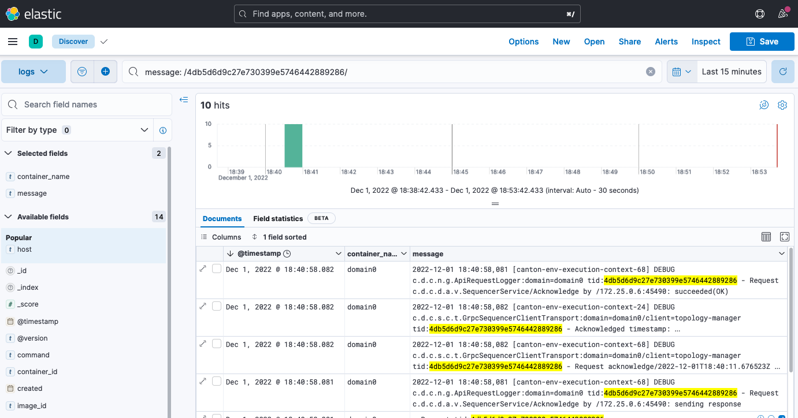

..
   Copyright (c) 2023 Digital Asset (Switzerland) GmbH and/or its affiliates.
..
   Proprietary code. All rights reserved.

.. _example_monitoring_setup:

Example Monitoring Setup
========================

This section gives an example of how canton can be run inside a connected network of docker containers. We then go on to show how network activity can be monitored. See the `Glossary`_ for an explaination of the terms used and the `Monitoring Choices`_ section on the reasoning behind the example monitoring setup. 

Container Setup
---------------

Here we go through the details of how `Docker Compose <https://docs.docker.com/compose/>`_ can be configured to spin up the docker container network shown below.
Please see the `compose` documentation for detailed information concerning the structure of the configuration files.

One feature of `compose` is that it allows the overall configuration to be provided across a number of files.
Below we look at each of the configuration files in turn and then show how we can bring them all together in a running network.

Intended Use
~~~~~~~~~~~~

The purpose of of this example is to demonstrate how monitoring information can be exposed from canton, aggregated and observed. It is not suitable for production use as is without alterations. In particular note the warnings below.

 .. warning::

   Ports are exposed from the docker network that are not necessary to support the UI. This may be to allow low level interaction with the underlying service via a REST interface or similar. In a production system the only ports that should be exposed are those required for the operation of the system

 .. warning:: 

   Some of the services used in the demo, for example Postgres and Elasiticsearch persist data to disk. For the demo the volumes used for this persisted data are internal to the docker container. This means that when the docker network is torn down all data is cleaned up along with the containers. In a production system these volumes would be mounted onto permanent storage.

 .. warning:: 

   Passwords are stored in plaintext in configuration files. In a production system passwords should be extracted from a secure keystore at runtime.

 .. warning:: 

   Network connections are not secured. In a production system connections between services should be TLS enabled with a certificate authority (CA) provided.

 .. warning:: 

   The memory use of the containers is only suitable for light demonstration loads. In a production setup containers need to be given sufficient memory based on memory profiling.

 .. warning:: 

   The versions of the docker images used in the example was current at the time of publishing. In a production system only the latest patched versions should be used.

Network Configuration
~~~~~~~~~~~~~~~~~~~~~
This compose file defines the network that will be used to connect all the running containers.

.. literalinclude:: ./monitoring/etc/network-docker-compose.yml
   :language: yaml
   :caption: etc/network-docker-compose.yml

Postgres Setup
~~~~~~~~~~~~~~
We only use a single postgres container but create databases for the domain along with canton and index databases for each participant.
We do this by mounting `postgres-init.sql` into the postgres initialized directory. Note that in a production environment passwords
must not be inlined inside config.

.. literalinclude:: ./monitoring/etc/postgres-docker-compose.yml
   :language: yaml
   :caption: etc/postgres-docker-compose.yml

.. literalinclude:: ./monitoring/etc/postgres-init.sql
   :language: sql
   :caption: etc/postgres-init.sql 

Domain Setup
~~~~~~~~~~~~
We run the domain with the `--log-profile container` that writes plain text to standard out at debug level.

.. literalinclude:: ./monitoring/etc/domain0-docker-compose.yml
   :language: yaml
   :caption: etc/domain0-docker-compose.yml

.. literalinclude:: ./monitoring/etc/domain0.conf
   :caption: etc/domain0.conf

Participant Setup
~~~~~~~~~~~~~~~~~
Ths particpant container has two files mapped into it on conainer creation, the `.conf` gives details of the domain and database locations.
A HTTP metrics endpoint is exposed that returns metrics in the 
`Prometheus Text Based Format <https://github.com/prometheus/docs/blob/main/content/docs/instrumenting/exposition_formats.md#text-based-format>`_
By default participants do not connect to remote domains so to make this happen a bootstrap script is provided.

.. literalinclude:: ./monitoring/etc/participant1-docker-compose.yml
   :language: yaml
   :caption: etc/participant1-docker-compose.yml

.. literalinclude:: ./monitoring/etc/participant1.bootstrap
   :language: scala
   :caption: etc/participant1.bootstrap

.. literalinclude:: ./monitoring/etc/participant1.conf
   :caption: etc/participant1.conf

The setup for participant2 is identical apart from the name and ports which are changed

.. literalinclude:: ./monitoring/etc/participant2-docker-compose.yml
   :language: yaml
   :caption: etc/participant2-docker-compose.yml

.. literalinclude:: ./monitoring/etc/participant1.bootstrap
   :language: scala
   :caption: etc/participant2.bootstrap

.. literalinclude:: ./monitoring/etc/participant1.conf
   :caption: etc/participant2.conf

Logstash
~~~~~~~~

Docker containers have the ability to specifify a log driver that allows the automatic exporting of log information from the container to an aggregating service. We have chosen to export log information in `GELF`_ with Logstash being used as the aggregation point for all GELF streams. Logstash can be used to feed a number of downstream logging data stores including Elasiticsearch, Loki and Graylog.

.. literalinclude:: ./monitoring/etc/logstash-docker-compose.yml
   :caption: etc/logstash-docker-compose.yml

Logstash reads the `pipeline.yml` to discover the locations of all pipelines.

.. literalinclude:: ./monitoring/etc/pipeline.yml
   :caption: etc/pipeline.yml

The configured pipeline reads GELF formatted input and outputs it to an Elasticsearch index prefixed with `logs-` and postfixed with the date.

.. literalinclude:: ./monitoring/etc/logstash.conf
   :caption: etc/logstash.conf

The default logstash settings are used with the http port bound to all host IP addresses.

.. literalinclude:: ./monitoring/etc/logstash.yml
   :caption: etc/logstash.yml

Elasticsearch
~~~~~~~~~~~~~

Elasiticsearch supports running in a clustered configuration with built-in resiliency. For demonstration purposes we only run a single Elasticsearch node. 

.. literalinclude:: ./monitoring/etc/elasticsearch-docker-compose.yml
   :caption: etc/elasticsearch-docker-compose.yml

Kibana
~~~~~~

Kibana is used to provide a UI that allows the Elasiticsearch log index to be searched.

.. literalinclude:: ./monitoring/etc/kibana-docker-compose.yml
   :caption: etc/kibana-docker-compose.yml

A data view needs to be manually configured to allow log viewing. See `Kibana Log Monitoring`_ for instructions on how to do this.

cAdvisor
~~~~~~~~

cAdvisor is used to expose container system metrics (CPU, memory, disk, network) to Prometheus.  It also provides a UI that allows these metrics to be viewed.

.. literalinclude:: ./monitoring/etc/cadvisor-docker-compose.yml
   :caption: etc/cadvisor-docker-compose.yml

To view container metrics:

   - Navigate to http://localhost:8080/docker/
   - Select a docker containe of interest

You should now have a UI similar to the one shown below.

.. image:: ./images/c-advisor.png
   :align: center
   :width: 100% 

Prometheus formatted metrics are available to default at http://localhost:8080/metrics.

Prometheus
~~~~~~~~~~

Prometheus is configured with `prometheus.yml` that gives the endpoints from which metric data should be scraped. 
By default port `9090` can be used to query the stored metric data.

.. literalinclude:: ./monitoring/etc/prometheus-docker-compose.yml
   :caption: etc/prometheus-docker-compose.yml

.. literalinclude:: ./monitoring/etc/prometheus.yml
   :caption: etc/prometheus.yml

Grafana
~~~~~~~

Grafana is provided with: 

* The connection details for the prometheus metric store
* The username and password required to use the web UI
* The location of any externally provided dashboards
* The actual dashboards.

Note that the `Metric Count` dashboard referenced in the docker-compose.yml (`grafana-message-count-dashboard.json`) is not inlined below as this is not hand configured but built via the web UI and then exported (so contains a lot of unnecessary details). 
See `Grafana Metric Monitoring`_ for instructions of how to log into Grafana and display the dashboard.

.. literalinclude:: ./monitoring/etc/grafana-docker-compose.yml
   :caption: etc/grafana-docker-compose.yml

.. literalinclude:: ./monitoring/etc/grafana.ini
   :caption: etc/grafana.ini

.. literalinclude:: ./monitoring/etc/grafana-datasources.yml
   :caption: etc/grafana-datasources.yml

.. literalinclude:: ./monitoring/etc/grafana-dashboards.yml
   :caption: etc/grafana-dashboards.yml

Dependencies
~~~~~~~~~~~~

There are startup dependencies between the docker containers, for example the domain needs to be running before the particpant, and in turn, the datbase needs to run before the domain.

The `yaml` anchor `x-logging` enabled GELF container logging and is duplicated across the containers where we want to capture logging output. One thing to note is that the host address used is that of the host machine, not a network address (on OSX).

.. literalinclude:: ./monitoring/etc/dependency-docker-compose.yml
   :language: yaml
   :caption: etc/dependency-docker-compose.yml

Docker Images
~~~~~~~~~~~~~

The docker images used above need to be pulled down prior to starting the network.

* digitalasset/canton-open-source:2.5.1
* docker.elastic.co/elasticsearch/elasticsearch:8.5.2
* docker.elastic.co/kibana/kibana:8.5.2
* docker.elastic.co/logstash/logstash:8.5.1
* gcr.io/cadvisor/cadvisor:v0.45.0
* grafana/grafana:9.3.1-ubuntu
* postgres:11.18-bullseye
* prom/prometheus:v2.40.6

Running Docker Compose
~~~~~~~~~~~~~~~~~~~~~~

Running `docker compose` with all the compose files shown above makes for quite a long command line. For this reason a helper script, `dc.sh` is used.

It is recommended that the docker is provided with a minimum of **12GB** of memory. To verify docker is not running short of memory run `docker stats` and ensure the total `MEM%` is not too high.

.. literalinclude:: ./monitoring/dc.sh
   :language: bash
   :caption: dc.sh

**Useful commands**

.. code-block:: bash

     ./dc.sh up -d       # Spins up the network and runs it in the background

     ./dc.sh ps          # Shows the running containers

     ./dc.sh stop        # Stops the containers

     ./dc.sh start       # Starts the containers

     ./dc.sh down        # Stops and tears down the network, removing any created containers

Connecting to Nodes
-------------------

To interact with the running network a the canton console can be used with a remote configuration. For example

.. code-block:: bash

     bin/canton -c etc/remote-participant1.conf

Remote configurations
~~~~~~~~~~~~~~~~~~~~~

.. literalinclude:: ./monitoring/etc/remote-domain0.conf
   :caption: etc/remote-domain0.conf

.. literalinclude:: ./monitoring/etc/remote-participant1.conf
   :caption: etc/remote-participant1.conf

.. literalinclude:: ./monitoring/etc/remote-participant2.conf
   :caption: etc/remote-participant2.conf

Getting Started
~~~~~~~~~~~~~~~
Using the scripts above it is possible to follow the examples provided in 
the getting the :ref:`Getting Started <canton-getting-started>` guide.

Kibana Log Monitoring
---------------------

When Kibana is started for the first time a data view needs to be set up to allow the viewing of log data:

   - Navigate to http://localhost:5601/
   - Click 'Explore on my own'
   - From the menu select Analytics -> Discover
   - Click 'Create data view'
   - Save a data view with the following properties:

      * Name: `Logs`
      * Index pattern: `logs-*`
      * Timestamp field: `@timestamp`

You should now have a UI similar to the one shown below.

Kibana has a fairly intuitive interface that allows:

   - A view to be created based on selected fields
   - Log messages to be viewed by logging timestamp
   - Filtering by field value
   - Text searching
   - Querying using either `KSQL` or `Lucene` query languages.

For more details see the Kibana documentation. Note that querying based on plain text for a wide time window is likely to result in poor UI performance. See `Logging Improvements`_ for ideas about how this can be improved.

Grafana Metric Monitoring
-------------------------

Here we show how to log into the Grafana UI and setup a dashboard. As an example we will import a `GrafanaLabs community dashboard <https://grafana.com/grafana/dashboards/>`_ that has graphs for cAdvisor metrics. The `cAdvisor Export dashboard <https://grafana.com/grafana/dashboards/14282-cadvisor-exporter/>`_ we import below has an ID of **14282**.

   - Navigate to http://localhost:3000/login
   - Enter the username/password: `grafana/grafana`
   - In the left hand border select `Dashboards` and then `Import`.
   - Enter the dashboard ID **14282** and click `Load`
   - On the screen select `Prometheus` as the data source and click `Import`

You should see container system metrics dashbord similar to that shown below:

See the `Grafana Documentation`_ about how to configure dashboards. For information about which metrics are available see the Metrics documentation in the Monitoring section of this user manual.

Monitoring Choices
------------------
This section documents the reasoning behind the technology used in the example monitoring setup.

Use Docker Log Drivers
~~~~~~~~~~~~~~~~~~~~~~
**Reasons:**

- Most docker containers can be configured to log all debug output to stdout
- Containers can be run as supplied
- No additional dockerfile layers need to be added to install/start log scrapers
- No need to worry about local file naming / log rotation etc

Use GELF Docker Log Driver
~~~~~~~~~~~~~~~~~~~~~~~~~~
**Reasons:**

- It is shipped with docker (so arguably mature)
- Has decodable JSON payload
- Does not have size limitations of syslog
- A UDP listener can be used to debug problems

Use Logstash
~~~~~~~~~~~~
**Reasons:**

- It is a lightweight way to bridge the GELF output provided by the containers into Elasticsearch.
- Simple conceptual model (pipelines consiting of input/filter/output plugins).
- Large ecosystem of input/filter and output plugins.
- It externalizes the logic for mapping container logging output to a structures/ECS format.
- Can be run with `stdin`/`stdout` input/outut plugins for use with testing.
- Can be used to feed Elasiticsearch, Loki or Graylog.
- Has suppport for the Elastic Common Schema (ECS) were this to be needed.

Use Elasticsearch/Kibana
~~~~~~~~~~~~~~~~~~~~~~~~
**Reasons:**

- Using Logstash with Elasticsearch and Kibana, the `ELK`_ stack, is a mature way set up a logging infrastructure. 
- Good defaults for these products allow a basic setup to be started with close to zero configuration.
- The ELK setup acts as a good baseline if comparing to other options such as `Loki`_ or `Graylog`_.

Use Prometheus/Grafana
~~~~~~~~~~~~~~~~~~~~~~
**Reasons:**

- Prometheus defines and uses the `OpenTelemetry`_ reference file format.
- Exposing metrics via an HTTP endpoint allows easy direct inspection of metric values.
- The Prometheus approach of pulling metrics from underlying system means that the running containers to not need infrastructure to store and push metric data.
- Grafana works very well with Prometheus.

Logging Improvements
--------------------
This version of the example only has the logging structure provided via GELF. It is possible to do better than this by:

  - Extracting data from the underlying containers as a JSON stream 
  - Mapping fields in this JSON data onto the `ECS`_ such that the same name is used for commonly used field values (e.g. log level).
  - Configuring Elasticsearch with a schema that allows certain fields to be quickly filtered (e.g. log level).

Glossary
--------

Docker Log Driver
~~~~~~~~~~~~~~~~~
Docker containers can be configured with a log driver that allows log output to be exported out of the docker container. Using log drivers to export logging information means that it is not necessary to run another process on the docker container to do this.

https://docs.docker.com/config/containers/logging/configure/

Syslog
~~~~~~
Syslog is a standard for logging messages that has been around since the 1980s. Syslog is one of the built-in logging drivers supported by docker.

https://en.wikipedia.org/wiki/Syslog

GELF
~~~~
The Graylog extended logging format (GELF) improves on syslog logging by providing structured messages that are not size limited. GELF is one of the built-in logging drivers supported by docker. The message format is compressed JSON.

https://docs.graylog.org/docs/gelf

Docker Plugins
~~~~~~~~~~~~~~
A docker plugin is a way to extend docker, for example by adding an log driver.

https://docs.docker.com/engine/extend/

Loki Log Driver
~~~~~~~~~~~~~~~
The loki log driver is a Loki client that allows log information to be shipped from a docker log file similar to other log drivers. The message format is gRPC protobuf.

https://grafana.com/docs/loki/latest/clients/docker-driver/

Logstash
~~~~~~~~
Logstash is a service that allows a series of pipelines to be configured that read input, filter and manipulate it before writing it out. It has support for a multitude of different input, filter and output types. The GELF input reader and Elasticsearch output writer are of particular interest.

https://www.elastic.co/guide/en/logstash/current/introduction.html

Elasticsearch
~~~~~~~~~~~~~
Elasticsearch is a technology that allows JSON documents to be stored, indexed and searched in near real-time. It can be configured as a cluster with built-in resiliency.

https://www.elastic.co/guide/en/elasticsearch/reference/8.5/index.html

ECS
~~~
The Elastic Common Schema (ECS) defines a naming convention for fields used in Elasticsearch. For example @timestamp should be used for timestamp.

https://www.elastic.co/guide/en/ecs/current/ecs-field-reference.html

MinIO
~~~~~
AWS S3 Compatible Storage (used by Loki).

https://min.io/product/s3-compatibility

ELK
~~~
The ELK stack is an esablished way to enable to capture, indexing and display of log data.

https://www.elastic.co/what-is/elk-stack

Graylog
~~~~~~~
Unlike Elasticsearch Graylog is not a general purpose indexing, analytics and search tool but one that is designed specificially for log data. Doing this allows a simpler more focused proposition with better default for logging. 

https://www.graylog.org/about/

Loki
~~~~
Loki is a log aggregation system designed to store and query logs from all your applications and infrastructure. It displays log information inside Grafana allowing a single UI to be used for both metric data and logs.

https://grafana.com/oss/loki/

Prometheus
~~~~~~~~~~
Prometheus can be configured to scrape metric data from a number of endpoints. This metric data can then be queried by metric visulization tools such as Grafana

https://prometheus.io/

.. _Grafana Documentation:

Grafana
~~~~~~~
Grafana provides a web UI that allows the contruction of dashboards showing metric data. This data can be queried against a Prometheus metric store.

https://grafana.com/grafana/

OpenTelemetry
~~~~~~~~~~~~~
OpenTelemetry is an organisation that works to standardize observability (an umbrella term that includes logging, metrics and tracing).

https://opentelemetry.io/

cAdvisor
~~~~~~~~
Container Advisor (cAdvisor) provides an overview of CPU, memory, disk and network utilization for each of the docker containers. It works by querying the `Docker Engine API <https://docs.docker.com/engine/api/>`_ to get these statistics for each container saving the containers needing to be layered with a utility to do this.

https://github.com/google/cadvisor
