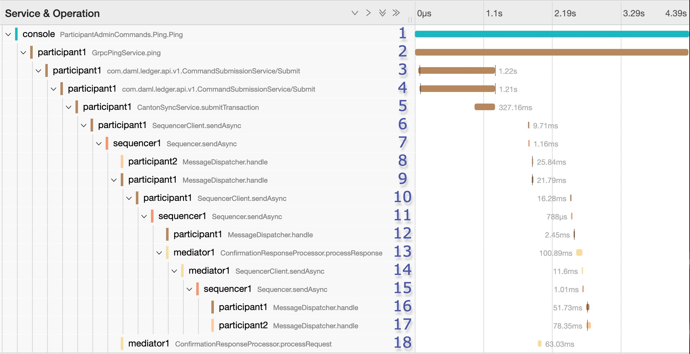

..
   Copyright (c) 2023 Digital Asset (Switzerland) GmbH and/or its affiliates.
..
   Proprietary code. All rights reserved.

.. _monitoring:

Monitoring
==========

.. _logging:

Logging
-------
Canton uses `Logback <https://logback.qos.ch>`__ as the logging library. All Canton logs derive from the logger ``com.digitalasset.canton``.
By default, Canton will write a log to the file ``log/canton.log`` using the ``INFO``
log-level and will also log WARN and ERROR to stdout.

How Canton produces log files can be configured extensively on the command line using the following options:

- ``-v`` (or ``--verbose``) is a short option to set the canton log level to ``DEBUG``. This is likely the most common log option you will use.
- ``--debug`` sets all log levels, except stdout which is set to ``INFO``, to ``DEBUG``. Note that ``DEBUG`` logs of external libraries can be very noisy.
- ``--log-level-root=<level>`` configures the log-level of the root logger. This changes the log level of Canton and of external libraries, but not of stdout.
- ``--log-level-canton=<level>`` configures the log-level of only the Canton logger.
- ``--log-level-stdout=<level>`` configures the log-level of stdout. This will usually be the text displayed in the Canton console.
- ``--log-file-name=log/canton.log`` configures the location of the log file.
- ``--log-file-appender=flat|rolling|off`` configures if and how logging to a file should be done. The rolling appender will roll the files according to the defined date-time pattern.
- ``--log-file-rolling-history=12`` configures the number of historical files to keep when using the rolling appender.
- ``--log-file-rolling-pattern=YYYY-mm-dd`` configures the rolling file suffix (and therefore the frequency) of how files should be rolled.
- ``--log-truncate`` configures whether the log file should be truncated on startup.
- ``--log-profile=container`` provides a default set of logging settings for a particular setup. Right now, we only support the ``container`` profile which logs to STDOUT and turns of flat file logging to avoid storage leaks due to log files within a container.
- ``--log-immediate-flush=false`` turns off immediate flushing of the log output to the log file.

Please note that if you use ``--log-profile``, the order of the command line arguments matters. The profile settings can be overridden on the command line by placing adjustments after the profile has been selected.

Canton supports the normal log4j logging levels: ``TRACE, DEBUG, INFO, WARN, ERROR``.

For further customization, a custom `logback configuration <https://logback.qos.ch/manual/configuration.html>`__ can be provided using ``JAVA_OPTS``.

.. code-block:: bash

    JAVA_OPTS="-Dlogback.configurationFile=./path-to-file.xml" ./bin/canton --config ...

If you use a custom log-file, the command line arguments for logging will not have any effect, except ``--log-level-canton`` and ``--log-level-root`` which can still be used to adjust the log level of the root loggers.

.. _lnav:

Viewing Logs
~~~~~~~~~~~~

We strongly recommend the use of a log file viewer such as `lnav <https://lnav.org/>`__ to view Canton logs and resolve issues.
Among other features, lnav has automatic syntax highlighting, convenient filtering for specific log messages, and allows viewing log files of different Canton components in a single view.
This makes viewing logs and resolving issues a lot more efficient than simply using standard UNIX tools such as less or grep.

In particular, we have found the following features especially useful when using ``lnav``:

- viewing log files of different Canton components in `a single view <https://lnav.org/features#single-log-view>`__ merged according to timestamps (``lnav <log1> <log2> ...``).
- `filtering <https://docs.lnav.org/en/latest/usage.html#filtering>`__ specific log messages in (``:filter-in <regex>``) or out (``:filter-out <regex>``). When filtering messages, e.g. with a given trace-id, in, a transaction can be traced across different components, especially when using the single-view-feature described above.
- `searching <https://docs.lnav.org/en/latest/usage.html#searching>`__ for specific log messages (``/<regex>``) and jumping in-between them (``n`` and ``N``).
- automatic syntax highlighting of parts of log messages (e.g. timestamps) and log messages themselves (e.g. ``WARN`` log messages are yellow).
- `jumping <https://docs.lnav.org/en/latest/usage.html#searching>`__ in-between error (``e`` and ``E``) and warn messages (``w`` and ``W``).
- selectively activating and deactivating different filters and files (``TAB`` and `` `` to activate/deactivate a filter).
- marking lines (``m``) and jumping back-and-forth between marked lines (``u`` and ``U``).
- jumping back-and-forth between lines that have the same :ref:`trace-id <tracing>` (``o`` and ``O``).

The `custom lnav log format file <https://docs.lnav.org/en/latest/formats.html>`__ for Canton logs ``canton.lnav.json`` is bundled in any Canton release. It can be installed with ``lnav -i canton.lnav.json``.
JSON based log files (which need to use the file suffix ``.clog``) can be viewed using the ``canton-json.lnav.json`` format file.

.. _detailed_logging:

Detailed Logging
~~~~~~~~~~~~~~~~

By default, logging will omit details in order to not write sensitive data into log files. For debug or
educational purposes, you can turn on additional logging using the following configuration switches:

.. literalinclude:: /canton/includes/mirrored/community/app/src/test/resources/documentation-snippets/logging-event-details.conf

In particular, this will turn on payload logging in the ``ApiRequestLogger``, which records every GRPC API invocation,
and will turn on detailed logging of the ``SequencerClient`` and for the transaction trees. Please note that all
additional events will be logged at DEBUG level.

.. _tracing:

Tracing
-------

For further debuggability, Canton provides a trace-id which allows to trace the processing
of requests through the system. The trace-id is exposed to logback through the
*mapping diagnostic context* and can be included in the logback output pattern using ``%mdc{trace-id}``.

The trace-id propagation is enabled by setting the ``canton.monitoring.tracing.propagation = enabled``
configuration option, which is already enabled by default.

It is also possible to configure the service where traces and spans are reported to, for observing distributed traces.
Refer to :ref:`Traces <traces>` below to see what it looks like.

Currently Jaeger and Zipkin are supported. For example, Jaeger reporting can be configure as follows:

::

    monitoring.tracing.tracer.exporter {
      type = jaeger
      address = ... // default: "localhost"
      port = ... // default: 14250
    }

The configuration above will connect to a running Jaeger server to report tracing information.

It is possible to easily run Jaeger in a Docker container as follows:

::

    docker run --rm -it --name jaeger\
      -p 16686:16686 \
      -p 14250:14250 \
      jaegertracing/all-in-one:1.22.0

If you prefer not to use Docker, it is also possible to download the binary for your specific OS at `Download Jaeger <https://www.jaegertracing.io/download/#binaries>`_. Unzip the file and then simply run the binary titled `jaeger-all-in-one` (no need for providing any arguments to it).
By default Jagger will expose port `16686` for its UI which can be seen in a browser window, and port `14250` to which Canton will report trace information. Please make sure to properly expose these ports.

Please make sure that all Canton nodes in the network report to the same Jagger server in order to have an accurate view of the full traces, and that the Jaeger server is reachable by all Canton nodes.

Sampling
~~~~~~~~

It is also possible to change how often spans are sampled (i.e. reported to the configured exporter).
By default it will always report (``monitoring.tracing.tracer.sampler.type = always-on``).
It can also be configured to never report (``monitoring.tracing.tracer.sampler.type = always-off``, although not super useful).
And it can also be configured so that a specific fraction of spans are reported like below:

::

    monitoring.tracing.tracer.sampler = {
      type = trace-id-ratio
      ratio = 0.5
    }

There is one last property of sampling that can be optionally changed. By default we have parent-based sampling on (``monitoring.tracing.tracer.sampler.parent-based = true``)
which means that a span is sampled iff its parent is sampled (the root span will follow the configured sampling strategy).
This way, there will never be incomplete traces, so either the full trace is sampled or not.
If this property is changed, all spans will follow the configured sampling strategy ignoring whether the parent is sampled or not.

Known Limitations
~~~~~~~~~~~~~~~~~

Not every trace created which can currently be observed in logs are reported to the configured trace collector service.
Traces originated at console commands or that are part of the transaction protocol are largely well reported, while other kinds of traces
are being added to the set of reported traces as the need arise.

.. todo::
    The limitation mentioned below is to be addressed as part of the below tickets:
    `#10633 <https://github.com/DACH-NY/canton/issues/10633>`_
    `#14256 <https://github.com/digital-asset/daml/issues/14256>`_

Also, even the transaction protocol trace has a know limitation which is that once some command is submitted (and its trace fully reported),
if there are any resulting daml events which are subsequently processed as a result, a new trace is created as currently the ledger api does not
propagate any trace context info from command submission to transaction subscription. This can be observed for example by the fact that
if a participant creates a ``Ping`` contract, it is possible to see the full transaction processing trace of the ``Ping`` command being submitted, but then
the participant which processes the ``Ping`` by exercising ``Respond`` and creating the ``Pong`` contract will then create a separate trace instead of continuing to use the same one.

Note that this is different than if a single Daml transaction results in multiple actions at the same time (multiple contracts being archived and created).
In that case a single trace would encompass the whole process, since it is happening as part of a single transaction as opposed to as a result of
some external process reacting to Daml events.

.. _traces:

Traces
~~~~~~

Each span represents a single operation within a trace. A trace is a directed acyclic graph (DAG) of spans, where the edges between spans are defined as parent/child relationships (definitions taken from `Opentelemetry's glossary <https://opentelemetry.io/docs/concepts/glossary/>`_).

Canton currently reports several different kinds of traces. For example, every Canton console command that interacts with the admin api starts a trace whose initial span last for the whole duration of the command, including the GRPC call to the specific admin api endpoint.

One important trace is the trace of Daml command submission. This trace is illustrated above as part of performing a Canton ping using the console, which contains 18 spans.
Note that this is what it looks like as of October 2022, and it may have changed slightly.
The current tracing focuses largely on the message exchange via the sequencer, without digging deep into the message handlers and further processing of transactions. We will close those gaps in the future.
The ping illustrated here is started by ``participant1`` and has ``participant2`` as the target.

Notice that in some cases spans may start later than the end of their parent, due to their processing happening asynchronously.
That is, at a later point, as opposed to during the processing of the predecessor.
This typically happens when the new operation gets placed on a queue to be handled later, which immediately frees the parent span and ends it.
It is made clear below the moments when this happens.

The initial span (span 1) covers the duration of the whole ping operation, with a GRPC request made by the console which is handled by the GrpcPingService (span 2) in the participant node which also lasts for the whole duration of the ping operation.

For context, the Canton ping consists of 3 different Daml commands:

1. ``participant1``’s admin party creates the ``Ping`` contract
2. ``participant2``’s admin party exercises the ``Respond`` consuming choice on the contract, which results in the creation of a ``Pong`` contract.
3. ``participant1``’s admin party exercises the ``Ack`` consuming choice on it.

.. todo::
    `#10633 <https://github.com/DACH-NY/canton/issues/10633>`_

Starting at span 3 in the example trace we see the submission of the first of the three Daml commands (the creation of the ``Ping`` contract).
Due to a limitation explained in the next section, the other 2 Daml command submissions do not get linked to this whole trace. It is possible to find them separately.
In any case span 2 will only complete once the 3 Daml commands are completed.

At span 3 the participant node itself is on the client side of the ledger-api, but in other use cases it could also be an application integrated with the participant.
This span lasts for the duration of this GRPC call, which gets received on the server side (span 4) and gets handled by the ``CantonSyncService`` (span 5).
At this point the request is received and acknowledged, but not fully processed. It is processed asynchronously later on, which means that spans 3 to 5 will complete before the request is actually handled.

Currently missing from the trace, which accounts for some of the gap between spans 5 and 6, is the domain routing where the participant decides which domain to use for the
command submission, and the preparation of the initial set of messages to be sent. At span 6 we see the start of the Canton transaction protocol. Here ``participant1`` sends a request to ``sequencer1`` for it to sequence the initial set of confirmation requests messages as part of phase 1 of the transaction protocol.

The transaction protocol has 7 phases. An in-detail document about them will be made available soon, currently a simple description can be found at :ref:`transaction processing <canton-overview-tx-processing>`.

At span 7 we see ``sequencer1`` receive the request and register it. Receipt of the messages is not part of this span, as that happens asynchronously at a later point.

At span 18, as part of phase 2, ``mediator1`` receives an informee message and all it needs to do is validate and register it. As it doesn't need to respond, span 18 has no children.

As part of phase 3, ``participant2`` receives a message (which we can see at span 8) and ``participant1`` also receives a message (which we can see at span 9).
Both participants asynchronously validate the messages. ``participant2`` does not need to respond since it is only an observer, that's why span 8 has no children.
``participant1`` however will respond, which is visible at span 10 where it is again making a call to the ``sequencer1``, which receives it at span 11.

At span 12, ``participant1`` receives a successful send response message that signals that his message to the mediator was successfully sequenced.
This is happening as part of phase 4, where confirmation responses are sent to the mediator. We can see the mediator receive it at span 13, and will then proceed to validate the message (phase 5).

At this point, as we can see in spans 14 and 15, ``mediator1`` (now at phase 6) asks ``sequencer1`` to send the transaction result messages to the participants.

To end this round of the transaction protocol, ``participant1`` and ``participant2`` receive their messages at spans 16 and 17 respectively. The messages are asynchronously validated and their projections of the virtual shared ledger are updated (phase 7).

As mentioned, there are 2 other transaction submission which are unlinked from this ping trace but are part of the operation. It is also possible to find them.
The second one starts at a span titled ``admin-ping.processTransaction`` which is created by ``participant2``, and the third one has the same name but is initiated by ``participant1``.

.. _status-commands:

Status
------

Each Canton node exposes rich status information. Running

.. code-block:: bash

    <node>.health.status

will return a status object which can be one of

- ``Failure`` - if the status of the node cannot be determined, including an error message why it failed
- ``NotInitialized`` - if the node is not yet initialized
- ``Success[NodeStatus]`` - if the status could be determined including the detailed status.

Depending on the node type, the ``NodeStatus`` will differ. A participant node will respond with a message containing

- ``Participant id:`` - the participant id of the node
- ``Uptime:`` - the uptime of this node
- ``Ports:`` - the ports on which the participant node exposes the Ledger and the Admin API.
- ``Connected domains:`` - list of domains the participant is currently connected to properly
- ``Unhealthy domains:`` - list of domains the participant is trying to be connected to but where the connection is not ready for command submission.
- ``Active:`` - true if this instance is the active replica (can be false in case of the passive instance of a high-availability deployment)

A domain node or a sequencer node will respond with a message containing

- ``Domain id:`` - the unique identifier of the domain
- ``Uptime:`` - the uptime of this node
- ``Ports:`` - the ports on which the domain node exposes the Public and the Admin API
- ``Connected Participants:`` - the list of connected participants
- ``Sequencer:`` - a boolean flag indicating if the embedded sequencer writer is operational

A domain topology manager or a mediator node will return

- ``Node uid:`` - the unique identifier of the node
- ``Uptime:`` - the uptime of this node
- ``Ports:`` - the ports on which the node hosts its APIs.
- ``Active:``  - true if this instance is the active replica (can be false in case of the passive instance of a high-availability deployment)

Additionally, all nodes will also return a ``components`` field detailing the health state of each of its internal runtime dependency.
The actual components differ per node, and can give further insights into its current status.
Example components include storage access, domain connectivity, sequencer backend connectivity.

.. _creating_dumps:

Health Dumps
------------

In order to provide efficient support, we need as much information as possible. For this purpose, Canton implements
an information gathering facility that will gather key essential system information for our support staff.
Therefore, if you encounter an error where you need our help, please ensure the following:

- Start Canton in interactive mode, with the ``-v`` option to enable debug logging: ``./bin/canton -v -c <myconfig>``.
  This will provide you with a console prompt.
- Reproduce the error by following the steps that previously caused the error. Write down these steps so they can be
  provided to support staff.
- After you observe the error, type ``health.dump()`` into the Canton console to generate the ZIP file.

This will create a dump file (``.zip``) that stores the following information:

- The configuration you are using, with all sensitive data stripped from it (no passwords).
- An extract of the logfile. We don't log overly sensitive data into log files.
- A current snapshot on Canton metrics.
- A stacktrace for each running thread.

Please provide the gathered information together with the exact list of steps you did that lead
to the issue to your support contact. Providing complete information is very important to us in order to help you
troubleshoot your issues.

Remote Health Dumps
~~~~~~~~~~~~~~~~~~~

When running a console configured to access remote nodes, the ``health.dump()`` command will gather health
data from the remote nodes and package them in the resulting zip files. There is no special action required.
It is also possible to obtain the health data of a specific node by targeting it when running the command.

For instance:

``remoteParticipant1.health.dump()``

When packaging large amounts of data, it can be useful to increase the default timeout of the dump command:

``health.dump(timeout = 2.minutes)``

.. _health-check:

Health Checks
-------------

gRPC Health Check Service
~~~~~~~~~~~~~~~~~~~~~~~~~

Each canton node can optionally be configured to start a gRPC server exposing the `gRPC Health Service <https://github.com/grpc/grpc/blob/master/doc/health-checking.md#service-definition>`__.
Passive nodes (see :ref:`High Availability <ha_user_manual>` for more information on active/passive states) will return ``NOT_SERVING``.
This should be considered when configuring `liveness and readiness probes in a Kubernetes environment <https://kubernetes.io/docs/tasks/configure-pod-container/configure-liveness-readiness-startup-probes/>`__.

The precise way the state is computed is subject to change and will likely evolve as we refine canton self monitoring capabilities.

Example monitoring configuration to be placed inside a node configuration object:

.. literalinclude:: /canton/includes/mirrored/enterprise/integration-testing/src/main/resources/include/health-monitoring.conf

.. note::

    The gRPC health server is configured per canton node, not per process, as is the case for the HTTP health check server (see below).
    This means the configuration must be inserted within a node's configuration object.

.. note::

    To support usage as a Kubernetes liveness probe, the health server exposes a service named ``liveness`` that should be targeted when `configuring a gRPC probe <https://kubernetes.io/docs/tasks/configure-pod-container/configure-liveness-readiness-startup-probes/#define-a-grpc-liveness-probe>`__.
    The latter service will always return ``SERVING``.

HTTP Health Check
~~~~~~~~~~~~~~~~~

The ``canton`` process can optionally expose an HTTP endpoint indicating if the process believes it is healthy.
This may be used as an uptime check or as a `Kubernetes liveness probe <https://kubernetes.io/docs/tasks/configure-pod-container/configure-liveness-readiness-startup-probes/>`__.
If enabled, the ``/health`` endpoint will respond to a ``GET`` HTTP request with a 200 HTTP status code if healthy or 500 if unhealthy (with a plain text description of why it is unhealthy).

To enable this health endpoint add a ``monitoring`` section to the canton configuration.
As this health check is for the whole process, it is added directly to the ``canton`` configuration rather than for a specific node.

::

  canton {
    monitoring.health {
     server {
        port = 7000
     }

     check {
       type = ping
       participant = participant1
       interval = 30s
     }
  }

This health check will have ``participant1`` "ledger ping" itself every 30 seconds. The process will be considered healthy if the ping is successful.

.. _canton-metrics:

Metrics
-------

Enabling the Prometheus Reporter
~~~~~~~~~~~~~~~~~~~~~~~~~~~~~~~~

We recommend configuring `Prometheus <https://prometheus.io>`__ for metrics reporting.
Other reporters (jmx, graphite, csv) are currently supported but they are deprecated and will be removed in the future. Any such reporter should be migrated to Prometheus.

Prometheus can be enabled using

::

    canton.monitoring.metrics.reporters = [{
      type = prometheus
      address = "localhost" // default
      port = 9000 // default
    }]

Prometheus-Only Metrics
~~~~~~~~~~~~~~~~~~~~~~~
Some metrics are available only when using the Prometheus reporter.
These metrics include common gRPC and HTTP metrics (helping you to measure `the four golden signals <https://sre.google/sre-book/monitoring-distributed-systems/#xref_monitoring_golden-signals>`__),
Java Executor Services metrics and JVM GC and memory usage metrics (if enabled).

`The metrics are documented in detail here. <https://docs.daml.com/ops/common-metrics.html>`__

Any metric marked with ``*`` is available only when using the Prometheus reporter.

Deprecated Reporters
~~~~~~~~~~~~~~~~~~~~

JMX-based reporting (for testing purposes only) can be enabled using

::

    canton.monitoring.metrics.reporters = [{ type = jmx }]

Additionally, metrics can be written to a file

::

    canton.monitoring.metrics.reporters = [{
      type = jmx
    }, {
      type = csv
      directory = "metrics"
      interval = 5s // default
      filters = [{
        contains = "canton"
      }]
    }]

or reported via Graphite (to Grafana) using

::

    canton.monitoring.metrics.reporters = [{
      type = graphite
      address = "localhost" // default
      port = 2003
      prefix.type = hostname // default
      interval = 30s // default
      filters = [{
        contains = "canton"
      }]
    }]

When using the ``graphite`` or the ``csv`` reporter, Canton periodically evaluates all metrics matching the given filters.
It is therefore advisable to filter for only those metrics that are relevant to you.

In addition to Canton metrics, the process can also report Daml metrics (of the ledger api server). Optionally,
JVM metrics can be included using

::

    canton.monitoring.metrics.report-jvm-metrics = yes // default no

Participant Metrics
~~~~~~~~~~~~~~~~~~~

..
   This file is generated:
.. include:: /canton/includes/generated/participant_metrics.rst.inc

Domain Metrics
~~~~~~~~~~~~~~

..
   This file is generated:
.. include:: /canton/includes/generated/domain_metrics.rst.inc
