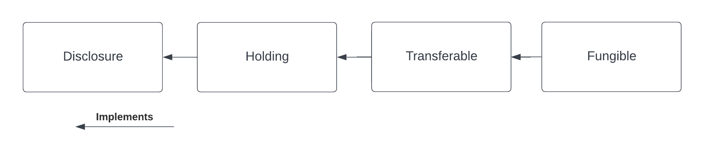

.. Copyright (c) 2023 Digital Asset (Switzerland) GmbH and/or its affiliates. All rights reserved.
.. SPDX-License-Identifier: Apache-2.0

Transfer
########

This tutorial builds on the previous chapter, which introduced :ref:`account <account>`,
:ref:`instrument <instrument>`, and :ref:`holding <holding>`.

We are now going to transfer a holding from Alice to Bob.

Run the Transfer Script
***********************

Let us now explore the ``Transfer`` script step-by-step. It builds on the previous
:doc:`Holding <holding>` tutorial script in the sense that the same accounts and the existing
holdings are used.

Transfer Cash from Alice to Bob
===============================

The final step of our ``Setup`` script transfers Alice’s holding to Bob using the ``Transfer``
workflow. In our tutorial example, the receiver of the cash makes the transfer request:

.. literalinclude:: ../../quickstart-finance/daml/Scripts/Transfer.daml
  :language: daml
  :start-after: -- TRANSFER_BEGIN
  :end-before: -- TRANSFER_END

Bob requests the cash to be transferred to his account. Alice then accepts the request.

You notice that here we make explicit use of the fact that Alice can ``readAs`` the public party.
This is needed as, in order to complete the transfer, visibility on the receiving account's holding
factory is required.

Frequently Asked Questions
**************************

How does the ``Transfer`` workflow work?
========================================

If you look at the implementation of the ``Transfer`` workflow, you will notice the following lines:

.. literalinclude:: ../../quickstart-finance/daml/Workflow/Transfer.daml
  :language: daml
  :start-after: -- DO_TRANSFER_BEGIN
  :end-before: -- DO_TRANSFER_END

The first line converts the holding contract id (of type
:ref:`ContractId Holding.I <type-daml-finance-interface-holding-base-base-14854>`) to the
:ref:`Transferable.I <type-daml-finance-interface-holding-transferable-transferable-24986>`
interface using ``coerceInterfaceContractId``.

Then, the ``Transfer`` choice, defined as part of the
:ref:`Transferable <type-daml-finance-interface-holding-transferable-transferable-24986>`
interface, is invoked.

Finally, the new holding is converted back to a
:ref:`Holding.I <type-daml-finance-interface-holding-base-base-14854>`
before it is returned. This is done using ``toInterfaceContractId``.

In order to fully understand these instructions, we need to keep in mind the interface hierarchy
used by our holding implementation.

        Transferable, and Fungible are each linked by arrows pointing left. Below is an arrow, also
        pointing left, labelled Implements.

We use ``coerceInterfaceContractId`` to convert the
:ref:`Holding.I <type-daml-finance-interface-holding-base-base-14854>`
to a
:ref:`Transferable <type-daml-finance-interface-holding-transferable-transferable-24986>`.
The success of this
operation is not guaranteed and will result in a run-time error if the holding implementation at
hand does not implement
:ref:`Transferable <type-daml-finance-interface-holding-transferable-transferable-24986>`.

We use ``toInterfaceContractId`` to convert back to a
:ref:`Holding <type-daml-finance-interface-holding-base-base-14854>`.
This is because all
:ref:`Transferable <type-daml-finance-interface-holding-transferable-transferable-24986>`\ s
implement the
:ref:`Holding.I <type-daml-finance-interface-holding-base-base-14854>` interface,
so the validity of this operation is
guaranteed at compile-time.

Why is Alice an observer on Bob’s account?
==========================================

You might have noticed that Alice is an observer of Bob’s account and you might be wondering why
this is the case.

This is because the party exercising the ``Transfer`` choice, which in this case is Alice, needs to
fetch Bob’s account in order to verify that it has not been archived.

If we wanted to avoid Bob’s account contract ever being disclosed to Alice, we would need a third
party (in this case the Bank) to execute the ``Transfer``.

Exercises
*********

There are a couple of improvements to the code that can be implemented as an exercise. They will
help you familiarize yourself with the library and with Daml interfaces.

Split the Holding to Transfer the Right Amount
==============================================

In the example, Bob requests ``USD 1000`` from Alice and Alice allocates a holding for exactly the
right amount, because the transfer would otherwise fail. We want the transfer to be successful also
if Alice allocates a holding for a larger amount e.g., ``USD 1500``.

We can leverage the fact that the holding implements the
:ref:`Fungible <type-daml-finance-interface-holding-fungible-fungible-60176>`
interface, which makes it possible to ``Split`` it into a holding of ``USD 1000`` and one of
``USD 500``. In the implementation of the ``CashTransferRequest_Accept`` choice:

- cast the allocated holding to the :ref:`Fungible
  <type-daml-finance-interface-holding-fungible-fungible-60176>` interface
- use the ``Split`` choice to split the larger holding into two holdings
- execute the transfer, allocating the holding with the correct amount

In the last step, you will need to cast the
:ref:`Fungible <type-daml-finance-interface-holding-fungible-fungible-60176>` to a
:ref:`Transferable <type-daml-finance-interface-holding-transferable-transferable-24986>`
using ``toInterfaceContractId``.

Temporary Account Disclosure
============================

There is no reason for Alice to be an observer on Bob's account before the transfer is initiated by
Bob (and after the transfer is executed).

Modify the original code, such that:

- Bob's account is disclosed to Alice once the transfer is initiated
- When the Transfer is executed, Alice removes herself from the account observers

In order to do that, you can leverage the fact that
:ref:`Account <type-daml-finance-account-account-account-12745>`
implements the
:ref:`Disclosure <type-daml-finance-interface-util-disclosure-disclosure-97052>`
interface. This interface exposes the ``AddObservers`` and ``RemoveObservers`` choices, which can be
used to disclose / undisclose Bob's account contract to Alice. In order to exercise these choices,
you can use the :ref:`Account.exerciseInterfaceByKey
<function-daml-finance-interface-account-account-exerciseinterfacebykey-13671>` utility function.

Summary
*******

You know how to setup basic accounts, holdings and instruments. You also learned how to perform a
simple transfer. The key concepts to take away are:

* Holdings represent the ownership of a financial instrument at a custodian.
* Transfers change ownership of a holding.

Ownership transfers typically happen as part of a larger financial transaction. The next tutorial
will show you how to create such a transaction and how to settle it atomically.
