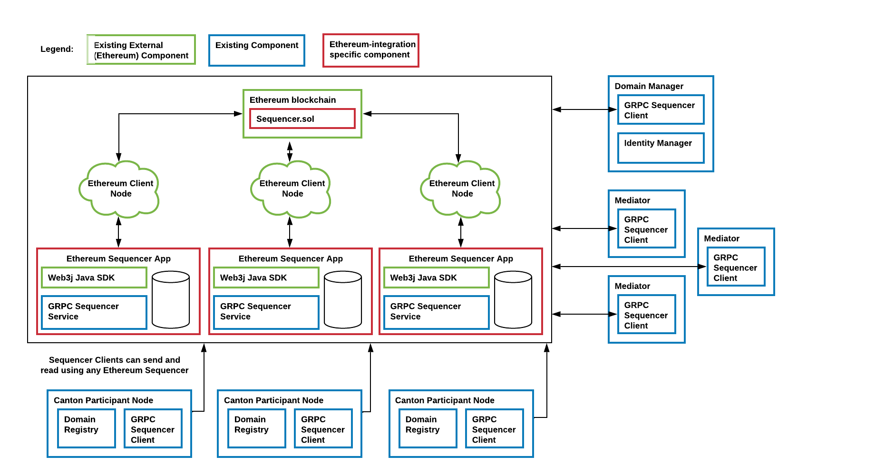

..
   Copyright (c) 2023 Digital Asset (Switzerland) GmbH and/or its affiliates.
..
   Proprietary code. All rights reserved.

.. _ethereum-architecture:

Canton Synchronization Domain on Ethereum
=========================================

A Canton Ethereum sync domain uses a sequencer backed by Ethereum instead of by another ledger
(such as Postgres or Fabric). The other sync domain components (mediator, topology manager) are reused from the relational database driver.
Architecturally, the Canton Ethereum sequencer is a JVM application that interacts with an Ethereum client
via the `RPC JSON API <https://eth.wiki/json-rpc/API>`_
to write events to the blockchain.
Specifically, it interacts with an instance of the smart contract ``Sequencer.sol`` and calls the function of ``Sequencer.sol``
to persist transactions and requests to the blockchain.
It uses the configured Ethereum account to execute these calls.
Analogous to the database-based sequencer implementations, multiple Ethereum sequencer applications can read and write to the same
``Sequencer.sol`` smart contract instance and they can do so through different Ethereum client nodes for high availability,
scalability, and trust. The following diagrams shows the architecture of an Ethereum-based sync domain:

.. note:: When running in a multi-writer setup, each Ethereum Sequencer application needs to use a separate Ethereum account.
    Otherwise, transactions may get stuck due to nonce mismatches.

Smart contract Sequencer.sol
----------------------------

The smart contract deployed to the blockchain is implemented in Solidity. Its latest revision
``drivers/ethereum/solidity/Sequencer.sol`` is available in the enterprise edition only.

Data is written to the blockchain by emitting `events <https://docs.soliditylang.org/en/stable/contracts.html#events>`_
to the transaction logs.
The Sequencer Application reads all transactions (and transaction logs) created from calls to ``Sequencer.sol``
and keeps its own store for a view of the sequencer history.
This enables the Sequencer Application to serve read subscriptions promptly without having to query the Ethereum client
and to restart without having to re-read all the history. The store can either use in-memory storage or persistent
storage (using a database).
