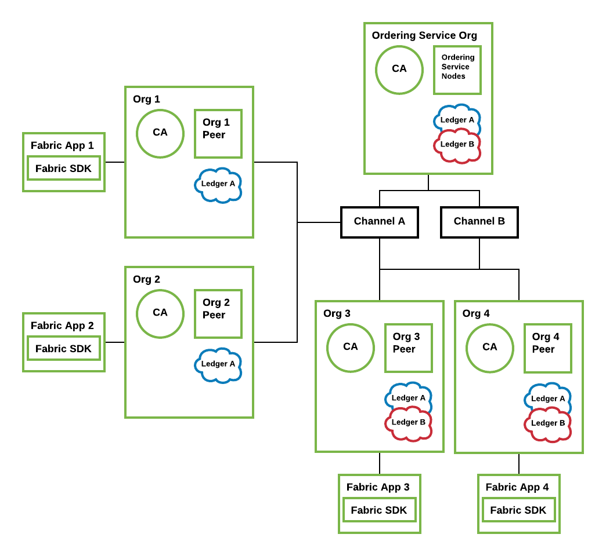
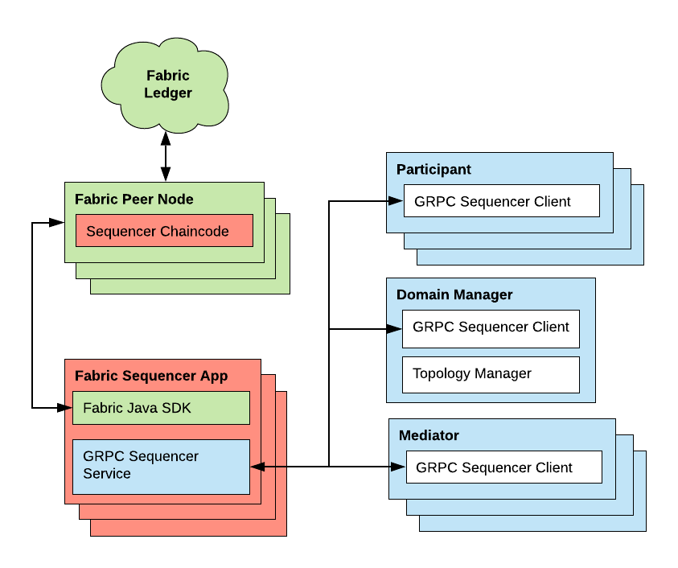

..
   Copyright (c) 2023 Digital Asset (Switzerland) GmbH and/or its affiliates.
..
   Proprietary code. All rights reserved.

Canton Synchronization Domain on Fabric
#######################################

Introduction to Hyperledger Fabric
**********************************

`Hyperledger Fabric <https://hyperledger-fabric.readthedocs.io/>`_ is an open
source enterprise-grade permissioned distributed ledger technology (DLT)
platform.

Components of the Fabric Blockchain Network
===========================================

The following key concepts of Fabric are relevant for the Canton sync domain
integration with Fabric. For further details, refer to the `Fabric documentation
<https://hyperledger-fabric.readthedocs.io/en/release-2.2/key_concepts.html>`_.

   An example Fabric blockchain network with four organizations. The ordering
   service has ordering nodes for ordering and distributing blocks on each of
   the channels defined under the ordering service. Channel A includes all four
   organizations, while channel B includes only Org 3 and Org 4. Authenticated
   client applications can send calls to their associated peers on the network.

* **Peers:** A network entity that maintains a Fabric ledger and runs chaincode
  containers in order to perform read/write operations to the Fabric ledger.
  Peers are owned and maintained by organizations.

* **Channels:** A channel is a private blockchain overlay that allows for data
  isolation and confidentiality. A channel-specific Fabric ledger is shared
  across the peers in the channel, and transacting parties must be authenticated
  to a channel in order to interact with it. Members who are not a part of the
  channel are unable to see the transactions or even know that the channel exists.

* **Ordering Service:** Also known as orderer. A defined collective of nodes
  that orders transactions into a block and then distributes blocks to connected
  peers for validation and commitment. The ordering service exists independently of
  the peer processes and orders transactions on a first-come-first-serve basis
  for all channels on the network.

* **Chaincode:** A smart contract is code – invoked by a client application
  external to the blockchain network – that manages access and modifications to
  the current Fabric ledger state via transactions. In Hyperledger Fabric, smart
  contracts are packaged as chaincode. Chaincode is installed on peers and then
  defined and used on one or more channels. An endorsement policy specifies for
  each instantiation of a chaincode which peers have to validate and endorse a
  transaction, such that the transaction is considered valid and part of the
  Fabric ledger.

* **Applications:** Client applications in a Fabric-based network interact
  with the Fabric ledger using one of the available Fabric SDKs. Applications are
  able to propose changes to the ledger as well as to query the state of the ledger
  by using an identity issued by the organization's certificate authority (CA).

Architecture
************

In the v1 architecture of the Fabric driver, only the sequencer is
integrated on top of Fabric. The other sync domain components are reused from the
relational database driver. The Fabric-based sequencer supports running in
a multi-writer, multi-reader topology for high availability, scalability, and
trust. The following diagrams show the architecture of a Fabric-based sync domain
integration.

Fabric-based Sequencer
======================

The Fabric Sequencer Application serves as an external standalone sequencer application that participants and other syn domain entities
in a Canton network connect to in order to exchange ordered messages. It is an application that runs over Fabric by a consortium of organizations.

Typically each app operates via one Fabric client that belongs to a specific organization.
These Fabric peers have visibility of the sequencer messages' metadata (sender and recipients of the messages),
however the messages' payloads are fully encrypted.

A Canton sync domain requires, besides the sequencers, one topology manager and one or more independently operated mediators.
All these nodes exclusively communicate with participants via the sequencer.

Participants trust the app they connect to and they can specify which one to connect to among the available ones.
Participants could verify that sequencer applications are reporting consistent information by connecting to many
or periodically checking other apps as they all need to report the same data.

The application supports a multi-writer, multi-reader architecture, such that multiple Fabric applications can operate on top of
the same Fabric ledger.
Sequencer clients within the participants, topology manager, or mediators will communicate with the Sequencer Fabric application
and they can read or write from any of the available sequencer apps as they will have shared view of the sequencer history for the sync domain.

Additionally, the same Fabric setup with a different channel can be used to operate different sync domains on the same Fabric infrastructure,
since each channel contains a separate isolated Fabric ledger.

Sequencer Chaincode
-------------------

The chaincode is implemented in Go. It supports:

- Registering new members with the sequencer
- Sending messages over the sequencer

  - the messages are ordered by the Fabric ordering service and we subsequently use that order to define counters and timestamps
  - if instead the order were defined in chaincode by keeping track of the last message counter, congestion would be created because the application would either have to process one message at a time or create a mechanism of batching messages to be processed in one transaction

The Sequencer Application reads all transactions created from chaincode operations and keeps its own store for a view
of the sequencer history enabling them to serve read subscriptions promptly without having to constantly query chaincode
and to restart without having to re-read all the history.

Analysis and Limitations
************************

Below is an analysis with regard to driver requirements (functional
and non-functional).

Functional Requirements
=======================

The Fabric driver must satisfy the following functional
requirements:

:ref:`Synchronization <synchronization-domain-req>`
   Fabric's ordering service establishes a total-order of transactions within a
   channel. A Canton domain is based on a single channel.

:ref:`Transparency <transparency-domain-req>`
   The Fabric blockchain ensures that all sequencer nodes obtain the same set of
   messages in the same order as established by the ordering service. The
   sequencer nodes inform their connected clients about their designated
   messages where the client is a recipient on.

:ref:`Finality <finality-domain-req>`
   Fabric's ordering service provides finality, i.e., there will be no ledger
   forks and validated transactions will never be reverted.

:ref:`Seek support for notifications <seek-support-domain-req>`
   The Fabric blockchain retains all sent messages and notifications. For
   efficiency purposes, the sequencer node caches the messages to satisfy read
   operations for a given offset without fetching the corresponding block.

Performance
===========

   The current performance we observe with the Fabric integration
   is around 15 tps of throughput and an average latency of 800ms.
   Those numbers are based on local performance tests using the Daml Ledger API
   test tool with a simple 2 organizations with 1 peer each and 1 orderer node
   topology and a 2 of 2 endorsement policy.

   Some factors that positively contribute to the current performance are:

   - Using Java for the SDK and Go for chaincode are good choices as opposed to
     something like Javascript for being compiled languages
   - We added more memory (2GB) to each peer and orderer node in our setup,
     which showed considerable performance improvement
   - The simplicity of the setup (only 2 peers, one orderer and all local)
   - Transactions are usually very small
   - Chaincode implementation is very simple
   - Some experiments were conducted with block cutting parameters such as
     max message count (max number of transactions that can exist in a block
     before a new block is cut) and batch timeout (max amount of time to wait
     before creating a block) in order to find a good balance of throughput
     and latency for our applications. A good tradeoff was found at 50 for
     max message count and 200ms for batch timeout, with an improvement for
     throughput at a slight increase in latency.
   - We are using LevelDB (instead of CouchDB).
   - We are using a round-robin load balancer when connecting to multiple sequencers
     and using the both sequencers' health and connectivity as a failover criteria.

   `This paper by IBM Research, India
   <http://www.mscs.mu.edu/~mascots/Papers/blockchain.pdf>`_ and `this article
   by IBM
   <https://www.ibm.com/blogs/blockchain/2019/01/answering-your-questions-on-hyperledger-fabric-performance-and-scale/>`_
   discuss the many factors that can influence performance.
   `This blog post <https://adlrocha.substack.com/p/adlrocha-performance-best-practices-72e>`__ also shares some Fabric performance best practices.

Reliability
===========

:ref:`Seamless fail-over for sync domain entities <fail-over-domain-req>`
   The sequencer can be deployed in a multi-writer and multi-reader topology
   (i.e. multiple sequencer nodes for the same sync domain) to achieve high
   availability. Since all Fabric sequencer nodes run on top of the same Fabric
   ledger, they will all see the same data and it does not matter which sequencer
   is being used to write to and read from.

   Additionally, the Fabric sequencer node is backed by a database that caches
   the data read from the Fabric ledger such that in case of a crash it won't
   have to read the whole blockchain again. Instead, it just needs to start
   reading the blocks from where it has last processed. The app also supports
   crash recovery.

   On the client side, round-robin load balancing is used such that if one of the
   sequencer nodes goes down or becomes unhealthy clients will not route any
   requests to this sequencer. The sequencer provides a health endpoint that is used
   by clients for this purpose. It will indicate that it is unhealthy if it loses
   connection to the Fabric ledger or to its database.

   Both the mediator and topology manager are also highly available via an active/passive mechanism (one active instance
   and 1-N passive replicas).

:ref:`Resilience to faulty sync domain behavior <resilience-domain-req>`
   Although Fabric supports pluggable consensus protocols such as crash
   fault-tolerant (CFT) or byzantine fault tolerant (BFT) protocols that enable
   the platform to be customized to fit particular use cases and trust models,
   at the moment Fabric only offers a CFT ordering service implementation based
   on the Raft protocol.

:ref:`Backups <backups-domain-req>`
   The backup procedures of the Fabric ledger must be used. The state of the
   sequencer node is just a cache and can be rehydrated from the state of the
   ledger.

:ref:`Site-wide disaster recovery <disaster-recovery-domain-req>`
   In a multi-writer, multi-reader topology, the sequencer nodes can be hosted
   by different organizations and across multiple data centers to recover from
   the failure of an entire data center.

:ref:`Resilience to erroneous behavior <resilience-participants-domain-req>`
   The Fabric sequencer node offers some resilience against an erroneous
   participant. For example, it checks that a client does not send messages
   to invalid recipients and only allows registered and authenticated clients to
   send messages. Clients are also required to sign their messages so
   sequencers can verify their origin, which prevents malicious sequencers from creating
   fake messages on behalf of specific members.

Scalability
===========

:ref:`Horizontal scalability <horizontal-scalability-domain-req>`
   Adding a sequencer to a sync domain is simply a matter of creating a new Fabric
   user and a new sequencer application with that configuration.
   A new Fabric organization and more Fabric peers could also be created, but this is optional.
   The setup scales horizontally as well as a Fabric ledger, which means performance
   could suffer if the Fabric topology is made more complex by adding peers and
   orderer nodes, especially if their latency to each other is high.
   But there are ways to make up for that such as using a simpler endorsement
   policy that does not include all organizations in the setup. That is a
   trade-off between performance and trust that needs to be defined by the
   consortium.

:ref:`Large transaction support <large-tx-domain-req>`
   Some Fabric platforms have a limit on the size of the block (commonly 99MB).
   This is therefore a hard limit that this sequencer has on the size of the
   transactions.

Security
========

:ref:`Synchronization domain entity compromise recovery <compromise-recovery-domain-req>`
   Without BFT support, a compromised orderer node cannot be recovered from
   automatically. Operational procedures, such as revoking the node's
   certificate, can limit further impact.
   Additionally, compromised peer nodes could endorse invalid transactions, but
   it would take a number of compromised peers enough to satisfy the endorsement policy
   to create incorrectly endorsed transactions on the ledger.
   All sequencer nodes must provide the same stream of messages, thus a compromised
   and malicious sequencer node can be detected if their stream differs.

:ref:`Standards compliant cryptography <standard-crypto-domain-req>`
   The sequencer node and the other sync domain entities use standard modern
   cryptography (EC-DSA with NIST curves and Ed25519 for signatures, AES128 GCM
   for symmetric encryption, SHA256 for hashes) provided by Tink/BouncyCastle.
   Fabric nodes can be deployed using cryptography provided by an `HSM
   <https://hyperledger-fabric.readthedocs.io/en/release-2.2/hsm.html>`_.

:ref:`Authentication and authorization <authnz-domain-req>`
   Authentication is implemented such that any sequencer client
   needs to be registered by the topology manager before they can connect.
   There are also authorization checks such as making sure that the declared sender
   is the currently authenticated client. Based on the type of member that is
   authenticated there are certain operations that may or may not be allowed.

:ref:`Secure channel (TLS) <secure-channel-domain-req>`
   The sequencer node provides an API secured with TLS. The Fabric network
   should be deployed according to its operations guide with TLS.

:ref:`Distributed Trust <distributed-trust-domain-req>`
   A Fabric network can be operated by multiple organizations forming a
   consortium and distributing the trust among the organizations.
   The mediator(s) and topology manager can only be operated by a single entity,
   so there is no distribution of trust for these nodes.

:ref:`Transaction Metadata Privacy <transaction-privacy-domain-req>`
   The sequencer node and the Fabric nodes (peers, orderer) learn the metadata
   of the transaction, in particular the stakeholders involved in the
   transaction.

Manageability
=============

:ref:`Garbage collection <garbage-collection-domain-req>`
   As Fabric is based on an immutable blockchain, processed sequencer messages
   cannot be removed.
   However there is a preview feature that allows messages to be removed by storing
   them in private data collections (which can be purged).

:ref:`Upgradeability <upgradeability-domain-req>`
   Upgrades of individual sync domain entities with minimal downtime not yet
   implemented.

:ref:`Semantic versioning <semantic-versioning-domain-req>`
   Canton is released under semantic versioning. The sequencer gRPC API is
   versioned with a major version number.

:ref:`Synch domain approved protocol versions <version-handshake-domain-req>`
   The authentication protocol validates the version compatibility between
   the sequencer nodes and the connecting node.

:ref:`Reuse off-the-shelf solutions <reuse-off-the-shelf-domain-req>`
   The local state of the sequencer node is stored in a relational database
   (Postgres).

:ref:`Metrics on communication and processing <metrics-domain-req>`
   Metrics are not yet fully implemented.

:ref:`Component health monitoring <health-monitoring-domain-req>`
   The sequencer node contains basic health monitoring as an admin command.
