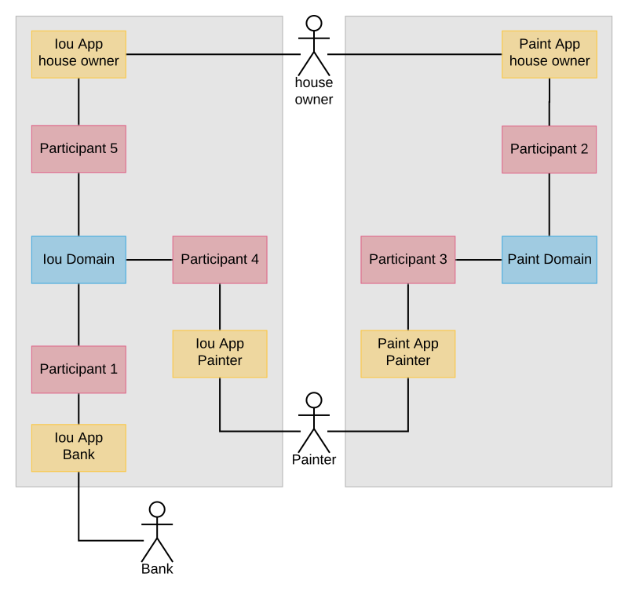

..
   Copyright (c) 2023 Digital Asset (Switzerland) GmbH and/or its affiliates.
..
   Proprietary code. All rights reserved.

.. _canton-composability:

Composability is currently an Early Access Feature in Alpha status.

.. note::
   The example in this tutorial uses unsupported Scala bindings and codegen.

Composability
=============

In this tutorial, you will learn how to build workflows that span several Canton synchronization (sync) domains.
Composability turns those several Canton sync domains into one conceptual ledger at the application level.

The tutorial assumes the following prerequisites:

- You have worked through the :ref:`Getting started <canton-getting-started>` tutorial and know how to interact with the Canton console.
- You know the Daml concepts that are covered in the `Daml introduction <https://docs.daml.com/getting-started/installation.html>`__.
- The running example uses the :ref:`ledger API <ledger-api-services>`, the Scala codegen (no longer supported by Daml) for Daml, and Canton's :ref:`identity management <identity_management_user_manual>`.
  If you want to understand the example code in full, please refer to the above documentation.

The tutorial consists of two parts:

1. The :ref:`first part <canton-composability-part1>` illustrates how to design a workflow that spans multiple sync domains.

2. The :ref:`second part <canton-composability-part2>` shows how to compose existing workflows on different sync domains into a single workflow and the benefits this brings.

The Daml models are shipped with the Canton release in the ``daml/CantonExamples`` folder in the modules ``Iou`` and ``Paint``.
The configuration and the steps are available in the ``examples/05-composability`` folder of the Canton release.
To run the workflow, start Canton from the release's root folder as follows:

.. code-block:: bash

    ./bin/canton -c examples/05-composability/composability.conf

You can copy-paste the console commands from the tutorial in the given order into the Canton console to run them interactively.
All console commands are also summarized in the bootstrap scripts ``composability1.canton``,
``composability-auto-transfer.canton``, and ``composability2.canton``.

.. note::
    Note that to use composability, we do have to turn off contract key uniqueness, as uniqueness
    cannot be provided across multiple sync domains. Therefore, composability is just a preview
    feature and explained here to demonstrate an early version of it that is not yet suitable
    for production use.

.. _canton-composability-part1:

Part 1: A multi-sync-domain workflow
------------------------------------

We consider the :ref:`paint agreement scenario <canton-run-daml-scenarios>` from the :ref:`Getting started <canton-getting-started>` tutorial.
The house owner and the painter want to enter a paint agreement that obliges the painter to paint the house owner's house.
To enter such an agreement, the house owner proposes a paint offer to the painter and the painter accepts.
Upon acceptance, the paint agreement shall be created atomically with changing the ownership of the money, which we represent by an IOU backed by the bank.

Atomicity guarantees that no party can scam the other:
The painter enters the obligation of painting the house only if house owner pays,
and the house owner pays only if the painter enters the obligation.
This avoids bad scenarios such as the following, which would have to be resolved out of band, e.g., using legal processes:

.. _canton-composability-unhappy-scenarios:

* The house owner spends the IOU on something else and does not pay the painter, even though the painter has entered the obligation to paint the house.
  The painter then needs to convince the house owner to pay with another IOU or to revoke the paint agreement.

* The house owner wires the money to the painter, but the painter refuses to enter the paint agreement.
  The house owner then begs the painter to return the money.

.. _canton-composability-topology-part1:

Setting up the topology
~~~~~~~~~~~~~~~~~~~~~~~

In this example, we assume a topology with two sync domains, ``iou`` and ``paint``.
The house owner's and the painter's participants are connected to both sync domains, as illustrated in the following diagram.

.. https://www.lucidchart.com/documents/edit/204726de-0b65-43b0-b612-646ef4b60374/0_0
.. figure:: ./images/paint-fence-single-participant-parties.svg
   :align: center

The configuration file ``composability.conf`` configures the two sync domains ``iou`` and ``paint`` and three participants.

.. literalinclude:: /canton/includes/mirrored/community/app/src/pack/examples/05-composability/composability.conf
   :language: none
   :start-after: architecture-handbook-entry-begin: topology-part1
   :end-before: architecture-handbook-entry-end: topology-part1

As the first step, some sync domain parameters are changed (setting ``transfer-exclusivity-timeout`` is explained in
the :ref:`second part <canton-automatic-transfer-in>` of this tutorial). Then, all the nodes are started and the
parties for the bank (hosted on participant 1), the house owner (hosted on participant 2), and the painter (hosted on
participant 3) are created. The details of the party onboarding are not relevant for showcasing workflows across sync domains.

.. literalinclude:: /canton/includes/mirrored/community/app/src/pack/examples/05-composability/composability1.canton
   :language: scala
   :start-after: architecture-handbook-entry-begin: topology
   :end-before: architecture-handbook-entry-end: topology

Creating the IOU and the paint offer
~~~~~~~~~~~~~~~~~~~~~~~~~~~~~~~~~~~~

To initialize the ledger, the Bank creates an IOU for the house owner and the house owner creates a paint offer for the painter.
These steps are implemented below using the Scala bindings (no longer supported by Daml) generated from the Daml model.
The generated Scala classes are distributed with the Canton release in the package ``com.digitalasset.canton.examples``.
The relevant classes are imported as follows:

.. literalinclude:: /canton/includes/mirrored/community/app/src/pack/examples/05-composability/composability1.canton
   :language: scala
   :start-after: architecture-handbook-entry-begin: imports
   :end-before: architecture-handbook-entry-end: imports

Bank creates an IOU of USD 100 for the house owner on the ``iou`` sync domain, by :ref:`submitting the command <ledger-api-transaction-service>` through the ledger API command service of participant 1.
The house owner then shares the IOU contract with the painter such that the painter can effect the ownership change when they accept the offer.
The share operation adds the painter as an observer on the IOU contract so that the painter can see the IOU contract.
Both of these commands run over the ``iou`` sync domain because the Bank's participant 1 is only connected to the ``iou`` sync domain.

.. literalinclude:: /canton/includes/mirrored/community/app/src/pack/examples/05-composability/composability1.canton
   :language: scala
   :start-after: architecture-handbook-entry-begin: iou
   :end-before: architecture-handbook-entry-end: iou

Similarly, the house owner creates a paint offer on the ``paint`` sync domain via participant 2.
In the ``ledger_api.commands.submit_flat`` command, we set the workflow id to the ``paint`` sync domain so that the participant submits the commands to this sync domain.
If no sync domain was specified, the participant automatically determines a suitable sync domain.
In this case, both sync domains are eligible because on each sync domain, every stakeholder (the house owner and the painter) is hosted on a connected participant.

.. literalinclude:: /canton/includes/mirrored/community/app/src/pack/examples/05-composability/composability1.canton
   :language: scala
   :start-after: architecture-handbook-entry-begin: paint-offer
   :end-before: architecture-handbook-entry-end: paint-offer

Contracts and Their Synchronization Domains
~~~~~~~~~~~~~~~~~~~~~~~~~~~~~~~~~~~~~~~~~~~

In Canton, each contract is only known to the participants involved in that contract. The
involved participants are the only ones that have unencrypteded copies of the contract, which they store in their respective
private contract stores. No other participant has access to that data, even in encrypted
form. The sync domain, in particular the sequencer that facilitates synchronization, will only store
encrypted messages that only the receiving participant can decrypt.

In our terminology, the assignation sync domain of a contract is the current agreement between the
stakeholders of the contract where changes to the contract are to be communicated and where
the sequence of actions on a contract is to be determined. A contract can be assigned to at
most one sync domain at any point in time.
However, the contract is never stored by the sync domain in such a way that the sync domain learns
about its existence or content.

Reassigning a contract
~~~~~~~~~~~~~~~~~~~~~~

For example, the IOU contract is assigned to the ``iou`` sync domain because it has been created by a command that was submitted to the ``iou`` sync domain.
Similarly, the paint offer is assigned to the ``paint`` sync domain.
In the current version of Canton, the execution of a transaction can only use contracts that are assigned to a single sync domain.
Therefore, before the painter can accept the offer and thereby become the owner of the IOU contract,
both contracts must be assigned to a common sync domain.

In this example, the house owner and the painter are hosted on participants that are connected to both sync domains,
whereas the Bank is only connected to the ``iou`` sync domain.
The IOU contract cannot be reassigned to the ``paint`` sync domain because all stakeholders of a contract must be connected to the contract's sync domain of assignation.
Conversely, the paint offer can be reassigned to the ``iou``sync domain, so that the painter can accept the offer on the ``iou`` sync domain.

Stakeholders can change the assigned domain of a contract using the ``transfer.execute`` command.
In the example, the painter reassigns the paint offer from the ``paint`` sync domain to the ``iou`` sync domain.

.. literalinclude:: /canton/includes/mirrored/community/app/src/pack/examples/05-composability/composability1.canton
   :language: scala
   :start-after: architecture-handbook-entry-begin: transfer
   :end-before: architecture-handbook-entry-end: transfer

The reassignment of a contract effectively changes the assigned sync domain of the contract, in other words,
the consensus among the stakeholders on which sync domain should be used to sequence actions on a contract.
The contract itself is still stored only on the involved participants.

Atomic acceptance
~~~~~~~~~~~~~~~~~

The paint offer and the IOU contract both are both assigned to the ``iou`` sync domain now.
Accordingly, the painter can complete the workflow by accepting the offer.

.. literalinclude:: /canton/includes/mirrored/community/app/src/pack/examples/05-composability/composability1.canton
   :language: scala
   :start-after: architecture-handbook-entry-begin: accept
   :end-before: architecture-handbook-entry-end: accept

This transaction executes on the ``iou`` sync domain because the input contracts (the paint offer and the IOU) are assigned there.
It atomically creates two contracts assigned to the ``iou`` sync domain: the painter's new IOU and the agreement to paint the house.
The unhappy scenarios needing out-of-band resolution are avoided.

Completing the workflow
~~~~~~~~~~~~~~~~~~~~~~~

Finally, the paint agreement can be reassigned back to the ``paint`` sync domain, where it actually belongs.

.. literalinclude:: /canton/includes/mirrored/community/app/src/pack/examples/05-composability/composability1.canton
   :language: scala
   :start-after: architecture-handbook-entry-begin: transfer-back
   :end-before: architecture-handbook-entry-end: transfer-back

Note that the painter's IOU remains on the ``iou`` sync domain.
The painter can therefore call the IOU and cash it out.

.. literalinclude:: /canton/includes/mirrored/community/app/src/pack/examples/05-composability/composability1.canton
   :language: scala
   :start-after: architecture-handbook-entry-begin: call
   :end-before: architecture-handbook-entry-end: call

Performing reassignments automatically
~~~~~~~~~~~~~~~~~~~~~~~~~~~~~~~~~~~~~~

Canton also supports automatic reassignments for commands performing transactions that use contracts assigned to several sync domains.
When such a command is submitted, Canton can automatically infer a common sync domain that the involved contracts can be reassigned to.
Once all the necessary contracts have been reassigned to the common sync domain, the transaction is performed on this single sync domain.
However, this simply performs the required reassignments followed by the transaction processing as distinct non-atomic steps.

We can therefore run the above script without specifying any reassignments at all, and relying on the automatic reassignments.
Simply delete all the reassignment commands from the example above and the example still runs successfully. A modified
version of the above example that uses automatic reassignments instead of manual reassignments is given below.

The setup code and contract creation is unchanged:

.. literalinclude:: /canton/includes/mirrored/community/app/src/pack/examples/05-composability/composability-auto-transfer.canton
   :language: scala
   :start-after: architecture-handbook-entry-begin: creation
   :end-before: architecture-handbook-entry-end: creation

In the following section, the painter accepts the paint offer. The transaction that accepts the paint offer uses two
contracts: the paint offer contract, and the IOU contract. These contracts were created on two different sync domains in the
previous step: the paint offer
contract was created on the paint sync domain, and the IOU contract was created on the IOU sync domain. The paint offer contract
must be reassigned to the IOU sync domain for the accepting transaction to be successfully applied, as was done manually in the
example above. It would not be possible to instead reassign the IOU contract to the paint sync domain because the stakeholder
Bank on the IOU contract is not represented on the paint sync domain.

When using automatic-reassignment transactions, Canton infers a suitable sync domain for the transaction and reassigns all used
contracts to this sync domain before applying the transaction. In this case, the only suitable sync domain for the painter to
accept the paint offer is the IOU sync domain. This is how the painter is able to accept the paint offer below without any
explicit reassignments being performed.

.. literalinclude:: /canton/includes/mirrored/community/app/src/pack/examples/05-composability/composability-auto-transfer.canton
   :language: scala
   :start-after: architecture-handbook-entry-begin: accept
   :end-before: architecture-handbook-entry-end: accept

The painter can then cash in the IOU. This happens exactly as before, since the IOU contract is never unassigned from the IOU sync domain.

.. literalinclude:: /canton/includes/mirrored/community/app/src/pack/examples/05-composability/composability-auto-transfer.canton
   :language: scala
   :start-after: architecture-handbook-entry-begin: cash
   :end-before: architecture-handbook-entry-end: cash

Note that towards the end of the previous example with explicit reassignments, the paint offer contract was reassigned
back to the paint sync domain. This doesn't happen in the automatic reassignment version: the paint offer is not unassigned from the IOU sync domain as part of the script shown. However, the paint offer contract is automatically reassigned back
to the paint sync domain once it is used in a transaction that must happen on the paint sync domain.

Details of the automatic-reassignment transactions
..................................................

In the previous section, the automatic-reassignment transactions were explained using an example. The details are presented
here.

The automatic-reassignment transactions enable submission of a transaction using contracts on multiple sync domains, by
reassigning contracts to a chosen target sync domain and then performing the transaction. However, using an
automatic-reassignment transaction does not provide any atomicity guarantees beyond using several primitive assignment
and unassignment operations (these operations make up the ``transfer.execute`` command, and are explained in the next section).

The sync domain for a transaction is chosen using the following criteria:

* Minimise the number of reassignments needed.

* Break ties by choosing sync domains with higher priority first.

* Break ties by choosing sync domains with alphabetically smaller sync domain IDs first.

As for ordinary transactions, you may force the choice of sync domain for an automatic-reassignment transaction by setting the
workflow ID to name of the sync domain.

The automatic-reassignment transactions are only enabled when all of the following are true:

* The local Canton console enables preview commands
  (see the :ref:`configuration <canton-composability-topology-part1>` section).

* The submitting participant is connected to all sync domains that contracts used by the transaction live on.

* All contracts used by the transaction must have at least one stakeholder that is also a transaction submitter.

Takeaways
~~~~~~~~~

* A contract is assigned to a sync domain. This means that the current agreement of the stakeholders
  is to communicate and sequence all access and changes to a given contract on a particular
  sync domain. The contract itself is only stored at the stakeholder participants.

* Stakeholders can reassign contracts from one sync domain to another using ``transfer.execute``.
  All stakeholders must be connected to the source and the target sync domain.

* You can submit transactions using contracts that reside on several sync domains. Automatic reassignments will pick a suitable
  sync domain and assign the contracts to it before performing the transaction.

.. _canton-composability-part2:

Part 2: Composing existing workflows
------------------------------------

This part shows how existing workflows can be composed even if they work on separate sync domains.
The running example is a variation of the paint example from the first part with a more complicated topology.
We therefore assume that you have gone through :ref:`the first part <canton-composability-part1>` of this tutorial.
Technically, this tutorial runs through the same steps as the first part, but more details are exposed.
The console commands assume that you start with a fresh Canton console.

Existing workflows
~~~~~~~~~~~~~~~~~~

Consider a situation where the two sync domains ``iou`` and ``paint`` have evolved separately:

- The ``iou`` sync domain for managing IOUs,

- The ``paint`` sync domain for managing paint agreements.

Accordingly, there are separate applications for managing IOUs (issuing, changing ownership, calling) and paint agreements,
and the house owner and the painter have connected their applications to different participants.
The situation is illustrated in the following picture.

.. https://www.lucidchart.com/documents/edit/4b964d51-b873-4d3f-9a03-49ed382b5a51/0_0

To enter into a paint agreement in this setting, the house owner and the painter need to perform the following steps:

1. The house owner creates a paint offer through participant 2 on the ``paint`` sync domain.

#. The painter accepts the paint offer through participant 3 on the ``paint`` sync domain.
   As a consequence, a paint agreement is created.

#. The painter sets a reminder that he needs to receive an IOU from the house owner on the ``iou`` sync domain.

#. When the house owner observes a new paint agreement through participant 2 on the ``paint`` sync domain,
   she changes the IOU ownership to the painter through participant 5 on the ``iou`` sync domain.


#. The painter observes a new IOU through participant 4 on the ``iou`` sync domain and therefore removes the reminder.

Overall, a non-trivial amount of out-of-band coordination is required
to keep the ``paint`` ledger consistent with the ``iou`` ledger.
If this coordination breaks down, the :ref:`unhappy scenarios from the first part <canton-composability-unhappy-scenarios>` can happen.

Required changes
~~~~~~~~~~~~~~~~

We now show how the house owner and the painter can avoid the need for out-of-band coordination when entering into a paint agreements.
The goal is to reuse the existing infrastructure for managing IOUs and paint agreements as much as possible.
The following changes are needed:

1. The house owner and the painter connect their participants for paint agreements to the ``iou`` sync domain:

   .. https://www.lucidchart.com/documents/edit/85b5b3d2-3b1d-43ee-8211-254cdbfb8a79/0_0
   .. figure:: ./images/paint-fence-with-transfer-house-owner.svg
      :align: center

   The :ref:`Canton configuration <canton-composability-topology-part1>` is accordingly extended with the two participants 4 and 5.
   (The connections themselves are set up in the :ref:`next section <canton-composability-topology2>`.)

   .. literalinclude:: /canton/includes/mirrored/community/app/src/pack/examples/05-composability/composability.conf
      :language: none
      :start-after: architecture-handbook-entry-begin: topology-part2
      :end-before: architecture-handbook-entry-end: topology-part2

2. They replace their Daml model for paint offers such that the house owner must specify an IOU in the offer
   and its accept choice makes the painter the new owner of the IOU.

3. They create a new application for the :ref:`paint offer-accept workflow <new-paint-offer-accept-workflow>`.

The Daml models for IOUs and paint agreements themselves remain unchanged, and so do the applications that deal with them.

.. _canton-composability-topology2:

Preparation using the existing workflows
~~~~~~~~~~~~~~~~~~~~~~~~~~~~~~~~~~~~~~~~

We extend the topology from the first part as described.
The commands are explained in detail in Canton's :ref:`identity management manual <identity_management_user_manual>`.

.. literalinclude:: /canton/includes/mirrored/community/app/src/pack/examples/05-composability/composability2.canton
   :language: scala
   :start-after: architecture-handbook-entry-begin: topology
   :end-before: architecture-handbook-entry-end: topology

As before, the Bank creates an IOU and the house owner shares it with the painter on the ``iou`` sync domain, using their existing applications for IOUs.

.. literalinclude:: /canton/includes/mirrored/community/app/src/pack/examples/05-composability/composability2.canton
   :language: scala
   :start-after: architecture-handbook-entry-begin: setup
   :end-before: architecture-handbook-entry-end: setup

.. _new-paint-offer-accept-workflow:

The paint offer-accept workflow
~~~~~~~~~~~~~~~~~~~~~~~~~~~~~~~

The new paint offer-accept workflow happens in four steps:

1. Create the offer on the ``paint`` sync domain.
#. Reassign the contract to the ``iou`` sync domain.
#. Accept the offer.
#. Reassign the paint agreement to the ``paint`` sync domain.

Making the offer
................

The house owner creates a paint offer on the ``paint`` sync domain.

.. literalinclude:: /canton/includes/mirrored/community/app/src/pack/examples/05-composability/composability2.canton
   :language: scala
   :start-after: architecture-handbook-entry-begin: paint-offer
   :end-before: architecture-handbook-entry-end: paint-offer

.. _canton-nonatomic-transfer:

Reassignments are not atomic
............................

In the first part, we have used ``transfer.execute`` to assign the offer to the ``iou`` sync domain.
Now, we look a bit behind the scenes.
A contract reassignment happens in two atomic steps: unassignment and assignment.
``transfer.execute`` is merely a shorthand for the two steps.
In particular, ``transfer.execute`` is not an atomic operation like other ledger commands.

During an unassignment, the contract is deactivated on the source sync domain, in this case the ``paint`` sync domain.
Any stakeholder whose participant is connected to the source sync domain and the target sync domain can initiate an unassignment.
The ``transfer.out`` command returns a reassignment Id.

.. literalinclude:: /canton/includes/mirrored/community/app/src/pack/examples/05-composability/composability2.canton
   :language: scala
   :start-after: architecture-handbook-entry-begin: transfer-out
   :end-before: architecture-handbook-entry-end: transfer-out

The ``transfer.in`` command consumes the reassignment Id and assigns the contract to the target sync domain.

.. literalinclude:: /canton/includes/mirrored/community/app/src/pack/examples/05-composability/composability2.canton
   :language: scala
   :start-after: architecture-handbook-entry-begin: transfer-in
   :end-before: architecture-handbook-entry-end: transfer-in

Between the unassignment and the assignment, the contract is not assigned to any sync domain and cannot be used by commands.
We say that the contract is in transit.

Accepting the paint offer
.........................

The painter accepts the offer, as before.

.. literalinclude:: /canton/includes/mirrored/community/app/src/pack/examples/05-composability/composability2.canton
   :language: scala
   :start-after: architecture-handbook-entry-begin: accept
   :end-before: architecture-handbook-entry-end: accept

.. _canton-automatic-transfer-in:

Automatic assignment
....................

Finally, the paint agreement is assigned back to the ``paint`` sync domain such that the existing infrastructure around paint agreements can work unchanged.

.. literalinclude:: /canton/includes/mirrored/community/app/src/pack/examples/05-composability/composability2.canton
   :language: scala
   :start-after: architecture-handbook-entry-begin: automatic-transfer-in
   :end-before: architecture-handbook-entry-end: automatic-transfer-in

Here, there is only a ``transfer.out`` command but no ``transfer.in`` command.
This is because the participants of contract stakeholders automatically try to assign the contract to the target sync domain so that the contract becomes usable again.
The sync domain parameter ``transfer-exclusivity-timeout`` on the target sync domain specifies how long they wait before they attempt to do so.
Before the timeout, only the initiator of the reassignment is allowed to assign the contract.
This reduces contention for contracts with many stakeholders, as the initiator normally completes the reassignment before all other stakeholders simultaneously attempt to assign the contract.
On the ``paint`` sync domain, this timeout is set to two seconds in the :ref:`configuration <canton-composability-topology-part1>` file.
Therefore, the ``utils.retry_until_true`` normally succeeds within the allotted ten seconds.

Setting the ``transfer-exclusivity-timeout`` to 0 as on the ``iou`` sync domain disables automatic assignment.
This is why the above reassignment of the paint offer had to be completed manually.
Manual completion is also needed if the automatic assignment fails, e.g., due to timeouts on the target sync domain.
Automatic assignment therefore is a safety net that reduces the risk that the contract gets stuck in transit.

Continuing the existing workflows
~~~~~~~~~~~~~~~~~~~~~~~~~~~~~~~~~

The painter now owns an IOU assigned to the ``iou`` sync domain and the entered paint agreement is assigned to the ``paint`` sync domain.
Accordingly, the existing workflows for IOUs and paint agreements can be used unchanged.
For example, the painter can call the IOU.

.. literalinclude:: /canton/includes/mirrored/community/app/src/pack/examples/05-composability/composability2.canton
   :language: scala
   :start-after: architecture-handbook-entry-begin: call
   :end-before: architecture-handbook-entry-end: call

Takeaways
~~~~~~~~~

* Contract reassignments take two atomic steps: unassgnment and assigment.
  While the contract is being reassigned, the contract is not assigned to any sync domain.

* Assignment happens under normal circumstances automatically after the ``transfer-exclusivity-timeout`` configured on the target sync domain.
  A timeout of 0 turns off automatic assignment.
  If the automatic assignment does not complete, the contract can be assigned manually.
