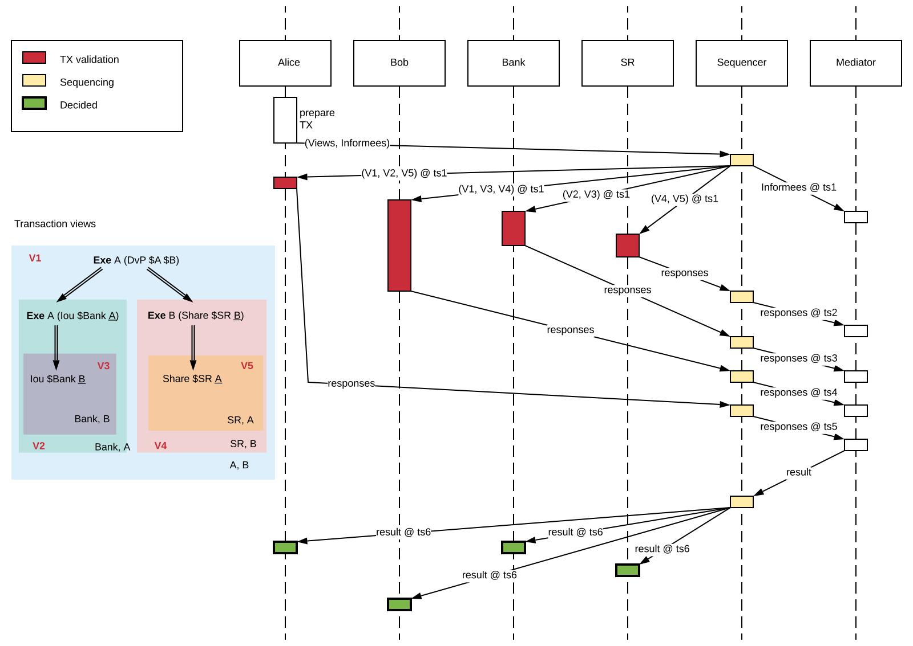
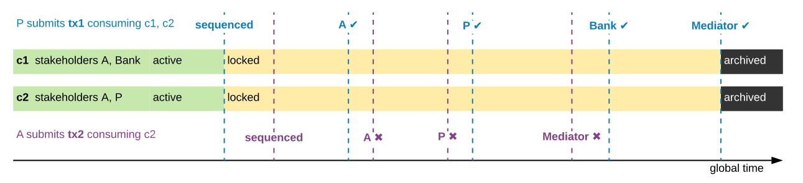
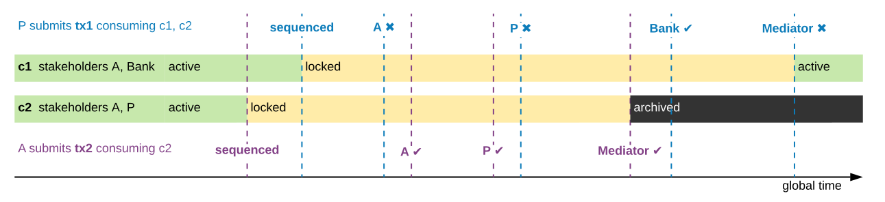
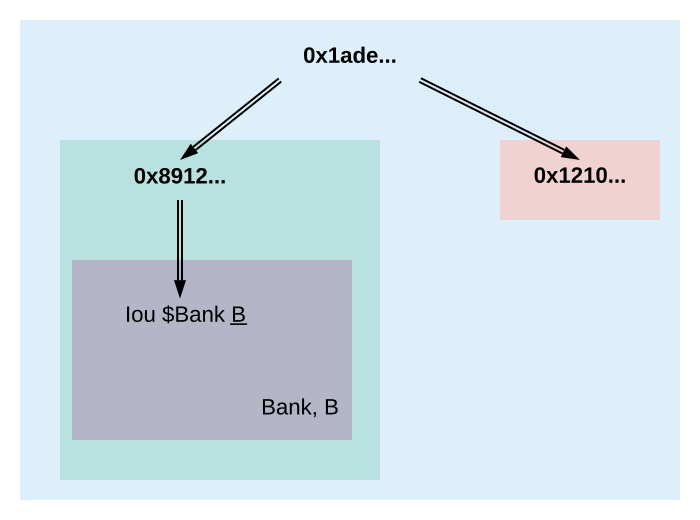
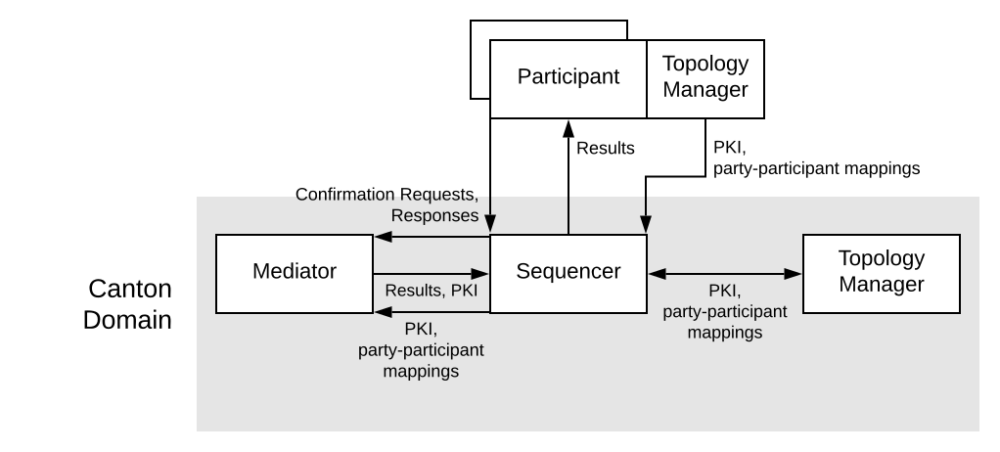
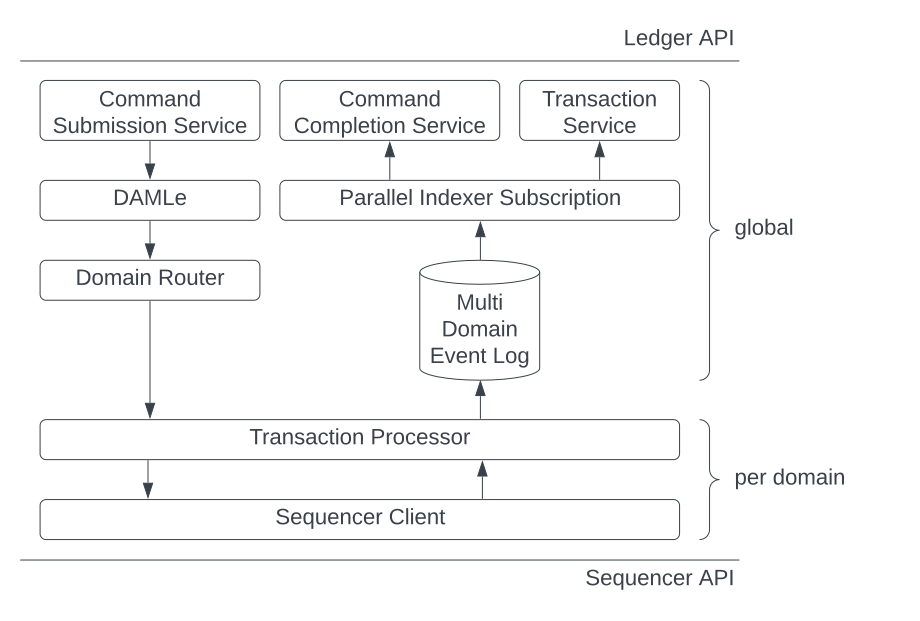

..
   Copyright (c) 2023 Digital Asset (Switzerland) GmbH and/or its affiliates.
..
   Proprietary code. All rights reserved.

.. _canton-overview:

Overview and Assumptions
========================

In this section, we provide an overview of the Canton architecture,
illustrate the high-level flows, entities (defining trust domains) and
components. We then state the trust assumptions we make on the
different entities, and the assumptions on communication links.

Canton is designed to fulfill its :ref:`high-level requirements <requirements>.` Before reading this section, you should be
familiar with the Daml language and the :ref:`hierarchical transactions <actions-and-transactions>` of the
DA ledger model.

Canton 101
----------

A Basic Example
~~~~~~~~~~~~~~~

We will use a simple delivery-versus-payment (DvP) example to provide
some background on how Canton works. Alice and Bob want to exchange an IOU given
to Alice by a bank for some shares that Bob owns. We have four parties: Alice (aka A),
Bob (aka B), a Bank and a share registry SR. There are also three types of contracts:

1. an Iou contract, always with Bank as the backer
2. a Share contract, always with SR as the registry
3. a DvP contract between Alice and Bob

Assume that Alice has a “swap” choice on a DvP contract instance that
exchanges an Iou she owns for a Share that Bob has. We assume that the
Iou and Share contract instances have already been allocated in the DvP.
Alice wishes to commit a transaction executing this swap choice; the
transaction has the following structure:

.. _101-dvp-example:

.. https://www.lucidchart.com/documents/edit/cce89180-8f78-43d0-8889-799345615b7b/0

.. _canton-overview-tx-processing:

Transaction Processing in Canton
~~~~~~~~~~~~~~~~~~~~~~~~~~~~~~~~

In Canton, committing the example transaction consists of two steps:

.. _canton-overview-confirmation-request:

1. Alice's participant prepares a **confirmation request** for the
   transaction. The request provides different views on the transaction;
   participants see only the subtransactions exercising, fetching or creating
   contracts on which their parties are stakeholders (more precisely, the subtransactions where these parties are :ref:`informees
   <def-informee>`).
   The views for the
   DvP, and their recipients, are shown in the figure below. Alice's
   participant submits the request to a **sequencer**, who orders all
   confirmation requests on a Canton domain; whenever two participants see the
   same two requests, they will see them according to this sequencer order.
   The sequencer has only two functions: ordering messages and
   delivering them to their stated recipients. The message contents are
   encrypted and not visible to the sequencer.

   .. _101-dvp-views:

   .. https://www.lucidchart.com/documents/edit/71ad7a3e-9f64-4b75-9267-d34040273a23/0
   .. figure:: ./images/overview/dvp-transaction-view.svg
      :align: center
      :width: 80%

      Views in the transaction; each box represents a transaction part
      visible to the participants in its bottom-right corner. A
      participant might receive several views, some of
      which can be nested.

.. _canton-overview-confirmation-response:

2. The recipients then check the validity of the views that they receive.
   The validity checks cover four aspects:

   1. validity as :ref:`defined <da-model-validity>` in the DA ledger
      model: :ref:`consistency <da-model-consistency>`, (mainly: no
      double spends), :ref:`conformance <da-model-conformance>` (the
      view is a result of a valid Daml interpretation) and
      :ref:`authorization <da-model-authorization>` (guaranteeing that
      the actors and submitters are allowed to perform the view's action)

   2. authenticity (guaranteeing that the submitters are
      who they claim to be).

   3. transparency (guaranteeing that participants who should be
      notified get notified).

   4. consensus (guaranteeing that participants commit projections of the same transaction)

   Conformance, authorization, authenticity, transparency, and consensus problems arise only due to submitter malice.
   Consistency problems can arise with no malice. For example, the Iou
   that is to be transferred to Bob might simply have already been spent.
   Based on the check's result, a subset of recipients
   called **confirming participants** then prepares a (positive or negative)
   **mediator response** for each view separately. A **confirmation policy**
   associated with the request specifies which participants must confirm,
   given the transaction's informees.

   The confirming participants send their responses to a **mediator**,
   another special entity that aggregates the responses into a single verdict
   for the entire confirmation request. The mediator
   serves to hide the participants' identities from each other (so
   that Bank and SR do not need to know that they are part of the same transaction).
   Like the sequencer, the mediator does not learn the transactions'
   contents. Instead, Alice's participant, in addition to sending the request, also simultaneously notifies the mediator
   about the informees of each view.
   The mediator receives a version of the transaction
   where only the informees of a view are visible and the contents blinded,
   as conceptually visualized in the diagram below.

   .. https://www.lucidchart.com/documents/edit/4ca4e813-2632-4f89-931d-75f24c61622e
   .. figure:: ./images/overview/dvp-stakeholder-tree.svg
      :align: center
      :width: 80%

      In the informee tree for the mediator, all transaction contents are blinded.

   From this, the mediator
   derives which (positive) mediator responses are necessary
   in order to decide the confirmation request as **approved**.

   Requests submitted by malicious participants can contain bogus views.
   As participants can see only parts of requests (due to privacy reasons),
   upon receiving an approval for a request, each participant locally
   filters out the bogus views that are visible to it, and
   **accepts** all remaining valid views of an approved confirmation request.
   Under the confirmation policy's trust assumptions, the
   protocol ensures that the local decisions of honest participants
   match for all views that they jointly see. The protocol thus provides
   a virtual shared ledger between the participants, whose transactions consist
   of such valid views.
   Once approved, the accepted views are **final**, i.e., they will
   never be removed from the participants' records or the virtual ledger.

We can represent the confirmation workflow described above by the
following message sequence diagram, assuming that each party in the
example runs their own participant node.

.. _101-tx-message-diagram:

.. https://www.lucidchart.com/documents/edit/4fe4d12c-44f7-4752-86fd-704c3307150a

The sequencer and the mediator, together with a so-called **topology manager** (described shortly), constitute a
**Canton domain**.
All messages within the domain are exchanged over the sequencer,
which ensures a **total order** between all messages exchanged within a
domain.

The total ordering ensures that participants see all confirmation
requests and responses in the same order.
The Canton protocol additionally ensures that all non-Byzantine (i.e. not malicious or
compromised) participants see their
shared views (such as the exercise of the Iou transfer, shared between
the participants of Bank and A) in the same order, even with Byzantine
submitters.
This has the following implications:

#. The correct mediator response for each view is always uniquely determined,
   because Daml is deterministic.
   However, for performance reasons, we allow occasional incorrect negative responses,
   when participants start behaving in a Byzantine fashion or under contention.
   The system provides the honest participants with evidence of
   either the correctness of their responses or the reason for
   the incorrect rejections.

#. The global ordering creates a (virtual) **global time** within a domain, measured at the sequencer;
   participants learn that time has progressed
   whenever they receive a message from the sequencer.
   This global time is used for detecting and resolving conflicts and determining when timeouts occur.
   Conceptually, we can therefore speak of a step happening at several participants simultaneously with respect to this global time,
   although each participant performs this step at a different physical time.
   For example, in the above :ref:`message sequence diagram <canton-core-message-sequence-tx-diagram>`,
   Alice, Bob, the Bank, and the share registry's participants receive the confirmation request at different physical times,
   but conceptually this happens at the timestamp `ts1` of the global time,
   and similarly for the result message at timestamp `ts6`.

In this document, we focus on the basic version of Canton, with just a single domain.
Canton also supports connecting a participant to multiple domains and transferring contracts between domains (see :ref:`composability <canton-composability>`).

As mentioned in the introduction, the main challenges for Canton are reconciling
integrity and privacy concerns while ensuring progress with the
confirmation-based design, given that parties might be overloaded,
offline, or simply refusing to respond. The main ways we cope with this
problem are as follows:

- We use timeouts: if a transaction’s validity cannot be determined
  after a timeout (which is a domain-wide parameter),
  the transaction is rejected.

.. - If a confirmation request times out,
  the system informs the participant submitting the request on which participants have failed to send a
  mediator response.
  This allows the submitting participant to take out of band actions against misbehaviour.

- Flexible confirmation policies:
  To offer a trade-off between trust, integrity, and liveness, we
  allow Canton domains to choose their *confirmation policies*.
  Confirmation policies specify which participants need to confirm
  which views.
  This enables the mediator to determine the sufficient conditions to declare a request
  approved. Of particular interest is the
  *VIP confirmation policy*, applicable to transactions which involve
  a trusted (VIP) party as an informee on every action. An example
  of a VIP party is a market operator.
  The policy ensures ledger validity
  assuming the VIP party's participants behave correctly; incorrect behavior can still be
  detected and proven in this case, but the fallout must be
  handled outside of the system.
  Another important policy is the signatory confirmation policy, in which all
  signatories and actors are required to confirm. This requires a lower level of trust compared to the
  VIP confirmation policy sacrificing liveness when participants hosting
  signatories or actors are unresponsive.
  Another policy is
  the *full confirmation policy*, in which all informees are required
  to confirm. This requires the lowest level of trust, but sacrifices
  liveness when some of the involved participants are unresponsive.

.. _conflict-detection-overview:

Conflict Detection
~~~~~~~~~~~~~~~~~~

Participants detect conflicts between concurrent transactions by locking the contracts that a transaction consumes.
The participant locks a contract when it validates the confirmation request of a transaction that archives the contract.
The lock indicates that the contract might be archived.
When the mediator's decision arrives later, the contract is either archived or unlocked,
depending on whether the transaction is committed or rolled back.
Transactions that attempt to use a locked (i.e., potentially archived) contract are rejected.
This design decision is based on the assumption that transactions are typically accepted;
the later conflicting transaction can therefore be pessimistically rejected.

The next three diagrams illustrate locking and pessimistic rejections
using the :ref:`counteroffer <counteroffer-acceptance>` example from the DA ledger model.
There are two transactions and three parties and every party runs their own participant node.

* The painter `P` accepts `A`\ 's `Counteroffer` in transaction `tx1`.
  This transaction consumes two contracts:

  - The Iou between `A` and the `Bank`, referred to as `c1`.

  - The `Counteroffer` with stakeholders `A` and `P`, referred to as `c2`.

  The created contracts (the new Iou and the `PaintAgree`\ ment) are irrelevant for this example.

* Suppose that the `Counteroffer` contains an additional consuming choice controlled by `A`, e.g., Alice can retract her `Counteroffer`.
  In transaction `tx2`, `A` exercises this choice to consume the `Counteroffer` `c2`.

Since the messages from the sequencer synchronize all participants on the (virtual) global time,
we may think of all participants performing the locking, unlocking, and archiving simultaneously.

In the first diagram, the sequencer sequences `tx1` before `tx2`.
Consequently, `A` and the `Bank` lock `c1` when they receive the confirmation request,
and so do `A` and `P` for `c2`.
So when `tx2` later arrives at `A` and `P`, the contract `c2` is locked.
Thus, `A` and `P` respond with a rejection and the mediator follows suit.
In contrast, all stakeholders approve `tx1`;
when the mediator's approval arrives at the participants, each participant archives the appropriate contracts:
`A` archives `c1` and `c2`, the `Bank` archives `c1`, and `P` archives `c2`.

.. https://www.lucidchart.com/documents/edit/327e02c7-4f72-4135-9100-f3787389fd42

   When two transactions conflict while they are in flight, the later transaction is always rejected.

The second diagram shows the scenario where `A`\ 's retraction is sequenced before `P`\ 's acceptance of the `Counteroffer`.
So `A` and `P` lock `c2` when they receive the confirmation request for `tx2` from the sequencer and later approve it.
For `tx1`, `A` and `P` notice that `c2` is possibly archived and therefore reject `tx1`, whereas everything looks fine for the `Bank`.
Consequently, the `Bank` and, for consistency, `A` lock `c1` until the mediator sends the rejection for `tx1`.

.. https://www.lucidchart.com/documents/edit/b4e21ea2-bd67-438e-aedd-d54b79496a30

   Transaction `tx2` is now submitted before `tx1`.
   The consumed contract `c1` remains locked by the rejected transaction
   until the mediator sends the result message.

.. note::
   In reality, participants approve each view individually rather than the transaction as a whole.
   So `A` sends two responses for `tx1`:
   An approval for `c1`\ 's archival and a rejection for `c2`\ 's archival.
   The diagrams omit this technicality.

The third diagram shows how locking and pessimistic rejections can lead to unnecessary rejections.
Now, the painter's acceptance of `tx1` is sequenced before Alice's retraction like in the :ref:`first diagram <pessimistically-rejected-conflict1>`,
but the Iou between `A` and the `Bank` has already been archived earlier.
The painter receives only the view for `c2`, since `P` is not a stakeholder of the Iou `c1`.
Since everything looks fine, `P` locks `c2` when the confirmation request for `tx1` arrives.
For consistency, `A` does the same, although `A` already knows that the transaction will fail because `c1` is archived.
Hence, both `P` and `A` reject `tx2` because it tries to consume the locked contract `c2`.
Later, when `tx1`\ 's rejection arrives, `c2` becomes active again, but the transaction `tx2` remains rejected.

.. https://www.lucidchart.com/documents/edit/8f5ea302-9cb7-4ea2-a2f7-8f0e02fab63d
.. figure:: ./images/overview/pessimistically-rejected-conflict3.svg
   :align: center

   Even if the earlier transaction `tx1` is rejected later,
   the later conflicting transaction `tx2` remains rejected and
   the contract remains locked until the result message.

.. _time-in-canton:

Time in Canton
~~~~~~~~~~~~~~

The connection between time in Daml transactions and the time defined in Canton is
explained in the respective `ledger model section on time <https://docs.daml.com/concepts/time.html#time>`__.

The respective section introduces `ledger time` and `record time`. The `ledger time` is the
time the participant (or the application) chooses when computing the transaction prior
to submission. We need the participant to choose this time as the transaction is pre-computed
by the submitting participant and this transaction depends on the chosen time. The `record time`
is assigned by the sequencer when registering the confirmation request (initial submission
of the transaction).

There is only a bounded relationship between these times, ensuring that the `ledger time` must be
in a pre-defined bound around the `record time`. The tolerance is defined on the domain
as a domain parameter, known to all participants:

.. code-block:: bash

   canton.domains.mydomain.parameters.ledger-time-record-time-tolerance

The bounds are symmetric in Canton, so the Canton domain parameter ``ledger-time-record-time-tolerance`` equals
the ``skew_min`` and ``skew_max`` parameters from the ledger model.

.. note::

   Canton does not support querying the time model parameters via the ledger API, as the time model is
   a per domain property and this cannot be properly exposed on the respective ledger API endpoint.

Checking that the `record time` is within the required bounds is done by the validating participants
and is visible to everyone. The sequencer does not know the `ledger time` and therefore cannot perform
this validation.

Therefore, a submitting participant cannot control the output of a transaction depending on `record time`,
as the submitting participant does not know exactly the point in time when the transaction will be timestamped
by the sequencer. But the participant can guarantee that a transaction will either be registered before a
certain record time, or the transaction will fail.

.. _canton-overview-subtx-privacy:

Subtransaction privacy
~~~~~~~~~~~~~~~~~~~~~~

Canton splits a Daml transaction into views, as described above under :ref:`transaction processing <canton-overview-tx-processing>`.
The submitting participant sends these views via the domain's sequencer to all involved participants on a need-to-know basis.
This section explains how the views are encrypted, distributed, and stored
so that only the intended recipients learn the contents of the transaction.

In the :ref:`above DvP example <101-dvp-views>`, Canton creates a view for each node, as indicated by the boxes with the different colors.
Canton captures this hierarchical view structure in a Merkle-like tree.
For example, the view for exercising the "xfer" choice conceptually looks as follows,
where the hashes ``0x...`` commit to the contents of the hidden nodes and subtrees without revealing the content.
In particular, the second leg's structure, contents, and recipients are completely hidden in the hash ``0x1210...``.

.. https://lucid.app/lucidchart/5c1b9550-6cf6-45d5-8892-5ffd9c6fab9f/edit
.. figure:: ./images/overview/dvp-bank-transfer-view.svg
   :align: center
   :width: 80%

   Idealized Merkle tree for the view that exercises the "xfer" choice on Alice's Iou.

The subview that creates the transferred Iou has a similar structure,
except that the hash ``0x738f...`` is now unblinded into the view content and the parent view's **Exercise** action is represented by its hash ``0x8912...``

   Idealized Merkle tree for the view that creates Bob's new Iou.

Using the hashes, every recipient can correctly reconstruct their projection of the transaction from the views they receive.

As illustrated in the :ref:`confirmation workflow <101-tx-message-diagram>`, the submitting participant sends the views to the participants hosting an informee or witness of a view's actions.
This ensures **subtransaction privacy** as a participant receives only the data for the witnesses it hosts, not all of the transaction.
Each Canton participant persists all messages it receives from the sequencer, including the views.

Moreover, Canton hides the transaction contents from the domain too.
To that end, the submitting participant encrypts the views using the following hybrid encryption scheme:

#. It generates cryptographic randomness for the transaction, the transaction seed.
   From the transaction seed, a view seed is derived for each view following the hierarchical view structure, using a pseudo-random function.
   In the DvP example, a view seed `seed`:sub:`0` for the action at the top is derived from the transaction seed.
   The seed `seed`:sub:`1` for the view that exercises the "xfer" choice is derived from the parent view's seed `seed`:sub:`0`,
   and similarly the seed `seed`:sub:`2` for the view that creates Bob's IOU is derived from `seed`:sub:`1`.

#. For each view, it derives a symmetric encryption key from the view seed using a key derivation function.
   For example, the symmetric key for the view that creates Bob's IOU is derived from `seed`:sub:`2`.
   Since the transaction seed is fresh for every submission and all derivations are cryptographically secure,
   each such symmetric key is used only once.

#. It encrypts the serialization of each view's Merkle tree with the symmetric key derived for this view.
   The view seed itself is encrypted with the public key of each participant hosting an informee of the view.
   The encrypted Merkle tree and the encryptions of the view seed form the data that is sent via the sequencer to the recipients.

   .. note::
      The view seed is encrypted only with the public key of the participants that host an informee,
      while the encrypted Merkle tree itself is also sent to participants hosting only witnesses.
      The latter participants can nevertheless decrypt the Merkle tree because they receive the view seed of a parent view and can derive the symmetric key of the witnessed view using the derivation functions.

Even though the sequencer persists the encrypted views for a limited period,
the domain cannot access the symmetric keys unless it knows the secret key of one of the informee participants.
Therefore, the transaction contents remain confidential with respect to the domain.

Domain Entities
---------------

A Canton domain consists of three entities:

- the sequencer
- the mediator
- and the **topology manager**, providing a PKI infrastructure, and party
  to participant mappings.

We call these the **domain entities**. The high-level communication
channels between the domain entities are depicted below.

.. https://www.lucidchart.com/documents/edit/b22cd15e-496e-41cb-8013-89fd1f42ab34

In general, every domain entity can run in a separate trust domain
(i.e., can be operated by an independent organization). In practice,
we assume that all domain entities are run by a single organization,
and that the domain entities belong to a single trust domain.

Furthermore, each participant node runs in its own trust domain.
Additionally, the participant may outsource a part of its identity management infrastructure, for example to a
certificate authority.
We assume that the participant trusts this infrastructure, that is, that the participant and its identity management belong
to the same trust domain.
Some participant nodes can be designated as **VIP nodes**, meaning
that they are operated by trusted organizations. Such nodes are important
for the VIP confirmation policy.

The generic term **member** will refer to either a domain entity or a participant node.

.. _sequencer-overview:

Sequencer
~~~~~~~~~~~~~~

We now list the high-level requirements on the sequencer.

**Ordering:** The sequencer provides a `global total-order
multicast <http://citeseerx.ist.psu.edu/viewdoc/download?doi=10.1.1.85.3282&rep=rep1&type=pdf>`__
where envelopes are uniquely time-stamped and the global ordering is
derived from the timestamps. Instead of delivering a single envelope, the
sequencer provides batching, that is, a
list of individual envelopes are submitted. All these envelopes get the
timestamp of the batch they are contained in. Each envelope may
have a different set of recipients; the envelopes in each recipient's batch
are in the same order as in the sent batch.

**Evidence:** The sequencer provides the recipients with a
cryptographic proof of authenticity for every batch it
delivers, including evidence on the order of envelopes.

**Sender and Recipient Privacy:** The recipients
do not learn the identity of the submitting participant.
A recipient only learns the identities of recipients
on a particular envelope from a batch if it is itself a recipient of that
envelope.

.. note:: In the implementation, the recipients of an envelope are not a set of members (as indicated above),
   but a forest of sets of members.
   A member receives an envelope if it appears somewhere in the recipient forest.
   A member sees the nodes of the forest that contain itself as a recipient as well as all descendants of such nodes;
   but it does not see the ancestors of such nodes.
   This feature is used to support bcc-style addressing of envelopes.

Mediator
~~~~~~~~

The mediator's purpose is to compute the final result for a
confirmation request and distribute it to the participants,
ensuring that transactions are atomically committed across
participants, while preserving the participants' privacy,
by not revealing their identities to each other.
At a high level, the mediator:

- collects mediator responses from participants,
- validates them according to the Canton protocol,
- computes the mediator verdict (approve / reject / timed out) according to the confirmation policy, and
- sends the result message.

Additionally, for auditability the mediator persists every finalized request
together with its verdict in a long term storage
and allows an auditor to retrieve messages from this storage.

.. _overview-identity-manager:

Topology Manager
~~~~~~~~~~~~~~~~

The topology manager allows participants to join and leave
the Canton domain, and to register, revoke and rotate public keys.
It knows the parties **hosted** by a given participant. It
defines the **trust level** of each participant. The trust level is
either **ordinary** or **VIP**.
A VIP trust level indicates that the participant is trusted to act honestly.
A canonical example is a participant run by a trusted market operator.

Participant-internal Canton Components
--------------------------------------

The below diagram shows the main components of a participant.

.. https://lucid.app/lucidchart/effe03fe-e952-49e2-abc7-ac7a4cc56211/edit?page=0_0&invitationId=inv_f3433f52-c2ec-4854-9b36-58942657f191#

A ledger application uses the ledger API (at the top of the diagram) to send commands to a participant and
to receive the corresponding events.
The command submission service receives a command, parses it, and performs some basic validation.
Next, the command is submitted to DAMLe (DAML engine), which translates it to a transaction;
a command consists only of a root node whereas a transaction also recursively contains all consequences of all exercise actions.
Then, the domain router chooses a domain that is suitable for executing the transaction.

The transaction processor translates the transaction to a confirmation request;
in particular, it computes the view decomposition, embeds the transaction into a Merkle tree, and
creates different envelopes tailored to the different members validating the request.
It uses the sequencer client to send the confirmation request to the mediator and all participants involved in the transaction.

The transaction processor also uses the sequencer client to receive confirmation requests from the domain,
to send mediator responses, and to receive the result messages from the mediator.

The multi domain event log stores for every request if has been committed vs. rolled back.
It also stores an order on the events coming from the domains the participant is connected to.
The parallel indexer subscription reads events from the multi domain event log and stores them in a format that is optimized for fast read access.
The command completion service allows ledger applications to read the completions corresponding to the commands it has previously submitted.
The transaction service provides a stream of all transactions that have been committed to the virtual shared ledger and are visible to the participant.

.. _system-model-and-trust-assumptions:

Trust Assumptions
----------------------------------

The different sets of rules that Canton domains specify affect the
security and liveness properties in different ways. In this section,
we summarize the system model that we assume, as well as the trust
assumptions.
As specified in the :ref:`high-level requirements <requirements-functional>`, the system provides guarantees only to
honestly represented parties.
Hence, every party must fully trust its
participant (but no other participants) to execute the protocol correctly. In particular, signatures by participant
nodes may be deemed as evidence of the party's action in the transaction protocol.

.. _trust-assumptions:

General Trust Assumptions
~~~~~~~~~~~~~~~~~~~~~~~~~

These assumptions are relevant for all system properties, except for privacy.

- The sequencer is trusted to correctly provide a global
  total-order multicast service, with evidence and ensuring the sender
  and recipient privacy.

- The mediator is trusted to produce and distribute all results correctly.

- The domain topology manager (including the underlying public key
  infrastructure, if any) is operating correctly.

When a transaction is submitted with the VIP confirmation policy (in
which case every action in the transaction must have at least one VIP
informee), there exist an additional integrity assumption:

- All VIP stakeholders must be hosted by honest
  participants, i.e., participants that run the transaction protocol
  correctly.

We note that the assumptions can be weakened by replicating the
trusted entities among multiple organization with a Byzantine fault
tolerant replication protocol, if the assumptions are deemed too strong.
Furthermore, we believe that with some
extensions to the protocol we can make the violations of one of the above
assumptions detectable by at least one participant in most cases, and
often also provable to other participants or external entities.  This
would require direct communication between the participants,
which we leave as future work.

Assumptions Relevant for Privacy
~~~~~~~~~~~~~~~~~~~~~~~~~~~~~~~~

The following common assumptions are relevant for privacy:

-  The private keys of honest participants are not compromised, and all certificate authorities that the honest participants use are trusted.

-  The sequencer is privy to:

   #. the submitters and recipients of all messages

   #. the view structure of a transaction in a confirmation request,
      including informees and confirming parties

   #. the confirmation responses (approve / reject / ill-formed) of confirmers.

   #. encrypted transaction views

   #. timestamps of all messages

-  The sequencer is trusted with not storing messages for longer than necessary for operational procedures
   (e.g., delivering messages to offline parties or for crash recovery).

-  The mediator is privy to:

   #. the view structure of a transaction including informees and
      confirming parties, and the submitting party

   #. the confirmation responses (approve / reject / ill-formed) of confirmers

   #. timestamps of messages

-  The informees of a view are trusted with not
   violating the privacy of the other stakeholders in that same part.
   In particular, the submitter is trusted with choosing strong randomness
   for transaction and contract IDs. Note that this assumption is not relevant
   for integrity, as Canton ensures the uniqueness of these IDs.

When a transaction is submitted with the VIP confirmation policy,
every action in the transaction must have at least one VIP
informee. Thus, the VIP informees of the root actions are automatically privy
to the entire contents of the transaction, according to the
:ref:`ledger privacy model <da-model-privacy>`.

Assumptions Relevant for Liveness
~~~~~~~~~~~~~~~~~~~~~~~~~~~~~~~~~

In addition to the general trust assumptions, the following additional assumptions are relevant for liveness and bounded
liveness functional requirements on the system: bounded decision
time, and no unnecessary rejections:

- All the domain entities in Canton (the sequencer, the mediator,
  and the topology manager) are highly available.

- The sequencer is trusted to deliver the messages timely and fairly.

- Participants hosting confirming parties according to the confirmation policy are
  assumed to be highly available and responding correctly.
  For example in the VIP confirmation policy, only the VIP participant needs to be
  available whereas in the signatory policy, liveness depends on the
  availability of all participants that host signatories and actors.

