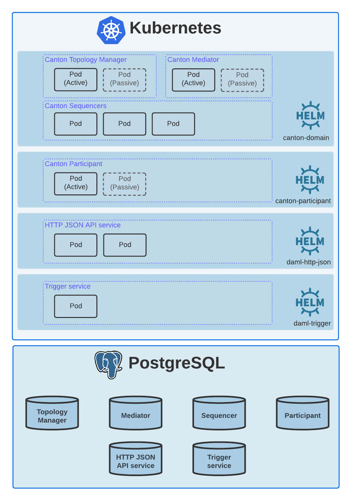

.. Copyright (c) 2023 Digital Asset (Switzerland) GmbH and/or its affiliates. All rights reserved.
.. SPDX-License-Identifier: Apache-2.0

Deploy on Kubernetes
####################

Audience
********

This content is targeted primarily for individuals with the following skills & experience:

* Basic hands-on experience with deploying and managing applications running on `Kubernetes <https://kubernetes.io/>`_.
* Deploying applications packaged as `Helm charts <https://helm.sh/>`_.
* Strong understanding of operational concepts of the chosen cloud provider, particularly monitoring and observability.
* Basic know-how of deployment and configuration of the chosen cloud provider's components to adhere to tight security requirements, including setting up an IDP provider (Auth0, Azure AD, etc.), certificate issuer (GCP CA Service, AWS Private CA, etc.).

Content Covered
***************

This section describes the objectives and target deployment for this guide.

Objectives
==========

* Describe what cloud resources are required and how to configure them.
* Describe how to set up your Kubernetes cluster.
* Walk through the steps required for deploying all Daml Enterprise components on a Kubernetes cluster using either Helm, Helmfile or Argo CD.
* Provide automation for provisioning cloud resources via `Terraform <https://www.terraform.io/>`_ code.

.. _target-deployment:

Target Deployment
=================

In this document we target the following Daml Enterprise deployment on a Kubernetes cluster.

.. note::
   we are targeting a highly available, production-ready deployment. Such a deployment may have costs associated with it, depending on your cloud provider. In case you need a solution for local development only, please follow the `Getting Started with Daml <https://docs.daml.com/getting-started/index.html>`_ guide instead.

For an overview of the Daml Enterprise architecture see `here <https://docs.daml.com/canton/about.html>`_.

* `Canton Domain <https://docs.daml.com/canton/architecture/overview.html#domain-entities>`_\. These services make up the *domain entities* of a Daml Enterprise deployment. Except from the *Sequencers* all of them achieve high-availability via active-passive clustering.

* `Canton Participant <https://docs.daml.com/concepts/glossary.html#participant-node>`_\. This service provides access to the Daml Ledger for Daml applications. High-availability is achieved via active-passive clustering.

* `HTTP JSON API Service <https://docs.daml.com/json-api/index.html>`_\. This service exposes a JSON API for interacting with a *Participant*\ , allowing application writers to use a simpler version of the `Ledger API <https://docs.daml.com/app-dev/ledger-api.html>`_. High-availability is achieved via active-active clustering.

Note that all Helm charts referenced on the above target deployment architecture are available from `this repository <https://github.com/digital-asset/daml-helm-charts/tree/main>`_.

Prerequisites
*************

For detailed prerequisites see the below sections:

* :doc:`Provision Cloud Resources <../02-provision-cloud-resources/00-intro>`
* :doc:`Deploy Dependencies <../03-deploy-dependencies/00-intro>`
* :doc:`Deploy Daml Enterprise <../04-deploy-daml-enterprise/00-intro>`

.. note::
   we assume you are running on either Linux or macOS throughout this guide.
