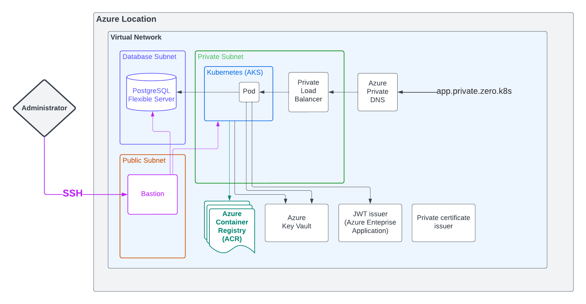

.. Copyright (c) 2023 Digital Asset (Switzerland) GmbH and/or its affiliates. All rights reserved.
.. SPDX-License-Identifier: Apache-2.0

Provision cloud resources with Terraform
########################################

.. note::
  If you plan to use GitOps via
  :doc:`Argo CD to deploy Daml Enterprise <../04-deploy-daml-enterprise/03-argocd-deployment/01-argocd-deployment>`
  to Kubernetes, you must fork the `Daml Enterprise Accompanying Resources <https://github.com/DACH-NY/daml-enterprise-deployment-blueprints>`_. If you plan to follow other options like
  :doc:`Helm <../04-deploy-daml-enterprise/01-helm-deployment/01-helm-deployment-preparation>`
  or :doc:`Helmfile <../04-deploy-daml-enterprise/02-helmfile-deployment/00-intro>` (recommended),
  you can directly clone the Daml Enterprise `Accompanying Resources <https://github.com/DACH-NY/daml-enterprise-deployment-blueprints/>`_.

.. note::
   All the resources created are private. Nothing is exposed over the public Internet.

Objectives
**********

This section covers the following objectives:

* Configure Azure access and `configure Terraform <https://www.terraform.io/>`_.
* Create resources in your Azure subscription required for deploying Daml Enterprise.
* Initialize databases and configure Kubernetes secrets.
* Copy Daml Enterprise container images into the Azure Container Registry.

The following diagram provides an overview of the target state for the Terraform configuration. For details, consult the `Terraform configuration files <https://github.com/DACH-NY/daml-enterprise-deployment-blueprints/tree/main/azure/terraform>`_ and the :ref:`default IPv4 addressing plan <default-addressing-plan>`.

Prerequisites
*************

* Credentials to access the `Digital Asset Artifactory <https://digitalasset.jfrog.io/>`_ and pull Daml Enterprise container images
* GitHub account with access to the Daml Enterprise Accompanying `Resources <https://github.com/DACH-NY/daml-enterprise-deployment-blueprints/>`_
* `jq <https://jqlang.github.io/jq/download/>`_ [\ ``1.5+``\ ]
* `Azure CLI <https://learn.microsoft.com/en-us/cli/azure/install-azure-cli>`_ [latest]
* `Terraform <https://developer.hashicorp.com/terraform/downloads>`_ [\ ``1.4+``\ ]
* `regctl <https://github.com/regclient/regclient/blob/main/docs/install.md>`_ [\ ``0.4+``\ ]
* `PostgreSQL interactive terminal <https://www.postgresql.org/download/>`_ [\ ``14+``\ ]
* `Kubernetes command-line tool <https://kubernetes.io/docs/tasks/tools/>`_ [\ ``1.25+``\ ]
* `Helm <https://helm.sh/docs/intro/install/>`_ [\ ``3.9+``\ ]
* `Helmfile (optional) <https://helmfile.readthedocs.io/>`_ [\ ``0.150+``\ ]

Steps
*****

.. note::
   The following steps assume that you have cloned `the Daml Enterprise Accompanying Resources <https://github.com/DACH-NY/daml-enterprise-deployment-blueprints/>`_,
   and that your working directory is ``azure/terraform``.

Create SSH key to access bastion
================================

You must provide an existing SSH key pair to access the proxy (also called bastion) to be created. You can create a new one using this command:

.. code-block:: sh

   ssh-keygen -m PEM -t rsa -b 4096 -f /path/to/ssh/key -C 'bastion@zero.k8s'

.. note::
  For increased security, provide a passphrase for the created SSH key.

Set up your Azure account
=========================

Log in to Azure and select the target subscription (if you have multiple ones):

.. code-block:: bash

   az login
   az account list
   az account set --subscription <subscription_id>

Configure Terraform
===================

To configure Terraform for your Azure subscription, follow these steps:

* Provide an existing Azure resource group. You can create a new one with this command:

  .. code-block:: bash

     az group create --name <resource_group_name> --location <location>

* Create your own backend configuration.

* Copy and customize the variables file `sample.tfvars <https://github.com/DACH-NY/daml-enterprise-deployment-blueprints/blob/main/azure/terraform/sample.tfvars>`_. Use the resource group you just created. You can use the file name ``terraform.tfvars`` to avoid passing the argument ``--var-file=/path/to/file.tfvars`` on each run.

.. note::
   There are multiple ways to `configure the backend <https://developer.hashicorp.com/terraform/language/settings/backends/configuration>`_ and manage different environments (development, staging, production, and so on) within the same repository. Select the appropriate solution for your needs. For local testing, use the `Terraform default backend <https://developer.hashicorp.com/terraform/language/settings/backends/configuration#default-backend>`_.

To learn more about Terraform, consult the `Terraform documentation <https://developer.hashicorp.com/terraform/tutorials>`_.

Initialize Terraform and preview the execution plan
===================================================

To initialize Terraform and the directory containing Terraform configuration files, run this command:

.. code-block:: sh

   terraform init
   terraform plan

The last command displays the Terraform execution plan, which indicates the changes that Terraform intends to make to your Azure subscription.

Apply changes proposed in the execution plan
============================================

To apply the proposed changes in the execution plan, use this command:

.. code-block:: bash

   terraform apply

.. note::
   It initially takes 15 to 20 minutes to create an AKS cluster.

Access to Kubernetes API
========================

There are different ways to configure access to the Kubernetes API using the CLI. Choose one option and proceed.

a) Using a kubectl configuration context (recommended)
------------------------------------------------------

* Open a new terminal window to make an SSH tunnel (available on ``localhost:44443``\ ):

  .. code-block:: bash

     make kubectl-proxy

* Merge and switch to the new ``kubectl`` configuration (also called ``kubeconfig``\ ) to your AKS cluster using the SSH tunnel:

  .. code-block:: bash

     ./bootstraps/merge-kubeconfig.sh

* Run commands such as ``kubectl``\ , ``helm``\ , and ``helmfile``\  as usual.

b) Target the kubectl configuration file
----------------------------------------

* Open a new terminal window to make an SSH tunnel (available on ``localhost:44443``\ ):

  .. code-block:: bash

     make kubectl-proxy

* Set the  Kubernetes CLI configuration file (this is lost if you use a new or different terminal):

  .. code-block:: bash

     export KUBECONFIG="$(pwd)/outputs/kube/ssh.config"

* Run commands such as ``kubectl``\ , ``helm``\ , and ``helmfile``\ as usual.

Access to PostgreSQL
====================

To enable access to the provisioned PostgreSQL server:

* Open a new terminal window to make an SSH tunnel (available on ``localhost:5432``\ )

  .. code-block:: bash

     make psql-proxy

* Connect to the PostgreSQL server using admin credentials:

  .. code-block:: bash

     make psql

Set up PostgreSQL & Kubernetes secrets
======================================

Complete the PostgreSQL server setup that is required for deploying Daml Enterprise components, creating roles/database, storing passwords into Key Vault, and creating Kubernetes secrets:

.. code-block:: bash

   ./bootstraps/postgresql.sh

Copy container images to Azure Container Registry
=================================================

Set environment variables to access the Digital Asset container image registry at ``digitalasset-docker.jfrog.io``:

.. code-block:: bash

  export ARTIFACTORY_USER='<your_user>'
  export ARTIFACTORY_API_KEY='<your_api_key>'

Copy container images from the Digital Asset Artifactory to the private ACR:

.. code-block:: bash

   ./bootstraps/clone-images.sh 2.7.1

Next steps
**********

At this point, all cloud resources should be provisioned and set up. Continue with the :doc:`Deploy dependencies <../03-deploy-dependencies/00-intro>` section.

Deployment details
******************

Interact with the deployment
============================

To interact with the deployment, use the ``Makefile`` under ``azure/terraform``. To list all the supported commands, invoke ``make help`` or ``make``.

Access to bastion/proxy
=======================

Connect to the bastion VM provisioned using SSH:

.. code-block:: sh

   make bastion

.. note::
   Only the public IP of the machine used to run Terraform can connect by default. You can provide a static array of public IPs with the Terraform variable ``admin_public_ips``.

.. _default-addressing-plan:

Default private IPv4 addressing plan
====================================

.. list-table::
   :header-rows: 1

   * - Name
     - CIDR
     - Start
     - End
     - Available IPs
   * - Virtual network
     - ``10.0.0.0/16``
     - ``10.0.0.0``
     - ``10.0.255.255``
     - ``65536``
   * - Public subnet
     - ``10.0.0.0/19``
     - ``10.0.0.0``
     - ``10.0.31.255``
     - ``8192``
   * - Private subnet
     - ``10.0.32.0/19``
     - ``10.0.32.0``
     - ``10.0.63.255``
     - ``8191``
   * - AKS internal load balancer
     - ``10.0.63.1/32``
     - ``10.0.63.1``
     - ``10.0.63.1``
     - ``1``
   * - AKS pods
     - ``10.0.64.0/19``
     - ``10.0.64.0``
     - ``10.0.95.255``
     - ``8192``
   * - AKS services
     - ``10.0.96.0/22``
     - ``10.0.96.0``
     - ``10.0.99.255``
     - ``1024``
   * - AKS ingresses
     - ``10.0.100.0/22``
     - ``10.0.100.0``
     - ``10.0.103.255``
     - ``1024``
   * - Database subnet
     - ``10.0.104.0/24``
     - ``10.0.104.0``
     - ``10.0.104.255``
     - ``256``
   * - Space (1)
     - ``10.0.105.0/17``
     - ``10.0.105.0``
     - ``10.0.127.255``
     - ``5888``
   * - Space (2)
     - ``10.0.128.0/17``
     - ``10.0.128.0``
     - ``10.0.255.255``
     - ``32768``
