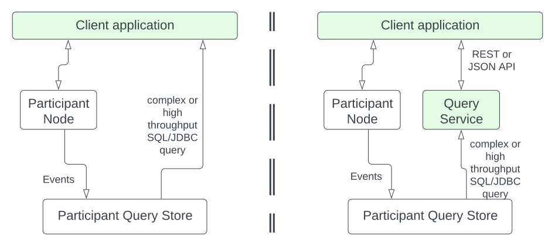

.. Copyright (c) 2023 Digital Asset (Switzerland) GmbH and/or its affiliates. All rights reserved.
.. SPDX-License-Identifier: Apache-2.0

Participant Query Store User Guide
##################################

Introduction
************

The term operational data store (ODS) usually refers to a database that mirrors the ledger and allows for efficient querying. The Participant Query Store (PQS) feature acts as an ODS for the participant node. It stores contract creation, contract archival, and exercise information in a PostgreSQL database using a JSONB column format. You access the data using SQL over a JDBC connection.

The PQS is intended for high throughput and complex queries, for which the Canton ledger (gRPC Ledger API) and the JSON API are not optimized. The PQS is useful for:

-  Application developers to access data on the ledger, observe the evolution of data, and debug their applications.
-  Business analysts to analyze ledger data and create reports.
-  Support teams to debug any problems that happen in production.
-  Application operators to take a full snapshot of the ledger (from the start of the ledger to the current latest transaction). Alternatively, they can take a partial snapshot of the ledger (between specific `offsets <https://docs.daml.com/app-dev/grpc/proto-docs.html#ledgeroffset>`__).
-  Report writers to extract historical data and then stream indefinitely (either from the start of the ledger or from a specific offset).

There are many other uses.

In the Early Access implementation, the PQS provides a unidirectional path for exporting data from the ledger event stream to a PostgreSQL data store. Data is exported in an append-only fashion and provides a stable view of data for purposes such as point-in-time queries.

Early Access Purpose and Limitations
************************************

The Early Access (EA) release allows users to learn about the architecture and programming model of the PQS. This enhancement to the participant node provides new capabilities that can take time to explore. The EA release is not fully production ready, but it will rapidly become enterprise-hardened. Since applications take time to develop, the EA version is recommended for learning and development. As enhancements are made and gaps are closed, a new patch release will be provided.

The current limitations of the EA version are:

-  PQS has not been performance optimized, so it is not yet ready for large- or high-throughput queries.
-  As is typical of EA releases, backward compatibility between EA releases may be sacrificed to make improvements in the user experience and design of PQS. You may need to make adjustments in your use through the EA period.

Future early access releases will remove or reduce these limitations.  Please check back to this section for announcements of a new early access release.

Early Access Release Versions
=============================

The historical table below lists the available Early Access releases of the Participant Query Store. Click the date to download the JAR.

+---------------+-----------------------------------------------------+
| Date          | Description                                         |
+===============+=====================================================+
| `2023-08-09`_ | Initial early access release.                       |
+---------------+-----------------------------------------------------+
| `2023-08-31`_ | Added OAuth support.                                |
+---------------+-----------------------------------------------------+
| `2023-09-06`_ | Documentation updated.  Added *PQS Schema Design*,  |
|               | *Offset Management*, *Querying Patterns*, *Advanced |
|               | Querying Topics* sections.                          |
+---------------+-----------------------------------------------------+

.. _2023-08-09: https://digitalasset.jfrog.io/artifactory/scribe/scribe-v0.0.1-main%2B2986-e45c930.tar.gz
.. _2023-08-31: https://digitalasset.jfrog.io/artifactory/scribe/scribe-v0.0.1-main%2B3614-6b5f082.tar.gz
.. _2023-09-06: https://digitalasset.jfrog.io/artifactory/scribe/scribe-v0.0.1-main%2B3614-6b5f082.tar.gz

Overview
********

Architecture
============

The typical configuration is to have a separate PQS instance with its own DB for each participant node (shown in the figure). In this configuration, the PQS extracts contract information for all parties on the participant node. As data is physically segregated by Daml participants and hosted Daml parties must trust the node operator, they may trust the operator to protect the PQS privacy as well. A more restricted configuration is possible that limits the parties for which the PQS extracts information.

A client application can access the PQS directly using a JDBC connection where the data access rights are defined by the PostgreSQL database (left side in the figure). In this case, having access to the database means that the user has access to all the content in the database. If finer-grained access is needed, a read-only query service (right side in the figure) can be inserted between the client application and the PQS. That query service can filter out what a client application can see. This is a fairly `standard pattern <https://www.bezkoder.com/spring-boot-jdbctemplate-crud-example/>`__ in the industry.



To understand the format that PQS outputs into a Postgres document-oriented cache, you must understand how the ledger stores data. The Daml ledger is composed of transactions, which generate events. An event can represent one of these situations:

-  Creation of contracts ("create event")
-  Exercise of a choice on a contract ("exercise event"), which archives the contract if it is a consuming choice

A contract on the ledger is either created or archived. The relationships between transactions and contracts are captured in the database as follows:

-  All contracts have links (foreign keys) to the transaction in which they were created.
-  Archived contracts have pointers to the transaction in which they were archived.

Transactions on the ledger are inserted into PostgreSQL concurrently, for high performance. Consistency (for readers) is provided through a watermark mechanism that indicates a consistent offset from which readers can consume for a fully consistent ledger. These details are managed for readers through the functions available in PostgreSQL. Depending on your needs, readers may wish to use or bypass these mechanisms, depending on the type of query and consistency required.

PQS Schema Design
=================

PQS is not directly involved in querying/reading the datastore - the
application is free to query it, such as via JDBC.  The objectives of the
schema design is to facilitate:

-  *Scaleable writes*: transactions are written in parallel, ensuring that
   writes do not need to be sequential.
-  *Scaleable reads*: queries are able to be parallelized, and are not
   blocked by writes. They produce sensible query plans, that do not
   produce unnecessary table scans.
-  *Ease of use*: readers are able to use familiar tools and techniques to
   query the datastore, without needing to understand the specifics of
   the schema design. Instead they are able to use simple entry-points
   that provide access to data in familar ways. In particular, readers
   do not need to navigate the offset-based model.
-  *Read consistency*: readers are able to achieve the level of
   consistency that they require, including consistency with other
   ledger datastores, or ledger commands that have been executed.

To facilitate these objectives, the following principles have been used:

-  *Append-only*: only INSERTs are used, and no UPDATEs or DELETEs are
   used in transaction processin.
-  *Offset-based*: all physical tables are indexed by offset, meaning that
   all ledger data is known in terms of the offset in which it was
   committed to the ledger.
-  *Implicit offset*: readers can opt for queries with implicit offset,
   meaning they can ignore the role of offset in their queries - but
   still provide a stable view of the ledger data. Much like PostgreSQL
   provides MVCC capabilities without the reader needing to understand
   the underlying implementation, we seek to provide a similar
   experience for readers of the ledger data.
-  *Idempotent*: PQS is designed to be restarted at any time, and will
   not impact the integrity of the data. This is achieved by using the
   offset-based model and ensuring that (other than the datastore
   itself) PQS is stateless.
-  *Watermarks*: PQS maintains a watermark of the latest contigous
   offset, representing the point of the ledger that has been fully
   processed. This is used to ensure that the ledger data has read
   consistency, without needing readers to perform pathalogical table
   scans to achieve this. This resolves the uncertainty created by the
   parallel writes.

JSON Data
=========

Relational databases excel at storing structured data for which the schema is known in advance. However, they have traditionally lacked mechanisms for data that is more dynamic or evolves. For example, you may want to store arbitrary Daml contracts and might prefer not to update the database schema every time the underlying template changes.

PostgreSQL helps manage unstructured data through native support for JSON data and allows queries to process this data. For best performance, the PQS stores data as JSONB only.

An example query might look like this:

.. code-block:: none

    SELECT *
    FROM contract
    WHERE payload->>'isin' = 'abc123'
    ORDER BY payload->'issuanceData'->'issueDate'->>'Some';

For more information on querying JSON data, see the section `JSON Functions and Operators <https://www.postgresql.org/docs/12/functions-json.html>`__ in the PostgreSQL manual. The operators ``->``, ``->>``, ``#>``, ``#>>``, and ``@>`` may be of particular interest.

Continuity
==========

The PQS is intended for continuous operation. Upon restart after an interruption, PQS determines the last consistent offset and continues incremental processing from that point onward. PQS terminates when encountering any error and leaves it up to the orchestration layer (such as Kubernetes) or the operator to determine the appropriate course of action.

High Availability
=================

Multiple isolated instances of PQS can be instantiated without any cross-dependency. This allows for an active-active high availability, clustering model. Please note that different instances might not be at the same offset due to different processing rates or other factors. After querying one active instance, it is possible for you to see results that are not yet visible on an alternative, active instance. This requires consideration for the client to handle the situation where waiting or a retry is required to service "at least up to" requests.

Setup
*****

Meeting Prerequisites
=====================

Here are the prerequisites to run PQS:

-  A PostgreSQL database that can be reached from the PQS. Note that PQS uses the JSONB data type for storing JSON data, which requires Postgres versions 11, 13, and 15.
-  An empty database (recommended) to avoid schema and table collisions.
-  Daml ledger as the source of events. m/TLS is supported for the participant node ledger API.  Alternatively, it can run against the ``Sandbox``.
-  Installation of `The Daml Enterprise SDK <https://docs.daml.com/getting-started/installation.html#install-daml-enterprise>`__.

Deploying the Scribe Component
==============================

The PQS consists of two components: the PostgreSQL database and a ledger component called *Scribe*, as shown below. Scribe is packaged as a Java JAR file. To run the PQS during Early Access, retrieve ``scribe.jar`` from `this Artifactory path <https://digitalasset.jfrog.io/ui/native/scribe>`__.

.. image:: ./images/scribe.svg
   :alt: A diagram showing the components of the Participant Query Store

Connecting the PQS to a Ledger
==============================

To connect to the participant node ledger, provide separate address and port parameters. For example, you could specify ``--host 10.1.1.10 --port 6865``, or in short form ``-h 10.1.1.168 -p 6865``.

You do not need to pass the default host ``localhost`` and default port ``6865``.

To connect to a participant node, you might need to provide TLS certificates. To see options for this, refer to the output of the ``--help`` command.

Authorizing PQS
===============

If you are running PQS against a participant node's ledger API that verifies authorization, you must provide credentials for the `OAuth Client Credentials Flow <https://auth0.com/docs/get-started/authentication-and-authorization-flow/client-credentials-flow>`__.  For example:

.. code-block:: bash

  $ ./scribe.jar pipeline ledger postgres-document \
      --source-ledger-auth OAuth \
      --pipeline-oauth-clientid my_client_id \
      --pipeline-oauth-clientsecret deadbeef \
      --pipeline-oauth-cafile ca.crt \
      --pipeline-oauth-endpoint https://my-auth-server/token

The type of access token that PQS expects is Audience / Scope based tokens (see “\ `User Access Tokens <https://docs.daml.com/app-dev/authorization.html#user-access-tokens>`__\ ” for more information).

Scribe will obtain tokens from the Authorization Server on startup, and it will reauthenticate before the token expires. If Scribe fails authorization, it will terminate with an error for the service orchestration infrastructure to respond appropriately.

If you are unauthenticated then you will need to supply the Party(s) you wish to include in your PQS since there is no 'user' to connect your list of ``readAs`` Party's with.   The ``-pipeline-parties`` argument is used for this and it acts as a filter that restricts the data to that visible to the supplied list of party identifiers.  ``--pipeline-parties`` allows you to filter that down to a subset of the accessible parties. An example is ``--pipeline-parties Alice::12209942561b94adc057995f9ffca5a0b974953e72ba25e0eb158e05c801149639b9``.  If there is more than one party, then list all of the full party identifiers in a comma-separated list.

Setting Up PostgreSQL
=====================

To connect the database, create a PostgreSQL database with three users:

-  **Ops**: Provides a way for database administrators or Scribe to access DDL for schema creation and general maintenance.
-  **Writer**: Allows Scribe to connect, such as during "pipeline" operations of writing the ledger.
-  **Reader**: Supports all other users.

Connecting to the PQS PostgreSQL Data Store
===========================================

The database connection is handled by the JDBC API, so you need to provide the following (all have defaults):

-  Hostname
-  Port number
-  Username
-  Password

The following example connects to a PostgreSQL instance running on localhost on the default port, with a user Postgres which has not set a password and a database called ``daml_pqs``. This is a typical setup on a developer machine with a default PostgreSQL install.

.. code-block:: bash

    $ ./scribe.jar pipeline ledger postgres-document \
         --target-postgres-database daml_pqs \

The next example connects to a database on host ``192.168.1.12``, listening on port ``5432``. The database is called ``daml_pqs``.

.. code-block:: bash

    $ ./scribe.jar pipeline ledger postgres-document \
         --target-postgres-host 192.168.1.12 \
         --target-postgres-database daml_pqs

Logging
=======

By default, the PQS logs to ``stderr``, with ``INFO`` verbose level. To change the level, use the ``--logger-level enum`` option, as in the example ``--logger-level Trace``.

Using Command Line Options
==========================

You can discover commands and parameters through the embedded ``--help`` (remember to include ``pipeline`` before ``--help``), as shown in the following example.

.. code-block:: bash

    ./scribe.jar pipeline --help
    Usage: pipeline SOURCE TARGET [OPTIONS]

    Initiate continuous ledger data export

    Available sources:
      ledger   Daml ledger

    Available targets:
      postgres-document   Postgres database (w/ document payload representation)
      postgres-relational Postgres database (w/ relational payload representation)

    Options:
      --config file                                Path to configuration overrides via an external HOCON file (optional)
      --pipeline-parties string                    Daml party identifiers to filter on (comma-separated) (default: List())
      --pipeline-oauth-clientid string             Client's identifier (optional)
      --pipeline-oauth-cafile file                 Trusted Certificate Authority (CA) certificate (optional)
      --pipeline-oauth-endpoint uri                Token endpoint URL (optional)
      --pipeline-oauth-clientsecret string         Client's secret (optional)
      --pipeline-filter string                     Filter expression determining which templates and interfaces to include (default: *)
      --pipeline-ledger-start [enum | string]      Start offset (default: Latest)
      --pipeline-ledger-stop [enum | string]       Stop offset (default: Never)
      --pipeline-datasource enum                   Ledger API service to use as data source (default: TransactionStream)
      --logger-level enum                          Log level (default: Info)
      --logger-mappings map                        Custom mappings for log levels
      --logger-format enum                         Log output format (default: Plain)
      --logger-pattern [enum | string]             Log pattern (default: Plain)
      --target-postgres-host string                Postgres host (default: localhost)
      --target-postgres-tls-mode enum              SSL mode required for Postgres connectivity (default: Disable)
      --target-postgres-tls-cert file              Client's certificate (optional)
      --target-postgres-tls-key file               Client's private key (optional)
      --target-postgres-tls-cafile file            Trusted Certificate Authority (CA) certificate (optional)
      --target-postgres-autoapplyschema boolean    Apply metadata inferred schema on startup (default: true)
      --target-postgres-password string            Postgres user password (default: ********)
      --target-postgres-username string            Postgres user name (default: postgres)
      --target-postgres-database string            Postgres database (default: postgres)
      --target-postgres-port int                   Postgres port (default: 5432)
      --source-ledger-host string                  Ledger API host (default: localhost)
      --source-ledger-auth enum                    Authorisation mode (default: NoAuth)
      --source-ledger-tls-cafile file              Trusted Certificate Authority (CA) certificate (optional)
      --source-ledger-tls-cert file                Client's certificate (leave empty if embedded into private key file) (optional)
      --source-ledger-tls-key file                 Client's private key (leave empty for server-only TLS) (optional)
      --source-ledger-port int                     Ledger API port (default: 6865)

For more help, use the command:

.. code-block:: bash

    ./scribe.jar pipeline --help-verbose

Following is an example of a basic command to run PQS to extract all data, including exercises, for a party with the display name Alice. You can replace the argument values with those that match your environment.

.. code-block:: bash

    $ ./scribe.jar pipeline ledger postgres-document \
    --pipeline-parties Alice::12209942561b94adc057995f9ffca5a0b974953e72ba25e0eb158e05c801149639b9 \
    --pipeline-datasource TransactionTreeStream \
    --source-ledger-host localhost \
    --source-ledger-port 6865 \
    --target-postgres-host localhost \
    --target-postgres-port 5432 \
    --target-postgres-database postgres \
    --target-postgres-username postgres \
    --target-postgres-password postgres

NOTE: Only ``postgres-document`` is currently implemented, with ``postgres-relational`` to follow soon.

The ``-pipeline-ledger-start`` argument is an enum with the following possible values:

-  ``Latest``: Use latest offset that is known or resume where it left off. This is the default behavior, where streaming starts at the latest known end. The first time you start, this will result in PQS calling ``ActiveContractService`` to get a state snapshot, which it will load into the ``_creates`` table. It will then start streaming creates, archives, and (optionally) exercises from the offset of that ``ActiveContractService``. When you restart PQS, it will start from the point it last left off. You should always use this mode on restart.
-  ``Genesis``: Use the first original offset of the ledger. This causes PQS to try to start from offset ``0``. It allows you to load historic creates, archives or (optionally) exercises from a ledger that already has data on it. If you try to restart on an already populated database in this mode, PQS will rewrite data if it needs to.
-  ``Oldest``: Use the oldest available (unpruned) offset on the ledger or resume where it left off.

PQS is able to start and finish at prescribed ledger offsets, specified by the arguments ``--pipeline-ledger-start`` and ``--pipeline-ledger-stop``. The ``./scribe.jar pipeline --help-verbose`` command provides extensive help information.

PQS Development
***************

Offset Management for Querying
==============================

The following functions control the temporal perspective of the ledger,
considering how you wish to consider time as a scope for your queries.
You may wish to:

-  Effectively ignore time; simply query the *latest available* state
-  Query the state of the ledger at a specific time in history
-  Query the ledger events across a time range - eg. an audit-trail
-  Query the ledger in a way that preserves consistency with other
   interactions you have had with the ledger (reader or writer)

The following functions allow you to control the temporal scope of the
ledger, which establishes the context in which subsequent queries in the
PostgreSQL session will execute:

-  ``set_latest(offset)``: nominates the offset of the latest data to
   include in observing the ledger. If NULL then it uses the very latest
   available. The actual offset that will be used, is returned. If the
   supplied offset is beyond what is available, an error occurs.
-  ``set_latest_minimum(offset)``: provides the minimum offset that
   should be used, but a more recent offset will always be chosen.
   Returns an error if the nominated offset is not yet available.
   Function returns the actual offset used.
-  ``set_oldest(offset)``: nominates the offset of the oldest events to
   include in query scope. If ``NULL`` then it uses the oldest available.
   Function returns the actual offset used. If the supplied offset is
   beyond what is available, an error occurs.
-  ``get_offset(time)``: a helper function to determine the offset of a
   given ``time`` (or interval prior to now).

Under this temporal scope, the following `table
functions <https://www.postgresql.org/docs/current/queries-table-expressions.html>`__
allow access to the ledger and are used directly in queries. They are
designed to be used in a similar manner to tables or views, and allow
users to focus on the data they wish to query, with the impact of
offsets removed.

-  ``active(name)``: active instances of the target contracts/interfaces
   that existed at the time of the latest offset
-  ``creates(name)``: create events that occurred between the oldest and
   latest offset
-  ``archives(name)``: archive events that occurred between the oldest
   and latest offset
-  ``exercises(name)``: exercise events that occurred between the oldest
   and latest offset

The functions allow the user to focus on the
templates/interfaces/choices they wish to query, without concern for
`PostgreSQL name
limits <https://www.postgresql.org/docs/current/sql-syntax-lexical.html#:~:text=maximum%20identifier%20length%20is%2063%20bytes>`__.
The ``name`` parameter can be used with or without the package
specified:

-  Fully qualified:
   ``<package-id>:<module>:<template|interface|choice>``
-  Partially qualified: ``<module>:<template|interface|choice>``


Querying Patterns
=================

Several common ways to use the table functions are described next which are:

- Use the most recent available state of the ledger
- Query the ledger using a point in time
- Query the ledger from a fixed offset
- Set the oldest offset to consider
- Set the oldest and latest offset by time value
- Set a minimum offset for consistency
- Use the widest available offset range for querying

Of course, these can be combined or altered based on the purpose of the query.

Use the Most Recent Available State of the Ledger
---------------------------------------------------

A user who wants to query most recent available state of the ledger. This user
treats the ledger Active Contract Set as a virtual database table, and is not
concerned with offsets because they want the latest result.

This user simply wants to query the (latest) state of the ledger,
without consideration for offsets. Querying is inherently limited to one
datasource, as the user has no control over the actual offset that will
be used.

In this scenario the user wishes to query all Daml templates of ``User``
within the ``Test.User`` templates, where the user is not an
administrator:

.. code-block:: sql

   set_offset_latest(NULL);
   SELECT *
     FROM active('Test.User:User') AS "user"
     WHERE NOT "user"."admin";

By using PostgreSQL’s JSONB querying capabilities, we can join with the
related ``Alias`` template to provide an overview of all users and their
aliases:

.. code-block:: sql

   set_latest(NULL);
   SELECT "user".*, alias.*
     FROM active('Test.User:User') AS "user"
       LEFT JOIN active('Test.User:Alias') AS alias
         ON "user".payload->>'user_id' = alias.payload->>'user_id';

Historical events can also be accessed; by default all the history in
the datastore is available for querying. The following query will return
the data associated with all ``User`` contracts that were archived in
the available history:

.. code-block:: sql

   set_latest(NULL);
   set_oldest(NULL);
   SELECT c.*
     FROM archive('Test.User:User') AS a
       JOIN create('Test.User:User') AS c USING contract_id;

Query the Ledger Using a Point in Time
--------------------------------------

A report writer wants to query the ledger as of a known historical point in
time, to ensure that consistent data is provided regardless of where the
ledger subsequently evolved.

This user can obtain a point-in-time view of the ledger, to see all
non-admin ``User`` templates that were active at that point in time:

.. code-block:: sql

   set_latest(get_offset('2020-01-01 00:00:00+0'));
   SELECT "user".*
     FROM active('Test.User:User') AS "user"
     WHERE NOT "user".admin;

In addition the user can then query the history of the ledger, to see
how many aliases had have existed for each of these users who were
active at the snapshot time

.. code-block:: sql

   set_latest(get_offset('2020-01-01 00:00:00+0'));
   set_oldest(NULL);
   WITH "users" AS (
     SELECT  "user".*
       FROM active('Test.User:User') AS "user"
       WHERE NOT "user".admin
   )
   SELECT "user".user_id, COUNT(alias.*) AS alias_count
     FROM active('Test.User:User') AS "user"
       JOIN create('Test.User:Alias') AS alias
         ON "user".payload->>'user_id' = alias.payload->>'user_id'
     WHERE NOT "user".admin;

Query the Ledger from a Fixed Offset
------------------------------------

An automation user who wants to query from fixed known offsets, still wants to
write their query in the same familiar way.

.. code-block:: sql

   -- fails if the datastore has not yet reached the given offset
   set_latest("00000001250");

The queries will now observe active contracts from the given
offset. Therefore the example queries presented above are unchanged.


Set the Oldest Offset to Consider
---------------------------------

A user wants to present a limited amount of history to
their users.  

If readers wish to limit the event history, they can also call:

.. code-block:: sql

   -- fails if this offset has already been pruned
   set_oldest("00000000500");

This adjustment in scope does not affect the example queries presented
above.

Set the Oldest and Latest Offset by Time Value
----------------------------------------------

A user wants to present a time-based view to their users, to provide reports
based on point-in-time rather than offsets

.. code-block:: sql

   set_latest(get_offset(TIMESTAMP '2020-03-13 00:00:00+0'))
   set_oldest(get_offset(INTERVAL '14 days')); -- history of the past 14 days


Set a Minimum Offset for Consistency
------------------------------------

A website user who wants to query active contracts, after having
completed a command (write) which has updated the ledger. The user
does not want to see a version of the ledger prior to the command
being executed.

.. code-block:: sql

   -- The user just executed a command at offset #00000001350.
   -- This function call will fail if the datastore has not yet reached this offset, in order to provide consistent reads.
   -- If it has an even more recent offset (eg. 00000001355) - this will be used instead.
   set_latest_minimum("00000001350");


Use the Widest Available Offset Range for Querying
--------------------------------------------------

A user wants to enquire where the datastore is up to, in terms of
offset availability.

Here the user asks for the very latest and oldest offsets available to
be used, and in the process returns what these offsets are:

.. code-block:: sql

   SELECT set_latest(NULL) AS latest_offset, set_oldest(NULL) AS oldest_offset;


Advanced Querying Topics
========================

Reading
-------

As outlined, there are two distinct approaches used when querying ledger
data in the datastore:  state or events.

**State**, in the form of the Active Contract Set, by the function
``active(name)`` uses the latest offset only, using the following rules:

.. code-block:: none

  creation_offset <= latest_offset; AND
  no archive_offset <= latest_offset

**Events** (create, exercise, archive) make use of the range oldest and
latest offset:

.. code-block:: none

  event_offset <= latest_offset; AND
  event_offset >= oldest_offset

Write Pipeline
--------------

Only advanced users should be concerned with the manner in which the
write pipeline is implemented. The above Read API takes into
consideration the manner in which the write pipeline is implemented, and
therefore the above Read API is the recommended way to query the
datastore. However, for completeness we provide the following
information.

A Daml transaction is a collection of events that take effect on the
ledger atomically. However it needs to be noted that for performance
reasons these transactions are written to the datastore *in parallel*,
and while the datastore is written to in a purely append-only fashion,
it is not guaranteed that these transactions will become visible to
readers in order. The offset-based model makes the database’s isolation
level irrelevant - so the loosest model (``read uncommitted``) is not
harmful.

The first thing to consider when querying the datastore is the type of
read consistency required. If there is no need for consistency (eg.
reading a historical contract - regardless of lifetime) then payload
tables can be queried directly, without any consideration of offset.
Another example is a liveness metric query that calculates the
number of transactions in the datastore over the past minute. Again,
this could be entirely valid without consideration of the
parallel-writing method.

When consistency is required, the reader must be aware of the offset
from which they are reading. This ensures they do not also read
further offsets that are present, but their precedent events are not yet
stored in the database.

To achieve the level of consistency that you require, including
read-consistency with other ledger data or commands you have executed.
This is achieved by providing a function that returns the latest
checkpoint offset:

.. code-block:: none

   -- utility functions
   create or replace function latest_checkpoint()
   returns table ("offset" _transactions."offset"%type, ix _transactions.ix%type) as $$
     select max(groups."offset") as "offset", max(groups."ix") as ix
     from (SELECT ix - ROW_NUMBER() OVER (ORDER BY ix) as delta, * FROM _transactions) groups
     group by groups.delta
     order by groups.delta
     limit 1;

   $$ language sql;
   create or replace function first_checkpoint()
   returns table ("offset" _transactions."offset"%type, ix _transactions.ix%type) as $$
     select t."offset" as "offset", t."ix" as ix from _transactions t order by ix limit 1;


Note that the ``Archive`` table represents all ``Archive`` choices in the given
namespace. ie. ``User.Archive`` and ``Alias.Archive`` in the ``User`` namespace.

JSON Format
===========

PQS stores create and exercise arguments using a `Daml-LF JSON-based encoding <https://docs.daml.com/json-api/lf-value-specification.html#daml-lf-json-encoding>`__ of Daml-LF values. An overview of the encoding is provided below. For more details, refer to `the Daml-LF page <https://docs.daml.com/json-api/lf-value-specification.html#daml-lf-json-encoding>`__.

Values on the ledger can be primitive types, user-defined records, or variants. An extracted contract is represented in the database as a record of its create argument. The fields of that record are primitive types, other records, or variants. A contract can be a recursive structure of arbitrary depth.

These types are translated to `JSON types <https://json-schema.org/understanding-json-schema/reference/index.html>`__ as follows:

Primitive types
---------------

- ``ContractID``: Represented as `string <https://json-schema.org/understanding-json-schema/reference/string.html>`__.
- ``Int64``: Represented as `string <https://json-schema.org/understanding-json-schema/reference/string.html>`__.
- ``Decimal``: Represented as `string <https://json-schema.org/understanding-json-schema/reference/string.html>`__.
- ``List``: Represented as `array <https://json-schema.org/understanding-json-schema/reference/array.html>`__.
- ``Text``: Represented as `string <https://json-schema.org/understanding-json-schema/reference/string.html>`__.
- ``Date``: Days since the Unix epoch. represented as `integer <https://json-schema.org/understanding-json-schema/reference/numeric.html#integer>`__.
- ``Time``: Microseconds since the UNIX epoch. Represented as `number <https://json-schema.org/understanding-json-schema/reference/numeric.html#number>`__.
- ``Bool``: Represented as `boolean <https://json-schema.org/understanding-json-schema/reference/boolean.html>`__.
- ``Party``: Represented as `string <https://json-schema.org/understanding-json-schema/reference/string.html>`__.
- ``Unit`` and ``Empty``: Represented as empty records.
- ``Optional``: Represented as `object <https://json-schema.org/understanding-json-schema/reference/object.html>`__. It is a Variant with two possible constructors: ``None`` and ``Some``.

User-defined types
------------------

- ``Record``: Represented as `object <https://json-schema.org/understanding-json-schema/reference/object.html>`__, where each create parameter's name is a key, and the parameter's value is the JSON-encoded value.
- ``Variant``: Represented as `object <https://json-schema.org/understanding-json-schema/reference/object.html>`__, using the ``{constructor: body}`` format, such as ``{"Left": true}``.

Display of Metadata-Inferred Database Schema
============================================

PQS analyzes package metadata as part of its operation and displays the required schema to the user, as shown in the following example

.. code-block:: bash

    $ ./scribe.jar datastore postgres-document schema show
    [...]
    /**********************************************************
    * generated by scribe, version: v0.0.1-main+2151-7961ecb *
    **********************************************************/
    -- tables
    create table if not exists _transactions (
    "offset" text primary key not null,
    ix bigint not null,
    transaction_id text,
    effective_at timestamp with time zone,
    workflow_id text
    );
    [...]

**or** it applies the schema on the fly idempotently (default).

.. code-block:: bash

    $ ./scribe.jar pipeline ledger postgres-document --pipeline-party=Alice
    18:27:26.799 I [zio-fiber-64] com.digitalasset.scribe.appversion.package:11 scribe, version: v0.0.1-main+2151-7961ecb
    18:27:27.159 I [zio-fiber-68] com.digitalasset.scribe.configuration.package:40 Applied configuration:
    pipeline {
    datasource=TransactionStream
    [...]
    18:27:28.714 I [zio-fiber-67] com.digitalasset.scribe.postgres.document.DocumentPostgres.Service:36 Applying schema
    18:27:28.805 I [zio-fiber-67] com.digitalasset.scribe.postgres.document.DocumentPostgres.Service:39 Schema applied
    18:27:28.863 I [zio-fiber-0] com.digitalasset.scribe.pipeline.pipeline.Impl:29 Starting pipeline on behalf of
    'party-e303d252-1e35-46cb-b4e6-06538271d927::1220883670ff44119c947deeabb2e07827adff83bed3e1a897f53f73b0f61d509952'
    18:27:29.043 I [zio-fiber-0] com.digitalasset.scribe.pipeline.pipeline.Impl:57 Last checkpoint is absent.
    Seeding from ACS before processing transactions with starting offset '000000000000000008'
    18:27:29.063 I [zio-fiber-938] com.digitalasset.zio.daml.Ledger.Impl:191 Contract filter inclusive of 2 templates
    and 0 interfaces
    18:27:29.120 I [zio-fiber-0] com.digitalasset.scribe.pipeline.pipeline.Impl:74 Continuing from offset 'GENESIS' and
    index '0' until offset 'INFINITY'
    18:27:29.159 I [zio-fiber-967] com.digitalasset.zio.daml.Ledger.Impl:191 Contract filter inclusive of 2 templates
    and 0 interfaces
    [...]

PQS Database Schema
===================

The following schema is representative for the exported ledger data. It is subject to change, since it is an Early Access feature.

.. code-block:: bash

    /**********************************************************
     * generated by scribe, version: v0.0.1-main+2151-7961ecb *
     **********************************************************/
     -- tables
     create table if not exists _transactions (
       "offset" text primary key not null,
       ix bigint not null,
       transaction_id text,
       effective_at timestamp with time zone,
       workflow_id text
     );

     create table if not exists _exercises (
       event_id text primary key not null,
       choice text not null,
       contract_id text not null,
       "offset" text not null references _transactions ("offset") on delete cascade on update cascade,
       consuming bool,
       witnesses text[],
       parent text references _exercises (event_id) on delete cascade
     );

     create table if not exists _creates (
       event_id text primary key not null,
       contract_id text not null,
       "offset" text not null references _transactions ("offset") on delete cascade on update cascade,
       witnesses text[],
       parent text references _exercises (event_id) on delete cascade
     );

     create table if not exists _archives (
       event_id text primary key not null,
       contract_id text not null,
       "offset" text not null references _transactions ("offset") on delete cascade on update cascade
     );

     create table if not exists _mappings (
       daml_fqn text primary key not null,
       pg_identifier text not null unique
     );

     -- PAYLOAD TABLES
     create table if not exists "Alias.39p75i" (
       event_id text primary key not null references _creates (event_id) on delete cascade,
       identifier text not null,
       contract_key jsonb,
       payload jsonb not null
     );

     create table if not exists "User.11jk59n1" (
       event_id text primary key not null references _creates (event_id) on delete cascade,
       identifier text not null,
       contract_key jsonb,
       payload jsonb not null
     );

     create table if not exists "Archive.2gpwea" (
       event_id text primary key not null references _exercises (event_id) ondelete cascade,
       identifier text not null,
       argument jsonb not null,
       result jsonb not null
     );

     create table if not exists "Alias_Change.11wa21n1" (
       event_id text primary key not null references _exercises (event_id) on delete cascade,
       identifier text not null,
       argument jsonb not null,
       result jsonb not null
     );

     create table if not exists "User_Follow.11q646ez" (
       event_id text primary key not null references _exercises (event_id) on delete cascade,
       identifier text not null,
       argument jsonb not null,
       result jsonb not null
     );

Note that the Archive table represents all Archive choices in the given namespace, such as ``User.Archive`` and ``Alias.Archive`` in the User namespace.

PQS Optimization
****************

This section briefly discusses optimizing a database as an introduction. The topic is broad, and there are many resources available. Refer to the `PostgreSQL documentation <https://www.postgresql.org/docs/>`__ for more information.

Indexing
========

indexes are an important tool to make queries with (JSON) expressions perform well. Here is one example of an index:

.. code-block:: none

    CREATE INDEX issueDateIdx
    ON contract
    USING BTREE ((payload->'issuanceData'->'issueDate'->>'Some'));

In this example, the index allows comparisons on the issue date. It has the additional advantage that the results of the JSON query ``payload->'issuanceData'->'issueDate'->>'Some'`` are cached and do not have to be recomputed for every access.

PostgreSQL provides several index types, including B-tree, Hash, GiST, SP-GiST, GIN, and BRIN. Each index type uses a different algorithm that is best suited to different types of queries. The table below provides a basic explanation of where they can be used. For a more thorough understanding, consult the `chapter on indexes <https://www.postgresql.org/docs/current/indexes.html>`__ in the PostgreSQL manual.

+-----------+----------------------------------------------------------+
| Index     | Comment                                                  |
| Type      |                                                          |
+===========+==========================================================+
| Hash      | Compact. Useful only for filters that use =.             |
+-----------+----------------------------------------------------------+
| B-tree    | Can be used in filters that use <, <=, =, >=, > as well  |
|           | as postfix string comparisons (e.g. LIKE 'foo%').        |
|           | B-trees can also speed up ORDER BY clauses and can be    |
|           | used to retrieve subexpressions values from the index    |
|           | rather than evaluating the subexpressions (i.e. when     |
|           | used in a SELECT clause).                                |
+-----------+----------------------------------------------------------+
| GIN       | Useful for subset operators.                             |
+-----------+----------------------------------------------------------+
| GiST,     | See manual.                                              |
| SP-GiST   |                                                          |
+-----------+----------------------------------------------------------+
| BRIN      | Efficient for tables where rows are already physically   |
|           | sorted for a particular column.                          |
+-----------+----------------------------------------------------------+

Pagination
==========

Pagination refers to splitting up large result sets into pages of up to ``n`` results. It can allow user navigation such as moving to the next page to display, going to the end of the result set, or jumping around in the middle. It can be a very effective user experience when there is a large ordered data set. The following pagination use cases are important:

+---------------+-----------------+------------------------------------+
| Pagination    |                 | Example                            |
| Use Case      |                 |                                    |
+===============+=================+====================================+
| Random access | Accessing       | -  Client side binary search of    |
|               | arbitrary pages |       results.                     |
|               |                 |                                    |
|               |                 | -  A user opens random pages in a  |
|               |                 |       search result.               |
+---------------+-----------------+------------------------------------+
| Iteration or  | Accessing page  | -  Programmatic processing of all  |
| enumeration   | 1, then page 2, |       results in batches.          |
|               | …               |                                    |
+---------------+-----------------+------------------------------------+

For efficient pagination iteration, you first need a column to sort on. The requirements are:

1. It should be acceptable to the user to sort results on this column.
2. You need a (unique) B-tree index on this column.
3. The column must have unique values.

You can then perform queries like this:

.. code-block:: none

    SELECT *
    FROM the_table
    WHERE the_sort_col > ???
    ORDER BY the_sort_col
    LIMIT 100;

The ``???`` value represents the last (largest) value for ``the_sort_col`` that was previously returned. To fetch results for the very first page, omit the ``WHERE`` clause.

Here is an example of random access to display page 10 of the search results:

.. code-block:: none

    SELECT *
    FROM the_table
    ORDER BY the_sort_col
    LIMIT 100
    OFFSET 1000;

This only makes sense if there is a B-tree index on ``the_sort_col``.

You should assume that a large ``OFFSET`` is slow. See the chapter on `LIMIT and OFFSET <https://www.postgresql.org/docs/current/queries-limit.html>`__ in the PostgreSQL manual.

psql Tips
=========

Type ``psql <dbname>`` on the command line to enter the PostgreSQL ```REPL``` (if in doubt, use postgres as the database name). Some useful commands are shown in the following table.

+---------+-------------------------------------------------------------+
| Command | Description                                                 |
+=========+=============================================================+
| \\l     | List all databases.                                         |
+---------+-------------------------------------------------------------+
| \\c db  | Switch to a different database.                             |
+---------+-------------------------------------------------------------+
| \\d     | List all tables in the current database.                    |
+---------+-------------------------------------------------------------+
| \\d     | Show a table, including column types and indexes.           |
| table   |                                                             |
+---------+-------------------------------------------------------------+

To create databases and users, try this:

.. code-block:: none

    CREATE DATABASE the_db;
    CREATE USER the_user WITH PASSWORD 'abc123';

To later remove them, try this:

.. code-block:: none

    DROP DATABASE the_db;
    DROP USER the_user;

psql can also be used for scripting:

.. code-block:: none

    psql postgres <<END
    ...
    CREATE DATABASE the_db;
    ...
    END

The script continues to execute if a command fails.

EXPLAIN ANALYZE
===============

Type ``EXPLAIN ANALYZE`` followed by a query in ``psql`` or similar tools to get an explanation of how the query would be executed. This is an invaluable tool to verify that a query you might want to run uses the indexes that you think it does.

.. code-block:: none

    EXPLAIN ANALYZE
    SELECT COUNT(*) FROM the_table;

Troubleshooting
***************

Some of the most common troubleshooting options are discussed below.

Cannot Connect to the Ledger Node
=================================

If the PQS cannot connect to the ledger node on startup, you will see a message in the logs like the following example, and the PQS will terminate.

.. code-block:: bash

    21:15:02.084 E [zio-fiber-0] com.digitalasset.scribe.app.ComposableApp:34 Exception in thread
    "zio-fiber-" io.grpc.StatusException: UNAVAILABLE: io exception
      at
    scalapb.zio_grpc.client.UnaryClientCallListener.onClose$$anonfun$1$$anonfun$1(UnaryClientCallListener.scala:61)
      Suppressed:
    io.netty.channel.AbstractChannel$AnnotatedConnectException: Connection refused:
    localhost/[0:0:0:0:0:0:0:1]:6865
        Suppressed: java.net.ConnectException: Connection refused
          at java.base/sun.nio.ch.Net.pollConnect(Native Method)
          at java.base/sun.nio.ch.Net.pollConnectNow(Net.java:672)
          at java.base/sun.nio.ch.SocketChannelImpl.finishConnect(SocketChannelImpl.java:946)
          at io.netty.channel.socket.nio.NioSocketChannel.doFinishConnect(NioSocketChannel.java:337)
          at io.netty.channel.nio.AbstractNioChannel$AbstractNioUnsafe.finishConnect(AbstractNioChannel.java:334)
          at io.netty.channel.nio.NioEventLoop.processSelectedKey(NioEventLoop.java:776)
          at io.netty.channel.nio.NioEventLoop.processSelectedKeysOptimized(NioEventLoop.java:724)
          at io.netty.channel.nio.NioEventLoop.processSelectedKeys(NioEventLoop.java:650)
          at io.netty.channel.nio.NioEventLoop.run(NioEventLoop.java:562)
          at io.netty.util.concurrent.SingleThreadEventExecutor$4.run(SingleThreadEventExecutor.java:997)
          at io.netty.util.internal.ThreadExecutorMap$2.run(ThreadExecutorMap.java:74)
          at io.netty.util.concurrent.FastThreadLocalRunnable.run(FastThreadLocalRunnable.java:30)
          at java.base/java.lang.Thread.run(Thread.java:833)
    io.grpc.StatusException: UNAVAILABLE: io exception
    io.netty.channel.AbstractChannel.AnnotatedConnectException: Connection
    refused: localhost/[0:0:0:0:0:0:0:1]:6865
    java.net.ConnectException: Connection refused

To fix this, make sure that the participant node's ledger API is accessible from where you are running the PQS.

Cannot Connect to the PQS Database
==================================

If the database is not available before the transaction stream is started, the PQS will terminate and you will see as error from the JDBC driver in the logs similar to the following example.

.. code-block:: bash

    21:16:32.116 E [zio-fiber-0] com.digitalasset.scribe.app.ComposableApp:34 Exception in thread
    "zio-fiber-" org.postgresql.util.PSQLException: Connection to localhost:5432 refused. Check
    that the hostname and port are correct and that the postmaster is accepting TCP/IP connections.
      at
        org.postgresql.core.v3.ConnectionFactoryImpl.openConnectionImpl(ConnectionFactoryImpl.java:342)
      at org.postgresql.core.ConnectionFactory.openConnection(ConnectionFactory.java:54)
      at org.postgresql.jdbc.PgConnection.<init>(PgConnection.java:263)
      at org.postgresql.Driver.makeConnection(Driver.java:443)
      at org.postgresql.Driver.connect(Driver.java:297)
      at java.sql/java.sql.DriverManager.getConnection(DriverManager.java:681)
      at java.sql/java.sql.DriverManager.getConnection(DriverManager.java:190)
      at zio.jdbc.shims.postgres$.$anonfun$1(postgres.scala:21)
      at
        zio.ZIOCompanionVersionSpecific.attempt$$anonfun$1(ZIOCompanionVersionSpecific.scala:103)
      at zio.ZIO$.suspendSucceed$$anonfun$1(ZIO.scala:4589)
      at
        zio.UnsafeVersionSpecific.implicitFunctionIsFunction$$anonfun$1(UnsafeVersionSpecific.scala:27)
      at zio.Unsafe$.unsafe(Unsafe.scala:37)
      at zio.ZIOCompanionVersionSpecific.succeed$$anonfun$1(ZIOCompanionVersionSpecific.scala:185)
      Suppressed: java.net.ConnectException: Connection refused
        at java.base/sun.nio.ch.Net.pollConnect(Native Method)
        at java.base/sun.nio.ch.Net.pollConnectNow(Net.java:672)
        at java.base/sun.nio.ch.NioSocketImpl.timedFinishConnect(NioSocketImpl.java:547)
        at java.base/sun.nio.ch.NioSocketImpl.connect(NioSocketImpl.java:602)
        at java.base/java.net.SocksSocketImpl.connect(SocksSocketImpl.java:327)
        at java.base/java.net.Socket.connect(Socket.java:633)
        at org.postgresql.core.PGStream.createSocket(PGStream.java:243)
        at org.postgresql.core.PGStream.<init>(PGStream.java:98)
        at org.postgresql.core.v3.ConnectionFactoryImpl.tryConnect(ConnectionFactoryImpl.java:132)
        at
          org.postgresql.core.v3.ConnectionFactoryImpl.openConnectionImpl(ConnectionFactoryImpl.java:258)
        at org.postgresql.core.ConnectionFactory.openConnection(ConnectionFactory.java:54)
        at org.postgresql.jdbc.PgConnection.<init>(PgConnection.java:263)
        at org.postgresql.Driver.makeConnection(Driver.java:443)
        at org.postgresql.Driver.connect(Driver.java:297)
        at java.sql/java.sql.DriverManager.getConnection(DriverManager.java:681)
        at java.sql/java.sql.DriverManager.getConnection(DriverManager.java:190)
        at zio.jdbc.shims.postgres$.$anonfun$1(postgres.scala:21)
        at
          zio.ZIOCompanionVersionSpecific.attempt$$anonfun$1(ZIOCompanionVersionSpecific.scala:103)
        at zio.ZIO$.suspendSucceed$$anonfun$1(ZIO.scala:4589)
        at
          zio.UnsafeVersionSpecific.implicitFunctionIsFunction$$anonfun$1(UnsafeVersionSpecific.scala:27)
        at zio.Unsafe$.unsafe(Unsafe.scala:37)
        at
          zio.ZIOCompanionVersionSpecific.succeed$$anonfun$1(ZIOCompanionVersionSpecific.scala:185)
    org.postgresql.util.PSQLException: Connection to localhost:5432 refused. Check that
    the hostname and port are correct and that the postmaster is accepting TCP/IP connections.
    java.net.ConnectException: Connection refused

To fix this, make sure that the database exists and is accessible from where you are running the PQS. Also, ensure that the database username and password are correct and that the credentials to connect to the database from the network address are set properly.

If the database connection is broken while the transaction stream was already running, you will see a similar message in the logs, but it will be repeated. The transaction stream will be restarted with an exponential backoff. This gives the database, network, or any other troubled resource time to get back into shape. Once everything is in order, the stream will continue without any need for manual intervention.
