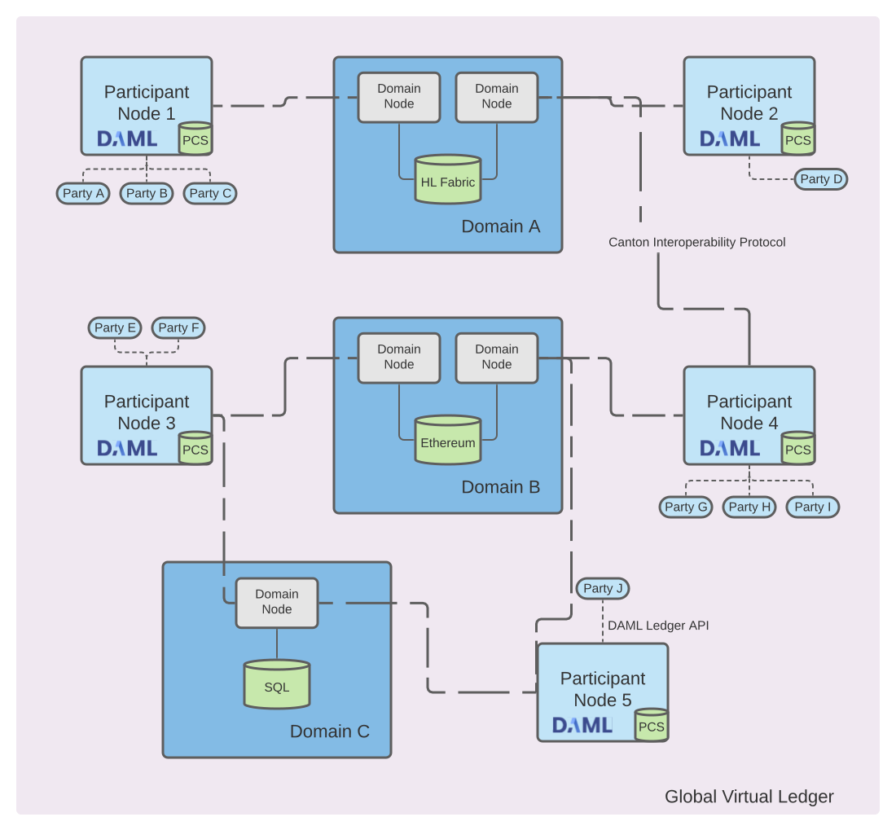

..
   Copyright (c) 2023 Digital Asset (Switzerland) GmbH and/or its affiliates.
..
   Proprietary code. All rights reserved.

Introduction to Canton
======================

Canton is a Daml ledger interoperability protocol.
Parties which are hosted on different participant nodes can transact using smart-contracts written in Daml and the Canton
protocol. The Canton protocol allows to connect different Daml ledgers into a single virtual global ledger.
Daml, as the smart contract language, defines who is entitled to see and who is authorized to change any given
contract. The Canton synchronization protocol enforces these visibility and authorization rules, and ensures that
the data is shared reliably with very high levels of privacy, even in the presence of malicious actors. The
Canton network can be extended without friction with new parties, ledgers, and applications building on other
applications. Extensions require neither a central managing entity nor consensus within the global network.

Canton faithfully implements the authorization and privacy requirements set out by Daml for its transactions.

.. https://app.lucidchart.com/documents/edit/da3c4533-a787-4669-b1e9-2446996072dc/0_0

   Parties are hosted on participant nodes. Applications connect as parties to their participant node using the Ledger API.
   The participant node runs the Daml interpreter for the locally installed Daml smart contract code and stores the smart contracts
   in the *private contract store (PCS)*. The participants connect to domains and synchronise their state
   with other participants by exchanging Canton protocol messages with other participants leveraging the domain
   services. The use of the Canton protocol creates a virtual global ledger.

Canton is written in Scala and runs as a Java process against a database (currently H2 and Postgres).
Canton is :ref:`easy to set up <installation>`, :ref:`easy to develop on <use-daml-sdk>` and is
:ref:`easy to operate safe and securely <requirements-functional>`.
