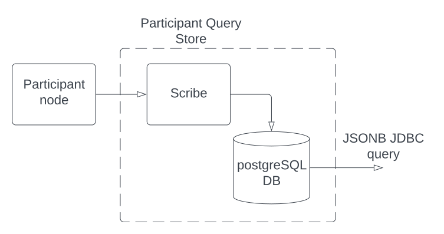

.. Copyright (c) 2023 Digital Asset (Switzerland) GmbH and/or its affiliates. All rights reserved.
.. SPDX-License-Identifier: Apache-2.0

Participant Query Store User Guide
##################################

Docker Image
************

You can get the Docker image with::

    docker pull digitalasset-docker.jfrog.io/participant-query-store:0.1.0

Introduction
************

The term operational datastore (ODS) usually refers to a database that mirrors
the ledger and allows for efficient querying. The Participant Query Store
(PQS) feature acts as an ODS for the participant node. PQS provides a
unidirectional path for exporting data from the ledger event stream to a
PostgreSQL datastore. Data is exported in an append-only fashion and provides
a stable view of data for purposes such as point-in-time queries. It stores
contract creation, contract archival, and exercise information in a PostgreSQL
database using a JSONB column format. You access the data using SQL over a
JDBC connection.

The PQS is intended for high throughput and complex queries, for which the Canton ledger (gRPC Ledger API) and the JSON API are not optimized. The PQS is useful for:

-  Application developers to access data on the ledger, observe the evolution of data, and debug their applications.
-  Business analysts to analyze ledger data and create reports.
-  Support teams to debug any problems that happen in production.
-  Application operators to take a full snapshot of the ledger (from the start of the ledger to the current latest transaction). Alternatively, they can take a partial snapshot of the ledger (between specific `offsets <https://docs.daml.com/app-dev/grpc/proto-docs.html#ledgeroffset>`__).
-  Report writers to extract historical data and then stream indefinitely (either from the start of the ledger or from a specific offset).

There are many other uses.

Overview
********

Architecture
============

The typical configuration is to have a separate PQS instance with its own DB for each participant node (shown in the figure). In this configuration, the PQS extracts contract information for all parties on the participant node. As data is physically segregated by Daml participants and hosted Daml parties must trust the node operator, they may trust the operator to protect the PQS privacy as well. A more restricted configuration is possible that limits the parties for which the PQS extracts information.

A client application can access the PQS directly using a JDBC connection where the data access rights are defined by the PostgreSQL database (left side in the figure). In this case, having access to the database means that the user has access to all the content in the database. If finer-grained access is needed, a read-only query service (right side in the figure) can be inserted between the client application and the PQS. That query service can filter out what a client application can see. This is a fairly `standard pattern <https://www.bezkoder.com/spring-boot-jdbctemplate-crud-example/>`__ in the industry.

.. image:: ./images/access-connection.svg
   :alt: A diagram showing different ways to connect to the Participant Query Store

To understand the format that PQS outputs into a Postgres document-oriented cache, you must understand how the ledger stores data. The Daml ledger is composed of transactions, which generate events. An event can represent one of these situations:

-  Creation of contracts ("create event")
-  Exercise of a choice on a contract ("exercise event"), which archives the contract if it is a consuming choice

A contract on the ledger is either created or archived. The relationships between transactions and contracts are captured in the database as follows:

-  All contracts have links (foreign keys) to the transaction in which they were created.
-  Archived contracts have pointers to the transaction in which they were archived.

Transactions on the ledger are inserted into PostgreSQL concurrently for high performance. Consistency for readers is provided through a watermark mechanism that indicates a consistent offset from which readers can consume for a fully consistent ledger. These details are managed for readers through the functions available in PostgreSQL. Depending on your needs, readers may wish to use or bypass these mechanisms, depending on the type of query and consistency required.

PQS schema design
=================

PQS is not directly involved in querying/reading the datastore - the
application is free to query it, such as via JDBC. The objectives of the
schema design is to facilitate:

-  **Scalable writes**: transactions are written in parallel, so
   writes do not need to be sequential.
-  **Scalable reads**: queries can be parallelized and are not
   blocked by writes. They produce sensible query plans with no
   unnecessary table scans.
-  **Ease of use**: readers can use familiar tools and techniques to
   query the datastore without needing to understand the specifics of
   the schema design. Simple entry points
   provide access to data in familiar ways. In particular, readers
   do not need to navigate the offset-based model.
-  **Read consistency**: readers can achieve the level of
   consistency that they require, including consistency with other
   ledger datastores, or with ledger commands that have been executed.

The following principles apply:

-  **Append-only**: only INSERTs are used, and no UPDATEs or DELETEs are
   used in transaction processing.
-  **Offset-based**: all physical tables are indexed by offset, meaning that
   all ledger data is known in terms of the offset in which it was
   committed to the ledger.
-  **Implicit offset**: readers can opt for queries with implicit offset,
   meaning they can ignore the role of offset in their queries but
   still provide a stable view of the ledger data. Much like PostgreSQL
   provides MVCC capabilities without the reader needing to understand
   the underlying implementation, this provides a similar
   experience for readers of the ledger data.
-  **Idempotent**: PQS is designed to be restarted at any time, and it will
   not impact the integrity of the data. This is achieved by using the
   offset-based model and ensuring that (other than the datastore
   itself) PQS is stateless.
-  **Watermarks**: PQS maintains a watermark of the latest contiguous
   offset, representing the point of the ledger that has been fully
   processed. This is used to ensure that the ledger data has read
   consistency, without requiring readers to perform table
   scans. This resolves the uncertainty created by the
   parallel writes.

JSON data
=========

Relational databases excel at storing structured data for which the schema is
known in advance. However, they have traditionally lacked mechanisms for data
that is more dynamic or evolves. For example, you may want to store arbitrary
Daml contracts and might prefer not to update the database schema every time
the underlying template changes.

PostgreSQL helps manage unstructured data through native support for JSON data
and allows queries to process this data. For best performance, the PQS stores
data as JSONB only.

An example query might look like this:

.. code-block:: none

    SELECT *
    FROM contract
    WHERE payload->>'isin' = 'abc123'
    ORDER BY payload->'issuanceData'->'issueDate'->>'Some';

For more information on querying JSON data, see the section `JSON Functions
and Operators <https://www.postgresql.org/docs/12/functions-json.html>`__ in
the PostgreSQL manual. The operators ``->``, ``->>``, ``#>``, ``#>>``, and
``@>`` may be of particular interest.

The :ref:`JSON format section below <pqs-json-encoding>` summarizes how the ledger data is encoded in JSON.

Continuity
==========

The PQS is intended for continuous operation. Upon restart after an interruption, PQS determines the last consistent offset and continues incremental processing from that point onward. PQS terminates when encountering any error and leaves it up to the orchestration layer (such as Kubernetes) or the operator to determine the appropriate course of action.

High availability
=================

Multiple isolated instances of PQS can be instantiated without any cross-dependency. This allows for an active-active high availability clustering model. Please note that different instances might not be at the same offset due to different processing rates or other factors. After querying one active instance, you can see results that are not yet visible on an alternative active instance. This requires consideration for the client to handle the situation where waiting or a retry is required to service "at least up to" requests.

How a participant node (PN) models time
***************************************

Understanding time in a distributed application is challenging because there is no global clock. This section describes how a participant node understands time. If you are familiar with Canton, skip this section and move to the section :ref:`Time Model within PQS <pqs-time-model>`.

A participant node models time advancing in its local ledger using an index called an *offset*. An offset is a unique index of the participant node's local ledger. You can think of this as selecting an item in the ledger using a specific offset (or index) into the ledger. For example, in the figure, Participant A has transaction “ABC” at offset #011. An offset represents a point in time of that participant node and a given domain, where the offset values order the events that are changes to the ledger. Specifically, subscribers to UpdateService observe the order for a specific domain. 

In general, a larger participant offset means that the event happened after the event at a smaller participant offset in that participant node. Since ledger entries can be made at any time, they can advance at different rates. For example, Participant A may only process requests every several minutes, so its offset counters increase slowly. However, Participant B may be processing requests very frequently, so its offset counters may increase several times a second. 

The sequence of offsets of a participant may contain gaps. That is because some offsets may be used for purposes internal to the participant that never show up on the ledger API. Also, filtering for certain types of changes (such as by party or by template ID) naturally results in gaps in the sequence of offsets.


You cannot compare offset values across participants. The same ledger change (such as a transaction) for multiple participant nodes is stored at a different offset in each participant node. For example, in the figure, the transaction ABC is at offset #011 in Participant A but at offset #010 in Participant B. Similarly, the same offset value across participant nodes refers to different ledger changes. In the figure, Participant A's offset #011 records “Tx ABC” while Participant B's offset #011 records “Tx DEF”. Comparing offsets across synchronization domains does not provide a causal ordering of the events because there is no common reference.

Single offset values returned by the Ledger API can be used as-is (for example, to keep track of processed transactions and provide an application restart point in case you need to retry the request). 

The Ledger API endpoints that take offset values also allow an offset range which is a portion of the participant's ledger that is relevant for the client to read. An offset range is analogous to a duration or slice of time. For example, a client application can specify the offset range from #010 through #012 to perform a search within Participant B's ledger.

Although the figure shows integers as an offset value, this may change. The format of offsets should be treated as opaque to the client. No client-side transformation of an offset (such as subtracting or adding one offset to another and using that in a ledger read)  is guaranteed to return a meaningful offset. However, you can always expect that offsets are lexicographically comparable.

A transaction ID compares to an offset in the following ways:
 
 - Not every offset has a transaction ID. For example, the completion event of a rejected transaction does not have a transaction ID because the transaction did not successfully complete.
 - There is, at most, one transaction ID at a single offset.
 - Every accepted transaction is published at a single offset. 
 - Offsets are local to a participant, whereas transaction IDs are virtual ledger-wide identifiers to correlate transactions across multiple participants.
 - Offsets can establish a temporal ordering within the same sync domain ("happened-before" relationship) between transactions and/or events from different transactions.

For analysis of a participant node's ledger, the offset is a better identifier than transaction ID because it can be used for ordering and an offset range can be specified to limit the analysis. However, if the analysis must coordinate with other participant nodes, then transaction IDs are better. 

If a participant node's ledger is restored from a backup, it reviews the data on the sequencer and processes it to the latest information. However, in performing this rehydration, the resulting PN can have a different set of offset values than it had before the backup. For Daml 2.x, the order of event processing and transaction IDs remain the same, but the resulting offsets likely change. If a client application caches offset data or stores it in a database, those datastores also need to be replayed to have the proper offset values of the restored participant node.

.. _pqs-time-model:

Time model within PQS
=====================

PQS builds on the offset concept of the participant node's ledger, and PQS is a valid representation of that ledger. PQS processes events asynchronously and concurrently, but the PQS programming model is intended to simplify development. The offset forms the basis for the PQS programming model. Helper functions make it easy to reason about offset values, pushing that complexity into the background. This section discusses how PQS models time.

NOTE:  Use of the helper functions is required for your application to upgrade in future releases. Direct table access is unsupported because the schema may change in a future release. There should be no inherent overhead in using the API so performance should not suffer.

The following figure shows the simplest view of a participant node and its query store. Consider the ledger client and PQS client as separate entities. The PQS consists of two components: Scribe and the PostgreSQL database.


The asynchronous and concurrent processing of an event can result in out-of-order results written to the database, but their offset values will correspond to the participant offset values. The following scenario illustrates this:

1. A participant emits a ledger event at offset #1, which is processed by Scribe and then immediately stored to the postgres database in a transaction.
2. A ledger event at offset #2 is passed to Scribe but does not finish processing immediately.
3. Scribe receives a ledger event at offset #3, processes it immediately, and stores it in the database.
4. Ledger event #2 finishes processing and is stored in the database. In this situation, the result for offset #3 is stored in the database before offset #2. The result for offset #3 could be queried without offset #2, which could result in an erroneous query result.

The asynchronous, concurrent processing of ledger events leads to four concepts related to offsets:

- **Processed**: ledger events that have been processed and the payload is stored in the database.
- **Watermark**: offset for the most recent consistent and stable event processed. As more events are processed, the watermark offset moves. The watermark can jump several offsets at once.
- **Gap events**: events that are in flight, being processed, and have not yet completed processing.
- **Flushed events**: events that have been processed, but their offset is later than the offset of (one or more) gap events.

The following section provides an example of these concepts.

Example Daml model
------------------

The example Daml model highlights the following:

- The time at which a ledger event begins and ends processing
- The offset where the event (such as contract creation) occurs
- The offset at which a contract is archived

The example is a mix of the wall clock time and offset information.

The example covers creation, modification, and retirement of birth certificates. The operations are:

- Create a birth certificate with a name.
- Archive a birth certificate.
- Change the name on a birth certificate, which creates a new contract and archives the prior contract, all in the same offset.
- Query a birth certificate which is done through PQS.

Only contract creation and archival are shown in a following figure.

A snippet of the example follows:

.. code-block:: none

    template BirthCertificate
      with
        owner : Party
        user_id : Text
        firstName : Text
        lastName : Text
      where
        signatory owner
        choice BirthCertificateNameChange : ContractId BirthCertificate
          with
            newFirstName : Text
            newLastName : Text
          controller owner
          do
            create BirthCertificate with
              owner = owner
              user_id = user_id
              firstName = newFirstName
              lastName = newLastName

The birth certificate for Alice Citizen is created in offset #1, and it is active for all the shown offsets (the white horizontal line in a following figure) because it is not archived. The processing of this event starts at the same time of the event and completes before the next event occurs, which is the creation of the “Joe Bloggs” certificate. Joe Bloggs is renamed to Fred Bloggs in offset #3, so the original certificate is archived while the new certificate is created in offset #3, all within the same transaction (transaction IDs are not shown). Fred Bloggs' birth certificate is archived at offset #4. Bill Myers' certificate is created at offset #5, renamed to Bill Taylor in offset #6, renamed again to Bill Doe in offset #8, and renamed yet again to Bill Kirk in offset #9. The birth certificate for Jill Brown is created in offset #10.

Note the birth certificate for Jane Smith. It is created at offset #7. However, the processing of this event is very long, taking the same time as processing the other events at offsets #8, #9, and #10. The processing time is so long that the events of offset offsets #8, #9, and #10 are committed to the PQS database before Jane Smith's birth certificate's offset. That means that any PQS queries involving offsets #7 or later will be inconsistent because they don't include the results of offset #7. In this case, the queries of processed event data involve offsets #1 through #6 (the blue and yellow swimlanes). The watermark is at slot #6 (the yellow swimlane) because it is the last stable offset to have its event processed. There is a gap (the purple swimlane) in the data for the inflight events that are still being processed. Lastly, there are flushed events (offset #9 and #10) where events were quickly processed and the data is available to be queried, but it is not accurate. This is because offset #7 has not been completed, and its data is not in the database.

When the processing of offset #7 finishes, just as the event from #11 arrives (not shown), the watermark jumps to offset #10 because that is the last stable offset with its event processed.


If you need to query consistent and stable data, always use the watermark as the most recent offset in the query. If a query is just a point-in-time value that does not have global consistency requirements, you don't need the watermark.

External Unsynchronized Data
============================

The previous section discussed how PQS deals with internal synchronization in its programming model. This section examines the external synchronization of data and the precautions you need to take. This section describes the time lags that the PQS client application needs to be aware of when querying data. The following figures follow the conventions described in the section `Architecture for HA and Scaling <https://docs.daml.com/deploy-daml/infrastructure-architecture/high-availability/ha-and-scaling/implementing-ha.html#architecture-for-ha-and-scaling>`__.

There are four cases to consider:

- The client application needs to retry an incomplete request, for example as the result of network issues.
- PQS needs to catch up after a fresh install or restart.
- There is a small delay for the ledger event to process.
- A high availability PQS configuration does not have synchronized PQS instances.

All distributed systems are subject to network issues. For example, networks that host the gRPC and JDBC query requests can both have intermittent issues. You must program the client application to retry for certain failures because the intermittent failure will heal itself. Most network outages are temporary, in which case the application can proceed without failing.


If the PQS has been (re)started or is freshly installed, then the PQS needs to catch up to the participant node's generated events. Until that happens, the PQS will not have all the data available for querying.

There is a slight delay between when a participant node has finished the ledger processing and emitted an event and when the PQS finishes processing the event so that the result is available to query. For example, if the participant query performs a synchronous exercise and then immediately queries the PQS, it is remotely possible that PQS will not yet have the data. In this case, the client application needs to retry.

Lastly, a highly available production deployment (see the following figure) has multiple PQS instances, each of which processes events at slightly different rates. Since the PQS instances are not synchronized, they process events and commit the results to the database with different times. If the client application makes a query to the PQS service which is being serviced by PQS #A and then PQS #A fails, the client application retries after a timeout, which is then serviced by PQS #B. It is possible that PQS #B does not have its watermark at the same offset as PQS #A when PQS #A failed.


Install and start PQS
*********************

Meet prerequisites
==================

Here are the prerequisites to run PQS:

-  A PostgreSQL database that can be reached from the PQS. Note that PQS uses the JSONB data type for storing JSON data, which requires Postgres versions 11 through 16.
-  An empty database (recommended) to avoid schema and table collisions.
-  Daml ledger as the source of events. m/TLS is supported for the participant node ledger API. Alternatively, it can run against the ``Sandbox``.
-  Installation of `The Daml Enterprise SDK <https://docs.daml.com/getting-started/installation.html#install-daml-enterprise>`__.

Deploy the Scribe component
===========================

The PQS consists of two components: the PostgreSQL database and a ledger component called *Scribe*, as shown in the figure. Scribe is packaged as a Java JAR file and is available from `the Digital Asset Artifactory path <https://digitalasset.jfrog.io/ui/native/scribe>`__.



Connect the PQS to a ledger
===========================

To connect to the participant node ledger, provide separate address and port parameters. For example, you could specify ``--host 10.1.1.10 --port 6865``, or in short form ``-h 10.1.1.168 -p 6865``.

You do not need to pass the default host ``localhost`` and default port ``6865``.

To connect to a participant node, you might need to provide TLS certificates. To see options for this, refer to the output of the ``--help`` command.

Authorize PQS
=============

If you are running PQS against a participant node's ledger API that verifies authorization, you must provide credentials for the `OAuth Client Credentials Flow <https://auth0.com/docs/get-started/authentication-and-authorization-flow/client-credentials-flow>`__. For example:

.. code-block:: bash

  $ ./scribe.jar pipeline ledger postgres-document \
      --source-ledger-auth OAuth \
      --pipeline-oauth-clientid my_client_id \
      --pipeline-oauth-clientsecret deadbeef \
      --pipeline-oauth-cafile ca.crt \
      --pipeline-oauth-endpoint https://my-auth-server/token

The type of access token that PQS expects is Audience / Scope based tokens (see “\ `User Access Tokens <https://docs.daml.com/app-dev/authorization.html#user-access-tokens>`__\ ” for more information).

Scribe will obtain tokens from the Authorization Server on startup, and it will reauthenticate before the token expires. If Scribe fails authorization, it will terminate with an error for the service orchestration infrastructure to respond appropriately.

If you are not authenticated, there is no user to connect to a list of
``readAs`` parties, so you must specify the parties using the
``-pipeline-parties`` argument. This argument acts as a filter, restricting
the data to only what's visible to the supplied list of party identifiers. 

The authentication of PQS needs to match the participant nodes (PN) setup. For
example, if PQS is run with authentication by setting OAuth and the PN is not
configured to use authentication, then an error will result. The error will
have a message like ``requests with an empty user-id are only supported if
there is an authenticated user``.

Set up PostgreSQL
=================

To connect the database, create a PostgreSQL database with three users:

-  **Ops**: Provides a way for database administrators or Scribe to access DDL for schema creation and general maintenance.
-  **Writer**: Allows Scribe to connect, such as during "pipeline" operations of writing the ledger.
-  **Reader**: Supports all other users.

Connect to the PQS PostgreSQL datastore
=======================================

The database connection is handled by the JDBC API, so you need to provide the following (all have defaults):

-  Hostname
-  Port number
-  Username
-  Password

The following example connects to a PostgreSQL instance running on localhost on the default port, with a user for which Postgres has not set a password and a database called ``daml_pqs``. This is a typical setup on a developer machine with a default PostgreSQL install.

.. code-block:: bash

    $ ./scribe.jar pipeline ledger postgres-document \
         --target-postgres-database daml_pqs

The next example connects to a database on host ``192.168.1.12``, listening on port ``5432``. The database is called ``daml_pqs``.

.. code-block:: bash

    $ ./scribe.jar pipeline ledger postgres-document \
         --target-postgres-host 192.168.1.12 \
         --target-postgres-database daml_pqs

Logging
=======

By default, the PQS logs to ``stderr``, with ``INFO`` verbose level. To change the level, use the ``--logger-level enum`` option, as in the example ``--logger-level Trace``.

Using command line options
==========================

You can discover commands and parameters through the embedded ``--help`` (remember to include ``pipeline`` before ``--help``), as shown in the following example.

.. code-block:: bash

    ./scribe.jar pipeline --help
    Usage: scribe pipeline SOURCE TARGET [OPTIONS]

    Initiate continuous ledger data export

    Available sources:
      ledger    Daml ledger

    Available targets:
      postgres-document    Postgres database (w/ document payload representation)
      
    Options:
      --config file                              Path to configuration overrides via an external HOCON file (optional)
      --pipeline-datasource enum                 Ledger API service to use as data source (default: TransactionStream)
      --pipeline-oauth-clientid string           Client's identifier (optional)
      --pipeline-oauth-accesstoken string        Access token (optional)
   --pipeline-oauth-parameters map            Custom parameters
   --pipeline-oauth-cafile file               Trusted Certificate Authority (CA) certificate (optional)
      --pipeline-oauth-endpoint uri              Token endpoint URL (optional)
      --pipeline-oauth-clientsecret string       Client's secret (optional)
      --pipeline-filter-parties string           Filter expression determining Daml party identifiers to filter on (default: *)
   --pipeline-filter-metadata string          Filter expression determining which templates and interfaces to capture metadata for (default: !*)
   --pipeline-filter-contracts string         Filter expression determining which templates and interfaces to include (default: *)
      --pipeline-ledger-start [enum | string]    Start offset (default: Latest)
      --pipeline-ledger-stop [enum | string]     Stop offset (default: Never)
      --health-port int                          HTTP port to use to expose application health info (default: 8080)
      --logger-level enum                        Log level (default: Info)
      --logger-mappings map                      Custom mappings for log levels
      --logger-format enum                       Log output format (default: Plain)
      --logger-pattern [enum | string]           Log pattern (default: Plain)
      --target-postgres-host string              Postgres host (default: localhost)
      --target-postgres-tls-mode enum            SSL mode required for Postgres connectivity (default: Disable)
      --target-postgres-tls-cert file            Client's certificate (optional)
      --target-postgres-tls-key file             Client's private key (optional)
      --target-postgres-tls-cafile file          Trusted Certificate Authority (CA) certificate (optional)
   --target-postgres-maxconnections int       Maximum number of JDBC connections (default: 16)
      --target-postgres-password string          Postgres user password (default: ********)
      --target-postgres-username string          Postgres user name (default: postgres)
      --target-postgres-database string          Postgres database (default: postgres)
      --target-postgres-port int                 Postgres port (default: 5432)
      --target-schema-autoapply boolean          Apply metadata inferred schema on startup (default: true)
      --source-ledger-host string                Ledger API host (default: localhost)
      --source-ledger-auth enum                  Authorisation mode (default: NoAuth)
      --source-ledger-tls-cafile file            Trusted Certificate Authority (CA) certificate (optional)
      --source-ledger-tls-cert file              Client's certificate (leave empty if embedded into private key file) (optional)
      --source-ledger-tls-key file               Client's private key (leave empty for server-only TLS) (optional)
      --source-ledger-port int                   Ledger API port (default: 6865)

For more help, use the command:

.. code-block:: bash

    ./scribe.jar pipeline --help-verbose

Use a ``--config`` file to define multiple options or reflect an infrastructure-as-code approach. Here's an example configuration file:

.. code-block:: none
   
   {
      health.port = 8080

      logger {
         # level = "Debug"
         format = "Plain"
         pattern = "Plain"
      }

      pipeline {
         datasource = "TransactionStream"

         filter {
            parties = "*"
            metadata = "!*"
            contracts = "*"
         }

         ledger {
            start = "Latest"
            stop = "Never"
         }
      }

      source {
         ledger {
            host = "canton"
            port = 10011
         }
      }

      target {
         postgres {
            host = "pqs-postgres"
            port = 5432
            username = "postgres"
            database = "postgres"
            maxConnections = 16
         }
      }
      schema.autoApply = true
   }

Following is an example of a basic command to run PQS to extract all data, including exercises, for a party with the display name Alice. You can replace the argument values with those that match your environment.

.. code-block:: bash

    $ ./scribe.jar pipeline ledger postgres-document \
    --pipeline-parties Alice::12209942561b94adc057995f9ffca5a0b974953e72ba25e0eb158e05c801149639b9 \
    --pipeline-datasource TransactionTreeStream \
    --source-ledger-host localhost \
    --source-ledger-port 6865 \
    --target-postgres-host localhost \
    --target-postgres-port 5432 \
    --target-postgres-database postgres \
    --target-postgres-username postgres \
    --target-postgres-password postgres

NOTE: Only ``postgres-document`` is currently implemented, with ``postgres-relational`` to follow soon.

The ``-pipeline-ledger-start`` argument is an enum with the following possible values:

-  ``Latest``: Use the latest offset that is known or resume where it left off. This is the default behavior, where streaming starts at the latest known end. The first time you start, this will result in PQS calling ``ActiveContractService`` to get a state snapshot, which it will load into the ``_creates`` table. It will then start streaming creates, archives, and (optionally) exercises from the offset of that ``ActiveContractService``. When you restart PQS, it will start from the point it last left off. You should always use this mode on restart.
-  ``Genesis``: Use the first original offset of the ledger. This causes PQS to try to start from offset ``0``. It allows you to load historic creates, archives or (optionally) exercises from a ledger that already has data on it. If you try to restart on an already populated database in this mode, PQS will rewrite data if it needs to.
-  ``Oldest``: Use the oldest available (unpruned) offset on the ledger or resume where it left off.

PQS is able to start and finish at prescribed ledger offsets, specified by the
arguments ``--pipeline-ledger-start`` and ``--pipeline-ledger-stop``. The
``./scribe.jar pipeline --help-verbose`` command provides extensive help
information.

The ``--pipeline-filter string`` option needs a filter expression to determine
which templates and interfaces to include. A filter expression is a simple wildcard
inclusion statement with basic Boolean logic, where whitespace is ignored. Below are some examples:

- ``*``: everything, which is the default
- ``a.b.c.Bar``: just this one fully qualified name
- ``a.b.c.*``: all under the ``a.b.c`` namespace
- ``deadbeef..:a.b.c.Foo`` just this one fully qualified name from this specific package ID
- ``!a.b.c.Bar``: everything except this fully qualified name
- ``a.b.c.Foo & a.b.c.Bar``: this is an error because it can't be both
- ``(a.b.c.Foo | a.b.c.Bar)``: these two fully qualified names
- ``(a.b.c.* & !(a.b.c.Foo | a.b.c.Bar) | g.e.f.Baz)``: everything in ``a.b.c`` except for ``Foo`` and ``Bar``, and also include ``g.e.f.Baz``

The ``--pipeline-parties`` option supports the same filter expressions as the
``--pipeline-filter``. So to filter for two parties ``alice::abc123...`` and
``bob::def567...``, you could write ``--pipeline-parties="(alice* | bob*)"``.
If you want to specify a specific party, include the hash behind the party
hint (such as
``Alice_1::122055fc4b190e3ff438587b699495a4b6388e911e2305f7e013af160f49a76080ab``). 

Please note that the separator is a pipe character (``|``) instead of a comma.

Brackets are unnecessary for simple expressions. A simple list is
``--pipeline-parties="Alice_1::122055fc4b190e3ff438587b699495a4b6388e911e2305f7e013af160f49a76080ab
|
Alice_2::122053933e4803c2995e41faa8a29981ca0d1faf6b4ffbf917ba1edd0db133acb634
| Peter-1::358400000000000000000000000`` Specifying the parties in a short
form can be done by using the ``*`` as a wildcard. For example,
``--pipeline-parties="Alice* | *358400000000000000000000000"`` selects
``Alice_1``, ``Alice_2``, and ``Peter-1``. 

More advanced expressions can make use of brackets, such as
``--pipeline-parties="Alice* | Bob* | (participant* & !(participant3::*))"``.  


Handle configuration changes
============================

PQS initializes its behavior on startup by reading its configuration files.
It currently doesn't support dynamic configuration updates, so making a
configuration change (such as adding a new party, new template, or new
interface) requires stopping PQS, modifying its configuration, and then
starting PQS. On startup, PQS will read the updated configuration.  

When the configuration changes, the default is that PQS will not go back in
time (older offset) but only move forward in time (current watermark offset
and newer). If the database is dropped, then PQS can be started at the
oldest, unpruned offset of the participant node and use the participant node's
history to extract the events based on the updated configuration.  


PQS development
***************

Offset management for querying
==============================

The following functions control the temporal perspective of the ledger,
considering how you wish to consider time as a scope for your queries.
You may wish to:

-  Effectively ignore time; simply query the *latest available* state
-  Query the state of the ledger at a specific time in history
-  Query the ledger events across a time range -- an audit trail, for example
-  Query the ledger in a way that preserves consistency with other
   interactions you have had with the ledger (reader or writer)

The following functions allow you to control the temporal scope of the
ledger, which establishes the context in which subsequent queries in the
PostgreSQL session will execute:

-  ``set_latest(offset)``: nominates the offset of the latest data to
   include in observing the ledger. If NULL, it uses the very latest
   available. The actual offset that will be used is returned. If the
   supplied offset is beyond what is available, an error occurs.
-  ``set_latest_minimum(offset)``: provides the minimum offset that
   should be used, but a more recent offset will always be chosen.
   Returns an error if the nominated offset is not yet available.
   The function returns the actual offset used.
-  ``set_oldest(offset)``: nominates the offset of the oldest events to
   include in the query scope. If ``NULL``, it uses the oldest available.
   The function returns the actual offset used. If the supplied offset is
   beyond what is available, an error occurs.
-  ``get_offset(time)``: provides a helper function to determine the offset of a
   given ``time`` (or interval prior to now).

Under this temporal scope, the following `table
functions <https://www.postgresql.org/docs/current/queries-table-expressions.html>`__
allow access to the ledger and are used directly in queries. They
can be used in a similar manner to tables or views and allow
users to focus on the data they wish to query, with the impact of
offsets removed.

-  ``active(name)``: active instances of the target contracts/interfaces
   that existed at the time of the latest offset
-  ``creates(name)``: create events that occurred between the oldest and
   latest offset
-  ``archives(name)``: archive events that occurred between the oldest
   and latest offset
-  ``exercises(name)``: exercise events that occurred between the oldest
   and latest offset

The functions allow the user to focus on the
templates/interfaces/choices they wish to query, without concern for
`PostgreSQL name
limits <https://www.postgresql.org/docs/current/sql-syntax-lexical.html#:~:text=maximum%20identifier%20length%20is%2063%20bytes>`__.
The ``name`` parameter can be used with or without the package
specified:

-  Fully qualified:
   ``<package-id>:<module>:<template|interface|choice>``
-  Partially qualified: ``<module>:<template|interface|choice>``


Query patterns
==============

Several common ways to use the table functions are described in the following sections:

- Use the most recent available state of the ledger
- Query the ledger using a point in time
- Query the ledger from a fixed offset
- Set the oldest offset to consider
- Set the oldest and latest offset by time value
- Set a minimum offset for consistency
- Use the widest available offset range for querying

These can be combined or altered for the purpose of the query.

Use the most recent available state of the ledger
-------------------------------------------------

In this pattern, a user wants to query the most recent available state of the ledger. This user
treats the ledger Active Contract Set as a virtual database table and is not
concerned with offsets because the latest result is desired.

This user wants to query the (latest) state of the ledger 
without consideration for offsets. Querying is inherently limited to one
data source, as the user has no control over the actual offset that will
be used.

In this scenario, the user wishes to query all Daml templates of ``User``
within the ``Test.User`` templates, where the user is not an
administrator:

.. code-block:: sql

   set_offset_latest(NULL);
   SELECT *
     FROM active('Test.User:User') AS "user"
     WHERE NOT "user"."admin";

By using PostgreSQL’s JSONB querying capabilities, you can join with the
related ``Alias`` template to provide an overview of all users and their
aliases:

.. code-block:: sql

   set_latest(NULL);
   SELECT "user".*, alias.*
     FROM active('Test.User:User') AS "user"
       LEFT JOIN active('Test.User:Alias') AS alias
         ON "user".payload->>'user_id' = alias.payload->>'user_id';

Historical events can also be accessed; by default all the history in
the datastore is available for querying. The following query returns
the data associated with all ``User`` contracts that were archived in
the available history:

.. code-block:: sql

   set_latest(NULL);
   set_oldest(NULL);
   SELECT c.*
     FROM archive('Test.User:User') AS a
       JOIN create('Test.User:User') AS c USING contract_id;

Query the ledger using a point in time
--------------------------------------

In this pattern, a report writer wants to query the ledger as of a known historical point in
time to ensure that consistent data is provided regardless of where the
ledger subsequently evolved.

This user can obtain a point-in-time view of the ledger to see all
non-admin ``User`` templates that were active at that point in time:

.. code-block:: sql

   set_latest(get_offset('2020-01-01 00:00:00+0'));
   SELECT "user".*
     FROM active('Test.User:User') AS "user"
     WHERE NOT "user".admin;

The user can then query the history of the ledger to see
how many aliases have existed for each of these users who were
active at the snapshot time:

.. code-block:: sql

   set_latest(get_offset('2020-01-01 00:00:00+0'));
   set_oldest(NULL);
   WITH "users" AS (
     SELECT  "user".*
       FROM active('Test.User:User') AS "user"
       WHERE NOT "user".admin
   )
   SELECT "user".user_id, COUNT(alias.*) AS alias_count
     FROM active('Test.User:User') AS "user"
       JOIN create('Test.User:Alias') AS alias
         ON "user".payload->>'user_id' = alias.payload->>'user_id'
     WHERE NOT "user".admin;

Query the ledger from a fixed offset
------------------------------------

In this pattern, an automation user wants to query from fixed known offsets and wants to
write a query in the same, familiar way.

.. code-block:: sql

   -- fails if the datastore has not yet reached the given offset
   set_latest("00000001250");

The queries observe active contracts from the given
offset. The example queries presented above are unchanged.


Set the oldest offset to consider
---------------------------------

In this pattern, a user wants to present a limited amount of history to users. 

If readers wish to limit the event history, they can call:

.. code-block:: sql

   -- fails if this offset has already been pruned
   set_oldest("00000000500");

This adjustment in scope does not affect the example queries presented
above.

Set the oldest and latest offset by time value
----------------------------------------------

In this pattern, a user wants to present a time-based view to users to provide reports
based on point-in-time rather than offsets:

.. code-block:: sql

   set_latest(get_offset(TIMESTAMP '2020-03-13 00:00:00+0'))
   set_oldest(get_offset(INTERVAL '14 days')); -- history of the past 14 days


Set a minimum offset for consistency
------------------------------------

For this pattern, a website user wants to query active contracts after
completing a command (write) which updated the ledger. The user
does not want to see a version of the ledger prior to the command
being executed.

.. code-block:: sql

   -- The user just executed a command at offset #00000001350.
   -- This function call will fail if the datastore has not yet reached this offset, in order to provide consistent reads.
   -- If it has an even more recent offset (eg. 00000001355) - this will be used instead.
   set_latest_minimum("00000001350");


Use the widest available offset range for querying
--------------------------------------------------

In this pattern, a user wants to enquire about the offset availability of the datastore.

In this example, the user asks for the very latest and oldest offsets available, and those offsets are returned:

.. code-block:: sql

   SELECT set_latest(NULL) AS latest_offset, set_oldest(NULL) AS oldest_offset;


Advanced querying topics
========================

Reading
-------

There are two distinct approaches for querying ledger
data in the datastore: state and events.

*State*, in the form of the Active Contract Set by the function
``active(name)``, uses the latest offset only, using the following rules:

.. code-block:: none

  creation_offset <= latest_offset; AND
  no archive_offset <= latest_offset

*Events* (create, exercise, archive) make use of the oldest and
latest range offset:

.. code-block:: none

  event_offset <= latest_offset; AND
  event_offset >= oldest_offset

Write pipeline
--------------

Typically, you don't need to be concerned with how the
write pipeline is implemented. The above Read API takes
the write pipeline implementation into consideration.
The above Read API is the recommended way to query the
datastore. The following information is provided for completeness.

A Daml transaction is a collection of events that take effect on the
ledger atomically. However, for performance
reasons, these transactions are written to the datastore *in parallel*.
Although the datastore is written to in a purely append-only fashion,
it is not guaranteed that these transactions are visible to
readers in order. The offset-based model makes the database's isolation
level irrelevant, so the loosest model (``read uncommitted``) is not
harmful.

When querying the datastore, first consider the type of
read consistency required. If there is no need for consistency (for example,
reading a historical contract regardless of lifetime), you can query payload
tables directly without any consideration of offset.
Another example is a liveness metric query that calculates the
number of transactions in the datastore over the past minute.
This could be valid without considering the
parallel-writing method.

When consistency is required, the reader must be aware of the offset
for reading. This ensures the reader doesn't also read
further offsets that are present when their precedent events are not yet
stored in the database.

To achieve the level of consistency that you require, including
read-consistency with other ledger data or commands you have executed,
consider providing a function that returns the latest
checkpoint offset:

.. code-block:: none

   -- utility functions
   create or replace function latest_checkpoint()
   returns table ("offset" _transactions."offset"%type, ix _transactions.ix%type) as $$
     select max(groups."offset") as "offset", max(groups."ix") as ix
     from (SELECT ix - ROW_NUMBER() OVER (ORDER BY ix) as delta, * FROM _transactions) groups
     group by groups.delta
     order by groups.delta
     limit 1;

   $$ language sql;
   create or replace function first_checkpoint()
   returns table ("offset" _transactions."offset"%type, ix _transactions.ix%type) as $$
     select t."offset" as "offset", t."ix" as ix from _transactions t order by ix limit 1;


Note that the ``Archive`` table represents all ``Archive`` choices in the given
namespace, such as ``User.Archive`` and ``Alias.Archive`` in the ``User`` namespace.

JSON format
===========

PQS stores create and exercise arguments using a `Daml-LF JSON-based encoding <https://docs.daml.com/json-api/lf-value-specification.html#daml-lf-json-encoding>`__ of Daml-LF values. An overview of the encoding is provided below. For more details, refer to `the Daml-LF page <https://docs.daml.com/json-api/lf-value-specification.html#daml-lf-json-encoding>`__.

.. _pqs-json-encoding:

Values on the ledger can be primitive types, user-defined records, or variants. An extracted contract is represented in the database as a record of its create argument. The fields of that record are primitive types, other records, or variants. A contract can be a recursive structure of arbitrary depth.

These types are translated to `JSON types <https://json-schema.org/understanding-json-schema/reference/index.html>`__ as follows:

Primitive types
---------------

- ``ContractID``: represented as `string <https://json-schema.org/understanding-json-schema/reference/string.html>`__.
- ``Int64``: represented as `string <https://json-schema.org/understanding-json-schema/reference/string.html>`__.
- ``Decimal``: represented as `string <https://json-schema.org/understanding-json-schema/reference/string.html>`__.
- ``List``: represented as `array <https://json-schema.org/understanding-json-schema/reference/array.html>`__.
- ``Text``: represented as `string <https://json-schema.org/understanding-json-schema/reference/string.html>`__.
- ``Date``: days since the Unix epoch, represented as `integer <https://json-schema.org/understanding-json-schema/reference/numeric.html#integer>`__.
- ``Time``: microseconds since the UNIX epoch, represented as `number <https://json-schema.org/understanding-json-schema/reference/numeric.html#number>`__.
- ``Bool``: represented as `boolean <https://json-schema.org/understanding-json-schema/reference/boolean.html>`__.
- ``Party``: represented as `string <https://json-schema.org/understanding-json-schema/reference/string.html>`__.
- ``Unit`` and ``Empty``: Represented as empty records.
- ``Optional``: represented as `object <https://json-schema.org/understanding-json-schema/reference/object.html>`__. It is a variant with two possible constructors: ``None`` and ``Some``.

User-defined types
------------------

- ``Record``: represented as `object <https://json-schema.org/understanding-json-schema/reference/object.html>`__, where each create parameter's name is a key, and the parameter's value is the JSON-encoded value.
- ``Variant``: represented as `object <https://json-schema.org/understanding-json-schema/reference/object.html>`__, using the ``{constructor: body}`` format, such as ``{"Left": true}``.

Display of metadata-inferred database schema
============================================

PQS analyzes package metadata as part of its operation and displays the required schema as shown in the following example:

.. code-block:: bash

    $ ./scribe.jar datastore postgres-document schema show
    [...]
    /**********************************************************
    * generated by scribe, version: v0.0.1-main+2151-7961ecb *
    **********************************************************/
    -- tables
    create table if not exists _transactions (
    "offset" text primary key not null,
    ix bigint not null,
    transaction_id text,
    effective_at timestamp with time zone,
    workflow_id text
    );
    [...]

*or* it applies the schema on the fly idempotently (default).

.. code-block:: bash

    $ ./scribe.jar pipeline ledger postgres-document --pipeline-party=Alice
    18:27:26.799 I [zio-fiber-64] com.digitalasset.scribe.appversion.package:11 scribe, version: v0.0.1-main+2151-7961ecb
    18:27:27.159 I [zio-fiber-68] com.digitalasset.scribe.configuration.package:40 Applied configuration:
    pipeline {
    datasource=TransactionStream
    [...]
    18:27:28.714 I [zio-fiber-67] com.digitalasset.scribe.postgres.document.DocumentPostgres.Service:36 Applying schema
    18:27:28.805 I [zio-fiber-67] com.digitalasset.scribe.postgres.document.DocumentPostgres.Service:39 Schema applied
    18:27:28.863 I [zio-fiber-0] com.digitalasset.scribe.pipeline.pipeline.Impl:29 Starting pipeline on behalf of
    'party-e303d252-1e35-46cb-b4e6-06538271d927::1220883670ff44119c947deeabb2e07827adff83bed3e1a897f53f73b0f61d509952'
    18:27:29.043 I [zio-fiber-0] com.digitalasset.scribe.pipeline.pipeline.Impl:57 Last checkpoint is absent.
    Seeding from ACS before processing transactions with starting offset '000000000000000008'
    18:27:29.063 I [zio-fiber-938] com.digitalasset.zio.daml.Ledger.Impl:191 Contract filter inclusive of 2 templates
    and 0 interfaces
    18:27:29.120 I [zio-fiber-0] com.digitalasset.scribe.pipeline.pipeline.Impl:74 Continuing from offset 'GENESIS' and
    index '0' until offset 'INFINITY'
    18:27:29.159 I [zio-fiber-967] com.digitalasset.zio.daml.Ledger.Impl:191 Contract filter inclusive of 2 templates
    and 0 interfaces
    [...]

PQS database schema
===================

The following schema is representative for the exported ledger data. It is subject to change since it is hidden behind the table functions.

.. code-block:: bash

    /**********************************************************
     * generated by scribe, version: v0.0.1-main+2151-7961ecb *
     **********************************************************/
     -- tables
     create table if not exists _transactions (
       "offset" text primary key not null,
       ix bigint not null,
       transaction_id text,
       effective_at timestamp with time zone,
       workflow_id text
     );

     create table if not exists _exercises (
       event_id text primary key not null,
       choice text not null,
       contract_id text not null,
       "offset" text not null references _transactions ("offset") on delete cascade on update cascade,
       consuming bool,
       witnesses text[],
       parent text references _exercises (event_id) on delete cascade
     );

     create table if not exists _creates (
       event_id text primary key not null,
       contract_id text not null,
       "offset" text not null references _transactions ("offset") on delete cascade on update cascade,
       witnesses text[],
       parent text references _exercises (event_id) on delete cascade
     );

     create table if not exists _archives (
       event_id text primary key not null,
       contract_id text not null,
       "offset" text not null references _transactions ("offset") on delete cascade on update cascade
     );

     create table if not exists _mappings (
       daml_fqn text primary key not null,
       pg_identifier text not null unique
     );

     -- PAYLOAD TABLES
     create table if not exists "Alias.39p75i" (
       event_id text primary key not null references _creates (event_id) on delete cascade,
       identifier text not null,
       contract_key jsonb,
       payload jsonb not null
     );

     create table if not exists "User.11jk59n1" (
       event_id text primary key not null references _creates (event_id) on delete cascade,
       identifier text not null,
       contract_key jsonb,
       payload jsonb not null
     );

     create table if not exists "Archive.2gpwea" (
       event_id text primary key not null references _exercises (event_id) ondelete cascade,
       identifier text not null,
       argument jsonb not null,
       result jsonb not null
     );

     create table if not exists "Alias_Change.11wa21n1" (
       event_id text primary key not null references _exercises (event_id) on delete cascade,
       identifier text not null,
       argument jsonb not null,
       result jsonb not null
     );

     create table if not exists "User_Follow.11q646ez" (
       event_id text primary key not null references _exercises (event_id) on delete cascade,
       identifier text not null,
       argument jsonb not null,
       result jsonb not null
     );

Note that the Archive table represents all Archive choices in the given namespace, such as ``User.Archive`` and ``Alias.Archive`` in the User namespace.

Operate PQS
***********

This section discusses common tasks when operating a PQS.

Purge excessive historical ledger data
======================================

Pruning ledger data from the PQS database can reduce storage size and
improve query performance by removing old data. PQS
provides two approaches to prune ledger data: using the PQS CLI or
using the ``prune_to_offset`` PostgreSQL function.

**WARNING:** Calling either the ``prune`` CLI command with
``--prune-mode Force`` or calling the PostgreSQL function
``prune_to_offset`` deletes data irrevocably.

Both pruning approaches (CLI and PostgreSQL function) share the same
behavior in terms of data deletion and changes.

Active contracts are preserved under a new offset, while all other
transaction-related data up to and including the target offset is
deleted.

.. _pqs-pruning-behavior:

The target offset (the offset provided by ``--prune-target`` or as an
argument to ``prune_to_offset``) is the transaction with the highest
offset to be deleted by the pruning operation.

Note: If the provided offset (by ``--prune-target`` or as an
argument to ``prune_to_offset``) doesn't have a transaction record,
the effective target offset is the oldest transaction offset
that succeeds (is greater than) the provided offset.

When using either pruning method, the following data changes:

-  The offset of active contracts moves to the oldest known
   offset that succeeds the pruning target offset, which is the offset of
   the oldest transaction that is unaffected by the pruning operation.

The following data is deleted:

-  Transactions with offsets up to and including the target offset.
-  Events, archived contracts, and exercise payloads associated with the
   deleted transactions.

The following data is unaffected: 

- Transaction-related data (event, choices, or contracts) for a transaction with
  an offset that is greater than the effective pruning target offset.

Pruning is a destructive operation and cannot be undone. If necessary,
make sure to back up your data before performing any pruning operations.

There are some constraints when using either pruning method:

-  The provided target offset must be within the bounds of the
   contiguous history. If the target offset is outside the bounds, an
   error is raised.
-  The pruning operation cannot coincide with the latest consistent
   checkpoint of the contiguous history. If it does, an error is
   raised.

Prune with PQS CLI
------------------

The PQS CLI provides a ``prune`` command to prune the
ledger data up to a specified offset, timestamp, or duration.

For detailed information on all available options, please run
``./PQS.jar datastore postgres-document prune --help-verbose``.

To use the ``prune`` command, provide a pruning target as an
argument. The pruning target can be an offset, a timestamp (ISO 8601),
or a duration (ISO 8601):

::

   ./PQS.jar datastore postgres-document prune --prune-target <pruning_target>

By default, the ``prune`` command performs a dry run, which means it
will only display the effects of the pruning operation without actually
deleting any data. To execute the pruning operation, add the
``--prune-mode Force`` option:

::

   ./PQS.jar datastore postgres-document prune --prune-target <pruning_target> --prune-mode Force

Instead of providing an offset as the ``--prune-target``, you can use a timestamp
or duration as the pruning cutoff. For example, the following command prunes
data older than 30 days (relative to now):

::

   ./PQS.jar datastore postgres-document prune --prune-target P30D

The following example prunes data up to a specific timestamp:

::

   ./PQS.jar datastore postgres-document prune --prune-target 2023-01-30T00:00:00.000Z

Prune with ``prune_to_offset``
------------------------------

The ``prune_to_offset`` PostgreSQL function
prunes ledger data up to a specified offset. It has the same
behavior as the ``datastore postgres-document prune`` command, except it does not
offer dry runs.

To use ``prune_to_offset``, provide an offset as a text
argument:

.. code:: sql

   SELECT * FROM prune_to_offset('<offset>');

This function deletes transactions and updates active contracts as
described :ref:`earlier in this section <pqs-pruning-behavior>`.

To prune data up to a specific timestamp or interval, use ``prune_to_offset`` 
in combination with the ``get_offset`` function. For example, the following 
query prunes data older than 30 days:

.. code:: sql

   SELECT * FROM prune_to_offset(get_offset(interval '30 days'));


Optimize PQS
************

This section briefly discusses optimizing a database. The topic is broad, and there are many resources available. Refer to the `PostgreSQL documentation <https://www.postgresql.org/docs/>`__ for more information.

Indexing
========

Indexes are an important tool to make queries with (JSON) expressions perform well. Here is one example of an index:

.. code-block:: none

    CREATE INDEX issueDateIdx
    ON contract
    USING BTREE ((payload->'issuanceData'->'issueDate'->>'Some'));

In this example, the index allows comparisons on the issue date. It has the additional advantage that the results of the JSON query ``payload->'issuanceData'->'issueDate'->>'Some'`` are cached and do not have to be recomputed for every access.

PostgreSQL provides several index types, including B-tree, Hash, GiST, SP-GiST, GIN, and BRIN. Each index type uses a different algorithm that is best suited to different types of queries. The table below provides a basic explanation of where they can be used. For a more thorough understanding, consult the `chapter on indexes <https://www.postgresql.org/docs/current/indexes.html>`__ in the PostgreSQL manual.

+-----------+----------------------------------------------------------+
| Index     | Comment                                                  |
| Type      |                                                          |
+===========+==========================================================+
| Hash      | Compact. Useful only for filters that use =.             |
+-----------+----------------------------------------------------------+
| B-tree    | Can be used in filters that use <, <=, =, >=, > as well  |
|           | as postfix string comparisons (e.g. LIKE 'foo%').        |
|           | B-trees can also speed up ORDER BY clauses and can be    |
|           | used to retrieve subexpressions values from the index    |
|           | rather than evaluating the subexpressions (i.e. when     |
|           | used in a SELECT clause).                                |
+-----------+----------------------------------------------------------+
| GIN       | Useful for subset operators.                             |
+-----------+----------------------------------------------------------+
| GiST,     | See manual.                                              |
| SP-GiST   |                                                          |
+-----------+----------------------------------------------------------+
| BRIN      | Efficient for tables where rows are already physically   |
|           | sorted for a particular column.                          |
+-----------+----------------------------------------------------------+

Pagination
==========

Pagination refers to splitting up large result sets into pages of up to ``n`` results. It can allow user navigation such as moving to the next page to display, going to the end of the result set, or jumping around in the middle. It can be a very effective user experience when there is a large ordered data set. The following pagination use cases are important:

+---------------+-----------------+------------------------------------+
| Pagination    |                 | Example                            |
| Use Case      |                 |                                    |
+===============+=================+====================================+
| Random access | Accessing       | -  Client side binary search       |
|               | arbitrary pages |       of results.                  |
|               |                 |                                    |
|               |                 | -  A user opens random pages       |
|               |                 |       in a search result.          |
+---------------+-----------------+------------------------------------+
| Iteration or  | Accessing page  | -  Programmatic processing of      |
| enumeration   | 1, then page 2, |       all results in batches.      |
|               | ...             |                                    |
+---------------+-----------------+------------------------------------+

For efficient pagination iteration, you need a column to sort on. The requirements are:

1. It should be acceptable to the user to sort results on this column.
2. You need a (unique) B-tree index on this column.
3. The column must have unique values.

You can then perform queries like this:

.. code-block:: none

    SELECT *
    FROM the_table
    WHERE the_sort_col > ???
    ORDER BY the_sort_col
    LIMIT 100;

The ``???`` value represents the last (largest) value for ``the_sort_col`` that was previously returned. To fetch results for the very first page, omit the ``WHERE`` clause.

Here is an example of random access to display page 10 of the search results:

.. code-block:: none

    SELECT *
    FROM the_table
    ORDER BY the_sort_col
    LIMIT 100
    OFFSET 1000;

This only makes sense if there is a B-tree index on ``the_sort_col``.

You should assume that a large ``OFFSET`` is slow. See the chapter on `LIMIT and OFFSET <https://www.postgresql.org/docs/current/queries-limit.html>`__ in the PostgreSQL manual.

psql tips
=========

Type ``psql <dbname>`` on the command line to enter the PostgreSQL ```REPL``` (if in doubt, use postgres as the database name). Some useful commands are shown in the following table.

+---------+-------------------------------------------------------------+
| Command | Description                                                 |
+=========+=============================================================+
| \\l     | List all databases.                                         |
+---------+-------------------------------------------------------------+
| \\c db  | Switch to a different database.                             |
+---------+-------------------------------------------------------------+
| \\d     | List all tables in the current database.                    |
+---------+-------------------------------------------------------------+
| \\d     | Show a table, including column types and indexes.           |
| table   |                                                             |
+---------+-------------------------------------------------------------+

To create databases and users, try this:

.. code-block:: none

    CREATE DATABASE the_db;
    CREATE USER the_user WITH PASSWORD 'abc123';

To later remove them, try this:

.. code-block:: none

    DROP DATABASE the_db;
    DROP USER the_user;

psql can also be used for scripting:

.. code-block:: none

    psql postgres <<END
    ...
    CREATE DATABASE the_db;
    ...
    END

The script continues to execute if a command fails.

EXPLAIN ANALYZE
===============

Type ``EXPLAIN ANALYZE`` followed by a query in ``psql`` or similar tools to get an explanation of how the query would be executed. This is an invaluable tool to verify that a query you might want to run uses the indexes that you think it does.

.. code-block:: none

    EXPLAIN ANALYZE
    SELECT COUNT(*) FROM the_table;

Troubleshoot
************

Some of the most common troubleshooting options are discussed below.

Cannot connect to the ledger node
=================================

If the PQS cannot connect to the ledger node on startup, you see a message in the logs like the following example and the PQS terminates.

.. code-block:: bash

    21:15:02.084 E [zio-fiber-0] com.digitalasset.scribe.app.ComposableApp:34 Exception in thread
    "zio-fiber-" io.grpc.StatusException: UNAVAILABLE: io exception
      at
    scalapb.zio_grpc.client.UnaryClientCallListener.onClose$$anonfun$1$$anonfun$1(UnaryClientCallListener.scala:61)
      Suppressed:
    io.netty.channel.AbstractChannel$AnnotatedConnectException: Connection refused:
    localhost/[0:0:0:0:0:0:0:1]:6865
        Suppressed: java.net.ConnectException: Connection refused
          at java.base/sun.nio.ch.Net.pollConnect(Native Method)
          at java.base/sun.nio.ch.Net.pollConnectNow(Net.java:672)
          at java.base/sun.nio.ch.SocketChannelImpl.finishConnect(SocketChannelImpl.java:946)
          at io.netty.channel.socket.nio.NioSocketChannel.doFinishConnect(NioSocketChannel.java:337)
          at io.netty.channel.nio.AbstractNioChannel$AbstractNioUnsafe.finishConnect(AbstractNioChannel.java:334)
          at io.netty.channel.nio.NioEventLoop.processSelectedKey(NioEventLoop.java:776)
          at io.netty.channel.nio.NioEventLoop.processSelectedKeysOptimized(NioEventLoop.java:724)
          at io.netty.channel.nio.NioEventLoop.processSelectedKeys(NioEventLoop.java:650)
          at io.netty.channel.nio.NioEventLoop.run(NioEventLoop.java:562)
          at io.netty.util.concurrent.SingleThreadEventExecutor$4.run(SingleThreadEventExecutor.java:997)
          at io.netty.util.internal.ThreadExecutorMap$2.run(ThreadExecutorMap.java:74)
          at io.netty.util.concurrent.FastThreadLocalRunnable.run(FastThreadLocalRunnable.java:30)
          at java.base/java.lang.Thread.run(Thread.java:833)
    io.grpc.StatusException: UNAVAILABLE: io exception
    io.netty.channel.AbstractChannel.AnnotatedConnectException: Connection
    refused: localhost/[0:0:0:0:0:0:0:1]:6865
    java.net.ConnectException: Connection refused

To fix this, make sure that the participant node's ledger API is accessible from where you are running the PQS.

Cannot connect to the PQS database
==================================

If the database is not available before the transaction stream is started, the PQS terminates and you see an error from the JDBC driver in the logs similar to the following example.

.. code-block:: bash

    21:16:32.116 E [zio-fiber-0] com.digitalasset.scribe.app.ComposableApp:34 Exception in thread
    "zio-fiber-" org.postgresql.util.PSQLException: Connection to localhost:5432 refused. Check
    that the hostname and port are correct and that the postmaster is accepting TCP/IP connections.
      at
        org.postgresql.core.v3.ConnectionFactoryImpl.openConnectionImpl(ConnectionFactoryImpl.java:342)
      at org.postgresql.core.ConnectionFactory.openConnection(ConnectionFactory.java:54)
      at org.postgresql.jdbc.PgConnection.<init>(PgConnection.java:263)
      at org.postgresql.Driver.makeConnection(Driver.java:443)
      at org.postgresql.Driver.connect(Driver.java:297)
      at java.sql/java.sql.DriverManager.getConnection(DriverManager.java:681)
      at java.sql/java.sql.DriverManager.getConnection(DriverManager.java:190)
      at zio.jdbc.shims.postgres$.$anonfun$1(postgres.scala:21)
      at
        zio.ZIOCompanionVersionSpecific.attempt$$anonfun$1(ZIOCompanionVersionSpecific.scala:103)
      at zio.ZIO$.suspendSucceed$$anonfun$1(ZIO.scala:4589)
      at
        zio.UnsafeVersionSpecific.implicitFunctionIsFunction$$anonfun$1(UnsafeVersionSpecific.scala:27)
      at zio.Unsafe$.unsafe(Unsafe.scala:37)
      at zio.ZIOCompanionVersionSpecific.succeed$$anonfun$1(ZIOCompanionVersionSpecific.scala:185)
      Suppressed: java.net.ConnectException: Connection refused
        at java.base/sun.nio.ch.Net.pollConnect(Native Method)
        at java.base/sun.nio.ch.Net.pollConnectNow(Net.java:672)
        at java.base/sun.nio.ch.NioSocketImpl.timedFinishConnect(NioSocketImpl.java:547)
        at java.base/sun.nio.ch.NioSocketImpl.connect(NioSocketImpl.java:602)
        at java.base/java.net.SocksSocketImpl.connect(SocksSocketImpl.java:327)
        at java.base/java.net.Socket.connect(Socket.java:633)
        at org.postgresql.core.PGStream.createSocket(PGStream.java:243)
        at org.postgresql.core.PGStream.<init>(PGStream.java:98)
        at org.postgresql.core.v3.ConnectionFactoryImpl.tryConnect(ConnectionFactoryImpl.java:132)
        at
          org.postgresql.core.v3.ConnectionFactoryImpl.openConnectionImpl(ConnectionFactoryImpl.java:258)
        at org.postgresql.core.ConnectionFactory.openConnection(ConnectionFactory.java:54)
        at org.postgresql.jdbc.PgConnection.<init>(PgConnection.java:263)
        at org.postgresql.Driver.makeConnection(Driver.java:443)
        at org.postgresql.Driver.connect(Driver.java:297)
        at java.sql/java.sql.DriverManager.getConnection(DriverManager.java:681)
        at java.sql/java.sql.DriverManager.getConnection(DriverManager.java:190)
        at zio.jdbc.shims.postgres$.$anonfun$1(postgres.scala:21)
        at
          zio.ZIOCompanionVersionSpecific.attempt$$anonfun$1(ZIOCompanionVersionSpecific.scala:103)
        at zio.ZIO$.suspendSucceed$$anonfun$1(ZIO.scala:4589)
        at
          zio.UnsafeVersionSpecific.implicitFunctionIsFunction$$anonfun$1(UnsafeVersionSpecific.scala:27)
        at zio.Unsafe$.unsafe(Unsafe.scala:37)
        at
          zio.ZIOCompanionVersionSpecific.succeed$$anonfun$1(ZIOCompanionVersionSpecific.scala:185)
    org.postgresql.util.PSQLException: Connection to localhost:5432 refused. Check that
    the hostname and port are correct and that the postmaster is accepting TCP/IP connections.
    java.net.ConnectException: Connection refused

To fix this, make sure that the database exists and is accessible from where you are running the PQS. Also, ensure that the database username and password are correct and that the credentials to connect to the database from the network address are set properly.

If the database connection is broken while the transaction stream is already running, you will see a similar message in the logs, but it will be repeated. The transaction stream is restarted with an exponential backoff. This gives the database, network, or any other troubled resource time to get back into shape. Once everything is in order, the stream continues without any need for manual intervention.
