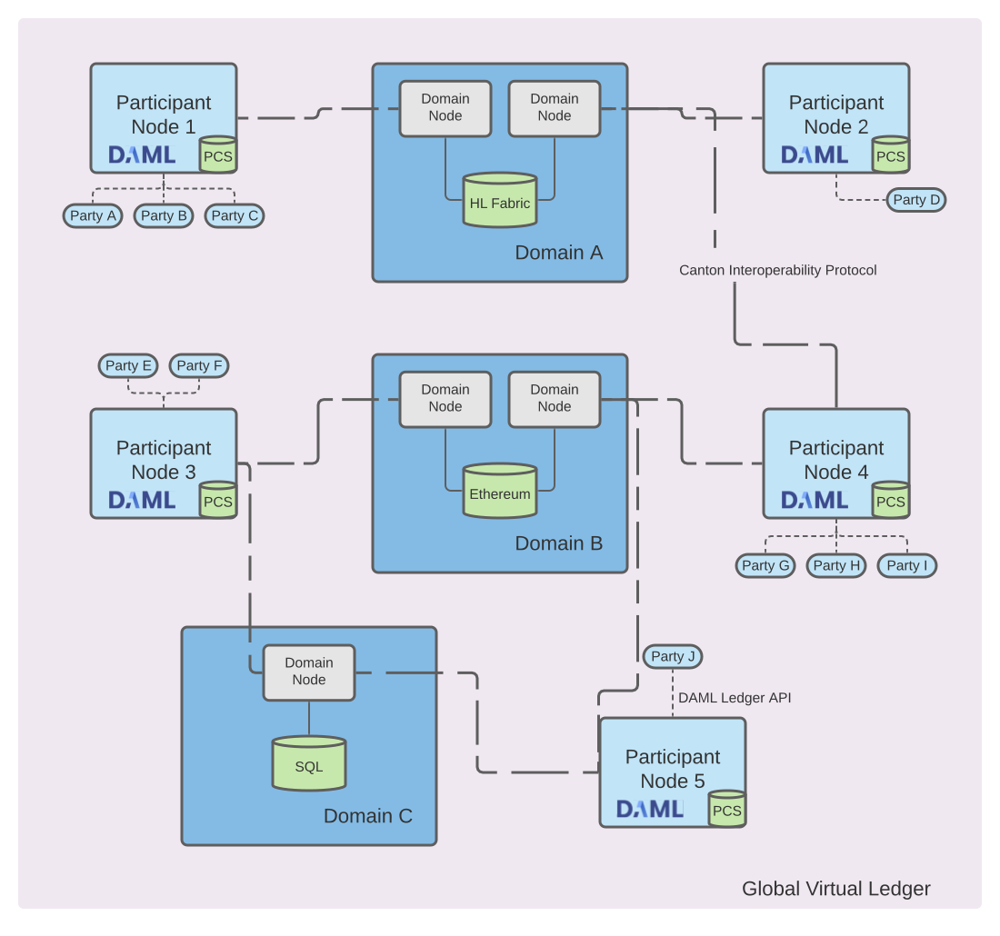
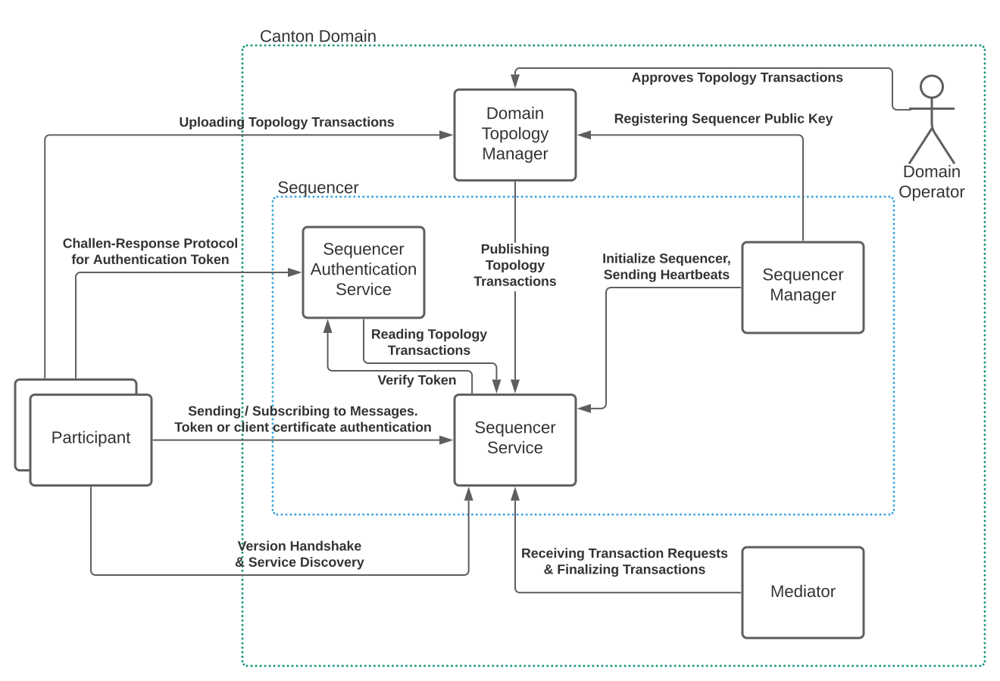

..
   Copyright (c) 2023 Digital Asset (Switzerland) GmbH and/or its affiliates.
..
   Proprietary code. All rights reserved.

.. _domain-architecture:

Synchronizer Architecture and Integrations
##########################################

Recall the high-level topology with Canton synchronizers being backed by different
technologies, such as a relational database as well as block-chains like
Hyperledger Fabric or Ethereum.

.. https://app.lucidchart.com/documents/edit/da3c4533-a787-4669-b1e9-2446996072dc/0_0

In this chapter, we define the requirements specific to a Canton synchronizer, explain
the generic synchronizer architecture, as well as the concrete integrations for Canton
synchronizers.

Synchronizer-specific Requirements
**********************************

The :ref:`high-level requirements <requirements>` define requirements for Canton
in general, covering both participants and synchronizers. This section categorizes and
expands on these high-level requirements and defines synchronizer-specific
requirements, both functional and non-functional ones.

Functional Requirements
=======================

The synchronizer contributes to the high-level functional requirements in terms of
facilitating the synchronization of changes. As the synchronizer can only see
encrypted transactions, refer to transaction privacy in the non-functional
requirements, the functional requirements are satisfied on a lower level than
the Daml transaction level.

  .. _synchronization-domain-req:

* **Synchronization:** The synchronizer must facilitate the synchronization of the
  shared ledger among participants by establishing a total-order of
  transactions.

  .. _transparency-domain-req:

* **Transparency:** The synchronizer must inform the designated participants of
  changes to the shared ledger in a timely manner.

  .. _finality-domain-req:

* **Finality:** The synchronizer must facilitate the synchronization of the shared
  ledger in an append-only fashion.

  .. _unnecessary-rejects-domain-req:

* **No unnecessary rejections:** The synchronizer should minimize unnecessary
  rejections of valid transactions.

  .. _seek-support-domain-req:

* **Seek support for notifications:** The synchronizer must facilitate offset-based
  access to the notifications of the shared ledger.

Non-Functional Requirements
===========================

Reliability
-----------

  .. _fail-over-domain-req:

* **Seamless fail-over for synchronizer entities:** All synchronizer entities must be able
  to tolerate crash faults up to a certain failure rate, e.g., 1 sequencer node
  out of 3 can fail without interruption.

  .. _resilience-domain-req:

* **Resilience to faulty synchronizer behavior:** The synchronizer must be able to detect
  and recover from failures of the synchronizer entities, such as performing a
  fail-over on crash failures or retrying operations on transient failures if
  possible. The synchronizer should tolerate byzantine failures of the synchronizer
  entities.

  .. _backups-domain-req:

* **Backups:** The state of the synchronizer entities has to be backed up such that
  in case of disaster recovery, only a minimal amount of data is lost.

  .. _disaster-recovery-domain-req:

* **Site-wide disaster recovery:** In case of a failure of a data-center hosting
  a synchronizer, the system must be able to fail over to another data center and
  recover operations.

  .. _resilience-participants-domain-req:

* **Resilience to erroneous behavior:** The synchronizer must be resilient to
  erroneous behavior from the participants interacting with it.

Scalability
-----------

  .. _horizontal-scalability-domain-req:

* **Horizontal scalability:** The parallelizable synchronizer entities and their
  sub-components must be able to horizontally scale.

  .. _large-tx-domain-req:

* **Large transaction support:** The synchronizer entities must be able to cope with
  large transactions and their resulting large payloads.

Security
--------

  .. _compromise-recovery-domain-req:

* **Synchronizer entity compromise recovery:** In case of a compromise of a synchronizer
  entity, the synchronizer must provide procedures to mitigate the impact of the
  compromise and allow to restore operations.

  .. _standard-crypto-domain-req:

* **Standards compliant cryptography:** All used cryptographic primitives and
  their configurations must comply to approved standards and based on
  existing and audited implementations.

  .. _authnz-domain-req:

* **Authentication and authorization:** The participants interacting with the
  synchronizer as well as the synchronizer entities internal to the synchronizer must authenticate
  themselves and have their appropriate permissions enforced.

  .. _secure-channel-domain-req:

* **Secure channel (TLS):** All communication channels between the participants
  and the synchronizer as well as between the synchronizer entities themselves have to
  support a secure channel option using TLS, optionally with client
  certificate-based mutual authentication.

  .. _distributed-trust-domain-req:

* **Distributed Trust:** The synchronizer should be able to be operated by a
  consortium in order to distribute the trust by the participants in the synchronizer
  among many organizations.

  .. _transaction-privacy-domain-req:

* **Transaction Metadata Privacy:** The synchronizer entities must never learn the
  content of the transactions. The synchronizer entities should learn a limited amount
  of transaction metadata, such as structural properties of a transaction and
  involved stakeholders.

Manageability
-------------

  .. _garbage-collection-domain-req:

* **Garbage collection:** The synchronizer entities must provide ways to minimize the
  amount of data kept on hot storage. In particular, data that is only required
  for auditability can move to cold storage or data that has been processed and
  stored by the participants could be removed after a specific retention period.

  .. _upgradeability-domain-req:

* **Upgradeability:** The synchronizer as a whole or individual synchronizer entities must
  be able to upgrade with minimal downtime.

  .. _semantic-versioning-domain-req:

* **Semantic versioning:** The interfaces, protocols, and persistent data
  schemas of the synchronizer entities must be versioned according to semantic
  versioning guidelines.

  .. _version-handshake-domain-req:

* **Synchronizer-approved protocol versions:** The synchronizer must offer and verify the
  supported versions for the participants. The synchronizer must further ensure
  that the synchronizer entities operate on compatible versions.

  .. _reuse-off-the-shelf-domain-req:

* **Reuse off-the-shelf solutions:** The synchronizer entities should use
  off-the-shelf solutions for persistence, API specification, logging, and
  metrics.

  .. _metrics-domain-req:

* **Metrics on communication and processing:** The synchronizer entities must expose
  metrics on communication and processing to facilitate operations and trouble
  shooting.

  .. _health-monitoring-domain-req:

* **Component health monitoring:** The synchronizer entities must expose a health
  endpoint for monitoring.

Synchronizer-Internal Components
********************************

The following diagram shows the architecture and components of a Canton synchronizer
as well as how a participant node interacts with the synchronizer.

.. https://lucid.app/lucidchart/55638ee7-4fc8-46f2-af4f-a4752ad708d2/edit?invitationId=inv_6666f0bc-caaf-4065-9867-8e0348b63bca

The synchronizer consists of the following components:

* **Synchronizer Service:** The first point of contact for a participant node when
  connecting to a synchronizer. The participant performs a version handshake with the
  synchronizer service and discovers the available other services, such as the
  sequencer. If the synchronizer requires a service agreement to be accepted by
  connecting participants, the synchronizer service provides the agreement.

* **Synchronizer Topology Service:** The synchronizer topology service is responsible for
  all topology management operations on a synchronizer. The service provides the
  essential topology state to a new participant node, that is, the set of keys for
  the synchronizer entities to bootstrap the participant node. Furthermore,
  participant nodes can upload their own topology transactions to the synchronizer
  topology service, which inspects and possibly approves and publishes those
  topology transactions on the synchronizer via the sequencer.

* **Sequencer Authentication Service:** A node can authenticate itself to the
  sequencer service either using a client certificate or using an authentication
  token. The sequencer authentication service issues such authentication tokens
  after performing a challenge-response protocol with the node. The node has to
  sign the challenge with its private key corresponding to a public key that
  has been approved and published by the synchronizer identity service.

* **Sequencer Service:** The sequencer service establishes the total order of
  messages, including transactions, within a synchronizer. The service implements a
  total-order multicast, i.e., the sender of a message indicates the set of
  recipients to which the message is delivered. The order is established based
  on a unique timestamp assigned by the sequencer to each message.

* **Sequencer Manager:** The sequencer manager is responsible for initializing
  the sequencer service.

* **Mediator:** The mediator participates in the Canton transaction protocol and
  acts as the transaction commit coordinator to register new transaction
  requests and finalizes those requests by collecting transaction confirmations.
  The mediator provides privacy among the set of transaction stakeholders as
  the stakeholders do not communicate directly but always via the mediator.

The synchronizer operator is responsible for operating the synchronizer infrastructure and
(optionally) also verifies and approves topology transactions, in particular to
admit new participant nodes to a synchronizer. The operator can either be a single
entity managing the entire synchronizer or a consortium of operators, refer to the
distributed trust security requirement.

Drivers
*******************

Based on the set of synchronizer internal components, a driver implements
one or more components based on a particular technology. The prime component is
the sequencer service and its ordering functionality, with implementations
ranging from a relational database to a distributed blockchain. Components can
be shared among integrations, for example, a mediator implemented on a
relational database can be used together with a blockchain-based sequencer.

.. .. toctree::
   :maxdepth: 1

   ethereum.rst
   fabric.rst
