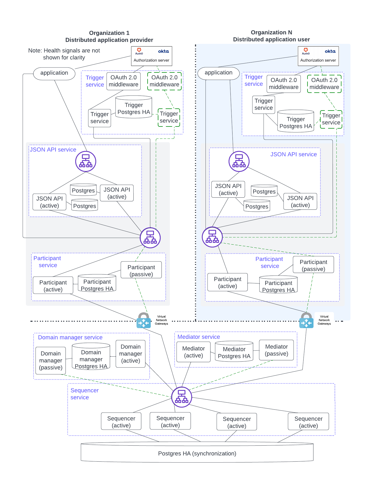
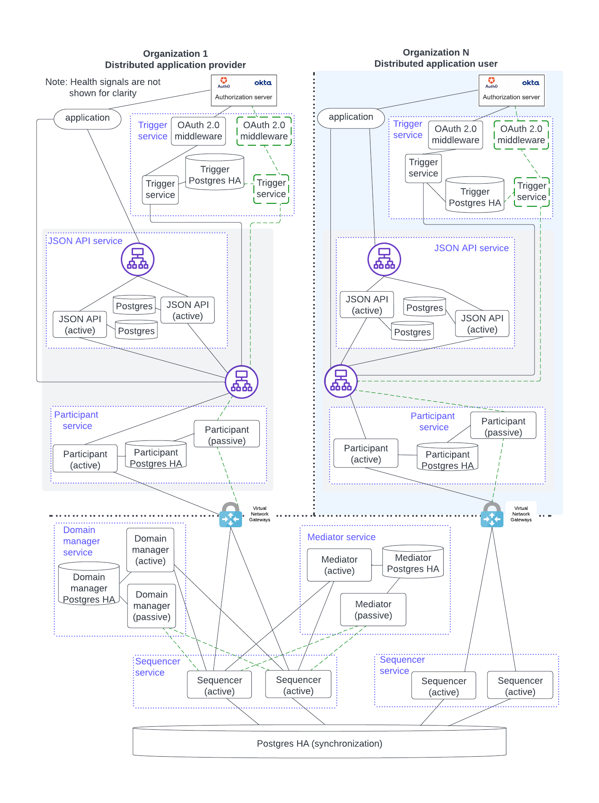

.. Copyright (c) 2023 Digital Asset (Switzerland) GmbH and/or its affiliates. All rights reserved.
.. SPDX-License-Identifier: Apache-2.0

HA Deployment Solution for Production
#####################################

The figure below assembles the components already described using the single-endpoint load balancer option. Although this setup may look complex, each service is independent and deployed separately. 

.. https://lucid.app/lucidchart/d3a7916c-acaa-419d-b7ef-9fcaaa040447/edit?invitationId=inv_b7a43920-f4af-4da9-88fc-5985f8083c95&page=0_0#

The figure below uses client-side load balancing for the synchronizer owner's sequencer access. Separate sequencer nodes are shown for the distributed application user's connectivity.

.. https://lucid.app/lucidchart/d3a7916c-acaa-419d-b7ef-9fcaaa040447/edit?invitationId=inv_b7a43920-f4af-4da9-88fc-5985f8083c95&page=0_0#

The diagrams maximize the independence between components by showing them as running on independent hosts. However, for actual deployment scenarios, some simplification and cost reduction is possible. For example, combining components on the same host is a decision that reduces complexity and cost but may impact availability if one component impacts another (e.g. when one component uses 100% of the CPU and starves the other components).

Distinct service instances should, in principle, run on different hosts to avoid a single point of failure at the infrastructure level. However, business goals always drive the HA requirements and how things are deployed.

