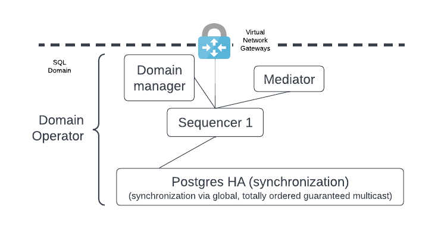
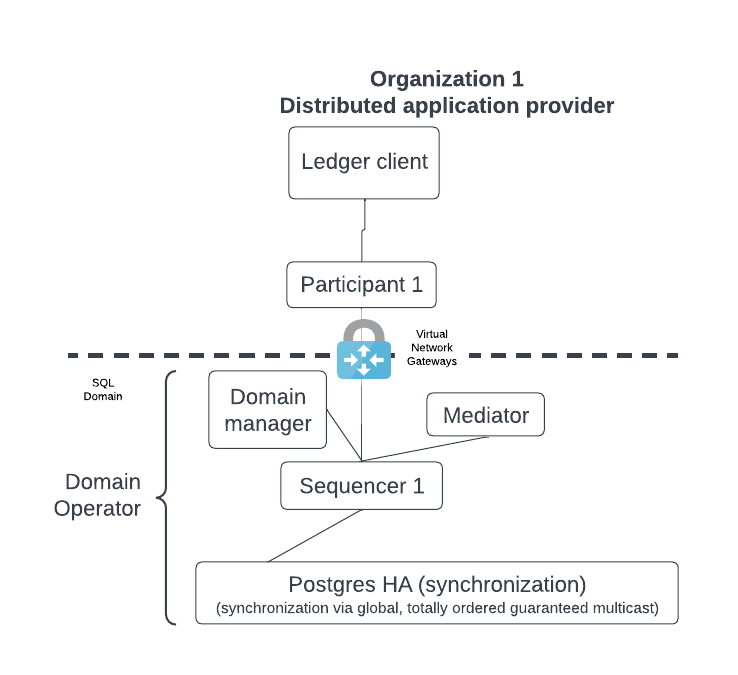
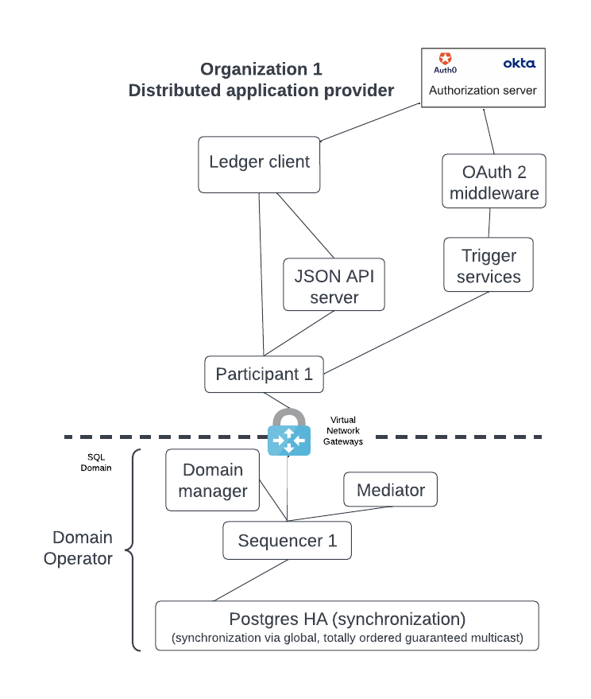
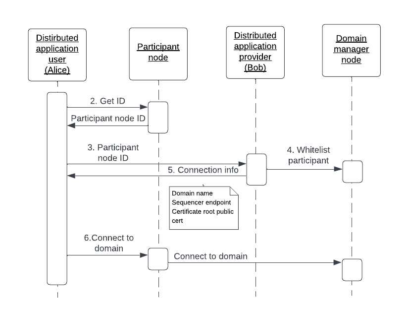
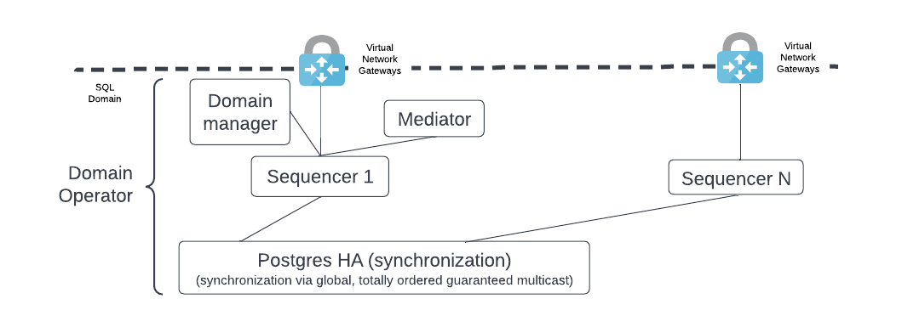
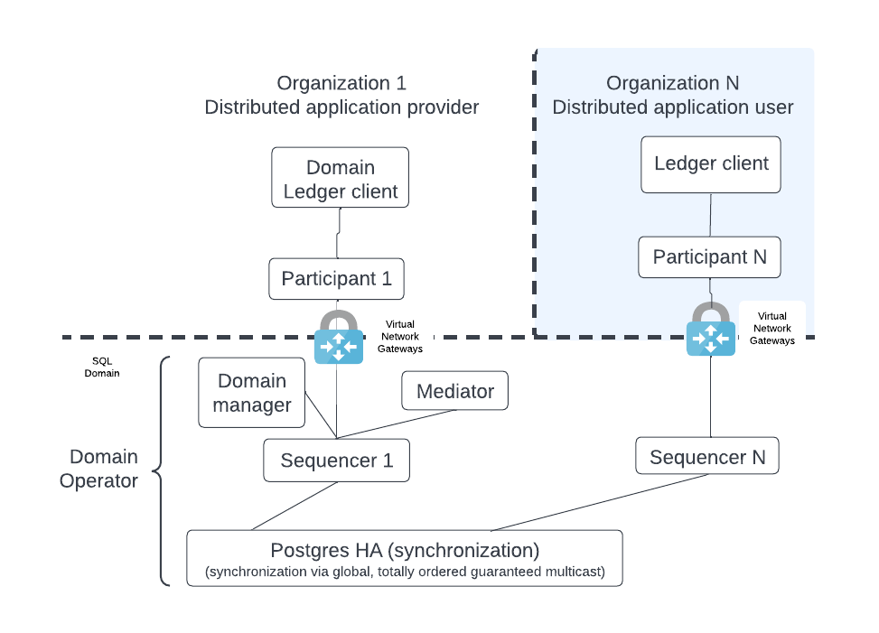
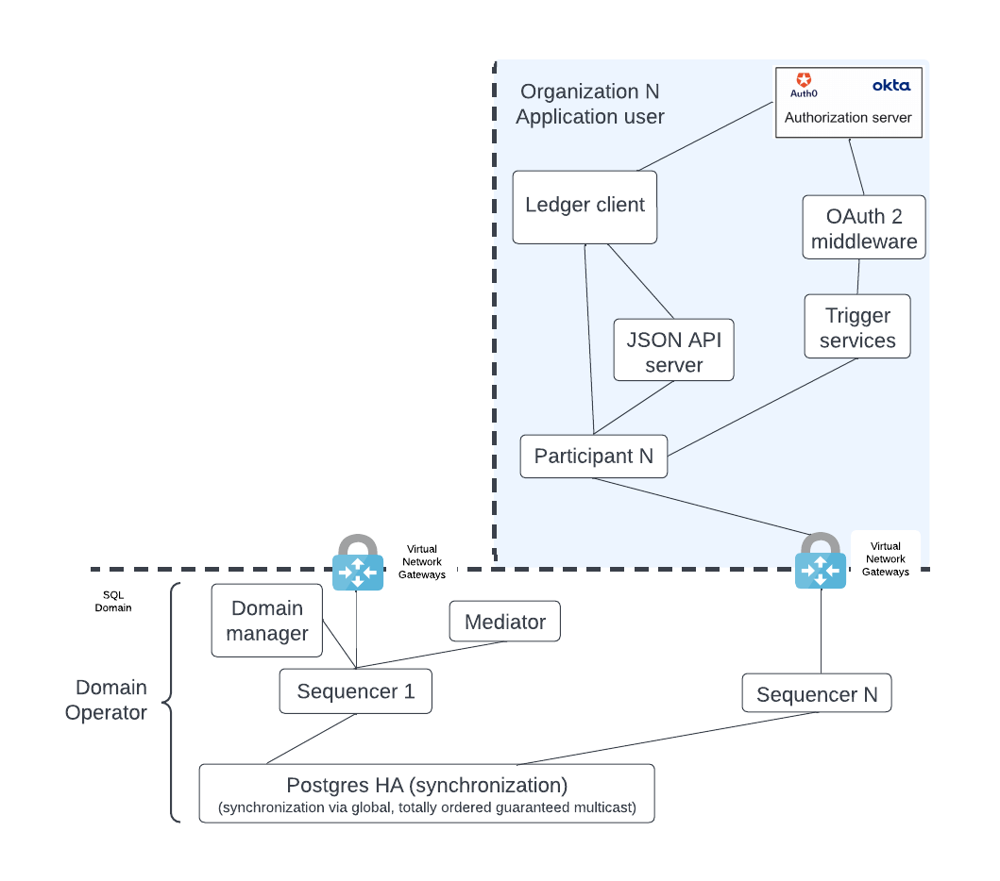

.. Copyright (c) 2023 Digital Asset (Switzerland) GmbH and/or its affiliates. All rights reserved.
.. SPDX-License-Identifier: Apache-2.0

Use Cases By Role
#################

Distributed Application Provider
********************************

The distributed application provider is also the synchronizer owner and the synchronizer administrator. Their deployment activities come first since all other activities require a synchronizer.

Deploy a synchronizer
=====================

The distributed application provider deploys the following components: 

* The synchronizer manager. 
* The mediator. 
* The sequencer. 
* The HA-configured PostgreSQL managed service [#f1]_ that is the sequencer's backend. 

.. https://lucid.app/lucidchart/d3a7916c-acaa-419d-b7ef-9fcaaa040447/edit?invitationId=inv_b7a43920-f4af-4da9-88fc-5985f8083c95&page=0_0#

.. NOTE::
    * The synchronizer manager, mediator, and sequencer all have internal databases - not shown here - which should be HA-configured. 
    * Also not shown, a bastion host (e.g. `Azure bastion host <https://azure.microsoft.com/en-us/products/azure-bastion/#overview>`_) can be configured for accessing the synchronizer components. This provides an additional layer of security by limiting access to the synchronizer. Additional production access controls may be needed.

The distributed application provider may choose to isolate the synchronizer from their participant node as a security measure using a Virtual Network Gateway as shown. If this additional isolation is not required then the Virtual Network Gateway is not needed. A different type of networking component may be more appropriate - e.g. HAProxy, NGINX, etc. 

The figure below shows the participant node and its ledger client.

.. https://lucid.app/lucidchart/d3a7916c-acaa-419d-b7ef-9fcaaa040447/edit?invitationId=inv_b7a43920-f4af-4da9-88fc-5985f8083c95&page=0_0#

As mentioned, the distributed synchronizer owner can add additional components which interact with the participant node. These components are normally deployed shortly after deploying the participant node. 

.. https://lucid.app/lucidchart/d3a7916c-acaa-419d-b7ef-9fcaaa040447/edit?invitationId=inv_b7a43920-f4af-4da9-88fc-5985f8083c95&page=0_0#

Connect a new participant node 
==============================

We expect the synchronizer to run in permissioned mode with allow-listing [#f2]_ enabled to only include participant nodes whose identities have been registered with the synchronizer manager. This involves a data exchange between the distributed application provider and the distributed application user. 

The distributed application provider communicates specific information to a new distributed application user so that the user's participant node can join the application's synchronizer. The figure below illustrates this exchange, with **Bob** as the application provider and **Alice** as the new application user. 

.. https://lucid.app/lucidchart/d3a7916c-acaa-419d-b7ef-9fcaaa040447/edit?invitationId=inv_b7a43920-f4af-4da9-88fc-5985f8083c95&page=0_0#

1. Alice deploys a participant node - not shown.
2. Alice extracts the participant node's unique identifier into a string. The ID includes the display name for the participant plus a hash of the public identity signing key.
3. Alice makes her participant ID known to Bob through an external mechanism, e.g. email.
4. Bob runs a console command which adds Alice's participant ID to the synchronizer allowlist and configures the appropriate node's permissions. An example command which gives default permissions is shown here:

.. code-block:: sh

    domainManager1.participants.set_state(participantIdFromString, ParticipantPermission.Submission, TrustLevel.Ordinary)

5. Bob passes Alice the following information, which allows her to connect to the synchronizer:
    a. One, or more, sequencer endpoints - https URLs.
    b. Certificate root public cert, if it's not a publicly signed CA.
6. Alice picks a unique name for the syncrhonizer that is local to her participant. This will be used in the connection command.
7. Alice enters the information into the connection command ``connect_multi`` and connects to Bob's syncrhonizer - not shown.

.. code-block:: sh

    participantAlise.domains.connect_multi("AliceDomainName", Seq(sequencer1, sequencer2))

Prepare synchronizer infrastructure for adding new participant nodes
====================================================================

A distributed application provider expands the use of their application by allowing more participant nodes to join their synchronizer. A sequencer node is the gateway to the syncrhonizer for all participant nodes. It follows that the policy on when to add a new sequencer is important and must be clearly defined. 

As shown below, a synchronizer may start with a sequencer node and then add more sequencer nodes as required. 

.. https://lucid.app/lucidchart/d3a7916c-acaa-419d-b7ef-9fcaaa040447/edit?invitationId=inv_b7a43920-f4af-4da9-88fc-5985f8083c95&page=0_0#

There are two options for adding a new participant node. 

1. Deploy a sequencer for each participant node to introduce more isolation between the events each participant sees.  For example, Coke may want to avoid cross-contamination of events with Pepsi, and vice-versa, so each organization wants its own sequencer. The Coke sequencer sees all the Coke and Pepsi messages through the shared database; the sequencer backend is a broadcast. However, Coke's sequencer node provides a multicast to Coke's participant node with only Coke's events. Pepsi's setup functions similarly.  
2. Avoid the additional isolation and focus on high resource utilization of the sequencer by having several participant nodes use the same sequencer; i.e. a single sequencer handles multiple distributed application users. This option produces a lighter load on the joint HA PostgreSQL database.

Distributed Application User
****************************

The distributed application user deploys their own participant node and connects to the provider's public sequencer endpoint. There is some similarity here with the distributed application provider. However, the distributed application user's DAR files (i.e. business logic) may be a subset of the DAR files deployed by the distributed application provider.

This setup is extendable. For example, the distributed application user may be interested in several distributed applications, and so connect their participant node to the related synchronizers by deploying multiple DARs for the different applications' business logic. They may also write their own extensions that include additional DARs. These extensions do not impact the use cases described here.

.. https://lucid.app/lucidchart/d3a7916c-acaa-419d-b7ef-9fcaaa040447/edit?invitationId=inv_b7a43920-f4af-4da9-88fc-5985f8083c95&page=0_0#

The simple configuration shown above, like that of the synchronizer owner, can expand into a more capable deployment such as shown below by adding the HTTP JSON API server, trigger services, and OAuth2 middleware. 

.. https://lucid.app/lucidchart/d3a7916c-acaa-419d-b7ef-9fcaaa040447/edit?invitationId=inv_b7a43920-f4af-4da9-88fc-5985f8083c95&page=0_0#

Upload the distributed application DAR files
============================================

Check the documentation for information on how to :doc:`upload DAR files </deploy/generic_ledger>`.

Site Reliability Engineer (SRE)
*******************************

Monitor systems
===============

The SRE's primary use case is monitoring. Monitoring is required on both the synchronizer and participant nodes, although the scope is slightly different. 

Monitoring normally consists of the following activities:

* Export logs.
* Expose metrics via Prometheus endpoint. 
* Parse out trace IDs from the log files.
* Keep logs for audit.

Check the documentation for more information on :doc:`monitoring </canton/usermanual/monitoring>`.

.. rubric:: Footnotes

.. [#f1] The PostgreSQL managed service could also be a PostgreSQL server running on hardware that was deployed by the user. 
.. [#f2] The default mode is an open mode which is less secure.
