PQS Technical User Documentation
================================

Introduction
------------

Welcome to PQS!
~~~~~~~~~~~~~~~

PQS is a component that extends the reach of the ledger by making it
available to SQL. This enables users familar with SQL to query the state
of the ledger, as well as the history of how that state evolved.

Audience
~~~~~~~~

This documention provides guidance on what PQS achieves, how to use it,
and it's operation and limitations. The following types of users are
likely to find PQS useful:

-  Application developers: to query the ledger to display information to
   users, integrate or carry out automated business processes, and of
   course debugging.
-  Business analysts: to access and analyze ledger data with ad-hoc
   investigations to understand operational usage.
-  Support analysts: to diagnose any problems on a live system, when
   sophisticated inspection of the ledger is required.
-  Application operators: to take a snapshot of the ledger, either with
   or without history in order to analyse and investigate.
-  Report analysts: to provide access to ledger data information for
   analysis and aggregation with standard reporting tools, on a
   historical or real-time basis.

Purpose
~~~~~~~

PQS can be described as a kind of
`bridge <https://en.wikipedia.org/wiki/Bridge_pattern>`__ connecting the
ledger with a datastore. By providing read access to the data via a
traditional SQL database, we decouple the reader from a specific
Participant, and enable users to use their existing tools & knowledge.

The Participant's primary role is to submit and propogate transactions
in the network - and interaction with it is required to submit commands.
PQS obtains the ledger from the Participant on a streaming basis,
maintains history and state based on those events - and makes this data
available to users to query. As such it aleviates the need for the
Participant to be involved in read-loads, and can be scaled
independently.

Operational Architecture
~~~~~~~~~~~~~~~~~~~~~~~~

PQS is a standalone application that is configured via command line
arguments. It is intended to be run as a long-running process, and is
designed to be resilient to network and database outages. It is also
designed to be idempotent, so that it can be restarted at any time
without impacting the integrity of the data. It does not write anything
to the ledger, but only a passive consumer of data from a Canton
Participant.

The following diagram shows that PQS initiates connections to both the
participant, and the datastore: (arrows indicate the direction of
connection)

|diagram|

Similarly from the perspective of data-flow:

|image1|

Expanding the Application node from the above, we can imagine many
potential architectures, including:

|image2|

Key Feature Summary
~~~~~~~~~~~~~~~~~~~

PQS enables the following key capabilities:

-  Connect to the ledger and replicate a snapshot of the contract state
   at a given ledger offset (which can be nominated).
-  Continue to update the datastore with subsequent events - up until a
   nominated offset - or indefinitely.
-  Filter of the scope by: Party, Daml template.
-  Embed an API within the database to allow consumers easy access to
   the ledger data:

   -  Using familiar Daml identifiers (eg.
      ``mypackage:My.Module:MyTemplate``) instead of PostgreSQL
      approximations.
   -  Preserving Party based privacy constraints.
   -  Use SQL to query perform aggregations, transformations or joins in
      familiar ways.
   -  Create custom indexes to speed up queries.
   -  Facilitate access to state (contracts) and temporal history
      (events); also allowing them to be combined in powerful ways.

-  Resilience and safety - being crash-tollerant such that it can be
   restarted without data loss or corruption.

Table of Contents
-----------------

1.  `Getting Started <001-getting-started.md>`__
2.  `Database Schema <002-database.md>`__
3.  `Resilience <003-resilience.md>`__
4.  `Read API <004-read-api.md>`__
5.  `Pruning <005-pruning.md>`__
6.  `Authentication <006-auth.md>`__
7.  `History Slicing <007-history-slicing.md>`__
8.  `Reset Procedure <008-reset-procedure.md>`__
9.  `Performance Benchmarking <009-benchmark.md>`__
10. `Logging <010-logging.md>`__
11. `Database Schema Evolution <011-database-schema-evolution.md>`__
12. `Relational View of Data <012-relational-view.md>`__
13. `Observability <013-observability.md>`__
14. `Redaction <014-redaction.md>`__
15. `Configuration <015-configuration.md>`__

Getting Started
===============

Pre-requisites
--------------

To run PQS you need the following:

-  PostgreSQL version 12-16.
-  Daml Sandbox, or Canton Participant as the source of ledger data.
-  Any access tokens or TLS certificates required by the above.
-  PQS ``.jar`` or Docker image

Running PQS
-----------

Exploring commands and parameters is easiest via the ``--help`` (and
``--help-verbose``) arguments: For example, if you are running via a
downloaded ``.jar`` file:

.. code:: bash

   $ ./scribe.jar --help
   Usage: scribe COMMAND

   An efficient ledger data exporting tool

   Options:
     -h, --help            Print help information and quit
     -H, --help-verbose    Print help information with extra details and quit
     -v, --version         Print version information and quit

   Commands:
     pipeline     Initiate continuous ledger data export
     datastore    Perform operations supporting a certified data store

   Run 'scribe COMMAND --help[-verbose]' for more information on a command.

Or similarly, using Docker:

.. code:: bash

   $ docker run -it digitalasset-docker.jfrog.io/participant-query-store:0.4.4 --help
   Picked up JAVA_TOOL_OPTIONS: -javaagent:/open-telemetry.jar
   Usage: scribe COMMAND

   An efficient ledger data exporting tool

   Commands:
     pipeline     Initiate continuous ledger data export
     datastore    Perform operations supporting a certified data store

   Run 'scribe COMMAND --help[-verbose]' for more information on a command.

Preparing the Database
~~~~~~~~~~~~~~~~~~~~~~

Let's start by investigating the database schema that PQS will create,
using the ``datastore`` command that is used for administrative
operations:

.. code:: sql

   $ ./scribe.jar datastore postgres-document schema show
   [...]
   /**********************************************************
    * generated by scribe, version: [...]                    *
    **********************************************************/
   -- tables
   create table [...]

With the produced DDL you can create the schema yourself - or leave it
to the ``pipeline`` to do this for you on an ongoing idempotent basis.

Running the Pipeline
~~~~~~~~~~~~~~~~~~~~

The following command will connect to a non-auth ledger and replicate
the latest state of the ledger (excluding prior-history) from the
perspective of the supplied Daml party. It will use the ledger source
and database supplied, but these values can be omitted since they are
all defaults:

.. code:: shell

   $ ./scribe.jar pipeline ledger postgres-document \
       --pipeline-filter-parties Alice::12209942561b94adc057995f9ffca5a0b974953e72ba25e0eb158e05c801149639b9 \
       --pipeline-ledger-start Latest \
       --target-postgres-host localhost \
       --target-postgres-port 5432 \
       --target-postgres-database postgres \
       --source-ledger-port 6865 \
       --source-ledger-host localhost
   18:27:26.799 I [zio-fiber-64] com.digitalasset.scribe.appversion.package:11 scribe, version: v...
   18:27:27.159 I [zio-fiber-68] com.digitalasset.scribe.configuration.package:40 Applied configuration:
   [...]
   18:27:28.714 I [zio-fiber-67] com.digitalasset.scribe.postgres.document.DocumentPostgres.Service:36 Applying schema
   18:27:28.805 I [zio-fiber-67] com.digitalasset.scribe.postgres.document.DocumentPostgres.Service:39 Schema applied
   18:27:28.863 I [zio-fiber-0] com.digitalasset.scribe.pipeline.pipeline.Impl:29 Starting pipeline on behalf of 'Alice::...'
   18:27:29.043 I [zio-fiber-0] com.digitalasset.scribe.pipeline.pipeline.Impl:57 Last checkpoint is absent. Seeding from ACS before processing transactions with starting offset '000000000000000008'
   18:27:29.063 I [zio-fiber-938] com.digitalasset.zio.daml.Ledger.Impl:191 Contract filter inclusive of 4 templates and 0 interfaces
   18:27:29.120 I [zio-fiber-0] com.digitalasset.scribe.pipeline.pipeline.Impl:74 Continuing from offset 'GENESIS' and index '0' until offset 'INFINITY'
   18:27:29.159 I [zio-fiber-967] com.digitalasset.zio.daml.Ledger.Impl:191 Contract filter inclusive of 4 templates and 0 interfaces
   [...]

..

   [!NOTE] The above command will continue to run until terminated. You
   can terminate it with ``Ctrl-C`` at any time.

Auth
~~~~

If you are running PQS against a Participant that has auth, you must
provide some credentials. For example:

.. code:: bash

   $ ./scribe.jar pipeline ledger postgres-document \
       --source-ledger-auth OAuth \
       --pipeline-oauth-clientid my_client_id \
       --pipeline-oauth-clientsecret deadbeef \
       --pipeline-oauth-cafile ca.crt \
       --pipeline-oauth-endpoint https://my-auth-server/token

For more information see the `Authentication <006-auth.md>`__ section.

Database Schema
===============

PQS supports a single datastore format - known as ``postgres-document``.
This uses PostgreSQL to store the data in a document-oriented
(schemaless) way - making extensive use of JSONB.

Ledger Structure
----------------

To understand how PQS stores data, we need an understanding of the
ledger data model. In simple terms, the Daml ledger is composed of a
sequence of transactions, which contain events. Events can be:

-  Creates: creation of contracts / interface views.
-  Exercise: of a choice of contracts / interface views.
-  Archive: end of the lifetime of contracts / interface views.

Ledger Data Scope
-----------------

PQS can be run in two modes as specified by the
``--pipeline-datasource`` configuration. The following table shows the
differences between the two modes, in terms of data availability via the
respective `Read API <004-querying.md>`__ functions :

+----------------------+----------------------+----------------------+
| Mode                 | TransactionStream(1) | T                    |
|                      |                      | ransactionTreeStream |
+======================+======================+======================+
| Contract creates()   | ✓                    | ✓                    |
+----------------------+----------------------+----------------------+
| Contract exercises() | ✗                    | ✓                    |
+----------------------+----------------------+----------------------+
| Contract archives()  | ✓                    | ✓                    |
+----------------------+----------------------+----------------------+
| Interface View       | ✓                    | ✗                    |
| creates()            |                      |                      |
+----------------------+----------------------+----------------------+
| Interface View       | ✗                    | ✓                    |
| exercises()          |                      |                      |
+----------------------+----------------------+----------------------+
| Interface View       | ✓                    | ✗                    |
| archives()           |                      |                      |
+----------------------+----------------------+----------------------+
| Stakeholders (all    | ✓                    | ✓                    |
| API functions)       |                      |                      |
+----------------------+----------------------+----------------------+
| NOTE:                |                      |                      |
+----------------------+----------------------+----------------------+
| Useage               | Default              | Opt-in               |
+----------------------+----------------------+----------------------+
| Data size            | Smaller              | Larger               |
+----------------------+----------------------+----------------------+

(1) Not including transients - ie. created and archived within the same
ledger transaction.

Ledger Data Filtering
---------------------

The ``--pipeline-filter-contracts`` specifies an inclusion filter
expression to determine which templates and interface views to include.
A filter expression is a simple wildcard inclusion statement with basic
Boolean logic, where whitespace is ignored. Below are some examples:

-  ``*``: everything (default)
-  ``pkg:*``: everything in this package
-  ``pkg:a.b.c.Bar``: just this one fully qualified name for template
   ``Bar``
-  ``a.b.c.*``: all members of the ``a.b.c`` namespace
-  ``* & !pkg:a.b.c.Bar``: everything except this one fully qualified
   name
-  ``(a.b.c.Foo | a.b.c.Bar)``: these two fully qualified names
-  ``(a.b.c.* & !(a.b.c.Foo | a.b.c.Bar) | g.e.f.Baz)``: everything in
   ``a.b.c`` except for ``Foo`` and ``Bar``, and also include
   ``g.e.f.Baz``
-  ``a.b.c.Foo & a.b.c.Bar``: error (the identifier can't be both)

There are further conditions placed upon the filtering of templates and
interfaces, to avoid some potentially ambiguous scenarios. It is
required that you include any filter for:

-  All interface views of a template that is also included
-  All templates of an interfaceview that is also included

Party Filtering
---------------

Similarly, the ``--pipeline-filter-parties`` option specifies an
inclusion filter expression to determine which parties to supply data
for. For example:

-  ``*``: everything (default)
-  ``Alice::* | Bob::*``: any party with an ``Alice`` or ``Bob`` hint
-  ``Alice::122055fc4b190e3ff438587b699495a4b6388e911e2305f7e013af160f49a76080ab``:
   just this one party
-  ``* & !Alice::*``: all parties except those with an ``Alice`` hint
-  ``Alice* | Bob* | (Participant* & !(Participant3::*))``: ``Alice``
   and ``Bob`` parties, and all ``Participant``\ s except
   ``Participant3``

PostgreSQL Schema
-----------------

The PostgreSQL schema is designed to be generic, and not tied to any
specific Daml model. This is achieved by a fixed schema that relates to
the general ledger model, but uses a documented-oriented approach
(JSONB) to store the data whose schema lies in the Daml models.

   [!NOTE] Any database artifact starting with an underscore (``_``) is
   explicitly denoted an internal implementation, subject to change, and
   should not be relied upon. Every table is prefixed this way, and
   therefore all tables are not guaranteed to remain in their current
   structure as a result of future functional and performance
   enhancements.

Users should only interact with the database via the `Read
API <004-querying.md>`__, which does provide a stable interface for
users to rely on. DBA's who wish to have a deeper understanding of the
schema specifics, can easily inspect the schema using the command:

.. code:: bash

   $ ./scribe.jar datastore postgres-document schema show
   [...]

Objectives
~~~~~~~~~~

Overall the objectives of the schema design is to facilitate:

-  **Scaleable writes**: high-throughput and efficient in order to free
   up as much capacity for useful work (reads) as possible.
-  **Scaleable reads**: queries are able to be parallelized, and not
   blocked behind writes. They produce sensible query plans that do not
   unnecessarily result in table scans.
-  **Ease of use**: readers are able to use familiar tools and
   techniques to query the database, without needing to understand the
   specifics of the schema design. Instead they are able to use simple
   entry-points that provide access to data in familar ledger terms:
   active contracts, creates, exercises, archives, offsets etc. Readers
   do not need to worry about offset-based model for point-in-time
   snapshot isolation.
-  **Read consistency**: readers are able to achieve the level of
   consistency that they require, including consistency with other
   queries they are conducting.
-  **Crash tollerance**: the schema is designed to be simple and ensure
   recovery from any kind of crash, taking a pessimistic view of what
   races may occur, however unlikely.
-  **Static schema**: the schema is designed to be static, and not
   require any changes to the schema as the ledger evolves, to the
   extent that this is possible.

Design
~~~~~~

To facilitate these objectives, the following design approaches have
been used:

-  **Concurrent append-only writes**: ledger transactions are written
   with significant parallelism without contention, ensuring that writes
   can be high-throughput and be unconstrained by latency.
-  **Bulk batching**: using
   `COPY <https://www.postgresql.org/docs/current/sql-copy.html>`__ (not
   `INSERT <https://www.postgresql.org/docs/current/sql-insert.html>`__)
   to deliver large batches of data efficiently.
-  **Offset indexed**: all data is appropriately indexed by offset to
   provide efficient access to slice the result by offset.
   `BRIN <https://www.postgresql.org/docs/current/brin-intro.html>`__
   indexes are used to ensure contiguity of data that is often accessed
   together.
-  **Implicit offset**: readers can opt for queries with implicit
   offset, meaning they can ignore the role of offset in their queries -
   but still provide a stable view of the ledger data. Much like
   PostgreSQL's MVCC provides consistency benefits without the user
   needing to understand the underlying implementation, we seek to
   provide a similar experience for readers of the ledger data.
-  **Idempotent**: PQS is designed to be restarted at any time, and will
   not impact the integrity of the data. This is achieved by using
   offsets to ensure clean restarts, and ensuring that (other than the
   database itself) PQS is stateless.
-  **Watermarks**: a single thread maintains a watermark denoting the
   most recent contigous transaction - representing the offset of the
   ledger that is consistent and available. In addition, the watermark
   processes the "archive" mutation on any archived contracts or
   interface views, on a batched basis. This reintroduces data
   consistency without needing readers to perform pathalogical table
   scans to achieve this. This efficiently resolves the uncertainty
   created by the parallel writes.
-  **Schemaless content**: content defined in Daml templates uses the
   JSONB datatype to store the data. This allows for a schemaless
   approach, and is able to store any Daml model without needing to
   change the schema - other than custom JSONB indexes.

PostgreSQL Users
----------------

To secure the PostgreSQL database, you should consider the rights
granted to various users that connect to the database. At minimum the
following user categories should be considered with their respective
DDL/ACL
`privileges <https://www.postgresql.org/docs/16/ddl-priv.html>`__:

-  **Administraton**: Provides a way for DBA to perform any action on
   the database - SUPERUSER
-  **Processing**: The user that PQS connects to the database as -
   SELECT, INSERT, UPDATE
-  **Querying**: Data consumers that connect to the database to read the
   ledger data - SELECT
-  **Redaction**: Any users that needs to perform redaction operations -
   SELECT, UPDATE
-  **Pruning**: Any users that needs to perform pruning operations -
   SELECT, UPDATE, DELETE
-  **Indexing**: Users that wish to maintain JSONB indexes - CREATE

Resilience
==========

PQS operates as a long-running process, and faces many potential threats
to its availability. We would expect PQS on occasion to encounter issues
with dependencies during operation. Three mechanisms can assist in
ensuring resilience to such failures:

-  **Redundancy** involves running multiple instances of PQS in parallel
   to ensure that the system remains available even if one instance
   fails.
-  **Retry** involves healing from transient and recoverable failures
   without shutting down the process or requiring operator intervention.
-  **Recovery** entails reconciling the current state of the ledger with
   already exported data in the datastore after a cold start, and
   continuing from the latest checkpoint.

High Availability
-----------------

Multiple isolated instances of PQS can be instantiated without any
cross-dependency. This allows for an active-active high availability
clustering model. Please note that different instances might not be at
the same offset due to different processing rates and general network
non-determinism. PQS's Read API provides capabilities to deal with this
'eventual consistency' model, to ensure that consistency does not appear
to be violated by readers. See ``set_latest_minimum()`` in the Read API
for more details.

|image3|

Retries
-------

PQS's ``pipeline`` command is a unidirectional streaming process that
heavily relies on the availability of its ``source`` and ``target``
dependencies. When PQS encounters an error, it will attempt to recover
by restarting its internal engine if the error is designated as
recoverable:

-  `gRPC <https://grpc.io/docs/guides/status-codes/>`__ (white-listed;
   retries if):

   -  ``CANCELLED``
   -  ``DEADLINE_EXCEEDED``
   -  ``NOT_FOUND``
   -  ``PERMISSION_DENIED``
   -  ``RESOURCE_EXHAUSTED``
   -  ``FAILED_PRECONDITION``
   -  ``ABORTED``
   -  ``INTERNAL``
   -  ``UNAVAILABLE``
   -  ``DATA_LOSS``
   -  ``UNAUTHENTICATED``

-  `JDBC <https://github.com/pgjdbc/pgjdbc/blob/master/pgjdbc/src/main/java/org/postgresql/util/PSQLState.java>`__
   (black-listed; retries unless):

   -  ``INVALID_PARAMETER_TYPE``
   -  ``PROTOCOL_VIOLATION``
   -  ``NOT_IMPLEMENTED``
   -  ``INVALID_PARAMETER_VALUE``
   -  ``SYNTAX_ERROR``
   -  ``UNDEFINED_COLUMN``
   -  ``UNDEFINED_OBJECT``
   -  ``UNDEFINED_TABLE``
   -  ``UNDEFINED_FUNCTION``
   -  ``NUMERIC_CONSTANT_OUT_OF_RANGE``
   -  ``NUMERIC_VALUE_OUT_OF_RANGE``
   -  ``DATA_TYPE_MISMATCH``
   -  ``INVALID_NAME``
   -  ``CANNOT_COERCE``
   -  ``UNEXPECTED_ERROR``

Configuration
~~~~~~~~~~~~~

The following configuration options are available to control the retry
behavior of PQS:

.. code:: shell

   $ ./scribe.jar pipeline --help
   [...]
     --retry-backoff-base string                 Base time (ISO 8601) for backoff retry strategy (default: PT1S)
     --retry-backoff-cap string                  Max duration (ISO 8601) between attempts (default: PT1M)
     --retry-backoff-factor double               Factor for backoff retry strategy (default: 2.0)
     --retry-counter-attempts int                Max attempts before giving up (optional)
     --retry-counter-reset string                Reset retry counters after period (ISO 8601) of stability (default: PT10M)
     --retry-counter-duration string             Time limit (ISO 8601) before giving up (optional)
   [...]

Configuring ``--retry-backoff-*`` settings allows to control periodicity
of retries and the maximum duration between attempts.

Configuring ``--retry-counter-attempts`` and
``--retry-counter-duration`` allows to control the maximum *instability*
tolerance before giving up and shutting down the process for good.

Configuring ``--retry-counter-reset`` allows to control the period of
*stability* after which the retry counters are reset across the board.

Logging
~~~~~~~

.. code:: shell

   # Irrelevant log lines omitted
   $ scribe.jar pipeline ledger postgres-document \
       --pipeline-ledger-start Oldest --pipeline-ledger-stop Never \
       --retry-backoff-base=PT10S --retry-counter-duration=PT10M --retry-counter-attempts=42

   12:52:26.753 I [zio-fiber-257] com.digitalasset.scribe.appversion.package:14 scribe, version: UNSPECIFIED  application=scribe
   12:52:16.725 I [zio-fiber-0] com.digitalasset.scribe.pipeline.Retry.retryRecoverable:48 Recoverable GRPC exception. Attempt 1, unstable for 0 seconds. Remaining attempts: 42. Remaining time: 10 minutes. Exception in thread "zio-fiber-" java.lang.Throwable: Recoverable GRPC exception.
       Suppressed: io.grpc.StatusException: UNAVAILABLE: io exception
           Suppressed: io.netty.channel.AbstractChannel$AnnotatedConnectException: Connection refused: localhost/[0:0:0:0:0:0:0:1]:6865
               Suppressed: java.net.ConnectException: Connection refused application=scribe
   12:52:29.007 I [zio-fiber-0] com.digitalasset.scribe.pipeline.Retry.retryRecoverable:48 Recoverable GRPC exception. Attempt 2, unstable for 12 seconds. Remaining attempts: 41. Remaining time: 9 minutes 47 seconds. Exception in thread "zio-fiber-" java.lang.Throwable: Recoverable GRPC exception.
       Suppressed: io.grpc.StatusException: UNAVAILABLE: io exception
           Suppressed: io.netty.channel.AbstractChannel$AnnotatedConnectException: Connection refused: localhost/[0:0:0:0:0:0:0:1]:6865
               Suppressed: java.net.ConnectException: Connection refused application=scribe
   12:52:51.237 I [zio-fiber-0] com.digitalasset.scribe.pipeline.Retry.retryRecoverable:48 Recoverable GRPC exception. Attempt 3, unstable for 34 seconds. Remaining attempts: 40. Remaining time: 9 minutes 25 seconds. Exception in thread "zio-fiber-" java.lang.Throwable: Recoverable GRPC exception.
       Suppressed: io.grpc.StatusException: UNAVAILABLE: io exception
           Suppressed: io.netty.channel.AbstractChannel$AnnotatedConnectException: Connection refused: localhost/[0:0:0:0:0:0:0:1]:6865
               Suppressed: java.net.ConnectException: Connection refused application=scribe
   12:53:33.473 I [zio-fiber-0] com.digitalasset.scribe.pipeline.Retry.retryRecoverable:48 Recoverable GRPC exception. Attempt 4, unstable for 1 minute 16 seconds. Remaining attempts: 39. Remaining time: 8 minutes 43 seconds. Exception in thread "zio-fiber-" java.lang.Throwable: Recoverable GRPC exception.
       Suppressed: io.grpc.StatusException: UNAVAILABLE: io exception
           Suppressed: io.netty.channel.AbstractChannel$AnnotatedConnectException: Connection refused: localhost/[0:0:0:0:0:0:0:1]:6865
               Suppressed: java.net.ConnectException: Connection refused application=scribe
   12:54:36.328 I [zio-fiber-0] com.digitalasset.scribe.pipeline.Retry.retryRecoverable:48 Recoverable JDBC exception. Attempt 5, unstable for 2 minutes 19 seconds. Remaining attempts: 38. Remaining time: 7 minutes 40 seconds. Exception in thread "zio-fiber-" java.lang.Throwable: Recoverable JDBC exception.
       Suppressed: org.postgresql.util.PSQLException: Connection to localhost:5432 refused. Check that the hostname and port are correct and that the postmaster is accepting TCP/IP connections.
           Suppressed: java.net.ConnectException: Connection refused application=scribe

Metrics
~~~~~~~

The following metrics are available to monitor stability of PQS's
dependencies. See the `observability <013-observability.md>`__ section
for more details on general observability:

.. code:: text

   # TYPE app_restarts_total counter
   # HELP app_restarts_total Number of total app restarts due to recoverable errors
   app_restarts_total{,exception="Recoverable GRPC exception."} 5.0

   # TYPE grpc_up gauge
   # HELP grpc_up Grpc channel is up
   grpc_up{} 1.0

   # TYPE jdbc_conn_pool_up gauge
   # HELP jdbc_conn_pool_up JDBC connection pool is up
   jdbc_conn_pool_up{} 1.0

Instability counters reset
~~~~~~~~~~~~~~~~~~~~~~~~~~

Once PQS starts experiencing a period of instability, it starts
maintaining (and increasing) necessary counters during each retry
attempt. These counters are reset only after a period of continuous
stability, as defined by ``--retry-counter-reset``. As such, during the
prolonged periods of intermittent failures that alternate with brief
periods of operating normally, PQS keeps maintaining a cautious stance
on assumptions regarding the stability of the overall system. This can
be illustrated with an example below:

.. code:: text

   # --retry-counter-reset=PT5M

   time -->       1:00            5:00               10:00
                   v               v                   v
   operation:  ====xx=x====x=======x========================
                   ^               ^                   ^
                   A               B                   C

   x - a failure causing retry happens
   = - operating normally

In the timeline above, intermittent failures start at point A, and each
retry attempt contributes to the increase of the overall backoff
schedule. Consequently, each subsequent retry allows more time for the
system to recover. This schedule does not reset to its initial values
until after the configured period of stability is reached following the
last failure (point B), such as after operating without any failures for
5 minutes (point C).

Exit codes
~~~~~~~~~~

PQS terminates with the following exit codes:

-  ``0``: Normal termination
-  ``1``: Termination due to unrecoverable error or all retry attempts
   for recoverable errors have been exhausted

.. _ledger-streaming--recovery:

Ledger Streaming & Recovery
---------------------------

On (re-)start, PQS determines last saved checkpoint and continues
incremental processing from that point onward. PQS is able to start and
finish at prescribed ledger offsets, specified via args:

.. code:: shell

   $ ./scribe.jar pipeline --help-verbose

   Usage: pipeline SOURCE TARGET [OPTIONS]
   [...]
   Options:
   [...]
     --pipeline-ledger-start [enum | string]    Start offset (default: Latest)
                                                 + Environment variable: SCRIBE_PIPELINE_LEDGER_START
                                                 + System property:      pipeline.ledger.start
                                                 + Enumeration values:   Genesis, Oldest, Latest
     --pipeline-ledger-stop [enum | string]     Stop offset (default: Never)
                                                 + Environment variable: SCRIBE_PIPELINE_LEDGER_STOP
                                                 + System property:      pipeline.ledger.stop
                                                 + Enumeration values:   Latest, Never
   [...]

Start offset meanings:

-  ``Genesis``: Commence from the first offset of the ledger, failing if
   not available.
-  ``Oldest``: Resume processing, or start from the oldest available
   offset of the ledger (if the datastore is empty).
-  ``Latest``: Resume processing, or start from the latest available
   offset of the ledger (if the datastore is empty).
-  ``<offset>``: Offset from which to start processing, terminating if
   it does not match the state of the datastore.

Stop offset meanings:

-  ``Latest``: Process until reaching the latest available offset of the
   ledger, then terminate.
-  ``Never``: Keep processing and never terminate.
-  ``<offset>``: Process until reaching this offset, then terminate.

In many scenarios
``--pipeline-ledger-start=Oldest --pipeline-ledger-stop=Never`` is the
most appropriate configuration, for both initial population of all
available history, and also catering for resumption/recovery processing.

   **CAUTION**: If the ledger has been pruned beyond the offset
   specified in ``--pipeline-ledger-start``, PQS will fail to start. For
   more details see `History Slicing <007-history-slicing.md>`__.

Read API
========

Whilst data consumers do not communicate with the PQS process via any
API directly, they do use an API that PQS has provided in the database
itself. The Read API is designed to provide a consistent & stable
interface for users to access the ledger. It consists of a set of
functions that should be the only database artifacts that users interact
with.

How The Ledger Models Time
--------------------------

A key aspect to consider component of accessing/quering the ledger - is
the fact it is immutable, and keeps history. Understanding time in a
distributed environment can be challenging challenging because there is
no single global clock. This section describes how a participant node
understands time. If you are familiar with Canton and it's time model,
skip this section and move to the section `Time Model within
PQS <#scribe-time-model>`__.

Offset
~~~~~~

A participant models time using an index called an *offset*. An offset
is a unique index of the participant's local ledger. You can think of
this as selecting an item in the ledger using a specific offset (or
index) into the ledger.

Offsets are ordered, representing the order of transactions on the
ledger of a participant. Due to privacy and filtering, the sequence of
offsets of a participant will usually appear to contain gaps.

Offsets are specific to a Participant, and are not consistent between
peer Participants - even when processing common transactions. This is
because each participant has its own ledger, and allocates its own
offsets.

Presently, offsets are represented as strings, encoded in zero-padded
hexadecimal form. eg. the string ``0000000000000000A8``

Ledger Time
~~~~~~~~~~~

Ledger time is an aproximate wall-clock time (within a bounded skew),
but one that preserves causal ordering. That is, if a contract is
created at a certain time - it cannot be used until after that time. The
ledger time is represented by the ``created_at`` field in the PQS Read
API.

Tranasction ID
~~~~~~~~~~~~~~

In contrast, a transaction ID corresponds to an offset in the following
ways:

-  Not every offset has a transaction ID. eg. the completion event of a
   rejected transaction does not have a transaction ID because the
   transaction did not successfully complete.
-  There is, at most, one transaction ID at a single offset.
-  Each individual accepted transaction is published at a single offset.
-  Offset values are allocated by, and specific to, a participant. On
   the other hand, transaction ID's are shared across participants.
-  Offset ordering can establishes an 'arrival order' ordering, but
   there are several reasons why this order may vary between
   participants. Differences in ordering will occur between Sync
   Domains, and also within a single Sync Domain depending on
   participant transaction visibility.
-  A transaction ID is entirely opaque and does not communicate any
   information, other than as a pure identifier.

Which should I use?
~~~~~~~~~~~~~~~~~~~

Different types of data analysis requires different tools. For example
in these types of analysis:

-  Causal: **Offset** - as it provides an understanding of events in
   causal order, and no duplicates.
-  Systematic: **Transaction ID** - correlating over multiple
   participants requires a common identifier for individual
   transactions.
-  Temporal: **Ledger Time** this provides an ordering of events in
   wall-clock time, with bounded skew. This can be useful depending on
   your need for precision and whether duplicates are acceptable.

PQS Time Model
--------------

PQS provides all three identifiers, but it uses Offset as fundamental
ordering mechanism. In this order PQS is able to provide a complete &
consistent view of the ledger.

Offsets are deeply embedded in the Read API as a way for users to query
the ledger in a manner that preserves the level of consistency they
require. Users are able to nominate the offsets they wish to query from,
or simply query the latest available offset.

The following figure shows a pair of participants and their respective
ledgers. Each participant has its own PQS instance, and you can see that
it always has the portion of the ledger that it is authorized to see:

|image4|

We can also see that the offsets (prefix) are common to the Participant
and PQS, but the Transaction ID's (suffix) are shared throughout.

Offset Management
-----------------

The following functions control the temporal perspective of the ledger,
and allows you to control how you wish to consider time in your queries.
Since PQS exposes an eventually-consistent perspective of the ledger,
you may wish to:

-  **Ignore**; simply query the *latest available* state
-  **Pin**; query the state of the ledger at a specific time in history
-  **Span**; query the ledger events across a time range - eg. an
   audit-trail
-  **Consistency**; query the ledger in a way that maintains consistency
   with other interactions you have had with the ledger (read or write)

The following functions allow you to control the temporal scope of the
ledger, which establishes the context in which subsequent queries in the
PostgreSQL session will execute:

-  ``set_latest(offset)``: nominates the offset of the latest data to
   include in observing the ledger. If NULL then it uses the very latest
   available. The actual offset that will be used, is returned. If the
   supplied offset is beyond what is available, an error occurs.
-  ``set_latest_minimum(offset)``: provides the minimum offset that
   should be used, but a more recent offset will always be chosen.
   Returns an error if the nominated offset is not yet available.
   Function returns the actual offset used.
-  ``set_oldest(offset)``: nominates the offset of the oldest events to
   include in query scope. If NULL then it uses the oldest available.
   Function returns the actual offset used. If the supplied offset is
   beyond what is available, an error occurs.
-  ``get_offset(time)``: a helper function to determine the offset of a
   given time (or interval prior to now).

Under this scope, the following `table
functions <https://www.postgresql.org/docs/current/sql-createfunction.html>`__
allow access to the ledger and are used directly in queries. They are
designed to be used in a similar manner to tables or views, and allow
users to focus on the data they wish to query, with the impact of
offsets removed.

-  ``active(name)``: active instances of the target template/interface
   views that existed at the time of the latest offset
-  ``creates(name)``: create events of the target template/interface
   views that occurred between the oldest and latest offset
-  ``archives(name)``: archive events of the target template/interface
   views that occurred between the oldest and latest offset
-  ``exercises(name)``: exercise events of the target choice that
   occurred between the oldest and latest offset

..

   The above functions allow the user to focus on the
   templates/interfaces/choices they wish to query, without concern for
   `PostgreSQL name
   limits <https://www.postgresql.org/docs/16/sql-syntax-lexical.html#:~:text=maximum%20identifier%20length%20is%2063%20bytes>`__
   that are generally more constraining than Daml identifiers. Of course
   if you wish to allocate a "SQL name" you can do so by creating a SQL
   VIEW - inside which you would reference the above functions.

The ``name`` identifier can be used with or without the package
specified:

-  Fully qualified: ``<package>:<module>:<template|interface|choice>``
-  Partially qualified: ``<module>:<template|interface|choice>``\ 
   [Note: this will fail if there is an ambiguous result]

These functions have optional parameters to allow the user to specify
the offset range to be used. Providing these arguments allows to inline
range selection without calling ``set_*`` functions beforehand in the
session. The following queries are equivalent:

.. code:: sql

   -- Implicit: geared towards context-oriented exploration
   psql=# select set_oldest('000000000000005000');
   psql=# select set_latest('000000000000006000');
   psql=# select * from creates('package:My.Module:Template');
   ...

   -- Explicit: beneficial to inline the entire context, to emit in a single statement
   psql=# select * from creates('package:My.Module:Template', '000000000000005000', '000000000000006000');
   ...

JSONB Encoding
--------------

PQS stores the ledger using a `Daml-LF JSON-based
encoding <https://docs.daml.com/json-api/lf-value-specification.html#daml-lf-json-encoding>`__
of Daml-LF values. An overview of the encoding is provided below. For
more details, refer to `the Daml-LF
page <https://docs.daml.com/json-api/lf-value-specification.html#daml-lf-json-encoding>`__.

Users should consult the `PostgreSQL
documentation <https://www.postgresql.org/docs/16/datatype-json.html#JSON-CONTAINMENT>`__
to understand how to work with JSONB data natively in SQL.

Values on the ledger (contract payloads & keys, interface views,
exercise arguments and return values) can be primitive types,
user-defined records, variants or enums. These types are translated to
`JSON
types <https://json-schema.org/understanding-json-schema/reference/index.html>`__
as follows:

Primitive Types
~~~~~~~~~~~~~~~

-  ``ContractID``: represented as
   `string <https://json-schema.org/understanding-json-schema/reference/string.html>`__.
-  ``Int64``: represented as
   `string <https://json-schema.org/understanding-json-schema/reference/string.html>`__.
-  ``Decimal``: represented as
   `string <https://json-schema.org/understanding-json-schema/reference/string.html>`__.
-  ``List``: represented as
   `array <https://json-schema.org/understanding-json-schema/reference/array.html>`__.
-  ``Text``: represented as
   `string <https://json-schema.org/understanding-json-schema/reference/string.html>`__.
-  ``Date``: days since the Unix epoch, represented as
   `integer <https://json-schema.org/understanding-json-schema/reference/numeric.html#integer>`__.
-  ``Time``: microseconds since the UNIX epoch, represented as
   `number <https://json-schema.org/understanding-json-schema/reference/numeric.html#number>`__.
-  ``Bool``: represented as
   `boolean <https://json-schema.org/understanding-json-schema/reference/boolean.html>`__.
-  ``Party``: represented as
   `string <https://json-schema.org/understanding-json-schema/reference/string.html>`__.
-  ``Unit`` & ``Empty``: Represented as empty object ``{}``.
-  ``Optional``: represented as a variant with two constructors:
   ``None`` and ``Some``.

User-Defined Types
~~~~~~~~~~~~~~~~~~

-  ``Record``: represented as
   `object <https://json-schema.org/understanding-json-schema/reference/object.html>`__,
   where each create parameter's name is a key, and the parameter's
   value is the JSON-encoded value.
-  ``Variant``: represented as
   `object <https://json-schema.org/understanding-json-schema/reference/object.html>`__,
   using the ``{constructor: body}`` format, such as ``{"Left": true}``.
-  ``Enum``: represented as
   `string <https://json-schema.org/understanding-json-schema/reference/string.html>`__,
   where the value is the constructor name.

Querying Patterns
-----------------

   Scenario: A user who wants to query most recent available state of
   the ledger. This user treats the ledger Active Contract Set as a
   virtual database table, and is not concerned with offsets.

This user simply wants to query the (latest) state of the ledger,
without consideration for offsets. Querying is inherently limited to one
datasource, as the user has no control over the actual offset that will
be used.

In this scenario the user wishes to query all Daml templates of ``User``
within the ``Test.User`` templates, where the user is not an
administrator:

.. code:: sql

   set_offset_latest(NULL);

   SELECT *
     FROM active('test:Test.User:User') AS "user"
     WHERE NOT "user".payload->>'admin';

By using PostgreSQL's JSONB querying capabilities, we can joining with
the related ``Alias`` template to provide an overview of all users and
their aliases:

.. code:: sql

   set_latest(NULL);

   SELECT *
     FROM active('test:Test.User:User') AS "user"
       LEFT JOIN active('test:Test.User:Alias') AS "alias"
         ON "user".payload->>'user_id' = "alias".payload->>'user_id';

Historical events can also be accessed; by default all the history in
the datastore is available for querying. The following query will return
the data associated with all ``User`` contracts that were archived in
the available history:

.. code:: sql

   set_latest(NULL);
   set_oldest(NULL);

   SELECT *
     FROM archives('test:Test.User:User') AS "archive"
       JOIN creates('test:Test.User:User') AS "user"
         USING contract_id;

..

   Scenario: A report writer wants to query the ledger as of a known
   historical point in time, to ensure that consistent data is provided
   regardless of where the ledger subsequently evolved.

This user can obtain a point-in-time view of the ledger, to see all
non-admin ``User`` templates that were active at that point in time:

.. code:: sql

   set_latest(get_offset('2020-01-01 00:00:00+0'));

   SELECT "user".*
     FROM active('test:Test.User:User') AS "user"
     WHERE NOT "user".payload->>'admin';

..

   Scenario: We can also query the history of the ledger, to see how
   many aliases had have existed - for each of these users who were
   active at the snapshot time:

.. code:: sql

   set_latest(get_offset('2020-01-01 00:00:00+0'));
   set_oldest(NULL);

   SELECT "user".user_id, COUNT(alias.*) AS alias_count
     FROM active('test:Test.User:User') AS "user"
       JOIN creates('test:Test.User:Alias') AS alias
         ON "user".payload->>'user_id' = alias.payload->>'user_id'
     WHERE NOT "user".payload->>'admin';

..

   Scenario: An automation user who wants to query from fixed known
   offsets, still wants to write their query in the same familiar way.

.. code:: sql

   -- fails if the datastore has not yet reached the given offset
   set_latest("000000000000001250");

The above queries will now observe active contracts as-at the given
offset. Therefore the example queries presented above are unchanged.

   Scenario: A user wants to present a limited amount of history to
   their users

If readers wish to limit the event history, they can also call:

.. code:: sql

   -- fails if this offset has already been pruned from the datastore
   set_oldest(get_offset(INTERVAL '90 days'));

This adjustment in scope does not affect the ability to perform the
queries presented above.

   An website user who wants to query active contracts, after having
   completed a command (write), which has successfully completed in a
   known offset ``000000000000001350``. The user does not want to see a
   version of the ledger prior to the command being executed, in order
   to prevent any appearance of reverting.

.. code:: sql

   -- If it has an even more recent offset (eg. 000000000000001350) - this will be used instead.
   set_latest_minimum("000000000000001350");

..

   A user who wants to enquire where the datastore is up to, in terms of
   offset availability.

Here the user asks for the very latest and oldest offsets available to
be used, and in the process returns what these offsets are:

.. code:: sql

   SELECT set_latest(NULL) AS latest_offset, set_oldest(NULL) AS oldest_offset;

Summary functions
-----------------

The following functions allow to get counts of Daml FQNs in an offset
range, as well as the type of the FQN.

-  ``summary_active()``
-  ``summary_creates()``
-  ``summary_archives()``
-  ``summary_exercises()``

Valid values for ``fqn_type`` are:

-  ``template``
-  ``interface_view``
-  ``consuming_choice``
-  ``nonconsuming_choice``

.. code:: sql

   postgres=# select * from summary_active();
              daml_fqn              |    fqn_type    | count
   ---------------------------------+----------------+-------
    mypkg:PingPong:BirthCertificate | template       |     4
    mypkg:PingPong:INameDocument    | interface_view |     4
   (2 rows)

   -- or:
   postgres=# select * from summary_active('00000000000000000a');
   ...

Lookup functions
----------------

-  ``contract_ids_between(from, to, noffset, nlimit)`` - a mechanism to
   retrieve a list of new contracts that have been created between 2
   known offset values

   .. code:: sql

      postgres=# select count(*) from contract_ids_between();
      count
      -------
          9
      (1 row)

      -- or:
      postgres=# select count(*) from contract_ids_between('000000000000000008', '00000000000000000a');
      count
      -------
          2
      (1 row)

-  ``lookup_contract(contract_id)`` - a mechanism to retrieve contract
   data without needing to know its actual Daml qualified name, just
   contract ID knowledge will suffice (will return both core template
   data as well as all associated interface views projections where
   present, distinguishable by the ``fqn_type`` column.)

   .. code:: sql

      postgres=# select right(daml_fqn, 64) daml_fqn, fqn_type, "offset", left(contract_id, 8) contract_id, left(event_id, 8) event_id, payload
      from lookup_contract('0065497c49743b751946e7686fd853adc68b3081fc0e83bd418deb0d3fc4a5a610ca01122039fd9bf65a40a3f374403ea20fd82fd86c5f6c1bb5094c82a901ca162c79be4c');
                  daml_fqn            |    fqn_type    |       offset       | contract_id | event_id |                                                                         payload
      --------------------------------+----------------+--------------------+-------------+----------+----------------------------------------------------------------------------------------------------------------------------------------------------------
      mypkg:PingPong:BirthCertificate | template       | 000000000000000009 | 0065497c    | #1220f9a | {"owner": "Alice::122053a2c7fb4d821b2d09ee4da44f4f575b24312045a62eb65fbba050bf03ae4cc1", "user_id": "id-joe", "lastName": "Bloggs", "firstName": "Fred"}
      mypkg:PingPong:INameDocument    | interface_view | 000000000000000009 | 0065497c    | #1220f9a | {"name": "Fred Bloggs", "owner": "Alice::122053a2c7fb4d821b2d09ee4da44f4f575b24312045a62eb65fbba050bf03ae4cc1"}

      (2 rows)

-  ``lookup_exercises(contract_id)`` - a mechanism to retrieve choice
   exercises contract data without needing to know its actual Daml
   qualified name, just contract ID knowledge will suffice

   .. code:: sql

      postgres=# select right(choice_fqn, 40) choice_fqn, right(template_fqn, 40) template_fqn, fqn_type, exercised_at_offset, left(contract_id, 8) contract_id, left(exercise_event_id, 8) exercise_event_id, argument, result
      from lookup_exercises('009a92084a89683c6c2cdbec4231a068238e11a93ef6d8722c48d23acdce3d87fdca011220f554549ca007ee1899cdef8993fe18e5fcf695fd0d21808a75402b520f183a29');
                     choice_fqn              |           template_fqn          | fqn_type         | exercised_at_offset | contract_id | exercise_event_id |         argument         |                                                                    result
      ---------------------------------------+---------------------------------+------------------+---------------------+-------------+-------------------+--------------------------+----------------------------------------------------------------------------------------------------------------------------------------------
      mypkg:PingPong:INameDocumentNameChange | mypkg:PingPong:BirthCertificate | consuming_choice | 00000000000000000f  | 009a9208    | #1220b17          | {"newName": "Bill Kirk"} | "00901817b88a0a278e134bb58ee61e96cf315da5a635ce05da0aae4c022641da64ca01122026b95982760daf9109ff24d13573d683f973b7f9ff62492e4a8d59a356dc68be"

      (1 row)

Optimization
------------

This section briefly discusses optimizing the PQS database to make the
most of the capabilities of PostgreSQL. The topic is broad, and there
are many resources available. Refer to the `PostgreSQL
documentation <https://www.postgresql.org/docs/>`__ for more
information.

PQS makes extensive use of JSONB columns to store ledger data. Good
familiariy with JSONB is essential to optimize queries. The following
sections provide some tips to help you get started.

Indexing
~~~~~~~~

Indexes are an important tool to make queries with JSONB content perform
well. It is expected that users will create JSONB-based indexes to
optimize their model-specific queries, where additional read efficiency
justifies the inevitable write-amplification. Simple indexes can be
created using the following helper function, more sophisticated indexes
can be created using the standard PostgreSQL syntax.

.. code:: sql

   call create_index_for_contract('token_wallet_holder_idx', 'register:DA.Register:Token', '(payload->''wallet''->>''holder'')', 'hash');

In this example, the index allows comparisons on the wallet holder. It
has the additional advantage that the results of the JSON inspection are
cached/materialized and do not have to be recomputed for every access.

PostgreSQL provides several index types, including B-tree, Hash, GiST,
SP-GiST, GIN, and BRIN. Each index type uses a different algorithm that
is best suited to different types of queries. The table below provides a
basic explanation of where they can be used. For a more thorough
understanding, consult the `chapter on
indexes <https://www.postgresql.org/docs/current/indexes.html>`__ in the
PostgreSQL manual.

+---------------+-----------------------------------------------------+
| Index Type    | Comment                                             |
+===============+=====================================================+
| Hash          | Compact. Useful only for filters that use =.        |
+---------------+-----------------------------------------------------+
| B-tree        | Can be used in filters that use <, <=, =, >=, > as  |
|               | well as postfix string comparisons (e.g. LIKE       |
|               | 'foo%'). B-trees can also speed up ORDER BY clauses |
|               | and can be used to retrieve subexpressions values   |
|               | from the index rather than evaluating the           |
|               | subexpressions (i.e. when used in a SELECT clause). |
+---------------+-----------------------------------------------------+
| GIN           | Useful for subset operators.                        |
+---------------+-----------------------------------------------------+
| GiST, SP-GiST | See PostgreSQL manual.                              |
+---------------+-----------------------------------------------------+
| BRIN          | Efficient for tables where rows are already         |
|               | physically sorted for a particular column.          |
+---------------+-----------------------------------------------------+

--------------

Pagination
~~~~~~~~~~

Pagination refers to splitting up large result sets into pages of up to
``n`` results. It can allow user navigation such as moving to the next
page to display, going to the end of the result set, or jumping around
in the middle. It can be a very effective user experience when there is
a large ordered data set. The following pagination use cases are
important:

+----------------------+----------------------+----------------------+
| PaginationUse Case   |                      | Example              |
+======================+======================+======================+
| Random access        | Accessing arbitrary  | - Client side binary |
|                      | pages                | search: of results.- |
|                      |                      | A user opens random  |
|                      |                      | pages: in a search   |
|                      |                      | result.              |
+----------------------+----------------------+----------------------+
| Iteration or         | Accessing page1,     | - Programmatic       |
| enumeration          | then page 2,...      | processing of: all   |
|                      |                      | results in batches.  |
+----------------------+----------------------+----------------------+

For efficient pagination iteration, you need a stable column to sort on.
The requirements are:

1. It should be acceptable to the user to sort results on this column.
2. You have a unique B-tree index on this column.
3. The column must have unique values.

You can then retrieve a page of number ``page_num`` and of size
``page_size`` with queries like:

.. code:: sql

   SELECT *
     FROM the_table
     ORDER BY the_key
     LIMIT page_size
     OFFSET (page_num * page_size);

You should be aware that large ``OFFSET`` values will get progressively
slower, as increasing number of rows need to be discarded. See the
chapter on `LIMIT and
OFFSET <https://www.postgresql.org/docs/current/queries-limit.html>`__
in the PostgreSQL manual.

A more efficient method is to use keyset pagination. This is a technique
where you use the last value of the previous page to fetch the next
page. The following query fetches the next page of results after the
last value of the previous page:

.. code:: sql

   SELECT *
     FROM the_table
     WHERE the_key > prev_page_last_key
     ORDER BY the_sort_col
     LIMIT page_size

psql tips
~~~~~~~~~

Type ``psql <dbname>`` on the command line to enter the PostgreSQL REPL
(if in doubt, use postgres as the database name). Some useful commands
are shown in the following table:

=============== =================================================
Command         Description
=============== =================================================
``\l``          List all databases.
``\c database`` Switch to a different database.
``\d``          List all tables in the current database.
``\d table``    Show a table, including column types and indexes.
=============== =================================================

To create databases and users:

.. code:: sql

   CREATE DATABASE the_db;
   CREATE USER the_user WITH PASSWORD 'abc123';

To later remove them, try this:

.. code:: sql

   DROP DATABASE the_db;
   DROP USER the_user;

``psql`` can also be used for scripting:

.. code:: shell

   $ psql postgres <<END
   CREATE DATABASE the_db;
   ...
   END

The script continues to execute if a command fails.

EXPLAIN ANALYZE
~~~~~~~~~~~~~~~

In ``psql`` prefix a query with ``EXPLAIN ANALYZE`` to get an
explanation of how the query would be executed. This is an invaluable
tool to verify that a query will be executed in the expected way,
including using the indexes that you expect it to.

.. code:: sql

   EXPLAIN ANALYZE
   SELECT COUNT(*) FROM the_table;

Purging Excessive Historical Ledger Data
========================================

Pruning ledger data from the database can help reduce storage size and
improve query performance by removing old and irrelevant data. PQS
provides two approaches to prune ledger data: using the PQS CLI or using
the ``prune_to_offset`` PostgreSQL function.

   **WARNING:** Calling either the ``prune`` CLI command with
   ``--prune-mode Force``, or calling the PostgreSQL function
   ``prune_to_offset`` will delete data irrevocably.

Data Deletion and Changes
-------------------------

Both pruning approaches (CLI and PostgreSQL function) share the same
behavior in terms of data deletion and changes:

Active contracts are preserved under a new offset, while all other
transaction-related data up to, and including the target offset is
deleted. This approach is in line with ledger pruning
`recommendation <https://docs.daml.com/ops/pruning.html#how-the-daml-ledger-api-is-affected>`__:

   As a consequence, after pruning, a Daml application must bootstrap
   from the Active Contract Service and a recent offset

PQS helps users avoid an unecessary bootstrapping process - but achieves
the same outcome as if it had obtained a fresh snapshot (of the Active
Contract Set) from the ledger.

The target offset, ie. the offset provided via ``--prune-target`` or as
argument to ``prune_to_offset``, is the transaction with the highest
offset that will be deleted by the pruning operation.

Note: If the provided offset does not have a transaction associated with
it, the effective target offset will be the oldest transaction offset
that succeeds (is greater than) the provided offset.

When using either pruning method, the following data will be changed:

-  The offset of active contracts will be moved to the oldest known
   offset which succeeds the pruning target offset, i.e. the offset of
   the oldest transaction that is unaffected by the pruning operation.

The following will be permanently deleted:

-  Transactions with offsets up to and including the target offset.
-  Events, archived contracts and exercise payloads associated with the
   deleted transactions.

The following data will unaffected:

-  Transaction related data (event/choices/contracts) for transaction
   with an offset that is greater than the effective pruning target
   offset.

Pruning is a destructive operation and cannot be undone. If necessary,
make sure to backup your data before performing any pruning operations.

Constraints
-----------

There are some constraints when using either pruning method:

1. The provided target offset must be within the bounds of the
   contiguous history. If the target offset is outside the bounds, an
   error will be raised.
2. The pruning operation cannot coincide with the latest consistent
   checkpoint of the contiguous history. If it does, an error will be
   raised.

Pruning with PQS CLI
--------------------

The PQS CLI provides a ``prune`` command that allows you to prune the
ledger data up to a specified offset, timestamp, or duration.

For detailed information on all available options, please run
``./scribe.jar datastore postgres-document prune --help-verbose``.

To use the ``prune`` command, you need to provide a pruning target as an
argument. The pruning target can be an offset, a timestamp (ISO 8601),
or a duration (ISO 8601):

.. code:: bash

   $ ./scribe.jar datastore postgres-document prune --prune-target <pruning_target>
   ...

By default, the ``prune`` command performs a dry run, which means it
will only display the effects of the pruning operation without actually
deleting any data. To execute the pruning operation, you need to add the
``--prune-mode Force`` option:

.. code:: bash

   $ ./scribe.jar datastore postgres-document prune --prune-target <pruning_target> --prune-mode Force
   ...

Example with Timestamp and Duration
-----------------------------------

In additiona to providing an offset as ``--prune-target``, a timestamp
or duration can also be used as pruning cut-off. For example, to prune
data older than 30 days (relative to now), you can use the following
command:

.. code:: bash

   $ ./scribe.jar datastore postgres-document prune --prune-target P30D
   ...

To prune data up to a specific timestamp, you can use the following
command:

.. code:: bash

   $ ./scribe.jar datastore postgres-document prune --prune-target 2023-01-30T00:00:00.000Z
   ...

Pruning with ``prune_to_offset``
--------------------------------

The ``prune_to_offset`` function is a PostgreSQL function that allows
you to prune the ledger data up to a specified offset. It has the same
behavior as the ``datastore postgres-document prune`` command, but does
not feature a dry-run option.

To use ``prune_to_offset``, you need to provide a offset as a text
argument:

.. code:: sql

   SELECT * FROM prune_to_offset('<offset>');

The function will delete transactions and update active contracts as
described above.

You can use ``prune_to_offset`` in combination with the ``get_offset``
function to prune data up to a specific timestamp or interval. For
example, to prune data older than 30 days, you can use the following
query:

.. code:: sql

   SELECT * FROM prune_to_offset(get_offset(interval '30 days'));

Authentication
==============

To run PQS with authentication you need to turn on via
``--source-ledger-auth OAuth``. PQS will use `OAuth 2.0 Client
Credentials
flow <https://datatracker.ietf.org/doc/html/rfc6749#section-4.4>`__ that
requires additional ``--pipeline-oauth`` parameters:

.. code:: shell

       --pipeline-oauth-clientid my_client_id \
       --pipeline-oauth-clientsecret deadbeef \
       --pipeline-oauth-cafile ca.crt \
       --pipeline-oauth-endpoint https://my-auth-server/token

PQS will use the supplied client credentials (``clientid`` and
``clientsecret``) to access the token endpoint (``endpoint``) of the
OAuth service of your choice. Optional ``cafile`` parameter is a
filepath to a certificate of Certification Authority that will be used
to validate the authorization server token endpoint. If ``cafile`` is
not set, then the Java TrustStore is used.

Please make sure you have `configured your Daml participant to use
authorization <https://docs.daml.com/tools/sandbox.html#run-with-authorization>`__
and an authorization server to accept your client credentials for
``grant_type=client_credentials`` and ``scope=daml_ledger_api``.

Full example:

.. code:: shell

   $ ./scribe.jar pipeline ledger postgres-document \
       --source-ledger-auth OAuth \
       --pipeline-oauth-clientid my_client_id \
       --pipeline-oauth-clientsecret deadbeef \
       --pipeline-oauth-cafile ca.crt \
       --pipeline-oauth-endpoint https://my-auth-server/token

   03:32:02.407 I [zio-fiber-75] com.digitalasset.scribe.appversion.package:14 scribe, version: v0.0.1-main+3892  
   03:32:02.671 I [zio-fiber-98] com.digitalasset.scribe.configuration.package:43 Applied configuration:
   [...]
   03:32:03.592 I [zio-fiber-90] com.digitalasset.auth.TokenService:76 Initialised with tokenEndpoint=https://my-auth-server/token and clientId=my_client_id  
   [...]

Audience-Based Token
--------------------

For `Audience-Based
Tokens <https://docs.daml.com/app-dev/authorization.html#audience-based-tokens>`__
use the ``--pipeline-oauth-parameters-audience`` parameter:

.. code:: shell

   $ ./scribe.jar pipeline ledger postgres-document \
       --source-ledger-auth OAuth \
       --pipeline-oauth-clientid my_client_id \
       --pipeline-oauth-clientsecret deadbeef \
       --pipeline-oauth-cafile ca.crt \
       --pipeline-oauth-endpoint https://my-auth-server/token \
       --pipeline-oauth-scope None \
       --pipeline-oauth-parameters-audience https://daml.com/jwt/aud/participant/my_participant_id
   ...

Scope-Based Token
-----------------

For `Scope-Based
Tokens <https://docs.daml.com/app-dev/authorization.html#scope-based-tokens>`__
use the ``--pipeline-oauth-scope`` parameter:

.. code:: shell

   $ ./scribe.jar pipeline ledger postgres-document \
       --source-ledger-auth OAuth \
       --pipeline-oauth-clientid my_client_id \
       --pipeline-oauth-clientsecret deadbeef \
       --pipeline-oauth-cafile ca.crt \
       --pipeline-oauth-endpoint https://my-auth-server/token \
       --pipeline-oauth-scope myScope \
       --pipeline-oauth-parameters-audience https://daml.com/jwt/aud/participant/my_participant_id
   ...

Note: Default value of ``--pipeline-oauth-scope`` parameter is
``daml_ledger_api``. Ledger API requires ``daml_ledger_api`` in the list
of scopes unless `custom target
scope <https://docs.daml.com/canton/usermanual/apis.html#configuring-the-target-scope-for-jwt-authorization>`__
is configured.

Static Access Token
-------------------

Alternatively you can configure PQS to use a static access token
(meaning it will not be refreshed) using the
``--pipeline-oauth-accesstoken`` parameter:

.. code:: shell

   $ ./scribe.jar pipeline ledger postgres-document \
       --source-ledger-auth OAuth \
       --pipeline-oauth-accesstoken my_access_token
   ...

Ledger API Users and Daml Parties
---------------------------------

PQS connects to a participant (via Ledger API) as a user, defined in the
OAuth server. After authenticating, the participant has the
authorization information to know what Daml Party's that user is allowed
to see (canReadAs) and act (canActAs). By default, all parties are
enabled, but this scope can be further restricted via the
``--pipeline-filter-parties`` filter parameter.

Token expiry
------------

JWT tokens have an expiration time. PQS has a mechanism to automatically
request new access token from the Auth Server, before old access token
expires. To set when scribe should try to request new access token you
can use ``--pipeline-oauth-preemptexpiry`` (default "PT1M" - one minute)
meaning: request new access token 1 minute before the current access
token expires. New access token will be used for any future ledger API
calls. However, for streaming calls such as
`getTransactions <https://docs.daml.com/app-dev/grpc/proto-docs.html#gettransactionsrequest>`__
access token is part of the request that initiate the streaming.
Participant nodes of Canton versions prior to 2.9 terminates the
streaming call with ``PERMISSION_DENIED`` error as soon as old access
token expires to prevent streaming forever based on the old access
token. Versions 2.9+ fail with code ``ABORTED`` and description
``ACCESS_TOKEN_EXPIRED`` and PQS will reestablish the streaming call
from an offset of the last successfully processed transaction.

History Slicing
===============

As described in `Ledger Streaming &
Recovery <003-resilience.md#ledger-streaming--recovery>`__ you can use
PQS with ``--pipeline-ledger-start`` and ``--pipeline-ledger-stop`` to
ask for slice of the history you want. There are some constraints on
start and stop offsets you should be aware of and PQS will fail-fast
when they are violated.

You cannot use:

1. **Offsets that are outside ledger history**

|image5|

|image6|

|image7|

2. **Pruned offsets or Genesis on pruned ledger**

|image8|

3. **Offsets that will lead to a gap in datastore history**

|image9|

4. **Offset that is before PQS datastore history**

|image10|

   [!NOTE] In above examples:

   -  **Request** represents offsets requested via:
      ``--pipeline-ledger-start`` and ``--pipeline-ledger-stop``
      arguments.
   -  **Participant** represents the availability of unpruned ledger
      history in the Participant.
   -  **Datastore** represents data in the PQS database.

Reset Procedure
===============

Reset To Offset
---------------

Reset to a offset is manual procedure that deletes all transactions from
the PQS database after the given offset. This allows to restart
processing from the offset as if the transactions after the offset have
never been processed before on next PQS run. It is a dangerous,
destructive procedure that needs to be coordinated between the operator
of the participant, PQS, and consuming applications.

The procedure:

-  Stop any applications that use the PQS database

-  Stop the PQS process

-  Connect to the PostgreSQL with sufficiently elevated permissions:

-  Prevent PQS database readers from interacting (``REVOKE CONNECT``..)

-  Terminate any other remaining connections:

   .. code:: sql

      SELECT pg_terminate_backend(pid) FROM pg_stat_activity WHERE pid <> pg_backend_pid( ) AND datname = current_database( )..

-  Obtain a summary of the scope of the proposed reset, and validate the
   intended outcome matches your expectations (ie. dry-run)

   .. code:: sql

      SELECT * FROM validate_reset_offset("0000000000000A8000")

-  Implementing the destructive changes of removing all transactions
   after the given offset, and adjust internal metadata to allow PQS
   resume processing from the supplied offset:

   .. code:: sql

      SELECT * FROM reset_to_offset("0000000000000A8000")

-  Re-enable access for PQS database users (``GRANT CONNECT``..)

-  Wait for the Participant to be available post-repair

-  Start PQS

-  Conduct any remedial action required in PQS database consumers, to
   account for the fact that the ledger will appear to be rolled-back to
   the specified offset

-  Start applications that use the PQS database & resume operation

.. _constraints-1:

Constraints
-----------

The provided target offset must be within the bounds of the contiguous
history. If the target offset is outside the bounds, an error will be
raised.

Benchmark Scenarios
===================

The primary goal of this document serves to define various personas
utilising PQS's `Read API <004-read-api.md>`__ and to describe
meaningful interactions through realistic user journeys.

A secondary goal is to explore the ergonomics of the Read API's
functions and gauge if they compose well together into a cohesive ledger
data exploration toolset.

Personas
--------

Alice, the customer service representative
~~~~~~~~~~~~~~~~~~~~~~~~~~~~~~~~~~~~~~~~~~

``Alice`` serves as the first point of contact for customers. She is
responsible for handling customer inquiries and providing support. She
is interested in understanding the customer's transaction history as
such her data exploration needs are limited to a particular customer's
profile boundary. She's unlikely to look at vast amounts of data at any
given time. There could be many ``Alice``\ s accessing data at the same
time and their think time might be in low seconds. ``Alice`` is most
likely to use a purpose-built application to perform her duties (for
example, Daml Shell).

Bob, the data analyst
~~~~~~~~~~~~~~~~~~~~~

``Bob`` is tasked to find hidden insights in the data. He is interested
in performing exploratory data analysis and as such needs to look across
multiple customer profiles and transactions. He is likely to run ad-hoc
queries and look at data at medium and large volumes. There could be
several ``Bob``\ s accessing data at the same time and their think time
might be in low minutes. ``Bob`` is most likely to use general-purpose
database access tools to perform his duties (for example,
```psql`` <https://www.postgresql.org/docs/current/app-psql.html>`__).

Charlie, the report developer
~~~~~~~~~~~~~~~~~~~~~~~~~~~~~

``Charlie`` writes reports and creates visualisation dashboards for the
business. His queries are most likely to involve aggregations. His
queries are large but infrequent, most likely run as batch jobs
periodically. There could be just a couple of ``Charlie``\ s accessing
data at the same time and their think time might be in hours.

Dave, the production systems operator
~~~~~~~~~~~~~~~~~~~~~~~~~~~~~~~~~~~~~

``Dave`` is responsible for monitoring the system and ensuring that it
is running smoothly. He is interested in tapping his probes into the
flowing data to monitor the system's velocity and health, and turning
that data into metrics. His queries are small, periodic and frequent,
with think time in low tens of seconds. There's just one ``Dave``
usually.

Eve, the automaton
~~~~~~~~~~~~~~~~~~

``Eve`` is a machine. It is responsible for running automated tasks in
reactive manner based on certain trigger conditions. It is the one most
likely to have (eventually) "observed" the entire history of the dataset
that defines its reactive source (i.e. particular contracts to react
to), but unlikely to ever go back to already processed signals. Once a
signal is received, it will issue a query of arbitrary complexity and
volume. ``Eve`` will most likely want to run a query on a consistent
snapshot (i.e. ``active`` at a particular point in time reference).
There could be many ``Eve``\ s accessing data at the same time (most
likely feeding off non-overlapping sources) and their think time might
be in low milliseconds.

Frank, the web user
~~~~~~~~~~~~~~~~~~~

``Frank`` is a (somewhat paranoid) web user. He is interested in seeing
his **current** view of data instead of entire history most of the time.
His queries are small and frequent, with think time in low seconds.
There could be many ``Frank``\ s querying their current running total at
the same time.

Dimensions
----------

+---------+--------------+--------------+--------------+--------------+
| Persona | Think Time   | Ledger       | Active vs    | Concurrent   |
|         |              | Transactions | Historic     | Users        |
|         |              | in Scope     | Bias         |              |
+=========+==============+==============+==============+==============+
| Alice   | seconds      | 10-100       | historic     | 100's        |
+---------+--------------+--------------+--------------+--------------+
| Bob     | minutes      | 100-1,000    | historic     | 10's         |
+---------+--------------+--------------+--------------+--------------+
| Charlie | hours        | 10,0         | historic     | 1-2          |
|         |              | 00-1,000,000 |              |              |
+---------+--------------+--------------+--------------+--------------+
| Dave    | seconds      | n/a          | n/a          | 1            |
+---------+--------------+--------------+--------------+--------------+
| Eve     | milliseconds | 1-100        | active (at   | 10-100's     |
|         |              |              | particular   |              |
|         |              |              | offset)      |              |
+---------+--------------+--------------+--------------+--------------+
| Frank   | seconds      | 1-10         | active (at   | 100-10,000's |
|         |              |              | latest       |              |
|         |              |              | offset)      |              |
+---------+--------------+--------------+--------------+--------------+

User Journeys
-------------

The following sections describe representative user journeys for each
persona pertaining to the Daml workflow described
`here <009-benchmark.md#daml-workflow-under-test>`__. The queries
presented here are only used to convey ideas and express how they
could've been constructed using PQS's Read API over SQL.

Alice
~~~~~

.. code:: text

   Alice helps customers with their inquiries. This usually includes looking at the portion of the transactions
   (most likely based on some correlation ID), tracing data origins and calculating state at particular points in time.

   - pick a random token to identify a victim holder
   - find all active tokens of this holder at offset of token above
   - iteratively retrieve full transaction details for each token identified above
   - drill into a contract
   - drill into a contract's exercises
   - find all wallet approvals by this holder until offset in question
   - iteratively retrieve full transaction details of the approvals identified above
   - find all transfers by this holder after offset in question
   - iteratively retrieve full transaction details of the transfers identified above

.. raw:: html

   <details>
   <summary>pick random victim</summary>

.. code:: sql

   with tx_off as (
     select ix from _transactions offset floor(random() * (select max(ix) as mx from _transactions)) limit 1
   )
   select "offset", payload->'wallet'->>'holder' as holder
     from active('DA.Register:Token')
     where tx >= (select ix from tx_off)
       and payload -> 'wallet' ->> 'holder' <> payload -> 'issue' ->> 'issuer'
     limit 1;
          offset       |                                     holder
   --------------------+----------------------------------------------------------------------------------
    000000000000000639 | holder-130::12203e7c7a621298de080ea35c79f72d4aa81c7fad0e61fef2b196ce9d7791536104
   (1 row)

.. raw:: html

   </details>

.. raw:: html

   <details>
   <summary>find active tokens at offset</summary>

.. code:: sql

   select tx, "offset", pk,
       substring(contract_id for 16) || '...' as contract_id,
       substring(contract_key::text for 32) || '...',
       substring(payload::text for 32) || '...'
     from active('DA.Register:Token', '000000000000000639')
     where payload->'wallet'->>'holder' = 'holder-130::12203e7c7a621298de080ea35c79f72d4aa81c7fad0e61fef2b196ce9d7791536104';
     tx  |       offset       |  pk   |     contract_id     | ?column? |              ?column?
   ------+--------------------+-------+---------------------+----------+-------------------------------------
     255 | 0000000000000001ae |  1134 | 00c696c4da3c3eb7... |          | {"issue": {"label": "security:by...
    1173 | 000000000000000544 |  5512 | 003e147d7148a719... |          | {"issue": {"label": "security:by...
    1418 | 000000000000000639 |  6681 | 004ac3b9276a3838... |          | {"issue": {"label": "security:by...
   (3 rows)

.. raw:: html

   </details>

.. raw:: html

   <details>
   <summary>retrieve full transaction details at offset</summary>

.. code:: sql

   select 'create' as type, substring(s.daml_fqn from 66), s.fqn_type,
           substring(c.contract_id for 16) || '...' as contract_id,
           substring(c.contract_key::text for 32) || '...',
           substring(c.payload::text for 32) || '...'
     from summary_creates('0000000000000001ae', '0000000000000001ae') s
         inner join creates(s.daml_fqn, '0000000000000001ae', '0000000000000001ae') c on (true)
     union all
     select 'archive' as type, substring(s.daml_fqn from 66), s.fqn_type,
           substring(c.contract_id for 16) || '...' as contract_id,
           substring(c.contract_key::text for 32) || '...',
           substring(c.payload::text for 32) || '...'
     from summary_archives('0000000000000001ae', '0000000000000001ae') s
         inner join archives(s.daml_fqn, '0000000000000001ae', '0000000000000001ae') c on (true)
     union all
     select 'exercise' as type, substring(s.choice_fqn from 66), s.fqn_type,
           substring(c.contract_id for 16) || '...' as contract_id,
           substring(c.argument::text for 32) || '...',
           substring(c.result::text for 32) || '...'
     from summary_exercises('0000000000000001ae', '0000000000000001ae') s
         inner join exercises(s.choice_fqn, '0000000000000001ae', '0000000000000001ae') c on (true);
      type   |             substring             |     fqn_type     |     contract_id     |              ?column?               |              ?column?
   ----------+-----------------------------------+------------------+---------------------+-------------------------------------+-------------------------------------
    create   | DA.Register:Token                 | template         | 00c696c4da3c3eb7... |                                     | {"issue": {"label": "security:by...
    archive  | DA.Register:IssuerApproval        | template         | 0008354d149683b3... |                                     | {"issue": {"label": "security:by...
    archive  | DA.Register:Token                 | template         | 006466f525702cbe... |                                     | {"issue": {"label": "security:by...
    archive  | DA.Register:TokenClose            | template         | 005d992452805fb8... |                                     | {"token": {"issue": {"label": "s...
    archive  | DA.Register:TokenOpen             | template         | 0096e48978aa8ea1... |                                     | {"token": {"issue": {"label": "s...
    archive  | DA.Register:Transfer              | template         | 00ef648f441df149... |                                     | {"opens": [{"issue": {"label": "...
    exercise | DA.Register:IssuerApproval_Settle | consuming_choice | 0008354d149683b3... | {}...                               | [{"_1": {"issue": {"label": "sec...
    exercise | DA.Register:Archive               | consuming_choice | 006466f525702cbe... | {}...                               | {}...
    exercise | DA.Register:TokenClose_Settle     | consuming_choice | 005d992452805fb8... | {}...                               | {}...
    exercise | DA.Register:TokenOpen_Settle      | consuming_choice | 0096e48978aa8ea1... | {}...                               | {"_1": {"issue": {"label": "secu...
    exercise | DA.Register:Transfer_Settle       | consuming_choice | 00ef648f441df149... | {"issuerApprovals": ["0008354d14... | ["00c696c4da3c3eb73cddce15c00bdc...
   (11 rows)

.. raw:: html

   </details>

.. raw:: html

   <details>
   <summary>drill into a contract</summary>

.. code:: sql

   select pk, substring(daml_fqn from 66), "offset",
           substring(contract_id for 16) || '...' as contract_id,
           event_id, contract_key, substring(payload::text for 32) || '...', fqn_type
     from lookup_contract('00c696c4da3c3eb73cddce15c00bdc944836afba6c7d9bbb97969b995afaf70730ca021220c04d43464d5904f287e30de9bc150ea11844b8314aab8a684d5b422ce35d3ed0');
   -[ RECORD 1 ]+------------------------------------------------------------------------
   pk           | 1134
   substring    | DA.Register:Token
   offset       | 0000000000000001ae
   contract_id  | 00c696c4da3c3eb7...
   event_id     | #1220c0c2d08a951abf5560f52b631a305ceba51954fcb2d24488e001b12df716a3ad:9
   contract_key |
   ?column?     | {"issue": {"label": "security:by...
   fqn_type     | template

.. raw:: html

   </details>

.. raw:: html

   <details>
   <summary>drill into a contract's exercises</summary>

.. code:: sql

   select pk, substring(choice_fqn from 66),
           substring(template_fqn from 66), exercised_at_offset,
           substring(contract_id for 16) || '...' as contract_id, exercise_event_id,
           substring(argument::text for 32) || '...',
           substring(result::text for 32) || '...', fqn_type
     from lookup_exercises('00ef648f441df149b3116a11eddd780e89c2b0860ae4749a443c02eb5d078bfb80ca021220fadd4b294cca807e05644a4508cabf13d023e28707be0bf6b4000f9169c9325c');

   -[ RECORD 1 ]-------+------------------------------------------------------------------------
   pk                  | 939
   substring           | DA.Register:Transfer_CreateWalletProposals
   substring           | DA.Register:Transfer
   exercised_at_offset | 00000000000000017f
   contract_id         | 00ef648f441df149...
   exercise_event_id   | #122011f3c7df3bb7d61c1108544fe3cbd707f1007a41f3b1e392c527115670485b09:0
   ?column?            | {}...
   ?column?            | [[{"label": "treasury for securi...
   fqn_type            | nonconsuming_choice
   -[ RECORD 2 ]-------+------------------------------------------------------------------------
   pk                  | 1028
   substring           | DA.Register:Transfer_CreateIssuerProposals
   substring           | DA.Register:Transfer
   exercised_at_offset | 00000000000000019a
   contract_id         | 00ef648f441df149...
   exercise_event_id   | #1220603e883112a59f2dd7c6867a32691254f6331cdddef480dadac7b960dcf594ce:0
   ?column?            | {"walletApprovals": ["0009d3d6d6...
   ?column?            | [[{"label": "security:by-issuer-...
   fqn_type            | nonconsuming_choice
   -[ RECORD 3 ]-------+------------------------------------------------------------------------
   pk                  | 1124
   substring           | DA.Register:Transfer_Settle
   substring           | DA.Register:Transfer
   exercised_at_offset | 0000000000000001ae
   contract_id         | 00ef648f441df149...
   exercise_event_id   | #1220c0c2d08a951abf5560f52b631a305ceba51954fcb2d24488e001b12df716a3ad:0
   ?column?            | {"issuerApprovals": ["0008354d14...
   ?column?            | ["00c696c4da3c3eb73cddce15c00bdc...
   fqn_type            | consuming_choice

.. raw:: html

   </details>

.. raw:: html

   <details>
   <summary>find all wallet approvals by this holder until offset in question</summary>

.. code:: sql

   select tx, "offset", pk,
           substring(contract_id for 16) || '...' as contract_id,
           substring(contract_key::text for 32) || '...',
           substring(payload::text for 32) || '...'
     from creates('DA.Register:WalletProposal', get_oldest(), '0000000000000001ae')
     where payload->'wallet'->>'holder' = 'holder-130::12203e7c7a621298de080ea35c79f72d4aa81c7fad0e61fef2b196ce9d7791536104';
    tx  |       offset       | pk  |     contract_id     | ?column? |              ?column?
   -----+--------------------+-----+---------------------+----------+-------------------------------------
    208 | 00000000000000017f | 940 | 00ca5c37254cd56b... |          | {"opens": [{"issue": {"label": "...
   (1 row)

.. raw:: html

   </details>

.. raw:: html

   <details>
   <summary>find all transfers by this holder after offset in question</summary>

.. code:: sql

   select tx, "offset", pk,
           substring(contract_id for 16) || '...' as contract_id,
           substring(contract_key::text for 32) || '...',
           substring(payload::text for 32) || '...'
     from creates('DA.Register:Transfer', '0000000000000001ae')
     where payload->'opens' @> '[{"wallet": {"holder": "holder-130::12203e7c7a621298de080ea35c79f72d4aa81c7fad0e61fef2b196ce9d7791536104"}}]'::jsonb;
     tx  |       offset       |  pk   |     contract_id     | ?column? |              ?column?
   ------+--------------------+-------+---------------------+----------+-------------------------------------
    1113 | 000000000000000508 |  5263 | 0032537060e3561a... |          | {"opens": [{"issue": {"label": "...
    1358 | 0000000000000005fd |  6374 | 009e5504cd817392... |          | {"opens": [{"issue": {"label": "...
    2151 | 000000000000000916 | 10206 | 00db30f27c6aceea... |          | {"opens": [{"issue": {"label": "...
    2817 | 000000000000000bb0 | 13364 | 002dbc30f759a6e4... |          | {"opens": [{"issue": {"label": "...
    4115 | 0000000000000010c2 | 19560 | 00238f160255d4b8... |          | {"opens": [{"issue": {"label": "...
   (5 rows)

.. raw:: html

   </details>

Bob
~~~

.. code:: text

   Bob is involved in an anti-money laundering investigation so he's trying to understand the flow of assets between
   issuers and holders. He's exploring raw historic datasets to find patterns and anomalies. Schematically,
   an iterative data-mining interaction might go along the lines of:

   - pick an offset as reference point
   - pick a random size from {1000, 5000, 10000, 25000, 100000}
   - range is [offset, offset + size]
   - identify first holder token received in the range
   - find all other holders that received tokens from the same issuer in the given range
   - query their token balances for this issuer at the time of each token receipt
   - make some decisions from that data

.. raw:: html

   <details>
   <summary>identify first holder in range</summary>

.. code:: sql

   select payload->'issue'->>'issuer' as issuer
     from creates('DA.Register:Token', '000000000000000497', '00000000000000087f')
     where payload->'wallet'->>'holder' <> payload->'issue'->>'issuer'
     order by tx
     limit 1;
                                        issuer
   --------------------------------------------------------------------------------
    issuer-1::12203e7c7a621298de080ea35c79f72d4aa81c7fad0e61fef2b196ce9d7791536104
   (1 row)

.. raw:: html

   </details>

.. raw:: html

   <details>
   <summary>identify additional holders benefiting from the same issuer</summary>

.. code:: sql

   select payload->'wallet'->>'holder' as holder,
           "offset", (payload->>'quantity')::decimal as token_value
     from creates('DA.Register:Token', '000000000000000497', '00000000000000087f')
     where payload->'wallet'->>'holder' <> payload->'issue'->>'issuer'
       and payload->'issue'->>'issuer' = 'issuer-1::12203e7c7a621298de080ea35c79f72d4aa81c7fad0e61fef2b196ce9d7791536104'
     order by holder;
                                         holder                                      |       offset       |  token_value
   ----------------------------------------------------------------------------------+--------------------+---------------
    holder-107::12203e7c7a621298de080ea35c79f72d4aa81c7fad0e61fef2b196ce9d7791536104 | 0000000000000006bb | 96.0000000000
    holder-128::12203e7c7a621298de080ea35c79f72d4aa81c7fad0e61fef2b196ce9d7791536104 | 000000000000000846 | 83.0000000000
    holder-130::12203e7c7a621298de080ea35c79f72d4aa81c7fad0e61fef2b196ce9d7791536104 | 000000000000000639 |  8.0000000000
    holder-140::12203e7c7a621298de080ea35c79f72d4aa81c7fad0e61fef2b196ce9d7791536104 | 00000000000000073b | 24.0000000000
    holder-147::12203e7c7a621298de080ea35c79f72d4aa81c7fad0e61fef2b196ce9d7791536104 | 0000000000000007c1 | 26.0000000000
    holder-23::12203e7c7a621298de080ea35c79f72d4aa81c7fad0e61fef2b196ce9d7791536104  | 000000000000000536 | 52.0000000000
    holder-45::12203e7c7a621298de080ea35c79f72d4aa81c7fad0e61fef2b196ce9d7791536104  | 0000000000000004b7 | 54.0000000000
    holder-46::12203e7c7a621298de080ea35c79f72d4aa81c7fad0e61fef2b196ce9d7791536104  | 0000000000000005b7 |  9.0000000000
   (8 rows)

.. raw:: html

   </details>

.. raw:: html

   <details>
   <summary>identify token balances dynamics</summary>

.. code:: sql

   with temp as (
     select payload->'wallet'->>'holder' as holder,
             "offset",
             (payload->>'quantity')::decimal as token_value
     from creates('DA.Register:Token', '000000000000000497', '00000000000000087f')
     where payload->'wallet'->>'holder' <> payload->'issue'->>'issuer'
       and payload->'issue'->>'issuer' = 'issuer-1::12203e7c7a621298de080ea35c79f72d4aa81c7fad0e61fef2b196ce9d7791536104'
   ), temp2 as (
     select a.payload->'wallet'->>'holder' as holder,
             sum((a.payload->>'quantity')::decimal) as total_value
     from temp t
         inner join active('DA.Register:Token', t."offset") a
             on (a.payload->'wallet'->>'holder' = t.holder)
     where a.payload->'issue'->>'issuer' = 'issuer-1::12203e7c7a621298de080ea35c79f72d4aa81c7fad0e61fef2b196ce9d7791536104'
     group by a.payload->'wallet'->>'holder'
   )
   select t1.holder, t2.total_value, (t2.total_value - t1.token_value) as difference
     from temp t1
     inner join temp2 t2 on (t1.holder = t2.holder)
     order by holder;
                                         holder                                      |  total_value   |  difference
   ----------------------------------------------------------------------------------+----------------+---------------
    holder-107::12203e7c7a621298de080ea35c79f72d4aa81c7fad0e61fef2b196ce9d7791536104 |  96.0000000000 |  0.0000000000
    holder-128::12203e7c7a621298de080ea35c79f72d4aa81c7fad0e61fef2b196ce9d7791536104 | 128.0000000000 | 45.0000000000
    holder-130::12203e7c7a621298de080ea35c79f72d4aa81c7fad0e61fef2b196ce9d7791536104 |  44.0000000000 | 36.0000000000
    holder-140::12203e7c7a621298de080ea35c79f72d4aa81c7fad0e61fef2b196ce9d7791536104 |  24.0000000000 |  0.0000000000
    holder-147::12203e7c7a621298de080ea35c79f72d4aa81c7fad0e61fef2b196ce9d7791536104 | 125.0000000000 | 99.0000000000
    holder-23::12203e7c7a621298de080ea35c79f72d4aa81c7fad0e61fef2b196ce9d7791536104  |  52.0000000000 |  0.0000000000
    holder-45::12203e7c7a621298de080ea35c79f72d4aa81c7fad0e61fef2b196ce9d7791536104  |  54.0000000000 |  0.0000000000
    holder-46::12203e7c7a621298de080ea35c79f72d4aa81c7fad0e61fef2b196ce9d7791536104  |   9.0000000000 |  0.0000000000
   (8 rows)

.. raw:: html

   </details>

Charlie
~~~~~~~

.. code:: text

   The following queries power the business intelligence dashboard and reports:

   - leaderboard of issuers proposal/approval latency in the past X minutes
   - leaderboard of issuers by the number of tokens issued in the past X minutes
   - leaderboard of issuers by the value of tokens issued in the past X minutes
   - cumulative outgoing traffic
   - cumulative incoming traffic

.. raw:: html

   <details>
   <summary>translate time to offset</summary>

.. code:: sql

   select * from get_offset(timestamptz'2024-02-12 23:52:50');
        get_offset
   --------------------
    0000000000000001f4
   (1 row)

.. raw:: html

   </details>

.. raw:: html

   <details>
   <summary>leaderboard of issuer proposal latency</summary>

.. code:: sql

   select ip.payload->'issue'->>'issuer' as issuer,
           avg(ta.effective_at - tp.effective_at) as avg_latency
     from creates('DA.Register:IssuerProposal', '0000000000000001f4', '0000000000000002c0') ip
         inner join creates('DA.Register:IssuerApproval', '0000000000000001f4', '0000000000000002c0') ia
             on (ip.payload->>'transferId' = ia.payload->>'transferId')
         inner join _transactions tp on (ip.tx = tp.ix)
         inner join _transactions ta on (ia.tx = ta.ix)
     group by issuer
     order by avg_latency;
                                        issuer                                      |   avg_latency
   ---------------------------------------------------------------------------------+-----------------
    issuer-11::12203e7c7a621298de080ea35c79f72d4aa81c7fad0e61fef2b196ce9d7791536104 | 00:00:00.479
    issuer-0::12203e7c7a621298de080ea35c79f72d4aa81c7fad0e61fef2b196ce9d7791536104  | 00:00:00.497333
    issuer-10::12203e7c7a621298de080ea35c79f72d4aa81c7fad0e61fef2b196ce9d7791536104 | 00:00:00.507
    issuer-13::12203e7c7a621298de080ea35c79f72d4aa81c7fad0e61fef2b196ce9d7791536104 | 00:00:00.508
    issuer-1::12203e7c7a621298de080ea35c79f72d4aa81c7fad0e61fef2b196ce9d7791536104  | 00:00:00.509667
    issuer-4::12203e7c7a621298de080ea35c79f72d4aa81c7fad0e61fef2b196ce9d7791536104  | 00:00:00.511
    issuer-12::12203e7c7a621298de080ea35c79f72d4aa81c7fad0e61fef2b196ce9d7791536104 | 00:00:00.512333
    issuer-14::12203e7c7a621298de080ea35c79f72d4aa81c7fad0e61fef2b196ce9d7791536104 | 00:00:00.515333
    issuer-2::12203e7c7a621298de080ea35c79f72d4aa81c7fad0e61fef2b196ce9d7791536104  | 00:00:00.522667
    issuer-3::12203e7c7a621298de080ea35c79f72d4aa81c7fad0e61fef2b196ce9d7791536104  | 00:00:00.522667
   (10 rows)

.. raw:: html

   </details>

.. raw:: html

   <details>
   <summary>leaderboard of issued tokens by count</summary>

.. code:: sql

   select payload->'issue'->>'issuer' as issuer,
           count(*) as tokens_count
     from creates('DA.Register:Token', '0000000000000001f4', '0000000000000002c0')
     where payload->'wallet'->>'holder' <> payload->'issue'->>'issuer'
     group by issuer
     order by tokens_count desc;
                                        issuer                                      | tokens_count
   ---------------------------------------------------------------------------------+--------------
    issuer-4::12203e7c7a621298de080ea35c79f72d4aa81c7fad0e61fef2b196ce9d7791536104  |            2
    issuer-3::12203e7c7a621298de080ea35c79f72d4aa81c7fad0e61fef2b196ce9d7791536104  |            2
    issuer-0::12203e7c7a621298de080ea35c79f72d4aa81c7fad0e61fef2b196ce9d7791536104  |            2
    issuer-1::12203e7c7a621298de080ea35c79f72d4aa81c7fad0e61fef2b196ce9d7791536104  |            2
    issuer-12::12203e7c7a621298de080ea35c79f72d4aa81c7fad0e61fef2b196ce9d7791536104 |            2
    issuer-13::12203e7c7a621298de080ea35c79f72d4aa81c7fad0e61fef2b196ce9d7791536104 |            2
    issuer-14::12203e7c7a621298de080ea35c79f72d4aa81c7fad0e61fef2b196ce9d7791536104 |            2
    issuer-2::12203e7c7a621298de080ea35c79f72d4aa81c7fad0e61fef2b196ce9d7791536104  |            2
    issuer-10::12203e7c7a621298de080ea35c79f72d4aa81c7fad0e61fef2b196ce9d7791536104 |            1
    issuer-11::12203e7c7a621298de080ea35c79f72d4aa81c7fad0e61fef2b196ce9d7791536104 |            1
   (10 rows)

.. raw:: html

   </details>

.. raw:: html

   <details>
   <summary>leaderboard of issued tokens by value</summary>

.. code:: sql

   select payload->'issue'->>'issuer' as issuer,
           sum((payload->>'quantity')::decimal) as total_value
     from creates('DA.Register:Token', '0000000000000001f4', '0000000000000002c0')
     where payload->'wallet'->>'holder' <> payload->'issue'->>'issuer'
     group by issuer
     order by total_value desc;
                                        issuer                                      |  total_value
   ---------------------------------------------------------------------------------+---------------
    issuer-3::12203e7c7a621298de080ea35c79f72d4aa81c7fad0e61fef2b196ce9d7791536104  | 99.0000000000
    issuer-14::12203e7c7a621298de080ea35c79f72d4aa81c7fad0e61fef2b196ce9d7791536104 | 87.0000000000
    issuer-1::12203e7c7a621298de080ea35c79f72d4aa81c7fad0e61fef2b196ce9d7791536104  | 87.0000000000
    issuer-10::12203e7c7a621298de080ea35c79f72d4aa81c7fad0e61fef2b196ce9d7791536104 | 85.0000000000
    issuer-12::12203e7c7a621298de080ea35c79f72d4aa81c7fad0e61fef2b196ce9d7791536104 | 69.0000000000
    issuer-11::12203e7c7a621298de080ea35c79f72d4aa81c7fad0e61fef2b196ce9d7791536104 | 66.0000000000
    issuer-4::12203e7c7a621298de080ea35c79f72d4aa81c7fad0e61fef2b196ce9d7791536104  | 61.0000000000
    issuer-2::12203e7c7a621298de080ea35c79f72d4aa81c7fad0e61fef2b196ce9d7791536104  | 51.0000000000
    issuer-0::12203e7c7a621298de080ea35c79f72d4aa81c7fad0e61fef2b196ce9d7791536104  | 49.0000000000
    issuer-13::12203e7c7a621298de080ea35c79f72d4aa81c7fad0e61fef2b196ce9d7791536104 | 32.0000000000
   (10 rows)

.. raw:: html

   </details>

.. raw:: html

   <details>
   <summary>cumulative issuer outgoing traffic</summary>

.. code:: sql

   select payload->'issue'->>'issuer' as issuer,
           count(*) as tokens_count,
           sum((payload->>'quantity')::decimal) as total_value
     from creates('DA.Register:Token')
     where payload->'wallet'->>'holder' <> payload->'issue'->>'issuer'
     group by issuer
     order by tokens_count desc;
                                        issuer                                      | tokens_count |   total_value
   ---------------------------------------------------------------------------------+--------------+-----------------
    issuer-0::12203e7c7a621298de080ea35c79f72d4aa81c7fad0e61fef2b196ce9d7791536104  |           33 | 1632.0000000000
    issuer-13::12203e7c7a621298de080ea35c79f72d4aa81c7fad0e61fef2b196ce9d7791536104 |           33 | 1615.0000000000
    issuer-14::12203e7c7a621298de080ea35c79f72d4aa81c7fad0e61fef2b196ce9d7791536104 |           33 | 1535.0000000000
    issuer-1::12203e7c7a621298de080ea35c79f72d4aa81c7fad0e61fef2b196ce9d7791536104  |           33 | 1594.0000000000
    issuer-4::12203e7c7a621298de080ea35c79f72d4aa81c7fad0e61fef2b196ce9d7791536104  |           33 | 1592.0000000000
    issuer-12::12203e7c7a621298de080ea35c79f72d4aa81c7fad0e61fef2b196ce9d7791536104 |           33 | 2110.0000000000
    issuer-10::12203e7c7a621298de080ea35c79f72d4aa81c7fad0e61fef2b196ce9d7791536104 |           33 | 1760.0000000000
    issuer-2::12203e7c7a621298de080ea35c79f72d4aa81c7fad0e61fef2b196ce9d7791536104  |           32 | 1453.0000000000
    issuer-11::12203e7c7a621298de080ea35c79f72d4aa81c7fad0e61fef2b196ce9d7791536104 |           32 | 1761.0000000000
    issuer-3::12203e7c7a621298de080ea35c79f72d4aa81c7fad0e61fef2b196ce9d7791536104  |           32 | 1648.0000000000
   (10 rows)

.. raw:: html

   </details>

.. raw:: html

   <details>
   <summary>cumulative holder incoming traffic</summary>

.. code:: sql

   select payload->'wallet'->>'holder' as holder,count(*) as tokens_count, sum((payload->>'quantity')::decimal) as total_value
     from creates('DA.Register:Token')
     where payload->'wallet'->>'holder' <> payload->'issue'->>'issuer'
     group by holder
     order by total_value desc;
                                         holder                                      | tokens_count |  total_value
   ----------------------------------------------------------------------------------+--------------+----------------
    holder-105::12203e7c7a621298de080ea35c79f72d4aa81c7fad0e61fef2b196ce9d7791536104 |            8 | 523.0000000000
    holder-112::12203e7c7a621298de080ea35c79f72d4aa81c7fad0e61fef2b196ce9d7791536104 |            7 | 370.0000000000
    holder-50::12203e7c7a621298de080ea35c79f72d4aa81c7fad0e61fef2b196ce9d7791536104  |            7 | 369.0000000000
    holder-128::12203e7c7a621298de080ea35c79f72d4aa81c7fad0e61fef2b196ce9d7791536104 |            8 | 358.0000000000
    holder-109::12203e7c7a621298de080ea35c79f72d4aa81c7fad0e61fef2b196ce9d7791536104 |            5 | 350.0000000000
   ...
    holder-17::12203e7c7a621298de080ea35c79f72d4aa81c7fad0e61fef2b196ce9d7791536104  |            1 |  36.0000000000
    holder-3::12203e7c7a621298de080ea35c79f72d4aa81c7fad0e61fef2b196ce9d7791536104   |            1 |  33.0000000000
    holder-25::12203e7c7a621298de080ea35c79f72d4aa81c7fad0e61fef2b196ce9d7791536104  |            1 |  29.0000000000
    holder-119::12203e7c7a621298de080ea35c79f72d4aa81c7fad0e61fef2b196ce9d7791536104 |            1 |  13.0000000000
    holder-26::12203e7c7a621298de080ea35c79f72d4aa81c7fad0e61fef2b196ce9d7791536104  |            1 |   1.0000000000
   (99 rows)

.. raw:: html

   </details>

Dave
~~~~

.. code:: text

   Monitoring system periodically issues a query that translates directly into numeric metrics.

.. raw:: html

   <details>
   <summary>overall system liveness metrics</summary>

.. code:: sql

   with cp as (select ix from latest_checkpoint()),
                 tx as (select max(ix) ix from _transactions),
                 tm as (select t.effective_at from _transactions t where t.ix in (select ix from cp))
            select cp.ix checkpoint_ix,
                   tx.ix - cp.ix as checkpoint_lag,
                   now() - tm.effective_at as checkpoint_recency_ago
            from tx, cp, tm;
    checkpoint_ix | checkpoint_lag | checkpoint_recency_ago
   ---------------+----------------+------------------------
              141 |              9 | 00:01:23.456789
   (1 row)

.. raw:: html

   </details>

Eve
~~~

.. code:: text

   Some lightweight automation at the moment but the following is a representative example of what could be of interest
   with the `Register` model:

   - for each new `DA.Register:Transfer` contract, issue queries to be able to build notification of sort
     --- Dear holder-105, you are about to receive 57 units of security-ABC from issuer-1 ---
     --- Your current holdings from issuer-1 are as follows:                              ---
     ---     security-ABC: 42                                                             ---
     ---     security-DEF: 24                                                             ---
     ---     security-XYZ: 81                                                             ---
     --- Your new balance of security-ABC will be 99 on transfer completion               ---

   Schematically, automation machinery could look like this:
       low_ix = 0
       while (true) {
           hi_ix = low_ix + 100
           low_offset = get_offset_by_ix(low_ix)
           hi_offset = get_offset_by_ix(hi_ix)
           count = count_of_created_contracts_in_range("DA.Register:Transfer", low_offset, hi_offset)
       
           if (count > 0) {
               (offset, _, _, quantity, security, issuer, holder) <- get_transfers_in_range(low_offset, hi_offset) {
                   balances = get_current_holdings_balances_from_issuer(offset, holder, issuer)
                   # build notification
                   # send notification
               }
           } else {
               sleep(200 millis)
           }
       
           low_ix = hi_ix
       }

.. raw:: html

   <details>
   <summary>get offset by index</summary>

.. code:: sql

   select "offset" from _transactions where ix = 100;
          offset
   --------------------
    000000000000000113
   (1 row)

.. raw:: html

   </details>

.. raw:: html

   <details>
   <summary>count of created contracts in range</summary>

.. code:: sql

   select count
            from summary_creates('000000000000000113', '000000000000000177')
            where substring(daml_fqn from ':(.*)') = 'DA.Register:Transfer';
    count
   -------
        2
   (1 row)

.. raw:: html

   </details>

.. raw:: html

   <details>
   <summary>get transfers in range</summary>

.. code:: sql

   select "offset",
           substring(contract_id for 16) || '...' as contract_id,
           substring(payload->>'transferId' for 21) || '...' as description,
           payload->'closes'->0->>'quantity' as quantity,
           substring(payload->'opens'->0->'issue'->>'label' for 32) || '...' as security,
           substring(payload->'opens'->0->'issue'->>'issuer' for 16) || '...' as issuer,
           substring(payload->'opens'->0->'wallet'->>'holder' for 16) || '...' as holder
     from creates('DA.Register:Transfer', '000000000000000113', '000000000000000177')
     where payload->>'transferId' like 'Transfer%';
          offset       |     contract_id     |       description        |   quantity    |              security               |       issuer        |       holder
   --------------------+---------------------+--------------------------+---------------+-------------------------------------+---------------------+---------------------
    000000000000000176 | 00b5385bfdb03641... | Transfer / 5247531120... | 28.0000000000 | security:by-issuer-10::12208bb43... | issuer-10::12208... | holder-139::1220...
    000000000000000177 | 007387184931a197... | Transfer / 9409924634... | 53.0000000000 | security:by-issuer-13::12208bb43... | issuer-13::12208... | holder-107::1220...
   (2 rows)

.. raw:: html

   </details>

.. raw:: html

   <details>
   <summary>get current holdings balances from issuer</summary>

.. code:: sql

   select substring(payload->'issue'->>'label' for 32) || '...' as security,
           count(*) as tokens_count,
           sum((payload->>'quantity')::decimal) as total_value
     from active('DA.Register:Token', '000000000000000176')
     where payload->'wallet'->>'holder' = 'holder-139::12208bb43efa31fa508eb4086cbd4a56d6a6f9c24a3c2960b41504fa409d1db9ee19'
       and payload->'issue'->>'issuer' = 'issuer-10::12208bb43efa31fa508eb4086cbd4a56d6a6f9c24a3c2960b41504fa409d1db9ee19'
     group by security;
                  security               | tokens_count |  total_value
   --------------------------------------+--------------+---------------
    security:by-issuer-10::12208bb43e... |            1 | 33.0000000000
   (1 row)

.. raw:: html

   </details>

Frank
~~~~~

.. code:: text

   The web UI is fairly lightweight and the following is a representative example of what could be of interest:

   - navigate to account page
   - list current in-flight transfers
   - list current tasks requiring attention (e.g. active proposals) prompting further action (Daml workflow exercises, etc)
   - list all currently owned tokens
   - check current token subtotal balances

.. raw:: html

   <details>
   <summary>display holder's active transfers</summary>

.. code:: sql

   select "offset", contract_id, jsonb_pretty(payload)
     from active('DA.Register:Transfer')
     where payload->'opens' @> '[{"wallet": {"holder": "holder-105::122090cc7147bb58aca73399d9a73d830cb03fbc2b765872d75037cf2e0a37ed3d0b"}}]'::jsonb;
   -[ RECORD 1 ]+--------------------------------------------------------------------------------------------------------------------------------------------------------------------------------------------------------------
   offset       | 000000000000000113
   contract_id  | 00da357edcce84865bed4fc1cf539acf9ca112cc1b7392fbf66b5170e44133dda9ca021220c7162da99c0445cd8aa378d20dddc204e01db8f724b296271da4c665a5d89d36
   jsonb_pretty | {                                                                                                                                                                                                            +
                |     "opens": [                                                                                                                                                                                               +
                |         {                                                                                                                                                                                                    +
                |             "issue": {                                                                                                                                                                                       +
                |                 "label": "security:by-issuer-1::122090cc7147bb58aca73399d9a73d830cb03fbc2b765872d75037cf2e0a37ed3d0b",                                                                                       +
                |                 "issuer": "issuer-1::122090cc7147bb58aca73399d9a73d830cb03fbc2b765872d75037cf2e0a37ed3d0b"                                                                                                   +
                |             },                                                                                                                                                                                               +
                |             "wallet": {                                                                                                                                                                                      +
                |                 "label": "treasury for security:by-holder-105::122090cc7147bb58aca73399d9a73d830cb03fbc2b765872d75037cf2e0a37ed3d0b",                                                                        +
                |                 "locks": {                                                                                                                                                                                   +
                |                     "map": [                                                                                                                                                                                 +
                |                     ]                                                                                                                                                                                        +
                |                 },                                                                                                                                                                                           +
                |                 "holder": "holder-105::122090cc7147bb58aca73399d9a73d830cb03fbc2b765872d75037cf2e0a37ed3d0b"                                                                                                 +
                |             },                                                                                                                                                                                               +
                |             "quantity": "57.0000000000",                                                                                                                                                                     +
                |             "observers": {                                                                                                                                                                                   +
                |                 "map": [                                                                                                                                                                                     +
                |                 ]                                                                                                                                                                                            +
                |             }                                                                                                                                                                                                +
                |         }                                                                                                                                                                                                    +
                |     ],                                                                                                                                                                                                       +
                |     "closes": [                                                                                                                                                                                              +
                |         {                                                                                                                                                                                                    +
                |             "issue": {                                                                                                                                                                                       +
                |                 "label": "security:by-issuer-1::122090cc7147bb58aca73399d9a73d830cb03fbc2b765872d75037cf2e0a37ed3d0b",                                                                                       +
                |                 "issuer": "issuer-1::122090cc7147bb58aca73399d9a73d830cb03fbc2b765872d75037cf2e0a37ed3d0b"                                                                                                   +
                |             },                                                                                                                                                                                               +
                |             "wallet": {                                                                                                                                                                                      +
                |                 "label": "treasury for security:by-issuer-1::122090cc7147bb58aca73399d9a73d830cb03fbc2b765872d75037cf2e0a37ed3d0b",                                                                          +
                |                 "locks": {                                                                                                                                                                                   +
                |                     "map": [                                                                                                                                                                                 +
                |                     ]                                                                                                                                                                                        +
                |                 },                                                                                                                                                                                           +
                |                 "holder": "issuer-1::122090cc7147bb58aca73399d9a73d830cb03fbc2b765872d75037cf2e0a37ed3d0b"                                                                                                   +
                |             },                                                                                                                                                                                               +
                |             "quantity": "57.0000000000",                                                                                                                                                                     +
                |             "observers": {                                                                                                                                                                                   +
                |                 "map": [                                                                                                                                                                                     +
                |                 ]                                                                                                                                                                                            +
                |             }                                                                                                                                                                                                +
                |         }                                                                                                                                                                                                    +
                |     ],                                                                                                                                                                                                       +
                |     "requestor": "issuer-1::122090cc7147bb58aca73399d9a73d830cb03fbc2b765872d75037cf2e0a37ed3d0b",                                                                                                           +
                |     "transferId": "Transfer / 6752717764: issuer-1::122090cc7147bb58aca73399d9a73d830cb03fbc2b765872d75037cf2e0a37ed3d0b => holder-105::122090cc7147bb58aca73399d9a73d830cb03fbc2b765872d75037cf2e0a37ed3d0b"+
                | }

.. raw:: html

   </details>

.. raw:: html

   <details>
   <summary>display holder's active wallet proposals</summary>

.. code:: sql

   select "offset", contract_id, jsonb_pretty(payload)
     from active('DA.Register:WalletProposal')
     where payload->'wallet'->>'holder' = 'holder-105::122090cc7147bb58aca73399d9a73d830cb03fbc2b765872d75037cf2e0a37ed3d0b';
   -[ RECORD 1 ]+--------------------------------------------------------------------------------------------------------------------------------------------------------------------------------------------------------------
   offset       | 000000000000000118
   contract_id  | 00d7608d05947aefb2b0b1caf249acf565ac4d2e8afdce1a7035343093cb9a6200ca021220f2f930a63d09dc266082e069f065b2346110d04fc40321261d182056d354a8c5
   jsonb_pretty | {                                                                                                                                                                                                            +
                |     "opens": [                                                                                                                                                                                               +
                |         {                                                                                                                                                                                                    +
                |             "issue": {                                                                                                                                                                                       +
                |                 "label": "security:by-issuer-1::122090cc7147bb58aca73399d9a73d830cb03fbc2b765872d75037cf2e0a37ed3d0b",                                                                                       +
                |                 "issuer": "issuer-1::122090cc7147bb58aca73399d9a73d830cb03fbc2b765872d75037cf2e0a37ed3d0b"                                                                                                   +
                |             },                                                                                                                                                                                               +
                |             "wallet": {                                                                                                                                                                                      +
                |                 "label": "treasury for security:by-holder-105::122090cc7147bb58aca73399d9a73d830cb03fbc2b765872d75037cf2e0a37ed3d0b",                                                                        +
                |                 "locks": {                                                                                                                                                                                   +
                |                     "map": [                                                                                                                                                                                 +
                |                     ]                                                                                                                                                                                        +
                |                 },                                                                                                                                                                                           +
                |                 "holder": "holder-105::122090cc7147bb58aca73399d9a73d830cb03fbc2b765872d75037cf2e0a37ed3d0b"                                                                                                 +
                |             },                                                                                                                                                                                               +
                |             "quantity": "57.0000000000",                                                                                                                                                                     +
                |             "observers": {                                                                                                                                                                                   +
                |                 "map": [                                                                                                                                                                                     +
                |                 ]                                                                                                                                                                                            +
                |             }                                                                                                                                                                                                +
                |         }                                                                                                                                                                                                    +
                |     ],                                                                                                                                                                                                       +
                |     "closes": [                                                                                                                                                                                              +
                |     ],                                                                                                                                                                                                       +
                |     "wallet": {                                                                                                                                                                                              +
                |         "label": "treasury for security:by-holder-105::122090cc7147bb58aca73399d9a73d830cb03fbc2b765872d75037cf2e0a37ed3d0b",                                                                                +
                |         "locks": {                                                                                                                                                                                           +
                |             "map": [                                                                                                                                                                                         +
                |             ]                                                                                                                                                                                                +
                |         },                                                                                                                                                                                                   +
                |         "holder": "holder-105::122090cc7147bb58aca73399d9a73d830cb03fbc2b765872d75037cf2e0a37ed3d0b"                                                                                                         +
                |     },                                                                                                                                                                                                       +
                |     "requestor": "issuer-1::122090cc7147bb58aca73399d9a73d830cb03fbc2b765872d75037cf2e0a37ed3d0b",                                                                                                           +
                |     "transferId": "Transfer / 6752717764: issuer-1::122090cc7147bb58aca73399d9a73d830cb03fbc2b765872d75037cf2e0a37ed3d0b => holder-105::122090cc7147bb58aca73399d9a73d830cb03fbc2b765872d75037cf2e0a37ed3d0b"+
                | }

.. raw:: html

   </details>

.. raw:: html

   <details>
   <summary>display holder's active tokens</summary>

.. code:: sql

   select "offset", substring(contract_id for 16) || '...' as contract_id, substring(payload::text for 64) || '...' as payload
     from active('DA.Register:Token')
     where payload->'wallet'->>'holder' = 'holder-85::1220cf546ca15d5ac2bec9fce93d731933e37534a042e25853c07b5d88ca44fa6c16';
          offset       |     contract_id     |                               payload
   --------------------+---------------------+---------------------------------------------------------------------
    0000000000000003b9 | 00a076dc0a2f4048... | {"issue": {"label": "security:by-issuer-5::1220cf546ca15d5ac2bec...
    000000000000001905 | 00d0428b1fe351a7... | {"issue": {"label": "security:by-issuer-9::1220cf546ca15d5ac2bec...
    000000000000001d09 | 00be78556cc5ed8b... | {"issue": {"label": "security:by-issuer-0::1220cf546ca15d5ac2bec...
    000000000000001f27 | 00352ffeaa2918ea... | {"issue": {"label": "security:by-issuer-1::1220cf546ca15d5ac2bec...
    000000000000001f29 | 003c900451b330b9... | {"issue": {"label": "security:by-issuer-3::1220cf546ca15d5ac2bec...
    0000000000000020b3 | 00f68a8829edf287... | {"issue": {"label": "security:by-issuer-9::1220cf546ca15d5ac2bec...
    00000000000000224e | 001805cee49982ff... | {"issue": {"label": "security:by-issuer-0::1220cf546ca15d5ac2bec...
    000000000000002ab7 | 00816be32bccb444... | {"issue": {"label": "security:by-issuer-11::1220cf546ca15d5ac2be...
   (8 rows)

.. raw:: html

   </details>

.. raw:: html

   <details>
   <summary>display holder's active tokens' subtotals grouped by issuer</summary>

.. code:: sql

   select payload->'issue'->>'issuer' as issuer,
           count(*) as tokens_count,
           sum((payload->>'quantity')::decimal) as total_value
     from active('DA.Register:Token')
     where payload->'wallet'->>'holder' = 'holder-85::1220cf546ca15d5ac2bec9fce93d731933e37534a042e25853c07b5d88ca44fa6c16'
     group by issuer;
                                        issuer                                      | tokens_count |  total_value
   ---------------------------------------------------------------------------------+--------------+----------------
    issuer-0::1220cf546ca15d5ac2bec9fce93d731933e37534a042e25853c07b5d88ca44fa6c16  |            2 | 106.0000000000
    issuer-11::1220cf546ca15d5ac2bec9fce93d731933e37534a042e25853c07b5d88ca44fa6c16 |            1 |  55.0000000000
    issuer-1::1220cf546ca15d5ac2bec9fce93d731933e37534a042e25853c07b5d88ca44fa6c16  |            1 |  19.0000000000
    issuer-3::1220cf546ca15d5ac2bec9fce93d731933e37534a042e25853c07b5d88ca44fa6c16  |            1 |  46.0000000000
    issuer-5::1220cf546ca15d5ac2bec9fce93d731933e37534a042e25853c07b5d88ca44fa6c16  |            1 |  52.0000000000
    issuer-9::1220cf546ca15d5ac2bec9fce93d731933e37534a042e25853c07b5d88ca44fa6c16  |            2 |  66.0000000000
   (6 rows)

.. raw:: html

   </details># Performance Benchmark

.. _introduction-1:

Introduction
------------

The goal of this document serves to describe the performance
benchmarking of PQS that has been performed, so users can align their
expectations. It should be noted that no "one size fits all" and
specific configuration and tuning might be required to achieve the
desired performance characteristics in a particular environment.

Workflow under test
~~~~~~~~~~~~~~~~~~~

For the purposes of this activity we are utilizing the
```Register`` <https://github.com/DACH-NY/scribe/blob/main/apps/perf/register/daml/DA/Register.daml>`__
Daml model which represents a simple register of tokens created issuers,
and held by holders.

The pseudocode for the workflow under test on the ledger
`commands <https://docs.daml.com/concepts/glossary.html#submitting-commands-writing-to-the-ledger>`__
side is as follows:

.. code:: pseudo

   1. Issuer creates a large 'treasury' token (as both issuer & holder)
   2. Issuer splits off a small random size token
   3. Issuer proposes a transfer to a random holder (as requestor)
   4. Issuer & holder approve the transfer (as old and new holders)
   5. Issuer approves the transfer (as issuer)
   5. Issuer settles the transfer (as requestor)

Steps 2 through 5 are repeated multiple times until the test completes.

All issuers are concurrently "gifting" tokens to random holders. No
tokens consolidations are being performed by holders during the test so
at the end of the run each holder will have accumulated many small
tokens from many issuers (by consequence, multiple
`active <https://docs.daml.com/concepts/glossary.html#active-contract-archived-contract>`__
``Token``
`contracts <https://docs.daml.com/concepts/glossary.html#contract>`__ on
the
`ledger <https://docs.daml.com/concepts/glossary.html#daml-ledger>`__).

One iteration of a full token transfer workflow results in the following
ledger traffic:

-  13 ledger transactions
-  20 contracts created
-  19 contracts archived
-  23 contract choices exercised

.. raw:: html

   <details>

.. code:: text

   -- [!NOTE] Current names of columns might be different from the ones used in the latest release.
   --       The following snippet is given only as an indicative narrative.

   scribe=# select ix, "offset" from _transactions where ix in (2, 14) order by ix;
    ix |       offset
   ----+--------------------
     2 | 0000000000000000b1
    14 | 0000000000000000bd
   (2 rows)

   scribe=# select * from summary_active('0000000000000000b0');
          daml_fqn        | fqn_type | count
   -----------------------+----------+-------
    ...:DA.Register:Token | template |     1
   (1 row)

   scribe=# select tx, pk, payload->'wallet'->>'holder' as holder, payload->>'quantity' as value
   from active('DA.Register:Token', '0000000000000000b0');
    tx | pk |     holder    |         value
   ----+----+---------------+-----------------------
     1 |  1 | issuer-0::... | 1000000000.0000000000
   (1 row)

   scribe=# select * from summary_active('0000000000000000bd');
          daml_fqn        | fqn_type | count
   -----------------------+----------+-------
    ...:DA.Register:Token | template |     2
   (1 row)

   scribe=# select tx, pk, payload->'wallet'->>'holder' as holder, payload->>'quantity' as quantity
   from active('DA.Register:Token', '0000000000000000bd');
    tx | pk |     holder      |         value
   ----+----+-----------------+----------------------
     7 | 31 | issuer-0::...   | 999999910.0000000000
    14 | 63 | holder-100::... | 90.0000000000
   (2 rows)

   scribe=# select * from summary_creates('0000000000000000b1', '0000000000000000bd');
            daml_fqn               | fqn_type | count
   --------------------------------+----------+-------
    ...:DA.Register:IssuerApproval | template |     2
    ...:DA.Register:IssuerProposal | template |     2
    ...:DA.Register:Token          | template |     3
    ...:DA.Register:TokenClose     | template |     2
    ...:DA.Register:TokenOpen      | template |     3
    ...:DA.Register:Transfer       | template |     2
    ...:DA.Register:WalletApproval | template |     3
    ...:DA.Register:WalletProposal | template |     3
   (8 rows)

   scribe=# select * from summary_archives('0000000000000000b1', '0000000000000000bd');
            daml_fqn               | fqn_type | count
   --------------------------------+----------+-------
    ...:DA.Register:Transfer       | template |     2
    ...:DA.Register:TokenClose     | template |     2
    ...:DA.Register:WalletProposal | template |     3
    ...:DA.Register:IssuerProposal | template |     2
    ...:DA.Register:WalletApproval | template |     3
    ...:DA.Register:TokenOpen      | template |     3
    ...:DA.Register:IssuerApproval | template |     2
    ...:DA.Register:Token          | template |     2
   (8 rows)

   scribe=# select choice_fqn, fqn_type, count from summary_exercises('0000000000000000b1', '0000000000000000bd');
                     choice_fqn                    |      fqn_type       | count
   ------------------------------------------------+---------------------+-------
    ...:DA.Register:IssuerApproval_Settle          | consuming_choice    |     2
    ...:DA.Register:IssuerProposal_Accept          | consuming_choice    |     2
    ...:DA.Register:Archive                        | consuming_choice    |     2
    ...:DA.Register:TokenClose_Settle              | consuming_choice    |     2
    ...:DA.Register:TokenOpen_Settle               | consuming_choice    |     3
    ...:DA.Register:Transfer_CreateIssuerProposals | nonconsuming_choice |     2
    ...:DA.Register:Transfer_CreateWalletProposals | nonconsuming_choice |     2
    ...:DA.Register:Transfer_Settle                | consuming_choice    |     2
    ...:DA.Register:WalletApproval_Complete        | consuming_choice    |     3
    ...:DA.Register:WalletProposal_Accept          | consuming_choice    |     3
   (10 rows)

.. raw:: html

   </details>

Data consumption
~~~~~~~~~~~~~~~~

Please refer to `Read API scenarios <009-001-scenarios.md>`__ for an
in-depth look at the data querying introduction and definitions.

.. _configuration-1:

Configuration
-------------

In terms of Daml parties, the environment had been allocated with 250
issuers and 2,500 holders.

In order to faithfully measure the **maximum possible** performance of
PQS the tests are not exercised against a running real Canton ledger.
Instead, the traffic is pre-recorded from the real Canton ledger
beforehand and then replayed through the ``grpc-replay`` proxy tool.
This allows us to saturate PQS with much more significant traffic than
otherwise would be possible with a real ledger thus exposing the
absolute limits and capacity.

The tests are executed via Docker Compose on a GCP
```c3-highcpu-88`` <https://gcloud-compute.com/c3-highcpu-88.html>`__
instance.

Latest Results
--------------

.. raw:: html

   <details>
   <summary>v0.1.1 (1f11451)</summary>

.. code:: text

   === git
   commit 1f114518810781aabf13bc130d40ee218f58f483
   Author: Ivan Frolov <ivan.frolov@digitalasset.com>
   Date:   Tue Mar 26 16:25:12 2024 +1100

       ETX-371: Read optimizations (#259)

   === docker
   docker pull digitalasset/scribe:0.1.1-main.20240326.211.8693.v1f11451

.. _configuration-2:

Configuration
-------------

.. raw:: html

   <details>
   <summary>Allocated resources</summary>

.. code:: text

   services:
     scribe:
       mem_limit: 4g
       cpus: 16
     postgres-scribe:
       mem_limit: 128g
       cpus: 72

.. raw:: html

   </details>

.. raw:: html

   <details>
   <summary>Configuration overrides</summary>

.. code:: text

   services:
     scribe:
       command:
         - pipeline
         - ledger
         - postgres-document
         - --pipeline-ledger-start=Oldest
         - --pipeline-ledger-stop=Never
         # or, for ACS test
         # - --pipeline-ledger-start=Latest
         # - --pipeline-ledger-stop=Latest
         - --target-postgres-host=postgres-scribe
         - --target-postgres-database=scribe
         - --target-postgres-username=...
         - --target-postgres-password=...
         - --pipeline-datasource=TransactionStream
         # or, for Transaction Tree stream test
         # - --pipeline-datasource=TransactionTreeStream
         - --pipeline-filter-parties=issuer-*
         - --target-postgres-maxconnections=64
     postgres-scribe:
       command:
         - postgres
         - -c
         - listen_addresses=*
         - -c
         - max_connections=256
         - -c
         - shared_buffers=32GB
         - -c
         - effective_cache_size=96GB
         - -c
         - work_mem=32MB
         - -c
         - max_worker_processes=32
         - -c
         - max_parallel_workers_per_gather=4
         - -c
         - max_parallel_workers=32
         - -c
         - max_parallel_maintenance_workers=4
         - -c
         - random_page_cost=1.1
         - -c
         - effective_io_concurrency=200

.. raw:: html

   </details>

Postgres Database Performance Tuning
~~~~~~~~~~~~~~~~~~~~~~~~~~~~~~~~~~~~

**DISCLAIMER**

It is important to emphasise that out-of-the-box PostgreSQL settings are
not adequate to serve as a meaningful performance deployment. In
addition to provisioning settings above, we further optimised Postgres
with the following settings that match our particular circumstances.
Feel free to refer to them for reference (or inspiration) but realise
that they are unlikely to be taken verbatim into other environments with
any success.

.. raw:: html

   <details>
   <summary>More configuration overrides</summary>

.. code:: text

   -c autovacuum_max_workers=8
   -c autovacuum_vacuum_cost_limit=3000
   -c autovacuum_vacuum_cost_delay=0.2
   -c autovacuum_vacuum_scale_factor=0
   -c autovacuum_vacuum_threshold=10000
   -c autovacuum_vacuum_insert_scale_factor=0
   -c autovacuum_vacuum_insert_threshold=1000
   -c autovacuum_analyze_scale_factor=0
   -c autovacuum_analyze_threshold=10000
   -c maintenance_work_mem=2GB
   -c checkpoint_completion_target=0.9
   -c checkpoint_timeout=30min
   -c min_wal_size=2GB
   -c max_wal_size=400GB
   -c wal_buffers=128MB
   -c bgwriter_delay=10ms
   -c bgwriter_lru_maxpages=20000
   -c bgwriter_lru_multiplier=10

.. raw:: html

   </details>

Transaction Trees stream
------------------------

Ingestion-only
~~~~~~~~~~~~~~

This test showcases unconstrained data ingestion to highlight upper
bounds of possible write path throughput.

.. code:: text

   [watermark_ix]
   First reading: 179 @ 1710197030847
   Last reading: 40565095 @ 1710198940757
   PQS throughput: 21,239 tx/s (101,289 ledger events/sec)

.. raw:: html

   <details>
   <summary>Ingested data</summary>

.. code:: text

   scribe=# select relname as table, n_live_tup as rows from pg_stat_user_tables where n_live_tup > 0 order by rows desc;
        table      |   rows
   ----------------+-----------
    __events       | 134186437
    __transactions |  40564166
    __exercises_14 |   9361112
    __exercises_17 |   9360225
    __exercises_11 |   9358408
    __contracts_3  |   9351008
    __contracts_6  |   9312540
    __contracts_4  |   9299935
    __contracts_7  |   9270601
    __exercises_18 |   6243529
    __exercises_20 |   6241078
    __exercises_1  |   6241026
    __exercises_3  |   6240376
    __exercises_22 |   6239449
    __exercises_12 |   6232854
    __exercises_19 |   6227776
    __contracts_8  |   6196038
    __contracts_1  |   6192398
    __contracts_5  |   6189215
    __contracts_10 |   6167690
    __exercise_tpe |        23
    __contract_tpe |        10
    __watermark    |         1
   (23 rows)

   -- lingering non-Token in-flight contracts can be observed at the test termination
   scribe=# select substring(template_fqn from 66) as qname, count from summary_active();
              qname            |  count
   ----------------------------+---------
    DA.Register:IssuerProposal |       9
    DA.Register:Token          | 3120546
    DA.Register:WalletProposal |     103
    DA.Register:IssuerApproval |       8
    DA.Register:TokenOpen      |      48
    DA.Register:WalletApproval |      34
    DA.Register:Transfer       |     146
    DA.Register:TokenClose     |      46
   (8 rows)

   scribe=# select sum(count) from summary_creates();
      sum
   ----------
    62407794
   (1 row)

   scribe=# select sum(count) from summary_archives();
      sum
   ----------
    59286854
   (1 row)

   scribe=# select sum(count) from summary_exercises();
      sum
   ----------
    71768403
   (1 row)

.. raw:: html

   </details>

.. raw:: html

   <details>
   <summary>Metrics</summary>

|Throughput|

.. raw:: html

   </details>

Querying-Only
~~~~~~~~~~~~~

This test showcases read-heavy workloads over 40M transactions long
ledger data exported by PQS. It is not meant to represent any upper
limit configurations or expose any saturation, instead it serves to
verify that all tables are correctly indexed and realistic usage
patterns are not deteriorating on large volumes. These numbers can
certainly push higher depending on the hardware configuration of the
database.

Read path features a load of 5500+ queries/sec that are continuously
exercised by a variety of personas with intensity detailed below. Most
prominent queries' latencies charts are provided.

.. raw:: html

   <details>
   <summary>Scenarios configurations</summary>

.. code:: text

   -- closed model (N users constantly in system)
   Alice: users = 4000, think time = up to 2.5s
   Bob:   users = 100, think time = up to 10s
   Eve:   users = 1, batch size = 2000, think time = up to 200ms (conditional, only if no work immediately available)

   -- open model (N users per unit of time arrive into the system and leave only when they are done with their planned work)
   Charlie: rate = 1 every 5m
   Dave:    rate = 1 every 1s
   Frank:   rate = 750 every 1s, think time = up to 2s

.. raw:: html

   </details>

.. raw:: html

   <details>
   <summary>Metrics</summary>

|Resources| |Concurrent scenarios| |Query: alice - full transaction
details| |Query: alice - lookup contract| |Query: alice - active tokens|
|Query: frank - active tokens|

.. raw:: html

   </details>

.. raw:: html

   <details>
   <summary>Queries latencies</summary>

.. code:: text

    ✓ { group:::sql:active_tokens_at_offset }...........................: avg=281.66ms min=933.43µs med=53.63ms  max=4.4s     p(90)=1.33s    p(95)=1.72s
    ✓ { group:::sql:active_tokens_subtotals }...........................: avg=7.63ms   min=622.33µs med=9.72ms   max=644.73ms p(90)=15.45ms  p(95)=17.51ms
    ✓ { group:::sql:active_tokens }.....................................: avg=14.92ms  min=612.68µs med=10.39ms  max=3.17s    p(90)=16.7ms   p(95)=18.84ms
    ✓ { group:::sql:active_transfers }..................................: avg=7.55ms   min=483.1µs  med=1.96ms   max=2.76s    p(90)=2.62ms   p(95)=4.85ms
    ✓ { group:::sql:active_wallet_proposals }...........................: avg=6.1ms    min=1.96ms   med=2.76ms   max=2.08s    p(90)=3.66ms   p(95)=5.83ms
    ✓ { group:::sql:created_contracts_in_range }........................: avg=2.27ms   min=971.72µs med=1.94ms   max=1.52s    p(90)=2.84ms   p(95)=3.22ms
    ✓ { group:::sql:first_holder_token_issuer_in_range }................: avg=10.76ms  min=616.17µs med=782.08µs max=1.8s     p(90)=1.07ms   p(95)=1.14ms
    ✓ { group:::sql:full_transaction_details }..........................: avg=11.36ms  min=3.86ms   med=6.18ms   max=1.92s    p(90)=9.5ms    p(95)=12.64ms
    ✓ { group:::sql:holders_benefiting_from_issuer }....................: avg=14.74ms  min=823.28µs med=3.15ms   max=1.94s    p(90)=10.4ms   p(95)=11.96ms
    ✓ { group:::sql:holders_incoming_traffic }..........................: avg=4.05s    min=3.8s     med=4s       max=4.46s    p(90)=4.23s    p(95)=4.35s
    ✓ { group:::sql:issued_tokens_by_count }............................: avg=395.26ms min=3.69ms   med=38.09ms  max=2.46s    p(90)=1.08s    p(95)=1.77s
    ✓ { group:::sql:issued_tokens_by_value }............................: avg=164.36ms min=3.95ms   med=34.2ms   max=881.93ms p(90)=445.24ms p(95)=663.59ms
    ✓ { group:::sql:issuers_outgoing_traffic }..........................: avg=5.63s    min=3.74s    med=3.92s    max=16.14s   p(90)=8.86s    p(95)=12.5s
    ✓ { group:::sql:issuers_proposal_processing_latency }...............: avg=821.33ms min=33.44ms  med=219.87ms max=2.59s    p(90)=2.49s    p(95)=2.54s
    ✓ { group:::sql:liveness_monitoring }...............................: avg=5.83ms   min=375.85µs med=489.4µs  max=1.68s    p(90)=636.53µs p(95)=721.19µs
    ✓ { group:::sql:lookup_contract_exercises }.........................: avg=1.07ms   min=514.68µs med=710.77µs max=496.29ms p(90)=978.01µs p(95)=1.54ms
    ✓ { group:::sql:lookup_contract }...................................: avg=1.73ms   min=685.54µs med=879.08µs max=1.59s    p(90)=1.28ms   p(95)=2.17ms
    ✓ { group:::sql:offset_by_transaction_index }.......................: avg=676.38µs min=132.79µs med=306.04µs max=1.33s    p(90)=1.07ms   p(95)=1.28ms
    ✓ { group:::sql:offset_range_percent_away_from_head:get_indexes }...: avg=7.38ms   min=141.76µs med=647.98µs max=3.03s    p(90)=932.1µs  p(95)=3.14ms
    ✓ { group:::sql:offset_range_percent_away_from_head:get_offsets }...: avg=6.32ms   min=155.79µs med=269.88µs max=1.53s    p(90)=378.82µs p(95)=480.6µs
    ✓ { group:::sql:token_balances_dynamics }...........................: avg=102.74ms min=412.67µs med=47.93ms  max=3.52s    p(90)=240.78ms p(95)=290.08ms
    ✓ { group:::sql:token_balances_from_issuer }........................: avg=8.11ms   min=1.69ms   med=7.57ms   max=967.99ms p(90)=9.54ms   p(95)=10.47ms
    ✓ { group:::sql:transfers_after_offset }............................: avg=3.38ms   min=960.96µs med=2.83ms   max=75.17ms  p(90)=5.34ms   p(95)=7.12ms
    ✓ { group:::sql:transfers_in_range }................................: avg=2.98ms   min=1.13ms   med=2.73ms   max=1.64s    p(90)=3.97ms   p(95)=4.45ms
    ✓ { group:::sql:wallet_approvals_until_offset }.....................: avg=52.19ms  min=947.37µs med=49.53ms  max=924.69ms p(90)=96.46ms  p(95)=108.48ms

.. raw:: html

   </details>

.. _mixed-ingestion--querying:

Mixed Ingestion & Querying
~~~~~~~~~~~~~~~~~~~~~~~~~~

This test is artificially throttled at ~920 tx/s (on write) to showcase
more realistic write path capabilities of the Daml ledger along with
continuous read path exercising over the data being ingested. This test
also serves as a reasonable soak test (13 hours) to verify that the
system is not prone to deteriorating over time.

Read path features a load of 3200+ queries/sec that are continuously
exercised by a variety of personas with intensity detailed below. Most
prominent queries' latencies charts are provided.

.. raw:: html

   <details>
   <summary>Scenarios configurations</summary>

.. code:: text

   -- closed model (N users constantly in system)
   Alice: users = 4000, think time = up to 6s
   Bob:   users = 100, think time = up to 30s
   Eve:   users = 1, batch size = 2000, think time = up to 200ms (conditional, only if no work immediately available)

   -- open model (N users per unit of time arrive into the system and leave only when they are done with their planned work)
   Charlie: rate = 1 every 5m
   Dave:    rate = 1 every 1s
   Frank:   rate = 500 every 1s, think time = up to 4s

.. raw:: html

   </details>

.. raw:: html

   <details>
   <summary>Metrics</summary>

|image11| |image12| |image13| |image14| |image15| |image16|

.. raw:: html

   </details>

.. raw:: html

   <details>
   <summary>Queries latencies</summary>

.. code:: text

    ✓ { group:::sql:active_tokens_at_offset }...........................: avg=3.01ms   min=566.93µs med=893.94µs max=318.6ms  p(90)=2.31ms   p(95)=10.63ms
    ✓ { group:::sql:active_tokens_subtotals }...........................: avg=6.63ms   min=361.33µs med=8.19ms   max=222.35ms p(90)=11.89ms  p(95)=15.11ms
    ✓ { group:::sql:active_tokens }.....................................: avg=7.1ms    min=594.01µs med=8.71ms   max=2.37s    p(90)=12.71ms  p(95)=16.04ms
    ✓ { group:::sql:active_transfers }..................................: avg=2.41ms   min=895.12µs med=1.82ms   max=1.02s    p(90)=3.8ms    p(95)=5.1ms
    ✓ { group:::sql:active_wallet_proposals }...........................: avg=1.5ms    min=607.23µs med=1.09ms   max=304.18ms p(90)=1.96ms   p(95)=3.06ms
    ✓ { group:::sql:created_contracts_in_range }........................: avg=840.37µs min=572.07µs med=765.57µs max=141.03ms p(90)=994.26µs p(95)=1.07ms
    ✓ { group:::sql:first_holder_token_issuer_in_range }................: avg=1.17ms   min=599.7µs  med=844.18µs max=237.95ms p(90)=1.73ms   p(95)=1.9ms
    ✓ { group:::sql:full_transaction_details }..........................: avg=6.43ms   min=62.07µs  med=5.82ms   max=355.05ms p(90)=8.44ms   p(95)=10.75ms
    ✓ { group:::sql:holders_benefiting_from_issuer }....................: avg=4.03ms   min=747.67µs med=2.7ms    max=154.13ms p(90)=8.78ms   p(95)=10.72ms
    ✓ { group:::sql:holders_incoming_traffic }..........................: avg=2.13s    min=60.22ms  med=2.23s    max=4.12s    p(90)=3.73s    p(95)=3.8s
    ✓ { group:::sql:issued_tokens_by_count }............................: avg=52.85ms  min=2.99ms   med=31.49ms  max=186.23ms p(90)=138.98ms p(95)=151.34ms
    ✓ { group:::sql:issued_tokens_by_value }............................: avg=51.39ms  min=3.05ms   med=32.68ms  max=174.25ms p(90)=137.86ms p(95)=148.15ms
    ✓ { group:::sql:issuers_outgoing_traffic }..........................: avg=2.17s    min=42.48ms  med=2.21s    max=4.86s    p(90)=3.81s    p(95)=4s
    ✓ { group:::sql:issuers_proposal_processing_latency }...............: avg=863.4ms  min=12.42ms  med=200.95ms max=4.49s    p(90)=2.67s    p(95)=3.74s
    ✓ { group:::sql:liveness_monitoring }...............................: avg=564.21µs min=376.48µs med=513.77µs max=850.31ms p(90)=624.19µs p(95)=663.71µs
    ✓ { group:::sql:lookup_contract_exercises }.........................: avg=1.1ms    min=63.87µs  med=733.35µs max=203.17ms p(90)=1.24ms   p(95)=1.46ms
    ✓ { group:::sql:lookup_contract }...................................: avg=1.32ms   min=60.49µs  med=910.99µs max=160.1ms  p(90)=1.51ms   p(95)=2.02ms
    ✓ { group:::sql:offset_by_transaction_index }.......................: avg=349.14µs min=116.38µs med=242.44µs max=915.71ms p(90)=328.48µs p(95)=372.31µs
    ✓ { group:::sql:offset_range_percent_away_from_head:get_indexes }...: avg=1.56ms   min=160.39µs med=686.4µs  max=1.5s     p(90)=865.63µs p(95)=1.03ms
    ✓ { group:::sql:offset_range_percent_away_from_head:get_offsets }...: avg=539.19µs min=150µs    med=273.03µs max=317.91ms p(90)=892.15µs p(95)=1.15ms
    ✓ { group:::sql:token_balances_dynamics }...........................: avg=67.07ms  min=332.94µs med=23.64ms  max=16.92s   p(90)=170.75ms p(95)=209.68ms
    ✓ { group:::sql:token_balances_from_issuer }........................: avg=4.21ms   min=603.22µs med=4.02ms   max=73.25ms  p(90)=7.25ms   p(95)=7.94ms
    ✓ { group:::sql:transfers_after_offset }............................: avg=4.38ms   min=882.87µs med=2.97ms   max=499.76ms p(90)=6.49ms   p(95)=12.66ms
    ✓ { group:::sql:transfers_in_range }................................: avg=1.04ms   min=683.14µs med=957.42µs max=52.23ms  p(90)=1.23ms   p(95)=1.35ms
    ✓ { group:::sql:wallet_approvals_until_offset }.....................: avg=3.24ms   min=894.19µs med=2.41ms   max=197.25ms p(90)=5.05ms   p(95)=7.75ms

.. raw:: html

   </details>

Transactions stream
-------------------

Out of the two modes of streaming, the transaction trees stream version
is the most demanding on the system so this report does not include
in-depth details of the less demanding transactions stream processing
apart from the statement that in our testing we have found transactions
stream (``--pipeline-datasource=TransactionStream``) to be ~15% even
more performant than the transaction trees stream
(``--pipeline-datasource=TransactionTreeStream``) as detailed above.

We will limit ourselves to documenting just a single indicative
aggregate number.

.. code:: text

   [watermark_ix]
   First reading: 599 @ 1710197619318
   Last reading: 40775145 @ 1710199253128
   PQS throughput: 24,956 tx/s (74,862 ledger events/sec)

Active Contracts stream
-----------------------

This test benchmarks the performance of PQS being seeded from `the
ACS <https://docs.daml.com/concepts/glossary.html#active-contract-service>`__
of an existing large ledger (5M active contracts) rather than `streaming
gradually <https://docs.daml.com/concepts/glossary.html#transaction-service>`__
from the Genesis.

.. code:: text

   22:53:12.749 I [zio-fiber-0] com.digitalasset.scribe.pipeline.pipeline.Impl:61 Last checkpoint is absent. Seeding from ACS before processing transactions with starting offset '0000000000041c1dda'  application=scribe
   22:55:25.280 I [zio-fiber-0] com.digitalasset.scribe.pipeline.pipeline.Impl:85 Continuing from offset '0000000000041c1dda' and index '0' until offset '0000000000041c1dda'  application=scribe

   Duration: 133 seconds

   Throughput: 39,879 ledger events/sec

.. raw:: html

   <details>
   <summary>Ingested data</summary>

.. code:: text

   scribe=# select relname as table, n_live_tup as rows from pg_stat_user_tables where n_live_tup > 0 order by rows desc;
        table      |  rows
   ----------------+---------
    __events       | 5303863
    __contracts_3  | 5303823
    __contracts_8  |      99
    __contracts_4  |      24
    __exercise_tpe |      23
    __contract_tpe |      10
    __transactions |       1
    __watermark    |       1
   (8 rows)

   scribe=# select substring(template_fqn from 66) as qname, count from summary_active();
              qname            |  count
   ----------------------------+---------
    DA.Register:Token          | 5303797
    DA.Register:WalletProposal |      24
    DA.Register:Transfer       |      99
   (3 rows)

   scribe=# select sum(count) from summary_creates();
      sum
   ---------
    5303920
   (1 row)

.. raw:: html

   </details>

.. raw:: html

   <details>
   <summary>Metrics</summary>

|Throughput1| |Throughput2|

.. raw:: html

   </details>

.. raw:: html

   </details>

Archived Results
================

.. raw:: html

   <details>
   <summary>v0.1.1 (d03f694)</summary>

.. code:: text

   === git
   commit d03f694d2e275ca8632d27cdcd70babe20ce1aa7
   Author: Ivan Frolov <ivan.frolov@digitalasset.com>
   Date:   Thu Jan 11 13:47:54 2024 +1100

       ETX-352: Optimize ACS (#249)

   === docker
   docker pull digitalasset/scribe:0.1.1-main.20240111.198.6799.vd03f694

.. _configuration-3:

Configuration
-------------

.. raw:: html

   <details>
   <summary>Allocated resources</summary>

.. code:: text

   services:
     scribe:
       mem_limit: 4g
       cpus: 32
     postgres-scribe:
       mem_limit: 8g
       cpus: 8

.. raw:: html

   </details>

.. raw:: html

   <details>
   <summary>Configuration overrides</summary>

.. code:: text

   services:
     scribe:
       command:
         - pipeline
         - ledger
         - postgres-document
         - --pipeline-ledger-start=Genesis
         - --pipeline-ledger-stop=Never
         # or, for ACS test
         # - --pipeline-ledger-start=Latest
         # - --pipeline-ledger-stop=Latest
         - --target-postgres-host=postgres-scribe
         - --target-postgres-database=scribe
         - --target-postgres-username=...
         - --target-postgres-password=...
         - --pipeline-datasource=TransactionStream
         # or, for Transaction Tree stream test
         # - --pipeline-datasource=TransactionTreeStream
         - --pipeline-filter-parties=issuer-*
         - --target-postgres-maxconnections=64
     postgres-scribe:
       command:
         - postgres
         - -c
         - listen_addresses=*
         - -c
         - max_connections=66
         - -c
         - shared_buffers=2GB
         - -c
         - effective_cache_size=6GB
         - -c
         - maintenance_work_mem=512MB
         - -c
         - checkpoint_completion_target=0.93
         - -c
         - wal_buffers=16MB
         - -c
         - default_statistics_target=100
         - -c
         - random_page_cost=1.1
         - -c
         - effective_io_concurrency=200
         - -c
         - work_mem=8MB
         - -c
         - huge_pages=off
         - -c
         - min_wal_size=2GB
         - -c
         - max_wal_size=120GB
         - -c
         - checkpoint_timeout=30min
         - -c
         - max_worker_processes=8
         - -c
         - max_parallel_workers_per_gather=4
         - -c
         - max_parallel_workers=8
         - -c
         - max_parallel_maintenance_workers=4

.. raw:: html

   </details>

Data Ingestion
--------------

.. _active-contracts-stream-1:

Active Contracts stream
~~~~~~~~~~~~~~~~~~~~~~~

.. code:: text

   scribe  | 02:00:31.714 I [zio-fiber-0] com.digitalasset.scribe.pipeline.pipeline.Impl:61 Last checkpoint is absent. Seeding from ACS before processing transactions with starting offset '00000000000190186a'  application=scribe
   scribe  | 02:01:23.705 I [zio-fiber-0] com.digitalasset.scribe.pipeline.pipeline.Impl:85 Continuing from offset '00000000000190186a' and index '0' until offset '00000000000190186a'  application=scribe

   Duration: 52 seconds

   Throughput: 38,798 ledger events/sec

.. raw:: html

   <details>
   <summary>Ingested data</summary>

.. code:: text

   scribe=# select count(*) from _transactions;
    count
   -------
        1
   (1 row)

   scribe=# select count(*) from _creates;
     count
   ---------
    2017542
   (1 row)

|image17|

.. raw:: html

   </details>

.. _transactions-stream-1:

Transactions stream
~~~~~~~~~~~~~~~~~~~

.. code:: text

   scribe  | 22:42:05.618 I [zio-fiber-0] com.digitalasset.scribe.pipeline.pipeline.Impl:85 Continuing from offset 'GENESIS' and index '0' until offset 'INFINITY'  application=scribe
   scribe  | 22:49:25.330 E [zio-fiber-0] com.digitalasset.scribe.app.ComposableApp:52  Exception in thread "zio-fiber-" io.grpc.StatusException: CANCELLED

   Duration: 440 seconds

   [watermark_ix]
   First reading: 3377 @ 1704926526891
   Last reading: 11500015 @ 1704926965035
   PQS throughput: 26,239 tx/s (78,432 ledger events/sec)

.. raw:: html

   <details>
   <summary>Ingested data</summary>

.. code:: text

   scribe=# select count(*) from _transactions;
     count
   ----------
    11503741
   (1 row)

   scribe=# select count(*) from _creates;
     count
   ----------
    17698032
   (1 row)

   scribe=# select count(*) from _archives;
     count
   ----------
    16812407
   (1 row)

|image18|

.. raw:: html

   </details>

.. _transaction-trees-stream-1:

Transaction Trees stream
~~~~~~~~~~~~~~~~~~~~~~~~

.. code:: text

   scribe  | 22:54:09.705 I [zio-fiber-0] com.digitalasset.scribe.pipeline.pipeline.Impl:85 Continuing from offset 'GENESIS' and index '0' until offset 'INFINITY'  application=scribe
   scribe  | 23:00:30.952 E [zio-fiber-0] com.digitalasset.scribe.app.ComposableApp:52  Exception in thread "zio-fiber-" io.grpc.StatusException: CANCELLED

   Duration: 381 seconds

   [watermark_ix]
   First reading: 1133 @ 1704927250580
   Last reading: 9103054 @ 1704927630004
   PQS throughput: 23,988 tx/s (114,035 ledger events/sec)

.. raw:: html

   <details>
   <summary>Ingested data</summary>

.. code:: text

   scribe=# select count(*) from _transactions;
     count
   ---------
    9110391
   (1 row)

   scribe=# select count(*) from _creates;
     count
   ----------
    14016000
   (1 row)

   scribe=# select count(*) from _archives;
     count
   ----------
    13314170
   (1 row)

   scribe=# select count(*) from _exercises;
     count
   ----------
    16117379
   (1 row)

|image19|

.. raw:: html

   </details>

Data Querying
-------------

N/A

.. raw:: html

   </details>

.. raw:: html

   <details>
   <summary>v0.1.0 (a838e70)</summary>

.. code:: text

   === git
   commit a838e70d2b072bbf0a34edd7aad048506b1863ba (tag: v0.1.0)
   Author: Vladislav Gangan <vladislav.gangan@digitalasset.com>
   Date:   Wed Dec 13 13:08:42 2023 +1100

       ETX-352: redesign schema keys (#231)

   === docker
   docker pull digitalasset/scribe:0.0.3-main.20231213.190.6201.va838e70

.. _configuration-4:

Configuration
-------------

.. raw:: html

   <details>
   <summary>Allocated resources</summary>

.. code:: text

   services:
     scribe:
       mem_limit: 4g
       cpus: 32
     postgres-scribe:
       mem_limit: 8g
       cpus: 8

.. raw:: html

   </details>

.. raw:: html

   <details>
   <summary>Configuration overrides</summary>

.. code:: text

   services:
     scribe:
       command:
         - pipeline
         - ledger
         - postgres-document
         - --pipeline-ledger-start=Genesis
         - --pipeline-ledger-stop=Never
         # or, for ACS test
         # - --pipeline-ledger-start=Latest
         # - --pipeline-ledger-stop=Latest
         - --target-postgres-host=postgres-scribe
         - --target-postgres-database=scribe
         - --target-postgres-username=...
         - --target-postgres-password=...
         - --pipeline-datasource=TransactionStream
         # or, for Transaction Tree stream test
         # - --pipeline-datasource=TransactionTreeStream
         - --pipeline-filter-parties=issuer-*
         - --target-postgres-maxconnections=64
     postgres-scribe:
       command:
         - postgres
         - -c
         - listen_addresses=*
         - -c
         - max_connections=66
         - -c
         - shared_buffers=2GB
         - -c
         - effective_cache_size=6GB
         - -c
         - maintenance_work_mem=512MB
         - -c
         - checkpoint_completion_target=0.93
         - -c
         - wal_buffers=16MB
         - -c
         - default_statistics_target=100
         - -c
         - random_page_cost=1.1
         - -c
         - effective_io_concurrency=200
         - -c
         - work_mem=8MB
         - -c
         - huge_pages=off
         - -c
         - min_wal_size=2GB
         - -c
         - max_wal_size=120GB
         - -c
         - checkpoint_timeout=30min
         - -c
         - max_worker_processes=8
         - -c
         - max_parallel_workers_per_gather=4
         - -c
         - max_parallel_workers=8
         - -c
         - max_parallel_maintenance_workers=4

.. raw:: html

   </details>

.. _data-ingestion-1:

Data Ingestion
--------------

.. _active-contracts-stream-2:

Active Contracts stream
~~~~~~~~~~~~~~~~~~~~~~~

.. code:: text

   scribe  | 02:58:38.159 I [zio-fiber-0] com.digitalasset.scribe.pipeline.pipeline.Impl:60 Last checkpoint is absent. Seeding from ACS before processing transactions with starting offset '00000000000190186a'  application=scribe
   scribe  | 03:01:07.002 I [zio-fiber-0] com.digitalasset.scribe.pipeline.pipeline.Impl:84 Continuing from offset '00000000000190186a' and index '0' until offset '00000000000190186a'  application=scribe

   PQS throughput: 13540 ledger events/sec

.. raw:: html

   <details>
   <summary>Ingested data</summary>

.. code:: text

   scribe=# select count(*) from _transactions;
    count
   -------
        1
   (1 row)

   scribe=# select count(*) from _creates;
     count
   ---------
    2017542
   (1 row)

|image20|

.. raw:: html

   </details>

.. _transactions-stream-2:

Transactions stream
~~~~~~~~~~~~~~~~~~~

.. code:: text

   [pipeline_wp_watermarks_total]
   First reading: 54 @ 1702517614707
   Last reading: 11503741 @ 1702518835085
   PQS throughput: 9426 tx/s (28278 ledger events/sec)

.. raw:: html

   <details>
   <summary>Ingested data</summary>

.. code:: text

   scribe=# select count(*) from _transactions;
     count
   ----------
    11503741
   (1 row)

   scribe=# select count(*) from _creates;
     count
   ----------
    17698032
   (1 row)

   scribe=# select count(*) from _archives;
     count
   ----------
    16812407
   (1 row)

|image21|

.. raw:: html

   </details>

.. _transaction-trees-stream-2:

Transaction Trees stream
~~~~~~~~~~~~~~~~~~~~~~~~

.. code:: text

   [pipeline_wp_watermarks_total]
   First reading: 188 @ 1702521934370
   Last reading: 9110374 @ 1702522939769
   PQS throughput: 9061 tx/s (43214 ledger events/sec)

.. raw:: html

   <details>
   <summary>Ingested data</summary>

.. code:: text

   scribe=# select count(*) from _transactions;
     count
   ---------
    9110391
   (1 row)

   scribe=# select count(*) from _creates;
     count
   ----------
    14016000
   (1 row)

   scribe=# select count(*) from _archives;
     count
   ----------
    13314170
   (1 row)

   scribe=# select count(*) from _exercises;
     count
   ----------
    16117379
   (1 row)

|image22|

.. raw:: html

   </details>

.. _data-querying-1:

Data Querying
-------------

N/A

.. raw:: html

   </details>
   # Logging

Log Level
---------

With ``--logger-level`` you can set log level. Possible value are
``All``, ``Fatal``, ``Error``, ``Warning``, ``Info`` (default),
``Debug``, ``Trace``.

Per-Logger Log Level
--------------------

Use ``--logger-mappings`` you can adjust log level for individual
logger. For example to remove Netty network traffic from a more detailed
overall log:

.. code:: bash

   --logger-mappings-io.netty=Warning --logger-mappings-io.grpc.netty=Trace

Log Pattern
-----------

With ``--logger-pattern`` you can use one of predefined pattern
``Plain`` (default) , ``Standard`` (standard format used in DA
applications), ``Structured`` or set your own. Check `Log Format
Configuration <https://zio.dev/zio-logging/formatting-log-records/#log-format-configuration>`__
for more details.

To use your custom format just provide its string representation e.g.
``--logger-pattern="%highlight{%fixed{1}{%level}} [%fiberId] %name:%line %highlight{%message} %highlight{%cause} %kvs"``

Log Format for Console Output
-----------------------------

Use ``--logger-format`` to set desired log format. Possible values are
``Plain`` (default) or ``Json``. They can be used for ``pipeline``
command.

Log Format for File Output
--------------------------

Use ``--logger-format`` to set desired log format. Possible values are
``Plain`` (default), ``Json``, ``PlainAsync`` and ``JsonAsync``. They
can be used for ``user interaction`` commands like ``prune``. For
``PlainAsync`` and ``JsonAsync`` log entries are written to the
destination file as name suggest asynchronously. Log output looks the
same as in `Log Format for Console
Output <010-logging.md#log-format-for-console-output>`__

Destination File for File Output
--------------------------------

Use ``--logger-destination`` to set path to destination file (default:
output.log) for ``user interaction`` commands like ``prune``.

Log Format and Log Pattern Combinations
---------------------------------------

-  Plain/Plain

   .. code:: log

      00:00:23.737 I [zio-fiber-0] com.digitalasset.scribe.pipeline.pipeline.Impl:34 Starting pipeline on behalf of 'Alice_1::12209982174bbaf1e6283234ab828bcab9b73fbe313315b181134bcae9566d3bbf1b'  application=scribe
      00:00:24.658 I [zio-fiber-0] com.digitalasset.scribe.pipeline.pipeline.Impl:61 Last checkpoint is absent. Seeding from ACS before processing transactions with starting offset '00000000000000000b'  application=scribe
      00:00:25.043 I [zio-fiber-895] com.digitalasset.zio.daml.ledgerapi.package:201 Contract filter inclusive of 1 templates and 0 interfaces  application=scribe
      00:00:25.724 I [zio-fiber-0] com.digitalasset.scribe.pipeline.pipeline.Impl:85 Continuing from offset '00000000000000000b' and index '0' until offset '00000000000000000b'  application=scribe

-  Plain/Standard

   .. code:: log

      component=scribe instance_uuid=5f707d27-8188-4a44-904e-2f98ee9f4177 timestamp=2024-01-16T23:42:38.902+0000 level=INFO correlation_id=tbd description=Starting pipeline on behalf of 'Alice_1::1220c6d22d46d59c8454bd245e5a3bc238e5024d37bfd843dbad6885674f3a9673c5'  scribe=application=scribe
      component=scribe instance_uuid=5f707d27-8188-4a44-904e-2f98ee9f4177 timestamp=2024-01-16T23:42:39.734+0000 level=INFO correlation_id=tbd description=Last checkpoint is absent. Seeding from ACS before processing transactions with starting offset '00000000000000000b'  scribe=application=scribe
      component=scribe instance_uuid=5f707d27-8188-4a44-904e-2f98ee9f4177 timestamp=2024-01-16T23:42:39.982+0000 level=INFO correlation_id=tbd description=Contract filter inclusive of 1 templates and 0 interfaces  scribe=application=scribe
      component=scribe instance_uuid=5f707d27-8188-4a44-904e-2f98ee9f4177 timestamp=2024-01-16T23:42:40.476+0000 level=INFO correlation_id=tbd description=Continuing from offset '00000000000000000b' and index '0' until offset '00000000000000000b'  scribe=application=scribe

-  Plain/Custom

   ``--logger-pattern=%timestamp{yyyy-MM-dd'T'HH:mm:ss} %level %name:%line %highlight{%message} %highlight{%cause} %kvs``

   .. code:: log

      2024-01-16T23:55:52 INFO com.digitalasset.scribe.pipeline.pipeline.Impl:34 Starting pipeline on behalf of 'Alice_1::1220444f494b31c0a40c2f393edac3f5900325028c6f810a203a0334cd830ec230c8'  application=scribe
      2024-01-16T23:55:53 INFO com.digitalasset.scribe.pipeline.pipeline.Impl:61 Last checkpoint is absent. Seeding from ACS before processing transactions with starting offset '00000000000000000b'  application=scribe
      2024-01-16T23:55:53 INFO com.digitalasset.zio.daml.ledgerapi.package:201 Contract filter inclusive of 1 templates and 0 interfaces  application=scribe
      2024-01-16T23:55:53 INFO com.digitalasset.scribe.pipeline.pipeline.Impl:85 Continuing from offset '00000000000000000b' and index '0' until offset '00000000000000000b'  application=scribe

-  Json/Standard

   .. code:: json

      {"component":"scribe","instance_uuid":"03c263a0-6e3d-416e-b7f2-0e56b9e34841","timestamp":"2024-01-17T00:04:12.537+0000","level":"INFO","correlation_id":"tbd","description":"Starting pipeline on behalf of 'Alice_1::1220f03ed424480ab4487d88230fc033f3910f4cb4492fea68535a5760744b53dabe'","scribe":{"application":"scribe"}}
      {"component":"scribe","instance_uuid":"03c263a0-6e3d-416e-b7f2-0e56b9e34841","timestamp":"2024-01-17T00:04:13.551+0000","level":"INFO","correlation_id":"tbd","description":"Last checkpoint is absent. Seeding from ACS before processing transactions with starting offset '00000000000000000b'","scribe":{"application":"scribe"}}
      {"component":"scribe","instance_uuid":"03c263a0-6e3d-416e-b7f2-0e56b9e34841","timestamp":"2024-01-17T00:04:13.935+0000","level":"INFO","correlation_id":"tbd","description":"Contract filter inclusive of 1 templates and 0 interfaces","scribe":{"application":"scribe"}}
      {"component":"scribe","instance_uuid":"03c263a0-6e3d-416e-b7f2-0e56b9e34841","timestamp":"2024-01-17T00:04:14.659+0000","level":"INFO","correlation_id":"tbd","description":"Continuing from offset '00000000000000000b' and index '0' until offset '00000000000000000b'","scribe":{"application":"scribe"}}

-  Json/Structured

   .. code:: json

      {"timestamp":"2024-01-17T00:08:25+0000","level":"INFO","thread":"zio-fiber-0","location":"com.digitalasset.scribe.pipeline.pipeline.Impl:34","message":"Starting pipeline on behalf of 'Alice_1::122077c6b00e952ff694e2b25b6f5eb9582f815dfe793e2da668b119481a1dd5acdc'","application":"scribe"}
      {"timestamp":"2024-01-17T00:08:26+0000","level":"INFO","thread":"zio-fiber-0","location":"com.digitalasset.scribe.pipeline.pipeline.Impl:61","message":"Last checkpoint is absent. Seeding from ACS before processing transactions with starting offset '00000000000000000b'","application":"scribe"}
      {"timestamp":"2024-01-17T00:08:26+0000","level":"INFO","thread":"zio-fiber-882","location":"com.digitalasset.zio.daml.ledgerapi.package:201","message":"Contract filter inclusive of 1 templates and 0 interfaces","application":"scribe"}
      {"timestamp":"2024-01-17T00:08:26+0000","level":"INFO","thread":"zio-fiber-0","location":"com.digitalasset.scribe.pipeline.pipeline.Impl:85","message":"Continuing from offset '00000000000000000b' and index '0' until offset '00000000000000000b'","application":"scribe"}

-  Json/Custom

   ``--logger-pattern=%label{timestamp}{%timestamp{yyyy-MM-dd'T'HH:mm:ss}} %label{level}{%level} %label{location}{%name:%line} %label{description}{%message} %label{cause}{%cause} %label{scribe}{%kvs}``

   .. code:: json

      {"timestamp":"2024-01-17T00:16:31","level":"INFO","location":"com.digitalasset.scribe.pipeline.pipeline.Impl:34","description":"Starting pipeline on behalf of 'Alice_1::1220ee13431ac437d454ea59d622cfc76599e0846a3caf166b4306d47b1bf83944a6'","scribe":{"application":"scribe"}}
      {"timestamp":"2024-01-17T00:16:33","level":"INFO","location":"com.digitalasset.scribe.pipeline.pipeline.Impl:61","description":"Last checkpoint is absent. Seeding from ACS before processing transactions with starting offset '00000000000000000b'","scribe":{"application":"scribe"}}
      {"timestamp":"2024-01-17T00:16:34","level":"INFO","location":"com.digitalasset.zio.daml.ledgerapi.package:201","description":"Contract filter inclusive of 1 templates and 0 interfaces","scribe":{"application":"scribe"}}
      {"timestamp":"2024-01-17T00:16:35","level":"INFO","location":"com.digitalasset.scribe.pipeline.pipeline.Impl:85","description":"Continuing from offset '00000000000000000b' and index '0' until offset '00000000000000000b'","scribe":{"application":"scribe"}}

   Notice you need to use ``%label{your_label}{format}`` to describe
   Json attribute-value pair.

Database Schema Evolution
=========================

The goal of this document serves to describe how PQS manages the
evolution of its database schema between releases. This is important for
operators who need to understand what is involved in upgrading PQS to a
new version, and how to troubleshoot any issues that may arise during
the process.

Note that the intention is that the `Read API <004-read-api.md>`__, not
the schema, is the interface for downstream consumers of the data. The
schema is an implementation detail that should be hidden from consumers.
However, the schema can still be relevant for operators who seek to
optimize their infrastructure.

Baselining
----------

Prior to release
`0.2.1 <https://github.com/DACH-NY/scribe/releases/tag/v0.2.1>`__ PQS
did not have a formal database schema versioning mechanism. From this
version it has contained a management capability based on
`Flyway <https://flywaydb.org/postgresql>`__.

If upgrading from a version prior to this, you will need to baseline
your database schema as one-off procedure. You can either:

-  Let PQS do it for you:

   .. code:: bash

      $ ./scribe.jar pipeline ledger postgres-document \
          --target-schema-autoapply true \
          --target-schema-baseline true \
          --target-postgres-database ...

-  Perform the baselining as an isolated operation:

   .. code:: bash

      $ ./scribe.jar datastore postgres-document schema apply \
          --schema-baseline true \
          --postgres-database ...

   This is useful if your environment requires different credentials for
   managing schema to those of running the export pipeline, or if you
   prefer to separate the procedures into distinct invocations.

The result of either option would be addition of the versioning table
along with the application of any missing patches, as can be seen below:

.. code:: sql

   postgres=# select * from flyway_schema_history;
   -[ RECORD 1 ]--+----------------------------------------------------------------
   installed_rank | 1
   version        | 001
   description    | Baseline initial schema
   type           | BASELINE
   script         | Baseline initial schema
   checksum       |
   installed_by   | postgres
   installed_on   | 2024-04-10 16:47:42.449063
   execution_time | 0
   success        | t
   -[ RECORD 2 ]--+----------------------------------------------------------------
   installed_rank | 2
   version        | 002
   description    | Make initializecontractimplements function idempotent
   type           | SQL
   script         | V002__Make_initializecontractimplements_function_idempotent.sql
   checksum       | 1833119048
   installed_by   | postgres
   installed_on   | 2024-04-10 16:47:42.505723
   execution_time | 5
   success        | t

Schema Upgrades
---------------

When running a new version, PQS will automatically apply any missing
patches to the schema. This means that new PQS's releases will
seamlessly evolve the schema to the latest required version.

Schema Dump
-----------

Some deployment environments will require far stricter access control
than letting PQS perform such intrusive schema operations. PQS allows
exporting the required schema to standard output, which can be later
reviewed and applied manually by authorized operators.

The following command displays the latest required schema:

.. code:: bash

   $ ./scribe.jar datastore postgres-document schema show \
       --ledger-host ...

The output contains all SQL statements that are required to bring the
schema up to the latest version and clearly demarcates each patch's
contents:

.. code:: sql

   /*********************************************
    * generated by scribe, version: UNSPECIFIED *
    *********************************************/

   -- >>>>>>>>>>>>>>>>>>>>>>>>>>>>>>>>>>>>>>>>>>>>>>>>>>>> --
   -- db/migration/V001__Create_initial_schema.sql (start) --
   -- >>>>>>>>>>>>>>>>>>>>>>>>>>>>>>>>>>>>>>>>>>>>>>>>>>>> --
   -- ... patch content ...
   -- <<<<<<<<<<<<<<<<<<<<<<<<<<<<<<<<<<<<<<<<<<<<<<<<<< --
   -- db/migration/V001__Create_initial_schema.sql (end) --
   -- <<<<<<<<<<<<<<<<<<<<<<<<<<<<<<<<<<<<<<<<<<<<<<<<<< --


   -- >>>>>>>>>>>>>>>>>>>>>>>>>>>>>>>>>>>>>>>>>>>>>>>>>>>>>>>>>>>>>>>>>>>>>>>>>>>>>>>>>>>> --
   -- db/migration/V002__Make_initializecontractimplements_function_idempotent.sql (start) --
   -- >>>>>>>>>>>>>>>>>>>>>>>>>>>>>>>>>>>>>>>>>>>>>>>>>>>>>>>>>>>>>>>>>>>>>>>>>>>>>>>>>>>> --
   -- ... patch content ...
   -- <<<<<<<<<<<<<<<<<<<<<<<<<<<<<<<<<<<<<<<<<<<<<<<<<<<<<<<<<<<<<<<<<<<<<<<<<<<<<<<<<< --
   -- db/migration/V002__Make_initializecontractimplements_function_idempotent.sql (end) --
   -- <<<<<<<<<<<<<<<<<<<<<<<<<<<<<<<<<<<<<<<<<<<<<<<<<<<<<<<<<<<<<<<<<<<<<<<<<<<<<<<<<< --


   -- DAML<=>PG mappings
   do $$ begin
   -- ... contracts/exercises partitions initialisation goes here ...
   end; $$

The DBA can then review the output and apply the ones that are higher
than the current latest entry in the ``flyway_schema_history`` table.

   [!NOTE] ``DAML<=>PG mappings`` section of the above script changes
   based on the ledger Daml packages in use when invoking the ``show``
   command, but its contents is idempotent and can be safely re-applied
   repeatedly.

When PQS's schema is being managed out-of-band, it is adviseable to turn
off automatic schema application when launching the pipeline:

.. code:: bash

   $ ./scribe.jar pipeline ledger postgres-document \
       --target-schema-autoapply false \
       ...

Monitoring Progress
-------------------

There's plenty of logging output that can be observed to monitor the
progress of schema migration:

.. code:: log

   09:25:52.038 I [zio-fiber-0] com.digitalasset.scribe.postgres.document.Main:53 Applying required datastore schema  application=scribe
   09:25:52.043 I [zio-fiber-0] com.digitalasset.scribe.postgres.document.DocumentPostgres:35 Applying schema  application=scribe
   09:25:52.088 I [zio-fiber-524] org.flywaydb.core.internal.license.VersionPrinter: Flyway Community Edition 9.22.3 by Redgate  application=scribe
   09:25:52.088 I [zio-fiber-525] org.flywaydb.core.internal.license.VersionPrinter: See release notes here: https://rd.gt/416ObMi  application=scribe
   09:25:52.088 I [zio-fiber-526] org.flywaydb.core.internal.license.VersionPrinter:   application=scribe
   09:25:52.123 I [zio-fiber-541] org.flywaydb.core.FlywayExecutor: Database: jdbc:postgresql://localhost:5432/postgres (PostgreSQL 15.5)  application=scribe
   09:25:52.153 I [zio-fiber-556] org.flywaydb.core.internal.schemahistory.JdbcTableSchemaHistory: Schema history table "public"."flyway_schema_history" does not exist yet  application=scribe
   09:25:52.156 I [zio-fiber-557] org.flywaydb.core.internal.command.DbValidate: Successfully validated 2 migrations (execution time 00:00.016s)  application=scribe
   09:25:52.174 I [zio-fiber-559] org.flywaydb.core.internal.schemahistory.JdbcTableSchemaHistory: Creating Schema History table "public"."flyway_schema_history" ...  application=scribe
   09:25:52.216 I [zio-fiber-571] org.flywaydb.core.internal.command.DbMigrate: Current version of schema "public": << Empty Schema >>  application=scribe
   09:25:52.250 I [zio-fiber-661] org.flywaydb.core.internal.command.DbMigrate: Migrating schema "public" to version "001 - Create initial schema"  application=scribe
   ...
   09:25:52.335 I [zio-fiber-878] org.flywaydb.core.internal.command.DbMigrate: Migrating schema "public" to version "002 - Make initializecontractimplements function idempotent"  application=scribe
   09:25:52.340 I [zio-fiber-883] org.flywaydb.core.internal.command.DbMigrate: Successfully applied 2 migrations to schema "public", now at version v002 (execution time 00:00.081s)  application=scribe
   09:25:52.343 I [zio-fiber-0] com.digitalasset.scribe.postgres.document.DocumentPostgres:55 Applying mappings  application=scribe
   09:25:52.404 I [zio-fiber-0] com.digitalasset.scribe.postgres.document.DocumentPostgres:57 Schema and mappings applied  application=scribe
   09:25:52.405 I [zio-fiber-0] com.digitalasset.scribe.postgres.document.Main:57 Applied required datastore schema  application=scribe

More detailed logs can be obtained by setting the log level to
``debug``, launch a PQS command with ``--help`` for more information or
refer to logging `docs <010-logging.md>`__.

Troubleshooting
---------------

Problem 1: An application's Flyway conflicts with PQS's Flyway
~~~~~~~~~~~~~~~~~~~~~~~~~~~~~~~~~~~~~~~~~~~~~~~~~~~~~~~~~~~~~~

It is quite possible that an application built around data that PQS
exports from ledger also manages its own database migrations via Flyway
(embedded, command-line, or other supported means). A good example for
such need is creation of application-specific indexes over ``payload``
column of ``__contracts_*`` tables.

With default settings the application's Flyway will complain with an
error similar to below due to the fact that its view of available/valid
migrations is different from PQS's:

.. code:: bash

   $ flyway -configFiles=conf/flyway.toml migrate
   Flyway Community Edition 10.12.0 by Redgate

   See release notes here: https://rd.gt/416ObMi
   Database: jdbc:postgresql://localhost:5432/postgres (PostgreSQL 15.5)
   ERROR: Validate failed: Migrations have failed validation
   Migration checksum mismatch for migration version 001
   -> Applied to database : -332813992
   -> Resolved locally    : 422692347
   Either revert the changes to the migration, or run repair to update the schema history.
   Need more flexibility with validation rules? Learn more: https://rd.gt/3AbJUZE

..

   [!NOTE] Here we make use of command-line Flyway for demonstration
   purposes, but the same applies to other means of running Flyway.

However, it is trivial to instruct the application's Flyway to use a
different/non-default table name to store its versioning information
which will allow both Flyways to coexist in the same database.

.. raw:: html

   <details>
   <summary>Separate Flyways tables</summary>

.. code:: sql

   postgres=# select version, description, script, success from flyway_schema_history ;
    version |                      description                      |                             script                              | success
   ---------+-------------------------------------------------------+-----------------------------------------------------------------+---------
    001     | Create initial schema                                 | V001__Create_initial_schema.sql                                 | t
    002     | Make initializecontractimplements function idempotent | V002__Make_initializecontractimplements_function_idempotent.sql | t
    003     | Fix create index for contract                         | V003__Fix_create_index_for_contract.sql                         | t
    004     | Add tmp to tx references cascade constraint           | V004__Add_tmp_to_tx_references_cascade_constraint.sql           | t
    005     | Make watermark progression safer                      | V005__Make_watermark_progression_safer.sql                      | t
    006     | Make checkpoint functions stable                      | V006__Make_checkpoint_functions_stable.sql                      | t
    007     | Expose effective at                                   | V007__Expose_effective_at.sql                                   | t
   (7 rows)

.. code:: bash

   $ flyway -configFiles=conf/flyway.toml migrate -table=myapp_version -baselineOnMigrate=true -baselineVersion=0
   Flyway Community Edition 10.12.0 by Redgate

   See release notes here: https://rd.gt/416ObMi
   Database: jdbc:postgresql://localhost:5432/postgres (PostgreSQL 15.5)
   Schema history table "public"."myapp_version" does not exist yet
   Successfully validated 1 migration (execution time 00:00.029s)
   Creating Schema History table "public"."myapp_version" with baseline ...
   Successfully baselined schema with version: 0
   Current version of schema "public": 0
   Migrating schema "public" to version "1.0 - Add index on Ping sender"
   Successfully applied 1 migration to schema "public", now at version v1.0 (execution time 00:00.036s)

.. code:: sql

   postgres=# select version, description, script, success from myapp_version ;
    version |       description        |               script               | success
   ---------+--------------------------+------------------------------------+---------
    0       | << Flyway Baseline >>    | << Flyway Baseline >>              | t
    1.0     | Add index on Ping sender | V1.0__Add_index_on_Ping_sender.sql | t
   (2 rows)

.. raw:: html

   </details>

Now both PQS and the application can manage their own schema versions
independently. Assuming the application limits itself to only adding
indexes and other non-conflicting changes, the two Flyways can coexist
without issues.

.. raw:: html

   <details>

.. code:: log

   -- new PQS release applies missing migrations
   13:33:45.378 I [zio-fiber-676] org.flywaydb.core.internal.command.DbValidate: Successfully validated 8 migrations (execution time 00:00.018s)  application=scribe
   13:33:45.380 D [zio-fiber-677] org.flywaydb.core.internal.command.DbSchemas: Skipping creation of existing schema: "public"  application=scribe
   13:33:45.398 I [zio-fiber-678] org.flywaydb.core.internal.command.DbMigrate: Current version of schema "public": 007  application=scribe
   13:33:45.399 D [zio-fiber-679] org.flywaydb.core.internal.parser.Parser: Parsing V008__Add_new_table.sql ...  application=scribe
   13:33:45.402 D [zio-fiber-680] org.flywaydb.core.internal.sqlscript.ParserSqlScript: Found statement at line 1: create table _foo(value int)  application=scribe
   13:33:45.403 D [zio-fiber-681] org.flywaydb.core.internal.command.DbMigrate: Starting migration of schema "public" to version "008 - Add new table" ...  application=scribe
   13:33:45.406 I [zio-fiber-682] org.flywaydb.core.internal.command.DbMigrate: Migrating schema "public" to version "008 - Add new table"  application=scribe
   13:33:45.407 D [zio-fiber-683] org.flywaydb.core.internal.sqlscript.DefaultSqlScriptExecutor: Executing SQL: create table _foo(value int)  application=scribe
   13:33:45.409 D [zio-fiber-684] org.flywaydb.core.internal.sqlscript.DefaultSqlScriptExecutor: 0 rows affected  application=scribe
   13:33:45.409 D [zio-fiber-685] org.flywaydb.core.internal.command.DbMigrate: Successfully completed migration of schema "public" to version "008 - Add new table"  application=scribe
   13:33:45.412 D [zio-fiber-686] org.flywaydb.core.internal.schemahistory.JdbcTableSchemaHistory: Schema History table "public"."flyway_schema_history" successfully updated to reflect changes  application=scribe
   13:33:45.417 I [zio-fiber-687] org.flywaydb.core.internal.command.DbMigrate: Successfully applied 1 migration to schema "public", now at version v008 (execution time 00:00.006s)  application=scribe

.. code:: bash

   # the application applies missing migrations
   $ flyway -configFiles=conf/flyway.toml migrate -table=myapp_version
   Flyway Community Edition 10.12.0 by Redgate

   See release notes here: https://rd.gt/416ObMi
   Database: jdbc:postgresql://localhost:5432/postgres (PostgreSQL 15.5)
   Successfully validated 3 migrations (execution time 00:00.060s)
   Current version of schema "public": 1.0
   Migrating schema "public" to version "1.1 - Add index on Ping receiver"
   Successfully applied 1 migration to schema "public", now at version v1.1 (execution time 00:00.020s)

.. raw:: html

   </details>

As can be observed below, PQS and the application can even opt for
different versioning schemes.

.. raw:: html

   <details>

.. code:: sql

   postgres=# select version, description, script, success from flyway_schema_history ;
    version |                      description                      |                             script                              | success
   ---------+-------------------------------------------------------+-----------------------------------------------------------------+---------
    001     | Create initial schema                                 | V001__Create_initial_schema.sql                                 | t
    002     | Make initializecontractimplements function idempotent | V002__Make_initializecontractimplements_function_idempotent.sql | t
    003     | Fix create index for contract                         | V003__Fix_create_index_for_contract.sql                         | t
    004     | Add tmp to tx references cascade constraint           | V004__Add_tmp_to_tx_references_cascade_constraint.sql           | t
    005     | Make watermark progression safer                      | V005__Make_watermark_progression_safer.sql                      | t
    006     | Make checkpoint functions stable                      | V006__Make_checkpoint_functions_stable.sql                      | t
    007     | Expose effective at                                   | V007__Expose_effective_at.sql                                   | t
    008     | Add new table                                         | V008__Add_new_table.sql                                         | t
   (8 rows)

   postgres=# select version, description, script, success from myapp_version ;
    version |        description         |                script                | success
   ---------+----------------------------+--------------------------------------+---------
    0       | << Flyway Baseline >>      | << Flyway Baseline >>                | t
    1.0     | Add index on Ping sender   | V1.0__Add_index_on_Ping_sender.sql   | t
    1.1     | Add index on Ping receiver | V1.1__Add_index_on_Ping_receiver.sql | t
   (3 rows)

   postgres=# \di+ __contracts_1_ping_sender_idx
                                                          List of relations
    Schema |             Name              | Type  |  Owner   |     Table     | Persistence | Access method | Size  | Description
   --------+-------------------------------+-------+----------+---------------+-------------+---------------+-------+-------------
    public | __contracts_1_ping_sender_idx | index | postgres | __contracts_1 | permanent   | hash          | 32 kB |
   (1 row)

   postgres=# \di+ __contracts_1_ping_receiver_idx
                                                           List of relations
    Schema |              Name               | Type  |  Owner   |     Table     | Persistence | Access method | Size  | Description
   --------+---------------------------------+-------+----------+---------------+-------------+---------------+-------+-------------
    public | __contracts_1_ping_receiver_idx | index | postgres | __contracts_1 | permanent   | hash          | 32 kB |
   (1 row)

.. code:: bash

   $ tree .
   .
   ├── conf
   │   └── flyway.toml
   └── migrations
       ├── V1.0__Add_index_on_Ping_sender.sql
       └── V1.1__Add_index_on_Ping_receiver.sql

   $ head migrations/*
   ==> migrations/V1.0__Add_index_on_Ping_sender.sql <==
   call create_index_for_contract('ping_sender', 'PingPong:Ping', '(payload->>''sender'')', 'hash');

   ==> migrations/V1.1__Add_index_on_Ping_receiver.sql <==
   call create_index_for_contract('ping_receiver', 'PingPong:Ping', '(payload->>''receiver'')', 'hash');

.. raw:: html

   </details>
   # Relational View

Daml contracts are the fundamental unit of runtime data stored on the
ledger. In addition to storing data, contracts allow attaching certain
behaviors (expressed as template choices) to this data. Both a
contract's data (its create event arguments) and a choice's exercise
events (their input/output arguments) rely on strongly typed data
structures.

These data structures can be likened to tables in a relational database
as described `here <https://docs.daml.com/daml/intro/3_Data.html>`__.
However, Daml enriches these structures to such an extent that direct
Daml-to-relational mapping becomes impractical, leading you to consider
Daml contracts/events as self-contained documents rather than relational
rows. For this reason, PQS stores these contracts/events in Postgres as
`JSON
documents <https://www.postgresql.org/docs/current/datatype-json.html>`__,
since a document form is a natural fit for Daml's data model.

To organize data access in a more relational-friendly manner, you need
to build project-specific abstractions on top of what PQS provides in
general terms. This document introduces techniques and patterns that can
be used to help express Daml's world through relational means.

   [!NOTE] This document will be referring to the ``Register`` Daml
   model as examples (full source code of which can be viewed
   `here <https://github.com/DACH-NY/scribe/blob/main/apps/perf/register/daml/DA/Register.daml>`__).

Mapping Daml Models to Relational World
---------------------------------------

The following code represents a data cluster related to issuer approval
of a set of token changes for an issue (irrelevant details omitted).

.. code:: daml

   type Quantity = Decimal

   data Issue = Issue with issuer: Party; label: Text
   data Wallet = Wallet with holder: Party; label: Text; locks: Set Lock
   data Lock = Lock with notary: Party, label: Text

   template IssuerApproval
     with
       requestor: Party
       transferId: Text
       issue: Issue
       opens: [ContractId TokenOpen]
       closes: [ContractId TokenClose]
     where
       signatory issue.issuer, requestor

   template TokenOpen
     with
       delegate: Party
       token: Token
     where
       signatory delegate, walletSigs token.wallet
       observer token.issue.issuer

   template TokenClose
     with
       delegate: Party
       token: Token
       tokenCid: ContractId Token
     where
       signatory delegate, walletSigs token.wallet
       observer token.issue.issuer

   template Token
     with
       issue: Issue          -- what
       wallet: Wallet        -- where
       quantity: Quantity    -- how many
       observers: Set Party
     where
       signatory issue.issuer, walletSigs wallet
       ensure quantity /= 0.0
       observer observers

   template Transfer
       ...
       choice Transfer_Settle: [ContractId Token]
           with
             issuerApprovals: [ContractId IssuerApproval]
         controller requestor
           do
             ...

In this example, you can see that the data model is rich and
interconnected:

-  Rich value types in use (e.g. ``Quantity``, ``Lock``, ``Wallet``,
   ``Issue``), which don't have identity on the ledger
-  An ``IssuerApproval`` contract references (potentially multiple)
   ``TokenOpen`` and ``TokenClose`` contracts via their contract IDs
-  A ``TokenClose`` contract references a single ``Token`` contract via
   its contract ID
-  Navigable relationships with different cardinalities, but all
   unidirectional (i.e. ``TokenClose`` knows of ``Token`` and
   ``IssuerApproval`` knows ``TokenOpen``\ s, but not vice versa)

.. raw:: html

   <details>
   <summary>Sample contracts in JSON encoding</summary>

.. code:: sql

   scribe=# select create_event_pk, contract_id, jsonb_pretty(payload) from creates('IssuerApproval') limit 1;
   -[ RECORD 1 ]---+------------------------------------------------------------------------------------------------------------------------------------------------------
   create_event_pk | 183
   contract_id     | 005b8b2dbe2a6e7bd6d8fa0a29de0a25145bdbf42a80410fec0a38e616ed1be6d7ca0212203b0dc4867dee13c52b2a89a3c1b82fa4937ff88fef04246dc3ce6243c4a0cc02
   jsonb_pretty    | {                                                                                                                                                    +
                   |     "issue": {                                                                                                                                       +
                   |         "label": "security:by-issuer-4::122031feddbb3be055a8ae78448aa57e7a468830c9a323e3f26979161d23b83d5c35",                                       +
                   |         "issuer": "issuer-4::122031feddbb3be055a8ae78448aa57e7a468830c9a323e3f26979161d23b83d5c35"                                                   +
                   |     },                                                                                                                                               +
                   |     "opens": [                                                                                                                                       +
                   |         "00241b49efb66e6d6ad1a519ab1630152a20c49b722d025a854a51d1828cb33a5eca0212207857b7a438f23ba419a98f0b00b00db278283e4a43083a823b91381b3eb74f4e",+
                   |         "00a2472513e032d95027ad0108efe9d63dc2c37e58e52d16d082a27c34ffa8e00dca02122027fe7605d1f370ac87259a383fbabdbdc8ce4163cd9790b38f24bbbe0b6084e7" +
                   |     ],                                                                                                                                               +
                   |     "closes": [                                                                                                                                      +
                   |         "00cdeb1a1122e9120905cf5111b61578cfb4bc63abdf0e715dc77b791502d60e55ca021220a8d45d0153a068fe52286eedc7ea86671070beef6f5c4c305723844d08c40e80" +
                   |     ],                                                                                                                                               +
                   |     "requestor": "issuer-4::122031feddbb3be055a8ae78448aa57e7a468830c9a323e3f26979161d23b83d5c35",                                                   +
                   |     "transferId": "Split / 3273025218: issuer-4::122031feddbb3be055a8ae78448aa57e7a468830c9a323e3f26979161d23b83d5c35"                               +
                   | }

   scribe=# select create_event_pk, contract_id,jsonb_pretty(payload) from creates('TokenOpen') where contract_id in ('00241b49efb66e6d6ad1a519ab1630152a20c49b722d025a854a51d1828cb33a5eca0212207857b7a438f23ba419a98f0b00b00db278283e4a43083a823b91381b3eb74f4e', '00a2472513e032d95027ad0108efe9d63dc2c37e58e52d16d082a27c34ffa8e00dca02122027fe7605d1f370ac87259a383fbabdbdc8ce4163cd9790b38f24bbbe0b6084e7');
   -[ RECORD 1 ]---+-------------------------------------------------------------------------------------------------------------------------------------------
   create_event_pk | 63
   contract_id     | 00241b49efb66e6d6ad1a519ab1630152a20c49b722d025a854a51d1828cb33a5eca0212207857b7a438f23ba419a98f0b00b00db278283e4a43083a823b91381b3eb74f4e
   jsonb_pretty    | {                                                                                                                                         +
                   |     "token": {                                                                                                                            +
                   |         "issue": {                                                                                                                        +
                   |             "label": "security:by-issuer-4::122031feddbb3be055a8ae78448aa57e7a468830c9a323e3f26979161d23b83d5c35",                        +
                   |             "issuer": "issuer-4::122031feddbb3be055a8ae78448aa57e7a468830c9a323e3f26979161d23b83d5c35"                                    +
                   |         },                                                                                                                                +
                   |         "wallet": {                                                                                                                       +
                   |             "label": "treasury for security:by-issuer-4::122031feddbb3be055a8ae78448aa57e7a468830c9a323e3f26979161d23b83d5c35",           +
                   |             "locks": {                                                                                                                    +
                   |                 "map": [                                                                                                                  +
                   |                 ]                                                                                                                         +
                   |             },                                                                                                                            +
                   |             "holder": "issuer-4::122031feddbb3be055a8ae78448aa57e7a468830c9a323e3f26979161d23b83d5c35"                                    +
                   |         },                                                                                                                                +
                   |         "quantity": "44.0000000000",                                                                                                      +
                   |         "observers": {                                                                                                                    +
                   |             "map": [                                                                                                                      +
                   |             ]                                                                                                                             +
                   |         }                                                                                                                                 +
                   |     },                                                                                                                                    +
                   |     "delegate": "issuer-4::122031feddbb3be055a8ae78448aa57e7a468830c9a323e3f26979161d23b83d5c35"                                          +
                   | }
   -[ RECORD 2 ]---+-------------------------------------------------------------------------------------------------------------------------------------------
   create_event_pk | 64
   contract_id     | 00a2472513e032d95027ad0108efe9d63dc2c37e58e52d16d082a27c34ffa8e00dca02122027fe7605d1f370ac87259a383fbabdbdc8ce4163cd9790b38f24bbbe0b6084e7
   jsonb_pretty    | {                                                                                                                                         +
                   |     "token": {                                                                                                                            +
                   |         "issue": {                                                                                                                        +
                   |             "label": "security:by-issuer-4::122031feddbb3be055a8ae78448aa57e7a468830c9a323e3f26979161d23b83d5c35",                        +
                   |             "issuer": "issuer-4::122031feddbb3be055a8ae78448aa57e7a468830c9a323e3f26979161d23b83d5c35"                                    +
                   |         },                                                                                                                                +
                   |         "wallet": {                                                                                                                       +
                   |             "label": "treasury for security:by-issuer-4::122031feddbb3be055a8ae78448aa57e7a468830c9a323e3f26979161d23b83d5c35",           +
                   |             "locks": {                                                                                                                    +
                   |                 "map": [                                                                                                                  +
                   |                 ]                                                                                                                         +
                   |             },                                                                                                                            +
                   |             "holder": "issuer-4::122031feddbb3be055a8ae78448aa57e7a468830c9a323e3f26979161d23b83d5c35"                                    +
                   |         },                                                                                                                                +
                   |         "quantity": "999999956.0000000000",                                                                                               +
                   |         "observers": {                                                                                                                    +
                   |             "map": [                                                                                                                      +
                   |             ]                                                                                                                             +
                   |         }                                                                                                                                 +
                   |     },                                                                                                                                    +
                   |     "delegate": "issuer-4::122031feddbb3be055a8ae78448aa57e7a468830c9a323e3f26979161d23b83d5c35"                                          +
                   | }

   scribe=# select create_event_pk, contract_id, jsonb_pretty(payload) from creates('TokenClose') where contract_id in ('00cdeb1a1122e9120905cf5111b61578cfb4bc63abdf0e715dc77b791502d60e55ca021220a8d45d0153a068fe52286eedc7ea86671070beef6f5c4c305723844d08c40e80');
   -[ RECORD 1 ]---+-------------------------------------------------------------------------------------------------------------------------------------------------------------
   create_event_pk | 65
   contract_id     | 00cdeb1a1122e9120905cf5111b61578cfb4bc63abdf0e715dc77b791502d60e55ca021220a8d45d0153a068fe52286eedc7ea86671070beef6f5c4c305723844d08c40e80
   jsonb_pretty    | {                                                                                                                                                           +
                   |     "token": {                                                                                                                                              +
                   |         "issue": {                                                                                                                                          +
                   |             "label": "security:by-issuer-4::122031feddbb3be055a8ae78448aa57e7a468830c9a323e3f26979161d23b83d5c35",                                          +
                   |             "issuer": "issuer-4::122031feddbb3be055a8ae78448aa57e7a468830c9a323e3f26979161d23b83d5c35"                                                      +
                   |         },                                                                                                                                                  +
                   |         "wallet": {                                                                                                                                         +
                   |             "label": "treasury for security:by-issuer-4::122031feddbb3be055a8ae78448aa57e7a468830c9a323e3f26979161d23b83d5c35",                             +
                   |             "locks": {                                                                                                                                      +
                   |                 "map": [                                                                                                                                    +
                   |                 ]                                                                                                                                           +
                   |             },                                                                                                                                              +
                   |             "holder": "issuer-4::122031feddbb3be055a8ae78448aa57e7a468830c9a323e3f26979161d23b83d5c35"                                                      +
                   |         },                                                                                                                                                  +
                   |         "quantity": "1000000000.0000000000",                                                                                                                +
                   |         "observers": {                                                                                                                                      +
                   |             "map": [                                                                                                                                        +
                   |             ]                                                                                                                                               +
                   |         }                                                                                                                                                   +
                   |     },                                                                                                                                                      +
                   |     "delegate": "issuer-4::122031feddbb3be055a8ae78448aa57e7a468830c9a323e3f26979161d23b83d5c35",                                                           +
                   |     "tokenCid": "005ae879b99ad282b74cd3c7fcd5b6ed3900de6134201de1850b404394b8a926fcca02122023697a1e42299dbd2579632c007d1adb6eaf14e786262b02eea0687fdaa25eee"+
                   | }

   scribe=# select create_event_pk, contract_id, jsonb_pretty(payload) from creates('Token') where contract_id in ('005ae879b99ad282b74cd3c7fcd5b6ed3900de6134201de1850b404394b8a926fcca02122023697a1e42299dbd2579632c007d1adb6eaf14e786262b02eea0687fdaa25eee');
   -[ RECORD 1 ]---+-------------------------------------------------------------------------------------------------------------------------------------------
   create_event_pk | 3
   contract_id     | 005ae879b99ad282b74cd3c7fcd5b6ed3900de6134201de1850b404394b8a926fcca02122023697a1e42299dbd2579632c007d1adb6eaf14e786262b02eea0687fdaa25eee
   jsonb_pretty    | {                                                                                                                                         +
                   |     "issue": {                                                                                                                            +
                   |         "label": "security:by-issuer-4::122031feddbb3be055a8ae78448aa57e7a468830c9a323e3f26979161d23b83d5c35",                            +
                   |         "issuer": "issuer-4::122031feddbb3be055a8ae78448aa57e7a468830c9a323e3f26979161d23b83d5c35"                                        +
                   |     },                                                                                                                                    +
                   |     "wallet": {                                                                                                                           +
                   |         "label": "treasury for security:by-issuer-4::122031feddbb3be055a8ae78448aa57e7a468830c9a323e3f26979161d23b83d5c35",               +
                   |         "locks": {                                                                                                                        +
                   |             "map": [                                                                                                                      +
                   |             ]                                                                                                                             +
                   |         },                                                                                                                                +
                   |         "holder": "issuer-4::122031feddbb3be055a8ae78448aa57e7a468830c9a323e3f26979161d23b83d5c35"                                        +
                   |     },                                                                                                                                    +
                   |     "quantity": "1000000000.0000000000",                                                                                                  +
                   |     "observers": {                                                                                                                        +
                   |         "map": [                                                                                                                          +
                   |         ]                                                                                                                                 +
                   |     }                                                                                                                                     +
                   | }

   scribe=# select exercise_event_pk, jsonb_pretty(argument) as argument, jsonb_pretty(result) as result from exercises('Transfer_Settle') limit 1;
   -[ RECORD 1 ]-----+-----------------------------------------------------------------------------------------------------------------------------------------------------
   exercise_event_pk | 212
   argument          | {                                                                                                                                                   +
                     |     "issuerApprovals": [                                                                                                                            +
                     |         "00d5d2f5d611c895c4ad248d9d86f06cbfe83c6f86e4dc57df8bc46010da6eac2cca021220cd400022b42b46de89bbc787404c06a5bef747630d2a6e0ac678ad6562d33445"+
                     |     ]                                                                                                                                               +
                     | }
   result            | [                                                                                                                                                   +
                     |     "0085ae477c95dd8962c8468ecabc4e2630df9a525bbefd466fe6e696237c85c530ca02122097ad429795e413c94b7f938fa8647c0ec4ea2547a70183d8c8496d03881c8aed",   +
                     |     "00aaa6a2e4631f04e1452dd6f5802ece3176536587e637ec0215bfff78e86c3cc3ca021220395671b8cd5b30184af7638683589c041c110104415568e0fd9e43951846f081"    +
                     | ]

.. raw:: html

   </details>

Postgres offers `robust
tools <https://www.postgresql.org/docs/current/functions-json.html>`__
for working with JSON data, but it may feel cumbersome if you are not
familiar with them. You could make this data more accessible in a more
traditional ("rectangular") relational manner. To achieve this:

-  Map out templates' attributes to tables' columns
-  Establish Postgres's natural primary and foreign key relationships
   between tables
-  Compose queries that would allow us to further combine data from
   multiple sources

Considerations
--------------

As previously mentioned, Daml's data model is too rich to be mapped
directly to a relational model.

Think of how you could represent nested structures with multiple
cardinalities, recursive structures, maps of values, and value objects
without proper identities. While such task is almost impossible to
address in general terms, it might be feasible to do so for a specific
model by introducing selectively flattened contents and dropping
irrelevant (or infrequently used) data elements from the view.

The payload of a contract is a JSON document that only references ledger
terms (contract ID strings) in the body, not Postgres' efficient
``bigint`` key references. However, it is feasible to keep referencing
contract IDs when navigating relationships, since all ``__contracts_*``
tables already have a matching index provided.

Finally, arguments and results of choices are defined using the same
strongly typed data structures as the templates. This means that the
same techniques could be applied to enrich the data of choice exercises
for relational querying. However, most choice exercises are recommended
to pass contract IDs instead of the full contract data, thus enabling
direct linkage of input-output effects but requiring extra steps to
expose the actual data pieces involved. A major caveat to consider
before choosing this as the go-to solution instead of focusing on state
querying is that it may incur a significant performance penalty (as all
queries involving containment scanning would experience). If the
arguments/results are flat, then this may provide a neat way to enrich
your choice exercises, exposing more essential data rather than
technical details.

Definitions
-----------

   [!IMPORTANT] Although the examples below have a 1-to-1 match in terms
   of model-to-table mapping, it should not necessarily be the only
   approach. It is often better to pull multiple sources into a single
   view from the outset if it makes future data access easier. All the
   ideas mentioned above are still very relevant in this case.

.. code:: sql

   create or replace view vw_issuer_approval as
   select
       c.create_event_pk,
       c.contract_id,
       c.payload->'issue'->>'label' as security,
       c.payload->>'requestor' as requestor,
       c.payload->>'transferId' as transferId,
       array(select jsonb_array_elements_text(c.payload->'opens')) as opens,
       array(select jsonb_array_elements_text(c.payload->'closes')) as closes
   from creates('IssuerApproval') c;

   create or replace view vw_token_open as
   select
       c.create_event_pk,
       c.contract_id,
       (c.payload->'token'->>'quantity')::numeric as quantity
   from creates('TokenOpen') c;

   create or replace view vw_token_close as
   select
       c.create_event_pk,
       c.contract_id,
       (c.payload->'token'->>'quantity')::numeric as quantity,
       c.payload->>'tokenCid' as token
   from creates('TokenClose') c;

   create or replace view vw_token as
   select
       c.create_event_pk,
       c.contract_id,
       c.payload->'wallet'->>'label' as wallet,
       (c.payload->>'quantity')::numeric as quantity
   from creates('Token') c;

   create or replace view vw_xfer_settle as
   select e.exercise_event_pk,
          e.exercise_event_id,
          array(select jsonb_array_elements_text(e.argument->'issuerApprovals')) as approvals,
          array(select jsonb_array_elements_text(e.result)) as tokens
   from exercises('Transfer_Settle') e;

   -- add some indexes that may speed up queries
   call create_index_for_contract('issuerapproval_xferid', 'DA.Register:IssuerApproval', '(payload->>''transferId'')', 'btree', 'text_pattern_ops');
   call create_index_for_contract('tokenopen_qty', 'DA.Register:TokenOpen', '((payload->''token''->>''quantity'')::numeric)', 'btree');
   call create_index_for_contract('token_qty', 'DA.Register:Token', '((payload->>''quantity'')::numeric)', 'btree');

.. _queries--results:

Queries & Results
-----------------

The 2 contrived examples provided here demonstrate how PQS's data can be
turned almost indistinguishable to what one would expect to see in a
typical relational database without too much maintenance overhead.
Timings are provided as the result of execution over a non-trivial
database size - more details can be found
`here <009-performance-benchmarking.md#latest-results>`__.

.. raw:: html

   <details>
   <summary>Sample data</summary>

.. code:: sql

   scribe=# select * from vw_issuer_approval limit 3; \gx
   -[ RECORD 1 ]---+----------------------------------------------------------------------------------------------------------------------------------------------------------------------------------------------------------------------------------------------------------------------------------------
   create_event_pk | 1803
   contract_id     | 002876af9cdcfe77f1992369d6b9b939a510c3c22fb5c4b0609dd1d95cb9d24be0ca0212202af403c76d0d02efd4a199c87576ff9bc2064a01caa2a8c3ee29d51c63b61e82
   security        | security:by-issuer-197::1220d7cf981d96424b297506222e91dd87471371ddbf0615d27ee3d594976ded215c
   requestor       | issuer-197::1220d7cf981d96424b297506222e91dd87471371ddbf0615d27ee3d594976ded215c
   transferid      | Split / 1956509242: issuer-197::1220d7cf981d96424b297506222e91dd87471371ddbf0615d27ee3d594976ded215c
   opens           | {0040bf99e8f72da45d320d4e67e856c7f7261a384f396938ca7ae5d6afde58c5c8ca0212201229d422f9fa71d0faf0b3000a02bf97c9e4b002d7bda30f892cfa8b0b8d5350,00240553981084cc74e3102dc24567ebcf25aa282da968bee57c354aecd79dced1ca02122060e0a00a089f9845558808ddd809319392ea039a0f1c0aaaeabedd24f8ce0f88}
   closes          | {00775b47cd282e1c8666d104d406e5986bc5cfb5a4aac714caf0ae8da92215a44aca021220a2baa474737519d5615036250797f7df5c4a603340cc1077ea18fc04fe90c4c3}
   -[ RECORD 2 ]---+----------------------------------------------------------------------------------------------------------------------------------------------------------------------------------------------------------------------------------------------------------------------------------------
   create_event_pk | 1805
   contract_id     | 006454cf1773a7726e4f5350c5c6bb380cc23186611fc587096b5d0e7690798af1ca02122006e757663e3dec42cd02ba184bcc492a009a659143c621e921093d6ffc1b60ec
   security        | security:by-issuer-188::1220d7cf981d96424b297506222e91dd87471371ddbf0615d27ee3d594976ded215c
   requestor       | issuer-188::1220d7cf981d96424b297506222e91dd87471371ddbf0615d27ee3d594976ded215c
   transferid      | Split / 8445030291: issuer-188::1220d7cf981d96424b297506222e91dd87471371ddbf0615d27ee3d594976ded215c
   opens           | {00eff8c8ede65f6fe8a0f894460db3613d819336a55213b3fa796a0a077a375b6eca0212202ab542ea259f5ad0cd96f7f1e23494da326cf0f967a551d50cbce0ab233825a6,00e2cf0f4e06b67d471d030332db5edab62d273dd6c85d4989230525c6ec3de0d9ca021220d71959edc29f69b13eccad558b2e4d9b3f1daf4ad00e2b0c166a238372562b64}
   closes          | {00d984257ae438bec7bf853b5b639470b99bd22866c06125645dca371725ec1091ca0212200e962298aaab337f8a16ae57a4c1524fc6741d02349b7d4a8988d2147e1b81c9}
   -[ RECORD 3 ]---+----------------------------------------------------------------------------------------------------------------------------------------------------------------------------------------------------------------------------------------------------------------------------------------
   create_event_pk | 1807
   contract_id     | 0069e80651fd7a0cc25c143d36c8c7d55c6bd1445d254ab18c0037520114f8a341ca021220ff782d951bf02ecf804c0a86e0fabf603cc50a0a028611580b9dad59b66e93ff
   security        | security:by-issuer-15::1220d7cf981d96424b297506222e91dd87471371ddbf0615d27ee3d594976ded215c
   requestor       | issuer-15::1220d7cf981d96424b297506222e91dd87471371ddbf0615d27ee3d594976ded215c
   transferid      | Split / 3322532646: issuer-15::1220d7cf981d96424b297506222e91dd87471371ddbf0615d27ee3d594976ded215c
   opens           | {00823ada60846a3de5cd42a24ad8faadd4f470d10547a2fa9e176c7e5ab80e64cbca0212201c417489d5cd031098e2020af944e579f28a74907441b0a28f23c7f3dbe815d6,0008ac66ad253e91fc150242b5f3cb2bf9d67fb0f15874432450a83d64cc5e2ccdca021220c8d262195da8f03f6489f0c40754ec97a5c21ab0eaa2757256d949efd68b282e}
   closes          | {0031fe3b5b197d6c4b0e9edcd9c94c6ca66fcf61fd28ac86c897141e64ee3926b2ca02122018c024db445e75756d87157312391a2bddbd88f8e7d163c08e80fd21e461965a}

   scribe=# select * from vw_token_open limit 3;
    create_event_pk |                                                                contract_id                                                                 |       quantity
   -----------------+--------------------------------------------------------------------------------------------------------------------------------------------+----------------------
                688 | 0040bf99e8f72da45d320d4e67e856c7f7261a384f396938ca7ae5d6afde58c5c8ca0212201229d422f9fa71d0faf0b3000a02bf97c9e4b002d7bda30f892cfa8b0b8d5350 |        95.0000000000
                689 | 00240553981084cc74e3102dc24567ebcf25aa282da968bee57c354aecd79dced1ca02122060e0a00a089f9845558808ddd809319392ea039a0f1c0aaaeabedd24f8ce0f88 | 999999905.0000000000
                693 | 00a6b30105e78cef32f07868164ed391b2e15e7e1dbb80f35693692e56b23c9e0eca02122000e14c1f1301c0483a4ffaa7008539d4ca4b0ba5f19dca75453a0539f936267e |        44.0000000000

   scribe=# select * from vw_token_close limit 3;
    create_event_pk |                                                                contract_id                                                                 |       quantity        |                                                                   token
   -----------------+--------------------------------------------------------------------------------------------------------------------------------------------+-----------------------+--------------------------------------------------------------------------------------------------------------------------------------------
                690 | 00775b47cd282e1c8666d104d406e5986bc5cfb5a4aac714caf0ae8da92215a44aca021220a2baa474737519d5615036250797f7df5c4a603340cc1077ea18fc04fe90c4c3 | 1000000000.0000000000 | 0061d080a42f963cb61f140a00041b322ebee6eef822e3a9d55fcc006169071ec2ca021220a65f8dda14cf77ac3dd68957e401084d5c8884710b989f743af255aafebbc55f
                695 | 00d5543608223508767a264cbed21edabdfea180b7c4965f104c9a238716425fceca02122075b35be93c1e8236f3ba38882bf5f36a3cc82616ea28ab0c3758bf58102316f1 | 1000000000.0000000000 | 0092ff9ad4fe3517612e7068255a6cd5b8fadfd6ab9d99710a39c702873e224535ca021220262ccaae85d617ccad03476e2f9d24a69adf936b8e94873f65442943c56f56af
                700 | 0031fe3b5b197d6c4b0e9edcd9c94c6ca66fcf61fd28ac86c897141e64ee3926b2ca02122018c024db445e75756d87157312391a2bddbd88f8e7d163c08e80fd21e461965a | 1000000000.0000000000 | 0061327618a0c3d0007703fbc580fc1a7f01bc9c218a19a50b62c52b1ec35c9dbcca021220e6c1701959ad186746416c1a8f19ba2f6730f8866bae2470ec113e6344b4dccb

   scribe=# select * from vw_token limit 3;
    create_event_pk |                                                                contract_id                                                                 |                                                  wallet                                                   |       quantity
   -----------------+--------------------------------------------------------------------------------------------------------------------------------------------+-----------------------------------------------------------------------------------------------------------+-----------------------
                  5 | 00925818e54c187c0b58e543e3872dcd14233ae280b043b9487d1acb018ae3bf30ca021220f1e1b790987b9b4a3caa39677008ba286555a629380d5d1570562f3e360bdb1c | treasury for security:by-issuer-152::1220d7cf981d96424b297506222e91dd87471371ddbf0615d27ee3d594976ded215c | 1000000000.0000000000
                  2 | 00f2d3b1e55931256dc8a08e2b52bb99d54ed8d427137294a0da2408ecb0031639ca021220219ae11b35f71bbbcd285d9913bea3e2cdd015e6533af27ee4aa2181288893a8 | treasury for security:by-issuer-211::1220d7cf981d96424b297506222e91dd87471371ddbf0615d27ee3d594976ded215c | 1000000000.0000000000
                 13 | 00420237dec7196d4fbe2dd8a56fea2992d6f636b2fed8d6ebfa947eab6b59618bca021220beacd990626b07ff448b3ced467c89bf283b68ebd5852f414afa26bad77a2b40 | treasury for security:by-issuer-2::1220d7cf981d96424b297506222e91dd87471371ddbf0615d27ee3d594976ded215c   | 1000000000.0000000000

   scribe=# select * from vw_xfer_settle limit 3; \gx
   -[ RECORD 1 ]-----+---------------------------------------------------------------------------------------------------------------------------------------------------------------------------------------------------------------------------------------------------------------------------------------------
   exercise_event_pk | 2102
   exercise_event_id | #12202781809e1dc129b4a32186b6a25b3cce9a46d04427340687a1aa876fdea5457d:0
   approvals         | ["002876af9cdcfe77f1992369d6b9b939a510c3c22fb5c4b0609dd1d95cb9d24be0ca0212202af403c76d0d02efd4a199c87576ff9bc2064a01caa2a8c3ee29d51c63b61e82"]
   tokens            | ["00af5d9810a6b2aeaf8cc114ee008c3f03e7fdb685c7e1adb761e641fee90ed867ca0212208d4990941cb87fbc8fefb9c66ae139c459cf37cb7970c642d43ab33b4cbff381", "006a522440d19428e7c32a50e4e3b4e6a4a325b89f322873170ccbbdeb472ca7c7ca0212200838e53c3f5177e225e75dadfc47c4256410b69526adb52c4d49e34f75609b80"]
   -[ RECORD 2 ]-----+---------------------------------------------------------------------------------------------------------------------------------------------------------------------------------------------------------------------------------------------------------------------------------------------
   exercise_event_pk | 2110
   exercise_event_id | #12205d48aac499ec8fe216ce8ac3e87cc5e3e242009a74277657ee2fdaf2490ce190:0
   approvals         | ["006454cf1773a7726e4f5350c5c6bb380cc23186611fc587096b5d0e7690798af1ca02122006e757663e3dec42cd02ba184bcc492a009a659143c621e921093d6ffc1b60ec"]
   tokens            | ["00d459f6ed9aeeb1d53ff9189549d9986db82ba373f8547b1778cd34d224c8699aca021220f679b5324256058b8cfa9c7b64ade9a24dc983d0f3b737d3bacb60ce3b118865", "00f58c4d8da6b539cbb48519d5806a547b2d81ed60228ea5ec0557fa35f9d2ed07ca021220079c8c9fb9b30da49bbe40652feb98a122e124bc799b1d25d0dcbced89c79490"]
   -[ RECORD 3 ]-----+---------------------------------------------------------------------------------------------------------------------------------------------------------------------------------------------------------------------------------------------------------------------------------------------
   exercise_event_pk | 2118
   exercise_event_id | #12204fdaa93feddecf8e8f5f7a85030063b7a0acc1d7812f75133ca5c6f0bb6c5a05:0
   approvals         | ["00619840834cda7b731d299b10ec3a20267c35e1b97262ceae0029ab17c36e4631ca0212207d00cc3af9ee3972fd61a79a37684dabd6558d27ab48bb4d02dfc6088bde0768"]
   tokens            | ["00c12b71715d6b663659b084932a3fbd0859a235df5504a996149b1d2b2cef600dca021220d81ef9556bcb9c4166a6dc4771261eaaeb421f4fbfc256f894e987c3d1f94eb0", "00b0891c0f2fd42cc35d57beda31925c90f4df1de1677c3f9fdcfc82ca4b697205ca021220c6562b049c46500adaac75be20175af45262660d51406fe3b9d54489c428ed8e"]

.. raw:: html

   </details>

.. code:: sql

   -- https://explain.tensor.ru/archive/explain/110f8e4edd14f21b30df0921bc5ee21a:0:2024-04-19#explain
   scribe=# select ia.create_event_pk as pk_approval,
          op.create_event_pk as pk_open,
          cl.create_event_pk as pk_close,
          tk.create_event_pk as pk_token,
          replace(ia.transferId, '::1220d7cf981d96424b297506222e91dd87471371ddbf0615d27ee3d594976ded215c', '') as xferid,
          op.quantity as qty_open,
          cl.quantity as qty_close,
          replace(tk.wallet, '::1220d7cf981d96424b297506222e91dd87471371ddbf0615d27ee3d594976ded215c', '') as wallet
   from vw_issuer_approval ia
   inner join vw_token_open op on op.contract_id = any(ia.opens)
   inner join vw_token_close cl on cl.contract_id = any(ia.closes)
   inner join vw_token tk on tk.contract_id = cl.token
     and ia.transferId like 'Split / 33225%'
     and op.quantity between 999150000 and 999250000;

    pk_approval |  pk_open  | pk_close  | pk_token  |             xferid             |       qty_open       |      qty_close       |               wallet
   -------------+-----------+-----------+-----------+--------------------------------+----------------------+----------------------+-------------------------------------
      108457227 | 108456207 | 108456208 | 108450585 | Split / 3322577190: issuer-232 | 999157597.0000000000 | 999157614.0000000000 | treasury for security:by-issuer-232
      107592500 | 107591508 | 107591509 | 107585391 | Split / 3322542178: issuer-210 | 999161161.0000000000 | 999161177.0000000000 | treasury for security:by-issuer-210
   (2 rows)

   Time: 32.405 ms

   -- https://explain.tensor.ru/archive/explain/dd5c895cd89954c423c4b0466cfd84c1:0:2024-04-19#explain
   scribe=# select xs.exercise_event_pk,
          xs.exercise_event_id,
          replace(ia.transferId, '::1220d7cf981d96424b297506222e91dd87471371ddbf0615d27ee3d594976ded215c', '') as xferid,
          tk.quantity,
          replace(tk.wallet, '::1220d7cf981d96424b297506222e91dd87471371ddbf0615d27ee3d594976ded215c', '') as wallet
   from vw_xfer_settle xs
   inner join vw_issuer_approval ia on ia.contract_id = any(xs.approvals)
   inner join vw_token tk on tk.contract_id = any(xs.tokens)
   where ia.transferId like 'Split / 33225%'
     and tk.quantity between 999150000 and 999250000;

    exercise_event_pk |                            exercise_event_id                            |             xferid             |       quantity       |               wallet
   -------------------+-------------------------------------------------------------------------+--------------------------------+----------------------+-------------------------------------
            107593067 | #1220b9011f7a04cdae0301e08df2524001a32d8e171ddfb97ac49d0f12c8a94730bc:0 | Split / 3322542178: issuer-210 | 999161161.0000000000 | treasury for security:by-issuer-210
            108454294 | #1220e12db3f12eac866546027d338a0c2609e57e290619c48c79f7ee6b2514eced0a:0 | Split / 3322577190: issuer-232 | 999157597.0000000000 | treasury for security:by-issuer-232
   (2 rows)

   Time: 29250.764 ms (00:29.251)

Performance Optimizations
-------------------------

Assuming you could arrive to a set of composable SQL abstractions that
allow you to express ledger data in relational terms, the next step is
to ensure that the performance of your queries is acceptable for your
needs. When examining the query plan for one of the queries mentioned
above, you can observe that Postgres' estimates are off the charts. The
core problem is that JSON documents are treated as chunks of data
without allowing Postgres to collect granular statistics, which would
empower its planner to select the optimal ways of running the query. A
secondary problem is that the exercises query runs predicates over data
inside arrays, which complicates issue even further.

These issues can be overcome by materializing the results of your
abstractions through either of these two means:

-  Materialized views
-  Custom triggers

Materialized Views
~~~~~~~~~~~~~~~~~~

One way to speed up your queries is to opt for materialized views. Note
that materialized views are not automatically updated when the
underlying data changes (see some ideas how to deal with it
`here <https://stackoverflow.com/a/29447328>`__). Depending on your use
case, it might be an appropriate approach. The following code
demonstrates how materialized views could benefit the queries under
consideration.

.. raw:: html

   <details>
   <summary>Materialized views equivalents</summary>

.. code:: sql

   create or replace function cid_to_pk(cid text) returns bigint as $$
   select create_event_pk from __contracts where contract_id = cid;
   $$ language sql;

   create materialized view mvw_token_open as
   select
       c.create_event_pk,
       c.contract_id,
       (c.payload->'token'->>'quantity')::numeric as quantity
   from creates('TokenOpen') c;
   create index mvw_token_open_pk_idx on mvw_token_open (create_event_pk);

   create materialized view mvw_token_close as
   select
       c.create_event_pk,
       c.contract_id,
       (c.payload->'token'->>'quantity')::numeric as quantity,
       cid_to_pk(c.payload->>'tokenCid') as token
   from creates('TokenClose') c;
   create index mvw_token_close_pk_idx on mvw_token_close (create_event_pk);

   create materialized view mvw_token as
   select
       c.create_event_pk,
       c.contract_id,
       c.payload->'wallet'->>'label' as wallet,
       (c.payload->>'quantity')::numeric as quantity
   from creates('Token') c;
   create index mvw_token_pk_idx on mvw_token (create_event_pk);

   create materialized view mvw_issuer_approval_to_token_open as
   select
       c.create_event_pk as issuer_approval_pk,
       op.pk as token_open_pk
   from creates('IssuerApproval') c
   join lateral ( select cid_to_pk(cid) as pk from jsonb_array_elements_text(c.payload->'opens') as cid ) op on true;
   create index mvw_issuer_approval_to_token_open_iapk_idx on mvw_issuer_approval_to_token_open (issuer_approval_pk);
   create index mvw_issuer_approval_to_token_open_topk_idx on mvw_issuer_approval_to_token_open (token_open_pk);

   create materialized view mvw_issuer_approval_to_token_close as
   select
       c.create_event_pk as issuer_approval_pk,
       cl.pk as token_close_pk
   from creates('IssuerApproval') c
   join lateral ( select distinct cid_to_pk(cid) as pk from jsonb_array_elements_text(c.payload->'closes') as cid ) cl on true;
   create index mvw_issuer_approval_to_token_close_iapk_idx on mvw_issuer_approval_to_token_close (issuer_approval_pk);
   create index mvw_issuer_approval_to_token_close_tcpk_idx on mvw_issuer_approval_to_token_close (token_close_pk);

   create materialized view mvw_issuer_approval as
   select
       c.create_event_pk,
       c.contract_id,
       c.payload->'issue'->>'label' as security,
       c.payload->>'requestor' as requestor,
       c.payload->>'transferId' as transferId
   from creates('IssuerApproval') c;
   create index mvw_issuer_approval_pk_idx on mvw_issuer_approval (create_event_pk);

   set max_parallel_workers_per_gather = 0; -- turn off
   create materialized view mvw_xfer_settle as
   select e.exercise_event_pk,
          e.exercise_event_id,
          e.exercised_at_offset
   from exercises('Transfer_Settle') e;
   create index mvw_xfer_settle_pk_idx on mvw_xfer_settle (exercise_event_pk);

   create materialized view mvw_xfer_settle_to_issuer_approval as
   select
       e.exercise_event_pk as xfer_settle_pk,
       ia.pk as issuer_approval_pk
   from exercises('Transfer_Settle') e
   join lateral ( select cid_to_pk(cid) as pk from jsonb_array_elements_text(e.argument->'issuerApprovals') as cid ) ia on true;
   create index mvw_xfer_settle_to_issuer_approval_xspk_idx on mvw_xfer_settle_to_issuer_approval (xfer_settle_pk);
   create index mvw_xfer_settle_to_issuer_approval_iapk_idx on mvw_xfer_settle_to_issuer_approval (issuer_approval_pk);

   create materialized view mvw_xfer_settle_to_token as
   select
       e.exercise_event_pk as xfer_settle_pk,
       tk.pk as token_pk
   from exercises('Transfer_Settle') e
   join lateral ( select cid_to_pk(cid) as pk from jsonb_array_elements_text(e.result) as cid ) tk on true;
   create index mvw_xfer_settle_to_token_xspk_idx on mvw_xfer_settle_to_token (xfer_settle_pk);
   create index mvw_xfer_settle_to_token_tkpk_idx on mvw_xfer_settle_to_token (token_pk);
   set max_parallel_workers_per_gather = 4; -- restore

   create index mvw_issuer_approval_xferid_idx on mvw_issuer_approval (transferId text_pattern_ops);
   create index mvw_token_open_qty_idx on mvw_token_open (quantity);
   create index mvw_token_qty_idx on mvw_token (quantity);

.. raw:: html

   </details>

.. code:: sql

   -- https://explain.tensor.ru/archive/explain/34c7600fdd0fc48b107e2a8d68969c5b:0:2024-04-19#explain
   scribe=# select ia.create_event_pk as pk_approval,
          op.create_event_pk as pk_open,
          cl.create_event_pk as pk_close,
          tk.create_event_pk as pk_token,
          replace(ia.transferId, '::1220d7cf981d96424b297506222e91dd87471371ddbf0615d27ee3d594976ded215c', '') as xferid,
          op.quantity as qty_open,
          cl.quantity as qty_close,
          replace(tk.wallet, '::1220d7cf981d96424b297506222e91dd87471371ddbf0615d27ee3d594976ded215c', '') as wallet
   from mvw_issuer_approval ia
   inner join mvw_issuer_approval_to_token_open iato on iato.issuer_approval_pk = ia.create_event_pk
   inner join mvw_token_open op on op.create_event_pk = iato.token_open_pk
   inner join mvw_issuer_approval_to_token_close iatc on iatc.issuer_approval_pk = ia.create_event_pk
   inner join mvw_token_close cl on cl.create_event_pk = iatc.token_close_pk
   inner join mvw_token tk on tk.create_event_pk = cl.token
   where ia.transferId like 'Split / 33225%'
     and op.quantity between 999150000 and 999250000;

    pk_approval |  pk_open  | pk_close  | pk_token  |             xferid             |       qty_open       |      qty_close       |               wallet
   -------------+-----------+-----------+-----------+--------------------------------+----------------------+----------------------+-------------------------------------
      107592500 | 107591508 | 107591509 | 107585391 | Split / 3322542178: issuer-210 | 999161161.0000000000 | 999161177.0000000000 | treasury for security:by-issuer-210
      108457227 | 108456207 | 108456208 | 108450585 | Split / 3322577190: issuer-232 | 999157597.0000000000 | 999157614.0000000000 | treasury for security:by-issuer-232
   (2 rows)

   Time: 2.153 ms

   -- https://explain.tensor.ru/archive/explain/2c1ebfdf14c5caa59858f8a8e4ed97e6:0:2024-04-19#explain
   scribe=# select xs.exercise_event_pk,
          xs.exercise_event_id,
          replace(ia.transferId, '::1220d7cf981d96424b297506222e91dd87471371ddbf0615d27ee3d594976ded215c', '') as xferid,
          tk.quantity,
          replace(tk.wallet, '::1220d7cf981d96424b297506222e91dd87471371ddbf0615d27ee3d594976ded215c', '') as wallet
   from mvw_xfer_settle xs
   inner join mvw_xfer_settle_to_issuer_approval xsia on xsia.xfer_settle_pk = xs.exercise_event_pk
   inner join mvw_issuer_approval ia on ia.create_event_pk = xsia.issuer_approval_pk
   inner join mvw_xfer_settle_to_token xstk on xstk.xfer_settle_pk = xs.exercise_event_pk
   inner join mvw_token tk on tk.create_event_pk = xstk.token_pk
   where ia.transferId like 'Split / 33225%'
     and tk.quantity between 999150000 and 999250000;

    exercise_event_pk |                            exercise_event_id                            |             xferid             |       quantity       |               wallet
   -------------------+-------------------------------------------------------------------------+--------------------------------+----------------------+-------------------------------------
            107593067 | #1220b9011f7a04cdae0301e08df2524001a32d8e171ddfb97ac49d0f12c8a94730bc:0 | Split / 3322542178: issuer-210 | 999161161.0000000000 | treasury for security:by-issuer-210
            108454294 | #1220e12db3f12eac866546027d338a0c2609e57e290619c48c79f7ee6b2514eced0a:0 | Split / 3322577190: issuer-232 | 999157597.0000000000 | treasury for security:by-issuer-232
   (2 rows)

   Time: 2.736 ms

Observe that both query timings are extremely fast. This is due to the
fact that the data is now essentially in real tables with real indexing
capabilities, as reflected in the query plans.

Custom Triggers
~~~~~~~~~~~~~~~

Another option to consider is to take a less declarative approach and
use custom triggers to maintain the desired tables.

While this approach offers greater flexibility and enables the
implementation of more complex logic, it also demands more effort to
maintain.

.. raw:: html

   <details>
   <summary>Custom triggers equivalents</summary>

.. code:: sql

   -- necessary tables
   create table tbl_tokens (create_event_pk bigint, contract_id text, wallet text, quantity numeric);
   create index tbl_tokens_pk_idx on tbl_tokens (create_event_pk);

   create table tbl_token_opens (create_event_pk bigint, contract_id text, quantity numeric);
   create index tbl_token_opens_pk_idx on tbl_token_opens (create_event_pk);

   create table tbl_token_closes (create_event_pk bigint, contract_id text, quantity numeric, token_pk bigint);
   create index tbl_token_closes_pk_idx on tbl_token_closes (create_event_pk);

   create table tbl_issuer_approvals(create_event_pk bigint, contract_id text, security text, requestor text, transferId text);
   create index tbl_issuer_approval_pk_idx on tbl_issuer_approvals (create_event_pk);

   create table tbl_issuer_approval_to_token_open (issuer_approval_pk bigint, token_open_pk bigint);
   create index tbl_issuer_approval_to_token_open_iapk_idx on tbl_issuer_approval_to_token_open (issuer_approval_pk);
   create index tbl_issuer_approval_to_token_open_topk_idx on tbl_issuer_approval_to_token_open (token_open_pk);

   create table tbl_issuer_approval_to_token_close (issuer_approval_pk bigint, token_close_pk bigint);
   create index tbl_issuer_approval_to_token_close_iapk_idx on tbl_issuer_approval_to_token_close (issuer_approval_pk);
   create index tbl_issuer_approval_to_token_close_topk_idx on tbl_issuer_approval_to_token_close (token_close_pk);

   create table tbl_xfer_settle(exercise_event_pk bigint, exercise_event_id text, exercised_at_offset text);
   create index tbl_xfer_settle_pk_idx on tbl_xfer_settle (exercise_event_pk);

   create table tbl_xfer_settle_to_issuer_approval(xfer_settle_pk bigint, issuer_approval_pk bigint);
   create index tbl_xfer_settle_to_issuer_approval_xspk_idx on tbl_xfer_settle_to_issuer_approval (xfer_settle_pk);
   create index tbl_xfer_settle_to_issuer_approval_iapk_idx on tbl_xfer_settle_to_issuer_approval (issuer_approval_pk);

   create table tbl_xfer_settle_to_token(xfer_settle_pk bigint, token_pk bigint);
   create index tbl_xfer_settle_to_token_xspk_idx on tbl_xfer_settle_to_token (xfer_settle_pk);
   create index tbl_xfer_settle_to_token_tkpk_idx on tbl_xfer_settle_to_token (token_pk);

   -- query indexes
   create index tbl_issuer_approvals_xferid_idx on tbl_issuer_approvals (transferId text_pattern_ops);
   create index tbl_token_opens_qty_idx on tbl_token_opens (quantity);
   create index tbl_tokens_qty_idx on tbl_tokens (quantity);

   -- utility functions
   create or replace function cid_to_pk(cid text) returns bigint as $$
   select create_event_pk from __contracts where contract_id = cid;
   $$ language sql;

   create or replace procedure create_trigger_for_contract(tname text, fname text, qname text) as
   $$
   declare
       tpe_pk bigint;
   begin
       select __contract_tpe4name(qname) tpe into tpe_pk;
       execute format('create trigger %I after insert on %I for each row execute function %s()', tname, '__contracts_' || tpe_pk, fname);
   end;
   $$ language plpgsql;

   create or replace procedure create_trigger_for_exercise(tname text, fname text, qname text) as
   $$
   declare
       tpe_pk bigint;
   begin
       select __exercise_tpe4name(qname) tpe into tpe_pk;
       execute format('create trigger %I after insert on %I for each row execute function %s()', tname, '__exercises_' || tpe_pk, fname);
   end;
   $$ language plpgsql;

   -- trigger functions
   create or replace function trg_token_create() returns trigger as $$
   begin
       insert into tbl_tokens (create_event_pk, contract_id, wallet, quantity)
       values (new.create_event_pk, new.contract_id, new.payload->'wallet'->>'label', (new.payload->>'quantity')::numeric);
       return new;
   end;
   $$ language plpgsql;

   create or replace function trg_token_open_create() returns trigger as $$
   begin
       insert into tbl_token_opens (create_event_pk, contract_id, quantity)
       values (new.create_event_pk, new.contract_id, (new.payload->'token'->>'quantity')::numeric);
       return new;
   end;
   $$ language plpgsql;

   create or replace function trg_token_close_create() returns trigger as $$
   begin
       insert into tbl_token_closes (create_event_pk, contract_id, quantity, token_pk)
       values (new.create_event_pk, new.contract_id, (new.payload->'token'->>'quantity')::numeric, cid_to_pk(new.payload->>'tokenCid'));
       return new;
   end;
   $$ language plpgsql;

   create or replace function trg_token_issuer_approval_create() returns trigger as $$
   begin
       insert into tbl_issuer_approvals (create_event_pk, contract_id, security, requestor, transferId)
       values (new.create_event_pk, new.contract_id, new.payload->'issue'->>'label', new.payload->>'requestor', new.payload->>'transferId');

       insert into tbl_issuer_approval_to_token_open (issuer_approval_pk, token_open_pk)
       select new.create_event_pk, cid_to_pk(cid) from jsonb_array_elements_text(new.payload->'opens') as cid;

       insert into tbl_issuer_approval_to_token_close (issuer_approval_pk, token_close_pk)
       select new.create_event_pk, cid_to_pk(cid) from jsonb_array_elements_text(new.payload->'closes') as cid;
       return new;
   end;
   $$ language plpgsql;

   create or replace function trg_xfer_settle_create() returns trigger as $$
   begin
       insert into tbl_xfer_settle (exercise_event_pk, exercise_event_id, exercised_at_offset)
       select new.exercise_event_pk, e.event_id, t."offset"
       from __events e, __transactions t
       where e.pk = new.exercise_event_pk and t.ix = new.exercised_at_ix;

       insert into tbl_xfer_settle_to_issuer_approval (xfer_settle_pk, issuer_approval_pk)
       select new.exercise_event_pk, cid_to_pk(cid) from jsonb_array_elements_text(new.argument->'issuerApprovals') as cid;

       insert into tbl_xfer_settle_to_token (xfer_settle_pk, token_pk)
       select new.exercise_event_pk, cid_to_pk(cid) from jsonb_array_elements_text(new.result) as cid;
       return new;
   end;
   $$ language plpgsql;

   -- triggers wiring
   call create_trigger_for_contract('after_token_create', 'trg_token_create', 'Token');
   call create_trigger_for_contract('after_token_open_create', 'trg_token_open_create', 'TokenOpen');
   call create_trigger_for_contract('after_token_close_create', 'trg_token_close_create', 'TokenClose');
   call create_trigger_for_contract('after_token_issuer_approval_create', 'trg_token_issuer_approval_create', 'IssuerApproval');
   call create_trigger_for_exercise('after_xfer_settle_create', 'trg_xfer_settle_create', 'Transfer_Settle');

.. raw:: html

   </details>

.. code:: sql

   -- https://explain.tensor.ru/archive/explain/889ceb439fb1832258ecb60efb1d5b9c:0:2024-04-23#explain
   scribe=# select ia.create_event_pk as pk_approval,
          op.create_event_pk as pk_open,
          cl.create_event_pk as pk_close,
          tk.create_event_pk as pk_token,
          replace(ia.transferId, '::1220d7cf981d96424b297506222e91dd87471371ddbf0615d27ee3d594976ded215c', '') as xferid,
          op.quantity as qty_open,
          cl.quantity as qty_close,
          replace(tk.wallet, '::1220d7cf981d96424b297506222e91dd87471371ddbf0615d27ee3d594976ded215c', '') as wallet
   from tbl_issuer_approvals ia
   inner join tbl_issuer_approval_to_token_open iato on iato.issuer_approval_pk = ia.create_event_pk
   inner join tbl_token_opens op on op.create_event_pk = iato.token_open_pk
   inner join tbl_issuer_approval_to_token_close iatc on iatc.issuer_approval_pk = ia.create_event_pk
   inner join tbl_token_closes cl on cl.create_event_pk = iatc.token_close_pk
   inner join tbl_tokens tk on tk.create_event_pk = cl.token_pk
   where ia.transferId like 'Split / 1956%'
     and op.quantity between 999900010 and 999999999;

    pk_approval | pk_open  | pk_close | pk_token |             xferid             |       qty_open       |      qty_close       |               wallet
   -------------+----------+----------+----------+--------------------------------+----------------------+----------------------+-------------------------------------
        4162323 |  4161178 |  4161179 |  4156942 | Split / 1956182002: issuer-138 | 999967605.0000000000 | 999967623.0000000000 | treasury for security:by-issuer-138
       12575227 | 12574113 | 12574114 | 12567610 | Split / 1956364002: issuer-178 | 999901016.0000000000 | 999901029.0000000000 | treasury for security:by-issuer-178
   (2 rows)

   Time: 5.664 ms

   -- https://explain.tensor.ru/archive/explain/516905bb12bdb7cffffafcace2032027:0:2024-04-23#explain
   scribe=# select xs.exercise_event_pk,
                   xs.exercise_event_id,
                   replace(ia.transferId, '::1220d7cf981d96424b297506222e91dd87471371ddbf0615d27ee3d594976ded215c', '') as xferid,
                   tk.quantity,
                   replace(tk.wallet, '::1220d7cf981d96424b297506222e91dd87471371ddbf0615d27ee3d594976ded215c', '') as wallet
   from tbl_xfer_settle xs
   inner join tbl_xfer_settle_to_issuer_approval xsia on xsia.xfer_settle_pk = xs.exercise_event_pk
   inner join tbl_issuer_approvals ia on ia.create_event_pk = xsia.issuer_approval_pk
   inner join tbl_xfer_settle_to_token xstk on xstk.xfer_settle_pk = xs.exercise_event_pk
   inner join tbl_tokens tk on tk.create_event_pk = xstk.token_pk
   where ia.transferId like 'Split / 19564%'
     and tk.quantity between 999900010 and 999999999;

    exercise_event_pk |                            exercise_event_id                            |             xferid             |       quantity       |               wallet
   -------------------+-------------------------------------------------------------------------+--------------------------------+----------------------+-------------------------------------
              7524138 | #12207c252e087542a44346304c688089bfb9fb8a7cd61107570cbd5c0018b7d8ee4a:0 | Split / 1956403772: issuer-153 | 999940169.0000000000 | treasury for security:by-issuer-153
             11117236 | #12205e417b7e24100cb44faf5986f1b3dc7bba9fa80e87de9ce582b79de20a49d2dc:0 | Split / 1956436769: issuer-154 | 999912025.0000000000 | treasury for security:by-issuer-154
              7301539 | #1220bb13f5dce65d60eb27afcb3cb5633c84047210818afacf81b681d520e01a7468:0 | Split / 1956456900: issuer-127 | 999942590.0000000000 | treasury for security:by-issuer-127
   (3 rows)

   Time: 1.915 ms

Observe that the query timings are in line with those of the
materialized views. Note that triggers are executed as part of the
transaction during underlying inserts, so care should be taken not to
introduce performance bottlenecks with additional processing. In the
example, the triggers are simple enough to avoid significant overhead:

.. code:: text

   -- ingestion benchmark
   [watermark_ix]
   First reading: 179 @ 1710197030847
   Last reading: 40565095 @ 1710198940757
   PQS throughput: 21,239 tx/s (101,289 ledger events/sec)

   -- ingestion with triggers
   [watermark_ix]
   First reading: 214 @ 1713833930948
   Last reading: 40565095 @ 1713835912812
   PQS throughput: 20,468 tx/s (97,610 ledger events/sec)

Compared to the materialized views approach, custom triggers incur the
maintenance cost upfront during ingestion, while views defer this cost
over time, albeit at the expense of data availability/recency.

Trade-Offs Summary
------------------

The table below summarizes the trade-offs against various dimensions
across the approaches discussed in this document.

+----------------+----------------+----------------+----------------+
| Characteristic | Views          | Materialized   | Triggers       |
|                |                | Views          |                |
+================+================+================+================+
| **Definition** | declarative    | declarative    | procedural     |
+----------------+----------------+----------------+----------------+
| **Data         | immediate      | lagging (on    | immediate      |
| Availability** |                | refresh        |                |
|                |                | schedule)      |                |
+----------------+----------------+----------------+----------------+
| **Indexable**  | over JSONB     | over actual    | over actual    |
|                | column         | columns        | columns        |
+----------------+----------------+----------------+----------------+
| **Statistics** | crude          | detailed       | detailed       |
+----------------+----------------+----------------+----------------+
| **Write Path   | none           | none           | slows down     |
| Impact**       |                |                | ingestion      |
|                |                |                | transaction    |
+----------------+----------------+----------------+----------------+

..

   [!CAUTION] PQS's Read API functions not only expose ledger's events
   as first-class citizens through the use of ``creates()``,
   ``archives()``, ``active()``, and ``exercises()``, but also enable
   advanced querying capabilities, such as running a query as of a fixed
   point in time (as of a particular offset). This powerful feature is
   not provided by the relational approach described above. However, it
   is possible to combine the two approaches by supplying additional
   joins to "enrich" the resulting outcomes.

.. code:: sql

   select ...
     from tbl_issuer_approvals ia
     ...
     inner join active('DA.Register:IssuerApproval', 'some_offset') ac on ac.create_event_pk = ia.create_event_pk
     ...

Observability
=============

This describes observability features of PQS, which are designed to help
you monitor health and performance of the application.

Underlying Mechanism
--------------------

PQS opted to incorporate OpenTelemetry APIs to provide its observability
features. All 3 sources of signals (traces, metrics, and logs) can be
exported to various backends by providing appropriate configuration
defined by OpenTelemetry protocols and guidelines. This makes PQS
flexible in terms of observability backends, allowing users to choose
what fits their needs and established infrastructure without being
overly prescriptive.

To have PQS emit observability data, an OpenTelemetry Java Agent must be
attached to the JVM running PQS. OpenTelemetry's documentation page on
`Automatic
Instrumentation <https://opentelemetry.io/docs/languages/java/automatic/>`__
has all the necessary information to get started.

As a frequently requested shortcut (only metrics over Prometheus
exposition endpoint embedded by PQS), the following snippet can help you
get started. For more details, refer to the official documentation:

.. code:: bash

   export OTEL_SERVICE_NAME=scribe
   export OTEL_TRACES_EXPORTER=none
   export OTEL_LOGS_EXPORTER=none
   export OTEL_METRICS_EXPORTER=prometheus
   export OTEL_EXPORTER_PROMETHEUS_PORT=9464
   export JDK_JAVA_OPTIONS="-javaagent:path/to/opentelemetry-javaagent.jar"
   ./scribe.jar pipeline ledger postgres-document ...

.. code:: Dockerfile

   services:
     scribe:
       image: scribe:X.Y.Z
       # ...
       environment:
         JDK_JAVA_OPTIONS: "-javaagent:path/to/opentelemetry-javaagent.jar"
         OTEL_SERVICE_NAME: scribe
         OTEL_TRACES_EXPORTER: none
         OTEL_LOGS_EXPORTER: none
         OTEL_METRICS_EXPORTER: prometheus
         OTEL_EXPORTER_PROMETHEUS_PORT: 9464
       # ...

Provided Metrics
----------------

Assuming PQS exposes metrics as described above, it is possible to get
the following metrics by accessing ``http://localhost:9464/metrics``.
Each metric is accompanied by ``# HELP`` and ``# TYPE`` comments, which
describe the meaning of the metric and its type, respectively.

Some metric types have additional constituent parts exposed as separate
metrics. For example, a ``histogram`` metric type tracks ``max``,
``count``, ``sum``, and actual ranged ``bucket``\ s as separate time
series. Metrics are labeled where it makes sense, providing additional
context such as the type of operation or the template/choice involved.

Conceptual list of metrics (refer to actual metric names in the
Prometheus output):

+-----------+---------------------------+---------------------------+
| Type      | Name                      | Description               |
+===========+===========================+===========================+
| gauge     | ``watermark_ix``          | Current watermark index   |
|           |                           | (transaction ordinal      |
|           |                           | number for consistent     |
|           |                           | reads)                    |
+-----------+---------------------------+---------------------------+
| counter   | ``pipeline_events``       | Processed ledger events   |
+-----------+---------------------------+---------------------------+
| histogram | ``jdbc_conn_use``         | Latency of database       |
|           |                           | connections usage         |
+-----------+---------------------------+---------------------------+
| histogram | ``pip                     | Latency of converting ACS |
|           | eline_convert_acs_event`` | events                    |
+-----------+---------------------------+---------------------------+
| histogram | ``pipel                   | Latency of converting     |
|           | ine_convert_transaction`` | transactions              |
+-----------+---------------------------+---------------------------+
| histogram | ``pipelin                 | Latency of preparing      |
|           | e_prepare_batch_latency`` | batches of statements     |
+-----------+---------------------------+---------------------------+
| histogram | ``pipelin                 | Latency of executing      |
|           | e_execute_batch_latency`` | batches of statements     |
+-----------+---------------------------+---------------------------+
| histogram | ``pipe                    | Number of in-flight units |
|           | line_wp_acs_events_size`` | of work in                |
|           |                           | `                         |
|           |                           | `pipeline_wp_acs_events`` |
|           |                           | wait point                |
+-----------+---------------------------+---------------------------+
| histogram | ``pipeline                | Number of in-flight units |
|           | _wp_acs_statements_size`` | of work in                |
|           |                           | ``pip                     |
|           |                           | eline_wp_acs_statements`` |
|           |                           | wait point                |
+-----------+---------------------------+---------------------------+
| histogram | ``pipeline_wp_acs_        | Number of in-flight units |
|           | batched_statements_size`` | of work in                |
|           |                           | ``pipeline_wp             |
|           |                           | _acs_batched_statements`` |
|           |                           | wait point                |
+-----------+---------------------------+---------------------------+
| histogram | ``pipeline_wp_acs_p       | Number of in-flight units |
|           | repared_statements_size`` | of work in                |
|           |                           | ``pipeline_wp_            |
|           |                           | acs_prepared_statements`` |
|           |                           | wait point                |
+-----------+---------------------------+---------------------------+
| histogram | ``                        | Number of in-flight units |
|           | pipeline_wp_events_size`` | of work in                |
|           |                           | ``pipeline_wp_events``    |
|           |                           | wait point                |
+-----------+---------------------------+---------------------------+
| histogram | ``pipe                    | Number of in-flight units |
|           | line_wp_statements_size`` | of work in                |
|           |                           | `                         |
|           |                           | `pipeline_wp_statements`` |
|           |                           | wait point                |
+-----------+---------------------------+---------------------------+
| histogram | ``pipeline_wp_            | Number of in-flight units |
|           | batched_statements_size`` | of work in                |
|           |                           | ``pipelin                 |
|           |                           | e_wp_batched_statements`` |
|           |                           | wait point                |
+-----------+---------------------------+---------------------------+
| histogram | ``pipeline_wp_p           | Number of in-flight units |
|           | repared_statements_size`` | of work in                |
|           |                           | ``pipeline                |
|           |                           | _wp_prepared_statements`` |
|           |                           | wait point                |
+-----------+---------------------------+---------------------------+
| histogram | ``pipe                    | Number of in-flight units |
|           | line_wp_watermarks_size`` | of work in                |
|           |                           | `                         |
|           |                           | `pipeline_wp_watermarks`` |
|           |                           | wait point                |
+-----------+---------------------------+---------------------------+
| counter   | ``pipel                   | Number of units of work   |
|           | ine_wp_acs_events_total`` | processed in              |
|           |                           | `                         |
|           |                           | `pipeline_wp_acs_events`` |
|           |                           | wait point                |
+-----------+---------------------------+---------------------------+
| counter   | ``pipeline_               | Number of units of work   |
|           | wp_acs_statements_total`` | processed in              |
|           |                           | ``pip                     |
|           |                           | eline_wp_acs_statements`` |
|           |                           | wait point                |
+-----------+---------------------------+---------------------------+
| counter   | ``pipeline_wp_acs_b       | Number of units of work   |
|           | atched_statements_total`` | processed in              |
|           |                           | ``pipeline_wp             |
|           |                           | _acs_batched_statements`` |
|           |                           | wait point                |
+-----------+---------------------------+---------------------------+
| counter   | ``pipeline_wp_acs_pr      | Number of units of work   |
|           | epared_statements_total`` | processed in              |
|           |                           | ``pipeline_wp_            |
|           |                           | acs_prepared_statements`` |
|           |                           | wait point                |
+-----------+---------------------------+---------------------------+
| counter   | ``p                       | Number of units of work   |
|           | ipeline_wp_events_total`` | processed in              |
|           |                           | ``pipeline_wp_events``    |
|           |                           | wait point                |
+-----------+---------------------------+---------------------------+
| counter   | ``pipel                   | Number of units of work   |
|           | ine_wp_statements_total`` | processed in              |
|           |                           | `                         |
|           |                           | `pipeline_wp_statements`` |
|           |                           | wait point                |
+-----------+---------------------------+---------------------------+
| counter   | ``pipeline_wp_b           | Number of units of work   |
|           | atched_statements_total`` | processed in              |
|           |                           | ``pipelin                 |
|           |                           | e_wp_batched_statements`` |
|           |                           | wait point                |
+-----------+---------------------------+---------------------------+
| counter   | ``pipeline_wp_pr          | Number of units of work   |
|           | epared_statements_total`` | processed in              |
|           |                           | ``pipeline                |
|           |                           | _wp_prepared_statements`` |
|           |                           | wait point                |
+-----------+---------------------------+---------------------------+
| counter   | ``pipel                   | Number of units of work   |
|           | ine_wp_watermarks_total`` | processed in              |
|           |                           | `                         |
|           |                           | `pipeline_wp_watermarks`` |
|           |                           | wait point                |
+-----------+---------------------------+---------------------------+
| counter   | ``app_restarts``          | Tracks number of times    |
|           |                           | recoverable failures      |
|           |                           | forced the pipeline to    |
|           |                           | restart                   |
+-----------+---------------------------+---------------------------+
| gauge     | ``grpc_up``               | Indicator whether gRPC    |
|           |                           | channel is up and         |
|           |                           | operational               |
+-----------+---------------------------+---------------------------+
| gauge     | ``jdbc_conn_pool_up``     | Indicator whether JDBC    |
|           |                           | connection pool is up and |
|           |                           | operational               |
+-----------+---------------------------+---------------------------+

.. raw:: html

   <details>
   <summary>Sample Prometheus endpoint output</summary>

.. code:: prometheus

   # TYPE pipeline_wp_prepared_statements_size_max gauge
   # HELP pipeline_wp_prepared_statements_size_max Number of in-flight units of work in pipeline_wp_prepared_statements wait point
   pipeline_wp_prepared_statements_size_max{} 1.0 1713928633985

   # TYPE pipeline_wp_prepared_statements_size histogram
   # HELP pipeline_wp_prepared_statements_size Number of in-flight units of work in pipeline_wp_prepared_statements wait point
   pipeline_wp_prepared_statements_size_count{} 554.0 1713928633985
   pipeline_wp_prepared_statements_size_sum{} 277.0 1713928633985
   pipeline_wp_prepared_statements_size_bucket{,le="1.0"} 554.0 1713928633985
   ...

   # TYPE pipeline_wp_prepared_statements_total counter
   # HELP pipeline_wp_prepared_statements_total Number of units of work processed in pipeline_wp_prepared_statements wait point
   pipeline_wp_prepared_statements_total{} 277.0 1713928633985

   # TYPE pipeline_events_total counter
   # HELP pipeline_events_total Processed ledger events
   pipeline_events_total{,template="d0f09fe42c762a6132537874d4255a7be044a94d554c48a548e3f88dc8f2a5f5:DA.Register:IssuerProposal",type="create"} 289.0 1713928633985
   ...

   # TYPE pipeline_prepare_batch_latency_max gauge
   # HELP pipeline_prepare_batch_latency_max Latency of preparing batches of statements
   pipeline_prepare_batch_latency_max{,status="success"} 0.005862959 1713928633985

   # TYPE pipeline_prepare_batch_latency histogram
   # HELP pipeline_prepare_batch_latency Latency of preparing batches of statements
   pipeline_prepare_batch_latency_count{,status="success"} 277.0 1713928633985
   pipeline_prepare_batch_latency_sum{,status="success"} 0.05226997100000001 1713928633985
   pipeline_prepare_batch_latency_bucket{,status="success",le="0.001"} 271.0 1713928633985
   ...

   # TYPE pipeline_wp_batched_statements_size_max gauge
   # HELP pipeline_wp_batched_statements_size_max Number of in-flight units of work in pipeline_wp_batched_statements wait point
   pipeline_wp_batched_statements_size_max{} 1.0 1713928633985

   # TYPE pipeline_convert_transaction_max gauge
   # HELP pipeline_convert_transaction_max Latency of converting transactions
   pipeline_convert_transaction_max{,status="success"} 0.076553251 1713928633985

   # TYPE pipeline_wp_events_size_max gauge
   # HELP pipeline_wp_events_size_max Number of in-flight units of work in pipeline_wp_events wait point
   pipeline_wp_events_size_max{} 30.0 1713928633985

   # TYPE pipeline_wp_statements_size histogram
   # HELP pipeline_wp_statements_size Number of in-flight units of work in pipeline_wp_statements wait point
   pipeline_wp_statements_size_count{} 3322.0 1713928633985
   pipeline_wp_statements_size_sum{} 2295.0 1713928633985
   pipeline_wp_statements_size_bucket{,le="506.0"} 3322.0 1713928633985
   ...

   # TYPE pipeline_wp_batched_statements_total counter
   # HELP pipeline_wp_batched_statements_total Number of units of work processed in pipeline_wp_batched_statements wait point
   pipeline_wp_batched_statements_total{} 277.0 1713928633985

   # TYPE watermark_ix gauge
   # HELP watermark_ix Current watermark index (transaction ordinal number for consistent reads)
   watermark_ix{} 1923.0 1713928633985

   # TYPE pipeline_execute_batch_latency histogram
   # HELP pipeline_execute_batch_latency Latency of executing batches of statements
   pipeline_execute_batch_latency_count{,status="success"} 277.0 1713928633985
   pipeline_execute_batch_latency_sum{,status="success"} 1.2716064169999988 1713928633985
   pipeline_execute_batch_latency_bucket{,status="success",le="0.001"} 0.0 1713928633985
   ...

   # TYPE jdbc_conn_use histogram
   # HELP jdbc_conn_use Latency of database connections usage
   jdbc_conn_use_count{,result="success"} 563.0 1713928633985
   jdbc_conn_use_sum{,result="success"} 3.2197140040000014 1713928633985
   jdbc_conn_use_bucket{,result="success",le="0.001"} 0.0 1713928633985
   ...

   # TYPE pipeline_wp_batched_statements_size histogram
   # HELP pipeline_wp_batched_statements_size Number of in-flight units of work in pipeline_wp_batched_statements wait point
   pipeline_wp_batched_statements_size_count{} 554.0 1713928633985
   pipeline_wp_batched_statements_size_sum{} 277.0 1713928633985
   pipeline_wp_batched_statements_size_bucket{,le="1.0"} 554.0 1713928633985
   ...

   # TYPE pipeline_wp_events_size histogram
   # HELP pipeline_wp_events_size Number of in-flight units of work in pipeline_wp_events wait point
   pipeline_wp_events_size_count{} 3548.0 1713928633985
   pipeline_wp_events_size_sum{} 2997.0 1713928633985
   pipeline_wp_events_size_bucket{,le="506.0"} 3548.0 1713928633985
   ...

   # TYPE pipeline_convert_transaction histogram
   # HELP pipeline_convert_transaction Latency of converting transactions
   pipeline_convert_transaction_count{,status="success"} 1621.0 1713928633985
   pipeline_convert_transaction_sum{,status="success"} 0.6464576010000019 1713928633985
   pipeline_convert_transaction_bucket{,status="success",le="0.001"} 1565.0 1713928633985
   ...

   # TYPE jdbc_conn_use_max gauge
   # HELP jdbc_conn_use_max Latency of database connections usage
   jdbc_conn_use_max{,result="success"} 0.312662167 1713928633985

   # TYPE pipeline_wp_watermarks_size histogram
   # HELP pipeline_wp_watermarks_size Number of in-flight units of work in pipeline_wp_watermarks wait point
   pipeline_wp_watermarks_size_count{} 554.0 1713928633985
   pipeline_wp_watermarks_size_sum{} 277.0 1713928633985
   pipeline_wp_watermarks_size_bucket{,le="1.0"} 554.0 1713928633985
   ...

   # TYPE pipeline_wp_statements_size_max gauge
   # HELP pipeline_wp_statements_size_max Number of in-flight units of work in pipeline_wp_statements wait point
   pipeline_wp_statements_size_max{} 30.0 1713928633985

   # TYPE pipeline_wp_statements_total counter
   # HELP pipeline_wp_statements_total Number of units of work processed in pipeline_wp_statements wait point
   pipeline_wp_statements_total{} 1927.0 1713928633985

   # TYPE pipeline_wp_watermarks_total counter
   # HELP pipeline_wp_watermarks_total Number of units of work processed in pipeline_wp_watermarks wait point
   pipeline_wp_watermarks_total{} 277.0 1713928633985

   # TYPE pipeline_wp_watermarks_size_max gauge
   # HELP pipeline_wp_watermarks_size_max Number of in-flight units of work in pipeline_wp_watermarks wait point
   pipeline_wp_watermarks_size_max{} 1.0 1713928633985

   # TYPE pipeline_execute_batch_latency_max gauge
   # HELP pipeline_execute_batch_latency_max Latency of executing batches of statements
   pipeline_execute_batch_latency_max{,status="success"} 0.029142417 1713928633985

   # TYPE app_restarts_total counter
   # HELP app_restarts_total Number of total app restarts due to recoverable errors
   app_restarts_total{,exception="Recoverable GRPC exception."} 5.0

   # TYPE grpc_up gauge
   # HELP grpc_up Grpc channel is up
   grpc_up{} 1.0

   # TYPE jdbc_conn_pool_up gauge
   # HELP jdbc_conn_pool_up JDBC connection pool is up
   jdbc_conn_pool_up{} 1.0

.. raw:: html

   </details>

Example Dashboard
-----------------

Based on the metrics described above, it is possible to build a fairly
comprehensive dashboard to monitor PQS. You may refer to the `Grafana
dashboard <https://github.com/DACH-NY/scribe/blob/main/apps/perf/perftest/grafana/dashboards/scribe.json>`__
used by the team during performance testing for inspiration.

.. raw:: html

   <details>
   <summary>Sample Grafana dashboard</summary>

|Dashboard|

.. raw:: html

   </details>

Health Check
------------

The health of the PQS process can be monitored using the health check
endpoint ``/livez``. The health check endpoint is available at the
``--health-port`` specified when launching PQS, which defaults to 8080.

.. code:: bash

   $ curl http://localhost:8080/livez
   {"status":"ok"}

Redaction
=========

The redaction feature enables removal of sensitive or personally
identifiable information from contracts and exercises within the PQS
database. This operation is particularly useful for complying with
privacy regulations and data protection laws, as it enables the
permanent removal of contract payloads, contract keys, choice arguments,
and choice results. Note that redaction is a destructive operation and
once redacted, information cannot be restored.

The redaction process involves assigning a ``redaction_id`` to a
contract or an exercise and nullifying its sensitive data fields. For
contracts, the ``payload`` and ``contract_key`` fields are redacted,
while for exercises, the ``argument`` and ``result`` fields are
redacted.

Conditions for Redaction
------------------------

Redaction is allowed for:

-  Contracts that are inactive (archived). ie. active contracts cannot
   be redacted.
-  Contracts that have not already been redacted.
-  Any choice exercise

A redaction operation requires a redaction ID, which is an arbitrary
label to identify the redaction and provide information about its
reason, and correlate with other systems that coordinate such activity.

Examples
--------

Redacting an Archived Contract
~~~~~~~~~~~~~~~~~~~~~~~~~~~~~~

To redact an archived contract, use the ``redact_contract`` function by
providing the ``contract_id`` and a ``redaction_id``. This operation
nullifies the ``payload`` and ``contract_key`` of the contract and
assigns the provided ``redaction_id`` to it.

.. code:: sql

   SELECT redact_contract('<contract_id>', '<redaction_id>');

Redaction is applied to the contract and its interface views, if any,
and it returns the number of affected entries.

Redacting an Exercise
~~~~~~~~~~~~~~~~~~~~~

To redact an exercise, use the ``redact_exercise`` function by providing
the ``event_id`` of the exercise and a ``redaction_id``. This nullifies
the ``argument`` and ``result`` of the exercise and assigns the provided
``redaction_id`` to it.

.. code:: sql

   SELECT redact_exercise('<event_id>', '<redaction_id>');

Accessing Redaction Information
-------------------------------

The ``redaction_id`` assigned during the redaction process is accessible
through the existing SQL read API.

The ``redaction_id`` of a contract is exposed as a column in the
following functions of the read API:

-  ``creates(...)``
-  ``archives(...)``
-  ``active(...)``
-  ``lookup_contract(...)``

The columns ``payload`` and ``contract_key`` for a redacted contract are
returned as ``NULL``.

The ``redaction_id`` of an exercise is exposed as a column in the
following functions of the read API:

-  ``exercises(...)``
-  ``lookup_exercises(...)``

The columns ``argument`` and ``result`` for a redacted exercise are
``NULL``.

.. _configuration-5:

Configuration
=============

Several items need to be configured to suit your environment and
requirements. This section provides an overview of common configuration
options that you should consider for your deployment:

PQS Configuration
-----------------

Complex configurations may benefit from using a HOCON configuration
file, using the ``--config`` argument. Here is an example configuration
file:

.. code:: hocon

   {
      health.port = 8080

      logger {
         # level = "Debug"
         format = "Plain"
         pattern = "Plain"
      }

      pipeline {
         datasource = "TransactionStream"

         filter {
            parties = "*"
            metadata = "!*"
            contracts = "*"
         }

         ledger {
            start = "Latest"
            stop = "Never"
         }
      }

      source {
         ledger {
            host = "canton"
            port = 10011
         }
      }

      target {
         postgres {
            host = "postgres"
            port = 5432
            username = "postgres"
            database = "postgres"
            maxConnections = 16
         }
      }
      schema.autoApply = true
   }

Please consult the command ``./scribe.jar pipeline --help-verbose`` for
extensive help information on individual configuration items.

Commonly used configuration arguments include:

More advanced expressions can make use of brackets, such as
``--pipeline-parties="Alice* | Bob* | (participant* & !(participant3::*))"``.

Handle Configuration Changes
~~~~~~~~~~~~~~~~~~~~~~~~~~~~

PQS initializes its behavior on startup by reading its configuration
files. It does not perform dynamic configuration updates, so making a
configuration change (such as adding a new party, new template, or new
interface) requires a restart.

When the configuration changes, the default is that PQS will not go back
in time (older offset) but only move forward in time (current watermark
offset and newer). If the database is dropped, then PQS can be started
at the oldest, unpruned offset of the participant node and use the
Participant node history to extract the events based on the updated
configuration.

Java Virtual Machine (JVM) Configuration
----------------------------------------

JVM configuration is important to ensure that PQS has enough resources
to run efficiently. At minimum the following should be considered for
any realistic deployment:

.. code:: text

   -XX:+AlwaysPreTouch
   -XX:-UseAdaptiveSizePolicy

   # containers:
   -XX:InitialRAMPercentage=75.0
   -XX:MaxRAMPercentage=75.0

   # host/vm:
   -Xms4g
   -Xmx4g

You may want to consider collecting heap-dumps if an out-of-memory error
were to occur. This would enable post-mortem diagnosis to determine the
reason, and can be done by adding the following options to the JVM
configuration:

.. code:: text

   -XX:+HeapDumpOnOutOfMemoryError
   -XX:HeapDumpPath=/store/path

If you wish to have more detailed logging for diagnosis, you can adjust
the ``--logger-level`` parameter to ``Debug`` or ``Trace``. However, be
aware that this will generate a lot of log output and may impact
performance. Therefore it is recommended you de-scope particularly
verbose components (such as Netty) to ``Info`` level. This can be done
by adding the following arguments:

.. code:: text

   --logger-level=Debug
   --logger-mappings-io.netty=Info
   --logger-mappings-io.grpc.netty=Info

Setting the Ledger API queue-length can trade-off between memory usage
and performance. The default value is 128, and can be increased to
deliver more stable performance, at the cost of requiring additional
memory. Note that the buffer will consume memory equal to the size of
transactions in a rolling window of the buffer size:

.. code:: text

   --source-ledger-buffersize=1024

PostgreSQL Configuration
------------------------

PostgreSQL is the datastore that PQS uses to store the ledger data, but
it also needs to consider the read-load that is placed on it by ledger
data consumers. A qualified DBA is required to tune PostgreSQL for a
particular workload and infrastructure, and at minimum consider the
following settings for a realistic deployment:

.. code:: text

   autovacuum_*
   maintenance_work_mem
   checkpoint_*
   *_wal_size
   bgwriter_*

Please consult `Performance
Benchmarking <009-performance-benchmarking.md>`__ for example values
that relate to that specific benchmark workload.

Host Infrastructure
-------------------

The following are basic requirements for the host operating system, and
should be seen as a starting point for determining the appropriate
resources required by your particular workload:

PQS host:

-  Memory: 4GB
-  CPU: 4 cores

PostgreSQL:

-  Memory: 8GB
-  CPU: 8 cores

Host Environment
----------------

PQS requires write access to the ``/tmp`` directory in order temporarily
cache Daml packages. The size of this cache is proportional to the size
of all Daml packages observable on the ledger. It is an ephemeral cache
- so it does not need to persist beyond a single execution.
Containerized environments should configure a disk-based mount, as it is
not important for overall performance.

Testing
-------

Of course all of these settings need to be independently assessed and
tuned. Users should establish performance testing and benchmarking
environment in order to validate the performance of PQS on a given
workload. It should be noted that the following variables are extremely
relevant to overall PQS performance characteristics:

-  Network latency
-  Ledger transaction throughput
-  Ledger transaction sizes
-  Contract data sizes

Changing any of these variables requires re-testing to ensure that the
impact on system performance is understood, and within acceptable
tollerances.

As a reference you may want to consult the `Performance
Benchmarking <009-benchmark.md>`__ section of the documentation, for an
example of one such performance benchmark. This may give you a sense of
the performance characteristics, and allow you to adapt it into
something that matches your workloads.

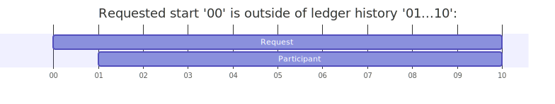
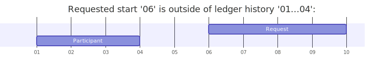
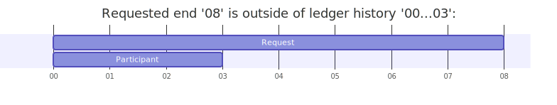
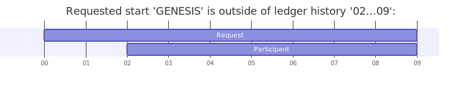
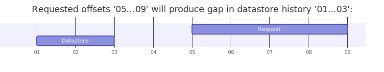
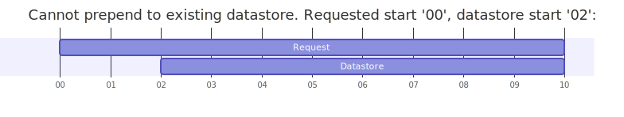
.. |Throughput| image:: assets/images/20240312-perf-tree-write-only.png?raw=true
.. |Resources| image:: assets/images/20240312-perf-tree-read-only-1.png?raw=true
.. |Concurrent scenarios| image:: assets/images/20240312-perf-tree-read-only-2.png?raw=true
.. |Query: alice - full transaction details| image:: assets/images/20240312-perf-tree-read-only-3.png?raw=true
.. |Query: alice - lookup contract| image:: assets/images/20240312-perf-tree-read-only-4.png?raw=true
.. |Query: alice - active tokens| image:: assets/images/20240312-perf-tree-read-only-5.png?raw=true
.. |Query: frank - active tokens| image:: assets/images/20240312-perf-tree-read-only-6.png?raw=true
.. |image11| image:: assets/images/20240312-perf-tree-mixed-1.png?raw=true
.. |image12| image:: assets/images/20240312-perf-tree-mixed-2.png?raw=true
.. |image13| image:: assets/images/20240312-perf-tree-mixed-3.png?raw=true
.. |image14| image:: assets/images/20240312-perf-tree-mixed-4.png?raw=true
.. |image15| image:: assets/images/20240312-perf-tree-mixed-5.png?raw=true
.. |image16| image:: assets/images/20240312-perf-tree-mixed-6.png?raw=true
.. |Throughput1| image:: assets/images/20240312-perf-acs-1.png?raw=true
.. |Throughput2| image:: assets/images/20240312-perf-acs-2.png?raw=true
.. |image17| image:: assets/images/20240110-perf-acs.png?raw=true
.. |image18| image:: assets/images/20240110-perf-tx.png?raw=true
.. |image19| image:: assets/images/20240110-perf-tree.png?raw=true
.. |image20| image:: assets/images/20231214-perf-acs.png?raw=true
.. |image21| image:: assets/images/20231214-perf-tx.png?raw=true
.. |image22| image:: assets/images/20231214-perf-tree.png?raw=true
.. |Dashboard| image:: assets/images/20240424-scribe-dashboard-grafana.png?raw=true
