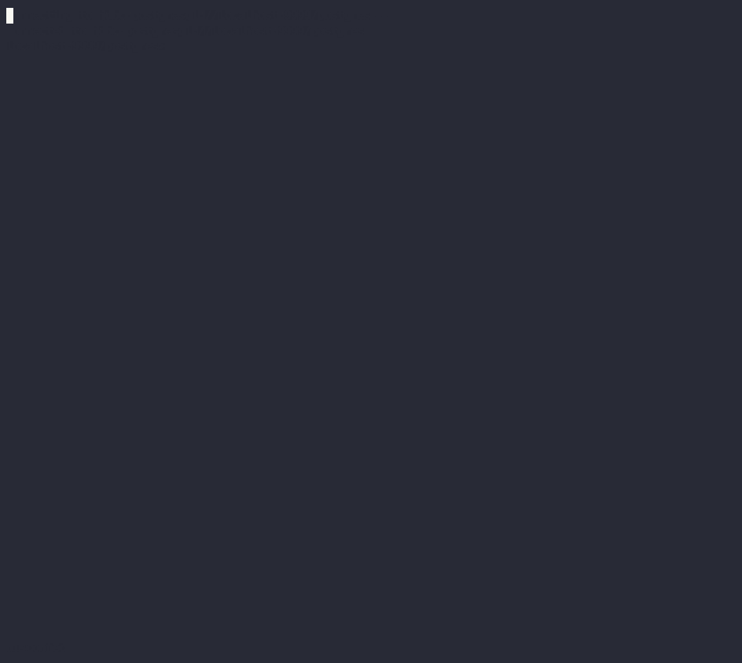

.. Copyright (c) 2024 Digital Asset (Switzerland) GmbH and/or its affiliates. All rights reserved.
.. SPDX-License-Identifier: Apache-2.0

.. enterprise-only::

Daml Shell (``daml-shell``)
###########################

Daml Shell is a terminal-based application that enables you to inspect a
Daml ledger by connecting to a live PQS datastore. With Daml Shell, you
can examine current or historical states of the ledger by querying
ledger events, transactions, and contracts. The Daml Shell CLI includes
extensive help via the ``help`` command.

Some of the actions that Daml Shell supports are:

-  Find a specific contract and display it. For example, if you have a
   contract ID, you can use Daml Shell to inspect the corresponding
   contract using the ``contract`` command.
-  Find all events related to a transaction ID. A transaction is
   displayed as a series of ledger events (creates, archives, and
   exercises).
-  Auto-completion for identifiers such as contract IDs, fully qualified
   names, and package IDs.
-  List active, inactive, or all contracts for a template using a
   template FQN.
-  Apply queries and filters to commands to manage the output.
-  Use the ``compare-contracts`` command to highlight the delta between
   two contract IDs for the same template.

To bound a search, specify a minimum and maximum offset value.

Daml Shell leverages PQS as its datastore and connects using JDBC. For
more information, see
:ref:`configuration`

Getting started
***************

Prerequisites
=============

Daml Shell connects to the PostgreSQL database of a Participant Query
Store (PQS). For setup instructions, see the `PQS
documentation <https://docs.daml.com/query/pqs-user-guide.html>`__.

Running Daml Shell
==================

You can run Daml Shell from a ``jar`` artifact or from a ``Docker``
image (`tag
list <https://hub.docker.com/repository/docker/digitalasset/daml-shell/tags?ordering=last_updated>`__).

.. code-block:: sh

   docker run -it --net host docker.io/digitalasset/daml-shell:<version-tag> # change --net host if desired

Commands
========

The easiest way to discover commands and filters is to type the ``help``
command while Daml Shell is running.

You can recurse into commands by typing
``help <command> <sub-command> [...]``. Auto-completion at the bottom of
the screen suggests possible command options.

|001-help-output.gif|

::

   > help
   NAME
       help - Display usage instructions

   SYNOPSIS
       help [<command>]

   DESCRIPTION
       CLI to interact with a Scribe database.
       
       Available commands:
         * active - active contracts
         * archives - archived contracts
         * compare-contracts - compare two contracts
         * connect - connect to JDBC URL
         * contract - contract by ID
         * creates - created contracts
         * disconnect - close database connection
         * exercise - choice by event-id
         * exercises - exercised choices
         * go - upper offset bound
         * help - Display usage instructions
         * net-changes - net contract counts
         * quit - quit the shell
         * set - configure application settings
         * transaction - transaction details

       Available filters:
         * csv - transform table data to csv format
         * export - write output to local file

Filters
=======

You can pipe command output through one or more ``filters`` using the
``|`` (pipe) symbol. For example,
``active Foo:Bar | csv | export ~/my_foos.csv``.

.. _configuration:

Configuration
*************

You can configure Daml Shell via CLI arguments, environment variables, a
configuration file, or interactively using the ``set`` command.

Command line arguments
======================

To see available command line options, run Daml Shell with the
``--help`` flag:

.. code-block:: sh

   Usage: daml-shell [options]

     -h, --help               prints this usage text
     --config <file>          HOCON config file with settings as key-value pairs
     --wildcard-char <char>   wildcard character used to abbreviate identifiers. Default: "…"
     --identifier-hash-length <length>
                              Number of characters to render for hashes inside identifiers. Default: 20
     --full-identifiers       Disable identifier shortening.
     --identifier-trim-location <leading|middle|trailing>
                              Where to trim long identifiers. Default: "trailing"
     --disable-color          Disable ANSI colored output.
     --postgres-host <host>   Postgres host to connect to. Implies --connect. Default: "localhost"
     --postgres-port <port>   Postgres port to connect to. Implies --connect. Default: 5432
     --postgres-username <username>
                              Postgres username to connect with. Implies --connect. Default: "postgres"
     --postgres-password <password>
                              Postgres password to connect with. Implies --connect. Default: none
     --postgres-database <name>
                              Postgres database to connect to. Implies --connect. Default: "postgres"
     --postgres-tls-mode <Disable|VerifyCA|VerifyFull>
                              TLS mode for Postgres connection. Implies --connect. Default: "Disable"
     --postgres-tls-cafile <path>
                              Path to the TLS CA file for Postgres connection. Implies --connect. Default: none
     --postgres-tls-cert <path>
                              Path to the TLS certificate file for Postgres connection. Implies --connect. Default: none
     --postgres-tls-key <path>
                              Path to the TLS key file for Postgres connection. Implies --connect. Default: none
     --connect                Auto-connect to the database on startup.

If you specify a ``--postgres-*`` flag, Daml Shell will automatically
connect to the database on startup.

Configuration file
==================

You can set Daml Shell parameters in a reusable configuration file in
HOCON (a JSON superset) using the flag ``--config <filename>``.

Example file content:

.. code-block:: text

   # file: application.conf
   oldest = "start"
   latest = "end"
   identifier-hash-length = 20
   wildcard-char = "…"
   identifier-trim-location = "trailing"
   full-identifiers = false
   disable-color = false
   postgres-host = "localhost"
   postgres-port = 5432
   postgres-username = "postgres"
   postgres-password = "mypassword"
   postgres-database = "postgres"
   postgres-tls-mode = "Disable"

Interactive configuration
=========================

You can configure settings interactively using the ``set`` command.
Example:

::

   > set identifier-hash-length full 
   Disabled identifier shortening

Type ``help set`` or ``help set <setting>`` to learn more about specific
settings.

Usage
*****

This section provides some basic usage examples.

Connecting
==========

Daml Shell leverages PQS as its datastore and connects using JDBC. You
can set connection parameters via configuration parameters or
interactively using a JDBC URL. For more information, see
:ref:`configuration`

To connect interactively, enter the JDBC URL of your PQS PostgreSQL
database. For example:

::

   > connect jdbc:postgresql://localhost/postgres?user=postgres&password=postgres

The status bar shows the connected status, the session offset range, and
the datastore offset range.

|003-connect.gif|

Offsets
=======

By default, offsets have leading zeroes removed. To see all identifiers
in full, including contract ID hashes, run
``set identifier-hash-length full`` or set a custom length limit for
hashes by running, for example, ``set identifier-hash-length 15``.

Depending on the ledger implementation, offsets may be in hexadecimal
format.

The available offset range from the datastore is specified in the
``Datastore range`` status field. The offset range for Daml Shell to use
to display payload counts and summaries is specified in the
``Session range`` status field.

You can move to different offsets by using the ``go`` command, which is
an alias for ``set latest``. ``go -2`` (go backward two offsets),
``go +2`` (go forward two offsets), ``go forward`` (alias ``go next``),
``go back`` (alias ``go backward``), ``go start``, and ``go end`` are
all examples of valid commands.

The ``net-changes`` command summarizes the changes effected by the
transaction at the current offset. The ``net-changes`` command also
accepts a target ``offset`` argument, or two ``offset`` arguments to
compare between (see ``help net-changes``).

::

   > net-changes 
   +3 PingPong:Cash [89a08f0324025f1…]
   -3 PingPong:CashTransferProposal [89a08f0324025f1…]
   +3 PingPong:IAsset [89a08f0324025f1…]
   -3 PingPong:IAssetTransferProposal [89a08f0324025f1…]

|003-offset-commands.gif|

Summary information
===================

Commands such as ``active``, ``archives``, ``creates``, and
``exercises`` can be used without argument to see payload counts by
fully qualified identifier names. For details, run ``help <command>``.

::

   > active
   ┌─────────────────────────────────────────┬───────────┬───────┐
   │ Identifier                              │ Type      │ Count │
   ╞═════════════════════════════════════════╪═══════════╪═══════╡
   │ PingPong:Cash [89a08f0324025f1…]        │ Template  │     6 │
   ├─────────────────────────────────────────┼───────────┼───────┤
   │ PingPong:IAsset [89a08f0324025f1…]      │ Interface │     6 │
   ├─────────────────────────────────────────┼───────────┼───────┤
   │ PingPong:IBounceable [89a08f0324025f1…] │ Interface │     2 │
   ├─────────────────────────────────────────┼───────────┼───────┤
   │ PingPong:Ping [89a08f0324025f1…]        │ Template  │     2 │
   └─────────────────────────────────────────┴───────────┴───────┘

|003-summary-commands.gif|

Payloads by fully qualified name
================================

Specify a fully qualified name (FQN) with the command ``active``,
``archives``, ``creates``, or ``exercises`` to list all applicable
payloads for that FQN.

To return payloads from a particular package only, include the package
ID in the FQN:

::

   > active 89a08f0324025f1254f09edc0195ca24459c6302e88d2b9f636d2be5a615d1f1:PingPong:Ping

If you omit the package ID, payloads from all package IDs are returned,
as long as they have the same name.

::

   > active PingPong:Ping
   ┌────────────┬──────────────────┬──────────────┬────────────────────────────────────────────────────────────────────────────────────┐
   │ Created at │ Contract ID      │ Contract Key │ Payload                                                                            │
   ╞════════════╪══════════════════╪══════════════╪════════════════════════════════════════════════════════════════════════════════════╡
   │ 8          │ 0022e89289bda36… │              │ label: one                                                                         │
   │            │                  │              │ owner: Alice::12209038d324bf70625c580267d5957cb4c4c03bb7bce294713b48151a4a088afd3b │
   ├────────────┼──────────────────┼──────────────┼────────────────────────────────────────────────────────────────────────────────────┤
   │ a          │ 0093dce322a08c8… │              │ label: one copy updated                                                            │
   │            │                  │              │ owner: Alice::12209038d324bf70625c580267d5957cb4c4c03bb7bce294713b48151a4a088afd3b │
   └────────────┴──────────────────┴──────────────┴────────────────────────────────────────────────────────────────────────────────────┘

The auto-completion provides both FQN variants (with and without package
ID).

Filtering with ``where`` clauses
================================

To refine your queries when listing contracts, you can use ``where``
clauses to filter on specific payload fields. ``where`` clauses use a
SQL-like syntax for conditionals and are supported for the ``active``,
``creates``, ``archives``, and ``exercises`` commands.

To access nested fields, use dot notation: ``parent.child.value``

Comparison operators
--------------------

-  ``=`` Equal to
-  ``!=`` Not equal to
-  ``>`` Greater than
-  ``>=`` Greater than or equal to
-  ``<`` Less than
-  ``<=`` Less than or equal to
-  ``like`` Used for pattern matching, ``%`` serves as a wildcard
   character

Logical operators
-----------------

-  ``and``: Both conditions must be satisfied
-  ``or``: Either condition may be satisfied

You can use parentheses to group conditions and direct the order of
evaluation.

Type casting
------------

To ensure proper comparison, you can optionally cast fields to a
specific type using the ``::`` operator. The available casting types are
``numeric``, ``timestamp``, and ``text``.

Field values are sorted and compared lexicographically if no cast is
specified.

``where`` clause examples
-------------------------

Here are some examples of how to use ``where`` clauses in commands:

-  Filter by a string pattern:

   ::

      > active where owner like Alice%

   Lists contracts where the ``owner`` field starts with the string
   ``Alice``.

-  Filter by a nested numeric field:

   ::

      > active where deeply.nested.value :: numeric > 1000

   Lists contracts where the nested field ``value`` is greater than
   ``1000``.

-  Filter with exact string match (note the use of double quotes):

   ::

      > active where label = "loren ipsum"

   Lists contracts where the label field is exactly ``loren ipsum``. Use
   double quotes with values that contain whitespace characters.

-  Combine different conditions:

   ::

      > active where (owner like Bob% or value :: numeric < 100) and myfield = myvalue

   Lists contracts where the ``owner`` starts with ``Bob`` or the
   ``value`` is less than ``100``, and ``myfield`` is ``myvalue``.

|003-where-clause.gif|

Contract lookup
===============

You can look up contracts by contract ID. Interface views are also
displayed, if any.

The contract ID can be copied with the wildcard character (here "…”)
included. The wildcard character will be expanded to any matching ID.

::

   > contract 0093dce322a08c8…
   ╓──────────────╥────────────────────────────────────────────────────────────────────────────────────╖
   ║ Identifier   ║ PingPong:Ping [89a08f0324025f1…]                                                   ║
   ╟──────────────╫────────────────────────────────────────────────────────────────────────────────────╢
   ║ Type         ║ Template                                                                           ║
   ╟──────────────╫────────────────────────────────────────────────────────────────────────────────────╢
   ║ Created at   ║ a                                                                                  ║
   ╟──────────────╫────────────────────────────────────────────────────────────────────────────────────╢
   ║ Archived at  ║ <active>                                                                           ║
   ╟──────────────╫────────────────────────────────────────────────────────────────────────────────────╢
   ║ Contract ID  ║ 0093dce322a08c8…                                                                   ║
   ╟──────────────╫────────────────────────────────────────────────────────────────────────────────────╢
   ║ Event ID     ║ #122099ed6675f2e…:1                                                                ║
   ╟──────────────╫────────────────────────────────────────────────────────────────────────────────────╢
   ║ Contract Key ║                                                                                    ║
   ╟──────────────╫────────────────────────────────────────────────────────────────────────────────────╢
   ║ Payload      ║ label: one copy updated                                                            ║
   ║              ║ owner: Alice::12209038d324bf70625c580267d5957cb4c4c03bb7bce294713b48151a4a088afd3b ║
   ╙──────────────╨────────────────────────────────────────────────────────────────────────────────────╜

   ╓──────────────╥─────────────────────────────────────────╖
   ║ Identifier   ║ PingPong:IBounceable [89a08f0324025f1…] ║
   ╟──────────────╫─────────────────────────────────────────╢
   ║ Type         ║ Interface                               ║
   ╟──────────────╫─────────────────────────────────────────╢
   ║ Created at   ║ a                                       ║
   ╟──────────────╫─────────────────────────────────────────╢
   ║ Archived at  ║ <active>                                ║
   ╟──────────────╫─────────────────────────────────────────╢
   ║ Contract ID  ║ 0093dce322a08c8…                        ║
   ╟──────────────╫─────────────────────────────────────────╢
   ║ Event ID     ║ #122099ed6675f2e…:1                     ║
   ╟──────────────╫─────────────────────────────────────────╢
   ║ Contract Key ║                                         ║
   ╟──────────────╫─────────────────────────────────────────╢
   ║ Payload      ║ ilabel: view one copy updated           ║
   ╙──────────────╨─────────────────────────────────────────╜

You can also compare two contracts in a ``diff``-style output format
using the ``compare-contracts <id1> <id2>`` command.

|003-compare-contracts.gif|

Transaction lookup
==================

You can look up transactions by either transaction ID or offset, by
running ``transaction <transaction-id>`` or ``transaction at <offset>``,
respectively. Note the ``at`` syntax when looking up by offset.

To display the current transaction at the head of the session offset
range, run ``transaction``.

The ``transaction`` command shows which contracts were created, which
were archived, and what choices were exercised. It also displays the
event ID for each of those events, as well as contract IDs and package
IDs.

|003-transactions.gif|

Exercise lookup
===============

Exercised choices can be looked up in the same manner as contracts,
except that exercises are looked up by their event ID rather than by a
contract ID. The commands for summaries and lookups mirror the
functionality available for contracts.

For example, you can look up exercise counts by FQN:

::

   > exercises 
   ┌───────────────────────────────────────────────────────────────┬───────────────┬───────┐
   │ Identifier                                                    │ Type          │ Count │
   ╞═══════════════════════════════════════════════════════════════╪═══════════════╪═══════╡
   │ PingPong:AcceptIAssetTransferProposal [89a08f0324025f1254f0…] │ Consuming     │     6 │
   ├───────────────────────────────────────────────────────────────┼───────────────┼───────┤
   │ PingPong:ChangeLabel [89a08f0324025f1254f0…]                  │ Consuming     │     1 │
   ├───────────────────────────────────────────────────────────────┼───────────────┼───────┤
   │ PingPong:Copy [89a08f0324025f1254f0…]                         │ Non-consuming │     1 │
   └───────────────────────────────────────────────────────────────┴───────────────┴───────┘

You can look up exercises for a specific choice:

::

   > exercises PingPong:AcceptIAssetTransferProposal 
   ┌────────┬───────────────────────┬──────────┬────────────────────────────────────────────────────────────────────────────────────────────────────────────────────────────────────────────┐
   │ Offset │ Contract ID           │ Argument │ Result                                                                                                                                     │
   ╞════════╪═══════════════════════╪══════════╪════════════════════════════════════════════════════════════════════════════════════════════════════════════════════════════════════════════╡
   │ 11     │ 005b18f0298576b2bf7d… │          │ 004af1af7f4c64f57b5eb52c95dcc686174d8939c0d3870f5b5f648acf16ec1774ca02122000ddecd621a6c304a9354c1cd6b6726e9815aed0fb9391395cac33ae2c846955 │
   ├────────┼───────────────────────┼──────────┼────────────────────────────────────────────────────────────────────────────────────────────────────────────────────────────────────────────┤
   │ 11     │ 003c2ae213b3149463f2… │          │ 002ad4f09e7b5e6d8f11fecb57f5da2be7ab8bce01adf86eabda86b79d3266e738ca0212201dd16c97b501db848761792e824cbd80a3e6767e4191b140287ba7ed32d2d807 │
   ├────────┼───────────────────────┼──────────┼────────────────────────────────────────────────────────────────────────────────────────────────────────────────────────────────────────────┤
   │ 11     │ 0022e9065ca19b435611… │          │ 0027d45f1732d8a044eb370eb5d19e27c913de4a6e5fd7026cef165dff71534481ca02122072decfd063e0508af764eb0e0e171125a2bb62abf9b877fc33f4bea39ce289e2 │
   ├────────┼───────────────────────┼──────────┼────────────────────────────────────────────────────────────────────────────────────────────────────────────────────────────────────────────┤
   │ 12     │ 00bc1500e6c781559ad1… │          │ 00a8753f0ccbc503ab393dae99d7ca982b15f1429b61739c03dad299d123f21e5aca02122090c1f0e10da810f4ee1a961a91701863dd22f9f360f676725540929069cee17e │
   ├────────┼───────────────────────┼──────────┼────────────────────────────────────────────────────────────────────────────────────────────────────────────────────────────────────────────┤
   │ 12     │ 001495835b90270f9699… │          │ 00ea78410739637ad2460e65ddf9382d2eef8d9a33a2ce38f912eaba065a342ebbca021220f5ffe34193c016a242a41735bf9670cf585a61e7423766bedbb15e92c6ea83be │
   ├────────┼───────────────────────┼──────────┼────────────────────────────────────────────────────────────────────────────────────────────────────────────────────────────────────────────┤
   │ 12     │ 00844b2f4a2fb8ff73fe… │          │ 00bc875c5ee7cc6adb11a48a2cb4272e4374affa94f23cb8a7b358946f3bd5c4b4ca0212209cb5521de33a5a2d931e0b97a312753d772e55529bc086e0fb75376123131b6f │
   └────────┴───────────────────────┴──────────┴────────────────────────────────────────────────────────────────────────────────────────────────────────────────────────────────────────────┘

To look up individual exercises, use the event ID:

::

   > exercise #12206159b8de32b97edb…:0
   ╓──────────────╥────────────────────────────────────────────────────────────────────────────────────────────────────────────────────────────────────────────╖
   ║ Event ID     ║ #12206159b8de32b97edb…:0                                                                                                                   ║
   ╟──────────────╫────────────────────────────────────────────────────────────────────────────────────────────────────────────────────────────────────────────╢
   ║ Choice       ║ PingPong:AcceptIAssetTransferProposal [89a08f0324025f1254f0…]                                                                              ║
   ╟──────────────╫────────────────────────────────────────────────────────────────────────────────────────────────────────────────────────────────────────────╢
   ║ Template FQN ║ PingPong:CashTransferProposal [89a08f0324025f1254f0…]                                                                                      ║
   ╟──────────────╫────────────────────────────────────────────────────────────────────────────────────────────────────────────────────────────────────────────╢
   ║ Contract ID  ║ 00bc1500e6c781559ad1…                                                                                                                      ║
   ╟──────────────╫────────────────────────────────────────────────────────────────────────────────────────────────────────────────────────────────────────────╢
   ║ Offset       ║ 12                                                                                                                                         ║
   ╟──────────────╫────────────────────────────────────────────────────────────────────────────────────────────────────────────────────────────────────────────╢
   ║ Consuming    ║ true                                                                                                                                       ║
   ╟──────────────╫────────────────────────────────────────────────────────────────────────────────────────────────────────────────────────────────────────────╢
   ║ Witnesses    ║ Bank::12204b77186b76c16e1c…, Bob::12204b77186b76c16e1c…                                                                                    ║
   ╟──────────────╫────────────────────────────────────────────────────────────────────────────────────────────────────────────────────────────────────────────╢
   ║ Parent       ║                                                                                                                                            ║
   ╟──────────────╫────────────────────────────────────────────────────────────────────────────────────────────────────────────────────────────────────────────╢
   ║ Argument     ║                                                                                                                                            ║
   ╟──────────────╫────────────────────────────────────────────────────────────────────────────────────────────────────────────────────────────────────────────╢
   ║ Result       ║ 00a8753f0ccbc503ab393dae99d7ca982b15f1429b61739c03dad299d123f21e5aca02122090c1f0e10da810f4ee1a961a91701863dd22f9f360f676725540929069cee17e ║
   ╙──────────────╨────────────────────────────────────────────────────────────────────────────────────────────────────────────────────────────────────────────╜

Transforming and exporting command output
*****************************************

You can convert tabular output to CSV by piping it through the ``csv``
filter:

::

   > active PingPong:Ping | csv

You can then write this output to a file by piping it through the
``export`` filter:

::

   > active PingPong:Ping | csv | export ~/my_pings.csv

The ``export`` filter will write any command output to the specified
file. You can use it without the ``csv`` filter.

|003-csv-export.gif|

Setting offset bounds
=====================

The output of ``creates [<fqn>]`` and ``archives [<fqn>]`` can be
bounded by ``set oldest`` (for the lower bound) and ``set latest`` (for
the upper bound). ``go`` is an alias for ``set latest``.

|003-bounded-lookup.gif|

Finding transactions that created or archived a contract
========================================================

Once you know the offsets that a contract was created at (for example,
by using the ``archives`` command), you can look up the relevant
transactions using the ``transaction at <offset>`` command.

|003-from-contract-to-transactions.gif|

FAQ
***

.. _no-archived-contracts:

Why don't I see any archived contracts?
=======================================

If you don't see any archived contracts, PQS might be configured to seed
the database from the ACS, which does not include historical offsets,
archived contracts, or exercised choices.

To see pre-existing archived contracts, seed the database from the
``Transaction Stream`` or ``Transaction Tree Stream``.

For best results, set ``--pipeline-ledger-start`` to ``Genesis`` when
running PQS for the first time (refer to the `PQS
documentation <https://docs.daml.com/query/pqs-user-guide.html>`__ or
``--help`` output).

Why don't I see any choices?
============================

Choices are only visible on the Ledger API's
``Transaction Tree Stream``. Set ``--pipeline-datasource`` to
``TransactionTreeStream`` when running PQS (refer to the `PQS
documentation <https://docs.daml.com/query/pqs-user-guide.html>`__ or
``--help`` output).

If you still don't see choices, see :ref:`no-archived-contracts`

Why don't I see any interface views?
====================================

Interfaces are only visible on the Ledger API's ``Transaction Stream``
or ACS (not the ``Transaction Tree Stream``).

Set ``--pipeline-datasource`` to ``TransactionStream`` when running PQS
(refer to the `PQS
documentation <https://docs.daml.com/query/pqs-user-guide.html>`__ or
``--help`` output).

Why do all contracts show the same ledger offset?
=================================================

See :ref:`no-archived-contracts`

.. |003-offset-commands.gif| image:: images/003-offset-commands.gif

.. |003-csv-export.gif| image:: images/003-csv-export

