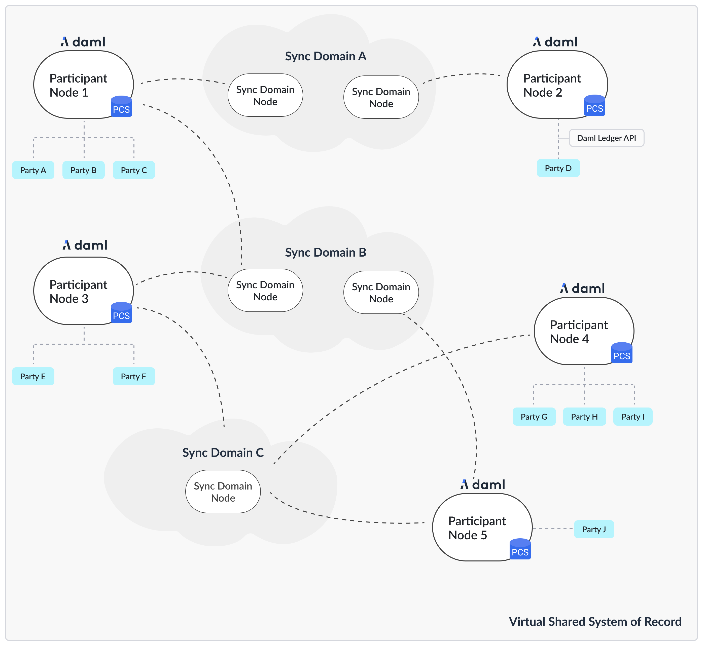
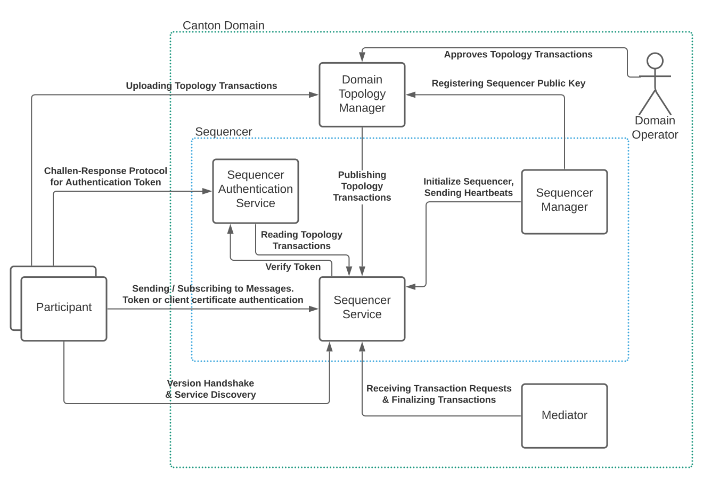

..
   Copyright (c) 2023 Digital Asset (Switzerland) GmbH and/or its affiliates.
..
   Proprietary code. All rights reserved.

.. _domain-architecture:

Synchronization Domain Architecture and Integrations
####################################################

Recall the high-level topology with Canton sync domain being backed by different
technologies, such as a relational database as well as block-chains like
Hyperledger Fabric or Ethereum.

.. https://app.lucidchart.com/documents/edit/da3c4533-a787-4669-b1e9-2446996072dc/0_0

In this chapter, we define the requirements specific to a Canton sync domain, explain
the generic sync domain architecture, as well as the concrete integrations for Canton
sync domain.

Synchronization Domain-Specific Requirements
********************************************

The :ref:`high-level requirements <requirements>` define requirements for Canton
in general, covering both participants and sync domains. This section categorizes and
expands on these high-level requirements and defines sync domain-specific
requirements, both functional and non-functional ones.

Functional Requirements
=======================

The sync domain contributes to the high-level functional requirements in terms of
facilitating the synchronization of changes. As the sync domain can only see
encrypted transactions, refer to transaction privacy in the non-functional
requirements, the functional requirements are satisfied on a lower level than
the Daml transaction level.

  .. _synchronization-domain-req:

* **Synchronization:** The sync domain must facilitate the synchronization of the
  shared ledger among participants by establishing a total-order of
  transactions.

  .. _transparency-domain-req:

* **Transparency:** The sync domain must inform the designated participants of
  changes to the shared ledger in a timely manner.

  .. _finality-domain-req:

* **Finality:** The sync domain must facilitate the synchronization of the shared
  ledger in an append-only fashion.

  .. _unnecessary-rejects-domain-req:

* **No unnecessary rejections:** The sync domain should minimize unnecessary
  rejections of valid transactions.

  .. _seek-support-domain-req:

* **Seek support for notifications:** The sync domain must facilitate offset-based
  access to the notifications of the shared ledger.

Non-Functional Requirements
===========================

Reliability
-----------

  .. _fail-over-domain-req:

* **Seamless fail-over for sync domain entities:** All sync domain entities must be able
  to tolerate crash faults up to a certain failure rate, e.g., 1 sequencer node
  out of 3 can fail without interruption.

  .. _resilience-domain-req:

* **Resilience to faulty sync domain behavior:** The sync domain must be able to detect
  and recover from failures of the sync domain entities, such as performing a
  fail-over on crash failures or retrying operations on transient failures if
  possible. The sync domain should tolerate byzantine failures of the sync domain
  entities.

  .. _backups-domain-req:

* **Backups:** The state of the sync domain entities must be backed up such that
  in case of disaster recovery, only a minimal amount of data is lost.

  .. _disaster-recovery-domain-req:

* **Site-wide disaster recovery:** In case of a failure of a data-center hosting
  a sync domain, the system must be able to fail over to another data center and
  recover operations.

  .. _resilience-participants-domain-req:

* **Resilience to erroneous behavior:** The sync domain must be resilient to
  erroneous behavior from the participants interacting with it.

Scalability
-----------

  .. _horizontal-scalability-domain-req:

* **Horizontal scalability:** The parallelizable sync domain entities and their
  sub-components must be able to horizontally scale.

  .. _large-tx-domain-req:

* **Large transaction support:** The sync domain entities must be able to cope with
  large transactions and their resulting large payloads.

Security
--------

  .. _compromise-recovery-domain-req:

* **Sync domain entity compromise recovery:** In case of a compromise of a sync domain
  entity, the sync domain must provide procedures to mitigate the impact of the
  compromise and allow to restore operations.

  .. _standard-crypto-domain-req:

* **Standards compliant cryptography:** All used cryptographic primitives and
  their configurations must comply with approved standards and be based on
  existing and audited implementations.

  .. _authnz-domain-req:

* **Authentication and authorization:** The participants interacting with the
  sync domain as well as the sync domain entities internal to the sync domain must authenticate
  themselves and have their appropriate permissions enforced.

  .. _secure-channel-domain-req:

* **Secure channel (TLS):** All communication channels between the participants
  and the sync domain as well as between the sync domain entities themselves have to
  support a secure channel option using TLS, optionally with client
  certificate-based mutual authentication.

  .. _distributed-trust-domain-req:

* **Distributed Trust:** The sync domain should be able to be operated by a
  consortium in order to distribute the trust of the participants in the sync domain
  among many organizations.

  .. _transaction-privacy-domain-req:

* **Transaction Metadata Privacy:** The sync domains entities must never learn the
  content of the transactions. The sync domain entities should learn a limited amount
  of transaction metadata, such as structural properties of a transaction and
  involved stakeholders.

Manageability
-------------

  .. _garbage-collection-domain-req:

* **Garbage collection:** The sync domain entities must provide ways to minimize the
  amount of data kept on hot storage. In particular, data that is only required
  for auditability can move to cold storage or data that has been processed and
  stored by the participants could be removed after a specific retention period.

  .. _upgradeability-domain-req:

* **Upgradeability:** The sync domain as a whole or individual sync domain entities must
  be able to upgrade with minimal downtime.

  .. _semantic-versioning-domain-req:

* **Semantic versioning:** The interfaces, protocols, and persistent data
  schemas of the sync domain entities must be versioned according to semantic
  versioning guidelines.

  .. _version-handshake-domain-req:

* **Sync domain-approved protocol versions:** The sync domain must offer and verify the
  supported versions for the participants. The sync domain must further ensure
  that the sync domain entities operate on compatible versions.

  .. _reuse-off-the-shelf-domain-req:

* **Reuse off-the-shelf solutions:** The sync domain entities should use
  off-the-shelf solutions for persistence, API specification, logging, and
  metrics.

  .. _metrics-domain-req:

* **Metrics on communication and processing:** The sync domain entities must expose
  metrics on communication and processing to facilitate operations and trouble
  shooting.

  .. _health-monitoring-domain-req:

* **Component health monitoring:** The sync domain entities must expose a health
  endpoint for monitoring.

Synchronization Domain-Internal Components
******************************************

The following diagram shows the architecture and components of a Canton sync domain
as well as how a participant node interacts with the sync domain.

.. https://lucid.app/lucidchart/55638ee7-4fc8-46f2-af4f-a4752ad708d2/edit?invitationId=inv_6666f0bc-caaf-4065-9867-8e0348b63bca

The sync domain consists of the following components:

* **Sync Domain Service:** The first point of contact for a participant node when
  connecting to a sync domain. The participant performs a version handshake with the
  sync domain service and discovers the available other services, such as the
  sequencer. If the sync domain requires a service agreement to be accepted by
  connecting participants, the sync domain service provides the agreement.

* **Sync Domain Topology Service:** The sync domain topology service is responsible for
  all topology management operations on a sync domain. The service provides the
  essential topology state to a new participant node, that is, the set of keys for
  the sync domain entities to bootstrap the participant node. Furthermore,
  participant nodes can upload their own topology transactions to the sync domain
  topology service, which inspects and possibly approves and publishes those
  topology transactions on the sync domain via the sequencer.

* **Sequencer Authentication Service:** A node can authenticate itself to the
  sequencer service either using a client certificate or using an authentication
  token. The sequencer authentication service issues such authentication tokens
  after performing a challenge-response protocol with the node. The node has to
  sign the challenge with its private key corresponding to a public key that
  has been approved and published by the sync domain identity service.

* **Sequencer Service:** The sequencer service establishes the total order of
  messages, including transactions, within a sync domain. The service implements a
  total-order multicast, i.e., the sender of a message indicates the set of
  recipients to which the message is delivered. The order is established based
  on a unique timestamp assigned by the sequencer to each message.

* **Sequencer Manager:** The sequencer manager is responsible for initializing
  the sequencer service.

* **Mediator:** The mediator participates in the Canton transaction protocol and
  acts as the transaction commit coordinator to register new transaction
  requests and finalizes those requests by collecting transaction confirmations.
  The mediator provides privacy among the set of transaction stakeholders as
  the stakeholders do not communicate directly but always via the mediator.

The sync domain operator is responsible for operating the sync domain infrastructure and
(optionally) also verifies and approves topology transactions, in particular to
admit new participant nodes to a sync domain. The operator can either be a single
entity managing the entire sync domain or a consortium of operators, refer to the
distributed trust security requirement.

Drivers
*******************

Based on the set of sync domain internal components, a driver implements
one or more components based on a particular technology. The prime component is
the sequencer service and its ordering functionality, with implementations
ranging from a relational database to a distributed blockchain. Components can
be shared among integrations, for example, a mediator implemented on a
relational database can be used together with a blockchain-based sequencer.

.. .. toctree::
   :maxdepth: 1

   ethereum.rst
   fabric.rst
