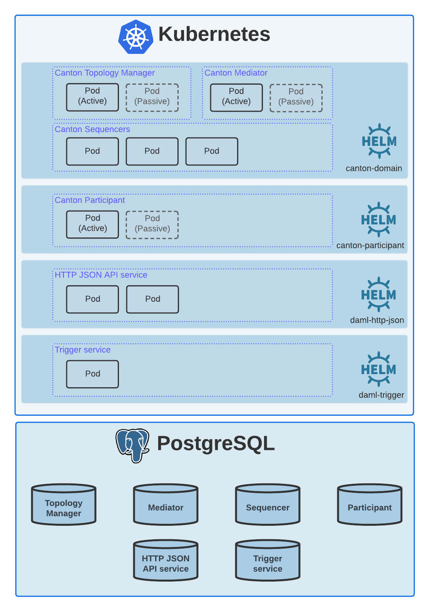

.. Copyright (c) 2023 Digital Asset (Switzerland) GmbH and/or its affiliates. All rights reserved.
.. SPDX-License-Identifier: Apache-2.0

How Do We Achieve High Availability for Daml Enterprise on Kubernetes?
######################################################################

Target Deployment
*****************

As a reminder, we are targeting the following Daml Enterprise
deployment:

For details, see the :doc:`Introduction <../01-introduction/overview>`.

Components
**********

Canton Participant
==================

This component is normally deployed in an active-passive cluster for
achieving high-availability.
However, in a Kubernetes environment this is not necessary as Kubernetes
takes care of ensuring the requested number of (ready) Pods are running,
hence, there is no need to have a stand-by (non-ready) replica:

-  **Selection of the active Pod is based on the health check.** The
   application won't be reporting ready till it can get hold of the DB
   lock.
-  **We deploy a single replica of the Pod.**

   -  If you increased replica count to more than 1, there would be only
      1 Pod available (and hence serving traffic) at any given time, as
      the DB lock may be held by a single Pod.
   -  If the application crashes, Kubernetes restarts the Pod. Upon
      restart, the application will likely lose the DB lock. It will
      result in not having traffic directed to this Pod.
   -  To ensure fast Pod restarts, we make sure all the Kubernetes nodes
      & workers already pulled the relevant container images. This is
      achieved via `Kubernetes Image
      Puller <https://github.com/che-incubator/kubernetes-image-puller>`_.

Note that the above approach may result in slight downtime, i.e., while the Pod
is being restarted and before it becomes ready.

Canton Domain: Topology Manager, Mediator
=========================================

We normally achieve high-availability via active-passive clustering for these
components. See the above section for details on why this is not necessary in a
Kubernetes environment, i.e., the same principles apply for these components as
for the Canton Participant.

Canton Domain: Sequencer
========================

We achieve high-availability via active-active clustering for these
components.

-  We deploy 2 replicas by default.
-  We set
   `stickiness <https://kubernetes.io/docs/concepts/services-networking/service/#session-stickiness>`_
   based on client IP (via
   `sessionAffinity <https://kubernetes.io/docs/reference/networking/virtual-ips/#session-affinity>`_,
   expires in 1 hour).

HTTP JSON API Server
====================

We achieve high-availability via active-active clustering for this
component.

-  We deploy 2 replicas by default.
-  No `session
   stickiness <https://kubernetes.io/docs/concepts/services-networking/service/#session-stickiness>`_.
-  Uses ``/livez`` and ``/readyz`` probes (see
   `documentation <https://docs.daml.com/json-api/index.html#healthcheck-endpoints>`_).

References
**********

Here are a few Kubernetes resource types & concepts that are relevant to
achieving high-availability:

-  `Service <https://kubernetes.io/docs/concepts/services-networking/service/>`_

   -  Sends workload only to pods that are ready.

-  `Deployment <https://kubernetes.io/docs/concepts/workloads/controllers/deployment/>`_
   >
   `ReplicaSet <https://kubernetes.io/docs/concepts/workloads/controllers/replicaset/>`_
   > `Pods <https://kubernetes.io/docs/concepts/workloads/pods/>`_

   -  Scheduler will try to get to the number of ready Pods you asked
      for.

-  `DaemonSet <https://kubernetes.io/docs/concepts/workloads/controllers/daemonset/>`_

   -  Ensures that a copy of a certain Pod is ran on all nodes.

-  `Health
   probes <https://kubernetes.io/docs/tasks/configure-pod-container/configure-liveness-readiness-startup-probes/#configure-probes>`_

   -  Allows Kubernetes to determine which Pods may server traffic or
      need to be restarted.
