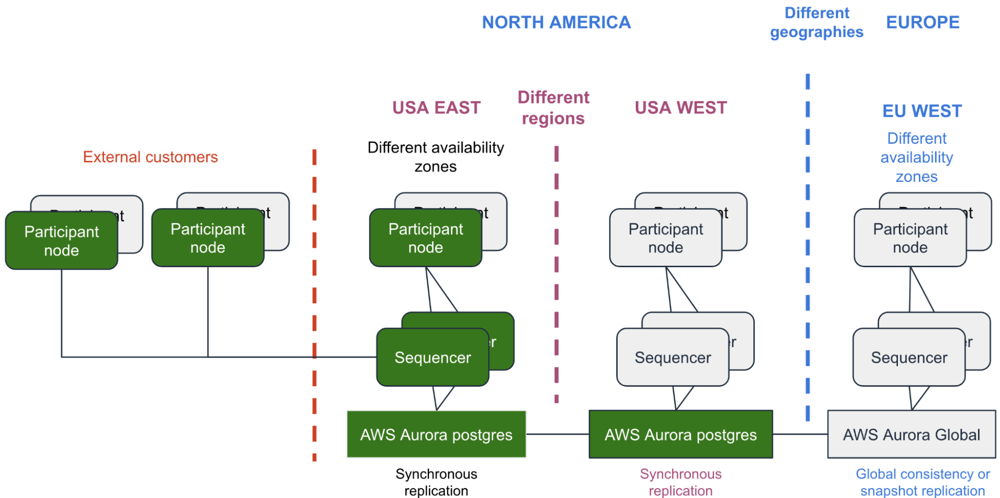

.. Copyright (c) 2023 Digital Asset (Switzerland) GmbH and/or its affiliates. All rights reserved.
.. SPDX-License-Identifier: Apache-2.0

Disaster Recovery (DR)
######################

Disaster recovery (DR) is the process of maintaining or reestablishing vital infrastructure and systems following a natural or human-induced disaster, such as a storm or battle. It employs policies, tools, and procedures. This section presents an overview of DR.  See the section :ref:`Repairing Nodes <repairing-nodes>` for the steps to recover Canton nodes in a DR situation. 

Disaster recovery assumes that the primary site is not immediately recoverable and restores data and services to a secondary site. [#f1]_

DR is only briefly introduced here because it includes business-related recovery processes and mechanisms that are beyond the Daml solution. The previously introduced metrics of Recovery Point Objective (RPO) and Recovery Time Objective (RTO) are important. Recovery from disaster is typically measured using values for RTO and RPO. 

In an Aurora global database used for DR, RTO can be in the order of minutes whereas RPO is typically measured in seconds. With an Aurora PostgreSQL-based global database, you can use the ``rds.global_db_rpo`` parameter to set and track the upper bound on RPO, but doing so might affect transaction processing on the primary cluster's writer node. 

For more information, see the AWS documentation on `managing RPOs for Aurora PostgreSQL–based global databases <https://docs.aws.amazon.com/AmazonRDS/latest/AuroraUserGuide/aurora-global-database-disaster-recovery.html#aurora-global-database-manage-recovery>`_.

The figure below expands on the HA AWS example by adding topology that addresses DR incidents. 

.. https://lucid.app/lucidchart/d3a7916c-acaa-419d-b7ef-9fcaaa040447/edit?invitationId=inv_b7a43920-f4af-4da9-88fc-5985f8083c95&page=0_0#

DR is usually more costly to architect and deploy than an HA solution. DR is expected to occur less frequently than an HA incident so the RTO for DR is longer than HA, perhaps even allowing some data loss in a DR incident. 

There are different approaches to keeping the backup databases in a DR solution as synchronized as possible to an active DB. One approach is to take frequent snapshots of the source and live database(s) and send them to the remote deployment that supports DR. The AWS documentation states the following:

    You can restore a snapshot of an Aurora DB cluster or from an Amazon RDS DB instance to use as the starting point for your Aurora global database. You restore the snapshot and create a new Aurora-provisioned DB cluster at the same time. You then add another AWS Region to the restored DB cluster, thus turning it into an Aurora global database. Any Aurora DB cluster that you create using a snapshot in this way becomes the primary cluster of your Aurora global database. [#f2]_

It's important to take care during and after a failover in a DR situation. AWS advises: 

    Make sure that application writes are sent to the correct Aurora DB cluster before, during, and after making these changes. Doing this avoids data inconsistencies among the DB clusters in the Aurora global database (split-brain issues). [#f3]_

Alternatively, AWS says in Managing RPOs for Aurora PostgreSQL-based global databases: 

    With an Aurora PostgreSQL-based global database, you can manage the recovery point objective (RPO) for your Aurora global database by using PostgreSQL's ``rds.global_db_rpo`` parameter. RPO represents the maximum amount of data that can be lost in the event of an outage.

    This parameter is supported by Aurora PostgreSQL. Valid values for ``rds.global_db_rpo`` range from 20 seconds to 2,147,483,647 seconds (68 years). [#f4]_

Some additional AWS links of interest on this topic: 

* `Fast failover with Amazon Aurora PostgreSQL <https://docs.aws.amazon.com/AmazonRDS/latest/AuroraUserGuide/AuroraPostgreSQL.BestPractices.FastFailover.html>`_.
* `Fast recovery after failover with cluster cache management for Aurora PostgreSQL <https://docs.aws.amazon.com/AmazonRDS/latest/AuroraUserGuide/AuroraPostgreSQL.cluster-cache-mgmt.html>`_.

.. rubric:: Footnotes

.. [#f1] https://en.wikipedia.org/wiki/Disaster_recovery as retrieved 02/22/2023
.. [#f2] https://docs.aws.amazon.com/AmazonRDS/latest/AuroraUserGuide/aurora-global-database-getting-started.html#aurora-global-database.use-snapshot
.. [#f3] https://docs.aws.amazon.com/AmazonRDS/latest/AuroraUserGuide/aurora-global-database-disaster-recovery.html#aurora-global-database-failover
.. [#f4] https://docs.aws.amazon.com/AmazonRDS/latest/AuroraUserGuide/aurora-global-database-disaster-recovery.html#aurora-global-database-manage-recovery

