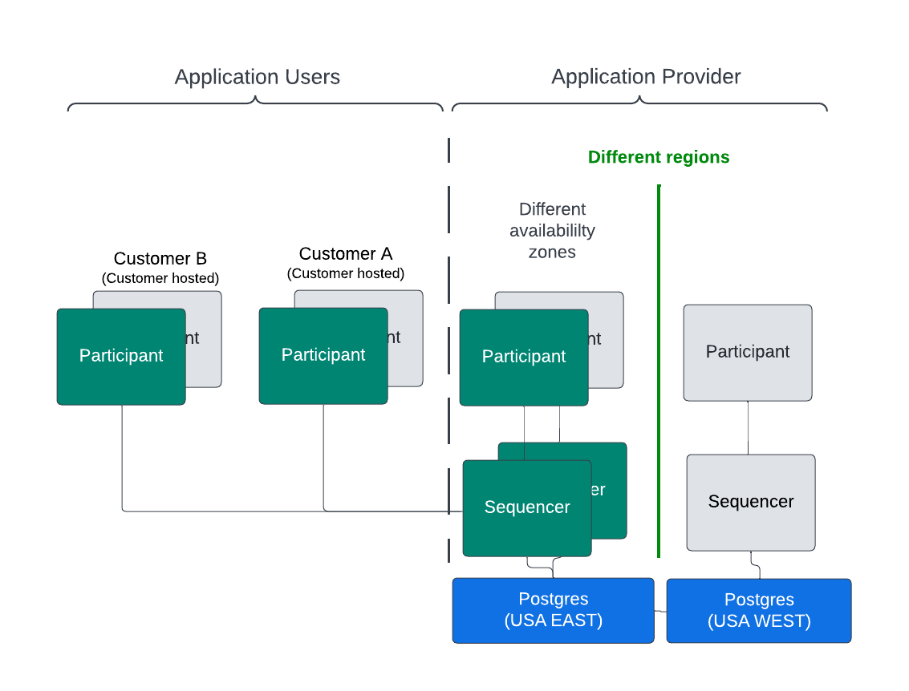
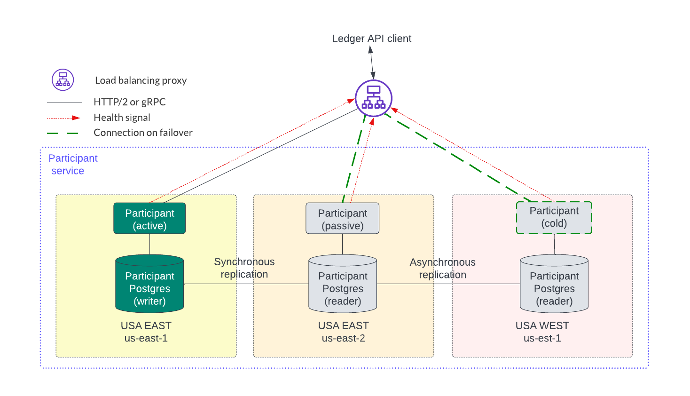
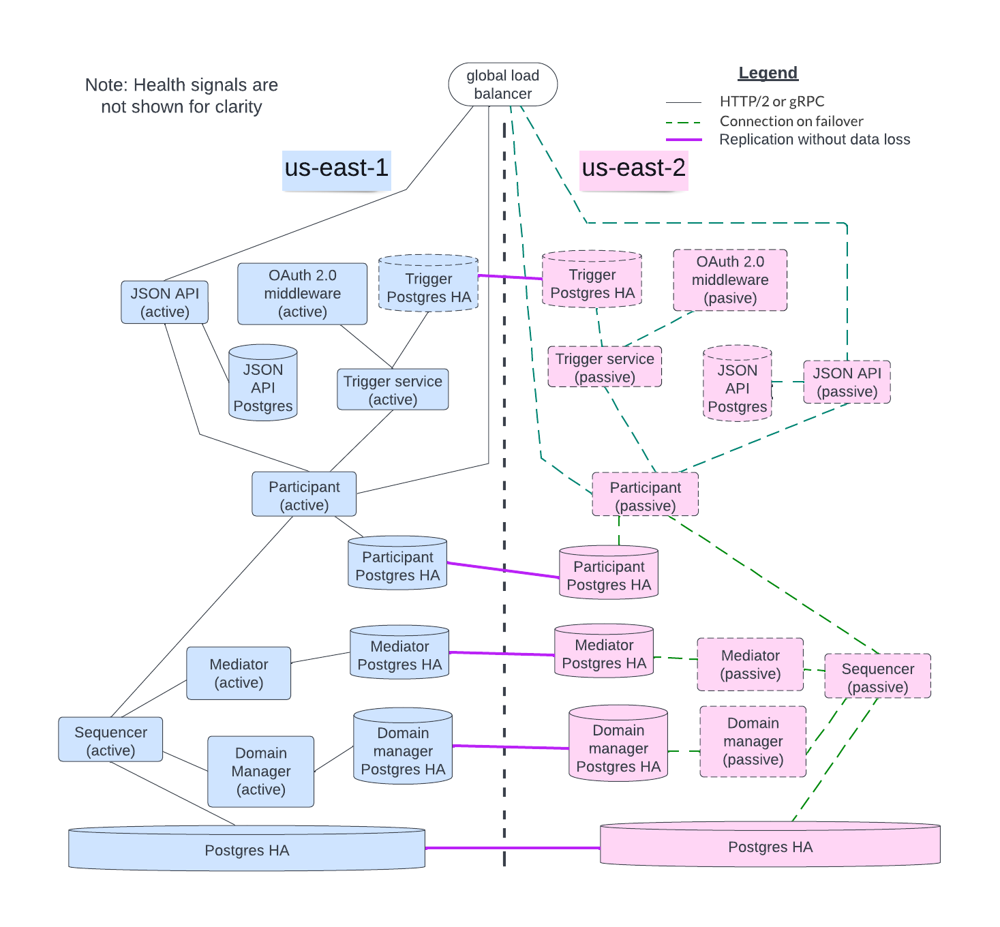

.. Copyright (c) 2023 Digital Asset (Switzerland) GmbH and/or its affiliates. All rights reserved.
.. SPDX-License-Identifier: Apache-2.0

HA in the Cloud
###############

The HA deployment and horizontal scaling models already discussed are generic by design and focus on handling single-component failures automatically and transparently. Cloud deployment, along with orchestration tools, adds additional HA capabilities and options for more complex failure modes. 

The figure below shows a minimal, high-level, AWS-based HA solution. The active nodes are green and the passive nodes are gray. Different availability zones can house different instances of the components within a service to provide location resiliency. For example, if the active participant node in US-EAST-1 fails then the passive node in US-EAST-2 becomes the active node. 

.. https://lucid.app/lucidchart/d3a7916c-acaa-419d-b7ef-9fcaaa040447/edit?invitationId=inv_b7a43920-f4af-4da9-88fc-5985f8083c95&page=0_0#

.. NOTE::
    Network connectivity between the relevant components is not shown.

Having redundant components in different regions creates additional location resiliency. For example, in the figure above, an active participant node is deployed in the USA EAST region and a passive participant node in the USA WEST region. The redundant, passive participant may not even be running depending on how the HA solution has been architected to satisfy the business requirements, such as:

* The entire Daml solution stack may switch over to a different region all at once with a global load balancer redirecting the requests to the newly activated region. This can address the situation where a normally active region becomes unavailable.
* Single components may be started in different regions for a finer-grained HA approach. This introduces additional network latency for cross-region traffic. 
* Directing a switchover from one region to another is atypical and adds complexity so this may be manually initiated, or require manual approval, to avoid flapping from one region to another when a problem is intermittent.
* The sequencer backend is an HA database that can work across regions. The options are discussed below. Sequencers in an availability zone can be running since they act in an active-active mode.  

A redundant sequencer in a different region may be cold and need to be started if the PostgreSQL database it is connected to is read-only. The sequencer backend database in the example is PostgreSQL operating in a highly available manner with a single write node and read-only replicas. However, the read-only replicas and write nodes use synchronous replication to avoid data loss - the sequencer backend can look like a ledger fork to participant nodes if there is data loss. 

Per AWS:

    When writes involve synchronous replication across multiple Regions to meet strong consistency requirements, write latency increases by an order of magnitude. A higher write latency is not something that can typically be retrofitted into an application without significant changes. [#f1]_

Synchronous replication impacts latency and throughput so tuning and testing are needed. 

Although not shown in the figure above, the databases for each service may need to be highly available and shared across availability zones and regions. To illustrate this, the participant service is expanded into three regions in the figure below. The latencies within a region are expected to be low so synchronous replication within a region provides an RPO of zero for single failures. Asynchronous replication for a participant node can be used across regions but it can incur some data loss as described in the `restore caveats documentation <../../../canton/usermanual/persistence.html#restore-caveats>`_.

.. https://lucid.app/lucidchart/d3a7916c-acaa-419d-b7ef-9fcaaa040447/edit?invitationId=inv_b7a43920-f4af-4da9-88fc-5985f8083c95&page=0_0#

The initial block diagram in this section expands into the larger figure below which shows all the services acting in HA mode. The sequencer backend, participant, mediator, and sync domain manager nodes all have replicated databases ensuring no data loss. 

By leveraging the elasticity of the cloud, the orchestration tool may provide possible cost reduction, at the expense of additional recovery time, by not running the passive node instances in the background. Instead, the orchestration tool starts a passive node when it detects the active node is unhealthy or has failed. In general, the node startup time is typically several seconds. However, additional time may be needed for additional data synchronization. Passive nodes can also be running in standby mode but this incurs the cost of running those nodes.

.. https://lucid.app/lucidchart/d3a7916c-acaa-419d-b7ef-9fcaaa040447/edit?invitationId=inv_b7a43920-f4af-4da9-88fc-5985f8083c95&page=0_0#

When there is a failover in the Daml solution, some requests may not succeed. Specifically, with the Canton transaction consensus protocol either a request completes in its entirety or there are no changes. This means that, although there is no cleanup required for failed requests, the application is responsible for retrying the failed request that did not complete during a failover event. The application needs to be designed to handle this scenario (which is a common requirement for web-based applications). 

See the documentation on the metrics `RTO and RPO <../ha-and-scaling/understanding-ha.html#other-common-metrics-rto-and-rpo>`_ for more information.

Database Options
****************

Each cloud vendor chooses from several PostgreSQL options. Selection is ultimately driven by business requirements, which drive the HA requirements fulfilled by selecting the appropriate PostgreSQL option. A managed database selection allows for trade-offs in availability if choosing between an Aurora DB cluster or an Aurora global database. Amazon RDS for PostgreSQL is a self-managed option which is more flexible than the managed service. Each of these options is introduced below to explore what each can provide in an HA context.    Each option has a different cost profile so make sure that you are using the least costly option that matches your requirements.

.. note::

    Multiple versions of PostgreSQL are tested for compatibility with Canton and
    PQS in traditional deployment configurations. PostgreSQL comes in many
    varieties that allow NFR trade-offs to be made (e.g., latency Vs. read
    operation scaling Vs. HA Vs. cost). Not all of these variants are
    tested for compatibility but all are expected to work with Canton and PQS.
    However, sufficient application testing is required to ensure that the
    SLAs of the ledger API and PQS clients are met.  In particular, serverless
    Postgres has transient behaviors which require a robust application
    PostgreSQL process to verify that application SLAs are met (e.g., transaction
    latency is not greatly impacted by auto-scaling).
    
Although the examples presented here are for AWS, other cloud vendors have similar technologies that are compatible with PostgreSQL. Please consult the relevant cloud vendors documentation.

Amazon RDS for PostgreSQL, Multi-AZ with two readable standbys [#f2]_
=====================================================================

This is a self-managed option for deploying: 

    highly available, durable MySQL or PostgreSQL databases in three AZs using Amazon RDS Multi-AZ with two readable standbys. Gain automatic failovers in typically under 35 seconds, up to 2x faster transaction commit latency compared to Amazon RDS Multi-AZ with one standby, additional read capacity, and a choice of AWS Graviton2 - or Intel-based instances for compute. [#f2]_

    Amazon Aurora database provides RPO zero at the storage level by requiring at least four of the six storage nodes to acknowledge receipt before confirming the transaction. Aurora splits the six storage nodes across Availability Zones (AZs) in an AWS Region. Amazon Relational Database Service (Amazon RDS) Multi-AZ (except SQL Server) provides close to RPO zero at the storage level independently of the database. It writes each block synchronously to two Amazon Elastic Block Storage (Amazon EBS) volumes in two different AZs. [#f3]_

Amazon Aurora DB cluster [#f4]_
===============================

This option:

    consists of one or more DB instances and a cluster volume that manages the data for those DB instances. An Aurora cluster volume is a virtual database storage volume that spans multiple Availability Zones, with each Availability Zone having a copy of the DB cluster data. [#f4]_
    
Additionally, 

    An Aurora Replica is an independent endpoint in an Aurora DB cluster, best used for scaling read operations and increasing availability. An Aurora DB cluster can include up to 15 Aurora Replicas located throughout the Availability Zones of the Aurora DB cluster's AWS Region. [#f5]_

Aurora global database [#f6]_
=============================

This database:

    consists of one primary AWS Region where your data is written, and up to five read-only secondary AWS Regions. You issue write operations directly to the primary DB cluster in the primary AWS Region. Aurora replicates data to the secondary AWS Regions using dedicated infrastructure, with latency typically under a second. … An Aurora global database supports two different approaches to failover. … [#f6]_

    Recovery from Region-wide outages - The secondary clusters allow you to make an Aurora global database available in a new primary AWS Region more quickly (lower RTO) and with less data loss (lower RPO) than traditional replication solutions. [#f6]_

.. rubric:: Footnotes

.. [#f1] https://docs.aws.amazon.com/whitepapers/latest/aws-multi-region-fundamentals/multi-region-fundamental-2-understanding-the-data.html
.. [#f2] https://aws.amazon.com/rds/features/multi-az/
.. [#f3] https://aws.amazon.com/blogs/publicsector/a-pragmatic-approach-to-rpo-zero/
.. [#f4] https://docs.aws.amazon.com/AmazonRDS/latest/AuroraUserGuide/Aurora.Overview.html
.. [#f5] https://docs.aws.amazon.com/AmazonRDS/latest/AuroraUserGuide/AuroraMySQL.Replication.html
.. [#f6] https://docs.aws.amazon.com/AmazonRDS/latest/AuroraUserGuide/aurora-global-database.html
