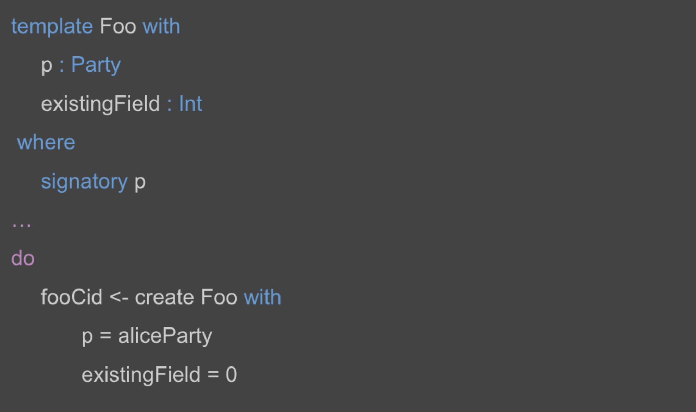
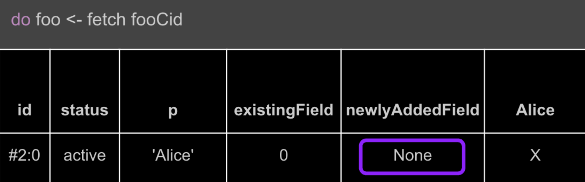
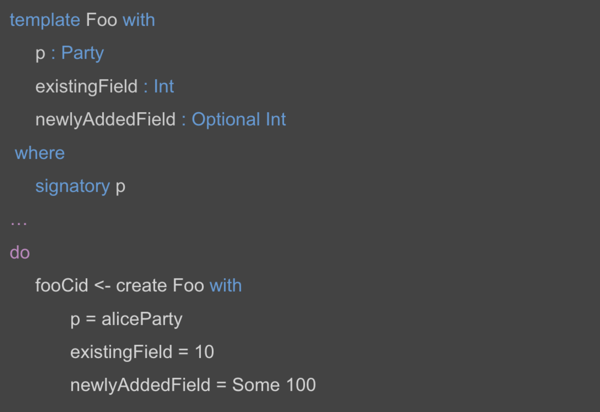
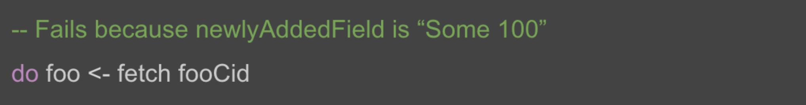
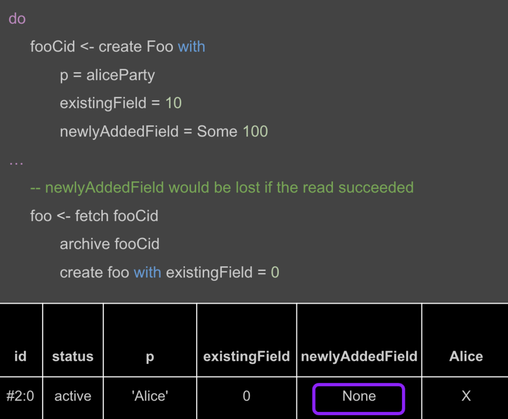
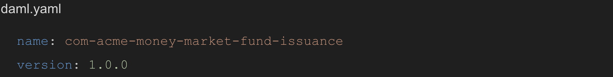

Architectural Considerations for Upgrading a Daml Application
#############################################################
Upgrading a Daml application involves deploying new versions of its components to modify existing workflows or introduce new workflows. The upgrade process must ensure data continuity, allowing the application state and in-flight workflows to remain accessible and advance without interruption post-upgrade. Note, in this context, “in-flight” refers to incomplete multi-step workflows that are stable on-ledger, rather than transactions being processed.

This document provides a high-level overview of the recommended approach for upgrading a Daml application, the associated challenges, methods to ensure backward compatibility, and strategies for testing and rollback. It also serves as a cross-reference to the *Upgrading Daml Applications* lesson in the `Technical Solution Architect certification path <https://daml.talentlms.com/plus/catalog/courses/161>`_. For a walkthrough of the upgrade process with a specific workflow example, refer to :doc:`Upgrading Daml Applications <../upgrade/upgrade>`.

In practice, the frontends, backends, and Daml models of an application evolve at different cadences, with frontends and backends often changing faster than Daml models. For instance, the internal implementation of a server that provides an API often changes more frequently than the API itself, in which case the frontends and backends must specify the minimum version of DAR files required for compatibility. For simplicity, this document refers to:

* v1: Currently deployed components.
* v2: New components introduced during the upgrade.

.. _recommended-approach:

1. Recommended Approach
=======================

1.1 Asynchronous Rollout with a Synchronous Switch-Over
-------------------------------------------------------
The recommended high-level approach combines an asynchronous rollout with a synchronous switch-over:

1. Asynchronous Rollout:

   * The app provider implements and tests v2 app components.
   * The app provider makes the v2 components available to app users.
   * The app provider and users asynchronously roll out the upgraded backends and frontends, and audit the upgraded DAR packages.

The frontends and backends should support both v1 and v2 workflows, allowing the app provider and app users to deploy their updates independently on their own schedules. Mixed-version deployments are expected until all users switch to v2 workflows. 

Switching to v2 workflows may require more than deploying and using v2 components; it may also involve migrating contracts on the ledger from v1 to v2. Mixed-version deployments may be necessary until all contracts that need to be migrated have been successfully migrated.

2. Synchronous Switch-Over:

   * The app provider publishes a target date for app users to complete the upgrade and decommission v1.
   * Shortly before the target upgrade date, the app provider and users coordinate to deploy the v2 DAR files to their Canton participant nodes.

The switch-over ensures that the new workflows are synchronized on-ledger as of the target date.

1.2 Risks of Uncoordinated Switch-Overs
---------------------------------------
Uncoordinated transitions to v2 workflows can cause command submission failures, resulting in workflows getting stuck. Common scenarios include:

* Daml Models Version Mismatch: A command referencing v2 workflows fails if a stakeholder’s participant node lacks the required v2 Daml models.

* Explicit Disclosure: When a v2 contract is used in explicit disclosure, a command referencing it fails if the submitting party’s participant node lacks the required v2 Daml models. This occurs, even though all stakeholders of the disclosed contract have uploaded v2 Daml models, as a v2 contract couldn’t be created otherwise.

2. Challenges
=============
The recommended approach is designed to address several key challenges associated with upgrading a Daml application. These challenges arise due to the distributed nature of Daml applications and their deployment across organizational boundaries. 

* Asynchronous Rollouts

  * Problem: The app provider and app users often cannot upgrade simultaneously.
  * Requirement: Ensure upgrades allow for asynchronous rollouts so that users and providers can independently determine their deployment schedules for upgraded components.

* Mixed-Version Deployments
  
  * Problem: Due to asynchronous rollouts, the app must temporarily support mixed-version deployments across organizations. 
  * Requirement: Ensure backward compatibility between the frontends/backends and the DAR workflows from the previous version, after following the :ref:`recommended approach <recommended-approach>`.

* Zero-Downtime Upgrades
  
  * Problem: Certain workflows may need to progress 24/7 without interruption.
  * Requirement: Ensure zero-downtime upgrades by following the :ref:`recommended approach <recommended-approach>` along with other additional measures. One such measure is `Smart Contract Upgrade (SCU) <https://docs.daml.com/upgrade/smart-contract-upgrades.html#what-is-smart-contract-upgrade-scu>`_, which is introduced in the following :ref:`Backward Compatibility <backward-compatibility>` section. These practices allow workflows to continue uninterrupted during the upgrade process.

Given the challenges, upgrades should be planned carefully to minimize disruption. In some cases, it may be more efficient to allow short-lived workflows to complete before switching to the new version, rather than attempting to upgrade them mid-process. Meanwhile, all new instances should start with the new version to ensure consistency.

.. _backward-compatibility:

3. Backward Compatibility
=========================

3.1 Backward-Compatible Changes to Daml Models
----------------------------------------------
Starting with `Daml version 2.9 <https://blog.digitalasset.com/developers/release-notes/2.9.1#:~:text=Smart%20Contract%20Upgrading%20(Beta)>`_, `Smart Contract Upgrade (SCU) <https://docs.daml.com/upgrade/smart-contract-upgrades.html#what-is-smart-contract-upgrade-scu>`_ supports several backward-compatible changes to facilitate zero-downtime cross-version interactions:

3.1.1 Adding `Optional` Fields
~~~~~~~~~~~~~~~~~~~~~~~~~~~~~~
`Optional` fields can be added to contracts, choice arguments, and choice return types, with the following default component behaviors.

* Scenario 1: Reading Daml Values from an Older Version for Backward Compatibility

When a component, such as a Ledger API client, fetches a contract created from an older version of a Daml template that has since been updated, the newly introduced `Optional` fields are defaulted to `None` to maintain backward compatibility. This ensures that older contracts remain readable even after a template evolves.

Example: v1 Contract Created Before the New Field Existed

Should v2 introduce an `Optional` field `newlyAddedField`, a contract `fooCid` created using v1 can still be used by a v2 component without an explicit upgrade. When a newer client with v2 components fetches `fooCid`, Daml execution automatically defaults `newlyAddedField` to `None` based on the newer versions of the DAR package. Note that default assignment occurs only within Daml execution and not at the Ledger API level, in PQS, or in client libraries.

Since `newlyAddedField` did not exist in v1, Daml execution defaults it to `None`, allowing the v2 component to fetch the contract without breaking.

* Scenario 2: Reading Daml Values from a Newer Version to Prevent Data Loss

When Daml code referencing an older version of a Daml template fetches a contract instance of a newer version, the fetch succeeds only if the value of all unknown fields is `None`. If any unknown field contains a value other than `None`, the fetch fails. This prevents unintended data loss in workflows like archive-and-recreate.

Example: v2 Contract Created with a New Optional Field

Suppose an older client with v1 components tries to fetch `fooCid`. Since `newlyAddedField` exists and has a value `Some 100`, the read fails:

This failure prevents data loss in workflows like archive-and-recreate:

Had the read succeeded, `newlyAddedField` would have been defaulted to `None`, causing silent data loss. Instead, the Daml engine fails any transaction that involves such contracts. To advance the workflows, the Daml models on the participant node must be upgraded before the Daml engine can fetch the contract.

3.1.2 Daml Record as Choice Return Types
~~~~~~~~~~~~~~~~~~~~~~~~~~~~~~~~~~~~~~~~
* When adding `Optional` fields to choice return types, the return type must be a Daml record rather than a scalar type or assembly type, such as a tuple, list, set, or map. 
* When designing a choice that may include a new field in its return value in the future, use a Daml record as the return type. A Daml record is preferred over a tuple for choice return types.

3.1.3 Adding New Constructors to Variants, Including Enums
~~~~~~~~~~~~~~~~~~~~~~~~~~~~~~~~~~~~~~~~~~~~~~~~~~~~~~~~~~
* New constructors can be added to variants, including enums. Newer versions of a DAR package can add new constructors to variant types, including enums.
* Downgrading these changes, such as using a new constructor in older versions, fails just as downgrading a newly added `Optional` field with a non-`None` value fails.

3.1.4 Adding New Choices
~~~~~~~~~~~~~~~~~~~~~~~~
* New choices in v2 are available on active contracts created with v1 once all stakeholders’ participant nodes have uploaded the v2 DAR files.

3.1.5 Modifying Existing Choices
~~~~~~~~~~~~~~~~~~~~~~~~~~~~~~~~
* Controllers, observers, and the choice body can be updated for bug fixes or to handle new arguments.
* Existing choices cannot be removed but can be made non-functional using the `abort` function.

3.1.6 Updating Signatories, Observers, and `ensure` Clauses
~~~~~~~~~~~~~~~~~~~~~~~~~~~~~~~~~~~~~~~~~~~~~~~~~~~~~~~~~~~
* The code for determining signatories, observers, and ensure clauses can be updated, but with restrictions. For existing contracts, the computed signatories and observers must remain unchanged. When a contract is fetched or exercised, Daml recomputes these values using the latest code and compares them to the original values. If they don’t match, the transaction is aborted to prevent unintended permission changes.
* The ensure clause is also recomputed and re-evaluated for existing contracts when fetching or exercising choices on them.

3.1.7 Adding Interface Definitions and Instances
~~~~~~~~~~~~~~~~~~~~~~~~~~~~~~~~~~~~~~~~~~~~~~~~
* Interface definitions cannot be changed once deployed. Always place interface definitions in a standalone package containing only interfaces and no templates.
* New interface instances can be added, but existing instances cannot be removed from a template. Interface choices can be made inoperable by having them evaluate to `error “No longer implemented.”`

3.1.8 Adding and Deprecating Templates
~~~~~~~~~~~~~~~~~~~~~~~~~~~~~~~~~~~~~~
New templates can be added, while existing templates cannot be removed but can be deprecated by:

* Removing references to them from other Daml code.
* Adding `ensure False` to make them non-operational. This prevents new contract creation using the template and choice exercises, including the implicit `Archive` choice, on existing contracts created using the template. 

Note that the latter approach may result in a large number of active contracts stored on the ledger without a way to archive them, unless another update is deployed to evaluate the `ensure` clause to `True`. To deprecate a template without leaving contracts on the ledger that cannot be archived, add `ensure False` to the template only after all active contracts created from it have been archived through automation or other means.

3.1.8.1 Understanding Contract Archival in Daml
^^^^^^^^^^^^^^^^^^^^^^^^^^^^^^^^^^^^^^^^^^^^^^^
At a purely technical level, "archived" means a consuming choice has been exercised on the contract. However, there are meaningful distinctions between the various business and operational contexts in which an archive may occur.

1. Natural End of Lifecycle: The contract represents a business entity whose lifecycle has naturally ended. For example, a loan contract might be archived when the loan is fully repaid.

2. State No Longer Holds True: The contract attested to a certain business state, but that state is no longer valid. For instance, an agreement that was conditional on certain criteria might be archived when those criteria are no longer met.

3. Modification of the Underlying Entity/State: The business entity or state represented by the contract itself is still relevant; however, because Daml contracts are immutable, the update requires archiving the outdated contract. If the updated contract is written using v2, this results in an organic and incremental migration away from v1.

4. Explicit Upgrade: The contract is archived as part of an upgrade process, preferably by an upgrade runner. This can be done during planned downtime, but in most cases, it can be done incrementally via a throttled background process. As a business operation, this is distinct from the previous three.

While all of these cases result in an "archive" ledger event, they represent different business operations with varying levels of impact. The ordering (1 → 4) reflects a general preference for minimal impact, with natural expiration being the least disruptive and explicit upgrades requiring more intervention.

The incremental migration in case 3, can be handled in various ways, including but not limited to:

* On-Ledger Dual-Version Handling: Daml logic explicitly and entirely manages both v1 and v2 contracts with the support of zero-downtime upgrades.
* Off-Ledger Service/Automation: Use external systems to transform v1 into v2. Some "helper contracts" may still exist on-ledger to facilitate the transition, but the actual logic of migrating v1 to v2 occurs outside Daml.

The preferred approach is to handle versioning and upgrades directly in Daml rather than relying on external automation. However, in some cases, a valid v2 can only be generated from a v1 in consultation with either off-ledger systems or Active Contract Set (ACS)/Participant Query Store (PQS) queries that require off-ledger support.

3.2 Backward Compatibility in Backend Code
------------------------------------------
To ensure that ledger reads in the v2 backend remain compatible with contracts created using v1 Daml models, use transaction and contract filters with symbolic package references. These references take the form of `#package-name:module-name:template-id` for ledger reads to retrieve data from all contracts that are instances of the template with `module-name` and `template-id` of any version of the `package-name`. 

Since newer versions of a template may introduce fields of type `Optional` that did not exist in earlier versions, the backend must handle cases where these fields are missing. The Daml SDK’s codegens assist with this by automatically setting missing `Optional` fields to `None`.

3.3 Manage Backward-Incompatible Changes
----------------------------------------
Not all changes can maintain backward compatibility. The strategy used for updating Daml models follows similar principles of how APIs evolve in a service-based architecture. 

Only backward-compatible changes are allowed for existing APIs, that is for the current Daml code. Introduce backward-incompatible changes by creating new APIs, such as new templates and choices for new workflows. To implement backwards-incompatible upgrades:

* Introduce new templates and add a consuming `Upgrade` choice to existing templates. This choice archives the old contract and creates an instance of the new template, ensuring a backwards-compatible upgrade.
* Where necessary, provide reference data, such as default values, for `Upgrade` choices via additional choice arguments.
* Use backend automation to migrate old contracts to new ones. The process may incur downtime on workflows until the contracts are converted by the automation.

3.4 Avoid Package Name Conflicts
--------------------------------

Avoid package name conflicts, particularly between packages published by different app providers. Follow the Java ecosystem’s convention of prefixing package names with the reverse Domain Name System (DNS) name of the app provider. For example, for the issuance workflows of the money market fund app provided by Acme Inc., the recommended `daml.yaml` configuration would be: `name: com-acme-money-market-fund-issuance`.

4. Package Vetting, Testing, and Rollback
=========================================

4.1 Package Vetting
-------------------

4.1.1 Vetting
~~~~~~~~~~~~~
By default, when a Daml package is uploaded, the participant node automatically marks it as vetted and publishes its vetting status on the synchronizer. This allows other participant nodes to determine which workflows the parties on the participant can engage in. A package cannot be used until it is vetted, providing an additional verification step in the deployment process.

4.1.2 Unvetting
~~~~~~~~~~~~~~~
Packages can also be unvetted. For example, after uploading and vetting v2, unvetting v1 signals that the participant node can no longer participate in v1 workflows, finalizing the upgrade process. 

Note that all v1 contracts must be fully upgraded before unvetting v1 to avoid potential issues. This requirement extends beyond a zero-downtime upgrade.

4.2 Testing
-----------
Once the Daml packages are vetted, it is essential to ensure that the new version remains compatible with the previous versions. This involves two types of testing:

* A type-level compatibility test checks whether the old and new versions of a package with the same name can coexist without breaking. The easiest way to test this is by uploading both old and new versions to a fresh participant node as part of CI. To do this, access the DAR files used in production. Ideally, these should be stored in a dedicated artifact repository, but given their small sizes (typically under 1 MB), they may also be checked into source control.

* A workflow-level compatibility test verifies that core business processes (workflows) continue to function correctly after an upgrade. At a minimum, it is recommended to include one integration test. A basic integration test should follow these steps:

  1. Start the application with v2 software, but upload only the v1 DAR file to test backward compatibility.
  2. Initialize the application and start one instance of every core workflow.
  3. Upload the v2 DAR.
  4. Update the configuration to instruct the backends to start using the v2 DAR.
  5. Verify that the workflows remain in the correct state and can continue without issues. 

For more complex upgrades, additional tests may be needed. 

4.3 Rollback
------------

4.3.1 Rollback by Unvetting
~~~~~~~~~~~~~~~~~~~~~~~~~~~
To roll back upgrades that do not modify the types of existing templates and choices, unvet the v2 DAR package.

4.3.2 Rollback by Roll-Forward
~~~~~~~~~~~~~~~~~~~~~~~~~~~~~~
For upgrades that add new fields to existing templates, rollback becomes more complex. In such cases, the rollback must be performed in a “roll-forward” fashion by publishing a new upgrade. This is necessary because if at least one contract has been created using the new fields, those contracts cannot be read with the previous version of the Daml code. Simply unvetting v2 is not an option unless it is acceptable for contracts using the new fields to no longer be referenced. Instead, follow these steps:

1. Publish a new version of the DARs that disregards the newly added fields.
2. Introduce a `Downgrade` choice in the new version that resets the newly added fields to `None`, making the contracts compatible with the original version.
3. Use backend automation to iterate through the ACS and invoke the `Downgrade` choice.

To avoid complex "roll-forward" rollbacks, consider breaking an upgrade that introduces new fields into two steps:

1. Introduce an upgrade that adds the new fields but does not use them. Since no changes are made to the choices, this upgrade will not require a rollback in case of a bug.
2. Build a separate upgrade that modifies the choice implementations to utilize the new fields. If an issue arises, this upgrade can be rolled back by simply unvetting it.

5. Key Takeaways
================
To successfully upgrade Daml applications, it is crucial to ensure data continuity, minimize downtime, and maintain compatibility across distributed deployments. Follow the best practices to mitigate challenges and employ strategic approaches to support backward compatibility, testing, and rollback.

* Recommended Approach: Adopt an approach that integrates an asynchronous rollout with a synchronous switch-over and avoid the risks of uncoordinated switch-overs.
* Challenges: Comply with the requirements to mitigate challenges associated with asynchronous rollouts, mixed-version deployments, and zero-downtime upgrades.
* Backward Compatibility: Follow the backward-compatible practices specified for Daml models and backend code, managing backward-incompatible changes and avoiding package name conflicts.
* Testing and Rollback: Thoroughly test v2, validate mixed-version compatibility, and ensure a seamless rollback to v1 if needed by either unvetting or rolling forward.
