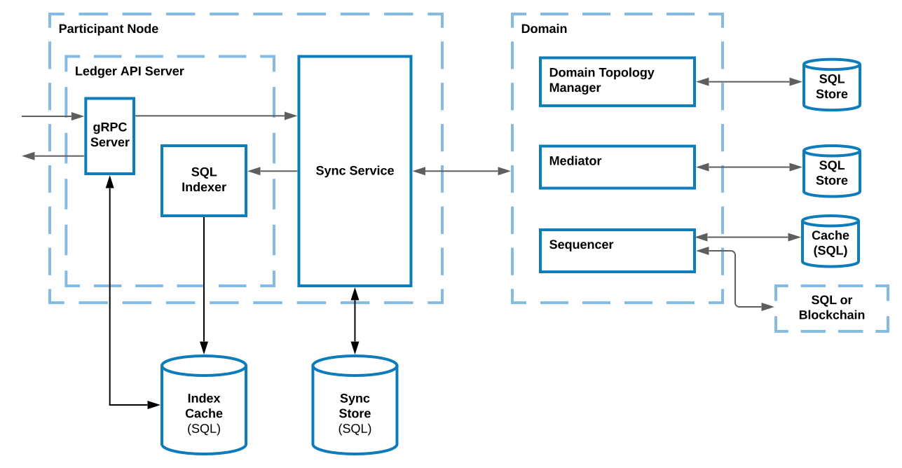

.. Copyright (c) 2023 Digital Asset (Switzerland) GmbH and/or its affiliates. All rights reserved.
.. SPDX-License-Identifier: Apache-2.0

Architectural Overview
######################

HA in Canton relates to the following components:

  - Participant nodes containing the gRPC server for Ledger API access, the sync service which executes the Canton protocol, the indexer which builds a read cache.

  - Domains which contain a sequencer which orders and delivers messages, a mediator which coordinates transaction processing, a topology manager that manages known identities on the domain, and a domain service which manages registration.

In the image below, arrows mark the data flow, dashed lines border logical components, and solid blue lines mean that the subcomponent can run in a separate process.

.. _components-for-ha:
.. https://lucid.app/lucidchart/c6fc5988-ddcc-41e8-b7f0-c9d6db94f575

For HA, each component should run in its own process, except for workflows that directly involve multiple components. In particular, the availability of a Canton participant node `A` is not affected by the availability of a participant node `B`, except for the following:

  1. Workflows involving both `A` and `B`.
  2. When `A` and `B` don't have the same visibility into workflow data, i.e., they manage different parties. That is, if `A` and `B` host the same party `P`, then processing of transactions involving `P` can still continue as long as either `A` or `B` is available. However, note that an application operating on behalf of `P` currently cannot transparently fail over from `A` to `B` or vice versa, due to the difference in offsets emitted on each participant.

Furthermore, the availability of `A` is also not affected by the availability of the domain `D`, except for the workflows that use `D`. This means that each participant and domain can take care of HA separately. 

HA means replicating components where all replicas of the same component have the same trust assumptions, i.e. the operators of one replica must trust the operators of the other replicas.

In general, whenever a component is backed by a database/ledger, HA relies on the HA of the database/ledger. The component's operator handles the HA of the database separately. All database-backed Canton components are tolerant to temporary database outages. During any failover period for the database, Canton components halt processing until the database becomes available again, and then resume. Transactions that involve these Canton components may time out if the failover takes too long. Nevertheless, they can be safely resubmitted, as command deduplication provides idempotency.

Canton components can expose a :ref:`health endpoint <health-check>`, that can be used to check the health of the components and its subcomponents.
