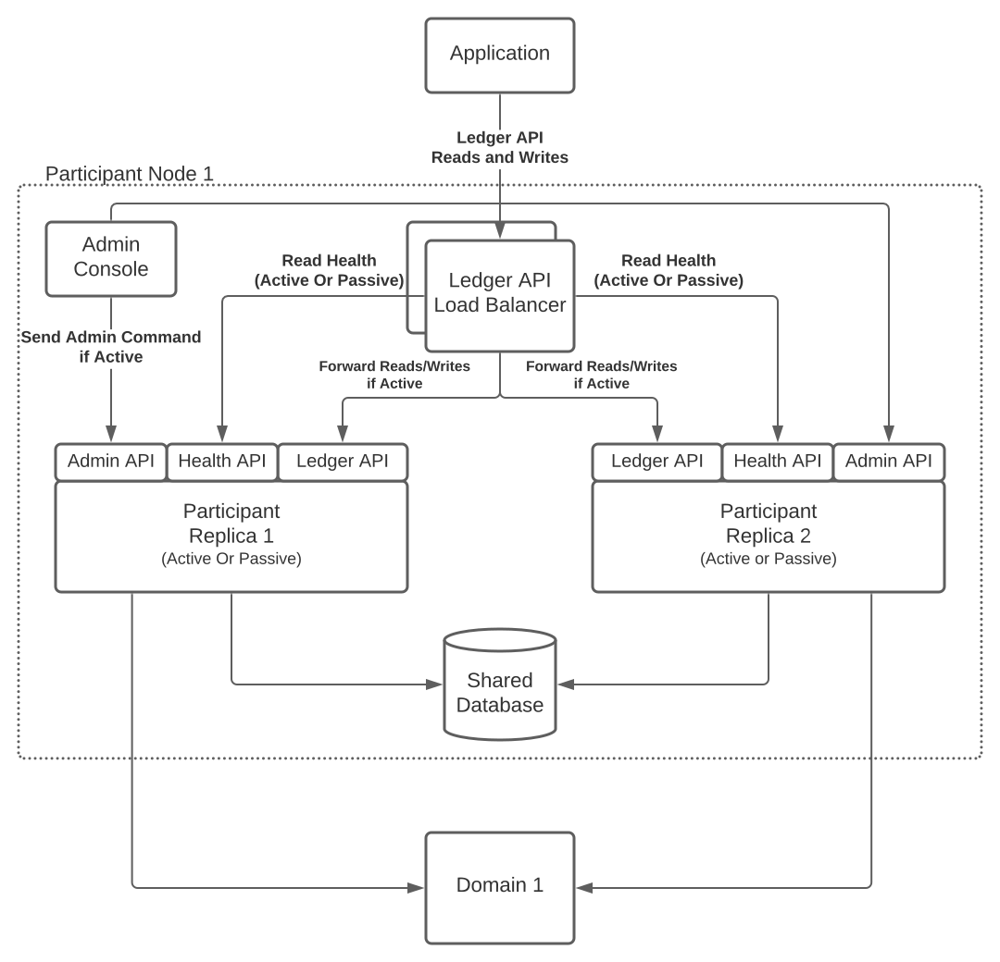

.. Copyright (c) 2023 Digital Asset (Switzerland) GmbH and/or its affiliates. All rights reserved.
.. SPDX-License-Identifier: Apache-2.0

.. enterprise-only::

.. _ha_participant_arch:

Replicated Participant Node
---------------------------

HA requires a replicated participant node in an active-passive configuration, where the active replica is
serving requests and one or more passive replicas are in a warm stand-by mode ready to take over when the active replica fails.

A logical participant node consists of multiple physical participant node replicas that a shared database and expose their own ledger API. Multiple replicas can be hidden by exposing a single ledger API endpoint through a highly available load balancer.

.. _participant-ha-system-topology:
.. https://lucid.app/lucidchart/cd96a3a6-e10b-4edc-bfb3-a70e484d7c06

The replicas of a replicated participant node share the same database for two reasons:

1. To share the command ID deduplication state of the ledger API command submission service which prevents double submission of commands in case of failover.
2. To obtain consistent ledger offsets across the replicas, without which the application could not seamlessly failover to another replica. The database defines ledger offsets based on the insertion order of publishing events in the multi-domain event log, i.e. the ledger offset derivation is not deterministic.

Replica Monitoring and Failover
-------------------------------

Operating a participant node in a replicated active-passive configuration with a
shared database requires to establish the active replica, i.e., perform a leader
election, and to enforce a single writer, i.e., the active replica, to the
shared database.

We are using exclusive application-level database locks tied to the lifetime of
the connection to the database to achieve leader election and enforce a single
writer. Alternative existing approaches for leader election, such as using Raft,
are not suitable because in between the leader check and the use of the shared
resource, i.e., writing to the database, the leader status could have been lost
and we cannot guarantee a single writer.

Leader Election through Exclusive Lock Acquisition
--------------------------------------------------

A participant node replica tries to acquire an exclusive application level lock
(e.g. `Postgres advisory lock
<https://www.postgresql.org/docs/11/explicit-locking.html#ADVISORY-LOCKS>`_)
bound to a particular database connection and use that same connection for all
writes that are not idempotent. The replica that has acquired the lock is the
leader and the active replica. Using the same connection for writes ensures that
the lock is held while writes are performed.

Lock ID Allocation
------------------

The exclusive application level locks are identified by a 30-bit integer. The
lock ID is allocated based on the scope name of the lock and a lock counter. The
lock counter differentiates locks used in Canton from each other, depending on
their usage. The scope ensures the uniqueness of the lock ID for a given lock
counter. For the allocation the scope and counter are hashed and truncated to
30 bits to generate a unique lock ID.

On Oracle the lock scope is the schema name, i.e., the user name. On Postgres it
is the name of the database. The participant replicas must allocate the same
lock IDs for the same lock counter, therefore it is crucial that the replicas
are configured with the same storage configuration, e.g., for Oracle using the
same username to allocate the lock IDs with the same scope.

Enforce a Passive Replica
-------------------------

The replicas that do not hold the exclusive lock are passive and cannot write to
the shared database. To avoid any attempts to write to the database, which would
fail and produce an error, we use a coarse-grained guard on domain connectivity
and API services to enforce a passive replica.

To prevent the passive replica from processing any domain events and reject
incoming ledger API requests, we keep the passive replica disconnected from the
domains as a coarse-grained enforcement.

Lock Loss and Failover
-----------------------

If the active replica crashes or loses connection to the database, the lock will
be released and a passive replica can claim the lock and become active. Any
pending writes in the formerly active replica will fail as the underlying
connection and the corresponding lock has been lost.

There is a grace period for the active replica to rebuild the connection and
reclaim the lock to avoid unnecessary fail-overs on short connection
interruptions. The passive replicas continuously try to acquire the lock with a
configurable interval. Once the lock is acquired, the participant replication
manager sets the state of the replica to active and completes the fail-over.

As part of a passive replica becoming active, the replica is connected to
previously connected domains to resume processing of events. Further the new
active replica now accepts incoming requests, e.g., on the ledger API. On the
other hand, the former active replica that is now passive will reject any
incoming requests as the replica can no longer write to the shared database.

Ledger API Client Fail-Over via Load Balancer
---------------------------------------------

To hide the fact that a participant is replicated and to offer a single ledger
API endpoint towards applications, we recommend the usage of layer 4 (=TCP
level), highly available load balancer.

The load balancer (LB) is configured with a pool of backend servers based on the
ledger API server addresses and ports of the participant node replicas. The
participant node replicas expose their status whether they are the active or passive
replica via a health endpoint. The LB periodically checks the health API
endpoint of the replicas and marks a backend server offline if the replica is
passive. Thus the load balancer only sends requests to the active backend
server. The polling frequency of the health endpoints affect the fail-over
times.

During fail-over requests may still be sent to the former active replica, which
will be rejected and the application has to retry the submission of commands in
the latter case until they are forwarded to the new active replica.
