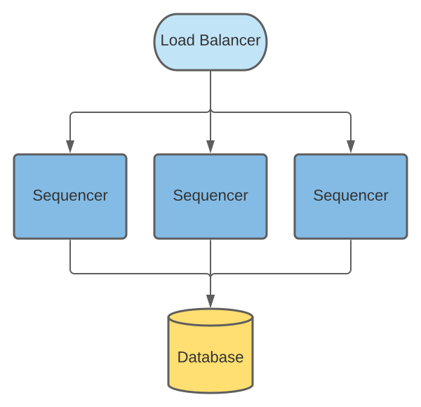

..
     Copyright (c) 2022 Digital Asset (Switzerland) GmbH and/or its affiliates
..
    
..
     Proprietary code. All rights reserved.

Domain HA
---------

A domain is fully available only when all of its subcomponents are available.
However, transaction processing can still run over the domain even if only the mediator and the sequencer are available.
The domain services handle new connections to domains, and the topology manager handles the changes to the topology state; unavailability of these two components affects only the services they handle.
As all of these components can run in separate processes, we handle the HA of each component separately.

Sequencer HA
~~~~~~~~~~~~

The HA properties of the Sequencer depend on the chosen implementation.
When the sequencer is based on a HA ledger (and is properly setup), such as :ref:`Hyperledger Fabric <fabric_ha>`,
the sequencer's availability increases.

It is also possible to connect to multiple sequencers that are operating under the same underlying ledger.
This provides another layer of HA, since if one of the sequencers goes down or becomes unhealthy
(loses connection to the ledger or database for example), then the client-side load balancing will take care of failing over to
the ones that are still healthy and available.

For the database sequencer, we use an active-active setup over a shared database.
The setup relies on the database for both HA and consistency.

Database Sequencer HA
`````````````````````
.. _components-for-ha:
.. https://lucid.app/lucidchart/7b20b586-4d34-4787-ac68-72eda44e3ba1


The database Sequencer uses the database itself to ensure that events are sequenced with a consistent order.
Many Sequencer nodes can be deployed where each node has a Sequencer reader and writer component, all of these
components can concurrently read and write to the same database.
A load balancer can be used to evenly distribute requests between these nodes.
The canton health endpoint can be used to halt sending requests to a node that reports itself as unhealthy.

Sequencers nodes are statically configured with the total number of possible Sequencer nodes and each node
is assigned a distinct index from this range. This index is used to partition available event timestamps to ensure
two sequencer node will never use the same event id/timestamp.

Events are written to the ``events`` table and can be read in ascending timestamp order. To provide a continuous monotonic
stream of events, readers need to know the point at which events can be read without the risk of an earlier event being
inserted by a writer process.
To do this writers regularly update a ``watermark`` table where they publish their latest event timestamp.
Readers take the minimum timestamp from this table as the point they can safely query events for.

If a Sequencer node was to fail, it would stop updating its ``watermark`` value and when it becomes the minimum timestamp
this will cause all readers to effectively pause at this point (at they cannot read beyond this point).
Other Sequencers writers when updating their own watermark also check that the other sequencer watermarks are being updated in a timely manner.
If it is noticed that a Sequencer node has not updated its watermark within a configurable interval then it will be
marked as offline and this watermark will no longer be included in the query for the minimum event timestamp.
This causes future events from the offline Sequencer to be ignored after this timestamp.
For this process to operate optimally the clocks of the hosts of the Sequencer nodes are expected to be synchronized -
this is considered reasonable for where all Sequencer hosts are co-located and NTP is used.

If the failed Sequencer has recovered and would like to resume operation, it should delete all events past
its last know watermark to avoid incorrectly re-inserting them into the events the readers will see, as readers may have
read subsequent events by this time.
This is safe to do without effecting events that have been read as any events written by the offline Sequencer after it
is marked offline are ignored by readers.
It should then replace its old watermark with a new timestamp for events it will start inserting then resume normal operation,
ensuring that this is greater than any existing value.

When a Sequencer fails and resumes operation there will be short pause in reading from other Sequencers due to updates
to the watermark table. However requests to the other Sequencer nodes should continue successfully, and any events
written during this period will be available to read as soon as the pause has completed. Any send requests that were
being processed by the failed Sequencer process will likely be lost, but can be safely retried once their max-sequencing-time
has been exceeded without the risk of creating duplicate events.

Mediator and Domain Manager HA
~~~~~~~~~~~~~~~~~~~~~~~~~~~~~~

The approach for both the mediator and domain manager nodes HA follows the same principles as outlined for
participant HA in :ref:`ha_participant_arch`. Namely a node is
replicated and only one replica is active. All replicas of the same
node share the same database, both for sharing the state as well as to
coordinate the active node replica.
When passive, a node's runtime components (sequencer connections, request processing, core gRPC services) are turned off and it only maintains a connection to the database to detect
if the active node goes down. When that happens, passive replicas race each other to obtain the active lock from the database.
The winning node brings up all runtime components it needs and re-hydrates itself to a functioning state.
This ensures only the active node is able to process requests and avoids conflicts that could occur if 2 or more nodes would process the same
request in parallel.
