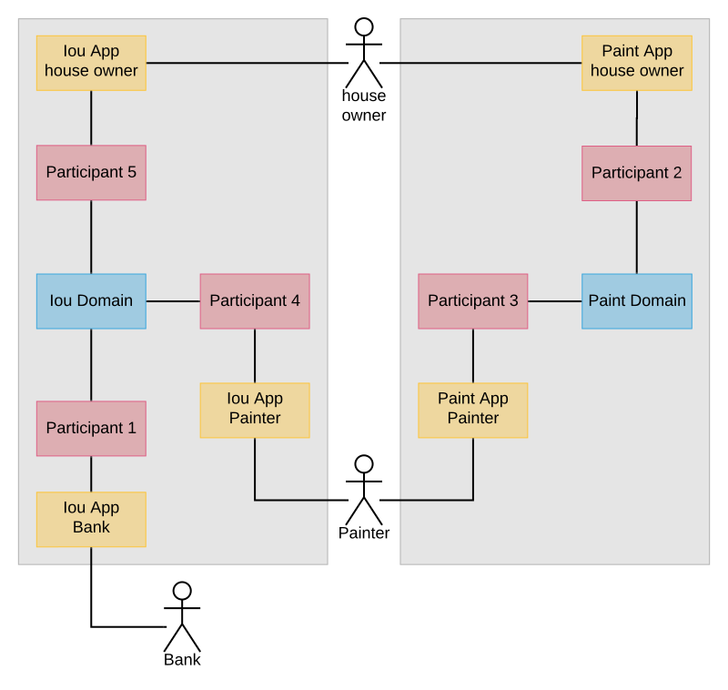

..
     Copyright (c) 2022 Digital Asset (Switzerland) GmbH and/or its affiliates
..
    
..
     Proprietary code. All rights reserved.

.. _canton-composability:

Composability is currently an Early Access Feature in Alpha status.

.. note::
   The example in this tutorial uses unsupported Scala bindings and codegen.

Composability
=============

In this tutorial, you will learn how to build workflows that span several Canton domains.
Composability turns those several Canton domains into one conceptual ledger at the application level.

The tutorial assumes the following prerequisites:

- You have worked through the :ref:`Getting started <canton-getting-started>` tutorial and know how to interact with the Canton console.
- You know the Daml concepts that are covered in the `Daml introduction <https://docs.daml.com/getting-started/installation.html>`__.
- The running example uses the :ref:`ledger API <ledger-api-services>`, the Scala codegen (no longer supported by Daml) for Daml, and Canton's :ref:`identity management <identity_management_user_manual>`.
  If you want to understand the example code in full, please refer to the above documentation.

The tutorial consists of two parts:
  
1. The :ref:`first part <canton-composability-part1>` illustrates how to design a workflow that spans multiple domains.

2. The :ref:`second part <canton-composability-part2>` shows how to compose existing workflows on different domains into a single workflow and the benefits this brings.

The Daml models are shipped with the Canton release in the ``daml/CantonExamples`` folder in the modules ``Iou`` and ``Paint``.
The configuration and the steps are available in the ``examples/05-composability`` folder of the Canton release.
To run the workflow, start Canton from the release's root folder as follows:

.. code-block:: bash

    ./bin/canton -c examples/05-composability/composability.conf

You can copy-paste the console commands from the tutorial in the given order into the Canton console to run them interactively.
All console commands are also summarized in the bootstrap scripts ``composability1.canton``,
``composability-auto-transfer.canton``, and ``composability2.canton``.

.. note::
    Note that to use composability, we do have to turn off contract key uniqueness, as uniqueness
    cannot be provided across multiple domains. Therefore, composability is just a preview
    feature and explained here to demonstrate an early version of it that is not yet suitable
    for production use.

.. _canton-composability-part1:
   
Part 1: A multi-domain workflow
-------------------------------

We consider the :ref:`paint agreement scenario <canton-run-daml-scenarios>` from the :ref:`Getting started <canton-getting-started>` tutorial.
The house owner and the painter want to enter a paint agreement that obliges the painter to paint the house owner's house.
To enter such an agreement, the house owner proposes a paint offer to the painter and the painter accepts.
Upon acceptance, the paint agreement shall be created atomically with changing the ownership of the money, which we represent by an IOU backed by the bank.

Atomicity guarantees that no party can scam the other:
The painter enters the obligation of painting the house only if house owner pays,
and the house owner pays only if the painter enters the obligation.
This avoid bad scenarios such as the following, which would have to be resolved out of band, e.g., using legal processes:

.. _canton-composability-unhappy-scenarios:

* The house owner spends the IOU on something else and does not pay the painter, even though the painter has entered the obligation to paint the house.
  The painter then needs to convince the house owner to pay with another IOU or to revoke the paint agreement.

* The house owner wires the money to the painter, but the painter refuses to enter the paint agreement.
  The house owner then begs the painter to return the money.

.. _canton-composability-topology-part1:
  
Setting up the topology
~~~~~~~~~~~~~~~~~~~~~~~

In this example, we assume a topology with two domains, ``iou`` and ``paint``.
The house owner's and the painter's participants are connected to both domains, as illustrated in the following diagram.

.. https://www.lucidchart.com/documents/edit/204726de-0b65-43b0-b612-646ef4b60374/0_0
.. figure:: ./images/paint-fence-single-participant-parties.svg
   :align: center

The configuration file ``composability.conf`` configures the two domains ``iou`` and ``paint`` and three participants.

.. code-block:: none

    canton {
      features {
        enable-preview-commands = yes
        enable-testing-commands = yes
      }
      monitoring {
        tracing.propagation = enabled
        logging.api.message-payloads = true
      }
      domains {
        iou {
          public-api.port = 13018
          admin-api.port = 13019
          storage.type = memory
          init.domain-parameters.unique-contract-keys = false
        }
    
        paint {
          public-api.port = 13028
          admin-api.port = 13029
          storage.type = memory
          init.domain-parameters.unique-contract-keys = false
        }
      }
    
      participants {
        participant1 {
          ledger-api.port = 13011
          admin-api.port = 13012
          storage.type = memory
          init.parameters.unique-contract-keys = false
        }
    
        participant2 {
          ledger-api.port = 13021
          admin-api.port = 13022
          storage.type = memory
          init.parameters.unique-contract-keys = false
        }
    
        participant3 {
          ledger-api.port = 13031
          admin-api.port = 13032
          storage.type = memory
          init.parameters.unique-contract-keys = false
        }
      }
    }

As the first step, some domain parameters are changed (setting ``transfer-exclusivity-timeout`` will be explained in
the :ref:`second part <canton-automatic-transfer-in>` of this tutorial). Then, all the nodes are started and the
parties for the bank (hosted on participant 1), the house owner (hosted on participant 2), and the painter (hosted on
participant 3) are created. The details of the party onboarding are not relevant for show-casing cross-domain workflows.

.. code-block:: scala

    
    // update parameters
    iou.service.update_dynamic_domain_parameters(
      _.update(transferExclusivityTimeout = Duration.Zero)
    ) // disables automatic transfer-in
    
    paint.service.update_dynamic_domain_parameters(
      _.update(transferExclusivityTimeout = 2.seconds)
    )
    
    // connect participants to the domain
    participant1.domains.connect_local(iou)
    participant2.domains.connect_local(iou)
    participant3.domains.connect_local(iou)
    participant2.domains.connect_local(paint)
    participant3.domains.connect_local(paint)
    
    // the connect call will use the configured domain name as an alias. the configured
    // name is the one used in the configuration file.
    // in reality, all participants pick the alias names they want, which means that
    // aliases are not unique, whereas a `DomainId` is. However, the
    // alias is convenient, while the DomainId is a rather long string including a hash.
    // therefore, for commands, we prefer to use a short alias instead.
    val paintAlias = paint.name
    val iouAlias = iou.name
    
    // create the parties
    val Bank = participant1.parties.enable("Bank")
    val HouseOwner = participant2.parties.enable("House Owner")
    val Painter = participant3.parties.enable("Painter")
    
    // Wait until the party enabling has taken effect and has been observed at the participants
    val partyAssignment = Set(HouseOwner -> participant2, Painter -> participant3)
    participant2.parties.await_topology_observed(partyAssignment)
    participant3.parties.await_topology_observed(partyAssignment)
    
    // upload the Daml model to all participants
    val darPath = Option(System.getProperty("canton-examples.dar-path")).getOrElse("dars/CantonExamples.dar")
    participants.all.dars.upload(darPath)

Creating the IOU and the paint offer
~~~~~~~~~~~~~~~~~~~~~~~~~~~~~~~~~~~~

To initialize the ledger, the Bank creates an IOU for the house owner and the house owner creates a paint offer for the painter.
These steps are implemented below using the Scala bindings (no longer supported by Daml) generated from the Daml model.
The generated Scala classes are distributed with the Canton release in the package ``com.digitalasset.canton.examples``.
The relevant classes are imported as follows:

.. code-block:: scala

    import com.digitalasset.canton.examples.Iou.{Amount, Iou}
    import com.digitalasset.canton.examples.Paint.{OfferToPaintHouseByOwner, PaintHouse}
    import com.digitalasset.canton.participant.ledger.api.client.DecodeUtil.decodeAllCreated
    import com.digitalasset.canton.protocol.ContractIdSyntax._

Bank creates an IOU of USD 100 for the house owner on the ``iou`` domain, by :ref:`submitting the command <ledger-api-transaction-service>` through the ledger API command service of participant 1.
The house owner then shares the IOU contract with the painter such that the painter can effect the ownership change when they accept the offer.
The share operation adds the painter as an observer on the IOU contract so that the painter can see the IOU contract.
Both of these commands run over the ``iou`` domain because the Bank's participant 1 is only connected to the ``iou`` domain.

.. code-block:: scala

    // Bank creates IOU for the house owner
    val createIouCmd = Iou(
      payer = Bank.toPrim,
      owner = HouseOwner.toPrim,
      amount = Amount(value = 100.0, currency = "USD"),
      viewers = List.empty
    ).create.command
    val Seq(iouContractUnshared) = decodeAllCreated(Iou)(
      participant1.ledger_api.commands.submit_flat(Seq(Bank), Seq(createIouCmd)))
    
    // Wait until the house owner sees the IOU in the active contract store
    participant2.ledger_api.acs.await_active_contract(HouseOwner, iouContractUnshared.contractId.toLf)
    
    // The house owner adds the Painter as an observer on the IOU
    val shareIouCmd = iouContractUnshared.contractId.exerciseShare(actor = HouseOwner.toPrim, viewer = Painter.toPrim).command
    val Seq(iouContract) = decodeAllCreated(Iou)(participant2.ledger_api.commands.submit_flat(Seq(HouseOwner), Seq(shareIouCmd)))

Similarly, the house owner creates a paint offer on the ``paint`` domain via participant 2.
In the ``ledger_api.commands.submit_flat`` command, we set the workflow id to the ``paint`` domain so that the participant submits the commands to this domain.
If no domain was specified, the participant automatically determines a suitable domain.
In this case, both domains are eligible because on each domain, every stakeholder (the house owner and the painter) is hosted on a connected participant.

.. code-block:: scala

    // The house owner creates a paint offer using participant 2 and the Paint domain
    val paintOfferCmd = OfferToPaintHouseByOwner(
      painter = Painter.toPrim,
      houseOwner = HouseOwner.toPrim,
      bank = Bank.toPrim,
      iouId = iouContract.contractId
    ).create.command
    val Seq(paintOffer) = decodeAllCreated(OfferToPaintHouseByOwner)(
      participant2.ledger_api.commands.submit_flat(Seq(HouseOwner), Seq(paintOfferCmd), workflowId = paint.name))

Contracts and Their Domains
~~~~~~~~~~~~~~~~~~~~~~~~~~~

In Canton, each contract is only known to the participants involved in that contract. The
involved participants are the only ones that have unencrypteded copies of the contract, which they store in their respective
private contract stores. No other participant has access to that data, even in encrypted
form. The domain, in particular the sequencer that facilitates synchronization, will only store
encrypted messages that only the receiving participant can decrypt.

In our terminology, the residence domain of a contract is the current agreement between the
stakeholders of the contract where changes to the contract are to be communicated and where
the sequence of actions on a contract is to be determined. A contract can reside on at
most one domain at any point in time.
However, the contract is never stored by the domain in such a way that the domain learns
about its existence or content.

Transferring a contract
~~~~~~~~~~~~~~~~~~~~~~~

For example, the IOU contract resides on the ``iou`` domain because it has been created by a command that was submitted to the ``iou`` domain.
Similarly, the paint offer resides on the ``paint`` domain.
In the current version of Canton, the execution of a transaction can only use contracts that reside on a single domain.
Therefore, before the painter can accept the offer and thereby become the owner of the IOU contract,
both contracts must be brought to a common domain.

In this example, the house owner and the painter are hosted on participants that are connected to both domains,
whereas the Bank is only connected to the ``iou`` domain.
The IOU contract cannot be moved to the ``paint`` domain because all stakeholders of a contract must be connected to the contract's domain of residence.
Conversely, the paint offer can be transferred to the ``iou`` domain, so that the painter can accept the offer on the ``iou`` domain.

Stakeholders can change the residence domain of a contract using the ``transfer.execute`` command.
In the example, the painter transfers the paint offer from the ``paint`` domain to the ``iou`` domain.

.. code-block:: scala

    // Wait until the painter sees the paint offer in the active contract store
    participant3.ledger_api.acs.await_active_contract(Painter, paintOffer.contractId.toLf)
    
    // Painter transfers the paint offer to the IOU domain
    participant3.transfer.execute(
      Painter,                      // Initiator of the transfer
      paintOffer.contractId.toLf,   // Contract to be transferred
      paintAlias,                   // Source domain
      iouAlias                      // Target domain
    )

The transfer of a contract effectively changes the residence domain of the contract, in other words,
the consensus among the stakeholders on which domain should be used to sequence actions on a contract.
The contract itself is still stored only on the involved participants.

Atomic acceptance
~~~~~~~~~~~~~~~~~

The paint offer and the IOU contract both reside on the ``iou`` domain now.
Accordingly, the painter can complete the workflow by accepting the offer.

.. code-block:: scala

    // Painter accepts the paint offer on the IOU domain
    val acceptCmd = paintOffer.contractId.exerciseAcceptByPainter(Painter.toPrim).command
    val acceptTx = participant3.ledger_api.commands.submit_flat(Seq(Painter), Seq(acceptCmd))
    val Seq(painterIou) = decodeAllCreated(Iou)(acceptTx)
    val Seq(paintHouse) = decodeAllCreated(PaintHouse)(acceptTx)

This transaction executes on the ``iou`` domain because the input contracts (the paint offer and the IOU) reside there.
It atomically creates two contracts on the ``iou`` domain: the painter's new IOU and the agreement to paint the house.
The unhappy scenarios needing out-of-band resolution are avoided.

Completing the workflow
~~~~~~~~~~~~~~~~~~~~~~~

Finally, the paint agreement can be transferred back to the ``paint`` domain, where it actually belongs.

.. code-block:: scala

    // Wait until the house owner sees the PaintHouse agreement
    participant2.ledger_api.acs.await_active_contract(HouseOwner, paintHouse.contractId.toLf)
    
    // The house owner moves the PaintHouse agreement back to the Paint domain
    participant2.transfer.execute(
      HouseOwner,
      paintHouse.contractId.toLf,
      iouAlias,
      paintAlias
    )

Note that the painter's IOU remains on the ``iou`` domain.
The painter can therefore call the IOU and cash it out.

.. code-block:: scala

    // Painter converts the Iou into cash
    participant3.ledger_api.commands.submit_flat(
      Seq(Painter),
      Seq(painterIou.contractId.exerciseCall(Painter.toPrim).command),
      iou.name
    )

Performing transfers automatically
~~~~~~~~~~~~~~~~~~~~~~~~~~~~~~~~~~

Canton also supports automatic transfers for commands performing transactions that use contracts residing on several domains.
When such a command is submitted, Canton can automatically infer a common domain that the used contracts can be transferred to.
Once all the used contracts have been transferred into the common domain the transaction is performed on this single domain.
However, this simply performs the required transfers followed by the transaction processing as distinct non-atomic steps.

We can therefore run the above script without specifying any transfers at all, and relying on the automatic transfers.
Simply delete all the transfer commands from the example above and the example will still run successfully. A modified
version of the above example that uses automatic transfers instead of manual transfers is given below.

The setup code and contract creation is unchanged:

.. code-block:: scala

    // Bank creates IOU for the house owner
    val createIouCmd = Iou(
      payer = Bank.toPrim,
      owner = HouseOwner.toPrim,
      amount = Amount(value = 100.0, currency = "USD"),
      viewers = List.empty
    ).create.command
    val Seq(iouContractUnshared) = decodeAllCreated(Iou)(
      participant1.ledger_api.commands.submit_flat(Seq(Bank), Seq(createIouCmd)))
    
    // Wait until the house owner sees the IOU in the active contract store
    participant2.ledger_api.acs.await_active_contract(HouseOwner, iouContractUnshared.contractId.toLf)
    
    // The house owner adds the Painter as an observer on the IOU
    val showIouCmd = iouContractUnshared.contractId.exerciseShare(actor = HouseOwner.toPrim, viewer = Painter.toPrim).command
    val Seq(iouContract) = decodeAllCreated(Iou)(participant2.ledger_api.commands.submit_flat(Seq(HouseOwner), Seq(showIouCmd)))
    
    // The house owner creates a paint offer using participant 2 and the Paint domain
    val paintOfferCmd = OfferToPaintHouseByOwner(
      painter = Painter.toPrim,
      houseOwner = HouseOwner.toPrim,
      bank = Bank.toPrim,
      iouId = iouContract.contractId
    ).create.command
    val Seq(paintOffer) = decodeAllCreated(OfferToPaintHouseByOwner)(
      participant2.ledger_api.commands.submit_flat(Seq(HouseOwner), Seq(paintOfferCmd), workflowId = paint.name))

In the following section, the painter accepts the paint offer. The transaction that accepts the paint offer uses two
contracts: the paint offer contract, and the IOU contract. These contracts were created on two different domains in the
previous step: the paint offer
contract was created on the paint domain, and the IOU contract was created on the IOU domain. The paint offer contract
must be transferred to the IOU domain for the accepting transaction to be successfully applied, as was done manually in the
example above. It would not be possible to instead transfer the IOU contract to the paint domain because the stakeholder
Bank on the IOU contract is not represented on the paint domain.

When using automatic-transfer transactions, Canton infers a suitable domain for the transaction and transfers all used
contracts to this domain before applying the transaction. In this case, the only suitable domain for the painter to
accept the paint offer is the IOU domain. This is how the painter is able to accept the paint offer below without any
explicit transfers being performed.

.. code-block:: scala

    // Wait until the painter sees the paint offer in the active contract store
    participant3.ledger_api.acs.await_active_contract(Painter, paintOffer.contractId.toLf)
    
    // Painter accepts the paint offer on the IOU domain
    val acceptCmd = paintOffer.contractId.exerciseAcceptByPainter(Painter.toPrim).command
    val acceptTx = participant3.ledger_api.commands.submit_flat(Seq(Painter), Seq(acceptCmd))
    val Seq(painterIou) = decodeAllCreated(Iou)(acceptTx)
    val Seq(paintHouse) = decodeAllCreated(PaintHouse)(acceptTx)

The painter can then cash in the IOU. This happens exactly as before, since the IOU contract never leaves the IOU domain.

.. code-block:: scala

    // Painter converts the Iou into cash
    participant3.ledger_api.commands.submit_flat(
      Seq(Painter),
      Seq(painterIou.contractId.exerciseCall(Painter.toPrim).command),
      iou.name
    )

Note that towards the end of the previous example with explicit transfers, the paint offer contract was transferred
back to the paint domain. This doesn't happen in the automatic transfer version: the paint offer is not transferred out
of the IOU domain as part of the script shown. However, the paint offer contract will be automatically transferred back
to the paint domain once it is used in a transaction that must happen on the paint domain.

Details of the automatic-transfer transactions
..............................................

In the previous section, the automatic-transfer transactions were explained using an example. The details are presented
here.

The automatic-transfer transactions enable submission of a transaction using contracts on multiple domains, by
transferring contracts into a chosen target domain and then performing the transaction. However, using an
automatic-transfer transaction does not provide any atomicity guarantees beyond using several primitive transfer-in
and transfer-out operations (these operations make up the ``transfer.execute`` command, and are explained in the next section).

The domain for a transaction is chosen using the following criteria:

* Minimise the number of transfers needed.

* Break ties by choosing domains with higher priority first.

* Break ties by choosing domains with alphabetically smaller domain IDs first.

As for ordinary transactions, you may force the choice of domain for an automatic-transfer transaction by setting the
workflow ID to name of the domain.

The automatic-transfer transactions are only enabled when all of the following are true:

* The local canton console enables preview commands
  (see the :ref:`configuration <canton-composability-topology-part1>` section).

* The submitting participant is connected to all domains that contracts used by the transaction live on.

* All contracts used by the transaction must have at least one stakeholder that is also a transaction submitter.

Take aways
~~~~~~~~~~

* A contract resides on a domain. This means that the current agreement of the stakeholders
  is to communicate and sequence all access and changes to a given contract on a particular
  domain. The contract itself is only stored at the stakeholder participants.

* Stakeholders can move contracts from one domain to another using ``transfer.execute``.
  All stakeholders must be connected to the source and the target domain.

* You can submit transactions using contracts that reside on several domains. Automatic transfers will pick a suitable
  domain, and perform the transfers into it before performing the transaction.

.. _canton-composability-part2:

Part 2: Composing existing workflows
------------------------------------

This part shows how existing workflows can be composed even if they work on separate domains.
The running example is a variation of the paint example from the first part with a more complicated topology.
We therefore assume that you have gone through :ref:`the first part <canton-composability-part1>` of this tutorial.
Technically, this tutorial runs through the same steps as the first part, but more details are exposed.
The console commands assume that you start with a fresh Canton console.

Existing workflows
~~~~~~~~~~~~~~~~~~

Consider a situation where the two domains ``iou`` and ``paint`` have evolved separately:

- The ``iou`` domain for managing IOUs,

- The ``paint`` domain for managing paint agreements.

Accordingly, there are separate applications for managing IOUs (issuing, changing ownership, calling) and paint agreements,
and the house owner and the painter have connected their applications to different participants.
The situation is illustrated in the following picture.

.. https://www.lucidchart.com/documents/edit/4b964d51-b873-4d3f-9a03-49ed382b5a51/0_0

To enter in a paint agreement in this setting, the house owner and the painter need to perform the following steps:

1. The house owner creates a paint offer through participant 2 on the ``paint`` domain.

#. The painter accepts the paint offer through participant 3 on the ``paint`` domain.
   As a consequence, a paint agreement is created.

#. The painter sets a reminder that he needs to receive an IOU from the house owner on the ``iou`` domain.

#. When the house owner observes a new paint agreement through participant 2 on the ``paint`` domain,
   she changes the IOU ownership to the painter through participant 5 on the ``iou`` domain.


#. The painter observes a new IOU through participant 4 on the ``iou`` domain and therefore removes the reminder.

Overall, a non-trivial amount of out-of-band coordination is required
to keep the ``paint`` ledger consistent with the ``iou`` ledger.
If this coordination breaks down, the :ref:`unhappy scenarios from the first part <canton-composability-unhappy-scenarios>` can happen.

Required changes
~~~~~~~~~~~~~~~~

We now show how the house owner and the painter can avoid need for out-of-band coordination when entering in paint agreements.
The goal is to reuse the existing infrastructure for managing IOUs and paint agreements as much as possible.
The following changes are needed:

1. The house owner and the painter connect their participants for paint agreements to the ``iou`` domain:

   .. https://www.lucidchart.com/documents/edit/85b5b3d2-3b1d-43ee-8211-254cdbfb8a79/0_0
   .. figure:: ./images/paint-fence-with-transfer-house-owner.svg
      :align: center

   The :ref:`Canton configuration <canton-composability-topology-part1>` is accordingly extended with the two participants 4 and 5.
   (The connections themselves are set up in the :ref:`next section <canton-composability-topology2>`.)

.. code-block:: none

    canton {
      participants {
        participant4 {
          ledger-api.port = 13041
          admin-api.port = 13042
          storage.type = memory
          init.parameters.unique-contract-keys = false
        }
    
        participant5 {
          ledger-api.port = 13051
          admin-api.port = 13052
          storage.type = memory
          init.parameters.unique-contract-keys = false
        }
      }
    }

2. They replace their Daml model for paint offers such that the house owner must specify an IOU in the offer
   and its accept choice makes the painter the new owner of the IOU.

3. They create a new application for the :ref:`paint offer-accept workflow <new-paint-offer-accept-workflow>`.

The Daml models for IOUs and paint agreements themselves remain unchanged, and so do the applications that deal with them.

.. _canton-composability-topology2:

Preparation using the existing workflows
~~~~~~~~~~~~~~~~~~~~~~~~~~~~~~~~~~~~~~~~

We extend the topology from the first part as described.
The commands are explained in detail in Canton's :ref:`identity management manual <identity_management_user_manual>`.

.. code-block:: scala

    
    // update parameters
    iou.service.update_dynamic_domain_parameters(
      _.update(transferExclusivityTimeout = Duration.Zero)
    ) // disables automatic transfer-in
    
    paint.service.update_dynamic_domain_parameters(
      _.update(transferExclusivityTimeout = 2.seconds)
    )
    
    // connect participants to the domain
    participant1.domains.connect_local(iou)
    participant2.domains.connect_local(iou)
    participant3.domains.connect_local(iou)
    participant2.domains.connect_local(paint)
    participant3.domains.connect_local(paint)
    participant4.domains.connect_local(iou)
    participant5.domains.connect_local(iou)
    
    val iouAlias = iou.name
    val paintAlias = paint.name
    
    // create the parties
    val Bank = participant1.parties.enable("Bank")
    val HouseOwner = participant2.parties.enable("House Owner")
    val Painter = participant3.parties.enable("Painter", waitForDomain = DomainChoice.All)
    
    // enable the house owner on participant 5 and the painter on participant 4
    // as explained in the identity management documentation at
    // https://docs.daml.com/canton/usermanual/identity_management.html#party-on-two-nodes
    import com.digitalasset.canton.console.ParticipantReference
    def authorizePartyParticipant(partyId: PartyId, createdAt: ParticipantReference, to: ParticipantReference): Unit = {
      val createdAtP = createdAt.id
      val toP = to.id
      createdAt.topology.party_to_participant_mappings.authorize(TopologyChangeOp.Add, partyId, toP, RequestSide.From)
      to.topology.party_to_participant_mappings.authorize(TopologyChangeOp.Add, partyId, toP, RequestSide.To)
    }
    authorizePartyParticipant(HouseOwner, participant2, participant5)
    authorizePartyParticipant(Painter, participant3, participant4)
    
    // Wait until the party enabling has taken effect and has been observed at the participants
    val partyAssignment = Set(HouseOwner -> participant2, HouseOwner -> participant5, Painter -> participant3, Painter -> participant4)
    participant2.parties.await_topology_observed(partyAssignment)
    participant3.parties.await_topology_observed(partyAssignment)
    
    // upload the Daml model to all participants
    val darPath = Option(System.getProperty("canton-examples.dar-path")).getOrElse("dars/CantonExamples.dar")
    participants.all.dars.upload(darPath)

As before, the Bank creates an IOU and the house owner shares it with the painter on the ``iou`` domain, using their existing applications for IOUs.

.. code-block:: scala

    import com.digitalasset.canton.examples.Iou.{Amount, Iou}
    import com.digitalasset.canton.examples.Paint.{OfferToPaintHouseByOwner, PaintHouse}
    import com.digitalasset.canton.participant.ledger.api.client.DecodeUtil.decodeAllCreated
    import com.digitalasset.canton.protocol.ContractIdSyntax._
    
    val createIouCmd = Iou(
      payer = Bank.toPrim,
      owner = HouseOwner.toPrim,
      amount = Amount(value = 100.0, currency = "USD"),
      viewers = List.empty
    ).create.command
    val Seq(iouContractUnshared) = decodeAllCreated(Iou)(
      participant1.ledger_api.commands.submit_flat(Seq(Bank), Seq(createIouCmd)))
    
    // Wait until the house owner sees the IOU in the active contract store
    participant2.ledger_api.acs.await_active_contract(HouseOwner, iouContractUnshared.contractId.toLf)
    
    // The house owner adds the Painter as an observer on the IOU
    val shareIouCmd = iouContractUnshared.contractId.exerciseShare(actor = HouseOwner.toPrim, viewer = Painter.toPrim).command
    val Seq(iouContract) = decodeAllCreated(Iou)(participant2.ledger_api.commands.submit_flat(Seq(HouseOwner), Seq(shareIouCmd)))

.. _new-paint-offer-accept-workflow:
                
The paint offer-accept workflow
~~~~~~~~~~~~~~~~~~~~~~~~~~~~~~~

The new paint offer-accept workflow happens in four steps:

1. Create the offer on the ``paint`` domain.
#. Transfer the contract to the ``iou`` domain.
#. Accept the offer.
#. Transfer the paint agreement to the ``paint`` domain.

Making the offer
................

The house owner creates a paint offer on the ``paint`` domain.

.. code-block:: scala

    // The house owner creates a paint offer using participant 2 and the Paint domain
    val paintOfferCmd = OfferToPaintHouseByOwner(
      painter = Painter.toPrim,
      houseOwner = HouseOwner.toPrim,
      bank = Bank.toPrim,
      iouId = iouContract.contractId
    ).create.command
    val Seq(paintOffer) = decodeAllCreated(OfferToPaintHouseByOwner)(
      participant2.ledger_api.commands.submit_flat(Seq(HouseOwner), Seq(paintOfferCmd), workflowId = paint.name))

.. _canton-nonatomic-transfer:

Transfers are not atomic
........................

In the first part, we have used ``transfer.execute`` to move the offer to the ``iou`` domain.
Now, we look a bit behind the scenes.
A contract transfer happens in two atomic steps: transfer-out and transfer-in.
``transfer.execute`` is merely a shorthand for the two steps.
In particular, ``transfer.execute`` is not an atomic operation like other ledger commands.

During a transfer-out, the contract is deactivated on the source domain, in this case the ``paint`` domain.
Any stakeholder whose participant is connected to the source domain and the target domain can initiate a transfer-out.
The ``transfer.out`` command returns a transfer Id.

.. code-block:: scala

    // Wait until the painter sees the paint offer in the active contract store
    participant3.ledger_api.acs.await_active_contract(Painter, paintOffer.contractId.toLf)
    
    // Painter transfers the paint offer to the IOU domain
    val paintOfferTransferId = participant3.transfer.out(
      Painter,                      // Initiator of the transfer
      paintOffer.contractId.toLf,   // Contract to be transferred
      paintAlias,                   // Source domain
      iouAlias                      // Target domain
    )

The ``transfer.in`` command consumes the transfer Id and activates the contract on the target domain.

.. code-block:: scala

    participant3.transfer.in(Painter, paintOfferTransferId, iouAlias)

Between the transfer-out and the transfer-in, the contract does not reside on any domain and cannot be used by commands.
We say that the contract is in transit.

Accepting the paint offer
.........................

The painter accepts the offer, as before.

.. code-block:: scala

    // Wait until the Painter sees the IOU contract on participant 3.
    participant3.ledger_api.acs.await_active_contract(Painter, iouContract.contractId.toLf)
    
    // Painter accepts the paint offer on the Iou domain
    val acceptCmd = paintOffer.contractId.exerciseAcceptByPainter(Painter.toPrim).command
    val acceptTx = participant3.ledger_api.commands.submit_flat(Seq(Painter), Seq(acceptCmd))
    val Seq(painterIou) = decodeAllCreated(Iou)(acceptTx)
    val Seq(paintHouse) = decodeAllCreated(PaintHouse)(acceptTx)

.. _canton-automatic-transfer-in:

Automatic transfer-in
.....................

Finally, the paint agreement is transferred back to the ``paint`` domain such that the existing infrastructure around paint agreements can work unchanged.

.. code-block:: scala

    // Wait until the house owner sees the PaintHouse agreement
    participant2.ledger_api.acs.await_active_contract(HouseOwner, paintHouse.contractId.toLf)
    
    val paintHouseId = paintHouse.contractId
    // The house owner moves the PaintHouse agreement back to the Paint domain
    participant2.transfer.out(
      HouseOwner,
      paintHouseId.toLf,
      iouAlias,
      paintAlias
    )
    // After the exclusivity period, which is set to 2 seconds,
    // the contract is automatically transferred into the target domain
    utils.retry_until_true(10.seconds) {
        // in the absence of other activity, force the participants to update their view of the latest domain time
        participant2.testing.fetch_domain_times()
        participant3.testing.fetch_domain_times()
    
        participant3.testing.acs_search(paint.name, filterId=paintHouseId.toString).nonEmpty &&
          participant2.testing.acs_search(paint.name, filterId=paintHouseId.toString).nonEmpty
    }

Here, there is only a ``transfer.out`` command but no ``transfer.in`` command.
This is because the participants of contract stakeholders automatically try to transfer-in the contract to the target domain so that the contract becomes usable again.
The domain parameter ``transfer-exclusivity-timeout`` on the target domain specifies how long they wait before they attempt to do so.
Before the timeout, only the initiator of the transfer is allowed to transfer-in the contract.
This reduces contention for contracts with many stakeholders, as the initiator normally completes the transfer before all other stakeholders simultaneously attempt to transfer-in the contract.
On the ``paint`` domain, this timeout is set to two seconds in the :ref:`configuration <canton-composability-topology-part1>` file.
Therefore, the ``utils.retry_until_true`` normally succeeds within the allotted ten seconds.

Setting the ``transfer-exclusivity-timeout`` to 0 as on the ``iou`` domain disables automatic transfer-in.
This is why the above transfer of the paint offer had to be completed manually.
Manual completion is also needed if the automatic transfer in fails, e.g., due to timeouts on the target domain.
Automatic transfer-in therefore is a safety net that reduces the risk that the contract gets stuck in transit.

Continuing the existing workflows
~~~~~~~~~~~~~~~~~~~~~~~~~~~~~~~~~

The painter now owns an IOU on the ``iou`` domain and the entered paint agreement resides on the ``paint`` domain.
Accordingly, the existing workflows for IOUs and paint agreements can be used unchanged.
For example, the painter can call the IOU.

.. code-block:: scala

    // Painter converts the Iou into cash
    participant4.ledger_api.commands.submit_flat(
      Seq(Painter),
      Seq(painterIou.contractId.exerciseCall(Painter.toPrim).command),
      iou.name
    )

Take aways
~~~~~~~~~~

* Contract transfers take two atomic steps: transfer-out and transfer-in.
  While the contract is being transferred, the contract does not reside on any domain.

* Transfer-in happens under normal circumstances automatically after the ``transfer-exclusivity-timeout`` configured on the target domain.
  A timeout of 0 disables automatic transfer-in.
  If the automatic transfer-in does not complete, the contract can be transferred in manually.
