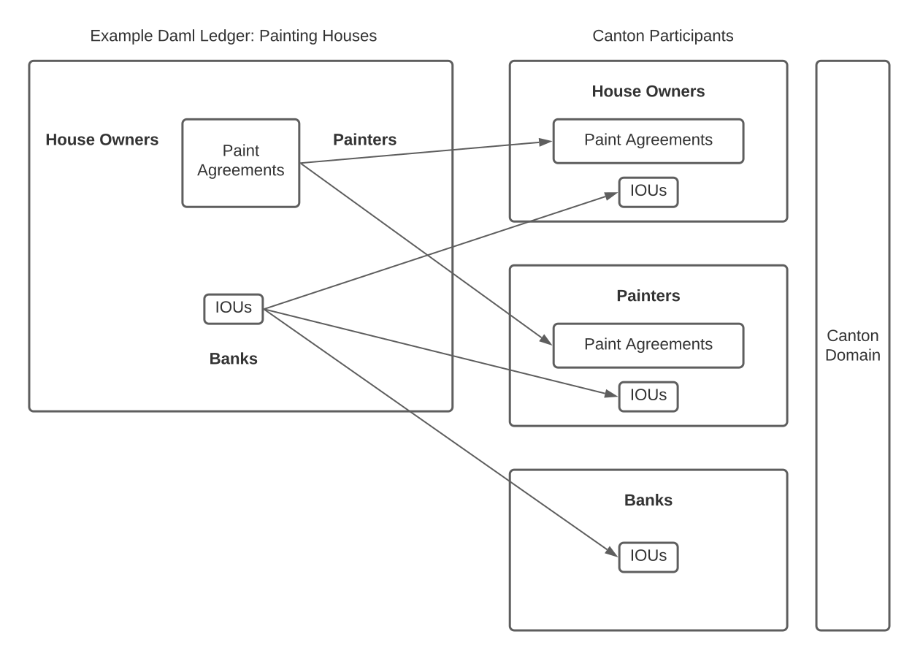
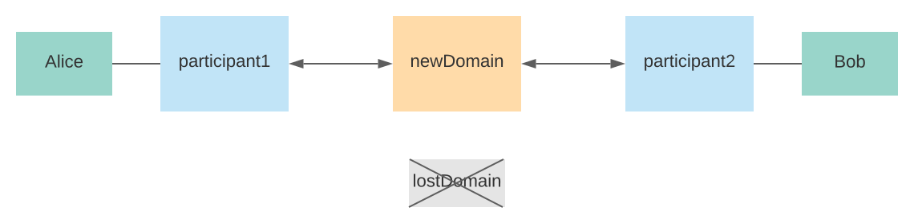
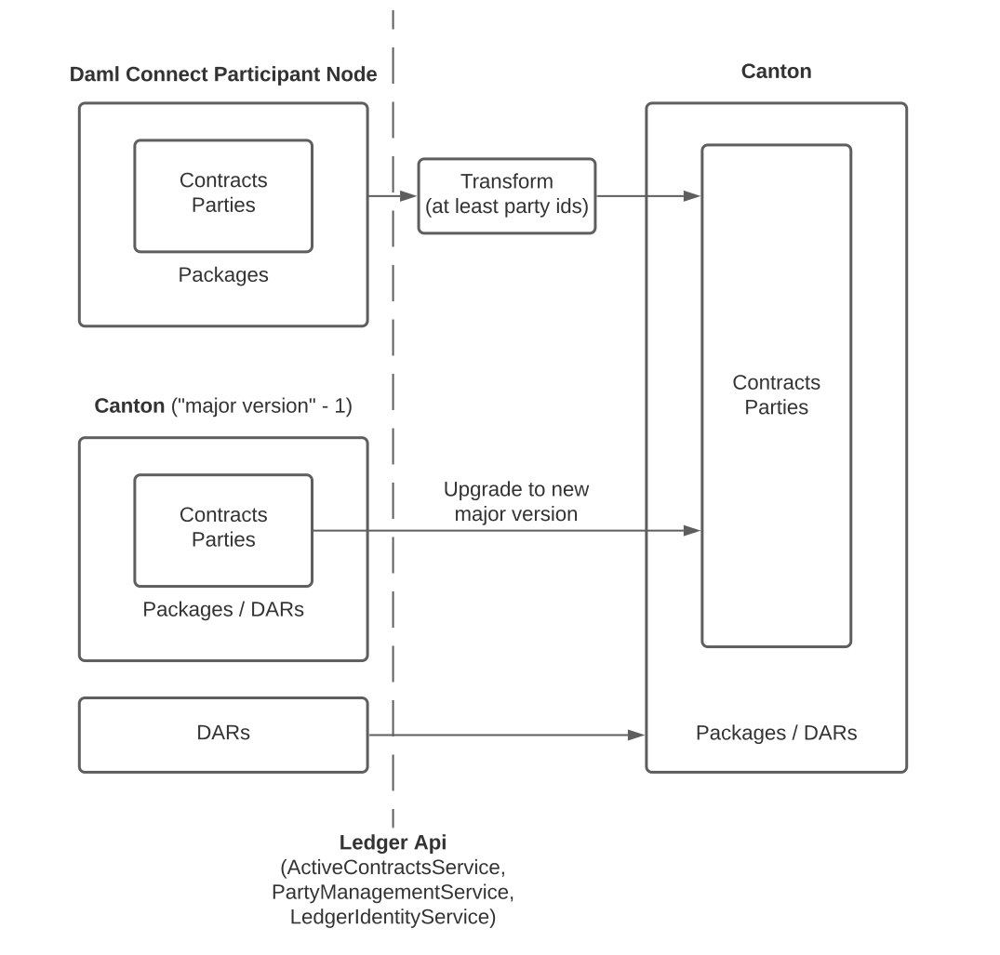

..
     Copyright (c) 2022 Digital Asset (Switzerland) GmbH and/or its affiliates
..
    
..
     Proprietary code. All rights reserved.

Repairing Nodes
===============

The Canton platform is generally built to self-heal and automatically recover from issues.
As such, if there is a situation where some degradation can be expected, there should
be some code that yields graceful degradation and automated recovery from said issues.

Common examples are database outages (retry until success) or network outages (failover
and reconnect until success).

Canton should report such issues as warnings to alert an operator about the degradation of
its dependencies, but generally, should not require any manual intervention to recover from
a degradation.

However, not all situations can be foreseen and corruptions of systems can
always happen in unanticipated ways. Therefore,
Canton can always be manually repaired somehow. This means that
whatever the corruption is, there are a series of operational steps that can be made in
order to recover the correct state of a node.
If several nodes in the distributed system are affected,
it may be necessary to coordinate the recovery among the affected nodes.

Conceptually, this means that Canton recovery is structured along the four layers:

  1. Automated self-recovery and self-healing.
  2. Recovery from crash or restart by re-creating a consistent state from the persisted store.
  3. Standard disaster recovery from a database backup in case of database outage and replay
     from domain.
  4. Corruption disaster recovery using repair and other console commands to re-establish a
     consistent state within the distributed system.

If you run into corruption issues, you need to first understand what caused the issue.
Ideally, you can contact our support team to help you diagnose the issue and provide you
with a custom recipe on how to recover from your issue (and prevent recurrence).

The toolbox the support engineers have at hand are:

- Exporting / importing secret keys
- Manually initializing nodes
- Exporting / importing DARs
- Exporting / importing topology transactions
- Manually adding or removing contracts from the active contract set
- Moving contracts from one domain to another
- Manually ignoring faulty transactions (and then using add / remove contract to repair the ACS).

All these methods are very powerful but dangerous. You should not attempt to repair your nodes on
your own as you risk severe data corruption.

Keep in mind that the corruption of the system state may not have been discovered immediately; thus, the corruption may have leaked out through the APIs to the applications using the corrupted node.
Bringing the node back into a correct state with respect to the other nodes in the distributed system can
therefore make the application state inconsistent with the nodes state. Accordingly, the application
should either re-initialize itself from the repaired state or itself offer tools to fix inconsistencies.

Preparation
~~~~~~~~~~~

As contracts (1) "belong to" parties and (2) are instances of Daml templates defined in Daml Archives (DARs), importing contracts to Canton also requires creating corresponding parties and uploading DARs.

- Contracts are often interdependent requiring care to honor dependencies such that the set of imported contracts is internally consistent. This requires particular attention if you choose to modify contracts prior to their import.
- Additionally use of `divulgence <https://docs.daml.com/concepts/ledger-model/ledger-privacy.html#divulgence-when-non-stakeholders-see-contracts>`__ in the original ledger has likely introduced non-obvious dependencies that may impede exercising contract choices after import. As a result such divulged contracts need to be re-divulged as part of the import (by exercising existing choices or if there are no-side-effect-free choices that re-divulge the necessary contracts by extending your Daml models with new choices).
- Party Ids have a stricter format on Canton than on non-Canton ledgers ending with a required "fingerprint" suffix, so at a minimum, you will need to "remap" party ids.
- :ref:`Canton contract keys <canton_keys>` do not have to be unique, so if your Daml models rely on uniqueness, consider extending the models using :ref:`these strategies <canton_keys_workarounds>` or limit your Canton Participants to connect to a single :ref:`Canton domain with unique contract key semantics <canton_uck>`.
- Canton does not support implicit party creation, so be sure to create all needed parties explicitly.
- In addition you could choose to spread contracts, parties, and DARs across multiple Canton Participants.

With the above requirements in mind, you are ready to plan and execute the following three step process:

1. Download parties and contracts from the existing Daml Participant Node and locate the DAR files that the contracts are based on.
2. Modify the parties and contracts (at the minimum assigning Canton-conformant party ids).
3. Provision Canton Participants along with at least one Canton Domain. Then upload DARs, create parties, and finally the contracts to the Canton participants. Finally connect the participants to the domain(s).

Importing an actual Ledger
~~~~~~~~~~~~~~~~~~~~~~~~~~

To follow along with this guide, ensure you have :ref:`installed and unpacked the Canton release bundle <installation>` and run the following commands from the "canton-X.Y.Z" directory to set up the initial topology.

.. code-block:: bash

    export CANTON=`pwd`
    export CONF="$CANTON/examples/03-advanced-configuration"
    export IMPORT="$CANTON/examples/07-repair"
    bin/canton \
      -c $IMPORT/participant1.conf,$IMPORT/participant2.conf,$IMPORT/participant3.conf,$IMPORT/participant4.conf \
      -c $IMPORT/domain-export-ledger.conf,$IMPORT/domain-import-ledger.conf \
      -c $CONF/storage/h2.conf,$IMPORT/enable-preview-commands.conf \
      --bootstrap $IMPORT/import-ledger-init.canton

This sets up an "exportLedger" with a set of parties consisting of painters, house owners, and banks along with a handful of paint offer contracts and IOUs.

Define the following helper functions useful to extract parties and contracts via the ledger api:

.. code-block:: none

      def queryActiveContractsFromDamlLedger(
          hostname: String,
          port: Port,
          tls: Option[TlsClientConfig],
          token: Option[String] = None,
      )(implicit consoleEnvironment: ConsoleEnvironment): Seq[CreatedEvent] = {
    
        // Helper to query the ledger api using the specified command.
        def queryLedgerApi[Svc <: AbstractStub[Svc], Result](
            command: GrpcAdminCommand[_, _, Result]
        ): Either[String, Result] =
          consoleEnvironment.grpcAdminCommandRunner
            .runCommand("sourceLedger", command, ClientConfig(hostname, port, tls), token)
            .toEither
    
        (for {
          // Identify all the parties on the ledger and narrow down the list to local parties.
          allParties <- queryLedgerApi(LedgerApiCommands.PartyManagementService.ListKnownParties())
          localParties = allParties.collect {
            case PartyDetails(party, _, isLocal, _, _) if isLocal => LfPartyId.assertFromString(party)
          }
    
          // Query the ActiveContractsService for the actual contracts
          acs <- queryLedgerApi(
            LedgerApiCommands.AcsService
              .GetActiveContracts(
                localParties.toSet,
                limit = PositiveInt.MaxValue,
                timeout = NonNegativeDuration.maxTimeout,
              )(consoleEnvironment.environment.scheduler)
          )
        } yield acs.map(_.event)).valueOr(err =>
          throw new IllegalStateException(s"Failed to query parties, ledger id, or acs: $err")
        )
      }
    
      def removeCantonSpecifics(acs: Seq[CreatedEvent]): Seq[CreatedEvent] = {
        def stripPartyIdSuffix(suffixedPartyId: String): String =
          suffixedPartyId.split(SafeSimpleString.delimiter).head
    
        acs.map { event =>
          ValueRemapper.convertEvent(identity, stripPartyIdSuffix)(event)
        }
      }
    
      def lookUpPartyId(participant: ParticipantReference, party: String): PartyId =
        participant.parties
          .list(filterParty = party + SafeSimpleString.delimiter)
          .map(_.party)
          .headOption
          .value

As the first step, export the active contract set (ACS).
To illustrate how to import data from non-Canton ledgers, strip the Canton-specifics by making the party ids generic (stripping the Canton-specific suffix).

.. code-block:: none

        val acs =
          queryActiveContractsFromDamlLedger(
            exportLedger.config.ledgerApi.address,
            exportLedger.config.ledgerApi.port,
            exportLedger.config.ledgerApi.tls.map(_.clientConfig),
          )
    
        val acsExported = removeCantonSpecifics(acs).toList

Step number two involves preparing the Canton participants and domain by uploading DARs and creating parties. Here we choose to place the house owners, painters, and banks on different participants.

.. https://app.lucidchart.com/lucidchart/66e36504-15d7-4a5d-9aa1-5c08bc162583/view

Also modify the events to be based on the newly created party ids.

.. code-block:: none

        // Decide on which canton participants to host which parties along with their contracts.
        // We place house owners, painters, and banks on separate participants.
        val participants = Seq(participant1, participant2, participant3)
        val partyAssignments =
          Seq(participant1 -> houseOwners, participant2 -> painters, participant3 -> banks)
    
        // Connect to domain prior to uploading dars and parties.
        participants.foreach { participant =>
          participant.domains.connect_local(importLedgerDomain)
          participant.dars.upload(darPath)
        }
    
        // Create canton party ids and remember mapping of plain to canton party ids.
        val toCantonParty: Map[String, String] =
          partyAssignments.flatMap { case (participant, parties) =>
            val partyMappingOnParticipant = parties.map { party =>
              participant.ledger_api.parties.allocate(party, party)
              party -> lookUpPartyId(participant, party).toLf
            }
            partyMappingOnParticipant
          }.toMap
    
        // Create traffic on all participants so that the repair commands will pick an identity snapshot that is aware of
        // all party allocations
        participants.foreach { participant =>
          participant.health.ping(participant, workflowId = importLedgerDomain.name)
        }
    
        // Switch the ACS to be based on canton party ids.
        val acsToImportToCanton =
          acsExported.map(ValueRemapper.convertEvent(identity, toCantonParty(_)))

As the third step, perform the actual import to each participant filtering the contracts based on the location of contract stakeholders and witnesses.

.. code-block:: none

        // Disconnect from domain temporarily to allow import to be performed.
        participants.foreach(_.domains.disconnect(importLedgerDomain.name))
    
        // Pick a ledger create time according to the domain's clock.
        val ledgerCreateTime =
          consoleEnvironment.environment.domains
            .getRunning(importLedgerDomain.name)
            .getOrElse(fail("No running domain node"))
            .clock
            .now
            .toInstant
    
        val contractsWithRecomputedContractIds =
          acsToImportToCanton.view
            .map(WrappedCreatedEvent)
            .map { event => utils.contract_data_to_instance(event.toContractData, ledgerCreateTime) }
            .toSeq
            .pipe(recomputeContractIds(participant1.crypto.pureCrypto, _))
            ._1
    
        val createdEventsAndContractsToImport =
          acsToImportToCanton zip contractsWithRecomputedContractIds
    
        // Filter active contracts based on participant parties and upload.
        partyAssignments.foreach { case (participant, rawParties) =>
          val parties = rawParties.map(toCantonParty(_))
          val participantAcs = createdEventsAndContractsToImport.collect {
            case (event, contract)
                if event.signatories.intersect(parties).nonEmpty
                  || event.observers.intersect(parties).nonEmpty
                  || event.witnessParties.intersect(parties).nonEmpty =>
              SerializableContractWithWitnesses(
                contract,
                Set.empty,
              )
          }
    
          participant.repair.add(importLedgerDomain.name, participantAcs, ignoreAlreadyAdded = false)
        }
    
        def verifyActiveContractCounts() = {
          Map[LocalParticipantReference, (Boolean, Boolean)](
            participant1 -> ((true, true)),
            participant2 -> ((true, false)),
            participant3 -> ((false, true)),
          ).foreach { case (participant, (hostsPaintOfferStakeholder, hostsIouStakeholder)) =>
            val expectedCounts =
              (houseOwners.map { houseOwner =>
                houseOwner.toPartyId(participant) ->
                  ((if (hostsPaintOfferStakeholder) paintOffersPerHouseOwner else 0)
                    + (if (hostsIouStakeholder) 1 else 0))
              }
                ++ painters.map { painter =>
                  painter.toPartyId(participant) -> (if (hostsPaintOfferStakeholder)
                                                       paintOffersPerPainter
                                                     else 0)
                }
                ++ banks.map { bank =>
                  bank.toPartyId(participant) -> (if (hostsIouStakeholder) iousPerBank else 0)
                }).toMap[PartyId, Int]
    
            assertAcsCounts((participant, expectedCounts))
          }
        }
    
        /*
          If the test fails because of Errors.MismatchError.NoSharedContracts error, it could be worth to
          extend the scope of the suppressing logger.
         */
        loggerFactory.assertLogsUnorderedOptional(
          {
            // Finally reconnect to the domain.
            participants.foreach(_.domains.reconnect(importLedgerDomain.name))

To demonstrate that the imported ledger works, let's have each of the house owners accept one of the painters' offer to paint their house.

.. code-block:: none

        def yesYouMayPaintMyHouse(
            houseOwner: PartyId,
            painter: PartyId,
            participant: ParticipantReference,
        ): Unit = {
          val iou = participant.ledger_api.acs.await[Iou.Iou](houseOwner, Iou.Iou)
          val bank = iou.value.payer
          val paintProposal = participant.ledger_api.acs
            .await[Paint.OfferToPaintHouseByPainter](
              houseOwner,
              Paint.OfferToPaintHouseByPainter,
              pp => pp.value.painter == painter.toPrim && pp.value.bank == bank,
            )
          val cmd = paintProposal.contractId
            .exerciseAcceptByOwner(iou.contractId)
            .command
          val _ = clue(
            s"$houseOwner accepts paint proposal by $painter financing through ${bank.toString}"
          )(participant.ledger_api.commands.submit(Seq(houseOwner), Seq(cmd)))
        }
    
        // Have each house owner accept one of the paint offers to illustrate use of the imported ledger.
        houseOwners.zip(painters).foreach { case (houseOwner, painter) =>
          yesYouMayPaintMyHouse(
            lookUpPartyId(participant1, houseOwner),
            lookUpPartyId(participant1, painter),
            participant1,
          )
        }
    
        // Illustrate that acceptance of have resulted in
        {
          val paintHouseContracts = painters.map { painter =>
            participant2.ledger_api.acs
              .await[Paint.PaintHouse](lookUpPartyId(participant2, painter), Paint.PaintHouse)
          }
          assert(paintHouseContracts.size == 4)
        }

This guide has demonstrated how to import data from non-Canton Daml Participant Nodes or from a Canton Participant of a lower major version as part of a Canton upgrade.

Repairing Participants
----------------------

Canton enables interoperability of distributed `participants <https://docs.daml.com/concepts/glossary.html#participant-node>`__ and `domains <https://docs.daml.com/concepts/glossary.html#domain>`__.
Particularly in distributed settings without trust assumptions, faults in one part of the system should ideally produce minimal irrecoverable damage to other parts.
For example if a domain is irreparably lost, the participants previously connected to that domain need to recover and be empowered to continue their workflows on a new domain.

This guide will illustrate how to replace a lost domain with a new domain providing business continuity to affected participants.

Recovering from a Lost Domain
~~~~~~~~~~~~~~~~~~~~~~~~~~~~~
  .. _recovering_from_lost_domain:

.. note::
    Please note that the given section describes a preview feature, due to the fact that using
    multiple domains is only a preview feature.

Suppose that a set of participants have been conducting workflows via a domain that runs into trouble. In fact consider that the domain has gotten into such a disastrous state that the domain is beyond repair, for example:

- The domain has experienced data loss and is unable to be restored from backups or the backups are missing crucial recent history.
- The domain data is found to be corrupt causing participants to lose trust in the domain as a mediator.

Next the participant operators each examine their local state, and upon coordinating conclude that their participants' active contracts are "mostly the same". This domain-recovery repair demo illustrates how the participants can

- coordinate to agree on a set of contracts to use moving forward, serving as a new consistent state,
- copying over the agreed-upon set of contracts to a brand new domain,
- "fail over" to the new domain,
- and finally continue running workflows on the new domain having recovered from the permanent loss of the old domain.

Repairing an actual Topology
~~~~~~~~~~~~~~~~~~~~~~~~~~~~
To follow along with this guide, ensure you have :ref:`installed and unpacked the Canton release bundle <installation>` and run the following commands from the "canton-X.Y.Z" directory to set up the initial topology.

.. code-block:: bash

    export CANTON=`pwd`
    export CONF="$CANTON/examples/03-advanced-configuration"
    export REPAIR="$CANTON/examples/07-repair"
    bin/canton \
      -c $REPAIR/participant1.conf,$REPAIR/participant2.conf,$REPAIR/domain-repair-lost.conf,$REPAIR/domain-repair-new.conf \
      -c $CONF/storage/h2.conf,$REPAIR/enable-preview-commands.conf \
      --bootstrap $REPAIR/domain-repair-init.canton

To simplify the demonstration, this not only sets up the starting topology of

- two participants, "participant1" and "participant2", along with
- one domain "lostDomain" that is about to become permanently unavailable leaving "participant1" and "participant2" unable to continue executing workflows,

but also already includes the ingredients needed to recover:

- The setup includes "newDomain" that we will rely on as a replacement domain, and
- we already enable the "enable-preview-commands" configuration needed to make available the "repair.change_domain" command.

In practice you would only add the new domain once you have the need to recover from domain loss and also only then enable the repair commands.

We simulate "lostDomain" permanently disappearing by stopping the domain and never bringing it up again to emphasize the point that the participants no longer have access to any state from domain1.
We also disconnect "participant1" and "participant2" from "lostDomain" to reflect that the participants have "given up" on the domain and recognize the need for a replacement for business continuity.
The fact that we disconnect the participants "at the same time" is somewhat artificial as in practice the participants might have lost connectivity to the domain at different times (more on reconciling contracts below).

.. code-block:: none

            lostDomain.stop()
            Seq(participant1, participant2).foreach { p =>
              p.domains.disconnect(lostDomain.name)
              // Also let the participant know not to attempt to reconnect to lostDomain
              p.domains.modify(lostDomain.name, _.copy(manualConnect = true))
            }

.. https://app.lucidchart.com/documents/edit/e2a390cf-bef7-4d27-b10c-ca78d02624e3/0_0
.. figure:: images/repair-lost-domain.svg
     :alt: "lostDomain" has become unavailable and neither participant can connect anymore

Even though the domain is "the node that has broken", recovering entails repairing the participants using the "newDomain" already set up.
As of now, participant repairs have to be performed in an offline fashion requiring participants being repaired to be disconnected from the the new domain. However we temporarily connect to the domain, to let the topology state initialize, and disconnect only once the parties can be used on the new domain.

.. code-block:: none

        Seq(participant1, participant2).foreach(_.domains.connect_local(newDomain))
    
        // Wait for topology state to appear before disconnecting again.
        clue("newDomain initialization timed out") {
          eventually()(
            (
              participant1.domains.active(newDomain.name),
              participant2.domains.active(newDomain.name),
            ) shouldBe (true, true)
          )
        }
        // Run a few transactions on the new domain so that the topology state chosen by the repair commands
        // really is the active one that we've seen
        participant1.health.ping(participant2, workflowId = newDomain.name)
    
        Seq(participant1, participant2).foreach(_.domains.disconnect(newDomain.name))

With the participants connected neither to "lostDomain" nor "newDomain", each participant can

- locally look up the active contracts assigned to the lost domain using the "testing.pcs_search" command made available via the "features.enable-testing-commands" configuration,
- and invoke "repair.change_domain" (enabled via the "features.enable-preview-commands" configuration) in order to "move" the contracts to the new domain.

.. code-block:: none

          // Extract participant contracts from "lostDomain".
          val contracts1 =
            participant1.testing.pcs_search(lostDomain.name, filterTemplate = "^Iou", activeSet = true)
          val contracts2 =
            participant2.testing.pcs_search(lostDomain.name, filterTemplate = "^Iou", activeSet = true)
    
          // Ensure that shared contracts match.
          val Seq(sharedContracts1, sharedContracts2) = Seq(contracts1, contracts2).map(
            _.filter { case (_isActive, contract) =>
              contract.metadata.stakeholders.contains(Alice.toLf) &&
              contract.metadata.stakeholders.contains(Bob.toLf)
            }.toSet
          )
    
          clue("checking if contracts match") {
            sharedContracts1 shouldBe sharedContracts2
          }
    
          // Finally change the contracts from "lostDomain" to "newDomain"
          participant1.repair.change_domain(
            contracts1.map(_._2.contractId),
            lostDomain.name,
            newDomain.name,
          )
          participant2.repair.change_domain(
            contracts2.map(_._2.contractId),
            lostDomain.name,
            newDomain.name,
            skipInactive = false,
          )

.. note::

    The code snippet above includes a check that the contracts shared among the participants match (as determined by each participant, "sharedContracts1" by "participant1" and "sharedContracts2" by "participant2).
    Should the contracts not match (as could happen if the participants had lost connectivity to the domain at different times), this check fails soliciting the participant operators to reach an agreement on the set of contracts.
    The agreed-upon set of active contracts may for example be

    - the intersection of the active contracts among the participants
    - or perhaps the union (for which the operators can use the "repair.add" command to create the contracts missing from one participant).

    Also note that both the repair commands and the "testing.pcs_search" command are currently "preview" features, and therefore their names may change.

Once each participant has associated the contracts with "newDomain", let's have them reconnect, and we should be able to confirm that the new domain is able to execute workflows from where the lost domain disappeared.

.. code-block:: none

        Seq(participant1, participant2).foreach(_.domains.reconnect(newDomain.name))
    
        // Look up a couple of contracts moved from lostDomain
        val Seq(iouAlice, iouBob) = Seq(participant1 -> Alice, participant2 -> Bob).map {
          case (participant, party) =>
            participant.ledger_api.acs.await[Iou.Iou](party, Iou.Iou, _.value.owner == party.toPrim)
        }
    
        // Ensure that we can create new contracts
        Seq(participant1 -> ((Alice, Bob)), participant2 -> ((Bob, Alice))).foreach {
          case (participant, (payer, owner)) =>
            participant.ledger_api.commands.submit_flat(
              Seq(payer),
              Seq(
                Iou
                  .Iou(
                    payer.toPrim,
                    owner.toPrim,
                    Iou.Amount(value = 200, currency = "USD"),
                    List.empty,
                  )
                  .create
                  .command
              ),
            )
        }
    
        // Even better: Confirm that we can exercise choices on the moved contracts
        Seq(participant2 -> ((Bob, iouBob)), participant1 -> ((Alice, iouAlice))).foreach {
          case (participant, (owner, iou)) =>
            participant.ledger_api.commands
              .submit_flat(Seq(owner), Seq(iou.contractId.exerciseCall().command))
        }

.. https://app.lucidchart.com/documents/edit/f8f60027-3539-4d56-b1b7-060a4754dcd4/0_0

In practice, we would now be in a position to remove the "lostDomain" from both participants and to disable the repair commands again to prevent accidental use of these "dangerously powerful" tools.

This guide has demonstrated how participants can recover from losing a domain that has been permanently lost or somehow become irreparably corrupted.

Repair Macros
-------------

Some operations are combined as macros, which are a series of consecutive repair commands,
coded as a single command. While we discourage you from using these commands on your own,
we document them here for the sake of completeness.
These macros are available only in the enterprise edition.

Clone Identity
~~~~~~~~~~~~~~

Many nodes can be rehydrated from a domain, as long as the domain is not pruned. In such situations,
you might want to reset your node while keeping the identity and the secret keys of the node.
This can be done using the repair macros.

You need local console access to the node. If you are running your production node in a container,
you need to create a new configuration file that allows you to access the database of the node
from an interactive console. Make sure that the normal node process is stopped and that nothing else
is accessing the same database (e.g. ensure that replication is turned on). Also, make sure that
the nodes are configured to not perform auto-initialization, as this would create a new identity.
You ensure that by setting the corresponding auto-init configuration option to false:

.. code-block:: bash

    canton.participants.myparticipant.init.auto-init = false

Then start Canton interactively using:

.. code-block:: bash

    ./bin/canton -c myconfig --manual-start

Starting with ``--manual-start`` will prevent the participant to attempt to reconnect to the domains.
Then, you can download the identity state of the node to a directory on the machine you are running the
process:

.. code-block:: scala

            repair.identity.download(participant, tempDirParticipant)
            repair.dars.download(participant, tempDirParticipant)
            participant.stop()

This will store the secret keys, the topology state and the identity onto the disk in the given directory.
You can run the ``identity.download`` command on all nodes. However, mediator and sequencer
nodes will only store their keys in files, as the sequencer's identity is attached to the domain identity
and the mediator's identity is set only later during initialization.

The ``dars.download`` command is a convenience command to download all dars that have been
added to the participant via the console command ``participant.dars.upload``. Dars that
were uploaded through the Ledger API need to be manually re-uploaded to the new participant.

Once the data is stored, stop the node and then truncate the database (please back it up
before). Then restart the node and upload the identity data again:

.. code-block:: scala

            participant.start()
            repair.identity.upload(participant, tempDirParticipant)
            repair.dars.upload(participant, tempDirParticipant)

Please note that dar uploading is only necessary for participants.

Now, depending on the node type, you need to re-integrate the node into the domain. For the
domain nodes, you need to grab the static domain parameters and the domain id from the
domain manager. If you have remote access to the domain manager, you can run

.. code-block:: scala

        val domainId = domainManager1.id
        val domainParameters = domainManager1.service.get_static_domain_parameters

You also want to grab the mediator identities for each mediator using:

.. code-block:: scala

            val mediatorId = mediator.id

For the sequencer, rehydration works only if the domain uses a blockchain;
the database-only sequencers cannot rehydrate.
So rehydration for blockchain-based sequencers will be:

.. code-block:: scala

            repair.identity.upload(newSequencer, tempDirSequencer)
            newSequencer.initialization.initialize_from_beginning(domainId, domainParameters)
            newSequencer.health.wait_for_initialized()

For the domain manager, it looks like:

.. code-block:: scala

          repair.identity.upload(domainManager2, tempDirDomainManager)
          domainManager2.setup.init(newSequencer)
          domainManager2.health.wait_for_initialized()

For the mediator, it would be:

.. code-block:: scala

            repair.identity.upload(mediator, tempDirMediator)
            mediator.mediator.initialize(
              domainId,
              mediatorId,
              domainParameters,
              newSequencer,
              topologySnapshot = None,
            )
            mediator.health.wait_for_initialized()

For a participant, you would reconnect it to the domain using a normal connect:

.. code-block:: scala

          participant.domains.connect_local(sequencer)

Note that this will replay all transactions from the domain. However, command deduplication
will only be fully functional once the participant catches up with the domain. Therefore, you
need to ensure that applications relying on command deduplication do not submit commands
during recovery.

Importing existing Contracts
~~~~~~~~~~~~~~~~~~~~~~~~~~~~

You may have existing contracts, parties, and DARs in other Daml Participant Nodes (such as the `Daml sandbox <https://docs.daml.com/tools/sandbox.html>`__) that you want to import into your Canton-based participant node.
To address this need, you can extract contracts and associated parties via the ledger api, modify contracts, parties, and daml archived as needed, and upload the data to Canton using the :ref:`Canton Console <canton_console>`.

You can also import existing contracts from Canton as that is useful as part of Canton upgrades across major versions with incompatible internal storage.

.. https://app.lucidchart.com/documents/view/14738993-4873-4837-88ff-bd2ce89ce14c

