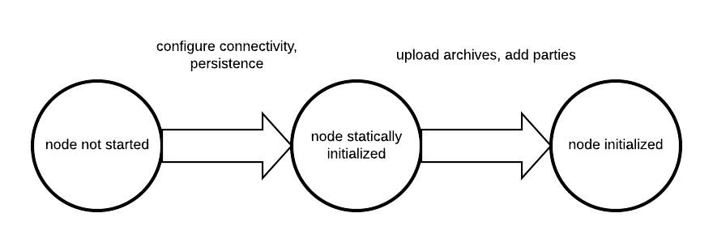

..
     Copyright (c) 2022 Digital Asset (Switzerland) GmbH and/or its affiliates
..
    
..
     Proprietary code. All rights reserved.

.. _static_configuration:

Static Configuration
====================

Canton differentiates between static and dynamic configuration. Static configuration is immutable and therefore has
to be known from the beginning of the process start. An example for a static configuration are the connectivity
parameters to the local persistence store or the port the admin-apis should bind to. On the other hand, connecting to a domain
or adding parties however is not a static configuration and therefore is not set via the config file but through the
:ref:`administration APIs <administration_apis>` or the :ref:`console <canton_console>`.

The configuration files themselves are written in `HOCON <https://github.com/lightbend/config/blob/master/HOCON.md>`__
format with some extensions:

- Durations are specified scala durations using a ``<length><unit>`` format. Valid units are defined
  by `scala <https://github.com/scala/scala/blob/v2.13.3/src/library/scala/concurrent/duration/Duration.scala#L82>`__ directly,
  but behave as expected using ``ms``, ``s``, ``m``, ``h``, ``d`` to refer to milliseconds, seconds, minutes, hours and days.
  Durations have to be non-negative in our context.

Canton does not run one node, but any number of nodes, be it domain or participant nodes in the same process. Therefore,
the root configuration allows to define several instances of domain and participant nodes together with a set of
general process parameters.

A sample configuration file for two participant nodes and a single domain can be seen below.

.. code-block:: none

    canton {
      participants {
        participant1 {
          storage.type = memory
          admin-api.port = 5012
          ledger-api.port = 5011
        }
        participant2 {
          storage.type = memory
          admin-api.port = 5022
          ledger-api.port = 5021
        }
      }
      domains {
        mydomain {
          storage.type = memory
          public-api.port = 5018
          admin-api.port = 5019
        }
      }
      // enable ledger_api commands for our getting started guide
      features.enable-testing-commands = yes
    }

.. _configuration_reference:

Configuration reference
-----------------------

The Canton configuration file for static properties is based on `PureConfig <https://pureconfig.github.io/>`__. PureConfig
maps Scala case classes and their class structure into analogue configuration options (see e.g. the `PureConfig quick start <https://pureconfig.github.io/docs/#quick-start>`__ for an example). Therefore, the ultimate source of truth for all
available configuration options and the configuration file syntax is given by the appropriate scaladocs of the
`CantonConfig <https://docs.daml.com/2.6.0/canton/scaladoc/com/digitalasset/canton/config/index.html>`__ classes.

When understanding the mapping from scaladocs to configuration, please keep in mind that:

- CamelCase Scala names are mapped to lowercase-with-dashes names in configuration files, e.g. ``domainParameters`` in the scaladocs becomes ``domain-parameters`` in a configuration file (dash, not underscore).
- ``Option[<scala-class>]`` means that the configuration can be specified but doesn't need to be, e.g. you can specify a JWT token via ``token=token`` `in a remote participant configuration <https://docs.daml.com/2.6.0/canton/scaladoc/com/digitalasset/canton/participant/config/RemoteParticipantConfig.html#token:Option[String]>`__, but not specifying ``token`` is also valid.

Configuration Compatibility
---------------------------
The enterprise edition configuration files extend the community configuration. As such, any community configuration
can run with an enterprise binary, whereas not every enterprise configuration file will also work with community
versions.

.. _include_configuration:

Advanced Configurations
-----------------------
Configuration files can be nested and combined together. First, using the ``include required`` directive (with relative paths), a
configuration file can include other configuration files.

::

    canton {
        domains {
            include required(file("domain1.conf"))
        }
    }

The ``required`` keyword will trigger an error, if the included file does not exist;
without the ``required`` keyword, any missing files will be silently ignored.
The ``file`` keyword instructs the configuration parser to interpret its argument as a file name;
without this keyword, the parser may interpret the given name as URL or classpath resource.
By using the ``file`` keyword, you will also get the most intuitive semantics and most stable semantics of ``include``.
The precise rules for resolving relative paths can be found `here <https://github.com/lightbend/config/blob/master/HOCON.md#include-semantics-locating-resources>`__.

Second, by providing several configuration files, we can override configuration settings using explicit configuration
option paths:

::

    canton.participants.myparticipant.admin-api.port = 11234

If the same key is included in multiple configurations, then the last definition has highest precedence.

Furthermore, HOCON supports substituting environment variables for config values using the syntax
``key = ${ENV_VAR_NAME}`` or optional substitution ``key = ${?ENV_VAR_NAME}``, where the key will only be set
if the environment variable exists.

.. _configuration-mixin:

Configuration Mixin
-----------------------

Even more than multiple configuration files, we can leverage `PureConfig <https://github.com/pureconfig/pureconfig>`__
to create shared configuration items that refer to environment variables.
A handy example is the following, which allows to share database
configuration settings in a setup involving several participant or domain nodes:

.. code-block:: none

    # Postgres persistence configuration mixin
    #
    # This file defines a shared configuration resources. You can mix it into your configuration by
    # refer to the shared storage resource and add the database name.
    #
    # Example:
    #   participant1 {
    #     storage = ${_shared.storage}
    #     storage.config.properties.databaseName = "participant1"
    #   }
    #
    # The user and password credentials are set to "canton" and "supersafe". As this is not "supersafe", you might
    # want to either change this configuration file or pass the settings in via environment variables.
    #
    _shared {
      storage {
        type = postgres
        config {
          dataSourceClass = "org.postgresql.ds.PGSimpleDataSource"
          properties = {
            serverName = "localhost"
            # the next line will override above "serverName" in case the environment variable POSTGRES_HOST exists
            serverName = ${?POSTGRES_HOST}
            portNumber = "5432"
            portNumber = ${?POSTGRES_PORT}
            # the next line will fail configuration parsing if the POSTGRES_USER environment variable is not set
            user = ${POSTGRES_USER}
            password = ${POSTGRES_PASSWORD}
          }
        }
        // If defined, will configure the number of database connections per node.
        // Please ensure that your database is setup with sufficient connections.
        // If not configured explicitly, every node will create one connection per core on the host machine. This is
        // subject to change with future improvements.
        parameters.max-connections = ${?POSTGRES_NUM_CONNECTIONS}
      }
    }

Such a definition can subsequently be referenced in the actual node definition:

::

    canton {
        domains {
            mydomain {
                storage = ${_shared.storage}
                storage.config.properties.databaseName = ${CANTON_DB_NAME_DOMAIN}
            }
        }
    }

.. _multiple-domains-config:

Multiple Domains
----------------

A Canton configuration allows to define multiple domains. Also, a Canton participant can connect to
multiple domains. This is however only supported as a preview feature and not yet suitable for
production use.

In particular, contract key uniqueness cannot be enforced over multiple domains. In this situation,
we need to turn contract key uniqueness off by setting

.. code-block:: none

    canton {
        domains {
            alpha {
                // subsequent changes have no effect and the mode of a node can never be changed
                init.domain-parameters.unique-contract-keys = false
            }
        }
        participants {
            participant1 {
                // subsequent changes have no effect and the mode of a node can never be changed
                init.parameters.unique-contract-keys = false
            }
        }
    }

Please note that the setting is final and cannot be changed subsequently. We will provide a migration
path once multi-domain is fully implemented.

Fail Fast Mode
--------------

Be default, Canton will fail to start if it cannot access some external dependency such as the database. This is
preferable during initial deployment and development, as it provides instantaneous feedback, but can cause problems
in production. As an example, if Canton is started with a database in parallel, the Canton process would fail if the
database is not ready before the Canton process attempts to access it. To avoid this problem, you can configure a node
to wait indefinitely for an external dependency such as a database to start. The config option below will disable
the "fail fast" behaviour for ``participant1``.

.. code-block:: none

    canton.participants.participant1.storage.parameters.fail-fast-on-startup = "no"

This option should be used with care as, by design, it can cause infinite, noisy waits.

Init Configuration
------------------

Some configuration values are only used during the first initialization of a node and cannot be changed afterwards.
These values are located under the `init` section of the relevant configuration of the node. Below is an example with
some init values for a participant config

.. code-block:: none

    participant1 {
      init {
        // example settings
        ledger-api.max-deduplication-duration = 1 minute
        parameters.unique-contract-keys = false
        identity.node-identifier.type = random
      }
    }

