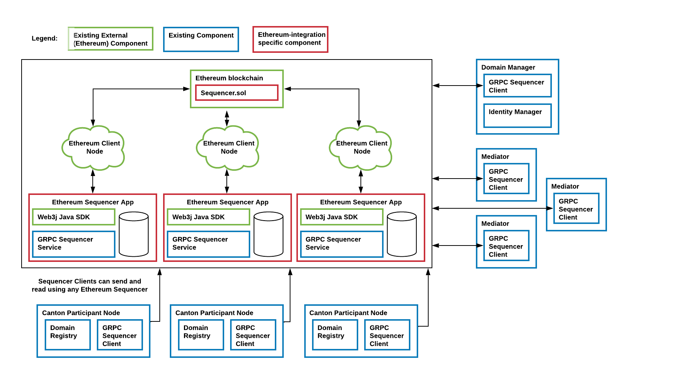

..
     Copyright (c) 2022 Digital Asset (Switzerland) GmbH and/or its affiliates
..
    
..
     Proprietary code. All rights reserved.

.. _ethereum-architecture:

Canton Domain on Ethereum
=========================

A Canton Ethereum domain uses a sequencer backed by Ethereum instead of by another ledger
(such as Postgres or Fabric). The other domain components (mediator, domain manager) are reused from the relational database driver.
Architecturally, the Canton Ethereum sequencer is a JVM application that interacts with an Ethereum client
via the `RPC JSON API <https://eth.wiki/json-rpc/API>`_
to write events to the blockchain.
Specifically, it interacts with an instance of the smart contract ``Sequencer.sol`` and calls function of ``Sequencer.sol``
to persist transactions and requests to the blockchain.
It uses the configured Ethereum account to execute these calls.
Analogous to the database-based sequencer implementations, multiple Ethereum sequencer applications can read and write to the same
``Sequencer.sol`` smart contract instance and they can do so through different Ethereum client nodes for high availability,
scalability, and trust. The following diagrams shows the architecture of an Ethereum-based domain:

.. note:: When running in a multi-writer setup, each Ethereum Sequencer application needs to use a separate Ethereum account.
    Otherwise, transactions may get stuck due to nonce mismatches.

Smart contract Sequencer.sol
~~~~~~~~~~~~~~~~~~~~~~~~~~~~

The smart contract deployed to the blockchain is implemented in Solidity. Its latest revision looks like this:

.. code-block:: none

    // Copyright (c) 2022 Digital Asset (Switzerland) GmbH and/or its affiliates
    //
    // Proprietary code. All rights reserved.
    
    pragma solidity 0.8.10;
    pragma experimental ABIEncoderV2;
    
    contract Sequencer {
    
        // The ID of the topology manager
        string topologyManager = "";
    
        // all members (Canton components) who are registered at this sequencer have `true` as value
        mapping (string => bool) registeredMembers;
    
        // the ethereum accounts authorized to interact with the sequencer contract.
        mapping (address => bool) authorizedAccounts;
    
        // Whether authorization is enabled such that only authorized Ethereum accounts can interact with this contract
        bool public authorizationEnabled;
    
        // This version is currently only relevant for Canton-internal checks that it is interacting with the correct
        // revision of Sequencer.sol for the configured protocol version
        string public version = "1.0.1";
    
        constructor(bool enableAuthorization){
            authorizationEnabled = enableAuthorization;
            if (enableAuthorization) {
                authorizedAccounts[msg.sender] = true;
                emit AuthorizedAccount("", msg.sender);
            }
        }
    
        // Emitted if a submission request was successfully written to the blockchain.
        event Send(string traceParent, bytes submissionRequest, uint64 timestamp);
        event NewMember(string traceParent, string member);
        event AuthorizedAccount(string traceParent, address account);
        event FatalError(string traceParent, string message);
    
        /**
            @notice Authorizes the given Ethereum account to also interact with this contract instance.
             Part of the authorization preview feature.
        */
        function authorizeAccount(string memory traceParent, address toAuthorize) public ensureSenderIsAuthorized {
            if (authorizationEnabled) {
                authorizedAccounts[toAuthorize] = true;
                emit AuthorizedAccount(traceParent, toAuthorize);
            }
        }
    
        /**
            @notice Checks whether the given Ethereum account is authorized to interact with this contract instance.
             Part of the authorization preview feature.
        */
        function isAuthorized(address account) public view returns(bool) {
            return authorizedAccounts[account];
        }
    
        /**
            @notice Checks that `msg.sender` is among the authorized accounts. This modifier should be implemented
            by every public function in `Sequencer.sol` except by the function `isAuthorized`.
            Part of the authorization preview feature.
        */
        modifier ensureSenderIsAuthorized {
            if (authorizationEnabled) {
            bool isAuthorized_ = authorizedAccounts[msg.sender] == true;
            require(isAuthorized_, string(abi.encodePacked("Authorization check for following msg-sender failed: ", msg.sender)));
            }
            _;
        }
    
        /**
            @notice Registers the topology manager. Members the TPM references in a sendAsync call are automatically
            registered. Emits a `FatalError` if the TPM was already set to a different value previously.
        */
        function registerTpm(string memory traceParent, string memory tpmID) public ensureSenderIsAuthorized {
            if (bytes(topologyManager).length == 0){
                topologyManager = tpmID;
                if (!isMemberRegistered(tpmID)) {
                    registerMember(traceParent, tpmID);
                }
            }
            else {
                // the solidity == method is "pointer equality"
                bool differs = keccak256(abi.encodePacked((topologyManager))) != keccak256(abi.encodePacked((tpmID)));
                if (differs) {
                    emit FatalError(traceParent, "Unexpected attempt to change the topology manager ID");
                }
            }
        }
    
        function isMemberRegistered(string memory member) private view returns (bool) {
            return registeredMembers[member];
        }
    
    
        /**
            @notice Register a member (Canton component) such that it can receive messages from the sequencer.
            This method is idempotent.
        */
        function registerMember(string memory traceParent, string memory newMember) public ensureSenderIsAuthorized {
            registeredMembers[newMember] = true;
            emit NewMember(traceParent, newMember);
        }
    
        /**
            @notice This is the most important function of the sequencer smart contract. Sequence a batch of events assigning them a timestamp.
        */
        function sendAsync(
            string memory traceParent,
            bytes memory submissionRequest,
            uint64 timestamp
        ) public ensureSenderIsAuthorized {
            emit Send(traceParent, submissionRequest, timestamp);
        }
    }
    

Data is written to the blockchain by emitting `events <https://docs.soliditylang.org/en/stable/contracts.html#events>`_
to the transaction logs.
The Sequencer Application reads all transactions (and transaction logs) created from calls to ``Sequencer.sol``
and keeps its own store for a view of the sequencer history.
This enables the Sequencer Application to serve read subscriptions promptly without having to query the Ethereum client
and to restart without having to re-read all the history. The store can either use in-memory storage or persistent
storage (using a database).
