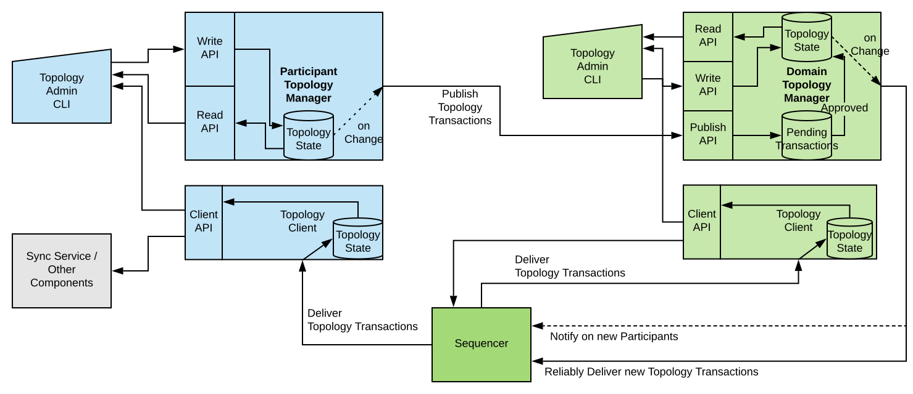
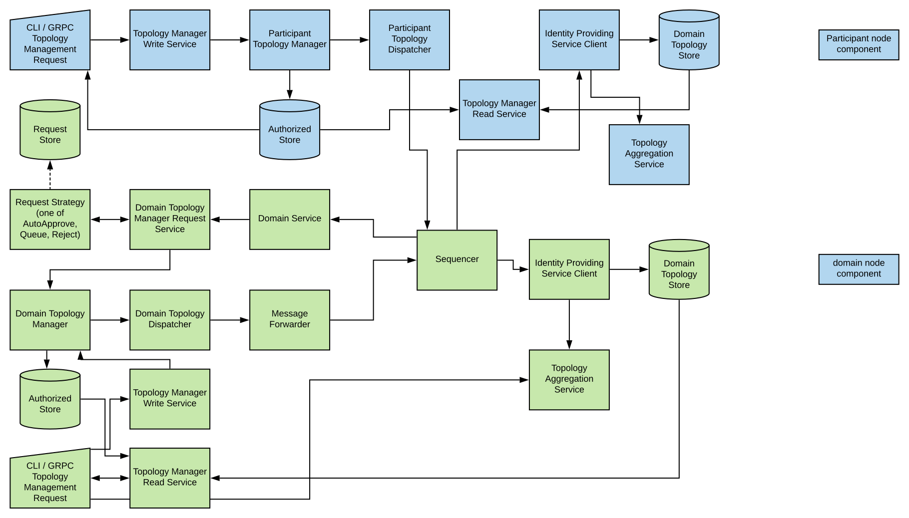

..
     Copyright (c) 2022 Digital Asset (Switzerland) GmbH and/or its affiliates
..
    
..
     Proprietary code. All rights reserved.

.. default-role:: math

.. _identity-manager-1:

Identity Management
###################

Identity Providing Service
**************************

Every synchronization domain requires a shared and synchronized knowledge of
identities and their associated keys among all participants and domain entities
as the synchronisation protocol is built with the principle that provided the
same data, all validators must come verifiably to the same result.

The service that establishes this shared understanding in a domain is the
*Identity Providing Service* (**IPS**). From a synchronisation protocol
perspective, the IPS is an abstract component and the synchronisation protocol
only ever interacts with the read API of the IPS. There is no assumption on how
the IPS is implemented, only the data it provides is relevant from a
synchronisation perspective.

The participant nodes, the sequencer and the mediator have a
local component called the *Identity Providing Service Client* (**IPS
client**). This component establishes the connection to the IPS of the domain
to read and validate the identity information in the domain.

The IPS client exposes a read API providing aggregated access to the domain
topology information and public keys provided by the IPS of one or more domains.

The identity providing service receives keys and certificates through some
process and evaluates the justifications, before presenting the information to
the IPS clients of the participant or domain entities. The IPS clients verify
the information. The local consumers of the IPS client read API trust the
provided information without verifying the justifications, leading to a
separation of synchronisation and identity management.

Requirements
============

The identity providing service describes the interface between the identity
management process and the synchronisation functionality. It satisfies the
high-level platform requirement
on :ref:`identity information updates <identity-information-updates-hlreq>`.
The following requirements are written from the perspective of the IPS client,
i.e., the synchronisation layer components.

* **Mapping of Parties to Participants**. I can query the state at a certain
  time and subscribe to a stream of updates associating a known identifier of a
  party to a set of participants as well as the local participant to a set of
  hosted parties. Mapping to a set of participants satisfies the high-level
  requirement on :ref:`parties using multiple participants
  <parties-using-multiple-participants-hlreq>`.

* **Participant Qualification**. I can query the state at a certain time and
  subscribe to a stream of updates informing me about the trust level of a
  participant indicating either *untrusted* (trust level of 0) or *trusted*
  (trust level of 1).

* **Participant Relationship Qualification**. A party to participant
  relationship is qualified, restricted to submission (including
  confirmation), confirmation, observation (read-only). This also satisfies the
  high-level requirement on :ref:`read-only participants <read-only-participants-hlreq>`.

* **Domain aware mapping of Participants to Keys**. I can query the state at a
  certain time and subscribe to a stream of updates mapping participants to a
  set of keys per synchronization domain.

* **Domain Entity Keys**. I can query the current state and subscribe to a
  stream of updates on the keys of the domain entities.

* **Lifetime and Purpose of Keys**. I can learn for any key that I receive for what
  it can be used, what cryptographic protocol it refers to and when it expires.

.. todo::
    Add expiration date to keys and topology transactions `#1250 <https://github.com/DACH-NY/canton/issues/1250>`_

* **Signature Checking**. Given a blob, a key I obtained from the IPS and a
  signature, I can verify that the signature is a valid signature for the given
  blob, signed with the respective key at a certain time.

* **Immutability**. The history of all keys is preserved within the same time
  boundaries as my audit logs such that I can always audit my participant or
  domain entity logs.

* **Evidence**. For any data which I receive from the IPS I can get the set of
  associated evidence such that I can prove my arguments in a legal dispute. The
  associated evidence contains a descriptor which I can use to read up in the
  documentation on the definition of the otherwise opaque blob.

* **Race Condition Free**. I can be sure that I am always certain about the
  validity of a key with respect to a transaction such that there cannot be a
  disagreement on the validity of a transaction due to an in-flight key change.

* **Querying for Parties**. I can query, using an opaque query statement, the
  IPS for a party and will receive results based on a privacy policy not known
  to me.

* **Party metadata**. I can access metadata associated with a party for display
  purposes.

* **Equivalent Trust Assumptions** A federation protocol of the reference
  identity management service needs to be based on equivalent trust
  assumptions as the interoperability protocol such that there is no mismatch
  between the capabilities of the two.

Associated requirements that extend beyond the scope of the IPS:

* **API Versioning**. I can use a versioned API which supports further
  extensions, see our general principles of upgradability and Software
  Versioning.

* **GDPR compliance**. The identity providing service needs to comply with
  regulatory requirements such as the GRPR right to be forgotten.

* **Composability**. The identity providing service needs to be composable
  such that I can add my own identity providing service based on the
  documentation and released binary artefacts.

Identity Management Design
**************************

While the previous section introduced the IPS as an abstract concept, we
describe here the concrete implementation of our globally composable topology
management system which incorporates identity. The design is introduced by first calling out a few basic
design principles. We then introduce a formalism for the necessary topology
management transactions. Finally, we connect the formalism to actual processes
and cryptographic artefacts that describe the concrete implementation.

Design Principles
=================
In order to understand the approach, a few key principles need to be
introduced.

The synchronisation protocol is separated from the topology protocol. However,
in order to leverage the composability properties of the synchronisation
protocol, an equivalent approach is required for topology transactions. As such, given
that there is no single globally trusted entity we can rely on
for synchronisation, we also can't rely on a single globally trusted entity to
establish identities, which leads us to the first principle:

  *Principle 1: For global synchronization to work in reality, there cannot
  be a single trust anchor.*

A cryptographic key pair can uniquely be identified through the fingerprint
of the public key. By owning the associated private key, an entity can always
prove unambigously through a signature that the entity is the owner of the
public key. We are using this principle heavily in our system to verify and
authorize the activities of the participants. As such, we can introduce the
second principle:

  *Principle 2: A participant is someone who can authorize and whose
  authorizations can be verified (someone with a known key)*

In short, a participant is someone with a key or with a set of keys that are
known to belong together. However, the above definition doesn't mean that we
necessarily know who owns the key. Ownership is an abstract aspect of the real
world and is not relevant for the synchronisation itself. Real world ownership
is only relevant for the interpretation of the meaning of some shared data,
but not of the data processing itself.

Therefore, we introduce the third principle:

  *Principle 3: We separate certification of system identities and legal
  identities (or separation of cryptographical identity and metadata)*

Using keys, we can build trust chains by having a key sign a certificate
certifying some ownership or some fact to be associated with another key.
However, at the root of such chains is always the root key. The root key
itself is not certified and the legal ownership cannot be verified: we just
need to believe it. As an example, if we look at our local certificate store
on our device, then we just believe that a certain root is owned by a named
certificate authority. And our believe is rooted in the trust into our
operating system provider that they have included only legitimate keys.

As such, any link between legal identities to cryptographic keys through
certificates is based on a believe that the entity controlling the root key
is honest and ensured that everybody attached to the trust-root has been
appropriately vetted. Therefore, we can only believe that legal identities are
properly associated, but verifying it in the absolute sense is very difficult,
especially impossible online.

Another relevant aspect is that identity requirements are asymmetrical
properties. While large corporations want to be known by their name (BANK),
individuals tend to be more closed and would rather like that their identity
is only revealed if really necessary (GDPR, HIPAA, confidential information,
bank secrecy). Also, by looking at a bearer bond for example, the owner has a
much higher interest in the identity of the obligor than the obligor has in the
owner. If the obligor turns out to be bad or fraud, the owner might loose all
their money. In contrast, the obligor doesn't really care to whom they are paying
back the bond, except for some regulatory reasons. Therefore, we conclude the
fourth principle

  *Principle 4: Identities on the ledger are an asymmetric problem, where
  privacy and publicity needs to be carefully weighted on a case by case
  basis.*

Formalism for a Global Composeable Topology System
==================================================

Definitions
-----------
In order to construct a global composable topology system that incorporates identity, we will introduce
an topology scheme leading to globally unique identifiers. This allows us to
avoid federation which would require cooperation between identity providers or
consensus among all participants and would be difficult to integrate with the
synchronisation protocol.

We will use `(p_{k}^{x},s_{k}^{x})` to refer to a public/private key pair
of some cryptographic scheme, where the super-script `x` will provide the
context of the usage of the key and the sub-script `k` will be used to
distinguish keys.

In the following, we will use the **fingerprint** of a public key
`I_{k} = \textrm{fingerprint}(p_{k})` in order to refer to a key-pair `(p_{k},s_{k})`.

Based on this, we will use `I_{k}`, resp. `(p_{k},s_{k})`, as an identity root key
pair in the following. There can be multiple thereof and we do not make any statement on who
the owner of such a key is.

Now, we introduce a globally unique identifier as a tuple `(X, I_{k})` , where
`I_{k}` refers to the previously introduced fingerprint of an identity root key
and `X` is in principle some abstract identifier such that we can verify equality.
As such, `(X,I_{k}) = (Y,I_{l})` if `X = Y` and `I_{k} = I_{l}`. The identifier is globally
unique by definition: there cannot be a collision as we defined two
identifiers to be equal by definition if they collide. As such, the identity
key `I_{k}` spans a **namespace** and guarantees that the namespace is, by definition,
collision free.

The unique identifier within the project is defined as

.. code-block:: scala

    /** A namespace spanned by the fingerprint of a pub-key
      *
      * This is based on the assumption that the fingerprint is unique to the public-key
      */
    final case class Namespace(fingerprint: Fingerprint) extends PrettyPrinting {
      def unwrap: String = fingerprint.unwrap
      def toProtoPrimitive: String = fingerprint.toProtoPrimitive
      def toLengthLimitedString: String68 = fingerprint.toLengthLimitedString
      override def pretty: Pretty[Namespace] = prettyOfParam(_.fingerprint)
    }
    
    /** a unique identifier within a namespace
      * Based on the Ledger API PartyIds/LedgerStrings being limited to 255 characters, we allocate
      * - 64 + 4 characters to the namespace/fingerprint (essentially SHA256 with extra bytes),
      * - 2 characters as delimiters, and
      * - the last 185 characters for the Identifier.
      */
    final case class UniqueIdentifier(id: Identifier, namespace: Namespace) extends PrettyPrinting {

We will use the global unique identifier to identify participant nodes `N =
(N, I_{k})`, parties `P = (P,I_{k})` and domain entities `D = (D,I_{k})` (which means
that `X` is short for `(X,I_{k})`). For parties `P` and participant nodes `N`,
we should use a sufficiently long random number for privacy reasons. For domains
`D`, we use readable names.

Incremental Changes
-------------------

The topology state is build from incremental changes, so called topology
transactions `\{+/-; \omega\}^{[s_{k}]}_{t}` where `+` is the addition and
`-` the subsequent removal. The incremental changes are not commutative and are
ordered by time. For a given operand `\omega` we note that the only accepted
sequences are `+` or `+-`, but that `-+` or `--` or `++` are not accepted.
The `t` denotes the time when the change was effected, i.e. when it was
sequenced by the identity providing service.

The `\{.\}^{[s_{k}]}` denotes the list of keys that authorized the change by
signing the topology transaction. The authorization rules (which keys
`[s_{k}]` need to sign an topology transaction `\{.\}`) depend on the command
`\omega`. Most but not all transactions require the signatures to be nested in
some form. Generally, we note that anything that is distributed by the
identity providing service needs to be signed with its key `s_{D}` and
therefore `\forall \{.\}^{[s_k]}: s_{D} = \,\textrm{tail}\,[s_{k}]`.

For the sake of brevity, we will omit the identity providing service signature
using `s_{D}` in the following and assume that it is always added upon
distribution together with the timestamp `t`.

.. _topology_transactions:

Topology Transactions
---------------------
We can distinguish three types of topology transactions: identity delegations,
mapping updates and domain governance updates. In the following,
we will establish what these transactions mean and what they do and what the
authorization rules are.

Delegation
^^^^^^^^^^
The general delegation transaction is represented as

.. math::

  \{+/-; (?,I_{k}) \Rightarrow p_{l}\}^{s_{k}}

where the `?` is a place-holder for a specific permissioning level. The
delegation transaction indicates that a certain set of operations on the
namespace spanned by the root key pair `I_{k}` is delegated to the public key
`p_{l}`. The delegation is not exclusive, which means that there can be multiple keys
that have to right to sign a specific transaction on the specific namespace.

There are two types of delegations:

.. _namespace-delegation:

* **namespace delegations**: `\{+/-; (*;I_{k}) \Rightarrow p_{l}\}^{[\tilde{s}_{k}]}`
  which delegates to `p_{l}` the right to do all topology transactions on that
  particular namespace. The signature of such a delegated key is then
  considered to be equivalent to the signature of the root key: `s_{l}
  \simeq s_{k}`. If such a namespace delegation is a *root delegation*, then the
  delegated key is as powerful as the root key. If the *root delegation* flag is set to false,
  then the key can do everything on that namespace, except of issuing `NamespaceDelegation`.
  Therefore, such a delegation with the root delegation flag set to false effectively
  represents an intermediate CA, whereas with true, it's an equivalent root key.
  This operation is particularly useful to support offline storage of root keys, but as
  we will see later, it is also used to roll keys.

.. code-block:: scala

    final case class NamespaceDelegation(
        namespace: Namespace,
        target: SigningPublicKey,
        isRootDelegation: Boolean,
    ) extends TopologyStateUpdateMapping {

.. _identifier-delegation:

* **identifier delegations**:
  `\{+/-; (X;I_{k}) \Rightarrow p_{l}\}^{[\tilde{s}_k]}` which delegates the right
  to assign mappings to a particular identifier `(X,I_k)`.
  With this right, the key holder can assign a party to a participant or run
  the party as a participant by assigning a key to it. This effectively represents
  a certificate.

.. code-block:: scala

    final case class IdentifierDelegation(identifier: UniqueIdentifier, target: SigningPublicKey)
        extends TopologyStateUpdateMapping {

From an authorization rule perspective, these delegations can delegate
permissions to other keys and can be used to verify whether a certain key is allowed
to sign an topology transaction. Therefore, we use for now the notation `\tilde{s}_{k}^{I}` to
indicate that some operation requires a signature of the root key `s_{k}^{I}` or by a key which was
directly or indirectly authorised by the root key.

Mapping Updates
^^^^^^^^^^^^^^^
The generic second type of topology transactions are mapping updates which are
represented as

.. math::

  \{+/-, (X, I_{k}) \rightarrow (Y, I_{l}, ct)\}^{[\tilde{s}_k,\tilde{s}_l]}

The above transaction maps one item of one namespace to something of a second
namespace. For some mapping updates, the second namespace is always equal to
the first namespace and we only require a single signature. The `ct` provides
context to the mapping update and might include usage restrictions, depending
on the type of mapping.

For transactions that require two signatures we support the composition of
the add operation through

.. math::

  \{+, (X, I_{k}) \rightarrow (Y, I_{l}, ct)\}^{[\tilde{s}_k,\tilde{s}_l]} =
  \{+, (X, I_{k}) \rightarrow (Y, I_{l}, ct)\}^{[\tilde{s}_k]} +
  \{+, (X, I_{k}) \rightarrow (Y, I_{l}, ct)\}^{[\tilde{s}_l]}

and the removal operation through

.. math::

  \{-, (X, I_{k}) \rightarrow (Y, I_{l}, ct)\}^{[\tilde{s}_k,\tilde{s}_l]} =
  \{-, (X, I_{k}) \rightarrow (Y, I_{l}, ct)\}^{[\tilde{s}_k]} ||
  \{-, (X, I_{k}) \rightarrow (Y, I_{l}, ct)\}^{[\tilde{s}_l]}

There are four different sub-types of valid mapping transactions:

* **Domain Keys**: The mapping transaction of
  `\{+, D \rightarrow (p_{D}, \textrm{ct})\}^{s_{D}}` updates the keys for
  the domain entities. Valid qualifiers for `ct` are *identity*, *sequencer*,
  *mediator*. As every state update needs to be signed by the domain, the
  domain definition corresponds to the initial seed of the identity
  transaction stream `\{D \rightarrow (p_{D}, \textrm{identity})\}^{s_{D}}`.
  If a participant knows the domain id of `D`, it can verify that this initial
  seed is correctly authorized by the owner of the key governing the unique
  identifier of the domain id.

.. _owner-to-key-mapping:

* **Owner to Key Mappings**: The mapping transaction
  `\{+, (N,I_k) \rightarrow (p_{l}, \textrm{ct})\}^{[\tilde{s}_{k}]}` updates
  the keys that are associated with an owner such as a participant or a domain entity.
  The key purposes can be *signing* and/or *encryption*. If more than one key is defined,
  all systems are supposed to use the key that was observed first and is still active.

.. code-block:: scala

    final case class OwnerToKeyMapping(owner: KeyOwner, key: PublicKey)
        extends TopologyStateUpdateMapping {

.. _party-to-participant-mapping:

* **Party to Participant Mappings**: The mapping transaction
  `\{+, (P,I_{k}) \rightarrow (N,I_{l},\textrm{ct})\}^{[\tilde{s}_k,\tilde{s}_l]}`
  maps a party to a participant. The context ct would call out the permissions
  such as *submission*, *confirmation* or *observation*.

.. code-block:: scala

    final case class PartyToParticipant(
        side: RequestSide,
        party: PartyId,
        participant: ParticipantId,
        permission: ParticipantPermission,
    ) extends TopologyStateUpdateMapping {

Participant State Updates
^^^^^^^^^^^^^^^^^^^^^^^^^
The fourth type of topology transactions are participant state updates as
domain governance transactions `\{d|a|c|p, N\}^{s_{D}}`. Here, `d` means
*disabled* (participant cannot be involved in any transaction, `a` means
participant is *active*, `c` means participant cannot submit transactions but
only *confirm*, `p` means participant is *purged* and will never be back
again. Participant states are owned by the operator of the committer. It is at the
committers discretion to decide whether a participant is allowed to use the domain
or not.

.. code-block:: scala

    final case class ParticipantState(
        side: RequestSide,
        domain: DomainId,
        participant: ParticipantId,
        permission: ParticipantPermission,
        trustLevel: TrustLevel,
    ) extends TopologyStateUpdateMapping {
    
      require(
        permission.canConfirm || trustLevel == TrustLevel.Ordinary,
        "participant trust level must either be ordinary or permission must be confirming",
      )

Some Considerations
-------------------

Removal Authorizations
^^^^^^^^^^^^^^^^^^^^^^
We note that the authorization rules for the addition are more strict than for
the removal: Any removal can be authorized by the domain key `s_{D}` such that
the domain operator can prune the topology state if necessary, which is fine,
as the accessibility of a domain is anyway dependent on the cooperation of the
domain operator.

Therefore, when talking about removal authorization, we explain the
authorization check the IPS will make if it receives a removal request from an
untrusted source. Consequently, all participants will at least be aware
whether a certain topology transaction removal was authorized by the domain topology
manager or by the actual authority of that topology transaction.

Revocations
^^^^^^^^^^^
One important point to note is that all topology transactions have a
local effect. This means that a removal of a root key `\{-, p_{k}\}` will
not invalidate all transactions that have been signed before by the key
directly or indirectly. Therefore, to revoke a key as in "invalidating everything
the key has signed" requires publishing a set of topology transactions together.

.. todo::
    Support key revocation in identity management operations `#1309 <https://github.com/DACH-NY/canton/issues/1309>`_

Domain Topology State
^^^^^^^^^^^^^^^^^^^^^
Looking at the given formalism, we can distinguish between the *topology state* and the *domain topology state*.
The difference between these two is that the *topology state* is comprised of all
delegation and mapping transactions. The domain topology state extends this definition by adding
*domain governance updates* such as participant states. And the domain topology state overrides the
authorization rule by allowing a domain to remove any previous topology transaction.

.. _bootstrapping-idm:

Bootstrapping
^^^^^^^^^^^^^
Based on the above explanations, we observe that the authorized domain topology state is given by all signed and properly
authorized topology transaction which additionally have been ordered and signed by the domain topology manager and
distributed (and signed) by the sequencer. Consequently, for a new participant connecting to a domain,
in order to validate the topology state and know that they are talking to the right sequencer, it only needs to know
the unique-identifier of the domain. Using this unique identifier, it can verify the authenticity and correctness
of the topology state, as it can verify the correct authorization of the corresponding topology transactions.

This is the bootstrapping problem of any Canton network: In order to connect to a domain, a participant needs to know
the domain id (a unique identifier) of a domain, which it needs to receive through a trusted channel.

Default Party
^^^^^^^^^^^^^
Given that `(N,I_{k})` and `(P,I_{k})` are both unique identifiers which we
use to refer to participants and parties, we can introduce for every participant
its default party. This provides a more straight forward meaning of a party
as being a virtualisation concept on top of the synchronisation structure.

Therefore, any party in the system can either self-host on a participant, or delegate
the hosting to another participant. Or do a mixture of both.

Submission vs Confirmation
^^^^^^^^^^^^^^^^^^^^^^^^^^
Due to sub-transaction privacy, validating participants only learn the identity of the submitter if they are stakeholders
of the root transaction node. Therefore, the distinction between *submission* and *confirmation* permissions in the
party to participant mappings are only respected by the default implementation. A malicious submitter with
*confirmation* permissions can submit transactions in the
name of the party. Such a behaviour will be detected by any other participant hosting the party, but these participants
cannot prevent the transaction from being accepted.

Topology State Accumulation
---------------------------

Now, we define the topology state `S_{t}` at time `t` as provided by the
identity service provider of a domain incrementally as

.. math::

  S_{t} &= S_{t-1} + \{., \omega\}_{t}^{s_{k},s_{k'}} \\
        &= \bigoplus_{t' < t} \{., \omega\}_{t'}^{[s_{.}]}\\
        &= [(.,I) \Rightarrow p] + [((X,I) \rightarrow Y)] +
        [(.,N)]

Here, the first expression on the last line represents the delegations, the second
corresponds to the mapping updates and the third one to the participant state updates.

We assume that the identity providing service (which is part of the committer) is
presented by someone with an topology transaction `\{.\}^{s_k}`. Upon a vetting
operation where the operator can decide if the proposed change is acceptable, the
IPS sequences, validates, signs (using the domain key `s_{D}`) and distributes the
topology state changes to all affected domain entities.

Privacy by Design
-----------------

.. todo::
    Add privacy to topology transactions `#1251 <https://github.com/DACH-NY/canton/issues/1251>`_

A tricky question is how to provide privacy by design, allowing participants
only to learn about other parties and participants on a need to know basis,
while still ensuring that enough information is available for the participant
to progress and ensuring that the information remains immutable and verifiable.

We do this by generally restricting what is shared with participants by
default. Instead of broadcasting the mappings `X \rightarrow Y` to all
participants, we broadcast `T = (H(X),t_id)` instead.

We include a service with the committer that allows to query the data once the
left hand side has been learnt. This means that once `X` of `H(X)` is known, a
participant can call a service that returns the corresponding topology
transactions, which in turn can be verified to be justified.

Looking at the participant to key mappings `N \rightarrow K` we note that by
only broadcasting `H(N)` instead of `N`, other participants cannot transact
with a participant P unless they have learned P's identity. This is a similar
property as we see with phone numbers. Guessing a phone number is hard.
However, once we receive a call from a phone, we know the calling number.

By restricting the data we broadcast about the party to participant mappings,
we prevent two aspects. First, nobody can contact a party unless they have
learned the party identifier before. This is important as otherwise, any
participant on the ledger might e.g. contact all parties of another
participating bank. Second, we also protect that somebody can know how many
parties e.g. a participant manages. This prevents learning questions such as
how many parties are represented by a certain participant (how many clients
does my competitor have).

Cross-Domain Delegations
------------------------

In our design of participants and parties, we observe that a participant is a
system entity whereas a party is meant to represent some actor in the real
world. In order to commoditise the ledger as a service, we need to provide a
way that makes a party something fluid that can be moved around from
participant. As the participant should just be a service, it might be
acceptable to keep it pinned to an identity domain. But a party should be able
to travel but still be hold accountable for the obligations.

Permissioning a party on a second participant node that exists in the same
domain is already possible in the present formalism:
`\{(P,I_{k}) \rightarrow (N_{2}, I_{k})\}^{s_{k}}`

A straight-forward extension to permission a party on a second participant in
another identity namespace is:
`\{(P,I_{k}) \rightarrow (N_{2}, I_{l})\}^{s_{k}, s_{l}}`
Based on the additivity of such statements, we can also build such a
permission from two individually signed transactions.

The party delegation transaction supports delegating the
permissioning of a party to a key outside of the root key namespace:
`\{(P,I_{k}) \Rightarrow p_{l}\}^{s_{k}}`

Multi-Domain Transaction
------------------------

.. todo::
    Add multi-domain transfer permission information to topology state `#1252 <https://github.com/DACH-NY/canton/issues/1252>`_

The key challenge of the identity management aspect is to design it such that
we can support multi-domain synchronisation without requiring the committers
cooperate.

First, we note that we avoid collision problems by using globally unique
identifiers derived from namespaces generated by root keys by design.

Second, we note that we do not need to have complete consistency of identities
between the committers. All that is required is a sufficient overlap.

We first introduce a new mapping transaction denoted the transfer permission
as `\{P \rightarrow D_{T}\}` on the source domain `D_{S}`. The transfer
permission means that for the given party, out-transfers of contracts to the
target domain `D_{T}` are allowed. However, this does not imply that the
target domain has a corresponding permission to move the contract back. It
might, but there is no guarantee.

Right now, in the transfer-out protocol, the transfer-out request check reads
*The target domain is acceptable to all stakeholders*. By introducing `\{P
\rightarrow D\}` we are now explicit about what an acceptable domain is: for
all stakeholder parties of the particular contract, there is an approriate
transfer permission on the current domain.

However, there are edge cases we need to deal with: what happens if on
domain `D_{T}`, the party `P` doesn't exist? Or what happens if the
participants representing `P` on `D_{S}` are completely different than on
`D_{T}`? This can happen either due to a misconfiguration or due to a
race-condition of an inflight change.

Clearly, in such a case, the transfer must fail in a predicatable manner.
Therefore, we introduce two new rules

  1) transfer-our on `D_{S}` will be rejected if `(P \rightarrow
  [N])_{D_{S}}^{t_{1}} \cap (P \rightarrow [N])_{D_{T}}^{t_{0}} = \emptyset`

  2) transfer-in on `D_{T}` will be rejected if `(P \rightarrow
  [N])_{D_{S}}^{t_{1}} \cap (P \rightarrow [N])_{D_{T}}^{t_{2}} = \emptyset`

These rules boil down to the simple verbal requirement that at least one
participant representing the affected party needs to be present on both
domains while the transfer takes place from `t_{0}` to `t_{2}`.

Validation
----------
Scenario: *How to roll participant keys?*

This corresponds to `\{+, (N,I_k) \rightarrow p_{2}\}^{\tilde{s}_{k}}
\{-, (N,I_k) \rightarrow p_{1}\}^{\tilde{s}_{k}}`

Scenario: *I can setup my local committer and my local participant and
subsequently connect to a remote committer.*

Either locally create an identity key and get it vetted by the committer. Or
get `IdentifierDelegations` by another identity key holder, load it locally
into the identity store, subsequently pushing to a remote committer.

Scenario: *I can register a party on multiple participants?*

`\{+, P \rightarrow N_{1}\}\{+, \rightarrow N_{2}\}`

Scenario: *I can introduce a new cryptographic signing scheme without loosing
my identities or I can roll a root identity key.*

Assuming that `\{I_{k}^{S}\}` is the original key of scheme `S` and we want to
use scheme `S'`, then the following transaction should suffice:
`\{J_{k}^{S'}\}^{I_{k}^{S}}`. Now the new key is endorsed to act on the
namespace originally spanned by `I_{k}`. If furthermore `I_{k}` is revoked,
then the new key becomes the root key. If the signature of the old key is not
trusted then the delegation needs to be "believed".

There is a corresponding RFC for X509s for that
https://tools.ietf.org/html/rfc6489

Scenario: *I can migrate a party from one participant to another.*

.. math::

  \{+, (P,I_{k}) \rightarrow (N_{2}, I_{l}) \}^{I_{k},I_{l}}
  \{-, P \rightarrow (N_{2},I_{k}) \}^{I_{k}}

Implementation
**************

Domain Id
=========

We assume that the domain id is shared with the connecting participant through a trusted channel. This can be
implemented as a secure out of band process or by trusting TLS server authentication
when initially requesting the domain id from the *Sequencer Service*.

Identity Providing Service API
==============================
The Identity Providing Service client API is defined as follows:

.. code-block:: scala

    
    /** Client side API for the Identity Providing Service. This API is used to get information about the layout of
      * the domains, such as party-participant relationships, used encryption and signing keys,
      * package information, participant states, domain parameters, and so on.
      */
    class IdentityProvidingServiceClient {
    
      private val domains = TrieMap.empty[DomainId, DomainTopologyClient]
    
      def add(domainClient: DomainTopologyClient): this.type = {
        domains += (domainClient.domainId -> domainClient)
        this
      }
    
      def allDomains: Iterable[DomainTopologyClient] = domains.values
    
      def tryForDomain(domain: DomainId): DomainTopologyClient =
        domains.getOrElse(domain, sys.error("unknown domain " + domain.toString))
    
      def forDomain(domain: DomainId): Option[DomainTopologyClient] = domains.get(domain)
    
    }
    
    trait TopologyClientApi[+T] { this: HasFutureSupervision =>
    
      /** The domain this client applies to */
      def domainId: DomainId
    
      /** Our current snapshot approximation
        *
        * As topology transactions are future dated (to prevent sequential bottlenecks), we do
        * have to "guess" the current state, as time is defined by the sequencer after
        * we've sent the transaction. Therefore, this function will return the
        * best snapshot approximation known.
        */
      def currentSnapshotApproximation(implicit traceContext: TraceContext): T
    
      /** Possibly future dated head snapshot
        *
        * As we future date topology transactions, the head snapshot is our latest knowledge of the topology state,
        * but as it can be still future dated, we need to be careful when actually using it: the state might not
        * yet be active, as the topology transactions are future dated. Therefore, do not act towards the sequencer
        * using this snapshot, but use the currentSnapshotApproximation instead.
        */
      def headSnapshot(implicit traceContext: TraceContext): T = checked(
        trySnapshot(topologyKnownUntilTimestamp)
      )
    
      /** The approximate timestamp
        *
        * This is either the last observed sequencer timestamp OR the effective timestamp after we observed
        * the time difference of (effective - sequencer = epsilon) to elapse
        */
      def approximateTimestamp: CantonTimestamp
    
      /** The most recently observed effective timestamp
        *
        * The effective timestamp is sequencer_time + epsilon(sequencer_time), where
        * epsilon is given by the topology change delay time, defined using the domain parameters.
        *
        * This is the highest timestamp for which we can serve snapshots
        */
      def topologyKnownUntilTimestamp: CantonTimestamp
    
      /** Returns true if the topology information at the passed timestamp is already known */
      def snapshotAvailable(timestamp: CantonTimestamp): Boolean
    
      /** Returns the topology information at a certain point in time
        *
        * Use this method if you are sure to be synchronized with the topology state updates.
        * The method will block & wait for an update, but emit a warning if it is not available
        */
      def snapshot(timestamp: CantonTimestamp)(implicit traceContext: TraceContext): Future[T]
    
      /** Waits until a snapshot is available */
      def awaitSnapshot(timestamp: CantonTimestamp)(implicit traceContext: TraceContext): Future[T]
    
      /** Supervised version of [[awaitSnapshot]] */
      def awaitSnapshotSupervised(description: => String, warnAfter: Duration = 10.seconds)(
          timestamp: CantonTimestamp
      )(implicit
          traceContext: TraceContext
      ): Future[T] = supervised(description, warnAfter)(awaitSnapshot(timestamp))
    
      /** Shutdown safe version of await snapshot */
      def awaitSnapshotUS(timestamp: CantonTimestamp)(implicit
          traceContext: TraceContext
      ): FutureUnlessShutdown[T]
    
      /** Supervised version of [[awaitSnapshotUS]] */
      def awaitSnapshotUSSupervised(description: => String, warnAfter: Duration = 10.seconds)(
          timestamp: CantonTimestamp
      )(implicit
          traceContext: TraceContext
      ): FutureUnlessShutdown[T] = supervisedUS(description, warnAfter)(awaitSnapshotUS(timestamp))
    
      /** Returns the topology information at a certain point in time
        *
        * Fails with an exception if the state is not yet known.
        */
      def trySnapshot(timestamp: CantonTimestamp)(implicit traceContext: TraceContext): T
    
      /** Returns an optional future which will complete when the timestamp has been observed
        *
        * If the timestamp is already observed, we return None.
        *
        * Note that this function allows to wait for effective time (true) and sequenced time (false).
        * If we wait for effective time, we wait until the topology snapshot for that given
        * point in time is known. As we future date topology transactions (to avoid bottlenecks),
        * this might be before we actually observed a sequencing timestamp.
        */
      def awaitTimestamp(
          timestamp: CantonTimestamp,
          waitForEffectiveTime: Boolean,
      )(implicit traceContext: TraceContext): Option[Future[Unit]]
    
      def awaitTimestampUS(
          timestamp: CantonTimestamp,
          waitForEffectiveTime: Boolean,
      )(implicit traceContext: TraceContext): Option[FutureUnlessShutdown[Unit]]
    
    }
    
    /** The client that provides the topology information on a per domain basis
      */
    trait DomainTopologyClient extends TopologyClientApi[TopologySnapshot] with AutoCloseable {
      this: HasFutureSupervision =>
    
      /** Wait for a condition to become true according to the current snapshot approximation
        *
        * @return true if the condition became true, false if it timed out
        */
      def await(condition: TopologySnapshot => Future[Boolean], timeout: Duration)(implicit
          traceContext: TraceContext
      ): FutureUnlessShutdown[Boolean]
    
    }
    
    trait BaseTopologySnapshotClient {
    
      protected implicit def executionContext: ExecutionContext
    
      /** The official timestamp corresponding to this snapshot */
      def timestamp: CantonTimestamp
    
      /** Internally used reference time (representing when the last change happened that affected this snapshot) */
      def referenceTime: CantonTimestamp = timestamp
    
    }
    
    /** The subset of the topology client providing party to participant mapping information */
    trait PartyTopologySnapshotClient {
    
      this: BaseTopologySnapshotClient =>
    
      /** Load the set of active participants for the given parties */
      def activeParticipantsOfParties(
          parties: Seq[LfPartyId]
      ): Future[Map[LfPartyId, Set[ParticipantId]]]
    
      /** Returns the set of active participants the given party is represented by as of the snapshot timestamp
        *
        * Should never return a PartyParticipantRelationship where ParticipantPermission is DISABLED.
        */
      def activeParticipantsOf(party: LfPartyId): Future[Map[ParticipantId, ParticipantAttributes]]
    
      /** Returns Right if all parties have at least an active participant passing the check. Otherwise, all parties not passing are passed as Left */
      def allHaveActiveParticipants(
          parties: Set[LfPartyId],
          check: (ParticipantPermission => Boolean) = _.isActive,
      ): EitherT[Future, Set[LfPartyId], Unit]
    
      /** Returns true if there is at least one participant that satisfies the predicate */
      def isHostedByAtLeastOneParticipantF(
          party: LfPartyId,
          check: ParticipantAttributes => Boolean,
      ): Future[Boolean]
    
      /** Returns the participant permission for that particular participant (if there is one) */
      def hostedOn(
          partyId: LfPartyId,
          participantId: ParticipantId,
      ): Future[Option[ParticipantAttributes]]
    
      /** Returns true of all given party ids are hosted on a certain participant */
      def allHostedOn(
          partyIds: Set[LfPartyId],
          participantId: ParticipantId,
          permissionCheck: ParticipantAttributes => Boolean = _.permission.isActive,
      ): Future[Boolean]
    
      /** Returns whether a participant can confirm on behalf of a party. */
      def canConfirm(
          participant: ParticipantId,
          party: LfPartyId,
          requiredTrustLevel: TrustLevel = TrustLevel.Ordinary,
      ): Future[Boolean]
    
      /** Returns all active participants of all the given parties. Returns a Left if some of the parties don't have active
        * participants, in which case the parties with missing active participants are returned. Note that it will return
        * an empty set as a Right when given an empty list of parties.
        */
      def activeParticipantsOfAll(
          parties: List[LfPartyId]
      ): EitherT[Future, Set[LfPartyId], Set[ParticipantId]]
    
      /** Returns a list of all known parties on this domain */
      def inspectKnownParties(
          filterParty: String,
          filterParticipant: String,
          limit: Int,
      ): Future[Set[PartyId]]
    
    }
    
    /** The subset of the topology client, providing signing and encryption key information */
    trait KeyTopologySnapshotClient {
    
      this: BaseTopologySnapshotClient =>
    
      /** returns newest signing public key */
      def signingKey(owner: KeyOwner): Future[Option[SigningPublicKey]]
    
      /** returns all signing keys */
      def signingKeys(owner: KeyOwner): Future[Seq[SigningPublicKey]]
    
      /** returns newest encryption public key */
      def encryptionKey(owner: KeyOwner): Future[Option[EncryptionPublicKey]]
    
      /** returns all encryption keys */
      def encryptionKeys(owner: KeyOwner): Future[Seq[EncryptionPublicKey]]
    
      /** Returns a list of all known parties on this domain */
      def inspectKeys(
          filterOwner: String,
          filterOwnerType: Option[KeyOwnerCode],
          limit: Int,
      ): Future[Map[KeyOwner, KeyCollection]]
    
    }
    
    /** The subset of the topology client, providing participant state information */
    trait ParticipantTopologySnapshotClient {
    
      this: BaseTopologySnapshotClient =>
    
      // used by domain to fetch all participants
      // used by participant to know to which participant to send a use package contract (will be removed)
      @Deprecated
      def participants(): Future[Seq[(ParticipantId, ParticipantPermission)]]
    
      /** Checks whether the provided participant exists and is active */
      def isParticipantActive(participantId: ParticipantId): Future[Boolean]
    
    }
    
    /** The subset of the topology client providing mediator state information */
    trait MediatorDomainStateClient {
      this: BaseTopologySnapshotClient =>
    
      /** returns the list of currently known mediators */
      def mediators(): Future[Seq[MediatorId]]
    
      def isMediatorActive(mediatorId: MediatorId): Future[Boolean] =
        mediators().map(_.contains(mediatorId))
    }
    
    trait CertificateSnapshotClient {
    
      this: BaseTopologySnapshotClient =>
    
      def hasParticipantCertificate(participantId: ParticipantId)(implicit
          traceContext: TraceContext
      ): Future[Boolean] =
        findParticipantCertificate(participantId).map(_.isDefined)
    
      def findParticipantCertificate(participantId: ParticipantId)(implicit
          traceContext: TraceContext
      ): Future[Option[X509Cert]]
    
    }
    
    trait VettedPackagesSnapshotClient {
    
      this: BaseTopologySnapshotClient =>
    
      /** Returns the set of packages that are not vetted by the given participant
        *
        * @param participantId the participant for which we want to check the package vettings
        * @param packages the set of packages that should be vetted
        * @return Right the set of unvetted packages (which is empty if all packages are vetted)
        *         Left if a package is missing locally such that we can not verify the vetting state of the package dependencies
        */
      def findUnvettedPackagesOrDependencies(
          participantId: ParticipantId,
          packages: Set[PackageId],
      ): EitherT[Future, PackageId, Set[PackageId]]
    
    }
    
    trait DomainGovernanceSnapshotClient {
      this: BaseTopologySnapshotClient with NamedLogging =>
    
      def findDynamicDomainParametersOrDefault(
          protocolVersion: ProtocolVersion,
          warnOnUsingDefault: Boolean = true,
      )(implicit traceContext: TraceContext): Future[DynamicDomainParameters] =
        findDynamicDomainParameters().map {
          case Some(value) => value
          case None =>
            if (warnOnUsingDefault) {
              logger.warn(s"Unexpectedly using default domain parameters at ${timestamp}")
            }
    
            DynamicDomainParameters.initialValues(
              // we must use zero as default change delay parameter, as otherwise static time tests will not work
              // however, once the domain has published the initial set of domain parameters, the zero time will be
              // adjusted.
              topologyChangeDelay = DynamicDomainParameters.topologyChangeDelayIfAbsent,
              protocolVersion = protocolVersion,
            )
        }
    
      def findDynamicDomainParameters()(implicit
          traceContext: TraceContext
      ): Future[Option[DynamicDomainParameters]]
    
      /** List all the dynamic domain parameters (past and current) */
      def listDynamicDomainParametersChanges()(implicit
          traceContext: TraceContext
      ): Future[Seq[DomainParameters.WithValidity[DynamicDomainParameters]]]
    }
    
    trait TopologySnapshot
        extends PartyTopologySnapshotClient
        with BaseTopologySnapshotClient
        with ParticipantTopologySnapshotClient
        with KeyTopologySnapshotClient
        with CertificateSnapshotClient
        with VettedPackagesSnapshotClient
        with MediatorDomainStateClient
        with DomainGovernanceSnapshotClient { this: BaseTopologySnapshotClient with NamedLogging => }
    

Based on this API, the following Sync Crypto API can be built, which allows to decouple the
crypto operations used in the synchronisation protocol from the crypto protocol
and identity management implementation.

Sync Crypto Api
===============

Within Canton, the entire identity, key and signing management is abstracted and hidden from the synchronisation
protocol behind the *SyncCryptoApi*.

.. code-block:: scala

    /** impure part of the crypto api with access to private key store and knowledge about the current entity to key assoc */
    trait SyncCryptoApi {
    
      def pureCrypto: CryptoPureApi
    
      def ipsSnapshot: TopologySnapshot
    
      /** Signs the given hash using the private signing key. */
      def sign(hash: Hash)(implicit
          traceContext: TraceContext
      ): EitherT[Future, SyncCryptoError, Signature]
    
      /** Decrypts a message using the private key of the public key given as the fingerprint. */
      def decrypt[M](encryptedMessage: AsymmetricEncrypted[M])(
          deserialize: ByteString => Either[DeserializationError, M]
      ): EitherT[Future, SyncCryptoError, M]
    
      @Deprecated
      def decrypt[M](encryptedMessage: Encrypted[M])(
          deserialize: ByteString => Either[DeserializationError, M]
      ): EitherT[Future, SyncCryptoError, M]
    
      /** Verify signature of a given owner
        *
        * Convenience method to lookup a key of a given owner, domain and timestamp and verify the result.
        */
      def verifySignature(
          hash: Hash,
          signer: KeyOwner,
          signature: Signature,
      ): EitherT[Future, SignatureCheckError, Unit]
    
      /** Encrypts a message for the given key owner
        *
        * Utility method to lookup a key on an IPS snapshot and then encrypt the given message with the
        * most suitable key for the respective key owner.
        */
      def encryptFor[M <: HasVersionedToByteString](
          message: M,
          owner: KeyOwner,
          version: ProtocolVersion,
      ): EitherT[Future, SyncCryptoError, AsymmetricEncrypted[M]]
    }

This class contains the appropriate methods in order to *sign*, *verify signatures*, *encrypt* or *decrypt*
on a per member basis. Which key and which cryptographic method is used is hidden entirely behind this API.

The API is obtained on a per domain and timestamp basis. The *SyncCryptoApiProvider* combines the information about the
owner of the node, the connected domain, the cryptographic module in use and the topology state for a particular
time and provides a factory method to obtain the *SyncCryptoApi* for a particular domain and time combination.

High-Level Picture
==================
The following drawing provides a high-level overview of the identity management architecture and flows.

.. https://www.lucidchart.com/documents/edit/c84a3f71-2d96-4071-8e8c-b69d08a54396/0

Transaction Flow
================

The following chart lays out all components of the Canton identity management system. Some
of the components are shared between participant node and domain node, while some have
slightly different functionality. The arrow indicates data flow.

.. https://www.lucidchart.com/documents/edit/1561b894-2b34-4fb1-a58c-9eb3b3e93abd

In the following, we describe how a topology command invoked on the participant node
propagates through the system. Ultimately, the component fully describing the topology state
is the topology providing service client (TPSC). Therefore, we can track the propagation from the
command until it reaches the IPSC.

* **CLI/GRPC Topology Management Request** - The topology management system is accessible
  through the *topology_manager_write_service*, the *topology_manager_read_service* and
  the *topology_aggregation_service*, which are GRPC based services. The Canton shell exposes
  all these services directly through appropriate commands.

* **Topology Manager Write Service** - In order to effect changes to the topology state,
  an administrator needs to create a new topology transaction and authorize is by signing
  it with an eligible key. These authorization commands are externally accessible using the
  write service, exposing the GRPC API.

* **Participant Topology Manager** - Every participant has a local topology manager. The participant
  can populate the store by either importing authorized transactions or create new authorized
  transactions himself. The topology manager checks every locally added transaction for
  consistency and correctness.

* **Participant Topology Dispatcher** - The dispatcher monitors the topology state managed by the
  local topology manager and tries to push the local authorized topology state to any
  connected domain. As an example, if a party is added locally, the dispatcher tries to propagate
  the corresponding topology transaction to any connected domain.

* **Sequencer Connect Service** - Every sequencer exposes a public service, called sequencer connect service,
  for handshake and administrative purposes. Here, participants obtain the applicable domain rules, the protocol
  version and the domain id.

* **Domain Topology Manager Request Service** - Any topology transaction upload from the domain service
  is processed through the request service. The request service is configured with a **request strategy**.
  The request strategy inspects the topology transaction and decides how to deal with an topology transaction.
  Right now, three strategies have been implemented: auto-approve for un-permissioned domains, queue
  for permissioned domains (where transactions are just stored for later decision in the *Request Store*)
  and reject for closed domains.

* **Domain Topology Manager** - Similar to the participant node topology manager, except the added
  functionality required for a domain, allowing to set participant states. Changes to the domain topology
  manager either come from the local administrator through the topology manager write service or
  through accepted topology transactions from the request service.
  The sequencer listens to the domain topology manager and sets up new member queues if a new participant
  is added to the system.

* **Domain Topology Dispatcher** - The domain topology dispatcher monitors the local authorized domain
  topology state. Upon a change, the dispatcher computes who needs to be informed of the given topology
  transaction (i.e. all active participant nodes). Or, if a new participant has been added, the dispatcher
  ensures that the first transactions a new participant will observe when connecting to the sequencer
  are the topology transactions. This prevents any race-condition or inconsistent topology state.

* **Message Forwarder** - The topology state requires that the topology transactions are applied in the
  previously established order. The message forwarder therefore ensures the absolute guaranteed in order
  delivery of all topology transactions, in particular in the case of temporary delivery to sequencer failure.
  The message forwarder sends the topology transactions as instructed by the dispatcher via the
  sequencer to all participant nodes and domain entities.

* **Identity Providing Service Client** - The implementation of the IPSC listens to the stream of sequenced
  messages and receives the identity updates. The client inspects the message, validates the signatures
  and appends the topology transaction to the topology state.

* **Topology Aggregation Service** - Inspect via GRPC the aggregated topology state as exposed by the IPSC internally.

Not direct part of the transaction flow, but essential components for topology management are the following components:

* **Authorized/Request/Domain Topology Store** - There are several stores for topology transactions.
  The authorized store is the set of topology transactions that have been added to the local
  topology manager. The domain identity store is the store of topology transactions that have
  been timestamped by the sequencer. The authorized store of a domain and the domain identity store
  will contain the same content, except that the authorized store can hold data which has not
  yet been timestamped by the sequencer. The content of the domain identity stores on the participant
  (one per connected domain) is exactly the same among all participants on a domain. These stores are
  used by the synchronisation protocol.

* **Topology Manager Read Service** - The topology manager read services just serves inspection purposes
  in order to look deeply into the topology state. The read services plugs directly onto a topology store
  and expose the content via GRPC.

